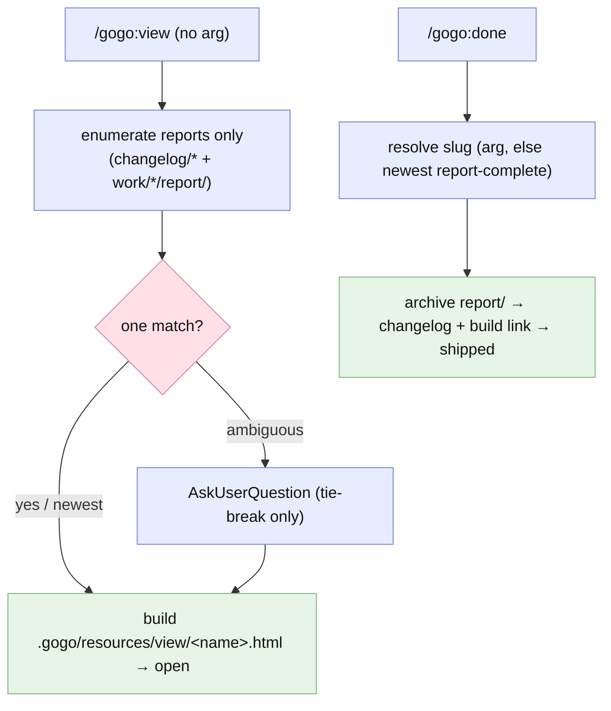
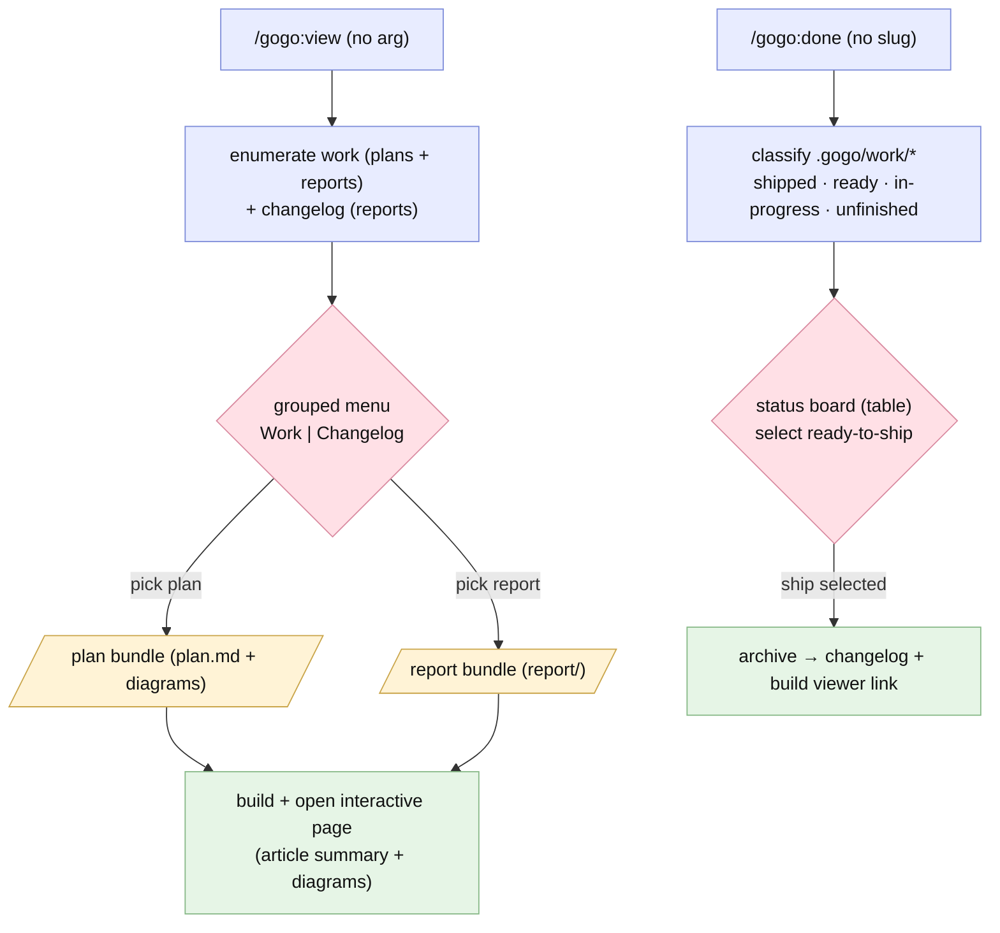

# Report — feature `viewer-bundles-and-done-board`

- **feature:** Viewer selection menu · plan/report view-bundles · friendlier output · `/gogo:done` work board (roadmap 1-4)
- **status:** done
- **completed:** 2026-07-01
- **branch / commits:** `main` · not yet committed (whole feature is a working-tree change; commit + ship later via `/gogo:done`)

## Run status / gaps

**All five phases completed cleanly and there are no open issues.** Plan → implement → review → test → report all ran; the implement↔review↔test loop settled over 7 implement / 4 review / 3 test rounds across the two stages. Every review and test finding is resolved — **6 review issues verified + 1 wontfix, 1 test issue verified + 1 wontfix** — with zero `open`/`new` items remaining in either contract. This is a clean green release, not a best-effort report.

## Summary

This feature makes gogo's own plans and reports **easy to browse and easy to ship**. Four roadmap items landed together. **`/gogo:view` gained a grouped selection menu** — with no argument it now lists a **Work** group (each feature's plan *and* report) and a **Changelog** group (shipped reports), newest first, so you pick what to read instead of the old reports-only, newest-by-default behaviour. **Plans are now first-class viewable bundles**: a plan renders in the same interactive page as a report — `plan.md` plus its diagrams, in place (no folder move). **Plans and reports now read like articles** — a strong lead summary, short scannable sections, and bold on the decisions and outcomes — enforced both in the authoring guidance and in the viewer's typography. And **`/gogo:done` gained a work board**: with no slug it classifies every feature in `.gogo/work/` (shipped · ready-to-ship · in-progress · unfinished) and, when the environment allows, opens a **real interactive terminal kanban** you drive to ship; otherwise it falls back to a status table with a multi-select. The whole thing stays **offline, zero-hard-dependency, and `.gogo/`-confined**, and ships as **plugin `0.7.0`** with the command count unchanged at **12**.

## Planned vs shipped

**Shipped essentially as planned** (roadmap items 1-4, FR1-FR5). The one material scope change was decided at planning time, not mid-build: **D2 was chosen as B (a fully interactive kanban) rather than A (a plain status table)**, which grew item 4 into its own **Stage B** and raised the load-bearing **D5** (how to build a board that can actually ship, given a `file://` page can't run `/gogo:done`). Everything else matched the accepted plan.

| Area | Planned | Shipped | Delta |
|---|---|---|---|
| FR1 view menu | Grouped Work/Changelog `AskUserQuestion` picker incl. plans | Delivered; arg grammar `<slug>` (report-else-plan) / `<slug>:plan` / `<slug>:report` / `<date>-<slug>` / path | As planned |
| FR2 plan bundle | Plan viewable with the report renderer | Plan renders **in place** (`plan.md` + `charts/`), D1=A — no `plan/` folder move | As planned (D1=A) |
| FR3 friendlier output | Article/bold authoring + viewer typography | Guidance added to `gogo-plan` + `gogo-knowledge`; `viewer.css` article typography + compare grid | As planned (D4=A, legibility only) |
| FR4 done board | Interactive kanban + guaranteed fallback | **Terminal-TUI curses kanban** (`board.py` in tmux) **+** status-table/`AskUserQuestion` fallback; shared `gogo-status` classifier | Upgraded A→B (D2=B, D5=A) |
| FR5 docs + version | Docs/README/version sync | `README.md`, `docs/{commands,flow,architecture}.md`, `skills/gogo/SKILL.md`; `plugin.json` **0.7.0**; 12 commands | As planned |
| (rode along) | — | `.gitignore`: `roadmap.md` (REV-004 wontfix) + `__pycache__/`/`*.pyc` (TEST-002); diagram label-wrap fix (`mermaid-parse.js` + `viewer.css`) | Intentional extras |

## Implementation

The work was delivered in **two stages, lower-risk first**.

**Stage A — view menu · plan bundle · friendlier output (items 1-3).** `skills/gogo-view/SKILL.md` now **enumerates a grouped menu** — Work (each feature's plan + report) and Changelog (reports) — and resolves an explicit argument directly (no menu) via the grammar `<slug>` = report-else-plan, `<slug>:plan`, `<slug>:report`, `<date>-<slug>`, or a path. A **plan-bundle build path** renders `plan.md` and its `charts/` diagrams with the same interactive renderer reports use, **in place** (D1=A — the contract path never moves). The thin `commands/view.md` wrapper was rewritten to match. For legibility (FR3), `gogo-plan` and `gogo-knowledge` gained **article-style authoring guidance** (lead summary, bold the decisions/outcomes/key terms, scannable lists/tables), and `assets/viewer/viewer.css` gained **article typography plus a compare grid**. A subtle Markdown pre-render bug (soft-wrapped list items splitting into single-item lists with restarted numbering) was fixed by adding **continuation-line coalescing** to the viewer's summary→HTML step. Stage A also built the **shared work-index classifier** that Stage B needs.

**Stage B — interactive kanban (item 4, D5=A).** A new **shared classifier** in `skills/gogo-status/SKILL.md` (Step A) tags every `.gogo/work/feature-*` as **shipped / ready-to-ship / in-progress / unfinished** with first-match precedence, emitting a `{slug, class, title, status}` record shape the board consumes. `skills/gogo-done/SKILL.md` gained a **no-slug board mode**: if `python3` + `tmux` + a tty are present it launches the vendored **`assets/kanban/board.py`** curses TUI; otherwise it degrades to a **status table + `AskUserQuestion` multi-select**. `board.py` is a **pure-stdlib, read-only *selector*** — it never archives or mutates gogo state; it only writes a `{"ship":[...]}` result and enforces a **ready-only guard** (non-ready slugs dropped, duplicates deduped). Shipping stays **single-sourced** in `gogo-done`'s "Ship one feature" flow (archive the report bundle → `.gogo/changelog/<date>-<slug>/` → build the viewer link), which both `/gogo:done <slug>` and the board route through.

The interactive launch is deliberately **robust** (the fixes from review round 4): it is **nesting-safe** — inside an existing tmux session it uses `new-window` + `wait-for` (a bare `new-session` refuses to nest), and outside it uses `new-session -A -s gogo-done-$$` (a PID-unique name so a stale session can't collide). The board records **its own exit code** to `board-exit.code`, and the skill routes **three distinct outcomes**: a result file present → ship each pick; `code==1` with no result → the board ran and the user cancelled (ship nothing); **missing code / `code==2` / anything else → the status-table fallback** (never a silent no-op). `board.py` documents the contract as **exit 0 = confirmed, 1 = cancel, 2 = error/bad-index**, and guards its index load so a missing/malformed file prints one stderr line and returns 2 instead of dumping a traceback.

### Changes (as-built)

| File | Change | Note |
|---|---|---|
| `skills/gogo-view/SKILL.md` | modified | Grouped Work/Changelog enumeration incl. plans; plan-bundle build path (in place, D1=A); arg grammar `<slug>[:plan\|:report]`/`<date>-<slug>`/path; H1 + opening reworded to "plans & reports" (REV-005); Step 3 continuation-line coalescing (REV-003) |
| `commands/view.md` | modified | Rewritten thin to match the skill: broadened description, `argument-hint` with `:plan`/`:report`, delegates (REV-001) |
| `skills/gogo-plan/SKILL.md` | modified | Article/bold authoring guidance (FR3); plan diagram set is viewer-ready |
| `skills/gogo-knowledge/SKILL.md` | modified | Article/bold report authoring guidance (FR3) |
| `assets/viewer/viewer.css` | modified | Article typography (lead paragraph, headings, emphasis) + before/after compare grid; label wrap (`max-content`/`overflow-wrap`) |
| `assets/viewer/mermaid-parse.js` | modified | Label TreeWalker fix so diagram words don't glue/break |
| `skills/gogo-status/SKILL.md` | **added** | Shared work-index classifier (Step A): 4 classes, first-match precedence, `{slug,class,title,status}` record |
| `commands/status.md` | modified | Thin; delegates to the new `gogo-status` skill |
| `skills/gogo-done/SKILL.md` | modified | No-slug board mode; nesting-safe TUI launch; three-outcome routing; single-sourced ship; degradation spec |
| `commands/done.md` | modified | Thin; documents board mode |
| `assets/kanban/board.py` | **added** | Vendored `python3` curses TUI selector; pure stdlib; `--selftest`; exit-code contract 0/1/2; guarded index load (REV-007) |
| `skills/gogo/SKILL.md` | modified | View section: plans + reports, grouped picker, plans in place (REV-002) |
| `docs/commands.md`, `docs/flow.md`, `docs/architecture.md` | modified | FR5 docs sync (menu, plan-viewing, done board, `assets/kanban/`) |
| `README.md` | modified | FR5 sync (view menu, plan bundles, done board) |
| `.claude-plugin/plugin.json` | modified | Version → **0.7.0** |
| `.gitignore` | modified | `roadmap.md` (internal backlog, REV-004 wontfix) + `__pycache__/`/`*.pyc` (TEST-002) |

## Decisions & rationale

Reconciled from [decisions.md](../decisions.md) with the choices made across the implement rounds. Every fork was resolved by the user on 2026-07-01.

| Decision | Choice | Reason |
|---|---|---|
| **D1 — Plan bundle location** | **A** — keep `plan.md` at the feature root; view in place (`plan.md` + `charts/`) | `plan.md` is the contract path every phase reads; viewing it in place delivers plan-viewing with near-zero blast radius vs. moving it to a `plan/` folder |
| **D2 — Done board interactivity** | **B** — build the fully interactive kanban now | The user wanted the real drag→ship board immediately, not deferred to roadmap #7; this grew item 4 into Stage B and raised D5 |
| **D3 — View menu mechanism** | **A** — `AskUserQuestion` grouped picker | Simplest, stays in-terminal; the chosen item still opens the rich interactive HTML page — no generated index page needed |
| **D4 — Friendlier-output scope** | **A** — authoring guidance + viewer CSS typography | Legibility only; don't churn the proven report/plan section structure |
| **D5 — Interactive kanban mechanism** | **A** — terminal TUI (tmux + vendored `python3` curses) that truly ships on drop; `python3`/`tmux` are **soft deps** with graceful fallback | A `file://` HTML page can't execute `/gogo:done`, so only a local terminal process can close *drag-card → ship* in one surface; the soft-dep fallback keeps the portability bar. This TUI is also the shared base for roadmap #7's plan/decision commenter |

## Review outcome

**Four review rounds; verdict APPROVE with no open blockers or majors.** Stage A round 1 raised REV-001..005 (1 major, 2 minor, 2 nits); round 4 reviewed Stage B + the FR5 sweep with fresh eyes and raised REV-006 (minor) + REV-007 (nit). **All six actionable findings are verified fixed; REV-004 is a deliberate wontfix.** Highlights:

- **REV-001 (major, verified)** — `commands/view.md` was left describing reports-only; rewritten thin to match the skill (mirrors the updated `commands/status.md`).
- **REV-002/003/005 (minor/nit, verified)** — `skills/gogo/SKILL.md` View blurb, the soft-wrapped-list pre-render bug, and the `gogo-view` H1/intro drift — all corrected; the sample plan page regenerated to prove the list fix.
- **REV-004 (nit, wontfix)** — the `.gitignore` `roadmap.md` entry is an intentional user request (gitignore the internal local backlog), kept as-is.
- **REV-006 (minor, verified)** — the tmux launch was fragile inside tmux / on a stale session and silently read a launch failure as a cancel; made nesting-safe and split into three distinct outcomes routing any launch error to the fallback.
- **REV-007 (nit, verified)** — `board.py` dumped a traceback on a missing/malformed `--index`; now prints one stderr line and returns a distinct exit 2.

See [review-01.md](../review-01.md), [review-02.md](../review-02.md), and the living [review/issues.json](../review/issues.json).

## Test outcome

**Three test rounds; verdict GREEN.** The plugin has no automated suite (it's a markdown plugin), so testing is **dogfooding + artifact inspection**, plus live exercise of the one executable this feature added.

- **CLI / `board.py` (all live, `python3` 3.14 on macOS):** compile check, `--selftest` (7/7), and the full **exit-code contract** — missing/garbage `--index` (file and stdin) all exit **2** with a one-line stderr and **no traceback**; headless `--ship` emits `{"ship":[...]}` at exit 0; the **ready-only guard** drops non-ready slugs and deduplicates; empty/whitespace index → exit 0, empty ship list. Pure-stdlib, pure-ASCII, no network — all verified.
- **Fallback dogfood (the live path here — tmux is absent on the dev host):** a 5-state fixture `.gogo/work` tree exercised the classifier across **all four classes** (the fixture also gives the `unfinished` class a live exemplar), and the "Ship one feature" archive step was simulated end-to-end (date derived, bundle copied, `state.md` flipped to shipped, **no writes outside `.gogo/`**).
- **Interactive TUI path (code-read + reasoned, no tmux):** REV-006's three-outcome routing verified by code-read; no bare `new-session -s gogo-done` assumption remains; inside-tmux uses `new-window` + `wait-for`, outside uses `new-session -A -s`. Manual steps for a tmux-capable host are recorded in the test snapshot.
- **FR5 sync:** `plugin.json` 0.7.0, 12 commands, `assets/kanban/` documented in `architecture.md`, README/docs consistent — no stale "reports only" / "ships one only" language.

Issues: **TEST-001 (nit, wontfix)** — the `unfinished` class had no live exemplar in the real tree (now covered by the test fixture; informational, not a defect). **TEST-002 (nit, verified)** — `assets/kanban/__pycache__/` was untracked with no ignore rule; added `__pycache__/` + `*.pyc` to `.gitignore` so the vendored `board.py` never drags in compiled bytecode.

See [test-01.md](../test-01.md), [test-02.md](../test-02.md), and the living [test/issues.json](../test/issues.json).

## Diagrams

The as-built set — open [diagrams.html](./diagrams.html) (same folder). Chosen by what the diff introduced: a **flow** (the shipped view-menu + done-board data flow) and a **sequence** (the new Stage B runtime interaction). No class/activity/use-case diagram — the change added no new persistent types or domain state machine worth a separate chart, and the user-facing capability is already carried by the flow.

- **`view-done-flow.mmd`** (flow) — `/gogo:view` grouped menu (plans + reports) building the interactive page, and `/gogo:done` classifying work → status board → ship.
- **`done-board-flow.mmd`** (sequence) — the as-built `/gogo:done` work board: classify → TUI kanban *or* table fallback → single-sourced ship each pick to the changelog.

## Before / after comparison

Plan ① captured an as-is baseline (copied into this bundle as `report/before/current-view-done.mmd`). Both the before and the after **flow** kind are present, shown side by side below. The **sequence** kind is **after-only** (added) — there was no prior runtime interaction to depict because the old `/gogo:done` simply resolved one slug and archived it.

**Before — `/gogo:view` (reports only, newest by default) + `/gogo:done` (ships one):**

**After — `/gogo:view` grouped menu (plans + reports) + `/gogo:done` status board:**

**What changed.** `/gogo:view` went from **reports-only, newest-by-default** (the menu was a mere tie-breaker) to a **grouped Work/Changelog picker that includes plans as first-class bundles**. `/gogo:done` went from **"resolve one slug and archive"** to **"classify all work → a status board → ship the selected ready-to-ship items"**, with archiving now single-sourced across both the board and the `<slug>` path. The **added sequence diagram** captures the new runtime interaction the before set had no analogue for: the classify → TUI-or-fallback → ship loop.

## Knowledge updates

Reconciled `.gogo/knowledge/*` for genuine drift from this feature (owned files edited directly; the proxy edited in its overrides section only — never the upstream source):

- **`tech-stack.md`** (owned) — added **Python** as a repo language (the vendored `assets/kanban/board.py` stdlib curses TUI) and listed **`python3` + `tmux`** under optional tooling (soft deps for the `/gogo:done` board).
- **`non-functional-requirements.md`** (owned) — recorded **`python3`/`tmux` as optional soft deps** (detected at use, graceful fallback) and added a footprint bar: **vendored Python must never ship compiled bytecode** (`__pycache__/`, `*.pyc` ignored).
- **`test-strategy.md`** (owned) — added how to verify a **soft-dep interactive surface** (a TUI): exercise the **graceful-fallback path** as the tested path plus the tool's own `--selftest` and code-read of the interactive routing; the curses/tmux path itself is **manual-test-only** (no Playwright for TUIs; document manual steps).
- **`testing-tools.md`** (owned) — noted that **vendored Python tools ship a `--selftest`**; run `python3 <tool> --selftest` as a live check.
- **`coding-rules.md`** (owned) — added a convention for **vendored *executable* assets** (distinct from the third-party `mermaid.min.js` snapshot): pure-stdlib, pure-ASCII, ship a `--selftest`, a documented exit-code contract, and no committed bytecode.
- **`project-knowledge.md`** (proxy → `README.md`) — added a **"since 0.7.0"** milestone bullet to the `## gogo overrides` section only (the README itself was already synced by FR5, so nothing to upstream).

**Consider upstreaming:** none required — FR5 already synced `README.md` and `docs/*` for this feature, so the proxied upstream is current. No `CLAUDE.md`/README edits are outstanding.

## Follow-ups & known limitations

- **Interactive TUI is unexercised on this host.** `tmux` is absent on the dev machine, so the curses kanban's live path is verified only by `--selftest` + code-read + the fallback dogfood. A tmux-capable host should run the manual steps in [test-02.md](../test-02.md) once.
- **No regression fixture for `board.py` in the repo.** The 5-state classifier fixture and headless `--ship` checks were run in scratch, not committed. If future regression coverage is wanted, add a fixture `.gogo/work` tree (incl. a plan-only `unfinished` exemplar) to a test harness (TEST-001).
- **Roadmap items 5-10 remain out of scope:** the line-by-line **plan/decision commenter (#7)** — only its board machinery was pulled forward here (D2=B/D5); the **DevOps knowledge file (#5)**, **YOLO mode (#6)**, **custom-agent injection (#8)**, **multi/mono-repo (#9)**, and **Claude Design (#10)**.
- **Not yet committed.** The entire feature is a working-tree change on `main`; commit and ship it (via `/gogo:done`) when ready.
