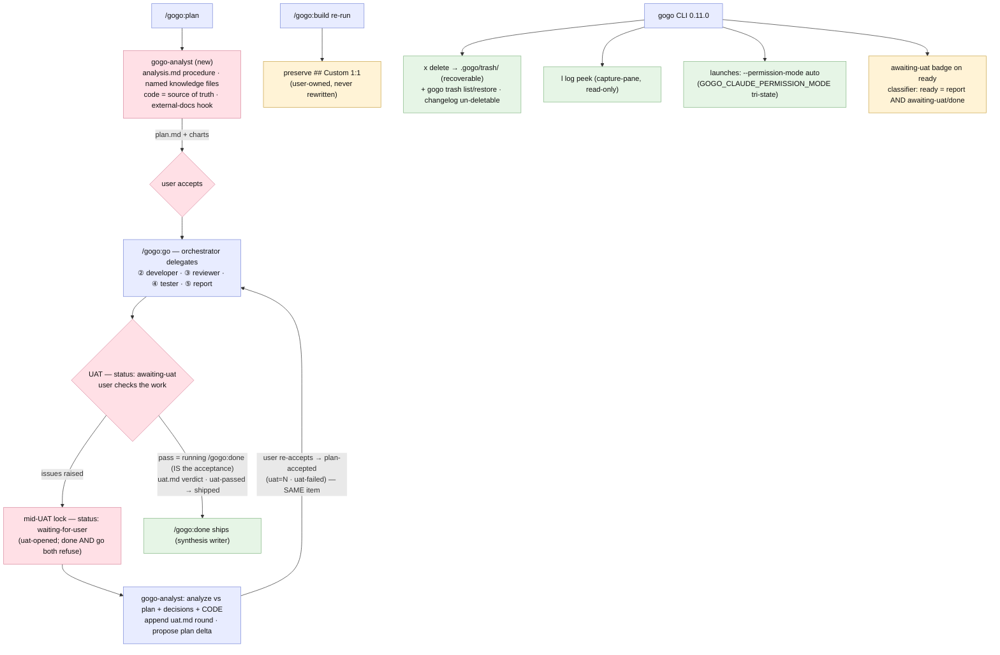

# Plan — feature `analyst-uat-and-cli-ops`

Status: **as-built** (report ⑤, 2026-07-04 — shipped as **0.11.0** plugin + CLI; accepted round 2: D1=custom plan-gate symmetry · D2=custom auto-mode+slim-done · D3=A trash · D4=A badge; staged A/B/C. The intended design held; two hardening deltas were added en route (the mid-UAT lock, the classifier status-gate) — see the as-built deltas below and `report/report.md`. Fittingly, ⑤ itself now ends at `awaiting-uat`: this feature exits through the gate it built.)

## As-built deltas (phase ⑤)

The shipped system matches the intended design — same three stages, same
state-machine extension, every contract change additive. What moved, and where
it is recorded:

0. **The two plan-gate redirects (plan round 2, pre-acceptance — logged in
   [adjustments.md](./adjustments.md)):** D1 became **custom — the plan-gate
   symmetry** (no "UAT passed?" confirm question: running `/gogo:done` IS the
   acceptance, recorded as the `uat.md` verdict line; questions route to
   `gogo-analyst` instead), and D2 became **custom — auto mode + a slimmer done**
   (launches use Claude's auto/classifier permission mode with the
   `GOGO_CLAUDE_PERMISSION_MODE` env tri-state — NOT `--dangerously-skip-permissions`
   — and `gogo-done` was slimmed to read/write/copy + synthesis so auto mode
   covers everything it does). These shaped FR4/FR8 before any code was written.
1. **The mid-UAT lock** (REV-004, review round 2 → fixed round 3): the moment the
   user raises UAT issues, the orchestrator sets `status: waiting-for-user`
   (`open-decision: UAT round N`, `resume: plan`) BEFORE delegating to the
   analyst, and only the user's re-acceptance flips it to `plan-accepted`. A
   mid-re-plan feature therefore fails BOTH `/gogo:done`'s validate-in (needs
   `awaiting-uat`) and `/gogo:go`'s gate (needs `plan-accepted`) — the accept
   branch and the re-plan branch are mutually exclusive, as D1 requires. Mirrors
   the existing decision-gate pattern; the CLI badge shows `waiting-for-user`
   (winning over `awaiting-uat`).
2. **The classifier status-gate** (TEST-004, test round 1 → fixed round 6):
   ready-to-ship now requires **a final report AND status `awaiting-uat` (or
   legacy `done`)** — report-presence alone no longer suffices, so a UAT rerun's
   stale `report/` (status implementing/reviewing/testing/plan-accepted/
   waiting-for-user) classifies **in-progress**. Amended together in the frozen
   contract (additive 0.11.0 clarification), `gogo-status`, and the Go classifier.
   The only reading under which the UAT loop's one-legal-command property
   survives at the classifier layer.
3. **Exact-match session attribution** (TEST-005, test round 1 → fixed round 6):
   `hasLiveSession`/`liveSessionFor` no longer substring-match — the new
   `launch.SessionMatchesSlug` parses the `gogo-<action>-<sanitized-slug>`
   convention (plus the numeric collision suffix) and matches the slug exactly,
   so one feature's live session can never be attributed (or peeked/attached) to
   another whose slug is a textual substring.
4. **Scale of the Go delta:** 33 new CLI tests across implement rounds 4–6
   (+25 Stage C · +5 review-nit hardening · +3 test-round fixes), all
   `gofmt`/`vet`/`-race` green; CLI `Version` = plugin.json = **0.11.0**.

## Goal

Pipeline v2, in three moves. **Planning gets a specialist**: a new `gogo-analyst` agent driven by a new `analysis.md` knowledge file that says exactly *how* to analyze a feature and *which* files to read (code = source of truth), replacing today's vague "read the knowledge". **The loop gets a human gate at the end**: a **UAT phase** between `/gogo:go` and `/gogo:done` — you check the work; issues route back to planning *inside the same work item* (`uat.md` records your input, the plan adjusts, `/gogo:go` reruns). **The CLI grows ops muscles**: delete work items from the board, peek at a session's log without attaching, and launched `claude` sessions run **without permission nags**. Plus: `/gogo:build` learns to preserve user-owned `## Custom` sections 1:1, and the orchestrator-first architecture is made explicit for every command.

## Context — what exists

- **Planning today** (`skills/gogo-plan/SKILL.md`): run by the orchestrator in-chat; preconditions say "read project-knowledge, tech-stack, NFR, coding-rules" — no procedure for *how* to analyze, no per-file specificity, no external-docs hook. ② ③ ④ have specialist agents (`gogo-developer/-reviewer/-tester`); ① has none.
- **The loop today**: plan → accept → go (②③④⑤) → `state.md: done` → `/gogo:done` ships. **No user verification step** — report-complete goes straight to shippable (classifier: report exists ⇒ ready-to-ship).
- **`/gogo:build` re-runs** preserve `## gogo overrides` (gogo-authored notes) and `Mode: owned` bodies — but there is no **user-owned never-touched** section convention, and nothing asks about it.
- **CLI launches** (`cli/internal/launch/launch.go`): `tmux new-session -d -c <root> claude "<cmd>"` / `claude -p` — no permission flags, so scripts the shipped skills run (e.g. `python3` validation helpers) trigger approval prompts inside a session nobody is watching. Sessions ARE user-initiated behind a huh confirm.
- **CLI board**: no destructive ops (by design so far); session interaction = full `a` attach only; `.gogo/resources/cli/logs/` exists for `-p` fallback logs; tmux `capture-pane` proven throughout this project.
- **Classifier + contract** (`docs/cli-contract.md`, frozen): 4 classes; `state.md` status enum documented — a UAT state extends both (versioned with the plugin).

## Functional requirements

### Stage A — planning intelligence (plugin)
- **FR1 — `analysis.md` knowledge file.** New 10th knowledge file (template + `/gogo:build` wiring + `index.md` + docs): *how to analyze a feature in THIS project* — the ordered checklist of what to inspect (entry points, the modules a change touches, tests as behavior spec, recent git history), which knowledge files to read **by name and phase**, when to consult external docs (an explicit hook: "if a `notion`/`confluence`/other doc skill is available and the feature references external specs, use it"), and the **code-is-source-of-truth rule** (on doc/code conflict, code wins — verify claims against the tree). Build synthesizes it per-project like the other owned files.
- **FR2 — `gogo-analyst` agent.** New agent (`agents/`, alongside developer/reviewer/tester): phase ①'s specialist. `gogo-plan` becomes its operating manual: read the knowledge set **explicitly by file name** (project-knowledge, tech-stack, NFR, coding-rules, **analysis.md**), execute analysis.md's procedure against the actual codebase, and produce the plan + intended-design charts + the FRs. The orchestrator delegates ① to it and keeps the acceptance gate in chat.
- **FR3 — orchestrator-first, explicit.** Every command's docs + the `gogo`/command skills state the architecture uniformly: **commands invoke the orchestrator; the orchestrator delegates every phase to its specialist agent** (① analyst · ② developer · ③ reviewer · ④ tester · ⑤ orchestrator/knowledge) and owns the gates in chat. Standalone phase commands route the same way (thin → orchestrator → agent).

### Stage B — the UAT gate + build custom sections (plugin)
- **FR4 — UAT phase between go and done (the plan-gate symmetry).** Report ⑤ now ends at **`status: awaiting-uat`** (not `done`). The gate mirrors plan acceptance — no extra question:
  - **acceptance = running `/gogo:done`** (its validate-in requires `awaiting-uat`; the run itself records the `uat.md` verdict line — "accepted by /gogo:done, <date>" — and ships as today);
  - **questions/issues instead** → the orchestrator hands the user's input to **`gogo-analyst`** (Stage A's agent — this is its second job): analyze it against the current `plan.md` + `decisions.md` **and the code**, append the **`uat.md`** round (user input verbatim + analysis + proposed plan delta), update `plan.md` (adjustments.md logs it), user **re-accepts**, `/gogo:go` reruns ②→⑤ → back to `awaiting-uat`. Same work item, never a new one; iterations track `uat=N`.
  - Contract updates: state enum + events (`uat-opened`/`uat-passed`/`uat-failed` — additive schema bump), classifier (`awaiting-uat` still classifies **ready** with an `awaiting-uat` badge in the CLI), `docs/cli-contract.md` + flow/commands docs + README.
- **FR5 — `## Custom` sections in knowledge files.** Convention: any knowledge file may carry a **`## Custom`** section — **user-owned, copied 1:1, never rewritten** by `/gogo:build` or phase-⑤ reconciles. Build re-runs detect existing `## Custom` sections and preserve them verbatim (and say so in the run summary); the templates mention the convention; docs (build command, architecture, knowledge docs) document it alongside `## gogo overrides` (overrides = gogo-authored notes; Custom = yours, untouchable).

### Stage C — CLI ops (cli/, version 0.11.0)
- **FR6 — delete work from the board.** `x` (or `delete`) on a focused card → huh confirm (slug typed back or explicit confirm) → the work folder moves to **`.gogo/trash/<timestamp>-<slug>/`** (recoverable — never `rm -rf`); changelog entries are NOT deletable from the board (append-only archive). Board reloads; a `gogo trash` subcommand lists/restores. The one place the CLI writes outside `.gogo/resources/` — document it in the CLI contract.
- **FR7 — session log peek.** `l` on a card with a live session (or from the sessions list) → a viewer showing the session's recent output (`tmux capture-pane -p -S -<N>` snapshot; `r` refresh, or light auto-refresh) — read-only, no attach, quits back to the board. For `-p` background runs, tail the log file instead.
- **FR8 — launched sessions don't nag (auto mode + a slimmer done).** Two halves:
  - `launch.go` starts claude in **auto (classifier-based) permission mode** (the implementer verifies the exact flag against `claude --help`; the user's own ship session ran under "auto mode" with safe commands auto-allowed) — env `GOGO_CLAUDE_PERMISSION_MODE` overrides to stricter/looser; the huh confirm states the mode. NOT full bypass.
  - `skills/gogo-done/SKILL.md` is **slimmed to match its real job** — "prepare the changelog entry from the work item's report + files": read/parse → synthesize `report.md` → copy `.mmd`/manifests → flip state — plain file operations auto mode approves; drop/avoid any incidental script execution the skill doesn't strictly need. Decision gates (AskUserQuestion) are unaffected either way.
- **FR9 — sync.** CLI `Version` 0.11.0 = plugin.json 0.11.0; contract doc additions (trash, uat badge, events additions); README/docs sweep; classifier badge; tests for all three FRs (incl. trash safety + the capture-pane peek via tmux fixtures).

## Approach (recommended)

**Specialize ①, gate the exit, keep every contract additive.** The analyst mirrors the proven specialist pattern (fresh-context agent + skill-as-manual) and analysis.md makes its procedure a per-project contract rather than prompt folklore. UAT is a state-machine extension, not a new pipeline: one new status + one artifact (`uat.md`) + a re-entry path that reuses the existing plan-acceptance gate — the same work item loops until you say ship. CLI changes stay in the deterministic-reader/Claude-executor split: delete is the one new (recoverable, trash-based) mutation, explicitly contracted; log peek is read-only capture-pane; permission mode is a launch flag with an escape hatch.

*Alternatives considered:* a separate `/gogo:uat` command (rejected: the gate lives naturally in `/gogo:done`'s validate-in + the chat loop; fewer commands); hard-delete on the board (rejected: irreversible from a TUI — trash + restore); `bypassPermissions` hardwired with no escape (rejected: env override kept); a new board column for awaiting-uat (rejected: classifier classes stay stable — badge instead); building analyst as in-chat-only guidance (rejected: ① deserves the same fresh-context isolation as ②③④).

## Changes checklist (build order)

**Stage A** — 1. `templates/knowledge/analysis.template.md` + build wiring + `index.md`; 2. `agents/gogo-analyst.md`; 3. `skills/gogo-plan/SKILL.md` rewrite (explicit files, analysis procedure, external-docs hook, delegation); 4. `skills/gogo/SKILL.md` + `commands/*` orchestrator-first sweep.
**Stage B** — 5. UAT: `gogo-knowledge` (⑤ → awaiting-uat), `gogo-done` (validate-in + uat.md + confirm), `gogo`/`gogo-status` (re-entry loop + classifier note), `events.schema.json` (+3 events), templates (state/uat), `docs/cli-contract.md` + docs/README; 6. build `## Custom` preservation + docs.
**Stage C** — 7. cli: trash delete + `gogo trash`, log peek, launch permission flags, badge, tests; 8. versions 0.11.0 + sweep.

## Tests

- **A:** fixture project → build synthesizes analysis.md; analyst dogfood-plans a toy feature reading the named files (grep the trail); orchestrator-first wording sweep.
- **B:** dogfood the UAT loop on a fixture: ⑤ → awaiting-uat → fail with notes → uat.md round + plan adjusted + re-accept → rerun → pass → done ships with uat.md recorded; build re-run preserves a `## Custom` section byte-for-byte; events validate.
- **C:** Go tests (trash move + restore + changelog-guard; peek rendering; launch flag matrix incl. env override); live tmux: delete a fixture card (lands in trash), `l` peek on a live session, a launch carrying the permission flag; `-race` green; contract-doc sync check.

## Out of scope

- Actual notion/confluence skills (analysis.md defines the *hook*; the skills come when needed), auto-UAT (it's human by definition), multi-item trash ops, permission-mode UI in the TUI beyond the confirm note, renaming existing statuses (additive only).

## Intended design (as-built — the UAT branch gained the mid-UAT lock; retained as `report/flow.mmd`)

## Summary (TL;DR)

- **What:** a `gogo-analyst` agent + `analysis.md` (how/what to analyze, code = truth) · a **UAT gate** between go and done (issues loop back into the SAME work item via `uat.md`) · `## Custom` sections build never touches · CLI: delete-to-trash, session log peek, no-nag launches.
- **Why:** plans get rigor, ships get human sign-off, your knowledge edits survive rebuilds, and the board becomes a full ops surface.
- **How:** three stages (A plan-intelligence · B UAT+custom · C CLI 0.11.0), every contract change additive.
- **Next:** accept → `/gogo:go`.
