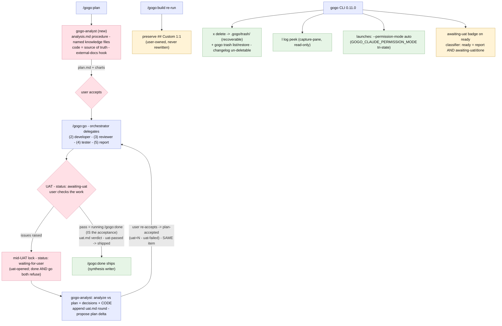
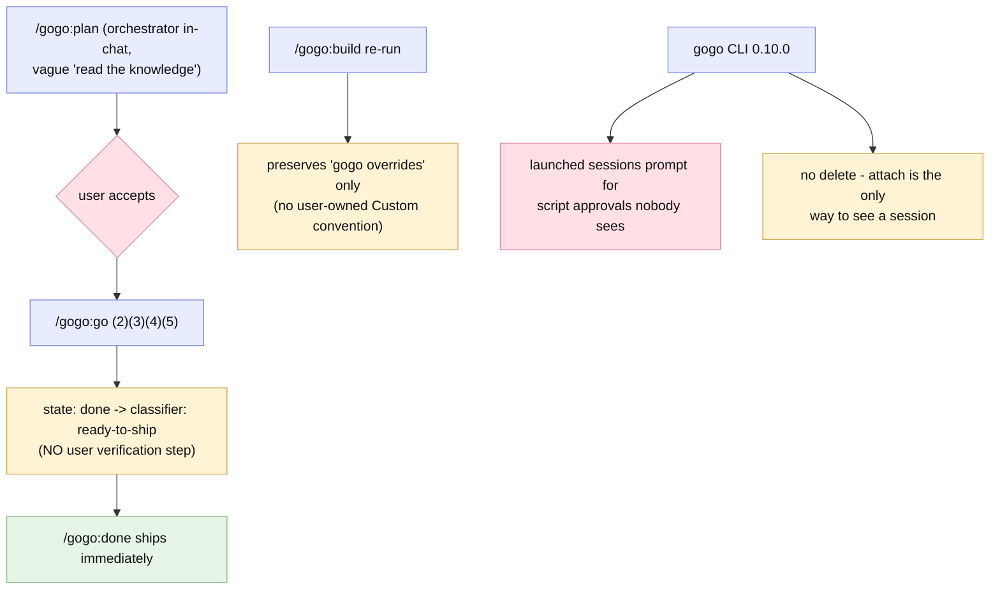

# Report — feature `analyst-uat-and-cli-ops`

- **feature:** `gogo-analyst` + `analysis.md` planning intelligence · the **UAT gate** (`awaiting-uat` + `uat.md`, same-item loop) · `## Custom` sections preserved 1:1 · orchestrator-first architecture · CLI ops (delete-to-trash, session log peek, no-nag launches) — **0.11.0**
- **status:** awaiting-uat
- **completed:** 2026-07-04
- **branch / commits:** main (uncommitted working tree at report time)

## Run status / gaps

**All phases completed; no open issues.** Three stages (A = planning intelligence, B = the UAT gate + `## Custom`, C = CLI ops) ran through **6 implement, 3 review, and 1 test rounds**. **22 findings total (REV-001..012 + TEST-001..010) — all 22 verified fixed, zero open, zero deferred.** Every fix round closed with live proof (real `gogo status` binary runs, tmux capture, `-race` green), and the two headline CLI majors were **re-reproduced live in both directions** after the fix. And a first: this report itself ends at **`status: awaiting-uat`** — the feature exits through the gate it built.

## Summary

**The pipeline got a brain at the front and a human gate at the back.** Phase ① now has its own specialist — the **`gogo-analyst`** agent, driven by **`analysis.md`**, a new 10th knowledge file that turns "read the knowledge" into an ordered, per-project procedure: which files to read **by name**, what to inspect in the code (entry points, behavior specs, git history, blast radius), a conditional **external-docs hook**, and the **code-is-source-of-truth** rule. At the other end, report ⑤ no longer ends at `done`: it lands at **`awaiting-uat`**, where the user verifies the work — **running `/gogo:done` IS the acceptance** (the plan-gate symmetry), while issues route back to the analyst and re-plan the **same work item** (`uat.md` records every round; `uat=N` tracks iterations).

Around that core: `/gogo:build` and phase ⑤ now preserve user-owned **`## Custom`** sections byte-for-byte in every knowledge file, every command's docs state the **orchestrator-first** architecture uniformly, and the **CLI grew ops muscles** — `x` deletes a card to a recoverable **`.gogo/trash/`** (with `gogo trash` list/restore and the changelog un-deletable at two layers), `l` peeks at a live session's output read-only, and board launches run Claude in **`--permission-mode auto`** (a `GOGO_CLAUDE_PERMISSION_MODE` tri-state overrides) so shipped skills stop nagging a session nobody is watching.

## Planned vs shipped

**The accepted plan (round 2) held — same three stages, same state-machine extension, every contract change additive.** The user's two gate comments were folded in *before* acceptance ([adjustments.md](../adjustments.md)): **D1 became the plan-gate symmetry** (no "UAT passed?" confirm — `/gogo:done` is the acceptance) and **D2 became auto mode + a slimmer done** (never `--dangerously-skip-permissions`). Three as-built deltas were added en route, all hardening the plan's own invariants:

1. **The mid-UAT lock** (REV-004): raising UAT issues immediately sets `status: waiting-for-user` — held through the analyst round until re-acceptance — so a mid-re-plan feature fails **both** `/gogo:done`'s gate (needs `awaiting-uat`) and `/gogo:go`'s (needs `plan-accepted`). The accept and re-plan branches are now mutually exclusive, as D1 requires.
2. **The classifier status-gate** (TEST-004): ready-to-ship = **a final report AND status `awaiting-uat` (or legacy `done`)** — a UAT rerun's stale `report/` no longer classifies as shippable. An additive 0.11.0 contract clarification, changed together in the Go classifier, `gogo-status`, and `docs/cli-contract.md`.
3. **Exact-match session attribution** (TEST-005): the board matches tmux sessions to slugs by parsing the `gogo-<action>-<sanitized-slug>` convention exactly (new `launch.SessionMatchesSlug`), replacing a substring check that cross-attributed sessions between features with overlapping slugs.

Everything else shipped as written; nothing was dropped.

## Implementation

**Stage A — planning intelligence (plugin).** `templates/knowledge/analysis.template.md` scaffolds the new 10th knowledge file (build's wildcard copy wires it with no special-casing); **`agents/gogo-analyst.md`** joins developer/reviewer/tester as phase ①'s fresh-context specialist, with `gogo-plan/SKILL.md` rewritten as its operating manual — the 5 knowledge files named in reading order, `analysis.md`'s procedure executed against the actual tree, the external-docs hook capability-detected. Every command doc now states the **orchestrator-first** chain uniformly: command → orchestrator → specialist agent (⑤ the orchestrator runs itself via `gogo-knowledge`).

**Stage B — the UAT gate (plugin).** A state-machine extension, not a new pipeline: ⑤'s green path ends at **`awaiting-uat`**; `/gogo:done`'s validate-in requires it (and **refuses** `waiting-for-user`); acceptance is recorded as the `uat.md` verdict line; issues trigger the **lock → analyst → plan delta → re-accept → rerun** loop on the same item. Three additive events (`uat-opened`, `uat-failed`, `uat-passed`) with single owners; `templates/uat.template.md` pins the round shape; pre-0.11 `status: done` features still ship (back-compat clause). Plus the **`## Custom`** convention: user-owned, copied 1:1 by build (default and `--force`), exempt from phase-⑤ reconciles AND from `/gogo:skills`' budget and extraction.

**Stage C — CLI ops (`cli/`, 0.11.0).** A new `internal/trash` package: `x` moves a work folder to `.gogo/trash/<ts>-<slug>/` (rename with a data-safe EXDEV copy fallback; symlink-faithful, cycle-proof), `gogo trash` lists/restores (collision-refusing), and the changelog is un-deletable at the UI **and** the package boundary (`requireUnderWork`). `l` opens a read-only peek viewer (`tmux capture-pane` snapshot, `r` refresh, background-log tail for `-p` runs — never an attach). Launches carry `--permission-mode auto` with the `os.LookupEnv` tri-state (unset → auto · set → verbatim · empty → flag omitted). Badges: `awaiting-uat` on ready cards, `waiting-for-user` winning mid-UAT. **33 new Go tests** across rounds 4–6; `gofmt`/`vet`/`-race` green throughout; CLI `Version` = plugin.json = **0.11.0**.

### Changes (as-built)

| File | Change | Note |
|---|---|---|
| `templates/knowledge/analysis.template.md` · `.gogo/knowledge/analysis.md` | added | the 10th knowledge file — analysis procedure, named files, code=truth, external-docs hook |
| `agents/gogo-analyst.md` | added | phase ① specialist; second job: analyze UAT feedback into a plan delta |
| `skills/gogo-plan/SKILL.md` | modified | the analyst's operating manual — explicit file list, procedure, delegation |
| `skills/gogo/SKILL.md` | modified | UAT loop (lock → analyst → re-accept → rerun), orchestrator-first, event ownership |
| `skills/gogo-knowledge/SKILL.md` | modified | ⑤ green path → `awaiting-uat`; `## Custom` guard; phase-started/done report events |
| `skills/gogo-done/SKILL.md` | modified | validate-in requires `awaiting-uat` (refuses `waiting-for-user`); `uat.md` verdict; slimmed to read/write/copy + synthesis |
| `skills/gogo-build/SKILL.md` · `skills/gogo-skills/SKILL.md` · `skills/gogo-status/SKILL.md` | modified | `## Custom` 1:1 preservation + budget/extraction exemption; classifier status-gate |
| `templates/uat.template.md` · `templates/state.template.md` · `templates/report.template.md` | added / modified | the UAT round shape; state comment; example status → `awaiting-uat` |
| `templates/contracts/events.schema.json` | modified | +3 events (`uat-opened`/`uat-failed`/`uat-passed`), additive |
| `commands/*.md` · `docs/{cli-contract,flow,commands,architecture,index}.md` · `README.md` | modified | orchestrator-first sweep, UAT gate everywhere, 0.11.0 contract block, agents list, keymap |
| `cli/internal/trash/` (+ tests) | added | move-to-trash, list/restore, EXDEV-safe, package-level work-folder guard |
| `cli/internal/tui/{delete,peek,update,model,view,move}.go` (+ tests) | added / modified | `x` delete confirm, `l` peek viewer, badges, exact session match, Esc-cancel consistency |
| `cli/internal/launch/launch.go` (+ tests) | modified | `--permission-mode auto` + env tri-state; `SessionMatchesSlug` |
| `cli/internal/contract/contract.go` (+ tests) | modified | classifier: ready = report AND `awaiting-uat`/legacy `done` |
| `cli/main.go` · `.claude-plugin/plugin.json` | modified | `trash` subcommand, help, **0.11.0** both sides |

## Decisions & rationale

Full trail in [decisions.md](../decisions.md) — one line each:

| Decision | Choice | Reason |
|---|---|---|
| **D1 — the UAT gate mechanic** | **custom: plan-gate symmetry** — `/gogo:done` IS the acceptance; no confirm question; issues route to the analyst | mirrors how plan acceptance unlocks go; zero new commands, zero ceremony on the happy path |
| **D2 — launched-session permissions** | **custom: `--permission-mode auto`** + env tri-state, AND `gogo-done` slimmed to file ops + synthesis | delivers "no nagging" without full bypass — auto mode covers everything the slimmed skill does |
| **D3 — delete semantics** | **A: move to `.gogo/trash/`** + `gogo trash` restore; changelog un-deletable | destructive-from-a-TUI must be reversible; the changelog is an append-only archive |
| **D4 — awaiting-uat on the board** | **A: badge on ready** — classifier classes stay stable | the frozen contract stays additive; no fifth column for consumers to break on |
| REV-004 note (orchestrator-resolved) | mid-UAT lock = `waiting-for-user` until re-acceptance | the reviewer's recommended fix, no trade-off — makes the two UAT branches mutually exclusive |
| TEST-004 note (orchestrator-resolved) | classifier ready-to-ship gates on **status**, not artifact presence | the only reading under which the UAT loop's one-legal-command property survives at the classifier layer |
| Non-forks (recorded) | analysis.md = 10th owned file · external docs a hook, not skills · same-item UAT loop · versions move together | see [decisions.md](../decisions.md) |

## Review outcome

**Three rounds, one per stage; 12 findings (REV-001..012), all verified fixed.** Round 1 (Stage A) caught the recurring **enumeration-sync major** (README still said "nine" knowledge files) + a uniformity nit — both fixed inline. Round 2 (Stage B, the substantive one) found **2 majors**: `commands/report.md` still describing the pre-UAT `done` (REV-003) and — the round's real catch — **the UAT loop leaving `awaiting-uat` in place during a re-plan** (REV-004), which would have let a mid-re-plan feature ship or rerun without re-acceptance; fixed with the `waiting-for-user` lock, plus single-owner event repair (REV-005) and doc-sync minors. Round 3 (Stage C) was an **APPROVE with 4 nits**, all defensive hardening in the trash/delete paths (symlink-faithful EXDEV copy, the package-level work-folder guard, a parse-safe collision suffix, Esc-cancel consistency) — all fixed with pinning tests anyway. Snapshots: [review-01.md](../review-01.md) · [review-02.md](../review-02.md) · [review-03.md](../review-03.md) · [review/issues.json](../review/issues.json).

## Test outcome

**One combined hands-on round; 10 findings (TEST-001..010), all fixed in round 6 and verified — the majors live-reproven in both directions.** The Go gates ran live (8 packages, `-race`, all REV-fix regression tests re-run by name); the **UAT state machine was dogfooded end-to-end** on fixtures — accept path, full issues→lock→analyst→re-accept→rerun path, back-compat pre-0.11 shape, 25 event lines schema-valid, and the refusal texts spec-executed verbatim; **`## Custom` survived byte-for-byte** (`diff`+`md5`) through reconcile, `--force`, and the ⑤ reconcile; and the CLI was driven live in tmux — trash/restore/collision, changelog bounce, the full permission tri-state matrix (confirmed via real recorded `claude`-stub argv), peek, badges.

That live driving surfaced what review had not: **TEST-004** — a UAT rerun's stale `report/` made the classifier call a mid-pipeline feature **ready-to-ship** (the same ship-unverified-work risk REV-004 closed, through a later window) — and **TEST-005** — substring session matching attributing one feature's live session to an unrelated card (a wrong-session peek, live-reproduced). Both fixed with status-gating and exact-convention matching + 3 new pinning tests. A third major (TEST-009: README's agents list missing `gogo-analyst`) plus doc/telemetry minors rounded out the ten. **Notably, the round ran under concurrent-workstream crossfire — parallel processes working the same mandate and even injected "coordinator" messages urging shortcuts — and the tester took nothing on trust: every inherited finding was independently re-derived from primary sources, and the injections were surfaced, not obeyed.** Snapshot: [test-01.md](../test-01.md) · [test/issues.json](../test/issues.json).

## Diagrams

Two as-built diagrams (`.mmd` beside this report; no `diagrams.html` — the 0.8.0 slim rule, `/gogo:view` builds the interactive page from source):

- **flow** (`flow.mmd`) — the intended pipeline-v2 chart, confirmed as-built with the **mid-UAT lock** folded into the UAT branch and the classifier status-gate on the CLI branch.
- **sequence** (`sequence.mmd`) — **the UAT loop end-to-end**, the feature's heart: accept via `/gogo:done`, or issues → lock → analyst → re-accept → rerun on the same item.



```mermaid
sequenceDiagram
  actor U as user
  participant K as gogo-knowledge (5 report)
  participant O as orchestrator (gogo)
  participant S as state.md + events.jsonl
  participant A as gogo-analyst
  participant W as plan.md + uat.md (same work item)
  participant D as /gogo:done (gogo-done)

  K->>S: phase=done, status=awaiting-uat (+ phase-done/report event)
  Note over U,S: the UAT gate - user verifies the work; one legal command per state
  alt user accepts
    U->>D: runs /gogo:done (this IS the acceptance - no confirm question)
    D->>S: validate-in requires awaiting-uat (waiting-for-user is REFUSED)
    D->>W: uat.md verdict line - "accepted by /gogo:done, date"
    D->>S: uat-passed then shipped - status: shipped
  else user raises issues or questions
    U->>O: describes the issues in chat
    O->>S: LOCK FIRST - status: waiting-for-user, open-decision: UAT round N, resume: plan (+ uat-opened)
    Note over S: mid-re-plan: /gogo:done AND /gogo:go both refuse (REV-004)
    O->>A: delegate - analyze the input vs plan.md + decisions.md + the CODE
    A->>W: append uat.md round (verbatim input - analysis - plan delta - disposition) + update plan.md
    A-->>O: STOP - verdict: re-planned, awaiting re-acceptance
    U->>O: re-accepts the adjusted plan
    O->>S: normal plan-acceptance flow - plan-accepted (event owned by gogo-plan)
    O->>W: append "re-accepted (user, date)" to the round's Verdict (TEST-001)
    O->>S: iterations gain uat=N + uat-failed event
    O->>O: /gogo:go reruns (2)->(5) on the SAME item - never a new one
    O->>S: lands back at awaiting-uat (mid-rerun stale report classifies in-progress - TEST-004)
  end
```

## Before / after comparison

The plan-time as-is baseline is copied into this bundle at `before/flow.mmd`. **Before,** planning was orchestrator-in-chat with a vague "read the knowledge", a green ⑤ went **straight to shippable with no human verification**, a build re-run had no user-owned section convention, and board-launched sessions nagged for script approvals nobody was watching. **After,** phase ① is a specialist agent executing a written per-project procedure, ⑤ hands the work to the user at the `awaiting-uat` gate (with the locked, same-item re-plan loop when issues surface), `## Custom` is untouchable, and the CLI launches quietly, deletes recoverably, and peeks read-only. The **sequence** diagram is **added** (after only) — the UAT loop it draws did not exist before.

**Before (flow):**



**After (flow):** see the as-built flow diagram above — a gate before ship, a lock during re-plan, and a CLI that operates the board instead of just displaying it.

## Knowledge updates

Four `.gogo/knowledge/*` files reconciled to the 0.11.0 reality (gogo-authored regions only — every file's `## Custom` left byte-for-byte, dogfooding this feature's own guard):

- **test-strategy.md** — the UAT-loop testing pattern: spec-execute a state machine **status-by-status** on fixtures (both branches, refusals quoted verbatim), and treat the **one-legal-command-per-state property as an explicit test target** — including at the classifier layer (TEST-004's lesson).
- **coding-rules.md** — two rules from the test round's majors: a **classifier/state rule must gate on `status`, never on artifact presence** (artifacts outlive the state that produced them), and **session/slug attribution must parse the naming convention exactly** — never substring-match identifiers.
- **project-knowledge.md** (proxy — overrides only) — the "since 0.11.0" summary bullet: analyst + analysis.md, the UAT gate + lock, `## Custom`, CLI ops; agent count and knowledge-file count currency.
- **tech-stack.md** — drift only: the `cli/` package list gained `internal/trash`; the suite is ~120 test functions.

**analysis.md verified current, untouched** — it already teaches the shipped procedure (named files, code=truth, external-docs hook). `testing-tools.md` had no drift (the tmux/stub techniques it documents are exactly what this round used). No upstream-file suggestions — the README/docs changes shipped with the feature itself.

## Follow-ups & known limitations

- **External-docs skills** (notion/confluence/atlassian) — `analysis.md` defines the capability-detected hook; build the actual skills when a project needs one.
- **Trash GC** — `.gogo/trash/` grows unboundedly by design (recoverability first); a retention/purge affordance (`gogo trash empty`, age-based) is deliberate future work.
- **Events `ts` monotonicity** — the producer-discipline rule (real UTC at emission, file order authoritative) is now written into `docs/cli-contract.md` §5 after TEST-003 caught fabricated timestamps in this very feature's stream; the historical lines stay as-is (append-only). Emitters must keep earning it.
- **First real UAT round** — the loop was dogfooded on fixtures; this feature, now sitting at `awaiting-uat`, is its first production traversal. If you raise issues here, you exercise the lock for real.
- Known limits: UAT is human by definition (no auto-UAT); trash ops are single-item; the permission mode surfaces in the launch confirm only (no TUI settings screen); existing statuses were not renamed (additive only).

## Summary (TL;DR)

- **Shipped (0.11.0, plugin + CLI):** a `gogo-analyst` agent + `analysis.md` procedure for phase ①; the **UAT gate** — ⑤ ends at `awaiting-uat`, `/gogo:done` IS the acceptance, issues loop back through a locked, analyst-driven re-plan of the **same item**; `## Custom` sections preserved 1:1 everywhere; CLI delete-to-trash + restore, session log peek, `--permission-mode auto` launches, `awaiting-uat` badge + status-gated classifier.
- **Review verdict:** 3 rounds, 12 findings all verified — round 2 caught the mid-UAT lock gap (REV-004); round 3 was an APPROVE with only hardening nits.
- **Test verdict:** 1 hands-on round, 10 findings all fixed and verified — the state machine dogfooded end-to-end, both CLI majors live-reproduced then live-reproven fixed, `-race` green across 8 packages.
- **Next:** this feature is at its own gate — verify the work, then `/gogo:done` to ship, or describe issues to loop back. Follow-ups above (external-docs skills, trash GC, events discipline).
