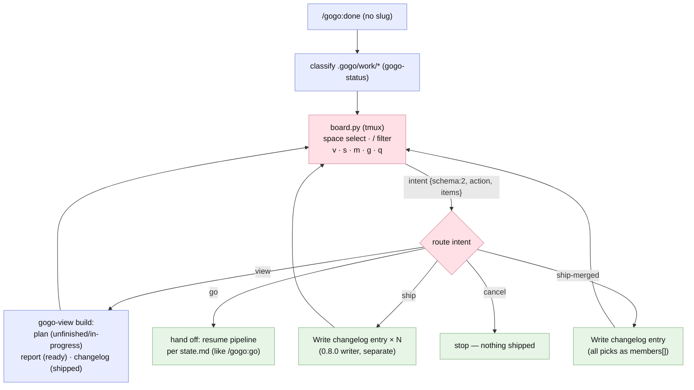

# Plan — feature `board-actions-and-filter`

Status: **built — report-complete** (phase ⑤, 2026-07-02 · shipped in plugin **0.9.0**). **The intended design held as built** — all three accepted recommendations (D1=A action keys, no modes · D2=A single-shot intents + relaunch loop · D3=A full cockpit incl. `g`) landed as planned, plus five recorded implementation judgment calls (see [decisions.md](decisions.md) implementation notes: `go` ends the loop, `view` class-lookup, relaxed validate-in, `ship-result.json`→`board-intent.json`, empty-`s` hint). The **one behavioral fix post-implement** was review's REV-001: the curses launch is now crash-safe — any TUI startup/loop failure exits **2** with a one-line stderr, never a fake cancel. As-built report: [report/report.md](report/report.md).

## Goal

Grow the `/gogo:done` work board from a one-shot ship-picker into the **pipeline's cockpit**: from the same four-column table you can **view** any item's plan/report/changelog page, **ship** ready items (separately or **merged into one release** right from the board), **kick off / resume the pipeline** on unbuilt items, and **filter** the board by text. **One mode, action keys** — no view/manage mode switch: `v` views the focused card, and "moving a card between columns" is simply triggering the pipeline action that transition means.

## Context — what exists

- **`assets/kanban/board.py`** (v0.7.0) — vendored stdlib curses TUI, a pure **selector**: renders the four classes, space toggles ready-to-ship cards, `s` writes `{"ship":[...]}`, `q` cancels; exit contract **0/1/2**; `--selftest`, `--headless`. It never mutates gogo state (D5) — that stays true; new actions become **intents** written to the result file.
- **`skills/gogo-done/SKILL.md`** (v0.8.0) — board mode: classify (gogo-status) → TUI (tmux, nesting-safe, `board-exit.code`) or table+multi-select fallback → three-outcome routing → the **"Write changelog entry (1..N members)"** synthesis writer; post-selection separate-vs-merged gate (D3=A of 0.8.0).
- **`skills/gogo-view/SKILL.md`** — already resolves every target the board could ask for: `<slug>:plan`, `<slug>:report`, `<date>-<name>` changelog entries.
- **Proven this session:** the detached-tmux launch (`new-session -d` + attach) works from a non-tty orchestrator shell; `tmux wait-for` + a background wait re-invokes the orchestrator when the board exits.

## Functional requirements

- **FR1 — action keys (one mode).** In the TUI: **space/enter** toggle selection (class-valid targets only) · **`v`** view the focused card · **`s`** ship selection separately · **`m`** ship selection **merged** (≥2 ready) · **`g`** go — run/resume the pipeline for the focused card · **`/`** filter · **`q`** cancel. Guards: `s`/`m` only ready-to-ship; `g` only unfinished / in-progress; `v` any card; invalid keys show a one-line hint, never crash.
- **FR2 — intent result (schema v2).** The board exits writing `{"schema": 2, "action": "view|ship|ship-merged|go|cancel", "items": ["<slug>", ...]}`; exit codes stay **0/1/2**. `gogo-done` accepts the legacy `{"ship":[...]}` shape as `action: ship` (back-compat). `--headless` keeps working (gains `--action`, default `ship`).
- **FR3 — intent routing + relaunch loop (gogo-done).** The orchestrator executes the intent, then **relaunches the board** so it feels persistent:
  - **view** → open the right page for the card's class — plan bundle (unfinished/in-progress), work report (ready-to-ship), changelog entry (shipped) — via the `gogo-view` build, then relaunch the board;
  - **ship** → the 0.8.0 synthesis writer, one entry per slug (explicit `s` = separate, no extra question) → relaunch;
  - **ship-merged** → the writer with all picks as members (release-name suggest+confirm stays in chat) → relaunch;
  - **go** → end the board loop and hand off to the pipeline (resume per the feature's `state.md`, like `/gogo:go`);
  - **cancel** → stop (unchanged).
  The chat **fallback** (no tmux/tty) keeps its current ship flow (incl. the separate-vs-merged gate) and simply mentions `/gogo:view` + `/gogo:go` for the non-ship actions — no fallback bloat.
- **FR4 — text filter.** `/` opens an input line; live case-insensitive substring match on slug+title across all columns; `Esc` clears; active filter shown in the header (`filter: <text> (n/N)`); selection survives filtering.
- **FR5 — quality + sync.** `--selftest` extended (key guards per class, intent emission per action, filter logic, legacy-shape back-compat); docs sync (`commands/done.md`, `skills/gogo/SKILL.md`, `README.md`, `docs/{commands,flow,architecture}.md`); `plugin.json` → **0.9.0**; command count stays 12.

## Approach (recommended)

**Intents, not execution.** `board.py` stays a selector (D5 invariant): every action key just writes a richer intent and exits; the orchestrator (gogo-done) executes it and relaunches. This keeps the exit-code contract, the tmux wait-for model, the headless test path, and the no-LLM-in-python boundary — while the relaunch loop makes the board feel like a persistent cockpit. "Column moves" are never free-form: the only legal transitions are the pipeline's own actions, enforced by the same class guards the TUI already uses for ready-only shipping.

*Alternatives considered:* view/manage **modes** (rejected — the user's own lean: doubles key-map + state for zero capability); a **persistent board with intent polling** (rejected: breaks the single wait-for/exit-code contract, hard to test headlessly, board and orchestrator can desync); the board **executing** gogo commands itself (rejected: it has no LLM and must never mutate gogo state).

## Changes checklist (build order)

1. `assets/kanban/board.py` — action keys + guards, filter, schema-v2 result, header/status line, extended `--selftest`, `--headless --action`.
2. `skills/gogo-done/SKILL.md` — intent routing table + relaunch loop; legacy-shape back-compat; explicit-`s` skips the separate-vs-merged gate (the gate remains for the fallback multi-select); detached-launch note (proven pattern: `new-session -d` + user attach when no tty).
3. `commands/done.md` — thin sync (action keys, filter).
4. `skills/gogo/SKILL.md`, `README.md`, `docs/{commands,flow,architecture}.md` — FR5 sync.
5. `.claude-plugin/plugin.json` — 0.9.0.

## Tests

- **board.py live (python3 present):** `--selftest` all-pass (new cases: per-class key guards, each action's intent shape, filter narrowing + clearing + selection survival, legacy back-compat parse); `--headless --action ship|ship-merged|view|go` emits schema-v2 with the right guards; exit codes 0/1/2 unchanged; bad index still exit 2, one-line stderr.
- **Interactive TUI (manual on this host — tmux now installed):** detached launch → attach → filter → select 2 → `m`; separately `v` on a shipped card; `g` on an in-progress fixture; verify each intent routes correctly and the board relaunches after `view`.
- **Fixture dogfood (scratch):** intent routing per class — view targets resolve to plan/report/changelog correctly; ship/ship-merged reach the 0.8.0 writer unchanged; `go` hands off; cancel stops.
- **FR5 sweep:** 0.9.0, 12 commands, no stale "space/enter + s/q only" board wording.

## Out of scope

- Fallback-mode parity for view/go (the fallback stays ship-focused; `/gogo:view` and `/gogo:go` exist).
- Roadmap #7 (line-by-line plan commenter) — this builds more of its board machinery but not the commenting surface.
- Free-form column drag, board persistence between runs, mouse support.

## Intended design

