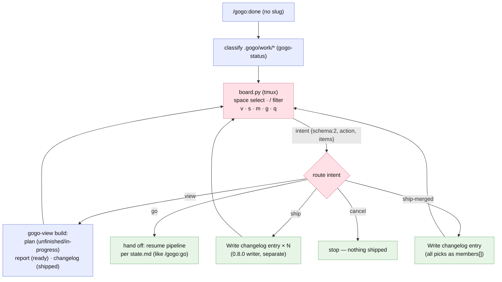
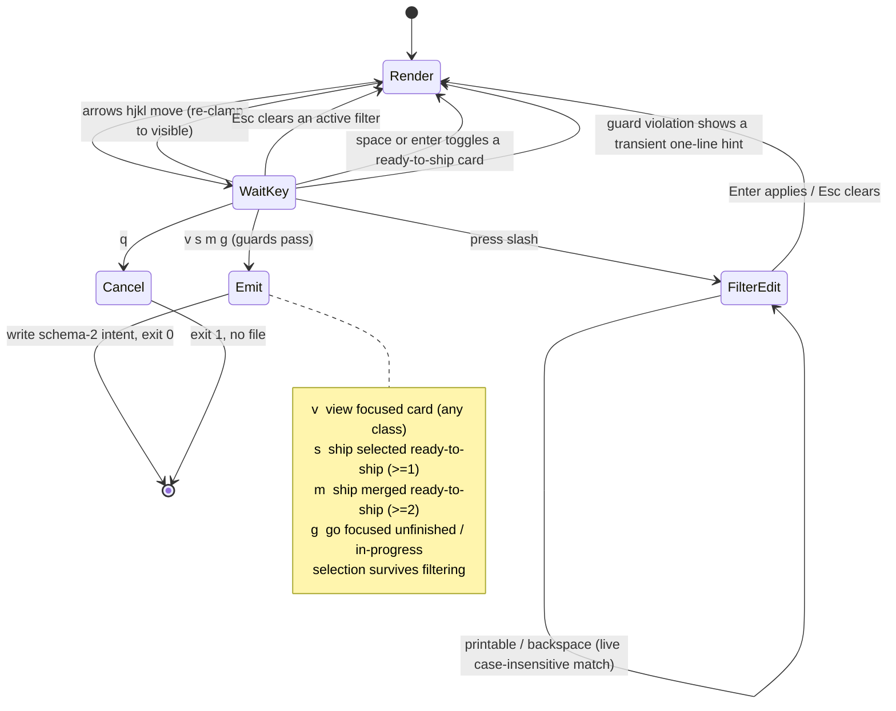
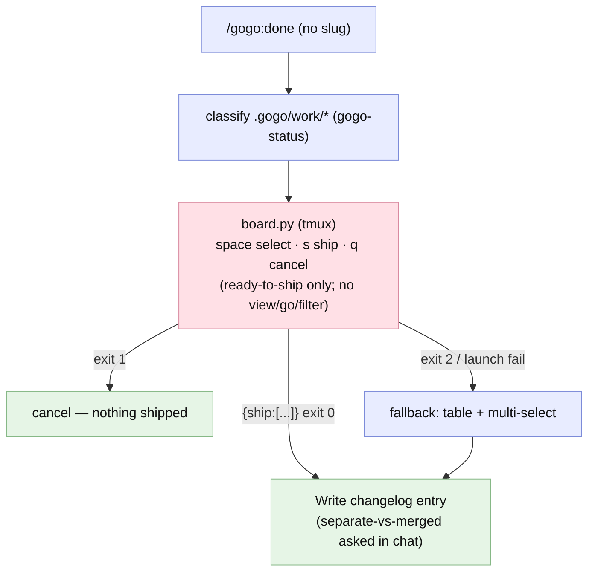

# Report — feature `board-actions-and-filter`

- **feature:** `/gogo:done` board cockpit — action keys (view · ship · merge-ship · go) + text filter + intent protocol v2
- **status:** done
- **completed:** 2026-07-02
- **branch / commits:** `main` · working-tree change (commit + ship later via `/gogo:done`)

## Run status / gaps

**All five phases completed cleanly; zero open issues.** Plan → implement → review → test → report ran with plan=1 · implement=1 · review=1 · test=1 rounds — both review findings (**1 major + 1 minor**) were fixed inline by the orchestrator and **verified** without a second review round, and test round 1 came back **ALL GREEN** with no new issues. This is a clean green release.

## Summary

**The work board became the pipeline's cockpit.** Until now `/gogo:done`'s board was a one-shot ship-picker: select ready cards, `s`, done. As of **plugin 0.9.0** the same four-column table drives the whole pipeline — **one mode, action keys**: `v` views any card's plan/report/changelog page, `s` ships the selection, `m` ships it **merged into one release**, `g` kicks off / resumes the pipeline on an unbuilt card, and `/` live-filters the board. Every action is a **single-shot schema-v2 intent** (`{"schema":2, "action", "items"}`) that the orchestrator executes and then **relaunches the board**, so it feels persistent while `board.py` stays a no-mutation selector with the same 0/1/2 exit contract. "Moving a card between columns" is now simply triggering the pipeline action that transition means — never a free-form drag.

## Planned vs shipped

**Shipped as accepted — the intended design held.** All three decisions landed exactly as recommended and accepted (action keys over modes, intents + relaunch over a persistent board, full cockpit including `g`). The developer recorded five **judgment calls** during implementation rather than deviations — `go` (not just cancel) ends the relaunch loop, `view` routing looks the class up in the work-index, validate-in relaxed so the cockpit opens whenever *any* feature exists, the runtime file renamed `ship-result.json` → `board-intent.json`, and an interactive empty-`s` shows a hint instead of emitting an empty ship — all in [decisions.md](../decisions.md). The **one behavioral fix post-implement** was review's REV-001: the curses launch gained a crash-safe wrapper (a TUI failure now exits **2** with one stderr line, never a traceback misread as a user cancel).

## Implementation

**Richer intents out, routing + relaunch in — the selector boundary never moves.** `assets/kanban/board.py` gained the action keys with **per-class guards** single-sourced in `resolve_action` (space/enter toggle ready-to-ship only; `v` any card; `s` ≥1 selected ready; `m` ≥2; `g` focused unfinished/in-progress only — violations show a transient one-line hint, never crash), the `/` **live filter** (case-insensitive slug+title match, `Esc` clears, selection survives, cursor re-clamps), and **schema-v2 intent emission** on any action — while the legacy `{"ship":[...]}` shape still parses as `action: ship` and `--headless` gained `--action` (default `ship`). On the other side, `skills/gogo-done/SKILL.md` was rebuilt around an **intent routing table + relaunch loop**: *view* → class lookup → the right `gogo-view` target (plan / report / changelog page) → relaunch; *ship* → the 0.8.0 synthesis writer once per slug (explicit `s` = separate, no gate question); *ship-merged* → the writer once with all picks as `members[]` (name suggest+confirm stays in chat); *go* → **end the loop** and resume the pipeline per the feature's `state.md`; *cancel* → stop. The board **re-classifies between relaunches** (a just-shipped card moves to `shipped`), and the proven detached no-tty launch pattern (`tmux new-session -d` + attach + `wait-for`) is documented in the skill. The chat fallback stays ship-focused (no bloat) and points at `/gogo:view` + `/gogo:go` for the rest.

### Changes (as-built)

| File | Change | Note |
|---|---|---|
| `assets/kanban/board.py` | modified | action keys + per-class guards, `/` live filter, schema-v2 intents, `--headless --action`, 31-check `--selftest`, crash-safe launch (REV-001: failure → exit 2, one-line stderr) |
| `skills/gogo-done/SKILL.md` | rewritten (board sections) | intent routing table + relaunch loop with re-classify; legacy-shape back-compat; relaxed validate-in; `board-intent.json` rename; detached-launch pattern |
| `commands/done.md` | modified | thin sync — action keys, filter, relaxed gate |
| `skills/gogo/SKILL.md`, `README.md`, `docs/{commands,flow,architecture}.md` | modified | FR5 cockpit sync (docs/commands.md + docs/flow.md also got the REV-002 relaxed-gate fix) |
| `.claude-plugin/plugin.json` | modified | version → **0.9.0**; command count stays 12 |
| 0.8.0 synthesis writer + shipped changelog entries | untouched | ship execution is unchanged; the board only selects |

## Decisions & rationale

See [decisions.md](../decisions.md) for the full record (incl. the five implementation notes).

| Decision | Choice | Reason |
|---|---|---|
| D1 — interaction model | **A: one mode, action keys** (no view/manage modes) | modes double key-map + state for zero extra capability — the user's own self-correction during planning ([adjustments.md](../adjustments.md)) |
| D2 — board↔orchestrator protocol | **A: single-shot intents + relaunch loop** | keeps the exit-code + `wait-for` contract and headless testability; the board stays a no-mutation selector (the D5/0.7.0 invariant) |
| D3 — action scope for v1 | **A: full cockpit incl. `g`** | `g` is the "move planned → in-progress" half of the ask; without it the cockpit only ships |

## Review outcome

**One round; verdict CHANGES → clean after inline fixes.** [Review round 1](../review/review-01.md) raised one **major** — REV-001, the unguarded curses launch: a startup/loop failure exited 1 with a traceback, which `gogo-done` would misread as a deliberate user cancel and skip the mandated fallback — and one **minor** (REV-002, stale validate-in wording in `docs/commands.md` + `docs/flow.md` contradicting the shipped relaxed gate). Both were fixed by the orchestrator and **verified live**: `TERM=` + no tty now yields exit 2, one stderr line, no traceback, no result file; the two docs match the relaxed-gate wording everywhere else. Everything else — guards, filter, intent shapes, back-compat, docs sync, version, no-mutation invariant — checked out first pass. See [review/issues.json](../review/issues.json).

## Test outcome

**GREEN — and the first-ever live tmux-driven TUI test round.** Where earlier features could only verify the interactive board by code-read + recorded manual steps, [test round 1](../test-01.md) drove the **real curses TUI** via `tmux send-keys` / `capture-pane` on a 5-card all-classes fixture: guard hints on shipped/in-progress cards, the live filter narrowing (apply, Esc-clear, selection survival), and the exact intent per action (`m` with 2 ready → ship-merged, `v` on shipped → view, `g` on in-progress → go, `q` → exit 1 no file). Around it: the full **headless matrix** (all 5 actions, every guard violation exit 2 one-line, bad-index cases, legacy `--ship` back-compat), the **REV-001 regression** (crash → exit 2, never a cancel), a **cockpit-routing spec walk** (all 5 actions routed, re-classify between relaunches specified), and the **FR5 + 0.8.0-regression sweeps** (0.9.0, 12 commands, no stale wording, synthesis writer / `members[]` / legacy selftest intact). Zero issues — [test/issues.json](../test/issues.json).

## Diagrams

Two as-built diagrams (no `diagrams.html` in this bundle — the 0.8.0 slim rule; open them interactively with `/gogo:view board-actions-and-filter`):

- `flow.mmd` — the shipped cockpit control flow: classify → board → intent → route → relaunch loop.
- `activity.mmd` — `board.py`'s internal key → guard → intent state machine (filter-edit vs command mode).

## Before / after comparison

The plan captured an as-is baseline (copied here as `before/flow.mmd`). **Flow** is present in both sets; **activity** is added (after only — the key → guard → intent state machine is new selector logic worth its own diagram).

**Before** — the 0.7.0/0.8.0 board was a one-shot ship-picker: select ready cards, `s` ships (separate-vs-merged asked afterwards in chat), `q` cancels; no view, no go, no filter — every non-ship outcome ended the board:

**After** — see the flow diagram above (Diagrams section). **What changed:** the single ship edge became a five-way intent route — `view`, `ship`, and `ship-merged` now **loop back to a relaunched board** (with the work-index re-classified in between), `go` hands off to the pipeline, and only `go`/`cancel` end the loop; the board↔orchestrator contract upgraded from `{ship:[...]}` to schema-v2 `{schema:2, action, items}` (legacy still parsed); and the cockpit opens for *any* feature, not just when something is ready to ship. The exit-code triage is unchanged — but hardened: a crash is now always exit 2 (fallback), never mistaken for a cancel.

## Knowledge updates

- `test-strategy.md` (owned): the soft-dep interactive-surface guidance upgraded — with tmux present, the **real TUI path is automatable** via `tmux send-keys` / `capture-pane` (unique throwaway sessions, assert rendered state + exit code + intent file); manual-steps-recording is now only the tmux-absent fallback.
- `project-knowledge.md` (proxy — `## gogo overrides` only): added the **since 0.9.0** bullet — board cockpit (action keys, filter, schema-v2 intents + relaunch loop, `board-intent.json`, relaxed gate, crash-safe exit 2); version currency 0.9.0.
- `tech-stack.md` (owned): the `python3`+`tmux` soft-dep note now reflects the cockpit role and that tmux is installed on this dev host (live TUI testing available) — **still a soft dep**, same detection and fallback.

No upstream (README/CLAUDE.md) edits suggested — the README was synced in-scope by FR5.

## Follow-ups & known limitations

- **Fallback parity for view/go** — deliberately deferred: the no-tmux chat fallback stays ship-focused and mentions `/gogo:view` + `/gogo:go` instead. Revisit only if real usage asks for it.
- **Roadmap #7 (line-by-line plan commenter)** builds directly on this cockpit machinery (board + intents + relaunch loop) — the commenting surface remains unbuilt.
- **Esc-clear latency** in the filter is curses' `ESCDELAY` (~1.5 s observed) — expected terminal behavior, not a bug; noted from live testing.
- Free-form column drag, board persistence between runs, and mouse support stay out of scope.
