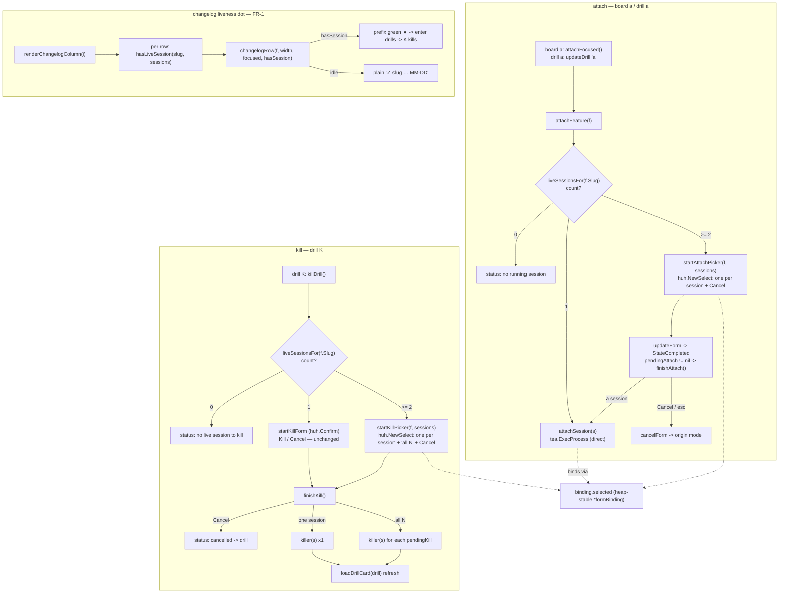

# Plan — feature `board-session-picker`

Status: **accepted** (user, 2026-07-14) · **as-built** (shipped 2026-07-15, 0.20.0) — implemented
exactly as planned (FR-1/FR-2/FR-3, D1+D2); review APPROVE (1 nit REV-001 fixed in-context,
test-only); test green (unit `-race` + live tmux drive). See `report/report.md`.

**The board can't tell you which shipped items are holding live sessions, and its
attach/kill actions treat "the item's sessions" as one undifferentiated blob.** This
change makes lingering pipeline sessions **visible and individually actionable** from
the `gogo` TUI cockpit: a live-session dot on collapsed changelog rows, an **attach
picker** that lets you choose *which* session when an item has several, and a **kill
picker** that lets you kill *one* session or an explicit *"all N"*. It is
**presentation/interaction-only** in `cli/internal/tui/`, over the **same
`contract.Repo`** — no contract, classifier, skill, pipeline-state, or launch-package
change. Ships inside the in-flight **0.20.0** release alongside the cockpit-lean-cards
+ changelog-cursor work already in the tree.

## Goal

Let the user **see** which board items have live pipeline sessions and **choose
exactly** which session(s) to attach to or kill — solving the two live-board issues:
(1) lingering sessions accumulate (`● 6 session` in the header) with no per-item cue on
the collapsed changelog, and (2) a shipped item can carry several sessions
(`gogo-accept-<slug>`, `gogo-done-<slug>`, `gogo-go-<slug>`, all "untracked live" in the
drill) that today attach to the *first* match and kill *all at once*.

**Acceptance signal:** on the live board, a shipped/changelog row with a live session
shows a green `●`; `enter` drills into it; in the drill, `a` over ≥2 sessions opens a
one-of picker, and `K` over ≥2 sessions opens a pick-one-or-"all N" picker — all
driven purely (no TTY) under `go test`, with `gofmt`/`go vet`/`go test -race` green.

## Context — what exists (verified against the code)

All the machinery already exists; this feature refines three thin seams.

- **`cli/internal/tui/update.go`**
  - `attachFocused()` (board `a`) → `attachFeature(m.focusedCard())`; `updateDrill`
    `case "a"` → `attachFeature(m.drill)`. Both funnel through **`attachFeature(f)`**
    (update.go:431), which today calls **`liveSessionFor(f.Slug, m.sessions)`** →
    the **FIRST** exact match, then `tea.ExecProcess` on it. No choice when ≥2 exist.
  - `killDrill()` (update.go:454, drill `K`) → **`liveSessionsFor(f.Slug, m.sessions)`**
    → **ALL** exact matches → `startKillForm(f, sessions)` (update.go:474) opens a
    **`huh.NewConfirm`** ("Kill / Cancel") over *all* of them; `finishKill()`
    (update.go:497) kills each via the **`m.killer`** seam and refreshes the drill via
    `loadDrillCard`.
  - `liveSessionFor` / `liveSessionsFor` (update.go:531/542) match by exact
    `launch.SessionMatchesSlug` (never substring — TEST-005). These stay the session
    source; the pickers just choose a subset.
  - The form lifecycle lives in **`updateForm`** (update.go:329): on
    `huh.StateCompleted` it branches on `m.pendingDelete` → `finishDelete`, then
    `m.pendingKill` → `finishKill`, then the ship form. `cancelForm` /
    `formPreservesSelection` (update.go:380/391) handle Esc/abort and the
    return-to-drill-vs-board decision (`wasKill` uses `m.drill != nil`).
- **`cli/internal/tui/model.go`** — the `Model` is a **value type copied on every
  Update**, so all mutable form targets live behind a heap-stable **`*formBinding`**
  (`binding.release` / `binding.confirm`) — the TEST-001 rule. Seams
  `killer func(session string) error`, `registry`, `launcher`, `capturer` default to
  the real impls in `New` and are swapped for fakes in tests. `hasLiveSession` /
  `liveSessionFor` are the liveness helpers.
- **`cli/internal/tui/view.go`** — `renderChangelogColumn(i, colWidth)` (view.go:190)
  renders the **collapsed** changelog as `changelogRow(f, width, focused)` (view.go:241)
  rows: `▸ ✓ slug … MM-DD`. **`changelogRow` is a free function** with no access to
  `m.sessions` today — so the liveness must be decided in `renderChangelogColumn` (which
  has `m.sessions`) and passed in. `sessionStyle` (styles.go:91, the green `●` style) and
  `hasLiveSession` are already the exact tools the work columns use for their dot.
- **The drill already works for a changelog row.** `enter` in `updateBoard` →
  `openDrill(m.focusedCard())`; `focusedCard()` returns `m.cols[3][cardIdx[3]]` for the
  changelog column, which *is* focusable/navigable (left/right moves `colIdx` 0..3,
  up/down moves `cardIdx`). `openDrill` → `loadDrillCard` → `sessionRows(reg, sessions,
  slug)` renders a shipped item's untracked-live sessions, and `K`/`a` operate on them.
  **So FR-1 needs only the dot** (no new focus/drill plumbing) — verified, not assumed.
- **huh v1.0.0** (`cli/go.mod:10`) provides **`huh.NewSelect[string]()`** with
  `.Options(...)`, `.Value(*string)`, `.Title(...)`, `.Description(...)`. Its default
  keymap: `up/k` `down/j` navigate, `enter`/`tab` select+submit — so a single-field
  Select group completes on `enter` exactly like the existing Confirm, and the
  `keyPress` test pump already drives that async NextField→nextGroup→StateCompleted
  chain (TEST-001).

## Functional requirements

### FR-1 — Changelog rows show a live-session dot
The collapsed changelog list must show a green `●` on any row whose shipped item has a
live session, so the user can spot it and `enter`→drill→kill. **Keep the collapsed
list** (do NOT revert to full cards — D1). `renderChangelogColumn` computes
`hasLiveSession(col[j].Slug, m.sessions)` per row and passes it into an extended
`changelogRow(f, width, focused, hasSession bool)`, which prefixes the row's slug with a
`sessionStyle`-rendered `●` (focused rows too, matching the work cards' dot). The
existing `enter`→`openDrill`→drill→`K` path is verified to work for a changelog row and
is left unchanged.

### FR-2 — Attach is a per-session picker
`attachFeature(f)` (shared by board `a` and drill `a`) must let the user **choose**
which session to attach to when the item has **≥2** live sessions. With **exactly one**
session, attach directly (current UX, no form). Zero sessions → the existing "no running
session" hint.

### FR-3 — Kill is a per-session picker with an 'all' option
In the drill, `K` must let the user choose a **single** session to kill **OR** an
explicit **"all N sessions"** option, plus **Cancel**, when the item has **≥2** live
sessions. With **exactly one** session, the existing single-confirm (`huh.NewConfirm`)
is kept unchanged. The single kill still targets **only** the chosen exact session name
via the `m.killer` seam (never a substring sibling — TEST-005), and refreshes the drill
in place afterwards.

## Approach (recommended)

The design keeps **one attach path and one kill path**, adds a `huh.NewSelect[string]`
picker at the ≥2 branch of each, and binds the picker's choice through the same
heap-stable `*formBinding` the Confirm/ship forms already use. All new logic is pure and
substring-assertable — no TTY, no real tmux — driven exactly like the existing kill
form.

**1. `formBinding.selected string` (model.go).** One new field on the existing
heap-stable binding, bound via `.Value(&m.binding.selected)` so the picker writes
through the shared pointer across Model copies (the TEST-001 rule). Reused by both
pickers.

**2. Attach picker (update.go).** Refactor `attachFeature(f)` to branch on
`liveSessionsFor` count:
- `0` → the existing "no running session" hint.
- `1` → `attachSession(sessions[0])` — a small helper extracted from today's
  `attachFeature` body (the `tea.ExecProcess` attach). It also sets a synchronous
  `m.status = "attaching " + session` so the *chosen* session is substring-assertable
  in tests (attach has no killer-style seam; the status line is the observable).
- `≥2` → `startAttachPicker(f, sessions)`: a `huh.NewSelect[string]` titled
  `"Attach which session for <slug>?"` with one option per session (value = session
  name) plus a **"Cancel"** option (a distinct non-empty sentinel value). Sets
  `m.pendingAttach = sessions`, records the origin (`m.pickerFromDrill = m.mode ==
  modeDrill`) so cancel restores the right mode, `m.mode = modeForm`, returns
  `m.form.Init()`.

**3. Kill picker (update.go).** `killDrill()` branches on count:
- `1` → `startKillForm` (the existing `huh.NewConfirm`) — unchanged.
- `≥2` → `startKillPicker(f, sessions)`: a `huh.NewSelect[string]` titled
  `"Kill which session for <slug>?"` with one option per session (value = name), an
  **"all N sessions"** option (value = a `killAll` sentinel), and a **"Cancel"** option
  (value = a `killCancel` sentinel). Sets `m.pendingKill = sessions` (reusing the
  existing field, so `updateForm`'s `pendingKill` branch already routes to
  `finishKill`), and `binding.selected`.

**4. Completion routing (update.go).** In `updateForm`'s `StateCompleted`, add a
`m.pendingAttach != nil → finishAttach()` branch (after the existing delete/kill
branches, before the ship branch — all mutually exclusive). `finishKill` learns to
resolve targets from `binding.selected`:
- `selected == ""` → the single-session **Confirm** path (never set by a Select), keep
  today's `binding.confirm` logic (kill all `pendingKill` or none).
- `selected == killAll` → kill every `pendingKill`.
- `selected == killCancel` → cancel.
- otherwise (`selected` is a session name) → kill that one only.

The distinct non-empty sentinels for the picker's Cancel/all mean the Confirm path
(`selected == ""`) is never ambiguous — no extra discriminator field.
`finishAttach()` reads `binding.selected`: the Cancel sentinel → cancel to the origin
mode; a session name → `attachSession(sel)`.

**5. Cancel/Esc plumbing (update.go).** `formPreservesSelection` gains `||
m.pendingAttach != nil` (an attach cancel must not wipe the ready-ship multi-selection,
like delete/kill). `cancelForm` clears `m.pendingAttach` and restores the picker's
origin mode (`pickerFromDrill ? modeDrill : modeBoard`), generalizing today's `wasKill`
return-to-drill.

**6. Changelog dot (view.go).** `renderChangelogColumn` passes
`hasLiveSession(col[j].Slug, m.sessions)` into `changelogRow(f, width, focused,
hasSession)`, which renders a leading `sessionStyle.Render("●")` when live. Rune-width
math in the row (`slugMax`, `gap`) accounts for the extra dot+space so the `MM-DD` stays
right-aligned.

**7. Footers/help (view.go).** The drill footer already reads `a attach · K kill`; no
change needed. Optionally the drill footer's `K kill` hint is fine as-is (the picker is
discovered on press). No board footer chip changes.

**8. Version.** `cli/main.go` `Version` is bumped `0.19.0` → **`0.20.0`** to match
`.claude-plugin/plugin.json` (already `0.20.0`); this feature ships within that release.
The `project-knowledge.md` 0.20.0 note is extended (report phase) to record the pickers
+ dot.

### Alternatives considered

- **`AskUserQuestion`-style / key-indexed selection instead of `huh.NewSelect`.** The
  brief's fallback if huh lacked a select. huh v1.0.0 *does* ship `NewSelect[string]`
  (verified), and it reuses the exact form lifecycle (`updateForm`, the `keyPress`
  pump, the `*formBinding` rule) the codebase already trusts. A hand-rolled key-indexed
  menu would be a second, untested interaction model. **Rejected** — use huh.
- **A separate `killer`-style seam for attach.** Attach uses `tea.ExecProcess`
  directly (no seam today). Rather than add one, the plan makes the *chosen session*
  observable via a synchronous `m.status = "attaching <session>"`, which the pure test
  asserts. Minimal, matches the existing "status line is the observable" pattern in
  `viewDrill`. A full attach seam is deferred (not needed for this scope).
- **Always use a picker for kill, even at 1 session.** The brief settles this: single
  session keeps the existing single-confirm (D2). Avoids a regression to the many
  existing single-session kill/attach tests.
- **Give `changelogRow` access to `m.sessions` (make it a method).** Larger diff and
  couples the row renderer to the Model. Passing a `hasSession bool` keeps it a pure
  free function (easier to unit-test in isolation) — chosen.

## Intended design (diagram)

How the three surfaces work at runtime — the unified attach path (0/1/≥2), the kill
path (1 Confirm vs ≥2 picker with "all"), and the changelog liveness dot. Both pickers
bind through the one heap-stable `*formBinding.selected`. (The as-is baseline is drawn
in `charts/before/flow.mmd`.)

## Changes checklist (build order)

1. **`cli/internal/tui/model.go`** — add `selected string` to `formBinding`; add
   `pendingAttach []string` and `pickerFromDrill bool` to `Model`; add the `killAll` /
   `killCancel` / `attachCancel` sentinel consts (package-level, plain ASCII).
2. **`cli/internal/tui/update.go`**
   - Extract `attachSession(session string) (tea.Model, tea.Cmd)` from `attachFeature`
     (the `tea.ExecProcess`), set a synchronous "attaching <session>" status.
   - Rework `attachFeature(f)` to branch 0 / 1 / ≥2; add `startAttachPicker` +
     `finishAttach`.
   - Rework `killDrill()` to branch 1 vs ≥2; add `startKillPicker`; extend `finishKill`
     to resolve targets from `binding.selected` (Confirm path stays via `binding.confirm`).
   - `updateForm` `StateCompleted`: add the `pendingAttach` branch. `cancelForm` +
     `formPreservesSelection`: handle `pendingAttach` + restore the picker origin mode.
3. **`cli/internal/tui/view.go`** — extend `changelogRow` with `hasSession bool`; render
   the `●`; fix the width math; pass `hasLiveSession(...)` from `renderChangelogColumn`.
4. **`cli/main.go`** — bump `Version` to `"0.20.0"`.
5. **Tests** (below) in `cli/internal/tui/*_test.go`.
6. **`.gogo/knowledge/project-knowledge.md`** 0.20.0 note extended at report ⑤ (not a
   plan-phase edit).

## Tests (pure, no TTY — `go test -race ./...`)

Mirroring `TestDrillKillWiring` / `TestDrillAttachWiring` (card_test.go) and the
`keyPress` huh pump:

- **FR-1 changelog dot** — build two shipped `*contract.Feature` in `m.cols[3]` (as
  `TestChangelogFocusCursor` does), set `m.sessions` to a `gogo-done-<slug>` matching
  one; assert `renderColumn(3, …)` output contains `● <slug>` for the live one and not
  for the idle one; assert the collapsed `✓ slug` list shape is preserved.
- **FR-2 attach picker** — drill a card with **≥2** exact-match sessions; `a` opens
  `modeForm` with `pendingAttach` set and the form View lists both session names;
  navigate (`down`)+`enter` selects the second → assert `m.status` names the *chosen*
  session and a command is returned; `esc`/Cancel → no attach, origin mode restored,
  ready-ship selection preserved.
- **FR-2 single-session attach unchanged** — one session → `a` returns the attach
  command directly with no form (the existing `TestDrillAttachWiring` stays green).
- **FR-3 kill picker** — drill with **≥2** exact-match sessions; `K` opens `modeForm`
  (`pendingKill` set); the form View lists each session + an "all" + "Cancel"; select
  one session → `recordingKiller` called **exactly once** with that name; re-open and
  select "all N" → killer called once per session; select "Cancel" → killer never
  called, back on the drill.
- **FR-3 single-session kill unchanged** — the existing `TestDrillKillWiring` (one exact
  match → Confirm, `y` kills once, `n`/esc cancel) stays green untouched.
- **Regression** — `TestFormSingleConfirmLaunches` / `TestFormMergedReleaseLaunches`
  (ship forms) untouched; `TestDrillDegradesNoSessions` (K/a with nothing live are safe
  no-ops) stays green.

## Out of scope

- **No contract / classifier / launch / skill / pipeline-state change.** The CLI stays
  a deterministic, LLM-free reader that never mutates pipeline state; `docs/cli-contract.md`
  needs no change (presentation/interaction only).
- **No new session-reaping behaviour.** This surfaces and targets existing sessions; it
  does not change `gogo sweep`, kill-at-ship, or the registry. Accumulation is *managed*
  here, not prevented.
- **Merged changelog entries whose release name ≠ member slugs.** A merged entry's
  `Feature.Slug` is the release name, so `hasLiveSession(releaseSlug, …)` may not match a
  member's `gogo-*-<memberSlug>` session. FR-1's dot covers single shipped items carrying
  their own `gogo-*-<slug>` sessions; per-member session attribution for merged entries
  is a separate concern, left out.
- **No board `a` picker-origin cosmetics beyond correct return mode** (no new board
  footer chips; the picker is discovered on press).

## Summary (TL;DR)

- **What:** make pipeline sessions visible + individually actionable on the `gogo` TUI —
  a green `●` on collapsed changelog rows with a live session, an **attach picker**
  (choose one of ≥2), and a **kill picker** (one, or "all N", or Cancel).
- **Why:** lingering sessions pile up (`● 6 session`) and a shipped item can carry
  several; today attach grabs the *first* and `K` kills *all at once* with no per-item cue.
- **How:** presentation/interaction-only in `cli/internal/tui/` over the **same
  `contract.Repo`** — `huh.NewSelect[string]` pickers at the ≥2 branch of the unified
  `attachFeature`/`killDrill` paths, bound through the heap-stable `*formBinding`
  (`selected`); `changelogRow` gains a `hasSession` dot. Single-session UX unchanged
  (D2); collapsed list kept (D1). Pure, substring-assertable under `go test`.
- **Version:** ships within **0.20.0** (`cli/main.go` bumped to match `plugin.json`).
- **Next:** orchestrator owns the acceptance gate — on accept, `/gogo:go` runs ②→⑤ on
  this work item.
