# Report — feature `board-session-picker`

- **feature:** Per-session attach/kill pickers + changelog live-session dot (TUI cockpit)
- **status:** awaiting-uat
- **completed:** 2026-07-15
- **branch / commits:** main | uncommitted working tree (ships within the in-flight 0.20.0 release)

## Run status / gaps
All phases completed; no open issues. plan → implement (r1, +r2 test-only fix) → review (r1, APPROVE) → test (r1, green) → report. `review/issues.json` and `test/issues.json` both have zero open/new findings.

## Summary
The `gogo` TUI cockpit could not tell you **which** shipped items were holding live pipeline sessions, and its attach/kill actions treated an item's sessions as one undifferentiated blob. This change makes lingering sessions **visible and individually actionable**: a green `●` on collapsed changelog rows with a live session, an **attach picker** that lets you choose *which* session when an item has several, and a **kill picker** that kills *one* session or an explicit *"all N"*. It is **presentation/interaction-only** in `cli/internal/tui/`, over the **same `contract.Repo`** — no contract, classifier, skill, pipeline-state, or launch-package change.

## Planned vs shipped
**Shipped exactly as planned** (FR-1/FR-2/FR-3, honoring D1 + D2), with one addition during review: a test-coverage nit (REV-001) was fixed by adding the board-origin attach-cancel + ready-ship selection-preservation test — **no product-code deviation**. No requirement was added, dropped, or changed.

## Implementation
The feature keeps **one attach path and one kill path** and adds a `huh.NewSelect[string]` picker at the **≥2-session** branch of each, binding the choice through the same heap-stable `*formBinding` the existing Confirm/ship forms use (the TEST-001 rule — the `Model` is a value type copied on every `Update`, so form targets must live behind a pointer). All new logic is **pure and substring-assertable** — no TTY, no real tmux — driven exactly like the existing kill form.

- **Attach** (`attachFeature`, shared by board `a` and drill `a`) now branches on the live-session count: **0** → the "no running session" hint; **1** → `attachSession(s)` attaches directly (unchanged UX) and sets a synchronous `"attaching <session>"` status (the observable, since attach has no killer-style seam); **≥2** → `startAttachPicker` opens a Select of one option per exact-match session + **Cancel**, recording `pickerFromDrill` so a cancel restores the right origin mode.
- **Kill** (`killDrill`, drill `K`) branches **1** → the existing `huh.NewConfirm` (unchanged, D2) vs **≥2** → `startKillPicker`: one option per session, an **"all N sessions"** option, and **Cancel**. `finishKill` resolves the target(s) from `binding.selected`: `""` → the single-session Confirm path (kill all-or-none via `binding.confirm`), `killAll` → every session, `killCancel` → none, otherwise the one exact session named. The distinct non-empty sentinels keep the Confirm path (`selected == ""`) unambiguous — no extra discriminator field.
- **Changelog dot** (`changelogRow`) gained a `hasSession bool` param; `renderChangelogColumn` passes `hasLiveSession(slug, m.sessions)` per row. A live row renders a leading green `sessionStyle` `●` before the slug (`✓ ● slug`); the rune-width math reserves the extra cells so the `MM-DD` date stays right-aligned. The dot rides the focus fill on a focused row (plain), matching the work cards.
- **Completion/cancel plumbing**: `updateForm`'s `StateCompleted` gained a `pendingAttach → finishAttach()` branch (mutually exclusive with delete/kill/ship); `formPreservesSelection` and `cancelForm` were extended to treat an attach-cancel like the kill/delete cancels — the ready-ship multi-selection survives, and the picker returns to its origin mode.
- **Attribution stayed exact** (TEST-005): the pickers and the dot resolve sessions via `launch.SessionMatchesSlug` (exact `gogo-<action>-<slug>` parse), never substring, so `inprogress` never captures `inprogressX`.

### Changes (as-built)

| File | Change | Note |
|---|---|---|
| `cli/internal/tui/model.go` | modified | `formBinding.selected`; `pendingAttach []string` + `pickerFromDrill bool` on `Model`; `killAll` / `killCancel` / `attachCancel` sentinel consts (non-empty, never a real session name) |
| `cli/internal/tui/update.go` | modified | `attachFeature` 0/1/≥2 branch; new `attachSession`, `startAttachPicker`, `finishAttach`; `killDrill` 1 vs ≥2; new `startKillPicker`; `finishKill` resolves `binding.selected`; `updateForm` `pendingAttach` branch; `formPreservesSelection` + `cancelForm` cover the picker + origin mode |
| `cli/internal/tui/view.go` | modified | `changelogRow` gains `hasSession bool` → leading green `●` + width math; `renderChangelogColumn` passes `hasLiveSession(...)` |
| `cli/main.go` | modified | `Version` `0.19.0` → `0.20.0` (matches `.claude-plugin/plugin.json`) |
| `cli/internal/tui/card_test.go` | added | `TestChangelogLiveSessionDot`, `TestDrillAttachPicker` (opens/selects/drill-cancel/board-origin-cancel+selection-preservation), `TestDrillKillPicker` (lists/one/all-N/Cancel) |
| `.gogo/work/.../charts/manifest.json` | modified | marked as-built (implement r1) |

## Decisions & rationale
See [decisions.md](../decisions.md). Both forks were settled with the user before planning and shipped as decided.

| Decision | Choice | Reason |
|---|---|---|
| D1 — surface which shipped item has a session | **A — keep the collapsed list + add a `●` dot** | The collapsed `✓ slug … MM-DD` list is a deliberate 0.18.0 redesign; a per-row dot solves the visibility gap without reverting to full cards |
| D2 — how much choice for attach/kill over ≥2 sessions | **A — attach: pick one; kill: pick one OR "all N" + Cancel; single-session UX unchanged** | Pick-one-or-all matches the real need (attach to *a* session; kill a stray one or clear them all) with the simplest interaction, and keeps every single-session test green |
| REV-001 (review) — untested board-origin attach-cancel branch + selection-preservation | **Fixed in-context (test-only)** | The FR-2 spec called for the assertion; the product code was already correct, so a test addition closed the gap without a code change |

## Review outcome
One round, verdict **APPROVE** — **0 blockers / 0 majors / 0 minors**, 1 nit (REV-001, agent-fixable), no user decision needed. The reviewer independently re-ran the gates green and verified TEST-001 (heap-stable binding), TEST-005 (exact attribution, sibling neither offered nor killed), sentinel safety, injection safety (single-argv `tmux`, no shell), and the version match. REV-001 was fixed in-context (implement r2, test-only) and marked `fixed`. See [review-01.md](../review-01.md) / [review/issues.json](../review/issues.json).

## Test outcome
One round, **green**, at two levels. **Unit** (`gofmt -l .` clean · `go vet ./...` clean · `go test -race ./... -count=1` all 9 packages `ok`): the three new tests plus the untouched regressions (`TestDrillAttachWiring`, `TestDrillKillWiring`, `TestDrillDegradesNoSessions`, `TestFormSingleConfirmLaunches`, `TestFormMergedReleaseLaunches`, `TestChangelogFocusCursor`) all pass; `--version` → `0.20.0`. **Live tmux drive** (hands-on, not blocked): the tester built the real binary, created disposable `gogo-*` sessions on non-colliding shipped slugs, launched the board in a tmux pane, and confirmed via `capture-pane` — FR-1 the green `●` on exactly the live changelog rows (header `● 11 session`), FR-2 the attach picker (title + both sessions + Cancel; esc cancels cleanly), FR-3 the kill picker (both sessions + "all 2 sessions" + Cancel), including a real single-session kill that dropped the header to `● 10 session` with the sibling untouched (TEST-005 held). All fixture sessions were cleaned up to the pre-test baseline. See [test-01.md](../test-01.md) / [test/issues.json](../test/issues.json).

## Diagrams
One **flow** diagram carries the signal — the change is control-flow branching plus a render cue, with no new types or cross-module runtime interaction, so class/sequence would be trivial and are skipped. Open [diagrams.html](./diagrams.html) (same folder): `flow.mmd` — the unified attach path (0/1/≥2), the kill path (1 Confirm vs ≥2 picker with "all"), the changelog liveness dot, and both pickers binding through the one `*formBinding.selected`.

## Before / after comparison
A before (as-is) set exists (`report/before/flow.mmd`) — shown side by side with the as-built flow below.

**Before (as-is):**
```mermaid
flowchart TD
  subgraph attach["attach — board a / drill a (as-is)"]
    A0["board a: attachFocused()\ndrill a: updateDrill 'a'"] --> A1["attachFeature(f)"]
    A1 --> A2["liveSessionFor(f.Slug)\nFIRST match only"]
    A2 -->|""| A3["status: no running session"]
    A2 -->|first session| A4["tea.ExecProcess attach\n(no choice when >= 2 exist)"]
  end

  subgraph kill["kill — drill K (as-is)"]
    K0["drill K: killDrill()"] --> K1["liveSessionsFor(f.Slug)\nALL sessions"]
    K1 -->|none| K2["status: no live session"]
    K1 -->|1..N| K3["startKillForm (huh.Confirm)\none confirm over ALL"]
    K3 --> K4["finishKill()"]
    K4 -->|Kill| K5["killer(s) for EVERY session\n(no per-session choice)"]
    K4 -->|Cancel| K6["status: cancelled -> drill"]
  end

  subgraph changelog["changelog list (as-is)"]
    C0["renderChangelogColumn(i)"] --> C1["changelogRow(f, width, focused)"]
    C1 --> C2["'✓ slug … MM-DD' — NO session cue"]
  end
```

**After (as-built):**

```mermaid
flowchart TD
  subgraph attach["attach — board a / drill a"]
    A0["board a: attachFocused()\ndrill a: updateDrill 'a'"] --> A1["attachFeature(f)"]
    A1 --> A2{"liveSessionsFor(f.Slug)\ncount?"}
    A2 -->|0| A3["status: no running session"]
    A2 -->|1| A4["attachSession(s)\ntea.ExecProcess (direct)"]
    A2 -->|">= 2"| A5["startAttachPicker(f, sessions)\nhuh.NewSelect: one per session + Cancel"]
    A5 --> A6["updateForm -> StateCompleted\npendingAttach != nil -> finishAttach()"]
    A6 -->|Cancel / esc| A7["cancelForm -> origin mode"]
    A6 -->|a session| A4
  end

  subgraph kill["kill — drill K"]
    K0["drill K: killDrill()"] --> K1{"liveSessionsFor(f.Slug)\ncount?"}
    K1 -->|0| K2["status: no live session to kill"]
    K1 -->|1| K3["startKillForm (huh.Confirm)\nKill / Cancel — unchanged"]
    K1 -->|">= 2"| K4["startKillPicker(f, sessions)\nhuh.NewSelect: one per session + 'all N' + Cancel"]
    K3 --> K5["finishKill()"]
    K4 --> K5
    K5 -->|Cancel| K6["status: cancelled -> drill"]
    K5 -->|one session| K7["killer(s) x1"]
    K5 -->|all N| K8["killer(s) for each pendingKill"]
    K7 --> K9["loadDrillCard(drill) refresh"]
    K8 --> K9
  end

  subgraph changelog["changelog liveness dot — FR-1"]
    C0["renderChangelogColumn(i)"] --> C1["per row: hasLiveSession(slug, sessions)"]
    C1 --> C2["changelogRow(f, width, focused, hasSession)"]
    C2 -->|hasSession| C3["prefix green '●' -> enter drills -> K kills"]
    C2 -->|idle| C4["plain '✓ slug … MM-DD'"]
  end
```


**What changed (flow):** the attach `liveSessionFor` first-match becomes a `liveSessionsFor` **count branch** (0/1/≥2) with a picker at ≥2; the kill single confirm-over-**all** becomes a **1 vs ≥2** split where ≥2 opens a picker offering one / "all N" / Cancel; and the dot-less changelog row gains a `hasSession` green `●`. No kind was added or removed — the same flow, refined at three seams.

## Knowledge updates
- **`.gogo/knowledge/project-knowledge.md`** (Mode: owned) — the 0.20.0 note was extended to record the per-session attach/kill pickers + the changelog live-session dot.

No "consider upstreaming" suggestions — the change is entirely within the gogo CLI, which the knowledge docs already own.

## Follow-ups & known limitations
- **Merged changelog entries** whose release name ≠ member slugs: `hasLiveSession(releaseSlug, …)` may not match a member's `gogo-*-<memberSlug>` session, so the FR-1 dot covers single shipped items carrying their own sessions; per-member session attribution for merged entries is a separate concern, left out.
- **No new session-reaping behaviour** — this surfaces and targets existing sessions; it does not change `gogo sweep`, kill-at-ship, or the registry. Accumulation is *managed* here, not prevented.
- Attach has **no injectable seam** (uses `tea.ExecProcess` directly); the chosen session is asserted via the `"attaching <session>"` status line. A full attach seam is deferred (not needed for this scope).

## Summary (TL;DR)
- **What shipped:** a green `●` on collapsed changelog rows with a live session, an **attach picker** (choose one of ≥2), and a **kill picker** (one / "all N" / Cancel) — presentation/interaction-only in `cli/internal/tui/`, over the same `contract.Repo`, within **0.20.0**. Single-session UX unchanged (D2); collapsed list kept (D1).
- **Review verdict:** APPROVE — 0 blockers/majors/minors, 1 nit (REV-001) fixed in-context.
- **Test verdict:** green — unit `-race` suite + a live tmux TUI drive of all three surfaces, TEST-005 exact-match held, fixtures cleaned up.
- **Follow-ups:** merged-entry per-member dot attribution and a full attach seam are deferred (see above).
