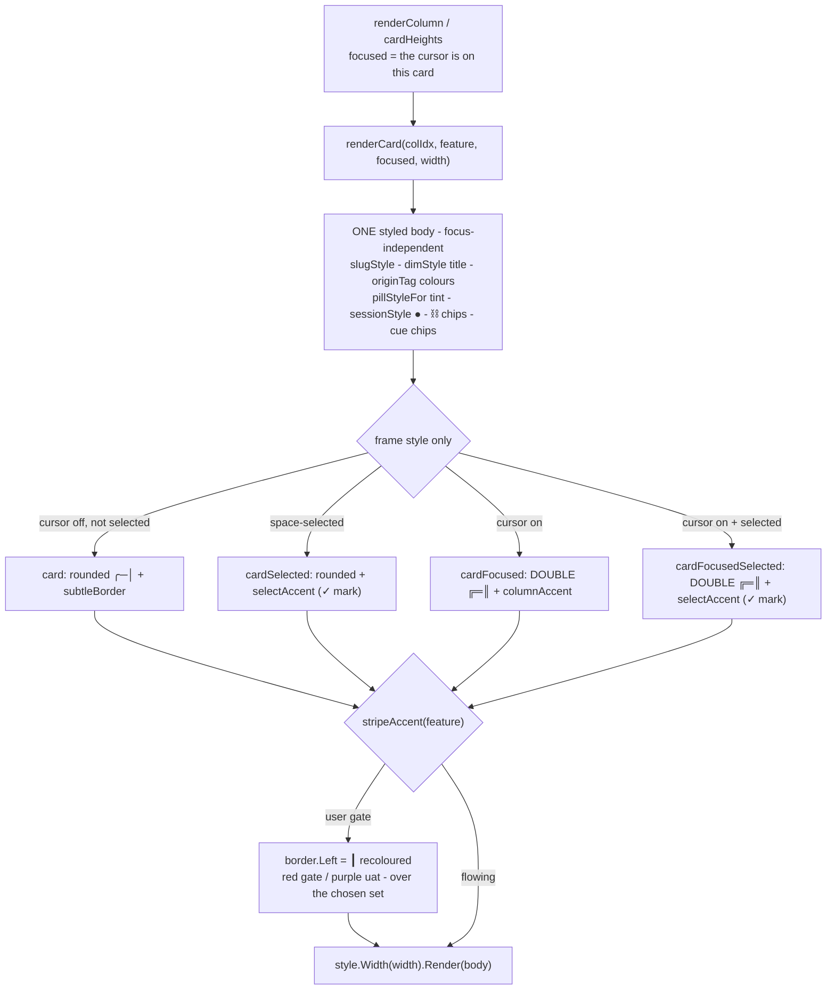

# Plan — card-selection-border

Status: **accepted** (user, 2026-08-02 — D1=A double border + accent, D2=A rows included)

**In one sentence:** the cockpit's focused card is drawn as one flat
foreground+background fill, and to stop that fill from tearing it also **rebuilds the
card's content with every colour stripped** — so moving the cursor onto a card wipes its
status pill, origin dots, session dot and chips. This change marks the focused card with
its **frame only** (a double-line border in the column accent) and renders **one styled
body** whether or not the card is focused.

## Goal

Selecting or focusing a board card must never repaint what is inside it. Keep the card's
inner colours **byte-identical to an unfocused card** (status pill tint, `●` origin dots,
green session dot, `⛓ plan-…` chips, `● building` / `· stalled` cues, slug/title styles)
and mark the focused/selected card with **a border only**.

User's words: *"add only some kind of border on selected items, not highlight all content
inside."*

**Acceptance signal:** on a real terminal, arrowing across the board changes only each
card's **frame**; every coloured element inside the card looks exactly as it did before
the cursor arrived — and the focused card is still unmistakable, including on a
no-colour terminal.

## Context — what exists, and why the colours vanish

The board is the Go TUI in `cli/internal/tui/` (lipgloss, precomputed styles). The loss
is **not** a lipgloss accident — it is a designed consequence of the fill, in two halves
that must be changed together:

| # | Where | What it does |
|---|---|---|
| 1 | `cli/internal/tui/styles.go:165` | `cardFocused: base.BorderForeground(accent).Background(focusBg).Foreground(focusFg).Bold(true)` — **one fg/bg fill over the whole card block** |
| 2 | `cli/internal/tui/view.go:681-723` | `renderCard`'s `if focused { … }` branch **rebuilds the whole body with no styled spans** (plain mark, plain dot, plain origin tag, plain pill, plain agent chip), plus three more `focused →` plain chip branches at `view.go:779-783`, `794-801`, `808-814` |

The code says why, in its own comment (`view.go:682`): *"Plain inner text — the frame
carries one foreground + background so the highlight fills cleanly (no per-segment holes,
incl. the pill's tint)."*

**Measured, not assumed.** Rendering a *styled* body inside that fill (lipgloss
v1.1.1-0.20250404203927, colour profile forced to ANSI256) produces:

```
<ESC>[1;97;40mslug <ESC>[92m●<ESC>[0m src<ESC>[0m …
```

The inner `●`'s own reset (`ESC[0m`) **kills the block background for the rest of the
line** — the "per-segment holes". The same body inside a **border-only** style renders
with every inner colour intact and no holes. So: *keep the fill → you must strip the
content; drop the fill → the content can keep its colours.* **Dropping the fill is
exactly what the user asked for.**

**The same treatment, three more places** (found by grepping every `.Background(` and
every `▸ ` cursor in `internal/tui/`):

- **Plans-tab kanban card** — `plans_tab.go:1354-1388` (`renderPlanCard`) shares the very
  same `cardFocused` style and the same plain-branch trick, threaded through
  `planCardMeta(p, plain)`, `planSourceDots(p, plain)`, `planPickupCue(p, plain)`.
- **Changelog rows** — `view.go:406-408` / `437-439` fill the focused row with
  `changelogFocusStyle` (`styles.go:111`) and render its dots plain.
- **Config-tab project/source rows** — `config_tab.go:342` / `375`, same style, same
  plain dots.
- **Already correct (the precedent this change follows):** the **sessions panel**
  (`view.go:239`), the **drill file list** (`view.go:1027`) and the **plans list**
  (`plans_tab.go:1530`) mark focus with a `▸ ` cursor and **no fill at all** — the
  cursor-only idiom already lives in this codebase.

Other facts the design must respect:

- **Selection already is border-only.** `cardSelected` (`styles.go:166`) is
  `base.BorderForeground(selectAccent)` — a space-selected card keeps its colours today.
  Only `focused` triggers the plain branch, and `focused` currently **beats** `selected`,
  so a selected card under the cursor loses its green marker.
- **Gate stripe.** `view.go:828-830` swaps the whole border for `gateBorder` (rounded with
  `Left = "┃"`), recoloured red/purple, *independent of focus*. `redesign_test.go:85-98`
  pins both that a focused gate card keeps `┃` **and** that a flowing card never shows one.
- **Window math.** `window.go:50-64` (`cardHeights`) measures each card's rendered height
  *with its focus state*, so any height change under focus feeds the scroll windowing.
- **Adaptive colours everywhere** (`styles.go:46-76`, `palette.go`): every token is a
  `lipgloss.AdaptiveColor{Light,Dark}`, so light/dark terminals are already handled — the
  new border colours reuse existing tokens and inherit that.
- **Colour alone is not a cue** (`non-functional-requirements.md`, Diagnosability): a
  distinction carried by colour is flattened by a no-colour TTY **and** by TTY-less
  `go test`. That rules out "just recolour the border" and is why the focus marker must be
  a **different border glyph set**.

Baseline verified before planning: `gofmt -l .` clean, `go vet ./internal/tui/` clean,
`go test ./internal/tui/` green (6.5s). Repo at **0.34.0** (`f77f311`).

## Functional requirements

| FR | Requirement |
|---|---|
| **FR1** | A focused work-board card's **inner content is byte-identical** to the same card unfocused — pill tint, origin dots, session `●`, `⛓` correlation chips, `● building` / `· stalled` cues, `⏸ trigger manually`, slug and title styling all survive focus. |
| **FR2** | Focus is marked by the **frame only**: a **double-line border** (`╔═╗ ║`) in the column accent. The glyph change survives a no-colour terminal and is assertable in `View()`; no content width is consumed. |
| **FR3** | A **space-selected** (ship) card keeps its `selectAccent` border and its `✓` mark. A card that is **both focused and selected** shows the focus border **set** in the **select** accent — both states readable at once (today focus swallows the selection colour). |
| **FR4** | A **gate** card keeps its `┃` left stripe **independent of focus**, composed *over* whichever border set focus chose (so a focused gate card is double-framed **and** striped). A flowing card still never shows `┃`. |
| **FR5** | The **plans-tab kanban card** gets the identical treatment (same style set, same one-body rule) — the two boards stay consistent. |
| **FR6** | The **changelog rows** and the **config-tab project/source rows** keep their colours too: focus stays marked by the `▸ ` cursor they already carry (plus an accent), matching the sessions panel / drill / plans list. *(Fork D2 — droppable without touching FR1-FR5.)* |
| **FR7** | A card's rendered **height is focus-independent**, so the column windowing (`cardHeights` / `reflowColumns`) can never desync when the cursor moves. |
| **FR8** | No layout change: total card width is unchanged (a border cell is a border cell), no new content columns, no key changes. |

### BDD scenarios

```gherkin
Feature: Minimal selection marking on cockpit cards

  Background:
    Given the gogo cockpit board with cards carrying status pills, origin dots and chips

  Scenario: Focus does not repaint the card (FR1, FR2)
    Given a card showing a red "⏸ accept plan" pill and a coloured "● web" origin tag
    When the cursor moves onto that card
    Then every inner element renders with exactly the styling it had unfocused
    And the only difference is the card's border: a double-line frame in the column accent

  Scenario: The focus marker survives a colourless terminal (FR2)
    Given NO_COLOR is set (or the render has no TTY, as under go test)
    When the board renders
    Then the focused card is still identifiable by its ╔ ═ ║ border glyphs
    And every other card keeps its ╭ ─ │ rounded border

  Scenario: Selected and focused are both visible (FR3)
    Given a ready-to-ship card selected with space
    When the cursor moves onto it
    Then it keeps the green ✓ mark and its select-accent border colour
    And it gains the double-line focus frame

  Scenario: A focused gate card keeps its stripe (FR4)
    Given an awaiting-uat card (a user gate)
    When it is focused
    Then it shows the ┃ left stripe AND the focus border set
    And a flowing card never shows ┃

  Scenario: Moving the cursor never resizes a card (FR7)
    Given any card at any width
    When it is rendered focused and unfocused
    Then both renders have the same height
```

## Approach

**Chosen: frame-only selection — one styled body, focus changes the border set.**

1. **`styles.go` — make the card frames border-only.**
   `cardFocused` drops `.Background/.Foreground/.Bold` and becomes
   `base.Border(focusBorder).BorderForeground(accent)` where
   `focusBorder = lipgloss.DoubleBorder()`. Add `cardFocusedSelected` (focus border set +
   `selectAccent`) so FR3 has a style. `cardSelected` is unchanged. The `focusBg`/`focusFg`
   tokens **stay** — the tab bar, filter chips and footer key-chips still use them (those
   are chips, not content).
2. **`view.go` — delete the plain branch.** `renderCard` keeps only today's *styled* path;
   `focused` no longer touches the body, only the frame choice at the bottom. The three
   `focused →` plain chip branches collapse to their styled form.
3. **`view.go` — compose the gate stripe instead of replacing the border.** Rather than
   `style.Border(gateBorder)` (which would throw the focus set away), read the style's
   current border and override just its left edge:
   `b := style.GetBorderStyle(); b.Left = gateStripe; style = style.Border(b).BorderLeftForeground(col)`.
   `lipgloss.Style.GetBorderStyle()` exists in the pinned version (verified in the module
   cache). The `gateBorder` var becomes dead and goes; the `gateStripe` const stays (it is
   the assertable glyph).
4. **`plans_tab.go` — same collapse** for `renderPlanCard`, and drop the now-always-`false`
   `plain` parameters from `planCardMeta` / `planSourceDots` / `planPickupCue`.
5. **(D2) rows** — `changelogRow` / `changelogRowSingle` / the two config-tab row loops keep
   their styled forms and mark focus with the `▸ ` cursor they already render (the focused
   slug picks up an accent instead of a bar). `originDots(…, plain)` /
   `projectOriginDots(…, plain)` then have no `plain` caller left and lose the parameter.

**Why double-line and not something else:** it is the only readily available set that (a)
costs zero content width, (b) reads as "this one" without colour, and (c) does **not**
collide with the `┃` gate stripe. `ThickBorder()`'s sides *are* `┃`, which would make every
focused card look like a gate and break `TestGateCardStripeGlyph`.

### Alternatives considered

| Alternative | Why not |
|---|---|
| **Keep the fill, thread the background through every inner style** (so the tints survive) | Restores a *washed* version of the colours at best, touches every style in the package, and is the opposite of what the user asked for. |
| **Border colour only** (keep the rounded set, just recolour it) | Smallest diff, but the focus cue dies on a no-colour terminal and is unassertable in `go test` — straight through the Diagnosability bar. Kept as the fallback if double-line reads too heavy (D1-B). |
| **Keep the fill, add a `▸` cursor inside the card** | Still repaints the content, and eats 2 columns of the slug budget on the focused card only (a jumpy name row). |
| **`ThickBorder()` for focus** | Its `┃` sides collide with the gate stripe glyph — a focused flowing card would read as a gate and break `redesign_test.go:95`. |
| **A theme/token overhaul (a proper "selected" design language)** | Far more than the ask; the simple version fully works. |

## Intended design



The as-is baseline — the two-branch renderer and the fill that forces it — is captured
separately in `charts/before/flow.mmd`.

## Changes checklist

**All 7 steps built and verified (fast run, 2026-08-02) — see `report/report.md`.**

In build order. Every step is inside `cli/` except the last.

1. **`cli/internal/tui/styles.go`**
   - add `focusBorder = lipgloss.DoubleBorder()` (with a comment naming *why* not Thick);
   - `cardFocused` → `base.Border(focusBorder).BorderForeground(accent)` (no fill);
   - add `cardFocusedSelected` → `base.Border(focusBorder).BorderForeground(selectAccent)`;
   - keep `cardSelected`, `focusBg`, `focusFg` (still used by tabs/chips/rows).
2. **`cli/internal/tui/view.go` — `renderCard`**
   - delete the `if focused {…} else {…}` body split, keeping the styled path;
   - collapse the `focused` conditionals in the correlation chip, `cardStateCue` and
     `autoPickupBlocked` blocks to their styled forms;
   - frame selection becomes `focused && selected → cardFocusedSelected`,
     `focused → cardFocused`, `selected → cardSelected`, else `card`;
   - gate stripe: compose `GetBorderStyle()` + `Left = gateStripe` instead of replacing the
     border; drop the now-dead `gateBorder` var from `styles.go`.
3. **`cli/internal/tui/plans_tab.go` — `renderPlanCard`**
   - delete the focused/plain split (keep the styled head + meta);
   - drop the `plain` parameter from `planCardMeta`, `planSourceDots`
     (`plans_tab.go:1394/1436`) and `planPickupCue` (`pickup.go:150`); update
     `pickup_test.go:194`.
4. **(D2 = include) rows keep their colours**
   - `cli/internal/tui/view.go:367-449` — `changelogRow` / `changelogRowSingle`: render the
     styled row for both states, focus = the `▸ ` cursor (+ accent on the slug), no
     `changelogFocusStyle` fill;
   - `cli/internal/tui/config_tab.go:320-379` — the project + source row loops likewise;
   - drop the `plain` parameter from `originDots` (`palette.go:56`) and
     `projectOriginDots` (`config_tab.go:386`); update `colors_test.go:141-148`;
   - keep `changelogFocusStyle` only if a caller remains — otherwise delete it.
5. **`cli/internal/tui/card_selection_test.go` (new)** — the guards listed under **Tests**.
6. **Version bump (behavioural change, per `coding-rules.md`)** — `.claude-plugin/plugin.json`
   `version` → `0.35.0` **and** `cli/main.go:23` `Version = "0.35.0"` (it mirrors the plugin).
7. **Gates before hand-off** — `cd cli && gofmt -l . && go vet ./... && go test -race ./...`.

No knowledge/docs/enumeration sync is needed: `README.md`, `docs/cli-contract.md` and
`skills/gogo-cli/SKILL.md` mention "the focused card" only as a *session* target, never its
styling (grepped). The `tech-stack.md` test-function count is phase ⑤'s routine reconcile.

## Tests

**Level: Go unit tests in `package tui`** (they render real `View()` / `renderCard()`
output — the level where the defect lives). Plus one manual terminal pass, which is phase
④'s job.

New file `cli/internal/tui/card_selection_test.go`:

| Test | What it pins |
|---|---|
| `TestFocusedCardKeepsInnerColors` | Forces the colour profile (`lipgloss.SetColorProfile`, restored via `t.Cleanup`) and asserts the focused card's body — border glyphs stripped — is **byte-identical** to the unfocused one. **Anti-vacuity:** fails if the unfocused body contains no ANSI sequence at all (otherwise the equality would prove nothing). |
| `TestFocusedCardFrameCarriesNoFill` | `columnStyles[i].cardFocused.GetBackground()` / `.GetForeground()` are unset for all four columns — the invariant, asserted through the lipgloss API rather than a source grep, so it cannot regress quietly. |
| `TestFocusedCardMarkedByBorderGlyph` | With **no** colour (the default `go test` render): a focused card contains the double-border glyphs and an unfocused one does not — the cue survives a colourless terminal. |
| `TestSelectedAndFocusedBothVisible` | A space-selected card keeps `✓` + its select accent; focused **and** selected shows the focus border set **and** stays on the select accent (FR3). |
| `TestFocusedGateCardKeepsStripeAndFocusBorder` | Extends `redesign_test.go`'s gate check: a focused gate card carries **both** `┃` and the focus glyph; a focused flowing card carries the focus glyph and **no** `┃`. |
| `TestCardHeightIsFocusIndependent` | Over narrow + wide widths and a fixture set (gate, live-session, correlation chips, long origin tag): `lipgloss.Height(focused) == lipgloss.Height(unfocused)` — the windowing guard (FR7). |
| `TestFocusedPlanCardKeepsInnerColors` | The plans-tab mirror of the first test (FR5). |
| `TestFocusedChangelogRowKeepsColors` *(D2)* | A focused changelog row keeps its origin/session dot colours and still shows `▸` (FR6). |

**Regression suites that must stay green unchanged** (they already parametrise over
`focused ∈ {false,true}`): `workspace_test.go:98-170` (tag on the name row; long-tag
no-wrap), `redesign_test.go:83-98` + `:240-260` (gate stripe; `● developer` chip on a
focused card), `waiting_test.go:20-36` (`⏸` marker on a focused card),
`unified_board_test.go:120-245`, `correlation_test.go`, `pickup_test.go`.

**Manual (phase ④, real terminal + tmux):** arrow across all four columns and the plans
tab — pills, dots and chips must not change as the cursor passes; check a
light-background profile and a dark one; run once with `NO_COLOR=1` and confirm the
focused card is still obvious.

## Out of scope

- The **status pill wrapping** on very narrow cards (the styled pill's `Padding(0,1)` is not
  truncated to the card width) — pre-existing, unchanged by this plan, and now simply
  symmetric between focused and unfocused.
- **Tab bar / filter chips / footer key-chips** (`tabActiveStyle`, `chipActiveStyle`,
  `keyChipStyle`): those *are* chips, not card content — their fill stays.
- The **sessions panel**, **drill file list** and **plans list**: already cursor-only, nothing
  to fix.
- Any **new colour tokens, theming, or a card redesign** — this change removes a fill and
  swaps a border set; it introduces no new palette.
- **Key bindings, layout, column widths, data** — untouched.

## Summary (TL;DR)

- **What:** stop the cockpit from repainting a card's insides when it is focused — mark the
  focused/selected card with **a border only**, exactly as the user asked.
- **Why (root cause, measured):** `cardFocused` (`styles.go:165`) paints one fg/bg fill over
  the whole card, and because such a fill **tears at every inner ANSI reset**,
  `renderCard`'s `focused` branch (`view.go:681-723`) deliberately rebuilds the body with
  **no colours at all**. Both halves must go together.
- **How:** one styled body for every state; `cardFocused` becomes a **double-line border in
  the column accent** (colourless-safe, zero width cost, no clash with the `┃` gate stripe),
  a focused+selected card keeps the green select accent, and the gate stripe is now
  *composed over* the focus border instead of replacing it. Same fix for the plans-tab card
  and (D2) the changelog/config rows.
- **Risk:** low and contained to `cli/internal/tui/` — no data, keys or layout change; the
  new `TestCardHeightIsFocusIndependent` guard closes the only real hazard (window-height
  math), and card height actually becomes *more* stable than today.
- **Next:** accept this plan (two forks below — **D1** the focus marker, **D2** whether the
  changelog/config rows come along), then `/gogo:go` builds it as **0.35.0**.
</content>
</invoke>
