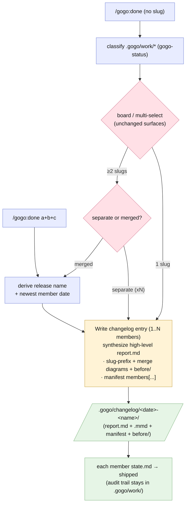

# Plan — feature `changelog-merged-entries`

Status: **built — report-complete** (phase ⑤, 2026-07-02 · shipped in plugin **0.8.0**). Shipped as accepted; the one delta was **D1 itself, a mid-plan scope expansion** — at the acceptance gate the user widened it from "merged entries only" to "**every** changelog entry, single or merged, is a synthesis" (no full-report copies; see [adjustments.md](adjustments.md)). Review also added `docs/index.md` to the FR4 sync set (REV-001). As-built report: [report/report.md](report/report.md).

## Goal

Make the changelog **high-level in both directions**: `/gogo:done` can **ship several related work items as ONE merged release entry**, and **every entry — merged or single — is a synthesized summary, not a copy of the full report bundle**. Today each pick produces its own `<date>-<slug>/` folder holding the entire report; a repo like prosteKarnety with 6-7 sibling features (all "appointments") gets a changelog that is both too many entries and too many files per entry. After this change the changelog reads like a release history — *what was changed/done/implemented* — while the full audit trail stays where it already lives, in `.gogo/work/`.

## Context — what exists

- **`skills/gogo-done/SKILL.md`** — two modes: `<slug>` ships one; no-slug opens the **work board** (TUI or table+multi-select fallback). Either way each selected slug runs the single-sourced **"Ship one feature"** flow: derive date → copy `report/` bundle → `state.md: shipped` → build viewer page. The board **selects only** — `board.py` never archives (that separation is what makes this feature cheap: merge is a post-selection concern; **`board.py` needs zero changes**).
- **`skills/gogo-status/SKILL.md`** — the shared classifier; rule 1 marks a feature **shipped** when `state.md` says `shipped` **or** a `.gogo/changelog/*-<slug>/` entry exists. A merged entry named after the *release* won't match member slugs by folder name — membership needs to be recorded.
- **`skills/gogo-view/SKILL.md`** — renders any changelog entry: `report.md` + the `*.mmd` beside it (+ `before/` → compare mode). A merged entry that keeps this flat layout **renders with zero viewer changes**.
- **Entry layout today** — `report.md`, `*.mmd`, `diagrams.html`, `manifest.json`, `before/`.

## Functional requirements

- **FR1 — merge selection.** After the board (TUI or fallback) returns **≥2** selected slugs, ask one question: **ship separately (N entries) or merged (1 entry)?** Also support the direct arg form **`/gogo:done slug1+slug2+slug3`** (`+`-joined = merge those, skipping the board). A single selection never asks — same path, new entry shape (FR2).
- **FR2 — every entry is a synthesis (D1 custom — merged AND single).** A changelog entry's `report.md` is **written, never copied**: a high-level summary of *what was changed/done/implemented* — lead paragraph, key outcomes, one-line decisions, review/test verdict in a sentence — with a link back to the feature's `.gogo/work/` folder for the full audit trail (review/test rounds, per-file changes table, decisions detail). No full-report duplication.
  - **Merged entry** `.gogo/changelog/<date>-<release-name>/`: one synthesis across all members + a member table (slug · title · one-line outcome) + a short section per member; member diagrams **flattened with slug-prefixed names** (`<slug>-flow.mmd`), merged `manifest.json` (titles prefixed + a `members` array), member `before/` sets merged the same way; date = **newest** member `completed:`.
  - **Single entry** `<date>-<slug>/`: the synthesis condensed from that feature's report + its `.mmd` set + `manifest.json` + `before/` — same shape, one member.
  - **Slimmer file set:** `report.md` + `*.mmd` + `manifest.json` + `before/` only. The static `diagrams.html` copy is **dropped** from new entries — `/gogo:view` builds the interactive page from these sources; `gogo-done`'s Return links the interactive page (folder path as fallback). Existing heavy entries stay as-is (append-only; retro-slim is a follow-up, not this feature).
- **FR3 — members marked shipped + classifier aware.** Every member's `state.md` → `status: shipped`, resume noting the merged entry path. `gogo-status` rule 1 additionally matches a slug listed in any changelog entry's `manifest.json` `members` array.
- **FR4 — viewer + docs unchanged in behaviour, synced in wording.** Any entry (merged or slim single) renders with the existing `gogo-view` build (flat layout guarantees it; compare mode still pairs by kind; a missing `diagrams.html` was never required by the viewer). Sync `commands/done.md`, `skills/gogo/SKILL.md`, `README.md`, `docs/{commands,flow,architecture}.md`; bump `plugin.json` → **0.8.0**; command count stays 12.

## Approach (recommended)

**Merge as a post-selection orchestrator step; synthesis as the one entry-writer.** The selection surface (TUI board, fallback multi-select, or `+`-joined arg) stays exactly as is; when ≥2 slugs come back, one `AskUserQuestion` gates separate-vs-merged. Entry-writing is refactored into a single **"Write changelog entry"** step used by both paths: it takes 1..N member features, synthesizes the high-level `report.md` (D1), flattens/prefixes the diagram set + manifest (`members` array always present, even for one), and flips each member's `state.md`. "Ship one feature" becomes "Write changelog entry with one member" — one writer, no divergence between single and merged shapes.

*Alternatives considered:* a merge toggle inside `board.py` (rejected: touches the vendored TUI + its exit-code contract for no gain); post-hoc `gogo:merge` command that fuses already-shipped entries (rejected: two-step, and the moment to summarize is while shipping); per-member subfolders inside the entry (rejected: breaks the viewer's flat-layout assumption); keeping full-report copies in the entry (rejected by the user at D1 — the work folder is the audit trail, the changelog is the story).

## Changes checklist (build order)

1. `skills/gogo-done/SKILL.md` — FR1 gate + arg grammar `slug1+slug2`; refactor to the single **"Write changelog entry (1..N members)"** flow (FR2 synthesis + slim file set + FR3 state-flip); Return links updated (interactive page, folder fallback).
2. `skills/gogo-status/SKILL.md` — classifier rule 1 reads `manifest.json` `members`.
3. `commands/done.md` — document merge mode + synthesized entries (thin).
4. `skills/gogo/SKILL.md`, `README.md`, `docs/{commands,flow,architecture}.md` — FR4 sync (entry = high-level synthesis; changelog layout description updated).
5. `.claude-plugin/plugin.json` — 0.8.0.

## Tests

- **Fixture dogfood (scratch):** 3 ready-to-ship fixtures → merge 2 → assert one entry (synthesized `report.md` — no full-report copies, prefixed `.mmd`, merged manifest with `members`, merged `before/`, **no `diagrams.html`**), both `state.md` shipped, the third untouched; classifier reports both members shipped (via `members`); re-run idempotent (same dated dir overwritten).
- **Single-slug path:** ships a **slim synthesized** entry (same writer, one member) — no new question for N=1, no full-report copy.
- **Viewer:** build the page for a merged entry and for a slim single entry — both render; compare mode pairs prefixed kinds; absent `diagrams.html` is a non-event.
- **FR4 sync sweep** (version, command count, no stale "one entry per feature" / "copies the report bundle" wording).

## Out of scope

- Retro-merging or retro-slimming **already-shipped** entries (possible later `gogo:merge` / migration; the existing heavy entries stay as-is).
- Cross-repo releases (roadmap #9), TUI changes (`board.py` untouched), auto-detecting "related" features (the user selects; gogo suggests nothing).

## Intended design

> **As built (report ⑤, 2026-07-02):** the intended design held — the shipped flow matches
> this diagram. The as-built set (this flow + a merged-ship sequence diagram) lives in
> `report/` with the before baseline in `report/before/`.

