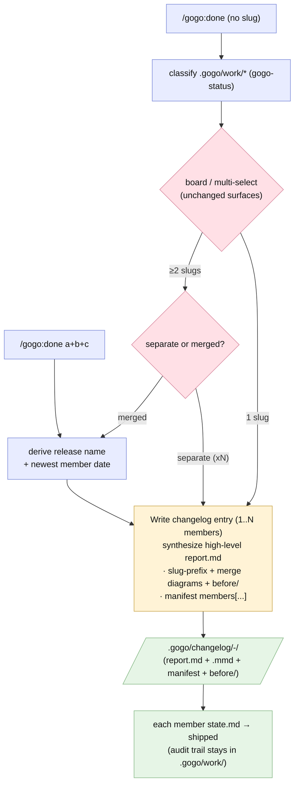
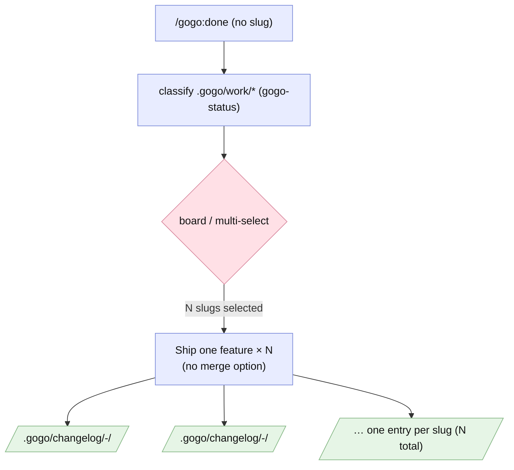

# Report — feature `changelog-merged-entries`

- **feature:** `/gogo:done` merged changelog entries — ship 1..N related work items as one synthesized release entry
- **status:** done
- **completed:** 2026-07-02
- **branch / commits:** `main` · working-tree change (commit + ship later via `/gogo:done`)

## Run status / gaps

**All five phases completed cleanly; zero open issues.** Plan → implement → review → test → report ran with plan=1 · implement=2 · review=2 · test=1 rounds. Every finding is resolved: **4 review issues verified** (1 major + 3 minor) and **1 test nit verified** (fixed inline at the test gate). This is a clean green release.

## Summary

**The changelog now reads like a release history.** Every entry — merged *or* single — is a **written synthesis** of *what was changed/done/implemented*: a lead paragraph, key outcomes, one-line decisions, and a one-sentence review/test verdict, linking back to `.gogo/work/` for the full audit trail instead of copying it. And `/gogo:done` can now **ship several related features as ONE merged release entry**: pick ≥2 on the work board and answer a single separate-vs-merged question, or pass `slug1+slug2+slug3` directly. Merged entries live at `.gogo/changelog/<date>-<release-name>/` (name suggested from the members' common theme and confirmed; date = the newest member), carry slug-prefixed diagrams plus a `manifest.json` with a new `members[]` array, and the `gogo-status` classifier marks every member shipped through it. Entries got **slimmer** too — the static `diagrams.html` copy is dropped; `/gogo:view` builds the interactive page from source. Ships as **plugin 0.8.0**; `board.py` untouched; command count stays 12.

## Planned vs shipped

**Shipped as accepted, with one deliberate delta — the D1 scope expansion.** At the acceptance gate the user rejected both D1 options (full-report copies) and widened the feature: *every* entry, not just merged ones, is a synthesis-only summary ("changelog should be just high level info of what was changed/done/implemented"). FR2 was rewritten and the single-slug "Ship one feature" flow was folded into the same writer before implementation began — see [adjustments.md](../adjustments.md). One small scope addition during review: **REV-001** revealed the plan's FR4 sync list had missed `docs/index.md`, so it joined the doc sweep. Everything else — merge gate, `+` arg grammar, `members[]` schema, classifier rule, viewer-compatible flat layout, 0.8.0 bump — landed exactly as planned.

## Implementation

**One entry-writer, three ways in.** `skills/gogo-done/SKILL.md` was rebuilt around a single **"Write changelog entry (1..N members)"** flow — `<slug>`, `slug1+slug2+...`, and the board all funnel into it; there is no divergent single-vs-merged path. The board still only *selects* (post-selection merge gate, D3); when ≥2 slugs come back one `AskUserQuestion` asks separate-vs-merged, and the `+`-joined arg pre-answers it. The writer derives the date (newest member `completed:`) and the name (slug for N=1; suggested release name + one confirm for merged, D2), **writes** the synthesized `report.md` with the Write tool (never `cp`), flattens each member's diagrams and `before/` set to slug-prefixed names, writes one schema-complete `manifest.json` (`{kind, file, title}` per diagram + `members[]`), flips each member's `state.md` to `shipped`, and builds the interactive viewer page best-effort (Return prints the `file://` link, folder path as fallback). Re-ships are idempotent: the dated dir's diagram set is cleared and rewritten, never duplicated.

### Changes (as-built)

| File | Change | Note |
|---|---|---|
| `skills/gogo-done/SKILL.md` | rewritten | unified 1..N entry-writer; FR1 merge gate + `+` arg; D2 name suggest+confirm; synthesis `report.md`; slim file set (no `diagrams.html`); state-flip; viewer link |
| `skills/gogo-status/SKILL.md` | modified | classifier rule 1 also matches `manifest.json` `members[]`; skips malformed manifests safely |
| `templates/contracts/charts-manifest.schema.json` | modified | additive optional `members` (kebab-case slug array); old manifests still validate |
| `templates/contracts/README.md` | modified | documents `members?` (REV-002) |
| `skills/gogo-view/SKILL.md` | modified | wording only: `<date>-<name>`, compare pairs by filename `<stem>` (REV-004, TEST-001) |
| `commands/view.md` | modified | arg hint `<date>-<name>` (REV-004) |
| `commands/done.md` | modified | documents merge mode + synthesized entries |
| `skills/gogo/SKILL.md`, `README.md`, `docs/{index,commands,flow,architecture}.md` | modified | FR4 sync — synthesis language, `<date>-<name>` layout; `docs/index.md` added via REV-001 |
| `.claude-plugin/plugin.json` | modified | version → **0.8.0** |
| `assets/kanban/board.py` | untouched | merge is a post-selection concern (D3) — selftest still green |

## Decisions & rationale

See [decisions.md](../decisions.md) for the full record.

| Decision | Choice | Reason |
|---|---|---|
| D1 — member detail in an entry | **custom: synthesis-only, for single AND merged** | the changelog is the story, `.gogo/work/` is the audit trail — full-report copies are too heavy in both modes (user, at the acceptance gate) |
| D2 — release naming | **A: suggest + one confirm** | the name is the release's identity in an append-only archive; a bad auto-derivation is annoying to live with |
| D3 — where the merge question lives | **A: post-selection gate** | works identically for TUI, fallback, and the `+` arg; `board.py` and its exit-code contract stay untouched |

## Review outcome

**Two rounds; verdict APPROVE.** Round 1 raised one major — REV-001, `docs/index.md` still said `/gogo:done` "copies the bundle" (the exact behaviour this feature changed) — plus three minors (contracts README missing `members?`; the entry-writer under-specifying manifest `diagrams[]` fields; stale `<date>-<slug>` wording). All four were fixed in implement round 2 and **verified** in review round 2, with a clean regression glance over the six touched files. See [review-01.md](../review-01.md) · [review-02.md](../review-02.md) · [review/issues.json](../review/issues.json).

## Test outcome

**GREEN — all 7 test cases passed in one round.** A scratchpad **fixture dogfood** exercised the writer end-to-end: a merged ship (A+B → one entry with slug-prefixed diagrams, `members[]`, no `diagrams.html`, idempotent re-run, third feature untouched) and a single ship (same writer, same slim shape); the classifier resolved both members via `members[]` and skipped a deliberately malformed manifest; viewer stem-pairing was simulated correct; all 12 real manifests still validate against the extended schema; and the FR4 sweep confirmed 0.8.0, 12 commands, no stale wording, `board.py --selftest` pass. One nit (TEST-001, the gogo-view `<kind>`→`<stem>` pairing wording) was fixed inline and verified. See [test-01.md](../test-01.md) · [test/issues.json](../test/issues.json).

## Diagrams

Two as-built diagrams (no `diagrams.html` in this bundle — this feature's own rule; open them interactively with `/gogo:view changelog-merged-entries`):

- `flow.mmd` — the shipped `/gogo:done` control flow: three ways in, one merge gate, one synthesis writer.
- `sequence.mmd` — the merged-ship runtime interaction: user answers the two gates, the writer synthesizes and flips members.



```mermaid
sequenceDiagram
  actor U as User
  participant D as /gogo:done
  participant S as gogo-status classifier
  participant B as board / multi-select
  participant W as Write changelog entry (1..N)
  participant WK as .gogo/work/feature-*/
  participant CL as .gogo/changelog/&lt;date&gt;-&lt;name&gt;/
  participant V as gogo-view build

  U->>D: /gogo:done (no slug)
  D->>S: classify .gogo/work/*
  S-->>D: work-index (ready-to-ship, ...)
  D->>B: open TUI board (or table fallback)
  B-->>D: selected slugs (N >= 2)
  D->>U: ship separately or merged? (one AskUserQuestion)
  U-->>D: merged
  Note over D: /gogo:done a+b+c pre-answers this gate (board skipped)
  D->>U: suggested release name (common theme, D2)
  U-->>D: confirm or override
  D->>W: members[], release name, newest member date
  loop each member
    W->>WK: read report/report.md (+ decisions.md)
    W->>CL: copy .mmd + before/ as slug-prefixed files
  end
  W->>CL: WRITE synthesized report.md (never a copy)
  W->>CL: WRITE manifest.json { diagrams[], members[] }
  Note over CL: slim set — no diagrams.html copy
  loop each member
    W->>WK: state.md -> status: shipped
  end
  W->>V: build interactive page (best-effort)
  V-->>U: file:// viewer link (folder path fallback)
```

## Before / after comparison

The plan captured an as-is baseline (copied here as `before/flow.mmd`). **Flow** is present in both sets; **sequence** is added (after only — the merged-ship interaction did not exist before).

**Before** — multi-select just looped "Ship one feature": N picks always produced N separate entries, each a full report-bundle copy (report.md, diagrams, `diagrams.html`, manifest, before/):



**After** — see the flow diagram above (Diagrams section). **What changed:** a separate-vs-merged gate now sits after selection, a `+`-joined arg can pre-answer it, and all shipping funnels through one "Write changelog entry (1..N members)" writer that *synthesizes* the entry (slim file set, `members[]`, slug-prefixed diagrams) instead of copying N full bundles — so N related features can become one release entry, and even a single entry is a high-level summary linking back to the work folder.

## Knowledge updates

- `project-knowledge.md` (proxy — `## gogo overrides` only): added the **since 0.8.0** bullet — entries are synthesized (supersedes the 0.5.0 "copies the bundle" description), merged entries + `members[]`, current version 0.8.0.
- `non-functional-requirements.md` (owned): new **Footprint** bar — changelog entries are high-level syntheses with a slim file set (no full-report copies, no `diagrams.html` duplicates).
- `code-review-standards.md` (owned): the REV-001 lesson — a doc-sync sweep must enumerate **all** of `docs/*.md`, including the `docs/index.md` quick-reference table, not just a hand-listed subset.

No upstream (README/CLAUDE.md) edits suggested — the README was synced in-scope by FR4.

## Follow-ups & known limitations

- **Retro-slim migration** of the 5 existing heavy changelog entries (pre-0.8.0 full copies with `diagrams.html`) — a possible `gogo:merge` / migrate pass; the archive is append-only, so they stay as-is until then.
- **prosteKarnety is the first real consumer** — its 6-7 sibling "appointments" features are the motivating case for a merged release entry.
- Cross-repo releases remain roadmap #9; auto-detecting "related" features is intentionally not done (the user selects; gogo suggests nothing).
