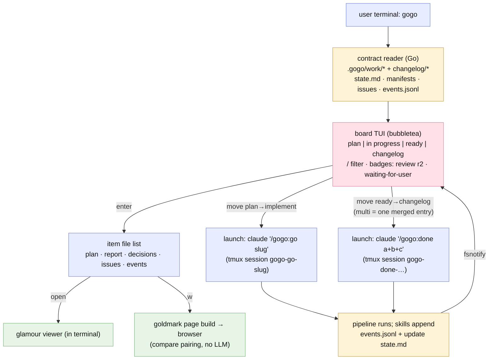

# Plan — feature `cli-cockpit-and-events`

Status: **as-built** (report ⑤, 2026-07-03 — shipped as v0.10.0; accepted round 3: Charm stack pinned incl. glow soft-dep + huh forms; D1=A events.jsonl · D2=A claude-in-tmux. The intended design held; see the as-built deltas below and `report/report.md`.)

## As-built deltas (phase ⑤)

The shipped system matches the intended design — same architecture, same flow,
same contract. Three deltas, all recorded in the audit trail:

1. **mermaid-ascii dropped as a dependency** (implement round 3 judgement call):
   its graph renderer is reachable only through a cobra/gin `cmd` package (gin +
   bytedance/sonic assembly — a build risk and disproportionate weight for a
   ms-startup binary). Replaced by a **minimal internal flowchart→ASCII renderer**
   (`cli/internal/diagram`) + the plan's already-accepted source-display fallback
   for sequence/class/state kinds.
2. **Single-owner event emitters** (REV-001 refinement of FR1): each phase skill
   owns ALL lifecycle events for its phase; the orchestrator emits ONLY
   `gate-opened`/`gate-resolved` — every transition emitted exactly once, frozen
   into `docs/cli-contract.md` §5.
3. **The huh-form routing blocker** (TEST-001, found only by live tmux TUI
   testing): the top-level Bubble Tea `Update()` dropped huh's async messages, and
   the fields were bound into the value-copied Model — launch forms could never be
   submitted. Fixed round 5 (route ALL messages to the form + heap-stable
   `*formBinding`); confirm now defaults to Launch (Enter submits; Esc/Ctrl+C
   abort and clear the selection — TEST-002).

## Goal

Make managing gogo work **instant**: a native **`gogo` CLI (Go + Bubble Tea, in `cli/`)** that opens the kanban board in milliseconds by **deterministically parsing the contract files the plugin already writes** — no LLM in the read path. Board items are the feature folders; enter a card to browse and read its files **in the terminal**; move a card between columns to **launch Claude** for the real pipeline work (`/gogo:go`, `/gogo:done`) in attachable tmux sessions. The plugin side gains the one missing contract: an **`events.jsonl`** per feature, appended at every phase transition, so the board shows live pipeline progress and per-item history.

Origin: `/gogo:done` and `/gogo:view` are slow because an LLM classifies, renders, and asks — deterministic work. And the tmux-TUI lesson holds: a slash command can't paint a TUI over Claude Code's terminal. So the cockpit is a **binary the user runs**; Claude stays what only Claude can be — the pipeline engine and the synthesis writer.

## Context — what exists

- **The deterministic contract (already on disk):** `.gogo/work/feature-<slug>/{plan.md, state.md (phase/status/iterations/resume lines), decisions.md, adjustments.md, review-NN.md, test-NN.md, review|test/issues.json (schema'd), report/ (report.md + .mmd + manifest.json{members[]} + before/), charts/}` and `.gogo/changelog/<date>-<name>/` (+ `members[]`). The **gogo-status classifier rules** (shipped / ready-to-ship / in-progress / unfinished) are documented and portable to Go.
- **What's missing for live visibility:** state.md holds only the *current* phase — no timestamps, no history (when implement started, when review round 2 opened, when it bounced back). The user explicitly asked for this history.
- **The parked branch** (`feature/xplan-board-and-simple-done`): the interaction design to harvest — 4 columns, `space/v/s/m///q` keys, class guards, multiple=merge semantics — plus the gogo-view step-3 page-assembly rules (markdown→HTML, figure blocks, compare pairing by stem) to port to Go.
- **Claude Code headless/tmux:** `claude "/gogo:go <slug>"` runs interactively (gates answerable) — detachable when started inside tmux; `claude -p` is one-shot print mode (no attach). tmux is installed on this host; stays a soft dep.
- **Charm stack (user-confirmed):** **bubbletea** (TUI) + **bubbles** (list/table/viewport) + lipgloss (style) + **glamour** — the engine inside **glow**, so in-board viewing IS glow-quality rendering, in-process — + **huh** (forms: release-name prompt, confirmations) + goldmark (md→HTML for the `--web` page) + fsnotify (live refresh). The `glow` binary itself is a soft-dep nicety: when installed, `G` opens the current file in full glow (pager/browse).

## Functional requirements

### Stage A — the events contract (plugin side)
- **FR1 — `events.jsonl` per feature.** Every phase transition appends one line to `.gogo/work/feature-<slug>/events.jsonl`: `{"ts": "<ISO8601>", "event": "phase-started|phase-done|round-opened|issues-found|fix-round|gate-opened|gate-resolved|shipped", "phase": "plan|implement|review|test|report|done", "status": "<state.md status>", "round": N?, "note": "<one line>"}`. Emitted by the orchestrator + phase skills at the same moments they update `state.md` (state.md stays the human resume file — events are append-only telemetry; a missing events file is never an error).
- **FR2 — the CLI contract documented.** New `docs/cli-contract.md`: the exact folder layout + files a deterministic consumer may rely on (state.md line grammar, classifier rules, issues-list/manifest schemas, changelog entry shape, events.jsonl shape) — versioned alongside `templates/contracts/events.schema.json`. Plugin version → **0.10.0**.

### Stage B — the `gogo` CLI (Go, `cli/`)
- **FR3 — the board.** `gogo` (no args) → 4 columns **plan · in progress · ready · changelog** from the ported classifier; cards = feature folders (slug, title, sub-phase badge for in-progress from events/state — e.g. `review r2`, plus a `waiting-for-user` flag from state.md); `/` live filter; **fsnotify** on `.gogo/` → the board updates itself while the pipeline runs. Starts in milliseconds; read-only by default.
- **FR4 — drill-in + terminal viewing.** Enter on a card → the item's **file list** (plan, report, decisions, adjustments, review/test snapshots, issues, events timeline, charts). Open any: markdown via **glamour** (glow's renderer) in a scrollable viewport; **`G`** opens the same file in the **`glow` binary** when installed (soft dep — full pager/browse UX); issues.json as a readable table; events.jsonl as a timeline; **diagram `.mmd` files render as ASCII in-terminal** via the Go `mermaid-ascii` package — flowchart-family kinds drawn as boxes-and-arrows; kinds it can't draw (sequence/class/state) show the highlighted source + a "press `w` for the browser view" hint. `w` on plan/report/changelog → **build the interactive HTML page natively** (goldmark + the vendored viewer template, incl. before/after compare pairing — the gogo-view step-3 rules ported) and open the browser. No LLM anywhere.
- **FR5 — column moves launch Claude.** Legal moves only (guards from the classifier): **plan → implement** and resume of in-progress ⇒ launch `claude "/gogo:go <slug>"`; **ready → changelog** (one or MULTIPLE selected = one merged entry) ⇒ a **huh form** (merged: release-name input with the suggested common-theme default; always: a confirm summarizing what will run) ⇒ launch `claude "/gogo:done <slug|a+b+c>"`. Launch mechanics: inside a **tmux session `gogo-<action>-<slug>`** when tmux exists (the TUI lists running sessions; `a` attaches/switches; a gate-parked run shows as *waiting for user — attach or resume in chat*); without tmux, background `claude -p` with a log file and honest status. The card immediately shows **running/in-progress** — it moves columns only when the contract files actually change (events/state), never optimistically. Illegal moves (plan→done) bounce with the reason.
- **FR6 — non-interactive commands.** `gogo status` (classifier table), `gogo view <slug|:plan|:report|entry> [--web] [--open]`, `gogo events <slug>`. Scriptable, zero-config, exit codes documented.
- **FR7 — build + docs.** `cli/` Go module (pinned deps), `make build` / `go build ./cli/...` producing `gogo`; README + docs section (install: `go install` or build from source; goreleaser later); `.gitignore` for the binary; the CLI's own `--version` mirrors the plugin version.

## Approach (recommended)

**Deterministic reader, Claude executor.** The CLI owns everything mechanical (parse → classify → render → build pages) and **delegates every state-changing action to Claude by launching the real slash commands** — one writer, no divergence, gates stay answerable (tmux attach). The plugin's only change is *emitting* the telemetry it already knows (events.jsonl) and freezing the file contract in a doc. Slash commands remain the pipeline engine and the fallback UX; the binary is the cockpit.

*Alternatives considered:* a native Go ship-writer (rejected by the user — the changelog synthesis must be Claude); intent-files + a watching chat session (rejected: re-imports the "go back to Claude" dance); `claude -p` for everything incl. gates (rejected: gates need interactivity — tmux-wrapped interactive sessions keep them answerable); parsing state.md alone for history (insufficient: no timestamps/rounds — hence events.jsonl); a separate repo (user chose monorepo `cli/` — contracts stay beside their spec).

## Changes checklist (build order)

**Stage A (plugin)**
1. `templates/contracts/events.schema.json` + `docs/cli-contract.md` (the frozen consumer contract).
2. Event emission: `skills/gogo/SKILL.md` (orchestrator transitions), `gogo-plan`, `gogo-implement`, `gogo-review`, `gogo-test`, `gogo-knowledge`, `gogo-done` — one "append event" line each, beside their state.md updates.
3. `.claude-plugin/plugin.json` → 0.10.0; docs sweep (architecture file map: `cli/`).

**Stage B (CLI)**
4. `cli/go.mod` (bubbletea, bubbles, lipgloss, glamour, huh, goldmark, fsnotify, mermaid-ascii — pinned) + internal packages: `contract` (parse state.md/manifests/issues/events; classifier), `pages` (goldmark HTML builder + compare pairing), `tui` (board, drill-in, glamour viewers, huh forms, sessions), `launch` (tmux/claude/glow spawning).
5. Commands: root board, `status`, `view`, `events`; keymap harvested from 0.9.0 (`space` select · `enter` drill-in · `v` quick-view · `w` web page · `m`ove/ship · `a`ttach · `/` filter · `q`).
6. Build plumbing + README/docs; manual + scripted tests.

## Tests

- **Stage A:** dogfood — run a phase transition, assert events.jsonl lines appear + validate against the schema; contract doc matches reality (spot-check every named file exists in a real feature).
- **Stage B (Go):** unit-test `contract` (classifier fixtures incl. members[], malformed files must not crash), `pages` (golden-file HTML incl. compare pairing), and the diagram view (a flow .mmd renders ASCII; a sequence .mmd falls back to source+hint, never crashes); TUI smoke via `go test` on the model update fns; live: board over this repo's real `.gogo` (9+ features), glamour view of a real report, `w` page opens and matches the LLM-built page structurally, fsnotify refresh on a touched state.md, a real `claude "/gogo:go"` launch in tmux on a fixture feature (gate-park visible), illegal-move guard.
- **Contract stability:** `gogo status` output on the fixture tree committed as a golden file.

## Out of scope

- Distribution polish (goreleaser, brew tap) — build-from-source for now.
- `gogo web` (embedding the parked React dist) — future; the branch keeps it warm.
- Plugin fast-paths (`/gogo:view` shelling out to the binary) — later, once the CLI is proven.
- Multi-repo boards (roadmap #9), plan/decision line-commenting (roadmap #7 — the drill-in viewer is its foundation).

## Intended design (confirmed as-built — retained verbatim as `report/flow.mmd`)

