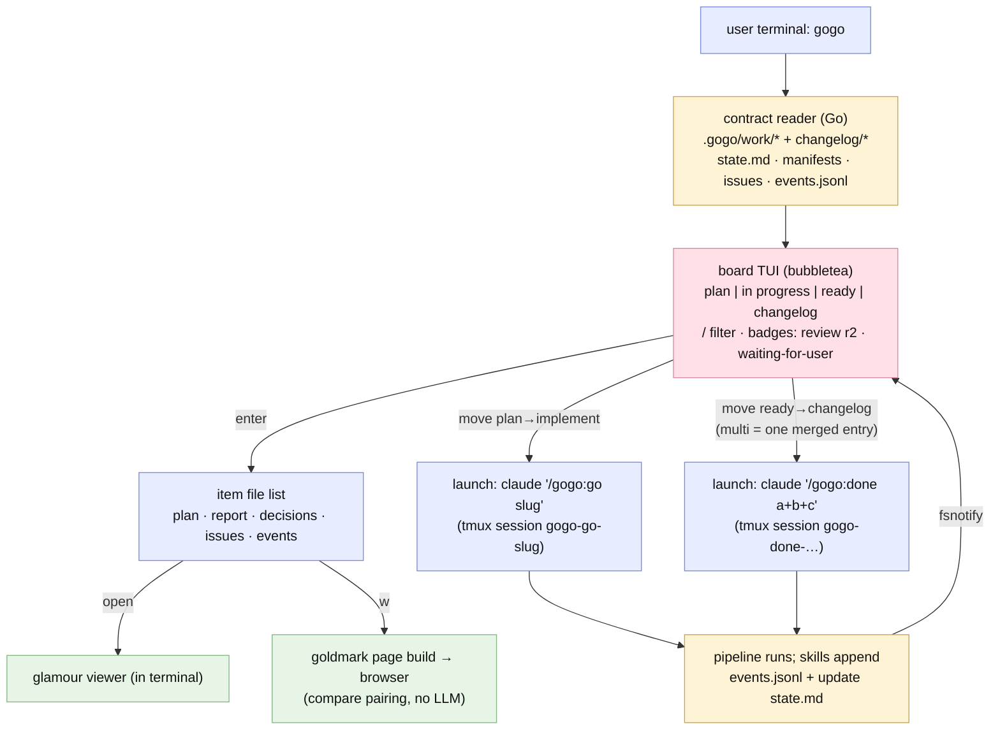
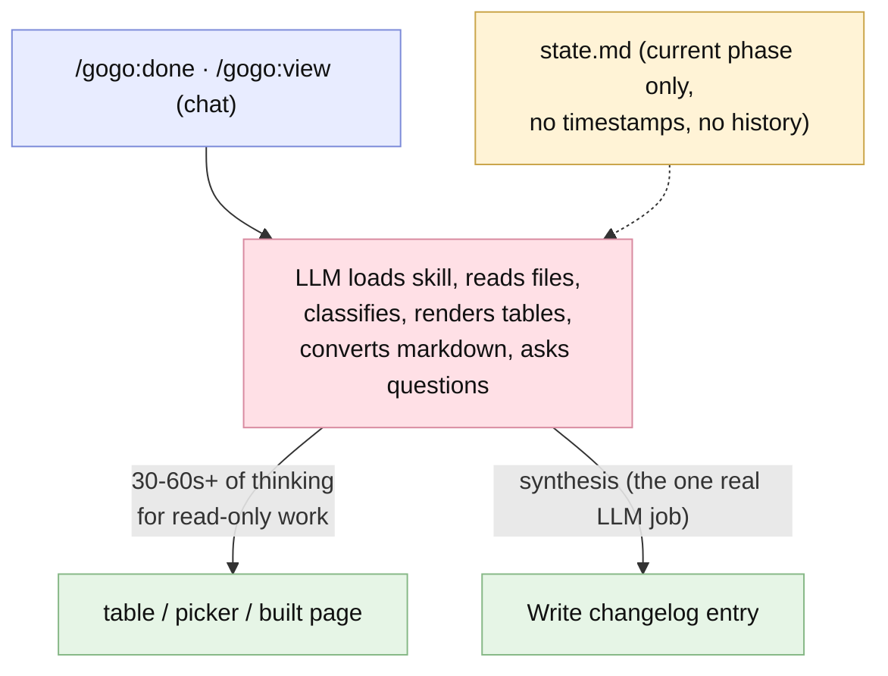

# Report — feature `cli-cockpit-and-events`

- **feature:** the `gogo` CLI cockpit (Go/Bubble Tea board + terminal viewers + Claude-launching moves) + the `events.jsonl` pipeline-telemetry contract — **v0.10.0**
- **status:** done
- **completed:** 2026-07-03
- **branch / commits:** main (uncommitted working tree at report time)

## Run status / gaps

**All phases completed; no open issues.** Two stages (A = the events contract, B = the Go CLI) ran through **6 implement, 2 review, and 2 test rounds** (the second test round was the user's own live acceptance drive). **26 findings total — 25 verified fixed, 1 accepted-wontfix (REV-012), zero open.** All fix rounds closed with live proofs (tmux capture; a headless-Chrome DOM smoke for the web modal).

## Summary

**Managing gogo work is now instant.** A native Go binary — the **`gogo` CLI** in `cli/` — opens the kanban board in milliseconds by **deterministically parsing the contract files the plugin already writes**: no LLM anywhere in the read path. Board items are the feature folders; drilling into a card renders its plan, report, issues, events, and even its mermaid diagrams **in the terminal**; moving a card between columns **launches Claude** for the real pipeline work (`/gogo:go`, `/gogo:done`) in attachable tmux sessions. The division of labour is the feature's thesis: **the CLI owns everything mechanical, Claude keeps the thinking** (pipeline execution and changelog synthesis).

The plugin side gained the one missing piece: an **`events.jsonl` telemetry contract** — one schema'd JSON line appended per phase transition, beside every `state.md` write — so the pipeline is **observable from outside the chat** for the first time. This very feature dogfooded it: its own [`events.jsonl`](../events.jsonl) is the first real producer, and the board's live badges read it.

## Planned vs shipped

**The accepted plan held** — same architecture (deterministic reader, Claude executor), same stack, same staged build. Three deltas, all improvements found en route:

1. **mermaid-ascii dropped as a dependency.** Its renderer is reachable only through a cobra/gin `cmd` package — real dependency drag (gin + bytedance/sonic assembly) for a ms-startup binary. Replaced with a **minimal internal flowchart→ASCII renderer** (`cli/internal/diagram`) plus the plan's already-accepted source-display fallback for sequence/class/state kinds.
2. **Single-owner event emitters** (REV-001 refined FR1): the plan let both the orchestrator and the phase skills emit lifecycle events, which double-counted history. As shipped, **each phase skill owns ALL lifecycle events for its phase; the orchestrator emits only the two gate events** — every transition emitted exactly once, frozen in `docs/cli-contract.md` §5.
3. **The huh-form routing fix** (TEST-001): as planned the forms existed, but live they could never be submitted — the fix (route every message to the form + heap-stable field bindings) is an as-built hardening the plan couldn't foresee; the confirm now **defaults to Launch** (Enter submits; Esc/Ctrl+C abort and clear the selection).

## Implementation

**Stage A — the events contract (plugin).** `templates/contracts/events.schema.json` pins the line shape (**RFC3339** `ts`, event/phase enums, lenient-consumer forward-compat note); all **7 skills** carry emission instructions under the **single-owner model** (phase skills own lifecycle events, the orchestrator owns `gate-opened`/`gate-resolved`, state.md's `knowledge` maps to events' `report`); **`docs/cli-contract.md`** freezes the full deterministic-consumer spec — state.md line grammar, classifier rules, schemas, changelog shape, reader rules — and both schema catalogs were synced to include it.

**Stage B — the `gogo` CLI** (`cli/`, Go 1.25, module `github.com/ZawadzkiB/gogo/cli`, ~50+ tests, all `-race` green):

- **`internal/contract`** — the deterministic reader: state.md grammar, the shipped→ready→in-progress→unfinished classifier faithful to the frozen rules (members[] + folder-slug fallback), issues/manifests/changelog, events.jsonl parsed leniently (bad lines skipped). Hostile-input safe — garbage files degrade, never crash.
- **`internal/tui`** — the bubbletea board: 4 columns with live badges, `/` filter, **fsnotify live refresh** with a re-armed watch set and clean shutdown, drill-in file list, glamour/issues-table/events-timeline/ASCII-diagram viewers, **huh forms with heap-stable bindings**, an **injectable launcher seam**, tmux session list + attach.
- **`internal/launch`** — injection-safe spawning: `claude "/gogo:go <slug>"` / `"/gogo:done a+b"` as a **single argv element, no shell**, in tmux sessions `gogo-<action>-<slug>` (background `claude -p` + log as the no-tmux fallback).
- **`internal/pages`** — the native `w` page builder: goldmark HTML + embedded viewer assets + before/after compare pairing (the gogo-view step-3 rules ported); works offline in any project via `go:embed`.
- **`internal/diagram`** — the minimal flowchart→ASCII renderer + source fallback.
- Subcommands **`status` / `view` / `events`**, `--version` = 0.10.0.

Plugin sweep: `plugin.json` → **0.10.0**, README CLI section, architecture `cli/` subtree, `.gitignore` for the binary — and the command set held at **12 slash commands** (the CLI is a binary, deliberately not a 13th).

### Changes (as-built)

| File | Change | Note |
|---|---|---|
| `templates/contracts/events.schema.json` | added | the telemetry line contract — RFC3339 ts, enums, producer-vs-consumer compat note |
| `docs/cli-contract.md` | added | the frozen deterministic-consumer spec (layout, grammar, classifier, emitter table, reader rules) |
| `skills/*/SKILL.md` (all 7) | modified | event-emission instructions, single-owner per transition |
| `docs/contracts.md` · `templates/contracts/README.md` · `docs/architecture.md` | modified | schema catalogs + work-folder tree synced (events.jsonl, `cli/` subtree) |
| `cli/` (module: main, status, view, events, Makefile, testdata) | added | the `gogo` binary — Go 1.25, Charm stack, ~50+ tests |
| `cli/internal/{contract,tui,launch,pages,diagram,textfmt}` | added | reader/classifier · board+viewers+forms · tmux spawning · page builder · ASCII renderer · shared formatting |
| `.claude-plugin/plugin.json` · `README.md` · `docs/index.md` · `.gitignore` | modified | 0.10.0 · CLI install/use section · docs pointer · binary ignored |

## Decisions & rationale

Full trail in [decisions.md](../decisions.md) — one line each:

| Decision | Choice | Reason |
|---|---|---|
| **D1 — live-progress contract** | **A: `events.jsonl`** per feature | state.md has no timestamps/history; append-only telemetry gives the timeline the user asked for, state.md stays the human resume file |
| **D2 — how moves run Claude** | **A: interactive `claude` in tmux** (`-p` fallback) | sessions are saveable/attachable and decision gates stay answerable — print mode can never answer a gate |
| Emitter ownership (REV-001) | phase skills own lifecycle; orchestrator owns gates only | every transition emitted exactly once — an accurate timeline is the feature's core value |
| REV-012 — embedded mermaid copy | **accepted** (wontfix) | `go:embed` needs the file in-module; a build-time sync would break `go build ./cli` and `go install` out-of-the-box |
| Confirm default = Launch | affirmative default; Enter submits | full summary shown, three abort paths, launched action is non-destructive and itself gated |
| Non-forks (user-stated) | monorepo `cli/` · actions are always Claude · CLI is a deterministic parser | contracts beside their spec; one writer, no divergence; no LLM in the read path |

## Review outcome

**Two rounds, both ending in approval; 12 findings (REV-001..012), 11 verified + 1 accepted.** The Stage A round found **2 majors**: double-emitted lifecycle events (REV-001 — fixed with the single-owner rule) and the recurring enumeration-sync miss (REV-002 — `events.jsonl` absent from the architecture tree), plus schema-precision minors (RFC3339 pinning, the knowledge→report gate mapping, catalog parity, forward-compat wording, the members[] caveat). The Stage B round was an **APPROVE with 5 minors/nits**, all verified fixed: badge reconciled to state.md as phase truth, README install corrections, fsnotify watch re-arm for mid-session features, clean watcher lifecycle — and REV-012 consciously accepted. **The security cruxes got empirical verdicts:** the tmux launch line **execs directly with no shell interpretation** (hostile-slug argv probe — no injection), and a garbage/hostile fixture repo **never crashed the CLI**. Snapshots: [review-01.md](../review-01.md) · [review-02.md](../review-02.md) · [review/issues.json](../review/issues.json).

## Test outcome

**One combined round; everything green on first pass except the one thing unit tests could not see.** Go gates (gofmt/vet/`-race`, 52 tests at the time — 64 after round 6), events-schema conformance on the real dogfooded file (4/4 lines), classifier truth verified by hand across **all 9 real features**, hostile fixtures (malformed state.md, garbage events, `$(...)`-named features), fsnotify live refresh, and the doc/asset sweep — all PASS.

Then the **live tmux TUI pass** (send-keys/capture-pane, PATH-stubbed `claude`) found what no unit test had: **TEST-001 (blocker)** — every launch form was unsubmittable because the top-level `Update()` dropped huh's async messages, compounded by field bindings into the value-copied Model; and **TEST-002 (major)** — a cancelled form left the stale selection armed for a silent re-ship. Both were **fixed in implement round 5 and verified with a live proof**: Enter-submit launched the stubbed claude with a **single argv** `/gogo:done a+b` in a `gogo-done-*` session; Esc-cancel cleared the selection with no launch.

**Round 2 — the user drove the board (UAT) and filed five findings (TEST-003..007), all fixed in implement round 6.** The headline: **`v` froze the whole UI for minutes** — root-caused to glamour's `WithAutoStyle()` firing a termenv OSC terminal query that Bubble Tea's stdin reader swallowed, so every render blocked on a 5-second timeout; **invisible in CI because `go test` has no TTY**. Fixed with one-time background detection + fully **async, cached rendering** (measured live: 15 ms to the loading state, 43-85 ms to content). The rest of the round: **`v` now opens the column's default file** (ready→report, plan→plan, changelog→entry report, in-progress→file list), **mermaid fences render as ASCII diagrams** inside the terminal markdown view (labeled source + "press `w`" for non-flowchart kinds), a **green ● session dot** marks cards with a live attachable tmux session (5s ticker), and the board got its **card look** — bordered lipgloss cards, full-card focus highlight, ship-selection checkmarks, per-column TONE accents. 64 Go tests green under `-race`.

A third UAT finding (TEST-008) replaced the internal ASCII renderer with **mermaid-ascii v1.3.0** (MIT; the HN-featured renderer): **Unicode box-drawing diagrams for flowcharts AND sequence diagrams** in every markdown surface (drill-in, glamour view, and `gogo view` stdout), with an empirically proven clean dependency graph (sequence imported from `pkg/`; the graph path vendored with attribution because upstream keeps it beside the gin web surface; `go version -m` shows no gin/sonic/cobra; +270 KB, startup unaffected).

A third UAT round (TEST-009..012, fix round 8) polished the reading experience end-to-end: a **custom glamour style** (article spacing, TONE heading hierarchy) shared by the TUI and `gogo view` stdout; **page-by-page scrolling** over the cached render (space/b, d/u, g/G — context-aware so board keys stay intact); plans/reports now **end with `## Summary (TL;DR)`** (authoring guidance + template); and the web viewer gained **expand-to-modal** on every diagram (state-preserving node move + refit, Esc/scrim/✕ close), synced into the CLI's embedded assets.

Two lessons are recorded in the test strategy: **model unit tests catch logic; only driving the live TUI catches integration** (message routing, TEST-001) — and **TTY-dependent behaviour is invisible to `go test` entirely** (the `WithAutoStyle` freeze, TEST-003). Snapshot: [test-01.md](../test-01.md) · [test/issues.json](../test/issues.json).

## Diagrams

Two as-built diagrams (`.mmd` beside this report; no `diagrams.html` — the 0.8.0 slim rule, `/gogo:view` builds the interactive page from source):

- **flow** (`flow.mmd`) — the cockpit's control/data flow; the intended-design chart, confirmed as-built with no drift.
- **sequence** (`sequence.mmd`) — the move-launches-Claude runtime loop, the interaction the test round hardened.



```mermaid
sequenceDiagram
  actor U as user
  participant B as board (tui.Model)
  participant H as huh form (confirm · release name)
  participant L as internal/launch
  participant T as tmux session gogo-done-a+b
  participant C as claude /gogo:done a+b
  participant G as .gogo/work/feature-* (state.md · events.jsonl)
  participant W as fsnotify watchSet

  U->>B: space-select ready cards · press d (ship) / m (move)
  B->>B: attemptAction — classifier guards (legal moves only)
  B->>H: open form — confirm summary + suggested release name
  U->>H: Enter/Tab submits (Esc / Ctrl+C aborts + clears selection)
  H-->>B: huh.StateCompleted (confirm=true via heap-stable *formBinding)
  B->>L: launcher(intent) — injectable seam, defaults to launch.Launch
  L->>T: tmux new-session -d -s gogo-done-… (single argv, no shell)
  T->>C: claude "/gogo:done a+b" — interactive, gates answerable (a attaches)
  C->>G: phase skills append events.jsonl + update state.md
  G-->>W: fs change (debounced; watch set re-armed on reload)
  W-->>B: reloadMsg → LoadRepo → columns + badges refresh
  Note over B,G: a card moves columns only when the contract files change — never optimistically
```

## Before / after comparison

The plan-time as-is baseline is copied into this bundle at `before/flow.mmd`. **Before,** every read-only operation — classifying work, rendering the table, building a view page — ran through the LLM in chat (30–60s+ of thinking), and state.md held only the current phase with no history. **After,** a deterministic Go binary does all of that in milliseconds, the LLM appears only where it adds value (pipeline execution, changelog synthesis — launched by the board, in tmux), and the appended events.jsonl gives every feature a timestamped timeline. The **sequence** diagram is **added** (after only) — the launch loop simply did not exist before.

**Before (flow):**



**After (flow):** see the as-built flow diagram above — the LLM is out of the read path entirely; it is *launched*, on demand, for the two jobs only it can do.

## Knowledge updates

Six `.gogo/knowledge/*` files reconciled to the 0.10.0 reality (all gogo-owned edits):

- **tech-stack.md** — Go 1.25 + the `cli/` module and Charm dependency set as first-class repo tech; the build/test commands (`go build -o gogo .`, `go test -race`).
- **coding-rules.md** — Go conventions now in force: gofmt/vet/`-race` gates, injectable seams for launch-class side effects, and the **value-type bubbletea Model binding gotcha** recorded.
- **testing-tools.md** — `go test -race ./...`; the tmux send-keys/capture-pane method extended to the Go TUI; the stubbed-`claude`-on-PATH technique.
- **test-strategy.md** — the TUI lesson: model unit tests catch logic, **only live tmux driving catches integration** (TEST-001 cited).
- **non-functional-requirements.md** — the CLI performance bar (ms startup, no LLM in the read path); the REV-012 embedded-mermaid footprint note.
- **project-knowledge.md** (proxy — overrides only) — the "since 0.10.0" summary: CLI + events contract + `cli-contract.md`; version currency.

No upstream-file suggestions — the README/docs changes shipped with the feature itself.

## Follow-ups & known limitations

- **Distribution polish** — goreleaser + brew tap (today: build from source; `go install` names the binary `cli`, documented).
- **`gogo web`** — embed the parked React board dist from `feature/xplan-board-and-simple-done`; the branch keeps it warm.
- **Plugin fast-paths** — `/gogo:view` / `/gogo:status` shelling out to the binary when installed, now that the CLI is proven.
- **Roadmap #7 (plan/decision line-commenting)** — the drill-in viewer is its foundation.
- Known limits: the ASCII renderer draws the flowchart family only (other kinds show source + a `w` hint, by design); older features have no events.jsonl (a missing file is never an error); the embedded mermaid copy duplicates ~3.3 MB (REV-012, accepted, synced via `make sync-assets`).
