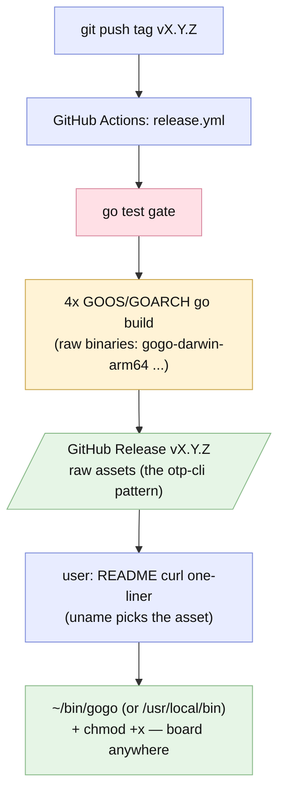

# Plan — feature `cli-distribution`

Status: **accepted** (user, 2026-07-03, plan round 2 — D1=custom otp-cli pattern · D2=A v0.10.0 train)

## Goal

Make the `gogo` CLI **installable in one command from anywhere**: every version tag pushes **raw prebuilt binaries to GitHub Releases**, and the README carries **otp-cli-style curl one-liners** that drop `gogo` straight into `~/bin` (or `/usr/local/bin`) — no installer script, no checksums, no ceremony. Today the only path is `cd cli && go build` — a Go-toolchain tax no plugin user should pay.

## Context — what exists

- `cli/` Go module (`github.com/ZawadzkiB/gogo/cli`), `const Version = "0.10.0"` hardcoded in `main.go`; binary builds clean with `go build`. **No `.github/workflows/` exist yet** — the repo has zero CI.
- Release convention: annotated repo tags `vX.Y.Z` per plugin version (v0.9.0 latest pushed); the CLI mirrors the plugin version. The v0.10.0 train is staged but not yet committed — this feature rides it, so **the first tag push mints the first curl-able release**.
- `go install github.com/ZawadzkiB/gogo/cli@latest` works today but names the binary `cli` (module-tail naming) — documented caveat.

## Functional requirements

- **FR1 — minimal release workflow (the otp-cli pattern, automated).** `.github/workflows/release.yml`: on push of a `v*` tag — `go test ./...` in `cli/` (the one gate), then four plain cross-compiles on one ubuntu runner (`GOOS/GOARCH` = darwin/arm64 · darwin/amd64 · linux/amd64 · linux/arm64, CGO off) producing RAW binaries named `gogo-darwin-arm64` etc., attached directly to the GitHub Release for the tag (`gh release upload` / softprops action). **No goreleaser, no archives, no checksums, no stamping** — the committed `const Version` is the version (bumped with each release like plugin.json).
- **FR2 — curl install in the README (otp-cli style).** Two copy-paste variants: sudo → `/usr/local/bin`, no-sudo → `~/bin` — each a single line that picks the right asset via `uname`: `curl -fsSL https://github.com/ZawadzkiB/gogo/releases/latest/download/gogo-$(uname -s | tr 'A-Z' 'a-z')-$(uname -m | sed 's/x86_64/amd64/;s/aarch64/arm64/') -o ~/bin/gogo && chmod +x ~/bin/gogo` (plus a small per-platform asset table and a pinned-version note). Build-from-source and the `go install` naming caveat stay as alternatives.

## Approach (recommended)

**The otp-cli pattern, with the one Go twist.** Raw binaries as release assets + curl one-liners in the README — the exact house style ([otp-cli](https://github.com/ZawadzkiB/otp-cli)) — automated only where Go forces it: binaries are per-OS/arch, so a minimal tag-push workflow does the four `go build`s and uploads (nobody cross-compiles by hand), and the README one-liner selects the asset via `uname`. This ships **in the pending v0.10.0 train** so the tag we're about to push publishes the first binaries.

*Alternatives considered:* goreleaser + checksums + install.sh (REJECTED by the user at the gate — ceremony the house pattern doesn't want); fully manual releases (build 4 binaries by hand each tag — error-prone for zero gain); committed binaries in-repo (bloats git).

## Changes checklist (build order)

1. `.github/workflows/release.yml` — tag-triggered: `go test` gate → 4× `GOOS/GOARCH go build` → upload raw assets (`contents: write`).
2. README "The gogo CLI" install section — the two curl one-liners (+ asset table, pinned-version note); docs touch-ups where install is mentioned.

## Tests

- Local: run the workflow's exact build loop by hand — 4 `GOOS/GOARCH go build`s succeed, binaries run (`--version` on the host one; `file`-check the others); the README `uname` one-liner's asset-name derivation verified on darwin-arm64 (and by substitution for the other three); workflow YAML sanity-read (first real run = the v0.10.0 tag push — flagged).
- The suite gate stays green (`go test -race`).

## Out of scope

- goreleaser / checksums / archives / install.sh / version stamping (rejected at the gate — the otp-cli raw-asset pattern instead), Homebrew tap, Windows builds, package managers, auto-update, separate ci.yml (the release workflow carries the one test gate; standalone CI can come later).

## Intended design

## Summary (TL;DR)

- **What:** raw `gogo` binaries as GitHub Release assets on every version tag + otp-cli-style curl one-liners in the README.
- **Why:** users curl it into bin and run it anywhere — no Go toolchain, no ceremony (no checksums/stamping/installer, per the house pattern).
- **How:** one minimal tag-push workflow (`go test` gate → 4 cross-compiles → asset upload); the README one-liner picks the platform via `uname`.
- **Next:** rides the pending v0.10.0 train — pushing the tag publishes the first installable release.
