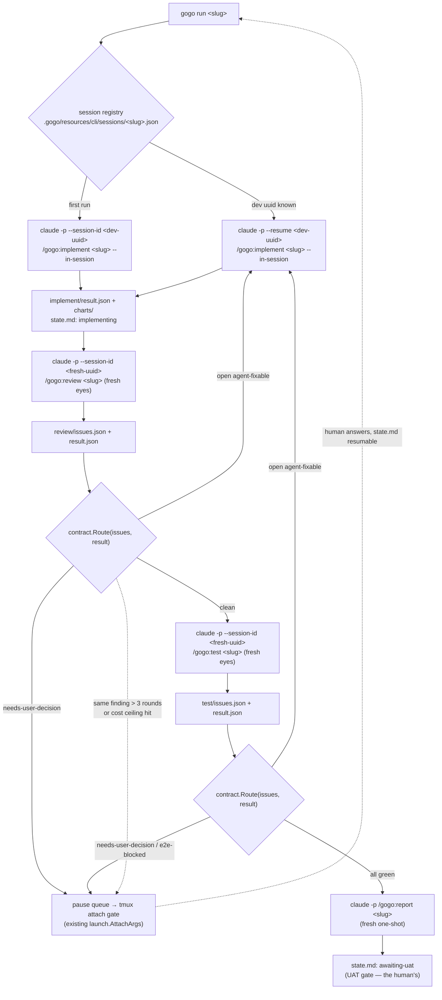

# Plan — CLI process-orchestrator (warm/resumable phase sessions)

Status: awaiting acceptance

**Build a Go-CLI orchestrator that drives the ②→③→④(→⑤) loop by spawning each phase
as a `claude -p` session — keeping the developer session WARM across fix rounds via
`--resume` (never re-reads the codebase) while review and test spawn FRESH (fresh
eyes).** It is a **second orchestrator that coexists with the in-chat `/gogo:go`**,
both driving the *same* phase skills and typed contracts. This plan phases the build
so a thin, claude-only **walking skeleton** ships first, before the agent-type
abstraction, cost surfacing, and board integration.

This is roadmap **#11**. The core risk (warm continuity across separate `claude -p`
processes) was **retired by a spike this session** (claude 2.1.206): `--session-id`
then `--resume` recalled planted context; a no-`--resume` session had zero context.

---

## Context — what exists today

The **in-chat orchestrator** (`skills/gogo/SKILL.md`) runs ②→③→④→⑤ in one Claude
conversation. v0.12.0 shipped a stopgap ("Option 3", commit `8d87828`): the in-chat
orchestrator runs ② implement **in-context** to stay warm, and delegates ③④ to fresh
`Task` subagents. Two limits remain: **the orchestrator freezes while a `Task`
subagent runs**, and a re-spawned orchestrator re-reads the tree. This feature moves
the loop into a **Go process that never freezes** and resumes a **genuinely warm**
developer session.

The pieces the change builds on (all verified against the tree):

- **`cli/internal/launch/launch.go`** — the session launcher. `BuildIntent` today
  builds **whole-pipeline** commands only (`ActionGo → /gogo:go <slug>`,
  `ActionDone → /gogo:done`). It spawns an **attachable tmux** session (preferred) or
  a **backgrounded `claude -p` + log** (fallback); it already has permission-mode
  auto (`PermissionArgs`), **injection-safe argv** (flag + value as separate
  elements), **root-anchoring** (TEST-013), `remain-on-exit`, and exact session↔slug
  attribution (`SessionMatchesSlug`, TEST-005). **There is no `--session-id` and no
  `--resume` here today.** The background path *already* runs `claude -p "/gogo:go
  <slug>"`, so `claude -p "/gogo:<command>"` is a proven pattern in this repo.
- **`cli/main.go`** — dispatch: `status` · `view` · `events` · `trash` · board. A new
  subcommand is the natural entry.
- **`cli/internal/contract/`** — the **deterministic reader** (no LLM): `state.go`
  parses the bolded `state.md` grammar; `contract.go` classifies features and reads
  `events.jsonl`. **It does NOT read `*/result.json` or `*/issues.json` today** —
  routing needs a new reader.
- **The phase skills/commands** — `/gogo:implement <slug> [--issues <path>]`,
  `/gogo:review`, `/gogo:test`, `/gogo:report`. Review/test emit the living
  `*/issues.json` + a per-run `*/result.json`, and their **"④ Route"** step is the
  authoritative routing rule: decide **purely on the open/new issue count**, plus a
  `needs-user-decision` escalation. `phase-result.schema.json` `status ∈ {ok, blocked,
  waiting-for-user}`.
- **The frozen consumer contract** `docs/cli-contract.md` — the CLI honors it; the
  registry this feature adds is **CLI-owned bookkeeping**, not a pipeline artifact.

**The in-session tension (constraint 4, verified).** `commands/implement.md:37-38`
says the command "invokes the orchestrator, which delegates the phase to its
specialist (`gogo-developer`)". The CLI dev session must instead run the
`gogo-implement` skill **directly, in-session** — because we `--resume` the *session*;
if it delegated to an inner `Task` subagent, `--resume` would re-load the outer
conversation while the actual code-writer was gone, and a `--issues` re-entry would
re-spawn a **cold** worker. So the implement command needs an **in-session** path
(the skill front-matter already says it runs "for the orchestrator when it implements
in-context" — the CLI needs a way to trigger that path over `-p`).

**Claude CLI flags (verified via `claude --help`, 2.1.206):** `--session-id <uuid>`,
`-r/--resume [value]`, `--output-format` (json → `session_id`, `total_cost_usd`,
`num_turns`, `duration_ms`), `-p/--print`, `-n/--name` (display label only),
`--fork-session`, `--permission-mode`.

---

## Functional requirements

The FRs are grouped: **FR1-FR9 = the walking skeleton (Slice 1, independently
shippable)**; **FR10-FR13 = later slices.** Every FR is testable in the Go suite or
by a scripted dry-run (injected launcher, no real spawns).

### Slice 1 — the walking skeleton (claude-only, one feature)

- **FR1 — `gogo run <slug>` entry point.** A new subcommand in `cli/main.go` starts
  the orchestrator loop for one feature. Refuses (clear message, exit ≠ 0) when
  `.gogo/` is absent, claude is not on PATH, or the feature is not in a runnable state
  (`state.md` status must be `plan-accepted` or a resumable mid-loop state — the same
  acceptance gate `/gogo:go` enforces; **never runs an unaccepted plan**).

- **FR2 — Session-aware launch primitives.** Extend `launch.go` with argv builders
  that add `--session-id <uuid>` (first run) and `--resume <uuid>` (subsequent runs)
  and `--output-format json` to a `claude -p "<command>"` invocation — flag+value
  always **separate argv elements** (injection-safe, matching the existing
  `PermissionArgs` discipline). Pure, unit-tested builders; no behavioural change to
  the existing `BuildIntent`/`Launch`.

- **FR3 — Warm developer session.** The loop assigns the dev a **stable UUID once**
  and runs `/gogo:implement <slug> --in-session` via `--session-id` on the first
  build, then **`--resume <dev-uuid>`** for every `--issues` fix round — so the
  developer **never re-reads the codebase** across the fix loop.

- **FR4 — Fresh review/test sessions.** Each ③ review and ④ test round spawns a
  **brand-new** `claude -p --session-id <fresh-uuid> "/gogo:review <slug>"` (or
  `test`) — **no `--resume`** (a new uuid per round = unbiased fresh eyes). Their
  internal `Task` delegation is irrelevant because these sessions are never resumed.

- **FR5 — Phase-completion detection (deterministic).** The loop runs each phase as a
  `claude -p` **batch** invocation and **waits for the process to exit**, then reads
  the phase's typed outputs (`*/result.json` + `*/issues.json` + `state.md`) to decide
  what happens next. No polling, no LLM in the routing path.

- **FR6 — The ONE routing rule, encoded once, PER TRACK.** A single Go function
  `contract.Route(track, result, issues) → {ReImplement | Gate | Advance}` implements
  **exactly** the review/test skills' "④ Route" — which **differ by track** (verified
  against the skills, the authority): **review** routes only on open/new
  **blockers/majors** (minors are batched → advance, per `gogo-review` §④); **test**
  routes on **any** open/new (`gogo-test` §④). Plus: **any `needs-user-decision` (scanned
  across title/description/proposed_solution) or a `waiting-for-user`/`blocked` result →
  gate**; **otherwise clean → advance**. The Go function **cites the skills as the
  authority** (a doc-comment pointer) so the two orchestrators can't drift. *(Corrected at
  ② per review REV-001: the original FR6 text said "count > 0" for BOTH tracks, which
  contradicted this plan's own constraint 3 — the skills are canonical, and `gogo-review`
  batches minors. Aligned to the skills.)*

- **FR7 — Bounded loop + cost ceiling.** The implement↔review/test fix bound is **~3
  rounds** (`GOGO_RUN_MAX_ROUNDS`, default 3); exceeding it **gates** (never a silent
  abort). *(As-built per review REV-005: this is a **total fix-round budget per feature**,
  not a strict per-finding count — it errs safe, gating earlier than a per-id bound would;
  the in-chat bound is per-finding. Documented as such.)* A **per-feature cost ceiling**
  (summing `total_cost_usd` from each phase's `--output-format json`; `GOGO_RUN_COST_CEILING`,
  default $10, 0 disables) also gates; it is **pre-flighted** on a re-run so an
  already-over-budget feature never spends a session just to re-gate (REV-003). A phase
  that reports `is_error` or writes no `result.json`/`issues.json` **halts/gates** rather
  than advancing as a false green (REV-002). The ~$0.13 per-session baseline the spike
  found means the loop must not spawn a session per trivial step.

- **FR8 — Decision gate via the existing attachable path.** When a phase writes
  `state.md: waiting-for-user` (a real fork, a `needs-user-decision` finding, or an
  e2e-blocked check), the loop **pauses the queue**, surfaces the gate, and lets the
  **human answer via the existing tmux attach path** (`launch.AttachArgs`) /
  `/gogo:resume`. The loop resumes only when `state.md` returns to a runnable status.
  The Go orchestrator **never invents the answer** — the judgment stays with
  claude+human (constraint 2).

- **FR9 — Phase-session registry (CLI-owned).** Persist per feature at
  **`.gogo/resources/cli/sessions/<slug>.json`**: the dev UUID (so a re-launched `gogo
  run` resumes the SAME warm session), the current phase/round, each round's session
  uuid, and per-session cost/turns/duration telemetry. It lives under
  `.gogo/resources/` (the CLI's sanctioned write root) — **never** in the feature
  folder (the CLI must not mutate pipeline state). A missing/garbled registry
  degrades to "first run", never a crash.

### Later slices (not in the first ship)

- **FR10 — Agent-type abstraction (Slice 2, shares roadmap #8).** An `AgentType`
  interface behind which `--session-id`/`--resume`/`--output-format`/`-p` live, with a
  **claude** implementation now. gemini/codex/opencode are **later** and **out of
  scope here** (not all CLIs have `--resume`) — the interface is the seam, not new
  agents.

- **FR11 — In-session implement path (small skill/command change).** The `--in-session`
  path FR3 depends on — a documented flag on `/gogo:implement` (and a one-line note in
  `gogo-implement`/`commands/implement.md`) that runs the skill in-context without
  spawning a `gogo-developer` `Task`. *Small, but it touches the markdown plugin, so
  it is called out separately (see decision D4).* **Required by Slice 1** — sequence it
  first in the checklist even though it is a plugin-side change.

- **FR12 — Cost/telemetry surfacing (Slice 3).** Surface the registry's per-phase
  cost/turns/duration on the `gogo` board / `gogo status` (a running-cost badge, a
  "running" indicator), reading the same registry.

- **FR13 — Board integration (Slice 3).** Wire `gogo run` into the board (e.g. the `g`
  action launches the Go loop instead of a one-shot `/gogo:go` tmux session, or a new
  key), keeping the board deterministic.

---

## Approach

**Add a new `cli/internal/orchestrator` package that sequences existing phase
commands over `claude -p`, reusing (not replacing) `launch.go`, and reading the
existing typed contracts to route.** The Go code is a **dumb deterministic
sequencer**; all judgment stays in the claude phase-sessions (constraint 2). No phase
logic is re-implemented — the loop only *calls* `/gogo:implement|review|test|report`
and *reads* their `result.json`/`issues.json` (constraint 1). The routing rule is
encoded **once** in `contract.Route`, citing the skills' "④ Route" as the authority
(constraint 3).

**The loop (Slice 1):**
1. `gogo run <slug>` → load/create the registry; verify the acceptance gate.
2. Dev build: `claude -p --session-id <dev> "/gogo:implement <slug> --in-session"` →
   wait exit → read `implement/result.json`.
3. Fresh review: `claude -p --session-id <rev-N> "/gogo:review <slug>"` → wait exit →
   `contract.Route(review/issues.json, result)`.
4. Route: **open/fixable** → `claude -p --resume <dev> "/gogo:implement <slug> --issues
   review/issues.json --in-session"` → back to 3 (fresh review, round+1, ≤3);
   **decision** → gate (FR8); **clean** → 5.
5. Fresh test: `claude -p --session-id <test-N> "/gogo:test <slug>"` → route the same
   way (fixable → warm dev resume → re-review → re-test; decision/e2e-blocked → gate).
6. Green → `claude -p "/gogo:report <slug>"` (fresh one-shot) → **stop at
   `awaiting-uat`** (the UAT gate is the human's — matches `/gogo:go`'s scope).

**Why `-p` batch + wait-for-exit (D2).** `claude -p` is the print/batch mode: it runs
headless (permission auto) and exits. Exit is the cleanest phase-done signal — no
polling — and warm continuity survives process exit because claude persists the
session by uuid (spike-proven). Gates are the one interactive moment, and they reuse
the *existing* attachable-tmux path rather than inventing a new one.

### Alternatives considered

- **Extend the board's `g` launch to decompose phases (no new subcommand).** Rejected
  for Slice 1: the loop is a long-running foreground process; folding it into the TUI
  couples the deterministic board to a spawn/wait loop. A dedicated `gogo run` keeps
  the board fast and the loop testable; board integration is Slice 3 (D1).
- **Poll `state.md`/`result.json` on a timer instead of waiting on exit.** Rejected:
  `-p` exit is a precise, race-free completion signal; polling adds latency and a
  liveness question for no gain (D2).
- **Interactive tmux sessions for every phase (not `-p`).** Rejected: interactive
  sessions don't give a clean machine-readable completion signal and can't be resumed
  headlessly per round; `-p` + `--resume` is what the spike validated. Interactive is
  reserved for the *gate* only.
- **A prompt-suffix instruction ("run in-context, don't spawn a Task") instead of an
  `--in-session` flag.** Rejected as fragile — an explicit, testable flag on the
  command is the smaller long-term surface (D4).
- **Store the registry in the feature folder.** Rejected — that folder is pipeline
  state the CLI must not mutate; bookkeeping goes under `.gogo/resources/` (D5).
- **Build the agent-type abstraction first.** Rejected — abstraction before one
  working concrete path is speculative; claude-only skeleton first, seam second (D-scope).

---

## Intended design (diagrams)

The **Go orchestrator loop** — the deterministic sequencer spawning/resuming phase
sessions and routing on `issues.json`. Full set (this flow + the *two-orchestrators-
over-one-core* view + the *warm-resume* sequence) in `charts/diagrams.html`; the as-is
launcher baseline is in `charts/before/`.

---

## Changes checklist (build order — Slice 1 is independently shippable)

**Slice 1 — walking skeleton**

1. **FR11 first (plugin side, unblocks FR3):** add the **`--in-session`** path to
   `commands/implement.md` + a one-line note in `skills/gogo-implement/SKILL.md` so
   `/gogo:implement <slug> --in-session` runs the skill in-context (no `gogo-developer`
   `Task`). Keep enumerations in sync (`argument-hint`). *(Decision D4.)*
2. `cli/internal/launch/launch.go` — **new session-aware argv builders** (`--session-id`,
   `--resume`, `--output-format json`) + a `RunPhase` primitive that spawns `claude -p`
   and returns the parsed json result (session_id/cost/turns/duration). No change to
   existing `BuildIntent`/`Launch`. (FR2)
3. `cli/internal/contract/` — **result/issues readers** (`result.go`, `issues.go`
   parsing `phase-result.schema.json` / `issues-list.schema.json`) + **`Route`** (FR6),
   with the authority doc-comment.
4. `cli/internal/orchestrator/` — **new package**: the loop (FR3-FR5, FR7), the gate
   handler (FR8), and the **registry** read/write under `.gogo/resources/cli/sessions/`
   (FR9). Injectable launcher seam (like `Model.launcher`) so tests assert
   spawn-exactly-once without spawning.
5. `cli/main.go` — **`gogo run <slug>`** dispatch + acceptance-gate guard + help text
   (FR1). Keep the help/board-keys enumeration in sync.
6. `cli/` tests — `orchestrator` loop tests (fake launcher: warm-resume on fix rounds,
   fresh uuid per review/test round, route table, 3-round bound, cost ceiling, gate
   pause), `launch` argv tests, `contract.Route` table, registry round-trip. `gofmt`,
   `go vet`, `go test -race` green (the `cli/` gate).
7. **Docs + version:** note the new subcommand + registry in `README.md` and (as
   CLI-owned, not a pipeline contract) a short section in `docs/cli-contract.md` /
   `tech-stack.md`; **bump `.claude-plugin/plugin.json` version** + `cli` `Version`
   (they mirror). Record the coexistence + division-of-intelligence in
   `project-knowledge.md` gogo-overrides at report ⑤.

**Slice 2 — agent-type abstraction (FR10):** extract an `AgentType` interface over the
spawn/resume/output-format primitives with a claude impl; no new agents.

**Slice 3 — surfacing + board (FR12, FR13):** cost/telemetry on board+status; wire
`gogo run` into the board action.

---

## Tests

Slice 1 is verified almost entirely in the **Go unit/golden suite** (the markdown
side has no unit suite; the loop is deterministic Go). Per `test-strategy.md`, the
loop is driven by an **injected fake launcher** so tests assert behaviour **without
spawning claude**:

- **Routing table (FR6):** `contract.Route` over crafted issues/result fixtures —
  open blocker → ReImplement; `needs-user-decision` → Gate; zero open → Advance;
  malformed inputs degrade, never panic.
- **Warm/fresh session identity (FR3/FR4):** the fake launcher records argv; assert the
  dev keeps ONE uuid and switches `--session-id`→`--resume` on round 2, and each
  review/test round gets a NEW uuid with no `--resume`.
- **Bound + ceiling (FR7):** a fixture that never goes clean stops at round 3 as a
  gate; a fixture whose summed cost crosses the ceiling gates.
- **Gate pause (FR8):** a `waiting-for-user` result pauses the loop and does not spawn
  the next phase.
- **Registry round-trip (FR9):** write → reload resumes the same dev uuid; a
  missing/garbled file degrades to first-run.
- **Acceptance gate (FR1):** `gogo run` on an unaccepted/`awaiting-uat`/`waiting-for-user`
  feature refuses with the right message and exit code.
- **Argv builders (FR2):** `--session-id`/`--resume`/`--output-format` are separate argv
  elements; a slug never becomes a shell string.
- **One scripted end-to-end dry run** (optional, hands-on): `gogo run` against a
  throwaway `plan-accepted` feature with a stub `claude` on PATH that writes canned
  contract files — proves wiring end to end without real model cost. *(If a real
  `claude`-backed run can't be exercised in CI, that hands-on check is a **user
  decision gate** at ④, per `gogo-test`, never a silent skip.)*

---

## Out of scope

- **gemini/codex/opencode agents** — only the claude path + the abstraction *seam*
  (FR10) are in view; new agents are a later track.
- **Replacing the in-chat orchestrator** — it stays the simple, dependency-free
  default; this is an **opt-in coexisting** path (needs tmux+claude).
- **Changing the phase skills' internals or the frozen file contract** — the loop
  *calls* the existing commands and *reads* the existing contracts; the only
  plugin-side change is the small `--in-session` implement path (FR11).
- **UAT / ship** — `gogo run` stops at `awaiting-uat`; `/gogo:done` still ships.
- **Multi-feature queue / parallel features** — one feature per `gogo run` for now.
- **Board/cost surfacing** — deferred to Slice 3.

---

## Summary (TL;DR)

- **What:** a new `cli/internal/orchestrator` package + a **`gogo run <slug>`**
  subcommand that drives ②→③→④(→⑤) by spawning each phase as a `claude -p` session —
  **dev kept warm via `--resume`, review/test spawned fresh** — routing purely on the
  existing `*/issues.json`/`*/result.json` contracts.
- **Why:** the in-chat orchestrator **freezes** while subagents run and re-reads the
  tree each fix round; a Go sequencer never freezes and resumes a **genuinely warm**
  developer (spike-proven this session).
- **How:** a **dumb deterministic Go sequencer** over the **one shared core** (phase
  skills + typed contracts); the **routing rule encoded once** (`contract.Route`,
  citing the skills); **judgment + gates stay with claude+human** via the existing
  attachable-tmux path. Coexists with `/gogo:go` — never replaces it.
- **Phasing:** ship a **thin claude-only walking skeleton first** (FR1-FR9,
  independently shippable), then the agent-type abstraction (FR10), then cost surfacing
  + board integration (FR12-FR13).
- **Next:** the orchestrator owns the acceptance gate — **accept** to unlock `/gogo:go`,
  or request changes (six open decisions D1-D6 below carry my recommendations).
