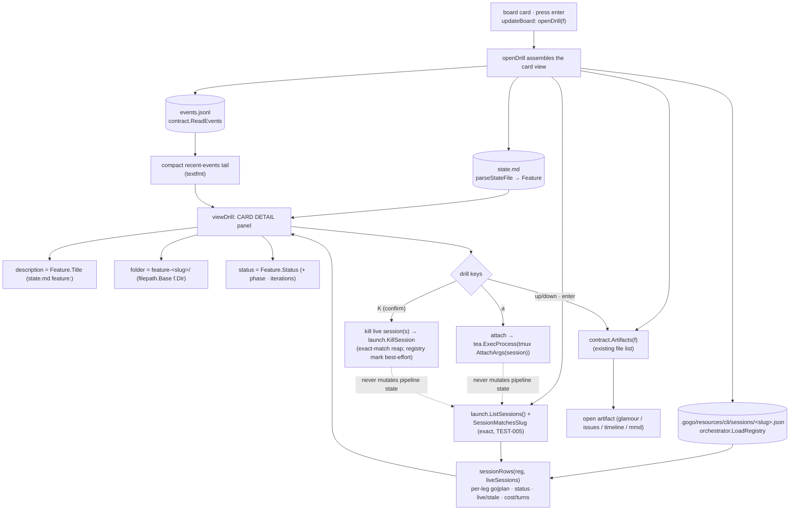
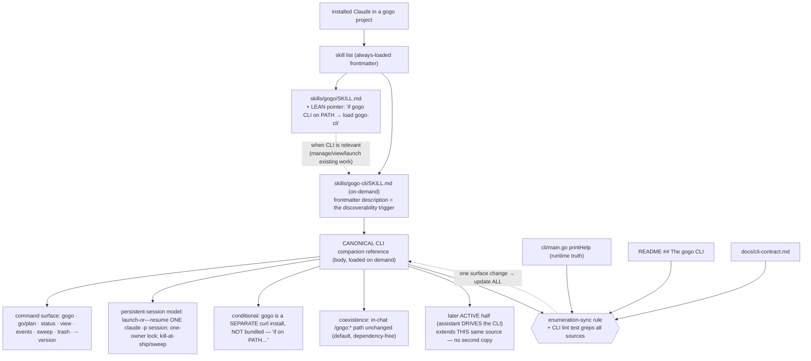

# Plan — cockpit cards & CLI-awareness (the discoverability/management layer)

Status: **accepted** (2026-07-12; D1-D5 as recommended) → **shipped as-built at 0.16.0** (report ⑤, 2026-07-12). Built exactly as planned (A→B), with three additive refinements from review/test: the enumeration-sync lint also greps `printHelp` (REV-002), a small "Command surface" enumeration was added to `docs/cli-contract.md`, the kill-confirm cancel returns to the drill (REV-001), and `viewDrill` now renders the status line (TEST-001). D6 (Slice A hands-on proof) user-skipped. See `report/report.md`.

**In one line:** two linked, independently-shippable slices on top of the
persistent-session orchestrator (v0.15.0) — **(A)** make the plugin **CLI-aware**
so an installed Claude cleanly knows the `gogo` command surface and *when* to
suggest it, and **(B)** turn the board's drill-in into a **rich card** that shows
a feature's sessions, status, description, folder, and events with **kill/attach**
actions. Slice **A first** (a quick markdown/skills discoverability win), then
**B** (the bigger Go/TUI change). These are the deferred **Slice 3** (board
drill-in) and the **passive half of Slice 4** (the gogo-cli reference) of the
persistent-session program.

## Goal

Close the gap between the powerful `gogo` CLI (v0.15.0: persistent-session
launcher + deterministic cockpit) and its **discoverability + management surface**:

- **Part A — CLI-awareness.** Today the plugin mentions the CLI only
  *incidentally* (`skills/gogo/SKILL.md` names "the gogo CLI cockpit" as an
  events.jsonl consumer + the done-board). There is **no canonical command
  reference** the orchestrator reads, so an installed Claude doesn't cleanly know
  the command surface, the persistent-session model, or **when** to suggest the
  CLI vs the in-chat flow. Add a concise, canonical **"gogo CLI companion"**
  reference — loaded on demand, pointed to by a lean line in the orchestrator
  skill.
- **Part B — rich drill-in card.** Today pressing `enter` on a board card drills
  into just the **files list** (`contract.Artifacts`). Add to that view the
  **active session(s)** for the card (registry + live-tmux), **kill/attach**
  actions, a **short description**, the **work-folder name**, the **status**, and
  the **events history**.

**Acceptance signal.**
- *(A)* A dedicated on-demand reference exists that documents the full v0.15.0
  command surface + the persistent-session model + coexistence, is written
  conditionally ("if `gogo` is on PATH…"), is pointed to by a lean line in
  `skills/gogo/SKILL.md`, and is kept in sync with the other command
  enumerations by a CLI lint that greps them all. The hands-on proof (an installed
  Claude surfacing the CLI) is a user-decision check, never a silent skip.
- *(B)* `enter` on a card shows a detail panel with description / folder / status /
  the card's sessions (live-vs-stale) / a recent-events tail, with `a` attach and
  `K` kill wired to the live session(s); `go test -race ./...` is green with new
  TUI render tests, a table test for the session-list read, and kill/attach wiring
  tests via injected seams.

## Context — what exists today (code = source of truth)

**The CLI is v0.15.0** (`cli/main.go` `Version = "0.15.0"`, `.claude-plugin/plugin.json`
`"version": "0.15.0"`). Both parts bump to **0.16.0**.

### Part A — the command surface already lives in three places (and only there)

- **`cli/main.go` `printHelp`** (lines 69–113) — the runtime truth: `gogo` ·
  `gogo go [<slug>] [--attach] [--takeover]` · `gogo plan <slug>` · `gogo sweep
  [--dry-run]` · `gogo status` · `gogo view <target> [--web] [--open]` · `gogo
  events <slug>` · `gogo trash [restore <entry>]` · `gogo run` (deprecated alias)
  · `gogo --version`, plus the board keymap.
- **`README.md` `## The gogo CLI`** (lines 310–407) — the human install + feature
  narrative, incl. the curl install (the binary is a **separate download, not
  bundled with the plugin**) and the full subcommand list (lines 399–401).
- **`docs/cli-contract.md`** — the **consumer** contract (what `.gogo/` files the
  CLI reads); `### Changed in 0.15.0` (lines 120–157) documents the lock file, the
  extended session registry, and the `go`/`plan`/`sweep` verbs. This is a
  *different artifact* from a command reference — it is the frozen file surface, not
  a "how to use the CLI" doc.
- **`skills/gogo/SKILL.md`** references "the `gogo` CLI cockpit" twice (the
  events.jsonl consumer, lines 74/77/298–306) — incidental, no command list.
- **`.gogo/knowledge/`** has **no** CLI file, and correctly so: the CLI command
  surface is a **gogo-UNIVERSAL** fact (true in every gogo project), so it belongs
  in the **plugin** (a skill or plugin doc), **not** a per-project knowledge file.
- The deferred note is explicit: `feature-persistent-session-orchestrator/plan.md`
  *Out of scope* lists **"The 'gogo-cli' assistant skill"** and **"Board drill-in
  showing sessions + status + metrics"**; `roadmap.md` #11 is the parent program.

### Part B — the drill-in reads only `contract.Artifacts` today

The relevant code (`cli/internal/tui/`):
- **`drill.go` `openDrill(f)`** sets `m.drill = f`, `m.artifacts =
  contract.Artifacts(f)`, `m.mode = modeDrill`. Nothing else is loaded.
- **`view.go` `viewDrill()`** renders a title (`files — <slug>`) + one row per
  artifact + a help line. **No** status/description/folder/sessions/actions.
- **`update.go` `updateDrill(msg)`** handles `q/esc/left/h` (back), `up/down/k/j`
  (file cursor — note **`k` is up**, so a kill key cannot be `k`), `enter/v/right/l`
  (open artifact), `w` (web), `G` (glow). `a` and `x` are **free** in the drill.
- **`model.go`** already holds `m.sessions []string` (live `gogo-*` tmux sessions,
  refreshed by a 5s tick + on reload) and `attachFocused()`/`liveSessionFor()`
  already attach a card's live session by **exact** `SessionMatchesSlug`.

Everything Part B needs to *read* already exists and is deterministic (LLM-free):
- **Sessions (tracked):** `orchestrator.LoadRegistry(root, slug)` →
  `Registry.Persistent` (map `go|plan → *PersistentSession{UUID, Tmux, PID,
  Status, StartedAt, CostUSD, NumTurns}`), status enum `running | parked |
  awaiting-uat | shipped | reaped`. A missing/garbled registry degrades to a fresh
  (empty) registry — never a crash.
- **Sessions (live):** `launch.ListSessions()` + `launch.SessionMatchesSlug`
  (exact convention parse, TEST-005) — already surfaced as `m.sessions`.
- **Description:** `Feature.Title` (the `feature:` line of state.md, parsed by
  `parseStateFile`).
- **Folder:** `filepath.Base(f.Dir)` → `feature-<slug>`.
- **Status:** `Feature.Status` (+ `Phase`, `Iterations`).
- **Events:** `contract.ReadEvents(<dir>/events.jsonl)` + `textfmt.Timeline` (the
  exact renderer `gogo events` uses — `cli/events.go`).
- **Kill/attach:** `launch.KillSession(name)` (tmux kill, single-argv, injection-
  safe) and `launch.AttachArgs(session)` + `tea.ExecProcess` (as `attachFocused`
  already does); the orchestrator's reap (`Session.Reap`) is the registry-consistent
  variant.

**Invariants to preserve** (`coding-rules.md` / `non-functional-requirements.md`):
writes stay under `.gogo/` (the registry/lock are CLI-owned, under
`.gogo/resources/`); **no LLM in the read path** — the drill-in stays a
deterministic display, kill/attach are the only state-changing actions and they
touch **sessions**, never **pipeline state**; keep the CLI-command enumeration in
sync; bump `plugin.json` + `cli/main.go` `Version` together.

## Functional requirements

### Part A — plugin CLI-awareness (markdown / skills)

- **FR-A1 — a canonical "gogo CLI companion" reference.** Author one concise,
  on-demand reference (recommended home: **`skills/gogo-cli/SKILL.md`** — see D1)
  documenting, from v0.15.0: the **command surface** (`gogo` board · `gogo go
  [<slug>] [--attach] [--takeover]` · `gogo plan <slug>` · `gogo status` · `gogo
  view <target> [--web] [--open]` · `gogo events <slug>` · `gogo sweep [--dry-run]`
  · `gogo trash [restore <entry>]` · `gogo run` deprecated alias · `gogo
  --version`); the **persistent-session model** (`gogo go`/`gogo plan` = launch-or-
  `--resume` ONE warm `claude -p` session running the `/gogo:go`|`/gogo:plan`
  skill; one-owner lock; kill-at-ship / `gogo sweep`); and **coexistence** (the
  in-chat `/gogo:*` path is unchanged and stays the default).
- **FR-A2 — conditional framing.** The reference states up front that the `gogo`
  binary is a **separate `curl` install, NOT bundled with the plugin**, and every
  usage is guarded ("if the `gogo` binary is on PATH…"). It never assumes presence.
- **FR-A3 — a lean pointer, not a fatter always-read skill.** `skills/gogo/SKILL.md`
  gains a **short** pointer to the reference (a `**Load when:** the gogo CLI is
  relevant → skills/gogo-cli` style line), so always-loaded context is not
  fattened (the very thing `/gogo:skills` fights). The detail loads only when the
  CLI is relevant.
- **FR-A4 — when-to-use guidance.** The reference explains **when** the CLI helps
  (fast deterministic management/viewing of existing work; launching/attaching/
  sweeping persistent sessions) **vs** the in-chat flow (the default, dependency-
  free path), so an installed Claude suggests the right path instead of guessing.
- **FR-A5 — enumeration-sync + a lint.** State the sync rule explicitly: the CLI
  command list lives in **`cli/main.go` help (runtime truth)**, **`README.md` `##
  The gogo CLI`**, **`docs/cli-contract.md`**, and now the **companion reference**;
  any change to the surface updates **all**. A `cli` test greps these sources so a
  missing/renamed command can't drift silently.
- **FR-A6 — one canonical source for the later active half.** The reference is
  authored so the deferred **active** gogo-cli skill (the assistant DRIVES the CLI)
  later **extends this same source**, never a second copy.

### Part B — rich board drill-in card (Go / TUI)

- **FR-B1 — a card detail panel.** `enter` on a board card shows, **above** the
  files list, a detail panel with: a **short description** (`Feature.Title` from
  state.md `feature:`), the **full work-folder name** (`feature-<slug>/`), and the
  **status** (`Feature.Status`, enriched with phase + the iterations round).
- **FR-B2 — the card's active session(s).** The panel lists the feature's
  session(s) from the **registry** (`orchestrator.LoadRegistry`; per-leg `go`/
  `plan` with lifecycle status + cost/turns), each **cross-checked with live-tmux**
  (`ListSessions` + exact `SessionMatchesSlug`) and marked **live** vs **stale /
  reaped**. A live `gogo-*` session with **no** registry entry (a board-launched
  racer) is still shown as an **untracked live** session.
- **FR-B3 — kill + attach actions.** For the card's **live** session(s): `a`
  **attaches** (reuse `launch.AttachArgs` + `tea.ExecProcess`, exactly as
  `attachFocused`); `K` **kills** behind a confirm (reuse the reap/kill helper —
  `launch.KillSession`, exact-match attribution; registry status marked best-effort).
  Both act **only** on real live sessions and the CLI **still never mutates
  pipeline state** — killing a *session* is not a pipeline-state write.
- **FR-B4 — events history.** The panel surfaces a **compact recent-events tail**
  inline (reuse `contract.ReadEvents` + a small `textfmt` tail), while the **full**
  timeline stays openable via the existing `events (timeline)` artifact row (the
  same `textfmt.Timeline` `gogo events` renders). No duplicate renderer.
- **FR-B5 — the session-list read is deterministic + table-testable.** A pure
  function maps `(registry, live-sessions, slug) → []sessionRow` (kind, status,
  live/stale, tracked/untracked, cost/turns). A missing/garbled registry → "no
  tracked sessions" (never a crash); an untracked live session still appears; a
  reaped/stale tracked session is labelled, not dropped.
- **FR-B6 — additive + versioned.** `docs/cli-contract.md` stays **additive** — the
  drill-in is **presentation** over the already-documented registry/lock surface
  (no new consumer file surface). Bump `.claude-plugin/plugin.json` + `cli/main.go`
  `Version` **together** to **0.16.0**; update `cli/main.go` help + `README.md`
  keymap for the new drill keys (`a` attach · `K` kill).

## Approach

**Slice order: A → B.** Part A is markdown-only (a new skill file + a lean pointer
+ a grep-lint), a low-risk, high-leverage discoverability win that also lands the
"when to suggest the CLI" guidance Part B's richer board benefits from. Part B is
the heavier Go/TUI change. Each is independently shippable; the default is one
cohesive feature built A-then-B, but A can ship on its own `/gogo:done` before B
starts (see *Out of scope* on versioning).

### Part A — a lean pointer + an on-demand reference (recommended: D1=A)

Create **`skills/gogo-cli/SKILL.md`** (`user-invocable: false`), a concise
reference whose **frontmatter description** is the discoverability trigger (an
installed Claude sees it in the skill list and loads it when the CLI is relevant).
The **body** carries FR-A1/A2/A4/A6 content (command surface + persistent-session
model + conditional framing + when-to-use + a "the later active half extends this
file" note). Add a **lean pointer** in `skills/gogo/SKILL.md` (FR-A3) near its
existing CLI mentions. Add a `cli` **enumeration-sync lint** (FR-A5), modelled on
`TestSkillsBashNoUnsafeRm`: derive the canonical command tokens from `cli/main.go`
`printHelp` and assert each appears in README, cli-contract, and the new reference.

Why a skill and not a `docs/` file: the skill's frontmatter is *exactly* the
mechanism that makes an installed Claude aware of the CLI (zero body loaded until
relevant), and the deferred **active** half is already a skill — extending one
`skills/gogo-cli/SKILL.md` keeps a **single canonical source**. `docs/cli-contract.md`
is the wrong home (it is the consumer file contract, a different purpose).

### Part B — assemble the card view in `openDrill`, render it in `viewDrill`

1. **`openDrill(f)` loads the extra card data** (all deterministic): the registry
   (`orchestrator.LoadRegistry`), the live sessions (already in `m.sessions`), and
   an events tail (`contract.ReadEvents`). Store a computed `[]sessionRow` +
   description/folder/status on the Model (drill-scoped fields).
2. **A pure `sessionRows(reg, live, slug)` reader** (FR-B5) — the table-tested
   core. Merges tracked (registry) + untracked-live (tmux) into display rows.
3. **`viewDrill()` renders the detail panel** above the file list: description /
   folder / status / session rows / recent-events tail / the file list / an
   updated help line (`a attach · K kill`).
4. **`updateDrill`** gains `a` (attach the card's live session — reuse
   `attachFocused`'s body, keyed off `m.drill`) and `K` (kill → a huh confirm →
   an injected `killer` seam defaulting to `launch.KillSession`, exact-match over
   the card's live sessions; mark the registry best-effort). `k` stays up-nav.
5. **Seams for tests:** the existing `m.launcher`/`m.capturer` pattern — add a
   `m.killer func(string) error` (default `launch.KillSession`) and a
   `m.registry func(root, slug) *orchestrator.Registry` (default
   `orchestrator.LoadRegistry`) so the reader + kill wiring are asserted with fakes,
   no real tmux/claude.
6. **Version + docs:** bump to 0.16.0; update help + README keymap.

**Import direction check:** `tui` already imports `contract` + `launch`; adding
`tui → orchestrator` is acyclic (`orchestrator` imports `contract` + `launch`, not
`tui`). Reusing `orchestrator.LoadRegistry`/`PersistentSession` avoids a second
registry parser.

### Intended design

**Part B — the drill-in card (data assembly + actions):**

**Part A — the CLI-awareness pointer → on-demand reference flow:**

The as-is baseline (current file-list-only drill-in) is in `charts/before/`.

### Alternatives considered

- **Part A home — a `docs/cli-companion.md` the orchestrator points to (D1=B).** A
  plain doc is a fine single source, but it is **not** auto-surfaced to an installed
  Claude — the orchestrator must already know to read it, which is the very gap we
  are closing. A skill's frontmatter is the discoverability mechanism. Rejected as
  the primary home; kept as the fallback if we decide skills shouldn't grow.
- **Part A — fold the reference into `skills/gogo/SKILL.md`.** Directly violates
  FR-A3 (fattens always-read context — the thing `/gogo:skills` fights). Rejected.
- **Part B kill/attach — a session sub-menu (D2=B).** More discoverable, but heavier
  and off-pattern; the board is key-driven. Inline keys (`a`/`K`) match the existing
  model. Recommended inline; sub-menu noted if the key surface feels cramped.
- **Part B events — a link only (D3=B).** Relying solely on the existing `events
  (timeline)` row is the smallest change, but the panel loses at-a-glance history.
  A compact inline tail + the full openable row is the better balance.
- **Part B — a fresh registry parser in `tui`.** Duplicates `orchestrator`'s reader
  and invites drift. Reuse `orchestrator.LoadRegistry`. Rejected.
- **One feature vs two.** Two separate feature folders would double the pipeline
  overhead for one cohesive theme; one feature with two clearly-separable slices
  keeps the audit trail together while still allowing A to ship first. Recommended.

## Changes checklist (in build order)

### Slice A — plugin CLI-awareness (ship first)
1. **`skills/gogo-cli/SKILL.md`** (new) — the canonical companion reference
   (FR-A1/A2/A4/A6): frontmatter (`name: gogo-cli`, `user-invocable: false`, a
   description that triggers on CLI relevance), body = command surface +
   persistent-session model + conditional framing + when-to-use + the "active half
   extends this file" note.
2. **`skills/gogo/SKILL.md`** — add the lean `**Load when:**` pointer (FR-A3) near
   the existing CLI-cockpit mentions; no other bloat.
3. **`cli/skills_lint_test.go`** (or a new `cli/cli_enum_test.go`) — the
   enumeration-sync lint (FR-A5): parse the command tokens from `cli/main.go`
   `printHelp`, assert each is present in `README.md`, `docs/cli-contract.md`, and
   `skills/gogo-cli/SKILL.md`.
4. **`.claude-plugin/plugin.json` + `cli/main.go` `Version`** → **0.16.0** (if A
   ships separately; else bumped once with B).
5. **`README.md`** — a one-line note that the CLI companion reference exists (kept
   in sync); the agents list / skill inventory if it enumerates skills.

### Slice B — rich board drill-in card (ship second)
6. **`cli/internal/tui/model.go`** — drill-scoped fields (`drillSessions
   []sessionRow`, `drillEventsTail string`, description/folder/status cached) + the
   `killer` and `registry` seams (defaults `launch.KillSession` /
   `orchestrator.LoadRegistry`).
7. **`cli/internal/tui/drill.go`** — `openDrill` loads registry + events tail +
   computes `sessionRows`; add the pure `sessionRows(reg, live, slug) []sessionRow`
   reader (FR-B5) and a `sessionRow` type.
8. **`cli/internal/tui/view.go` `viewDrill()`** — render the detail panel (FR-B1/B2/
   B4) above the file list; update the help line.
9. **`cli/internal/tui/update.go` `updateDrill`** — add `a` (attach) + `K` (kill →
   confirm → `killer`) (FR-B3); `k` stays up-nav.
10. **`cli/main.go` help + `README.md` keymap** — document `a`/`K` in the drill
    (FR-B6); bump `Version`/`plugin.json` to 0.16.0 if not already.
11. **`docs/cli-contract.md`** — a small additive note only if any wording implies
    a new read (it does not — presentation over documented state).
12. **Tests** — see below.

## Tests

**Part A (markdown) — the enumeration-sync lint + a hands-on check.**
- **Sync lint** (`cli`, Go): the canonical command tokens (derived from `cli/main.go`
  `printHelp`) each appear in `README.md`, `docs/cli-contract.md`, and
  `skills/gogo-cli/SKILL.md`; fails on a missing/renamed command so the four
  sources can't drift. Runs under the existing `go test ./...` gate.
- **The real proof is hands-on** (`test-strategy.md` / gogo-test): *does an
  installed Claude, in a gogo project with the `gogo` binary on PATH, surface the
  CLI when the user asks to manage/view work?* This **cannot** be asserted in a unit
  test — it is a **user-decision check at phase ④**, surfaced for the user to run
  by hand (or explicitly skip), **never a silent skip**.

**Part B (Go) — TUI render + reader + wiring tests** (the established
`internal/tui` pattern: build a `Model` over a temp `.gogo/`, seed sessions via
`m.sessions` and a registry JSON file, drive `Update` with `tea.KeyMsg`, assert on
`View()` substrings; inject fakes for side effects). Gates: `gofmt -l .` ·
`go vet ./...` · `go test -race ./...`.
1. **Drill-in detail render** — `enter` on a card shows the description, folder
   (`feature-<slug>`), status, its session rows, and a recent-events tail (assert
   `viewDrill()` substrings).
2. **`sessionRows` table test (FR-B5)** — cases: registry with a live `go` leg
   (→ live), a registry `reaped` leg (→ stale/reaped, still shown), an untracked
   live tmux session (→ untracked live), a missing/garbled registry (→ "no tracked
   sessions", no crash), and the exact-match guard (`oauth` ≠ `auth`,
   `awaiting-card` ≠ `waiting-card`, TEST-005).
3. **Attach wiring** — `a` in the drill over a card with a live session invokes the
   attach path for the exact session (assert via an injected exec/attacher seam; no
   real tmux); no live session → a status hint, no attach.
4. **Kill wiring** — `K` → confirm → the injected `killer` is called **once** with
   the exact live session name (never a substring sibling); cancel → killer **never**
   called (mirrors the delete-confirm tests).
5. **No-LLM / degradation** — the drill-in render performs zero launches and no
   registry write on open; a feature with no registry + no sessions still renders a
   clean panel ("no tracked sessions").

## Out of scope (deferred / not built here)

- **The ACTIVE half of the gogo-cli skill** (the assistant *drives* the CLI —
  runs `gogo go`/`gogo done` on the user's behalf). This plan builds the **passive**
  reference it will extend; the active half is a later slice.
- **A `gogo`-side change** to how sessions are launched/reaped (that is the
  persistent-session orchestrator's domain, already shipped in 0.15.0). Part B only
  **reads + kills/attaches** existing sessions.
- **Surfacing cost/turns as a first-class metrics view** — the registry records
  `CostUSD`/`NumTurns`; the panel may show them compactly, but a dedicated
  cost/telemetry surface is its own later slice (noted in the 0.15.0 plan).
- **Reading the lock file to show the current owner** in the panel — registry +
  live-tmux cross-check already conveys live-vs-stale (D4); the lock-owner line is
  an easy additive follow-up if wanted.
- **Killing a headless `-p` `gogo go` child from the board** — that child is not a
  tmux session and not visible to the board; kill targets live `gogo-*` tmux
  sessions only. `gogo sweep` remains the backstop.
- **Versioning if the slices ship separately:** if A ships on its own `/gogo:done`
  first it is 0.16.0 and B becomes 0.17.0; if built and shipped together, one 0.16.0
  covers both. Default recommendation: one feature, one 0.16.0.

## Summary (TL;DR)

- **What:** a discoverability/management layer on the v0.15.0 persistent-session
  CLI, in two independently-shippable slices — **(A)** a canonical, on-demand
  **"gogo CLI companion"** reference (recommended home `skills/gogo-cli/SKILL.md`)
  plus a **lean pointer** in `skills/gogo/SKILL.md`, so an installed Claude knows the
  command surface, the persistent-session model, and **when** to suggest the CLI;
  and **(B)** a **rich board drill-in card** showing a feature's **sessions**
  (registry + live-tmux), **status**, **description**, **folder**, and **events**,
  with **`a` attach / `K` kill** actions.
- **Why:** the CLI is powerful but under-discovered (no canonical command
  reference) and the board's drill-in is thin (files only) — these are the deferred
  **Slice 3** (drill-in) and **passive Slice 4** (gogo-cli reference) of the
  persistent-session program.
- **Chosen approach:** Part A is a skill (its frontmatter *is* the discoverability
  trigger) + a grep-lint that keeps the command list in sync across
  `main.go` help / README / cli-contract / the reference; Part B assembles the card
  in `openDrill` (reusing `orchestrator.LoadRegistry` + `launch` helpers, all
  LLM-free), renders it in `viewDrill`, and wires `a`/`K` behind injected seams —
  the CLI still never mutates **pipeline** state. **Slice A first**, then B; bump to
  **0.16.0**.
- **What happens next:** accept this plan → `/gogo:go` builds it (A, then B). The
  open forks are in `decisions.md` — the **reference home** (skill vs doc, D1),
  **inline keys vs a sub-menu** (D2), **events inline vs link** (D3), **how the
  drill reflects the lock/live state** (D4), and **slice order** (D5).
