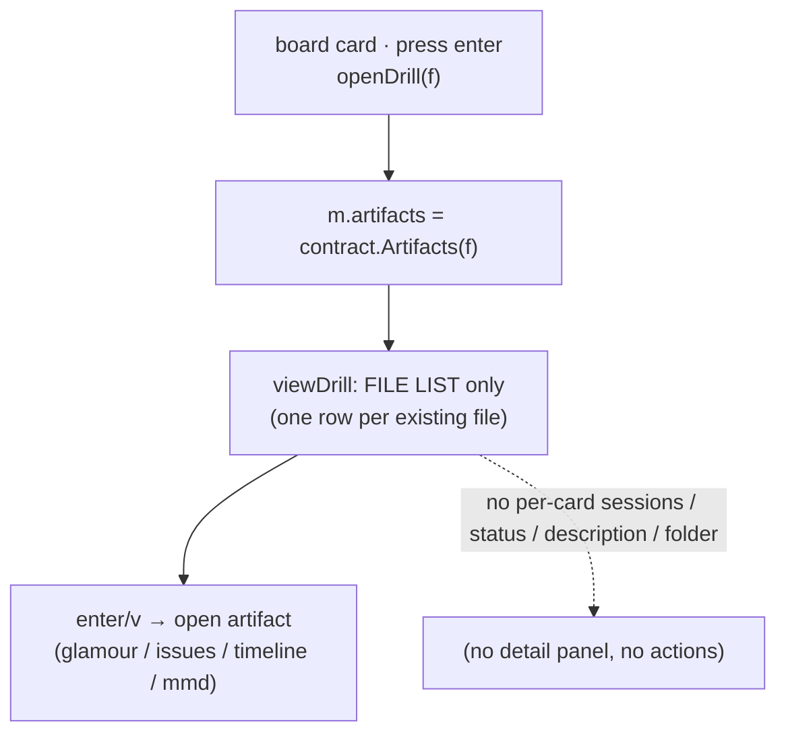
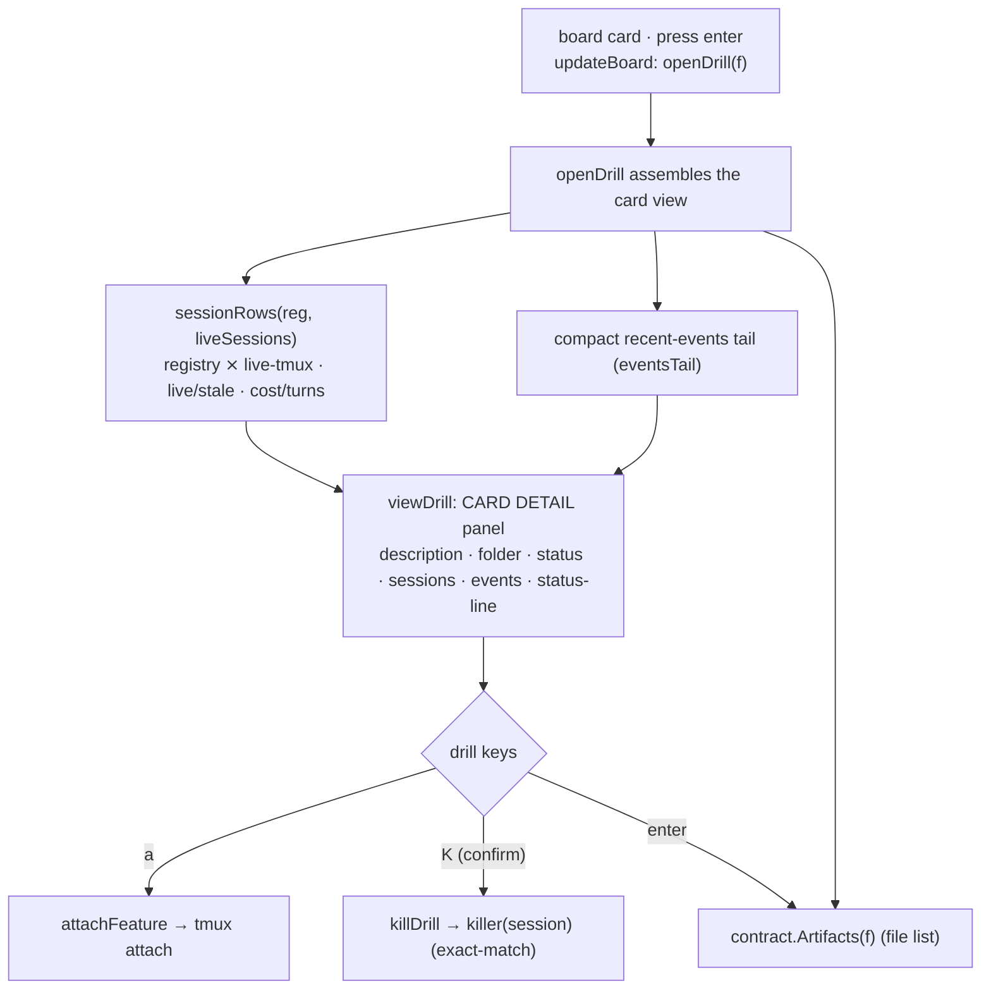

# Report — feature `cockpit-cards-and-cli-awareness`

- **feature:** cockpit cards & CLI-awareness — an on-demand gogo-CLI reference + a rich board drill-in card
- **status:** awaiting-uat
- **completed:** 2026-07-12
- **branch / commits:** main (working tree — not yet committed; gogo defers commits to the user)

**What shipped, in one line:** two linked slices on top of the v0.15.0 persistent-session CLI — **(A)** the plugin is now **CLI-aware** (a canonical, on-demand `gogo-cli` reference + a lean pointer, kept honest by an enumeration-sync lint) and **(B)** the board's drill-in is now a **rich card** (description / folder / status / the card's sessions / a recent-events tail, with `a` attach and `K` kill). Bumped to **0.16.0**.

## Run status / gaps

All phases completed: plan ① → implement ② (3 rounds) → review ③ (1 round, APPROVE) → test ④ (1 round, green) → report ⑤. **No open issues** — every review and test finding is resolved: REV-001, REV-002, TEST-001 fixed and re-verified; TEST-002 (the Slice A hands-on proof) **user-skipped per decision D6** (a recorded skip, not a silent one). Automated gate green: `gofmt -l .` clean · `go vet ./...` clean · `go test -race ./...` green.

## Summary

The v0.15.0 CLI is powerful (a persistent-session launcher + a deterministic cockpit) but **under-discovered** — there was no canonical command reference, so an installed Claude didn't cleanly know the command surface or *when* to suggest the CLI — and the board's drill-in was **thin** (a file list only). This feature closes both gaps: it adds a concise **on-demand `gogo-cli` companion reference** (its frontmatter *is* the discoverability mechanism) plus a lean pointer in the orchestrator skill, and it turns `enter` on a board card into a **rich detail panel** showing the feature's sessions (registry ⨯ live-tmux), status, description, folder, and events — with **attach/kill** actions. These are the deferred **Slice 3** (drill-in) and the **passive half of Slice 4** (the gogo-cli reference) of the persistent-session program.

## Planned vs shipped

**Shipped as planned** — both slices, in the accepted A→B order, at one **0.16.0** bump; all five plan decisions (D1–D5) built as accepted. Deviations were only additive refinements found in review/test:

- **Enumeration-sync lint strengthened (REV-002):** the plan's lint checks README / cli-contract / the reference; it now *also* greps `main.go`'s `printHelp`, so the runtime help text can't drift from the dispatch either — all **four** FR-A5 sources are covered.
- **`docs/cli-contract.md` gained a small "Command surface" enumeration** (a table + the sync rule). The plan called this optional/additive; it was needed so the four-source lint has the full verb list in the contract doc, and it anchors the sync rule where FR-A5 names it.
- **Kill-confirm cancel returns to the drill (REV-001)** and **the drill now renders its status line (TEST-001)** — two correctness/UX fixes beyond the plan's wording (details in *Review* / *Test outcome*).

## Implementation

Two independently-shippable slices, built A-then-B in one feature.

**Slice A — plugin CLI-awareness (markdown + one Go lint).** A new `skills/gogo-cli/SKILL.md` is the **canonical, on-demand CLI companion reference**: its frontmatter `description` is worded to trigger when the CLI is relevant (so an installed Claude loads the body only then), and the body documents the full v0.15.0+ command surface, the persistent-session model (launch-or-`--resume` one warm `claude -p` session; one-owner lock; kill-at-ship / `gogo sweep`), the **conditional framing** (the binary is a *separate curl install, not bundled* — "if `gogo` is on PATH…"), **when to use** the CLI vs the in-chat `/gogo:*` flow, and a note that the deferred **active** half extends this same file. `skills/gogo/SKILL.md` gains a **lean `**Load when:**` pointer** to it (no bloat to always-read context). A new `cli/cli_enum_test.go` (`TestCLICommandEnumerationInSync`) derives the command verbs from `main.go`'s dispatch `switch` and asserts each appears in `printHelp`, README, `docs/cli-contract.md`, and the reference — a real drift guard, not a tautology.

**Slice B — rich board drill-in card (Go/TUI, `cli/internal/tui/`).** `openDrill` now calls `loadDrillCard`, which does **deterministic, LLM-free reads**: the registry (via the injectable `orchestrator.LoadRegistry` seam) and a compact events tail. A pure **`sessionRows(reg, live, slug) []sessionRow`** reader merges tracked registry legs (`go`/`plan`, with lifecycle status + cost/turns) with live tmux sessions — each cross-checked by **exact `SessionMatchesSlug`** (never substring; TEST-005) and flagged **live/stale**, plus any **untracked-live** racer. `viewDrill` renders a **detail panel** (description = `Feature.Title`, folder = `feature-<slug>/`, status = `Status` + phase + round, the session rows, and the events tail) above the file list, and — after the TEST-001 fix — also renders the transient **status line**. `updateDrill` wires **`a`** (attach, via the shared `attachFeature`) and **`K`** (kill → a `huh` confirm → the injectable `killer` seam, default `launch.KillSession`); **`k` stays up-nav**. Kill/attach act only on real live sessions and **never mutate pipeline state**. `main.go` help + the README keymap document the new keys; version bumped in `plugin.json` + `main.go` together.

### Changes (as-built)

| File | Change | Note |
|---|---|---|
| `skills/gogo-cli/SKILL.md` | added | The canonical on-demand CLI companion reference (FR-A1/A2/A4/A6). |
| `skills/gogo/SKILL.md` | modified | Lean `**Load when:** … → skills/gogo-cli` pointer (FR-A3). |
| `cli/cli_enum_test.go` | added | `TestCLICommandEnumerationInSync` — verb-drift lint across 4 sources incl. `printHelp` (FR-A5, +REV-002). |
| `docs/cli-contract.md` | modified | "Command surface (enumeration-sync anchor)" table + the sync rule. |
| `README.md` | modified | CLI companion note; rich drill-in description; `a`/`K` keymap. |
| `.claude-plugin/plugin.json` · `cli/main.go` | modified | `Version` 0.15.0 → **0.16.0** (together); help gains a drill-in keys block. |
| `cli/internal/tui/model.go` | modified | `drillSessions`/`drillEventsTail`/`pendingKill` fields + `killer`/`registry` seams (defaults wired in `New`). |
| `cli/internal/tui/drill.go` | modified | `loadDrillCard`, the pure `sessionRows` reader + `sessionRow` type, `eventsTail`. |
| `cli/internal/tui/view.go` | modified | `viewDrill` detail panel + `renderSessionRow`; renders `m.status` (TEST-001). |
| `cli/internal/tui/update.go` | modified | `a`/`K` keys; `attachFeature`/`killDrill`/`startKillForm`/`finishKill`/`liveSessionsFor`/`formPreservesSelection`; `cancelForm` returns to drill for a kill (REV-001). |
| `cli/internal/tui/card_test.go` | added | Render, `sessionRows` table (TEST-005 + degrade), attach wiring, kill fire-once + cancel-stays-on-drill, status-rendered, no-sessions degrade. |
| `.../charts/*`, `.../report/*` | added/updated | As-built flow + class diagrams; before set carried into `report/before/`. |

## Decisions & rationale

All plan-time forks (D1–D5) were accepted as recommended before code; D6 arose at the test gate. See [decisions.md](../decisions.md).

| Decision | Choice | Reason |
|---|---|---|
| D1 — CLI reference home | **A: on-demand skill** `skills/gogo-cli/SKILL.md` | The skill frontmatter *is* the "installed Claude knows the CLI" mechanism (zero body until relevant); the later active half extends one canonical source. |
| D2 — kill/attach UX | **A: inline keys** `a`/`K` | Matches the board's key-driven model; lightest change; `k` stays up-nav so kill is capital `K`, behind a confirm. |
| D3 — events in the panel | **A: compact inline tail** + the full timeline still openable | At-a-glance history without a second renderer. |
| D4 — liveness source | **A: registry + live-tmux cross-check** (no lock read) | "Live" already conveys ownership and targets kill/attach; the lock-owner line is an easy later add. |
| D5 — slice order | **A: A → B** | Markdown/discoverability win first (low-risk, no Go), then the heavier TUI change; each ships independently. |
| D6 — Slice A hands-on proof | **A: skip for now (user)** | The discoverability *prerequisites* are all verified green; the live behavioural proof is best confirmed opportunistically in real CLI use and blocks nothing structural. |

## Review outcome

**One round — verdict APPROVE (clean; no blockers/majors).** The fresh-eyes reviewer ran the gates green and verified the hard invariants (no LLM in the read path; kill/attach touch sessions only, never pipeline state; single-argv/no-shell injection safety; exact `SessionMatchesSlug` attribution; the TEST-001 value-type-Model form gotcha handled via the heap-stable `*formBinding`; enumeration-sync + paired version bump). Two low-severity findings, both **fixed in-context and re-verified**:

- **REV-001 (minor):** Esc/abort out of the drill `K` confirm bounced to the board instead of staying on the drill card (inconsistent with the Cancel-button path). Fixed: `cancelForm` returns to `modeDrill` when a kill was in flight; regression assertions added.
- **REV-002 (nit):** the sync lint didn't check `printHelp` itself. Fixed: `printHelp` is now the fourth grepped source.

See [review-01.md](../review-01.md) / [review/issues.json](../review/issues.json).

## Test outcome

**One round — automated gate green; Slice B verified hands-on.** The fresh-eyes tester ran `gofmt`/`vet`/`go test -race` green (confirming every new test executes with `-count=1`) and drove the real board in a throwaway tmux pane against a seeded fixture, verifying the detail panel, live/stale/untracked/no-session session rendering, and the REV-001 fix — all live.

- **TEST-001 (major, fixed):** `viewDrill()` never rendered `m.status`, so the `a`/`K` hints and kill/detach confirmations were **silent no-ops in the live TUI** (unit tests only asserted `Model.status`). Fixed: `viewDrill` now renders the status line; a new `TestDrillStatusIsRendered` asserts the hint appears in `View()` output — closing the render-coverage gap `test-strategy.md` warns about.
- **TEST-002 (major, user-skipped — D6):** whether an *installed* Claude actually surfaces the CLI when asked to manage work is a live skill-selection behaviour of a *separate* session, not tester-assertable. All artifact-level prerequisites are green; the user chose to **skip** the live proof (verify opportunistically).

See [test-01.md](../test-01.md) / [test/issues.json](../test/issues.json).

## Diagrams

The as-built set — open [diagrams.html](./diagrams.html) (same folder):

- **`flow.mmd`** (flow) — Part B: `enter` → `openDrill`/`loadDrillCard` assembles the card from state.md + registry + live-tmux + events, `viewDrill` renders the panel, `a`/`K` act on live sessions (never mutating pipeline state).
- **`class.mmd`** (class) — Part B structure: the new `sessionRow` type and the `Model` drill fields/seams (`killer`, `registry`) → `orchestrator.Registry`/`PersistentSession`.
- **`flow-cli-awareness.mmd`** (flow) — Part A: the lean pointer → on-demand `gogo-cli` reference, and the four-source enumeration-sync rule.

## Before / after comparison

The plan captured an as-is **flow** baseline (copied here as `report/before/drill-in.mmd`); Part A had no before flow (no canonical CLI reference existed).

**Kind `flow` — the drill-in (before → after):**

Before (as-is — file list only):

After (as-built — rich card):

**What changed:** the drill-in went from a bare **file list** to a **rich card** — the same file list is still there (and still opens artifacts), but it now sits *below* a detail panel that reads the feature's description/folder/status, its sessions (registry ⨯ live-tmux, live/stale/untracked), and a recent-events tail, and it gains two session actions (`a`/`K`). **Added (after only):** the `class` structure diagram (the new `sessionRow` type + seams) and the Part A `flow` (both brand-new areas, no before). **Removed:** none.

## Knowledge updates

- **`.gogo/knowledge/test-strategy.md`** (owned) — added the TEST-001 lesson: for the Go TUI, a model-level status assertion can pass while `View()` never renders it; assert the **rendered `View()` output** for status/hint-bearing paths, not just `Model.status`.
- **`.gogo/knowledge/code-review-standards.md`** (owned) — added a short reviewer check mirroring it (flag any new status/hint set on the model that no `View()` path renders).

No upstream (CLAUDE.md / README `Source:`) changes were needed — all edits are gogo-owned summaries. **Consider upstreaming:** nothing this round.

## Follow-ups & known limitations

- **The active gogo-cli half** (the assistant *drives* the CLI — runs `gogo go`/`gogo done` for the user) is deferred; this shipped the passive reference it will extend.
- **Lock-owner line in the panel** (D4=B) — an easy additive follow-up (registry + live-tmux already conveys live/stale).
- **Cost/turns as a first-class metrics view** — the panel shows them compactly; a dedicated telemetry surface is its own later slice.
- **TEST-002 live proof** — skipped per D6; confirm opportunistically that an installed Claude surfaces the CLI when asked to manage work.

## Summary (TL;DR)

- **What shipped:** at **0.16.0**, (A) an on-demand **`gogo-cli`** companion reference + a lean pointer + a four-source enumeration-sync lint, so an installed Claude knows the CLI surface, the persistent-session model, and *when* to suggest it; and (B) a **rich board drill-in card** — description / folder / status / the card's sessions (registry ⨯ live-tmux, live/stale/untracked) / a recent-events tail, with **`a` attach** and **`K` kill** (LLM-free reads; session-only actions; injected `killer`/`registry` seams).
- **Review verdict:** APPROVE (clean) — two low findings fixed (REV-001 cancel-returns-to-drill, REV-002 lint greps printHelp).
- **Test verdict:** green — automated gate + hands-on drill card; TEST-001 (unrendered status line) fixed + regression-tested; TEST-002 hands-on proof user-skipped (D6).
- **Follow-ups:** the active gogo-cli half, an optional lock-owner line, a metrics view, and the opportunistic TEST-002 check — see above.
