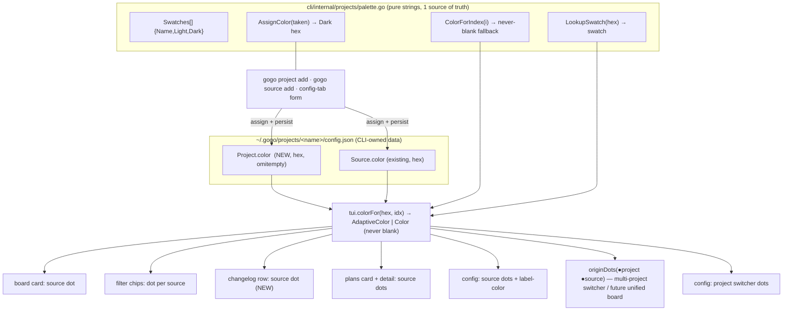

# Plan — cockpit colors (per-project + per-source origin cues, and the home-dir board bug)

**Feature:** `cockpit-colors` · phase ① (plan) · status **awaiting-plan-acceptance** · target **0.22.0**

> A small, presentation-focused follow-up to the just-shipped **0.21.0** projects · sources · plans
> cockpit. It does three things: **(1)** fixes a real bug where `gogo` in your home dir opens an empty
> board; **(2)** gives every **project** and every **source** an auto-assigned, persisted, editable
> **color**; **(3)** paints those colors consistently across the board, changelog, plans and config tabs
> so a card reads its **origin at a glance** — the design's "colored dot left of the name" cue.

This is a **model + rendering** change. It adds no command verb, no pipeline change, and does **not**
build the unified all-projects board — it builds the **color model that a future unified board needs**.

---

## Goal

Make the cockpit tell you **where a card comes from by color**. Concretely:

1. **Fix FR1** — running `gogo` from `~` (or any dir under `~` without its own `.gogo/`) must open the
   **global cockpit**, not an empty single-repo board.
2. Give a **project** and a **source** each a default **color** (curated palette, auto-assigned,
   persisted to `config.json`, editable in the config tab), with a deterministic **never-blank**
   fallback for entities created before this change.
3. **Combine** the project color and the source color so origin reads fast: source dot in a
   single-project view; project **and** source dot in a multi-project context.
4. **Render** the colors everywhere the design shows them — board cards, filter chips, the **changelog
   column (new dot)**, plans-tab cards + plan detail, and the config tab (project/source dots + a
   label-color field).

**Acceptance signal.** `gogo` run in `$HOME` opens the global cockpit (not an empty board) — pinned by
a pure `chooseBoard` test. `gogo project add <repo>` writes a non-empty `color` for the project **and**
its first source in `config.json`; a source/project with no stored color still renders a stable colored
dot (never blank). On the project board every source dot, every filter chip, every plans-tab dot, every
plan-detail target row, **and every changelog row** carries its source's color; the config tab shows a
colored dot per project and per source plus an editable label-color. A lone repo with no home project is
**byte-for-byte** unchanged. `cd cli && gofmt -l . && go vet ./... && go test -race ./...` is green (enum-
sync + no-unsafe-rm guards untouched and green).

---

## Context

**Where the code actually is (verified against the tree at plan time):**

- **Released line is `0.21.0`** — committed at `78691bc` ("projects, sources & plans cockpit + global
  mode"). `.claude-plugin/plugin.json` and `cli/main.go` both read `0.21.0`. This plan targets **0.22.0**.
- The 0.21.0 UAT round already **flagged the unified all-projects board as a deferred fast-follow**
  (`report/report.md` → *Follow-ups*: "`gogo global` currently opens the per-project cockpit with the
  `p` switcher"). This feature is the color groundwork that fast-follow will build on — **not** that board.

**FR1 — the home-dir bug is real (confirmed in code).** `runBoard` (`cli/main.go:79`) calls
`contract.FindRoot(".")` (`cli/internal/contract/contract.go:177`), which **walks up** looking for any
`.gogo/` dir. `projects.Home()` (`cli/internal/projects/projects.go:86`) is the literal `~/.gogo` — the
**data home**. So from `~` (or any child of `~` without its own `.gogo/`), `FindRoot` finds `~/.gogo`,
returns `~` with `err == nil`, and `chooseBoard` (`cli/main.go:113`) takes its **first branch**
unconditionally:

```go
if rootFound {
    return boardChoice{model: tui.New(root), kind: "single"}   // ← treats ~ as a repo
}
```

`tui.New(~)` → `LoadRepo(~)` reads `~/.gogo/work/` (which doesn't exist / is empty) → an **empty board**.
There is **no guard** that the found root's `.gogo` is actually the data home. The two-mode intent
(inside a repo → that repo; outside → global cockpit) is defeated because the data home *looks* like a
repo to `FindRoot`.

**FR2–FR5 — the color model today (confirmed in code).**

| Piece | Today | Gap this plan closes |
|---|---|---|
| `projects.Source.Color` (`projects.go:65`) | optional hex, persisted, `omitempty` | no auto-assignment; blank until the user types a hex |
| `projects.Project` (`projects.go:70`) | `{schema,name,description,sources[]}` | **no project-level color at all** |
| `model.sourceColorMap` (`model.go:318`) | maps a source label → hex **only when `s.Color != ""`** | a colorless source is **omitted** → its dot renders `dimStyle` grey |
| `sourceTag`/`styleSourceTag` (`view.go:381/421`) | `if c := m.sourceColors[f.Source]; c != ""` else dim | needs a palette fallback so it's never grey |
| `viewSourceChips` (`view.go:58`) | `all` + labels, **no dots** | design 3a shows a colored dot per chip |
| `changelogRow` (`view.go:308`) | free function; leading `●` is a **live-session** cue (green) | design 3a wants a **source-colored** dot per shipped row — and it can't reach `m.sourceColors` (it's not a method) |
| `planSourceDots`/`sourceDot` (`plans_tab.go:543/646`) | source dot, `dimStyle` when no color | palette fallback for consistency |
| `viewConfigLeft`/`viewConfigRight` (`config_tab.go:219/266`) | source rows start with a literal uncolored `●`; project rows have no dot; right pane shows `color <hex>` | source-colored dot, **project** dot, and a "label color · <name>" field |
| config source form (`config_tab.go:100`) | a "Color" input bound via `*formBinding.srcColor` (TEST-001) | reuse for the editable label-color; add the project path |

**Palette precedent.** `internal/projects/migrate.go:46` already carries a legacy `config.Project.Color`
into `Source.Color`, and `styles.go` defines **16 `AdaptiveColor` tokens** (light/dark) for every
phase/status/column accent. The source palette is a **new, separate visual channel** (a small dot left
of the name) — but it must be **`AdaptiveColor`-based, consistent with `styles.go`**.

**The design (UI source of truth).** The "Gogo Cockpit" Claude Design (project `83feef99`, TURN 3/4).
DesignSync is not available to this planner, so — per the brief — the palette + structure below are the
authority: **3a** unified board + filter chips + changelog dots · **3b** config with per-project/source
color + a "label color · teal" field · **4a** plans-tab per-source dots · **4b** plan-detail target dots.
The design's dot = a small rounded dot in the entity's color, left of its name; the design's per-source
hues include **teal `#35c9b5`, pink `#eb7bb5`, blue `#58a6ff`**.

**Invariants held throughout** (from `coding-rules.md` / `non-functional-requirements.md`):

- **Presentation-only + additive.** No command verb changes → the four-source **CLI enum-sync is NOT
  triggered**. `Project.Color` is an **additive, optional** JSON field (`omitempty`, schema stays `1`);
  an absent field degrades to the deterministic fallback (never a crash, never blank).
- **Graceful single-repo fallback stays byte-for-byte** — a lone repo has `Feature.Source == ""`, so no
  source dot and no chips render there (unchanged).
- **Read path stays LLM-free and millisecond-fast** — colors are pure lookups computed once per rebuild.
- **CLI reads sources' `.gogo/`, writes only `~/.gogo/`** — color is CLI-owned project data
  (`config.json`), never a source's pipeline state.
- **Bubbletea heap-stable form binding (TEST-001)** — the config label-color edit binds through the
  existing `*formBinding` string targets, never a value-copied Model field.

---

## Functional requirements

### FR1 — `gogo` in the home dir opens the global cockpit, not an empty board

When `FindRoot` resolves a root whose `.gogo` **is the global data home**
(`filepath.Clean(filepath.Join(root, ".gogo")) == filepath.Clean(projects.Home())`), treat it as **NOT a
repo**: fall through to the same global-cockpit path `gogo global` uses (initialized + ≥1 project → the
global cockpit; else the friendly hint). So `gogo` in `~` opens the global cockpit, matching the two-mode
model. A lone repo that has its **own** `.gogo/` (anywhere else) is unaffected. Pure test:
root whose `.gogo == data-home` → **not** `single` (→ `project` when initialized+≥1, else `none`).

### FR2 — default colors per PROJECT and per SOURCE (auto-assigned, persisted, editable)

- Add a **project-level `Color string` (hex, `omitempty`)** to `projects.Project`, alongside the existing
  per-source `Source.Color`.
- Define a curated **palette** of named `AdaptiveColor` swatches (see *Approach → palette*), matching the
  design's hues.
- On **`gogo project add`**: assign a **default project color** AND a **default source color** (for source
  #1) by a deterministic **round-robin that skips colors already taken** by existing projects/sources. On
  **`gogo source add`** and the **config-tab add**: assign a default source color likewise. Assignment
  persists the chosen hex into `config.json`.
- An entity created **before** this change (empty color) falls back to a **deterministic palette pick by
  index** at render time — never blank, never a crash.
- The color is **editable** in the config tab (the design's "label color" field), persisted on save.

### FR3 — combine project + source color so origin reads fast

- In a **single-project view** (today's per-repo board, and `gogo global` focused on one project via the
  `p` switcher) the **source** dot alone conveys origin — unchanged card anatomy.
- In a **multi-project context** (the config-tab **project switcher** today; the future **unified
  all-projects board**) surface the **project** color too: a small **project dot + source dot** pair
  (`●P ●S`) left of the name, so a row reads "**project P, source S**" at a glance. Legible at narrow
  widths (reuse the existing source-tag truncation). This feature ships the **model + the render helper**
  and uses it where a multi-project surface already exists (the switcher); the unified board that would
  put it on every card is out of scope (deferred fast-follow).

### FR4 — apply colors across the TUI to match the design

- **Board cards** — the colored **source** dot + name (present) now uses the project/source **palette**
  (never the grey "no color" fallback).
- **Filter chips** — `all` + one chip per source, each with its **colored dot** (design 3a).
- **Changelog column** — **NEW: a colored source dot per shipped row** (`● <feature>`), the origin cue the
  design's 3a shows and today's board lacks (the "Image-15 gap"). Each `changelogRow` reads its
  `Feature.Source`'s color. The existing **live-session** cue is preserved but disambiguated from the
  source dot (see D3).
- **Plans tab** — per-source colored dots on plan cards (4a) + plan-detail target-source rows (4b), using
  the same palette (consistency; drop the grey fallback).
- **Config tab** — the project list with a **project-color dot** per project (+ a live-session `●`
  indicator); the source list with **source-color dots**; a **label-color** field per project/source shown
  (as "label color · <swatch-name>") + **editable** (design 3b).

### FR5 — design fidelity

Overall, config / plans / board / changelog read like the design screenshots, with the colored dot as the
fast origin cue (TURN 3: 3a/3b · TURN 4: 4a/4b). Fidelity is judged by a live TUI pass against the design,
not a token diff.

---

## Approach

**One color model, one render helper, applied at every named site — plus a two-line guard for the FR1 bug.**

### The color model (data + palette)

The palette lives **in the `projects` package** (the data layer that already owns `Source.Color` and the
migration of a legacy color). It is defined as ordered **named swatches** — pure strings, **no `lipgloss`
dependency** — so `projects`, `main` (assignment) and `tui` (rendering) share **one source of truth** with
no enum-sync drift:

```go
// cli/internal/projects/palette.go  (new; pure strings, no lipgloss)
type Swatch struct{ Name, Light, Dark string } // Dark = the design's canonical hex
var Swatches = []Swatch{ ... }                  // curated, ~8, hue-spaced
func AssignColor(taken []string) string         // round-robin skipping taken → a Dark hex
func ColorForIndex(i int) string                // deterministic never-blank fallback
func LookupSwatch(hex string) (Swatch, bool)    // hex → swatch (for adaptive render + name)
```

- **Persisted value = the swatch's Dark hex** (a plain hex string, so `Source.Color`/`Project.Color` stay
  free-form editable and back-compatible with any hand-typed hex).
- **Assignment** (`project add`/`source add`/config-form) calls `AssignColor(taken)` where `taken` is the
  colors already used by sibling projects/sources — deterministic round-robin, skip collisions.
- **Fallback** — an empty color renders `ColorForIndex(stableIndex)` (index = the source's position, or a
  hash of its name) so it is **never blank**.

### The render helper (tui)

One helper turns a stored hex + a fallback index into a terminal color, **adaptive and never blank**:

```go
// cli/internal/tui — colorFor(hex string, fallbackIdx int) lipgloss.TerminalColor
//  hex matches a palette swatch → lipgloss.AdaptiveColor{Light,Dark}  (adaptive, consistent w/ styles.go)
//  hex is an arbitrary user value → lipgloss.Color(hex)               (back-compat, direct)
//  hex == ""                     → swatch ColorForIndex(fallbackIdx)  (adaptive, never blank)
```

`model.sourceColorMap` is extended to a `colorFor`-backed lookup (source label → color, always resolvable),
and a parallel **`projectColors`** map (project name → color) is added for the multi-project combination.
`originDots(projectColor, sourceColor)` renders the two-dot `●P ●S` pair for multi-project surfaces; a
single dot for single-project.

### FR1 — the two-line guard

Make `chooseBoard` **data-home-aware** by injecting the data-home path (keeps it pure/no-TTY testable, the
FR's stated test requirement):

```go
func chooseBoard(root string, rootFound bool, dataHome string,
    listProjects func() ([]projects.Project, error), initialized func() bool) boardChoice {
    if rootFound && !sameDir(filepath.Join(root, ".gogo"), dataHome) {
        return boardChoice{model: tui.New(root), kind: "single"}
    }
    // root's .gogo IS the data home (or no root) → fall through to the global path (unchanged)
    ...
}
```

`runBoard` passes `projects.Home()` as `dataHome`; `sameDir` compares `filepath.Clean` of both sides.
**Pathological edge (documented):** a real gogo repo living *at* `~` — i.e. `~/.gogo` is simultaneously the
data home and a real repo's `.gogo/` — cannot be opened as a per-repo board (the data home wins → global
cockpit). This is degenerate: the data home is reserved; don't register `$HOME` itself as a source. Noted,
not guarded further.

### Alternatives considered

- **FR1 seam — inject `dataHome` vs guard inside `runBoard` only.** A `runBoard`-only guard (recompute
  `rootFound = err == nil && !sameDir(...)` before calling `chooseBoard`) is one line smaller but **not
  unit-testable at the `chooseBoard` seam**, which the FR explicitly wants. **Chosen: inject `dataHome`**
  (D1).
- **Palette representation — persist hex + adaptive-on-match (chosen) vs persist a raw hex only (simplest,
  non-adaptive) vs persist a swatch token (breaks the editable hex field).** See D2.
- **Palette location — in `projects` (chosen) vs a new `internal/palette` leaf package.** A new package is
  cleaner layering but `projects` already owns `Source.Color` + the color migration and has **no**
  `lipgloss` dep to protect; the pure-string swatch list fits there and all three consumers already import
  `projects`. A new package is unjustified layering for ~40 lines. **Chosen: in `projects`.**
- **Combination visual — two dots (chosen) vs a project-tinted left accent + source dot.** The left accent
  **collides** with the existing `gateBorder` (which recolors the card's left border red/purple for gates);
  a project tint there would fight the gate cue. Two dots are collision-free and truncation-friendly. See D5.
- **Changelog dot vs live-session cue.** The leading `●` today means "live session" (green). The design
  wants the leading dot to mean **source**. See D3 for how the two coexist.
- **Project color — a persisted field (chosen) vs derived at render.** See D4.

---

## Intended design (diagram)

Full source + offline viewer in `charts/` (`flow.mmd`, `diagrams.html`); the as-is baseline is in
`charts/before/`. The diagram shows the **color model** (config.json → palette → render helper) and
**where each color renders**.



**FR1 is a separate control-flow fix** (not part of the color model): `runBoard → chooseBoard(root,
rootFound, projects.Home(), …)` gains a data-home guard so `root==data-home → global cockpit`.

---

## Changes checklist (build order)

### 1 — the color model (data layer)
- [ ] `cli/internal/projects/projects.go` — add `Project.Color string \`json:"color,omitempty"\``
      (additive, schema stays `1`).
- [ ] `cli/internal/projects/palette.go` **(new)** — `Swatch{Name,Light,Dark}`, `Swatches` (~8 hue-spaced,
      design hues), `AssignColor(taken []string) string`, `ColorForIndex(i int) string`,
      `LookupSwatch(hex) (Swatch, bool)`. Pure strings, no `lipgloss`.
- [ ] `cli/main.go` `projectAdd` / `cli/source.go` `sourceAdd` — assign a default project color (project
      add) + source color via `projects.AssignColor(taken)`; persist into the entity.
- [ ] `cli/internal/tui/config_tab.go` `finishSourceForm` — when the Color field is left blank on add,
      assign a default; on edit, persist the entered/looked-up value.

### 2 — the FR1 guard
- [ ] `cli/main.go` — `chooseBoard` gains a `dataHome string` param + `sameDir` helper; `runBoard` passes
      `projects.Home()`. Data-home root → fall through to the global path.

### 3 — the render helper + the two color maps (tui)
- [ ] `cli/internal/tui/palette.go` **(new, tui side)** or in `styles.go` — `colorFor(hex, idx)
      lipgloss.TerminalColor` (swatch → `AdaptiveColor`; arbitrary hex → `Color`; empty →
      `ColorForIndex`), building `lipgloss.AdaptiveColor` from `projects.Swatches`.
- [ ] `cli/internal/tui/model.go` — extend `sourceColorMap`/`sourceColors` to resolve **every** source
      (fallback by index, never omitted); add `projectColors` (project name → color) + `projectColor()`;
      add `originDots(projectColor, sourceColor, plain)` for the two-dot combo.

### 4 — render at every design site (tui)
- [ ] `cli/internal/tui/view.go` — `sourceTag`/`styleSourceTag` use `colorFor` (never dim);
      `viewSourceChips` prefixes each source chip with its colored dot.
- [ ] `cli/internal/tui/view.go` — make `changelogRow` a **`Model` method** (or pass a `colorFn`) so it can
      prefix the **source-colored dot**; reconcile with the live-session cue per **D3**;
      `renderChangelogColumn` passes the source color; keep single-repo (Source=="") byte-for-byte.
- [ ] `cli/internal/tui/plans_tab.go` — `sourceDot`/`planSourceDots`/`viewPlanDetail` use `colorFor` (drop
      the grey fallback).
- [ ] `cli/internal/tui/config_tab.go` — `viewConfigLeft`: project rows get a **project-color dot** (+ a
      live-session `●` indicator), source rows a **source-color dot**; `viewConfigRight`: "label color ·
      <swatch-name>"; wire a project-color edit path (reuse the `*formBinding` heap-stable field).

### 5 — version + docs
- [ ] `.claude-plugin/plugin.json` + `cli/main.go Version` → **0.22.0**.
- [ ] `docs/cli-contract.md` — note `Project.color` / `Source.color` as additive optional config fields (no
      command-surface change; no enum-sync trigger). Confirm `TestCLICommandEnumerationInSync` +
      `TestSkillsBashNoUnsafeRm` stay green (untouched).

---

## Tests

Levels mapped to the called-out families (Go, pure / no-TTY — the bulk; `go test -race ./...`).

- **FR1 bug — pure `chooseBoard` test** (`cli/board_test.go`): a root whose `.gogo` **equals** the injected
  `dataHome` resolves to **not-`single`** — `project` when initialized + ≥1 project (the global cockpit),
  `none` (hint) otherwise. A root whose `.gogo != dataHome` still resolves `single`. No TTY.
- **Default-color assignment + persistence** (`cli/internal/projects` + `cli/*_test.go`): `AssignColor` is
  deterministic and **skips taken** colors (round-robin); `gogo project add <tmp-repo>` writes a non-empty
  `Project.Color` **and** source #1 `Color` to `config.json`; `gogo source add` assigns the next free
  color; save/load round-trips both.
- **Fallback (never blank)** (`projects` + `tui`): a `Project`/`Source` with `Color == ""` yields a stable
  non-empty `ColorForIndex`; `colorFor("", idx)` never returns an empty/zero color.
- **Palette determinism** (`projects`): `LookupSwatch(swatch.Dark)` round-trips; `AssignColor` over a fixed
  `taken` set is stable across runs; `ColorForIndex` wraps deterministically.
- **Changelog dot render** (`cli/internal/tui`): on a **project** board, `renderChangelogColumn` /
  `changelogRow` emit a source-colored dot per shipped row (substring-assertable — plain text under
  `go test`); **single-repo** (Source=="") emits **no** source dot (byte-for-byte); the **live-session**
  cue still shows and is distinguishable per D3.
- **Config color edit via the heap-stable `formBinding` (TEST-001)** (`cli/internal/tui`): editing a
  source's / project's label-color through the config form binds `*formBinding.srcColor`, persists to
  `config.json`, and re-tints the board live (`refreshProject`). A blank color on add gets an assigned
  default.
- **Combination visual** (`cli/internal/tui`): `originDots` renders **two** dots (project + source) for a
  multi-project surface and a single dot otherwise; the config switcher shows one project dot per project.
- **Palette-consistency guard** (`cli/internal/tui`): board source tag, plans dot, and each filter chip
  resolve to a non-blank color for every source (no grey "no color" path remains).

**Gates before hand-off (non-negotiable):** `cd cli && gofmt -l . && go vet ./... && go test -race ./...`.

---

## Out of scope

- **The unified all-projects board itself** — a **separate, deferred feature** (the 0.21.0 UAT fast-follow).
  This plan ships only the **color model + `originDots` helper** that board will consume; it does **not**
  change `chooseBoard` to aggregate all projects onto one board, nor add cross-project cards.
- **No command-surface change** — no new/renamed verb, so the four-source CLI enum-sync is **not** touched
  (`Project.color` is an additive config field only).
- **No pipeline/skill change** — phases ②–⑤, `gogo-plan`, correlation, and the state contract are untouched.
- **The phase/status/column palette** (`styles.go` tokens) is already correct — not re-tuned here.
- **Pixel-exact design styling** beyond the colored-dot / label-color anatomy (JetBrains Mono, exact spacing).
- **Config-tab knowledge explorer, cap/branch editing** — untouched (present since 0.21.0).

---

## Decisions (surface at the gate — options + recommendation for EACH)

**D1 — FR1 fix seam.**
- (a) Inject `dataHome` into `chooseBoard` (pure-testable at the seam).
- (b) Guard only in `runBoard` (recompute `rootFound` before the call) — one line smaller, not seam-testable.
- **Recommend (a)** — the FR explicitly asks for a pure `chooseBoard` test; injection keeps every branch
  driven with fakes (the pattern the file already uses for `listProjects`/`initialized`).

**D2 — Color model / palette representation.**
- (a) **Persist the swatch Dark hex; render adaptive on a swatch match, direct for an arbitrary hex, fallback
  by index when blank** (`AdaptiveColor` consistent with `styles.go`, editable hex field intact, never blank).
- (b) Persist a single raw hex, render `lipgloss.Color(hex)` directly (simplest; **non-adaptive** on light
  terminals — but no worse than today's source-color path).
- (c) Persist a swatch **token/name** (fully adaptive) — but breaks the design's free-form "label color"
  hex field and back-compat with any hand-typed hex.
- **Recommend (a)** — honors "use `AdaptiveColor` consistent with `styles.go`" **and** the editable-hex
  config field **and** never-blank, for ~one small helper more than (b).

**D2.1 — Exact palette values (low-stakes, tweakable).** Proposed 8 hue-spaced swatches (Name · Dark ·
Light): blue `#58a6ff`/`#2f6fe0` · teal `#35c9b5`/`#0f9e8c` · cyan `#4fc3e0`/`#0e8bb0` · green
`#5db97a`/`#2e8b57` · amber `#e6a14a`/`#b9721c` · coral `#f4826b`/`#cf5136` · pink `#eb7bb5`/`#c14b8a` ·
purple `#b392f0`/`#8250df`. The design's teal/pink/blue are included verbatim; the rest reuse `styles.go`
hues. **Recommend as listed** (avoids pure alert-red `#ff6b6b` so a source dot never reads as "needs you").

**D3 — Changelog dot vs the live-session cue.**
- (a) Leading dot = **source color**; the live-session cue moves to a **trailing** session-green `●`
  (`● slug … ● MM-DD`). In single-repo mode (no source) the live-session dot stays leading (byte-for-byte).
- (b) Leading dot = **source color**; the live-session state tints the **`✓` glyph** green (one dot only).
- **Recommend (a)** — keeps the recognizable green session dot (just relocated), gives the design's leading
  source dot, and reads unambiguously (origin left, liveness right).

**D4 — Project color: a persisted field vs derived.**
- (a) Add `Project.Color` (persisted, assigned at add, **user-editable** in config).
- (b) Derive the project color from its index/name at render (no stored field).
- **Recommend (a)** — the design's config screen shows an **editable** "label color" per project; a derived
  color can't be edited or kept stable across a rename/reorder. Additive `omitempty` field; empty → fallback.

**D5 — Combination visual (project + source).**
- (a) **Two dots** `●P ●S` left of the name (project then source).
- (b) A **project-tinted left accent stripe** + the source dot.
- **Recommend (a)** — (b) collides with the existing gate left-border stripe (`gateBorder`, red/purple for
  gates); two dots are collision-free, legible at narrow widths, and reuse the source-tag truncation.

---

## Summary (TL;DR)

- **What's being built:** a **color model** for the 0.21.0 cockpit — every **project** and **source** gets
  an auto-assigned, persisted, editable **color** (curated `AdaptiveColor` palette, deterministic
  never-blank fallback) — rendered as the design's **origin dot** across board cards, filter chips, the
  **changelog (new dot)**, the plans tab + plan detail, and the config tab; **plus** a real bug fix so
  `gogo` in `~` opens the **global cockpit** instead of an empty board.
- **Why:** "default color per project and then per source, so combining them shows faster where a card
  comes from" — and the home-dir empty board is a confusing papercut from the data-home/repo-detection
  collision.
- **Chosen approach:** one palette (pure strings in `projects`, single source of truth) + one `colorFor`
  render helper (adaptive, never blank) + a **two-dot** project+source combo for multi-project surfaces;
  the FR1 fix is a **data-home guard** injected into the pure `chooseBoard`. Presentation + additive config
  only — **no command-surface change, so no enum-sync trigger**; single-repo stays byte-for-byte.
- **Scope guard:** ship the color **model** the future unified all-projects board needs — **not** that board
  (deferred). Target **0.22.0**.
- **What happens next:** **five decisions** (FR1 seam · palette representation + values · changelog dot vs
  session cue · project color field · combination visual) are laid out with a recommendation each — the
  orchestrator owns the acceptance gate. On accept, `/gogo:go` runs ②→⑤.

Status: awaiting acceptance

> Status: **accepted** (user, 2026-07-19) → /gogo:go
