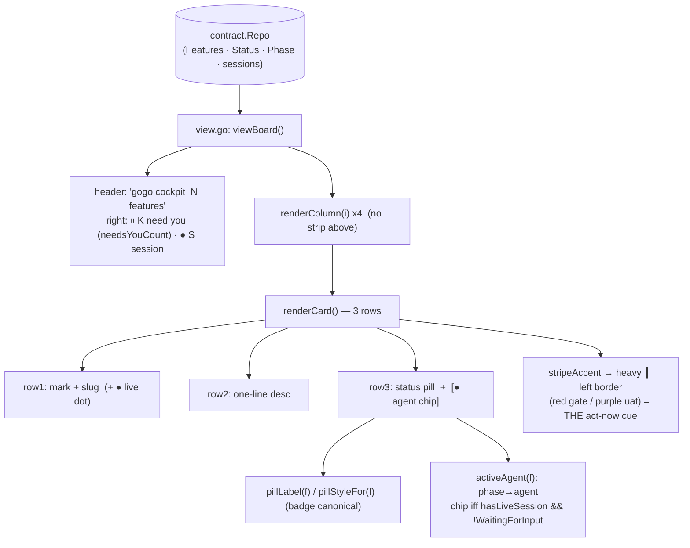

# Plan — cockpit-lean-cards

Status: **accepted** (user, 2026-07-14) · **as-built: shipped exactly as planned** (2026-07-14,
awaiting-uat) — all three verified divergences applied (dead `waitStyle` removed, `TestUATReplanGate`
removed, `TestBoardViewRenders` updated); review APPROVE (0 findings), test GREEN (0 findings). See
[report/report.md](report/report.md).

**Make the gogo terminal cockpit board leaner and more legible: each card should say
plainly WHAT STATE a ticket is in and WHO is working on it, with the left-border colour
as the *sole* "you need to act" cue.** We drop the heavy `⏸ NEEDS YOU` strip above the
board and the per-card phase dots `①②③④⑤`, keep the status pill, and add a small green
`● <agent>` chip that appears only when a live session is actively on the card. This is a
**presentation-only** change to `cli/internal/tui/` over the *same* `contract.Repo` the
board already reads — **no contract, classifier, skill, or pipeline-state change**. It
ships as **0.20.0**.

## Context — what exists today

The board renderer lives entirely in `cli/internal/tui/`. The `Model` (`model.go`) reads
a deterministic `*contract.Repo`, partitions features into four columns, and `view.go`
renders them. The current per-card anatomy (`renderCard`, view.go:300) is three rows:
`mark + slug (+ ● live dot)` · `one-line desc` · `status pill  +  phase dots ①②③④⑤`.

Two heavy elements were added in the 0.18.0/0.19.0 redesign (commit `662382f`) and are now
what the user wants gone:

- **The needs-you strip** — `renderNeedsYouStrip` (view.go:366) draws a red-bordered
  `⏸ NEEDS YOU (N)` inbox box *above* the board, one 3-4 line group per gate, with
  number-key `[1]…[9]` answering. Its supporting cast: `stripDegraded`, `numberedGates`,
  `stripHeight` (view.go), `stripBoxStyle` + `stripBg` + `waitStyle` (styles.go), the
  `gate`/`gateFor`/`gates()` enumerator (model.go), and `jumpToGate`/`gateNumberKey` +
  the number-key branch in `updateBoard` (update.go). `colAvail()` (window.go:45)
  currently subtracts `stripHeight()` from the column budget.
- **The per-card phase dots + bar** — `phaseDots`/`phaseDotsPlain` (view.go card rows),
  built from the shared `phaseProgress(f) [5]phaseState` vector (model.go) via
  `phaseIndex`/`phaseIndexFromStatus`/`phaseStyleFor`/`phaseGlyphs`, plus `phaseBar`
  (used only inside the strip). Styles: `phaseDoneStyle`/`phaseCurrentStyle`/
  `phasePendingStyle`/`pendingDot`.

**What already carries the signals we want to keep:**

| Signal | Where it lives (verified) | Keep? |
|---|---|---|
| Left-border colour cue | `stripeAccent` (model.go:534) → `gateBorder`/`gateStripe` (styles.go:83,91), applied in `renderCard` (view.go:354) | **Keep — becomes THE cue** |
| Status pill | `badge` → `pillLabel` / `pillStyleFor` (model.go), incl. the `⏸ re-planning · UAT N` case | **Keep** |
| Header counts | `attentionSummary` (view.go:76): `⏸ K need you` + `● S session` | **Keep** |
| Name-row `●` liveness dot | `renderCard` (view.go:321,336) | **Keep** |
| Gate predicates | `WaitingForInput()` / `WaitingForUser()` / `AwaitingUAT()` (contract.go) | **Keep (read-only)** |

The board already **decouples liveness from status** (`badge`'s long comment,
`TestRunningIsNotAStatus`): a green `●` says a tmux/claude session is live; the pill says
the true pipeline state. This plan builds directly on that decoupling.

## Functional requirements

- **FR-1 — Drop the needs-you strip.** Remove the `⏸ NEEDS YOU (N)` box above the board.
  Keep only the header count `⏸ K need you`.
- **FR-2 — Keep the session count.** The header keeps `● S session` (active sessions).
- **FR-3 — Left border is the gate cue.** A ticket that needs user input is marked *only*
  by the existing heavy `┃` left-border stripe (`stripeAccent`), now that the strip is
  gone. (Red for plan/decision gates, purple for the UAT gate — unchanged.)
- **FR-4 — Drop the phase dots.** Remove `①②③④⑤` from every card.
- **FR-5 — Show STATUS.** Keep the status pill (`pillLabel`/`pillStyleFor`/`badge`),
  driven by `state.md` / `events.jsonl` as today.
- **FR-6 — Show WHICH AGENT.** Show a short agent label derived from the current phase:
  `plan→analyst`, `implement→developer`, `review→reviewer`, `test→tester`,
  `report→reporter`.

## Settled decisions (confirmed with the user — not open questions)

- **D1 — Agent chip only when live.** The green `● <agent>` chip renders beside the
  status **only when** `hasLiveSession(f.Slug, m.sessions)` **AND** the card is not a
  user gate (`!f.WaitingForInput()`). An idle in-progress card shows the status pill
  alone. Labels are short and lowercase: `analyst` · `developer` · `reviewer` · `tester`
  · `reporter`.
- **D2 — Remove the `1..9` gate number-key shortcut.** Delete `jumpToGate`,
  `gateNumberKey`, the number-key branch in `updateBoard`, and the `1–N answer gate`
  text from the `showAllKeys` help line. The left border plus normal arrow navigation
  replaces it.

## Approach

**One idea: strip the two heavy elements, add one tiny helper.** No new abstraction —
the card loses two render calls and gains one; the header swaps one counter's data
source. Everything stays pure and substring-assertable (no TTY under `go test`).

### 1. Add `activeAgent(f *contract.Feature) string` (model.go)

A pure phase→agent map. **Nuance verified against the code:** `state.md`'s fifth phase is
labelled `knowledge`; `events.jsonl` labels it `report` (`contract.EventsPhase`,
contract.go:107). So `activeAgent` must map **both** `knowledge` and `report` →
`reporter`. `done`/`""`/unknown → `""` (no chip).

```
plan → analyst · implement → developer · review → reviewer · test → tester ·
knowledge|report → reporter · else → ""
```

Base the switch on `f.Phase`; when `f.Phase == ""` fall back to `f.Status`
(`implementing→developer`, `reviewing→reviewer`, `testing→tester`) so a live card whose
telemetry momentarily lags still names its agent. (This is a trivial 3-line fallback that
replaces the deleted `phaseIndexFromStatus`; the chip only ever shows on a live card, so
in practice `f.Phase` is set.)

> **Note — no dedicated `gogo-reporter` agent exists.** The repo's agent files are
> `gogo-analyst` / `gogo-developer` / `gogo-reviewer` / `gogo-tester`; the report phase is
> the `gogo-knowledge`/report step the orchestrator runs. `reporter` is therefore a
> **display label** for that phase, which is exactly what FR-6 asks for. No agent file is
> added or needed.

### 2. Rework `renderCard`'s third row (view.go)

Row 3 becomes `status pill  [  ● <agent> ]`. Replace the `phaseDots(f)` /
`phaseDotsPlain()` suffix with a conditional chip:

- Compute `chip` once: `activeAgent(f)` gated on `hasSession && !f.WaitingForInput()`.
- **Unfocused:** `pillStyleFor(f).Render(pillLabel(f))` + `"  " + sessionStyle.Render("● " + agent)` (green), matching the name-row dot's green treatment.
- **Focused:** the frame carries one fg+bg fill, so per-segment colour punches holes —
  render the chip as **plain** `"  ● " + agent` (same tactic the focused name-row dot
  and the old `phaseDotsPlain` used). Reserve the chip's rune width from the pill's
  truncation budget when a chip is present; give the pill the full width when it is not.

### 3. Header count → `needsYouCount()` (model.go, view.go)

`attentionSummary` (view.go:77) reads `len(m.gates())` today. Add a lightweight
`func (m Model) needsYouCount() int` that counts `f.WaitingForInput()` across all four
columns, and point `attentionSummary` at it. The rendered text (`⏸ K need you` /
`● S session`) is unchanged — only its data source. This removes the last non-test caller
of `gates()`.

### 4. Delete the dead code (verified confined to the tui package + its tests)

| Group | Symbols to remove | File |
|---|---|---|
| Strip render | `renderNeedsYouStrip`, `stripDegraded`, `numberedGates`, `stripHeight` + the `renderNeedsYouStrip` call in `viewBoard` | view.go |
| Strip styles | `stripBoxStyle`, `stripBg`, **`waitStyle`** | styles.go |
| Gate enumerator | `gate` struct, `gateFor`, `gates()` | model.go |
| Number keys | `jumpToGate`, `gateNumberKey`, the number-key branch in `updateBoard`, the `1–N answer gate` help text | update.go, view.go |
| Phase display | `phaseDots`, `phaseDotsPlain`, `phaseBar`, `phaseProgress`, `phaseGlyphs`, `phaseState` + its consts, `phaseIndex`, `phaseIndexFromStatus`, `phaseStyleFor` | model.go |
| Phase styles | `phaseDoneStyle`, `phaseCurrentStyle`, `phasePendingStyle`, `pendingDot` | styles.go |
| Window math | `colAvail()` stops subtracting `stripHeight()` → `return m.height - 5` | window.go |

**Kept because still used:** `stripeAccent`, `gateBorder`, `gateStripe`, `badge`,
`pillLabel`, `pillStyleFor`, the pill styles (`pillRed/pillAmber/pillPurple/pillDim`),
`isUATReplan`/`uatRound` (feed `pillLabel`'s re-planning wording), `attentionSummary`,
`sessionStyle`, `secondaryStyle`/`faintStyle` (changelog list), and the name-row `●`.

### Divergences from the brief's dead-code map (found while verifying)

The brief's map is accurate; verifying it against the tree surfaced **three additions**:

1. **`waitStyle` (styles.go:108) also becomes dead.** It is used *only* by
   `renderNeedsYouStrip` (its two `NEEDS YOU` titles). Remove it with the strip. *(Not in
   the brief's list.)*
2. **`TestUATReplanGate` (redesign_test.go:266) must also go.** It exercises `gateFor`,
   which is being deleted. The re-plan distinction it protected is **still covered** by
   `TestPillLabel`'s `⏸ re-planning · UAT 2` case (kept) — the pill, not a gate row, now
   carries that wording. *(Brief listed `TestGatesEnumeration` but not this one.)*
3. **`TestBoardViewRenders` (tui_test.go:47) must be updated.** It asserts the board
   contains `①②③④⑤` and `⏸ NEEDS YOU (1)` — both removed. Swap those two `want`s for the
   surviving markers (`⏸ 1 need you` header pill) and, ideally, a negative assertion that
   no `①` dot remains. *(Not in the brief's list.)*

### Alternatives considered

- **Keep the strip but collapse it to one line.** Rejected — the user explicitly wants
  the strip gone; the header `⏸ K need you` + the left border already carry the signal.
- **Colour the whole card border for gates instead of the left stripe.** Rejected — the
  heavy `┃` left stripe already exists, is focus-independent, and is substring-assertable
  (`gateStripe`); reusing it is the minimal change.
- **Fold the agent into the pill text (e.g. `implement · developer`).** Rejected — D1
  wants a separate *green* chip that is present only when live, so it reads as a distinct
  "who's on it right now" signal, not part of the status.

## Changes checklist (build order)

1. **model.go** — add `activeAgent(f)` + `needsYouCount()`; delete `gate`/`gateFor`/
   `gates()`, `phaseState`+consts, `phaseGlyphs`, `phaseIndex`, `phaseIndexFromStatus`,
   `phaseProgress`, `phaseStyleFor`, `phaseDots`, `phaseDotsPlain`, `phaseBar`.
2. **styles.go** — delete `phaseDoneStyle`/`phaseCurrentStyle`/`phasePendingStyle`,
   `pendingDot`, `stripBoxStyle`, `stripBg`, `waitStyle`.
3. **view.go** — rewrite `renderCard` row 3 (pill + conditional agent chip, drop dots);
   point `attentionSummary` at `needsYouCount()`; delete `renderNeedsYouStrip`,
   `stripDegraded`, `numberedGates`, `stripHeight` and the strip append in `viewBoard`;
   drop `1–N answer gate` from the `showAllKeys` line.
4. **update.go** — delete the number-key branch in `updateBoard`, `gateNumberKey`,
   `jumpToGate`.
5. **window.go** — `colAvail()` → `return m.height - 5`.
6. **Tests** — see below.
7. **`.claude-plugin/plugin.json`** — bump `version` `0.19.0` → `0.20.0` (behavioural
   change, per `analysis.md` step 7).

## Tests (all at the pure `go test ./...` level — no TTY)

**Remove** (their subjects are deleted): `TestPhaseProgressVector`,
`TestPhaseDotsAndBarPlainText`, `TestGatesEnumeration`, `TestNeedsYouStripRender`,
`TestNumberKeyReadsGate`, `TestNumberKeyOutOfRange`, `TestGateNumberKeyParse`,
`TestUATReplanGate` (redesign_test.go).

**Update:**
- `TestBoardViewRenders` (tui_test.go) — drop the `①②③④⑤` and `⏸ NEEDS YOU (1)` wants;
  assert `⏸ 1 need you` remains and (negative) no `①`.
- Window integration tests, re-tuned now that `colAvail = height - 5` (no strip):
  `smallBoard` (`WindowSizeMsg` Height `20 → 13` → `colAvail 8`, plan column still windows
  to one 5-row card + `↓`); `TestColumnWindowIndicatorsAndHint` (`m.height 20 → 13`);
  `TestChangelogOverflowBrowseHint` (`m.height 9 → 7` → `colAvail 2`). Strip-row comments
  in those tests get removed.

**Keep (still valid):** `TestPillLabel` (incl. the re-planning case), `TestStripeAccentGatesOnly`,
`TestGateCardStripeGlyph`, `TestHeaderAttentionSummary`, `TestContextualFooterChips`,
`TestAllKeysToggle`, `TestShippedNeverRunning`, `TestRunningIsNotAStatus`, `TestUATRound`,
`TestChangelogFocusCursor`, `TestWaitingCardCue`, `TestBadgeAwaitingPlanAcceptance`,
`TestAwaitingUATBadgeStyled`, `TestColumnSeparatorRendered`, and the pure windowing math.

**Add:**
- `TestActiveAgent` — the phase→agent map incl. `knowledge`/`report` → `reporter`,
  `done`/`""` → `""`, and the status fallback.
- `TestAgentChipOnlyWhenLive` — a live in-progress card renders `● developer`; the same
  card with no session, and a live *gate* card (`WaitingForInput()`), render **no** chip.
- `TestNoPhaseDots` — a rendered card contains none of `①②③④⑤`.
- `TestNoNeedsYouStrip` — `m.View()` contains no `NEEDS YOU` box (only the header pill).

**Verification (for `/gogo:go`):** `go build/test/vet ./...` + `gofmt`; render the real
board via a throwaway harness and confirm — no strip; header reads
`⏸ K need you · ● S session`; gate cards carry the left border; no `①②③④⑤`; a live
in-progress card shows `● <agent>` and an idle one does not.

## Out of scope

- Any change to `contract`, the classifier, the skills/agents, or pipeline state.
- The changelog collapsed-list, the contextual footer, the drill/viewer/peek paths, and
  the four-column layout (untouched beyond the `colAvail` height math).
- New agent files or a real `gogo-reporter` — `reporter` stays a display label.
- The in-tree uncommitted changelog-focus-cursor change (0.19.0+) — independent; this
  work simply ships on top of it as 0.20.0.

## Intended design

The as-is baseline is `charts/before/flow.mmd`; the intended (after) render flow is
`charts/flow.mmd`. Both are rendered by `/gogo:view cockpit-lean-cards:plan`.



## Summary (TL;DR)

- **What:** a leaner gogo cockpit board — drop the `⏸ NEEDS YOU` strip and the per-card
  phase dots `①②③④⑤`; keep the status pill; add a green `● <agent>` chip that shows
  **only when a live session is on the card and it isn't a gate**.
- **Why:** each card should read at a glance — *what state* it's in (pill) and *who's on
  it now* (chip) — with the **left border as the sole "act now" cue** (FR-1..FR-6).
- **How:** presentation-only in `cli/internal/tui/`, over the *same* `contract.Repo` — add
  `activeAgent` + `needsYouCount`, rewrite `renderCard` row 3, and delete the strip /
  phase-dot / number-key clusters (incl. the newly-found dead `waitStyle`). Two settled
  forks folded in: **agent chip only when live** (D1) and **remove the `1..9` number-key
  shortcut** (D2). No contract/skill/state change.
- **Verified drift:** `waitStyle` also dies; `TestUATReplanGate` + `TestBoardViewRenders`
  need removing/updating; window tests re-tune to `colAvail = height - 5`; there is no
  `gogo-reporter` agent — `reporter` is a display label.
- **Next:** ships as **0.20.0**. On acceptance, `/gogo:go` runs ②→⑤.
