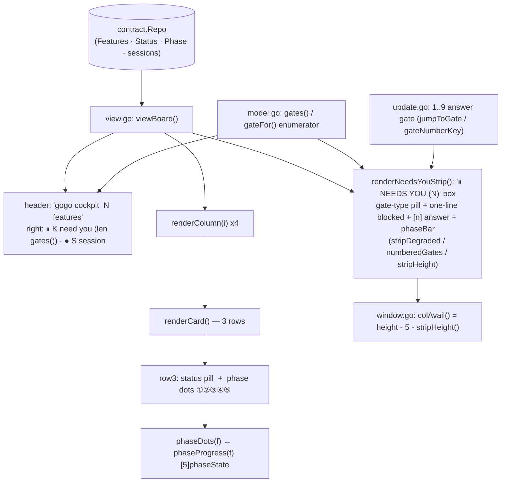
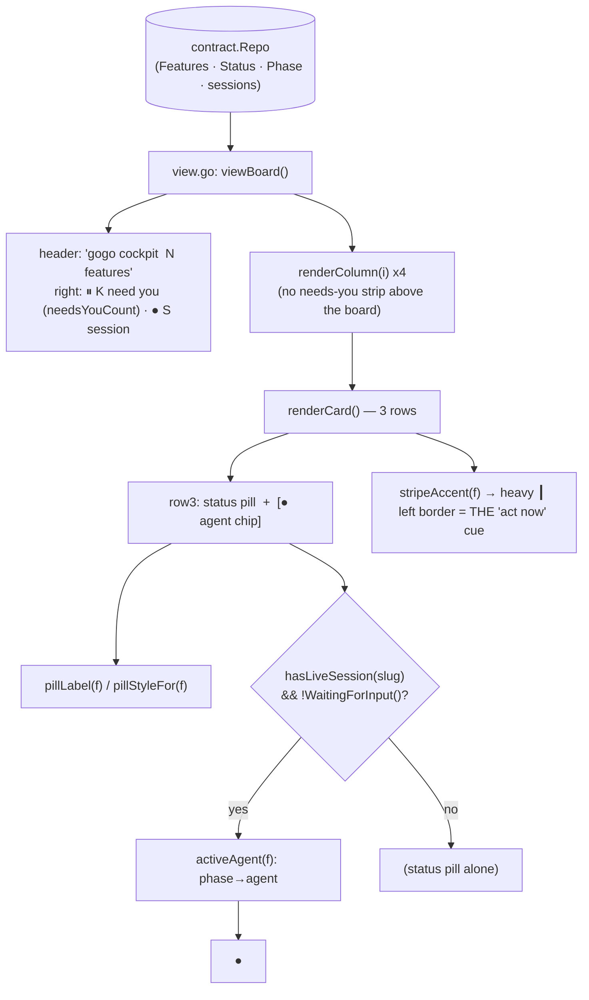

# Report — feature `cockpit-lean-cards`

- **feature:** Lean cockpit cards — drop the needs-you strip + phase dots, keep the status pill, add a live-only agent chip
- **status:** awaiting-uat
- **completed:** 2026-07-14
- **branch / commits:** main | working tree (uncommitted)

## Run status / gaps

All five phases completed — plan ①, implement ② (run in-context by the orchestrator), review ③, test ④, report ⑤ — **with no open issues**. Review round 1 was **APPROVE** (0 findings); test round 1 was **GREEN** (0 findings). Build gates are green: `gofmt -l` clean, `go vet ./...` clean, `go build ./...` OK, `go test -race -count=1 ./...` green across all 9 packages.

## Summary

The gogo terminal **cockpit board** is now leaner and more legible. Each card reads at a glance: **what state** a ticket is in (the status pill) and **who is on it right now** (a green `● <agent>` chip that appears only when a live session is on a non-gate card). The heavy `┃` **left border is now the single "act now" cue**. This removed the `⏸ NEEDS YOU` inbox strip and the per-card `①②③④⑤` phase dots that the 0.18.0 redesign had added, plus the `1..9` gate number-key shortcut. The change is **presentation-only**, over the **same `contract.Repo`** the board already reads — no contract, classifier, skill, or pipeline-state change. Ships as **0.20.0**.

## Planned vs shipped

**Shipped exactly as the accepted plan** — including all three "divergences" the plan had flagged while verifying its own dead-code map: the now-dead `waitStyle` was removed, `TestUATReplanGate` was deleted (it exercised the removed `gateFor`), and `TestBoardViewRenders` was updated (it asserted the removed dots + strip). No behaviour was added, dropped, or changed during implementation; no new forks arose in implement / review / test.

## Implementation

The board renderer lives entirely in `cli/internal/tui/`. The change strips two heavy elements and adds one small helper, keeping everything pure and substring-assertable (no TTY under `go test`).

- **Card row 3 is now `status pill [+ agent chip]`.** `renderCard` computes the chip once — `agent := activeAgent(f)`, gated on `hasSession && !f.WaitingForInput()` — and renders it **green** on an unfocused card (`sessionStyle.Render("● "+agent)`) or **plain** on a focused card (the focus frame carries one fg+bg fill, so a colored chip would punch a hole; the chip's rune width is reserved from the pill's truncation budget, and the pill gets the full width when there is no chip).
- **`activeAgent(f)`** is a pure phase→agent map: `plan→analyst`, `implement→developer`, `review→reviewer`, `test→tester`, `knowledge|report→reporter` (state.md's fifth phase is `knowledge`; events.jsonl labels it `report` — both mean the report step), `done`/unknown → `""`. When `f.Phase` is empty it falls back to the status (`implementing→developer`, etc.) so a live card whose telemetry momentarily lags still names its agent. `reporter` is a **display label** — there is no `gogo-reporter` agent file, and none was added.
- **The header `⏸ K need you` count** now reads a new `needsYouCount()` (counts `WaitingForInput()` across all four columns) instead of `len(gates())`.
- **The left-border stripe** (`stripeAccent` → the heavy `┃` `gateBorder`, red for plan/decision gates, purple for the UAT gate) is unchanged and becomes the sole per-card "act now" cue now that the strip is gone.

**Deleted clusters** (all confined to the `tui` package + its tests): the strip render + its helpers, the phase-display vector and its renderers, the gate enumerator, and the number-key handling — see the table.

### Changes (as-built)

| File | Change | Note |
|---|---|---|
| `cli/internal/tui/model.go` | modified | **+`activeAgent(f)`**, **+`needsYouCount()`**; **−** the phase-progress vector cluster (`phaseState`+consts, `phaseGlyphs`, `phaseIndex`, `phaseIndexFromStatus`, `phaseProgress`, `phaseStyleFor`, `phaseDots`, `phaseDotsPlain`, `phaseBar`) and the gate enumerator (`gate` struct, `gates()`, `gateFor`) |
| `cli/internal/tui/view.go` | modified | `renderCard` row 3 → pill + conditional agent chip (dots dropped); `attentionSummary` now reads `needsYouCount()`; **−** `renderNeedsYouStrip`/`numberedGates`/`stripDegraded`/`stripHeight` + the strip append in `viewBoard`; dropped `1–N answer gate` from the `?` full-key line |
| `cli/internal/tui/update.go` | modified | **−** the number-key branch in `updateBoard`, `gateNumberKey`, `jumpToGate` |
| `cli/internal/tui/window.go` | modified | `colAvail()` → `m.height - 5` (no longer subtracts the removed `stripHeight()`) |
| `cli/internal/tui/styles.go` | modified | **−** `pendingDot`, `phaseDoneStyle`/`phaseCurrentStyle`/`phasePendingStyle`, `stripBoxStyle`, `stripBg`, `waitStyle` |
| `cli/internal/tui/redesign_test.go` | modified | **−** the 8 phase/gate/number-key tests; **+** `TestActiveAgent`, `TestAgentChipOnlyWhenLive`, `TestNoPhaseDots`, `TestNoNeedsYouStrip` |
| `cli/internal/tui/tui_test.go` | modified | `TestBoardViewRenders`: drop the `①②③④⑤` + `⏸ NEEDS YOU (1)` wants; assert `⏸ 1 need you` and (negative) no dots / no `NEEDS YOU` |
| `cli/internal/tui/window_test.go` | modified | retune window heights (`smallBoard`/`TestColumnWindowIndicatorsAndHint` 20→13, `TestChangelogOverflowBrowseHint` 9→7) for `colAvail = height − 5` |
| `.claude-plugin/plugin.json` | modified | `version` 0.19.0 → **0.20.0** |

## Decisions & rationale

Both forks were **pre-confirmed with the user during planning** (settled, not opened this run). See [decisions.md](../decisions.md).

| Decision | Choice | Reason |
|---|---|---|
| **D1 — agent chip only when live** | Render the green `● <agent>` chip **only** when `hasLiveSession(slug) && !f.WaitingForInput()`; an idle or gate card shows the status pill alone | The chip is a distinct **"who's on it right now"** signal, separate from the status pill; nobody is "on" a card parked on the user, so gate cards suppress it |
| **D2 — remove the `1..9` gate number-key** | Delete `jumpToGate`, `gateNumberKey`, the number-key branch, and the `1–N answer gate` help text | The left-border stripe plus normal arrow navigation replace the shortcut, so the strip's only unique affordance is retired with it |

No decisions arose during implement / review / test — the run was clean end to end.

## Review outcome

**Round 1 — CLEAN / APPROVE, 0 findings.** The fresh-eyes `gogo-reviewer` re-ran the build gates green and verified: the `activeAgent` map (incl. `knowledge`/`report`→`reporter` and the empty-phase status fallback), the chip gating against D1, the focused-card width reservation (badge line ≤ `width`, no panic on a negative `truncate` max), the byte-for-byte equivalence of `needsYouCount()` to the old `len(m.gates())`, dead-code completeness (no dangling reference to any deleted symbol; nothing kept is now dead), and the `colAvail` retune. See [review-01.md](../review-01.md) / [review/issues.json](../review/issues.json).

## Test outcome

**Round 1 — GREEN, 0 findings.** Levels exercised:

- **Automated:** `gofmt -l` clean · `go vet ./...` clean · `go build ./...` OK · `go test -race -count=1 ./...` green (9 packages). The 4 new tests pass; the 8 removed tests are gone; every deleted symbol is absent from `internal/tui/*.go`.
- **Hands-on (no-TTY render, the level this package is designed around):** confirmed no `⏸ NEEDS YOU` strip; header reads `⏸ 1 need you · ● 1 session`; the gate card carries the heavy `┃` left border on every row; no `①②③④⑤` anywhere; a live in-progress card shows `● reviewer` while the same card with no session shows only `review r2`; a live **gate** card shows **no** chip (D1 suppression); the `?` full-key line no longer contains `1–N answer gate`.

A real-binary/TTY tmux drive was not attempted — a non-blocker for a static-render-only change with no new key/async wiring, per `test-strategy.md`'s Go-TUI section. See [test-01.md](../test-01.md) / [test/issues.json](../test/issues.json).

## Diagrams

The as-built **flow** — open [diagrams.html](./diagrams.html) (same folder). One diagram carries the signal here: the board render path (`viewBoard → renderColumn ×4 → renderCard`, and the `renderCard` row-3 chip gate). This is a presentation-only render change — **no new types** (so no class diagram), **no new runtime interaction** (no sequence), and **no new status transitions** (no activity/state diagram), so `flow` is the only kind drawn.

- `report/flow.mmd` — Lean board render flow (as-built): no strip, no phase dots; row 3 = status pill + live-only agent chip; left border = the gate cue.

## Before / after comparison

The plan captured an as-is baseline (`report/before/flow.mmd`), so the two render flows compare side by side. Only the **flow** kind exists in each; no kind was added or removed.

**Before — the 0.18.0 board render flow:**

**After — the 0.20.0 lean board render flow:**

**What changed:** the `renderNeedsYouStrip` box and its whole support cast (`gates()`/`gateFor`, the `phaseBar`, `stripDegraded`/`numberedGates`/`stripHeight`) and the `1..9` number-key path are **gone**; `colAvail` no longer subtracts a strip height; the per-card `phaseDots` (`phaseProgress` vector) is **replaced** by a conditional `activeAgent` chip gated on live-session-and-not-a-gate; the header count moves from `len(gates())` to `needsYouCount()`; the left-border `stripeAccent` is unchanged and is now the sole act-now cue.

## Knowledge updates

- **`.gogo/knowledge/project-knowledge.md`** (proxy) — appended a **0.20.0 milestone** bullet under `## gogo overrides` (a gogo-authored region; the proxied `Source: ../../README.md` was not touched) recording that lean-cards supersedes the 0.18.0 strip + phase dots + number-keys and adds the live-only agent chip.
- **Consider upstreaming:** the project `README.md` maintains its own milestone/version history; you may want to add a one-line 0.20.0 note there. gogo did not edit the README (proxied source).

No other knowledge file drifted (this is an internal CLI-UI change; review/test standards and NFRs were unaffected).

## Follow-ups & known limitations

- **TTY drive deferred (non-blocker):** a real-binary tmux/TTY drive of the board was not run this round; the change is static-render-only with no new key or async wiring, so the no-TTY render exercise is the level this package asserts at.
- **Independent in-tree change ships alongside:** the pre-existing, uncommitted **changelog focus-cursor** change (the collapsed-changelog `▸` selection bar) is out of scope for this feature but ships in the same 0.20.0 working tree.

## Summary (TL;DR)

- **What shipped:** a leaner gogo cockpit board — the `⏸ NEEDS YOU` strip and per-card `①②③④⑤` phase dots are gone, the `1..9` number-key shortcut is retired, the status pill stays, and a green `● <agent>` chip shows **only** when a live session is on a **non-gate** card; the left border is the sole "act now" cue. Presentation-only, same `contract.Repo`, **0.20.0**.
- **Review verdict:** CLEAN / APPROVE — 0 findings.
- **Test verdict:** GREEN — 0 findings (automated suites + hands-on render both pass).
- **Follow-ups:** TTY drive deferred (non-blocker); the independent changelog focus-cursor change rides along in 0.20.0. See **Follow-ups & known limitations** above.
