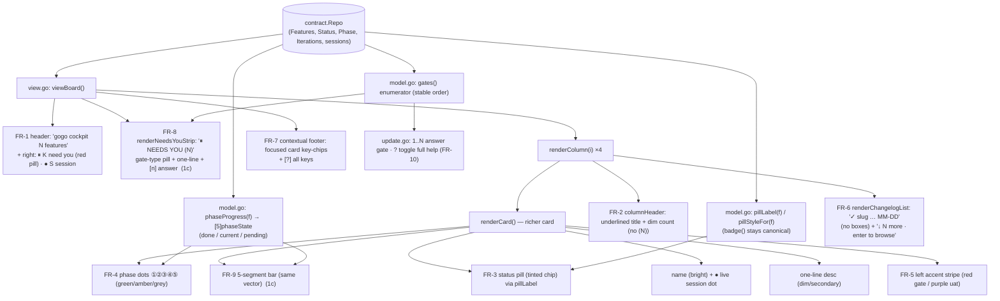

# Plan — cockpit-redesign

Status: **as-built** — shipped @0.18.0, awaiting UAT. Implemented as planned (FR-1..FR-10,
D1→B/D2→A/D3→A). One concretization within D2→A: the compact **dots ①②③④⑤** render on every
board card (dense board) and the **segmented bar** renders on the roomy **needs-you strip** gate
rows ("bars where space allows"). Number key = focus + read plan/report (FR-10's "route its
primary action"). See `report/report.md`.

**Restyle the gogo terminal cockpit (`cli/internal/tui/`) so the live board is
*visibly, obviously* the Claude-Design mockup** — not a token diff. The palette is
already correct in `styles.go`; the real work is **structural layout + new per-card
elements**: status pills, phase dots `①②③④⑤`, left-border accent stripes, a
collapsed changelog, a header attention summary, a contextual footer, and a
top **needs-you inbox strip** with number-key answering. Ships as **two slices** —
**1b (refined board)** then **1c (needs-you strip)** — over the *same*
`contract.Repo` the board already reads. **No contract change, no new pipeline
state.**

---

## Goal

Make `gogo` (the terminal cockpit) render the **1b + 1c** variants of the
*Gogo Cockpit* Claude-Design mockup. The acceptance signal is a **side-by-side of
the live TUI against the mockup**: pills, phase dots, the left-stripe accents, the
collapsed changelog, the header summary, the contextual footer, and (1c) the
needs-you strip must all be present and match. A token/palette diff is **not** the
test — the previous attempt changed only colors that were already correct and
produced *no visible change*.

## Context — what exists today (code = source of truth)

The cockpit is a Bubble Tea 4-column kanban (`plan | in progress | ready |
changelog`) over the deterministic `contract` reader. The render path is small and
well-factored:

| Concern | Where |
|---|---|
| Board frame (header, columns, status, help) | `view.go` `viewBoard` |
| One column (header + windowed cards + overflow) | `view.go` `renderColumn`, `columnHeader` |
| One card (name/●, title, badge) | `view.go` `renderCard` |
| Badge text + waiting cue | `view.go` `cardBadgeText`, `model.go` `badge()` |
| Waiting/UAT accent pick | `view.go` `badgeStyleFor` |
| Tokens + precomputed styles | `styles.go` |
| Column titles / phase-round text | `model.go` `columnTitles`, `phaseRound` |
| Board key handling | `update.go` `updateBoard`, `updateFilter` |
| Vertical windowing math | `window.go` |

**The data the redesign needs is already on `contract.Feature`:** `Phase`,
`Status`, `Iterations` (→ `RoundFor(phase)`), `Column()`, `WaitingForInput()`,
`WaitingForUser()`, `AwaitingUAT()`, plus live `m.sessions`. The **palette is
already present** in `styles.go` (blue `#7aa8ff`, amber `#e6a14a`, green `#5db97a`,
red `#ff6b6b`, purple `#b392f0`, session `#57d977`, and the focus/subtle/dim
tokens). The design-spec (`design/design-spec.md`) is the authoritative distillation
of the mockup and maps every delta to the file it lives in — this plan follows it.

**Why the last attempt failed:** it "ported the palette," but the palette was
never the gap. The gap is **layout and new elements**. Every delta below is
structural or a new glyph/element, verified against the current renderer.

## Functional requirements

The redesign is **two shippable slices**. Recommended sequencing is **1b first**
(fast visible win) then **1c** — recorded as **D1** for you to confirm at the gate.

### Slice 1b — refined board (deltas 1-7)

- **FR-1 · Header attention summary.** The header keeps `gogo cockpit  N features`
  (left) and **adds a right-aligned attention summary**: a red **`⏸ K need you`**
  pill (tinted-bg chip) shown only when `K>0`, then **`● S session`** in green.
  `K` = count of `WaitingForInput()` cards across all columns; `S` = live session
  count (`len(m.sessions)`).
- **FR-2 · Column header restyle.** Replace `plan (3)` / `▸ plan (3)` with an
  **accent-colored, underlined title + a trailing dim count** (no `(N)`
  parentheses). Keep a focus indicator for the active column.
- **FR-3 · Status pills.** The plain-text badge becomes a **tinted-bg chip**
  (colored text on a faint accent background). Values map from the existing
  `badge()`: `⏸ accept plan` (red), `implement r1` / `review r2` (amber),
  `⏸ awaiting-uat` (purple), `running` (session green). `badge()` stays the
  canonical status producer; a new **`pillLabel(f)`** transform maps it to the
  chip's display text so `badge()`'s existing tests stay green.
- **FR-4 · Phase dots `①②③④⑤`** (the headline new element). Each card shows five
  glyphs, one per phase (plan/implement/review/test/report), colored **green =
  done, amber = current, grey = pending**, derived from the feature's `Phase` +
  round. A single new **`phaseProgress(f) [5]phaseState`** function is the source
  of truth (see D2); the dots render it.
- **FR-5 · Left-border accent stripe.** A card that needs you gets a **3-wide left
  accent stripe** — **red** for a plan/decision gate, **purple** for the UAT gate —
  **independent of focus** (a focused gate card keeps both). A flowing card has no
  stripe.
- **FR-6 · Collapsed changelog column.** The changelog column (`i==3`) renders as a
  **plain list, not cards**: `✓ slug…` (secondary) left + `MM-DD` (faint) right,
  no boxes, with overflow shown as **`↓ N more · enter to browse`**.
- **FR-7 · Contextual footer.** Replace the static help line with the **focused
  card's applicable actions** as key-chips (e.g. `[l] peek [a] attach [enter] drill
  [w] web`), a live card leading with green `●`, and **`[?] all keys`**
  right-aligned. The full key list moves behind **`?`** (FR-10).

### Slice 1c — needs-you strip (deltas 8-10)

- **FR-8 · Needs-you inbox strip.** A red-bordered box **`⏸ NEEDS YOU (N)`** above
  the board, one row-group per `WaitingForInput()` gate: a **gate-type pill**
  (`plan gate` red / `uat gate` purple / decision gate red), the feature name + a
  one-line "what's blocked," and a **number-key affordance** (`[1] read plan · [m]
  accept`, `[2] read report · [d] ship`). **Gates ALSO remain in their columns** —
  the strip is a shortcut, not a move (**D3**).
- **FR-9 · Segmented phase bars.** Cards carry a **5-segment progress bar** (one
  segment per phase, same color semantics as the dots) rendering the *same*
  `phaseProgress(f)` vector as FR-4. Dots vs bars density choice is **D2**.
- **FR-10 · Number keys + `?` toggle.** In board mode, **`1`..`N` jump to / answer
  gate N** from the strip (focus the card, or route its primary action). **`?`**
  toggles the full key list (the pre-redesign long help line).

### Non-functional (unchanged bars)

- **No contract change, no new pipeline state.** Reads the same `contract.Repo`.
  The CLI stays a deterministic, LLM-free reader that never mutates pipeline state.
- **Substring-assertable under `go test`** (no TTY → lipgloss emits plain text): new
  elements must be plain-text assertable (pill text, dot glyphs, strip contents).
- **Graceful degradation on short terminals** (D3): the strip + board must fit
  typical terminals; when too short, degrade (collapse the strip to a summary line
  / window it) rather than overflow — reuse the `window.go` pattern.
- **Version bump**: a `cli/` visual+behavioural change → bump
  `.claude-plugin/plugin.json` **and** `cli/main.go` `Version` **together** to
  **0.18.0** (1c would be 0.19.0 if shipped separately — depends on D1).

### BDD scenarios (gherkin)

```gherkin
Feature: Refined cockpit board (Slice 1b)

  Background:
    Given a repo with features across plan / in progress / ready / changelog
    And the board is rendered at a normal terminal size

  Scenario: Header shows the attention summary (FR-1)
    Given 2 features are WaitingForInput() and 1 has a live session
    When the board renders
    Then the header shows a red "⏸ 2 need you" pill
    And it shows "● 1 session" in green

  Scenario: Status pill replaces the plain badge (FR-3)
    Given an in-progress feature in phase review round 2
    When its card renders
    Then the card shows a "review r2" pill (amber, tinted background)
    And a plan-pending card shows a red "⏸ accept plan" pill

  Scenario: Phase dots reflect the feature's phase (FR-4)
    Given a feature whose phase is "review"
    When its card renders
    Then dots ① and ② are green (done)
    And dot ③ is amber (current)
    And dots ④ and ⑤ are grey (pending)

  Scenario: Gate cards carry a left accent stripe independent of focus (FR-5)
    Given an awaiting-plan-acceptance card that is NOT focused
    Then its card shows the red left accent stripe
    Given an awaiting-uat card
    Then its card shows the purple left accent stripe

  Scenario: Changelog column collapses to a list (FR-6)
    When the changelog column renders
    Then shipped features appear as "✓ slug … MM-DD" rows without card boxes
    And overflow appears as "↓ N more · enter to browse"

  Scenario: Footer shows the focused card's keys (FR-7)
    Given a focused card with a live session
    Then the footer leads with a green "●" and shows its action key-chips
    And it shows "[?] all keys" right-aligned

Feature: Needs-you strip (Slice 1c)

  Scenario: Gates surface in the inbox strip (FR-8)
    Given a plan gate and a uat gate exist
    When the board renders
    Then a "⏸ NEEDS YOU (2)" strip appears above the board
    And gate 1 shows a red "plan gate" pill with "[1] read plan · [m] accept"
    And gate 2 shows a purple "uat gate" pill with "[2] read report · [d] ship"
    And both gates ALSO still appear in their columns below

  Scenario: A number key answers a gate (FR-10)
    Given the needs-you strip lists 2 gates
    When the user presses "1"
    Then focus jumps to gate 1's card (its primary action is available)

  Scenario: "?" toggles the full key list (FR-10)
    Given the contextual footer is showing
    When the user presses "?"
    Then the full key list is shown
    And pressing "?" again hides it
```

## Approach (recommended) — one shared model, two presentation layers

**Do it as a presentation-only refactor of the existing render path**, adding small
pure helpers and keeping every element **substring-assertable**. Two ideas keep the
diff clean and testable:

1. **One phase-progress model, two renderers.** Add a single
   **`phaseProgress(f *contract.Feature) [5]phaseState`** (in `model.go`) that maps
   `Phase` + `RoundFor` + gate/terminal status to a 5-slot `done|current|pending`
   vector. **FR-4 dots and FR-9 bars are two thin renderers over this one vector** —
   so D2 ("dots and/or bars") is a *rendering* choice, not two code paths.
2. **`badge()` stays canonical; a `pillLabel()` transform drives the chip.** Keep
   `badge()` returning the status string (drill panel + status line + its tests
   depend on it) and add **`pillLabel(f)` / `pillStyleFor(f)`** for the chip text +
   tinted style. This preserves `TestBadgeAwaitingPlanAcceptance` while the visible
   card changes.

**Slice 1b** touches `styles.go` (add faint `#262b36`/`#5f6572`, secondary
`#b7bdc9`, strip bg `#171b24`; add pill / phase-dot / left-stripe styles) and
`view.go` (`viewBoard` header summary + footer, `columnHeader` restyle, `renderCard`
pill + dots + stripe, a **`renderChangelogList`** branch for `i==3`), plus the
`phaseProgress`/`pillLabel` helpers in `model.go`. **Slice 1c** adds a
**`renderNeedsYouStrip`** to `view.go`, a **`gates()` enumerator** + segmented-bar
renderer, and **number-key + `?` handling** in `update.go`.

The **left stripe** is built with lipgloss `BorderLeft(true)` + a colored
`BorderForeground` on a border-only-left style (or a literal 1-cell accent column
prepended to the card body) — chosen to survive the focused-card full highlight
without punching a background hole (the existing `cardFocused` note in `renderCard`
warns about per-segment backgrounds).

### Alternatives considered

- **Recolor-only port (the failed attempt).** Rejected — the palette is already
  correct; it changes nothing visible. This is the whole reason for the plan.
- **One big feature (1b+1c together).** Viable, but a bigger unaccepted diff and a
  slower first visible result. Recommended instead: **1b first** to rebuild trust
  fast, then 1c (**D1**).
- **Dots XOR bars (pick one).** Rejected as a hard either/or; instead **one shared
  `phaseProgress` vector, two renderers** — dots as the dense-board default, bars as
  1c's flavor (**D2**), so we keep both cheaply.
- **Move gates out of their columns into the strip.** Rejected — the strip is a
  **shortcut, not a move** (**D3**); a gate staying in its column preserves the
  spatial model and the existing column navigation/tests.

## Intended design (render flow)

How the redesigned board renders — the new pure helpers (`phaseProgress`,
`pillLabel`, `gates`) feed the new elements, over the *same* `contract.Repo`.
The as-is "before" flow is in `charts/before/flow.mmd`.



## Changes checklist (build order)

**Slice 1b**
1. `styles.go` — add tokens (faint `#262b36`, faint-date `#5f6572`, secondary
   `#b7bdc9`, strip bg `#171b24`, pending-dot grey) as adaptive colors; add
   precomputed **pill** styles (per accent, tinted bg), **phase-dot** styles
   (done/current/pending), and the **left-stripe** style.
2. `model.go` — add **`phaseProgress(f) [5]phaseState`** and
   **`pillLabel(f)` / `pillStyleFor(f)`**; keep `badge()` unchanged.
3. `view.go` — `viewBoard`: header attention summary (FR-1) + contextual footer
   (FR-7); `columnHeader`: underlined title + dim count (FR-2); `renderCard`: pill
   (FR-3) + phase dots (FR-4) + left stripe (FR-5); add **`renderChangelogList`**
   for the `i==3` column (FR-6).
4. Version: bump `.claude-plugin/plugin.json` + `cli/main.go` `Version` → **0.18.0**.

**Slice 1c**
5. `model.go` — add a **`gates()`** enumerator (stable-ordered `WaitingForInput()`
   cards + their gate type + primary action).
6. `view.go` — **`renderNeedsYouStrip`** (FR-8) rendered above the board in
   `viewBoard`; segmented-bar renderer over `phaseProgress` (FR-9); 1c footer.
7. `update.go` — `updateBoard`: **`1`..`N`** gate answering + **`?`** full-help
   toggle (FR-10); a `showAllKeys bool` on the Model.
8. `window.go` / `viewBoard` — account for the strip's height in `colAvail`; degrade
   the strip when the terminal is short (**D3**).
9. Version: → **0.19.0** if 1c ships as its own release (else folded into 1b's
   0.18.0 — depends on **D1**).

## Tests — what changes, at which level

All board render is unit-tested **without a TTY** (lipgloss → plain text), so tests
assert plain-text substrings. The redesign changes rendered substrings, so:

**Existing tests to update**
- `tui_test.go` `TestBoardViewRenders` — asserts `"plan (3)"`, `"in progress (1)"`,
  `"ready (2)"`, `"changelog (3)"`. FR-2 drops the `(N)` form → update to the new
  underlined-title + dim-count substrings (`"plan"` + count).
- `tui_test.go` `TestSessionIndicatorOnCard` — asserts `"● session"` on the card.
  FR-1/FR-3 move the live cue to a card `●` + header `● S session` → update to
  assert the new placement (`●` on the card, `session` in the header summary).
- `waiting_test.go` `TestWaitingCardCue` — asserts `waitingMarker` (⏸) + the
  `"awaiting-plan-acceptance"` text. FR-3 folds ⏸ into the pill and `pillLabel`
  may read `"accept plan"` → keep ⏸ in the pill and update the text assertion.
- `waiting_test.go` `TestBadgeAwaitingPlanAcceptance` — **stays green** (we keep
  `badge()` canonical; the pill transform is separate).
- `waiting_test.go` `TestColumnSeparatorRendered` — column rules stay in 1b →
  **stays green** (verify the collapsed changelog still sits in a bounded column).
- `window_test.go` overflow tests (`↓ 2 more` / `↑ 2 more`) — the *work* columns
  keep the windowing; the changelog now uses `↓ N more · enter to browse` → add a
  changelog-specific assertion, keep the work-column ones.

**New tests to add**
- `phaseProgress` mapper: phase `review` → `[done,done,current,pending,pending]`;
  gate/terminal states (awaiting-plan-acceptance, awaiting-uat, shipped) map
  correctly. Dots and bars render the vector's colors (assert the glyphs).
- Pill: `pillLabel`/`pillStyleFor` for each state (`accept plan`, `review r2`,
  `awaiting-uat`, `running`).
- Header summary: `K` need-you count + `S` session count render `⏸ K need you` /
  `● S session`.
- Left stripe present on gate cards independent of focus; absent on flowing cards.
- Changelog collapse: `✓ slug` + `MM-DD` rows, no card box, overflow text.
- (1c) needs-you strip contents (`⏸ NEEDS YOU (N)`, gate-type pill, per-gate
  number affordance); number-key `1..N` focuses/answers gate N; `?` toggles help.

**Gates before hand-off** (coding-rules): `gofmt -l .` clean · `go vet ./...` clean
· `go test -race ./...` green. **Live-TUI check** is the real acceptance: run the
cockpit and compare side-by-side to the mockup (the palette-only failure would pass
unit tests but fail this).

## Out of scope

- **Variant 1a** (faithful recreation of the *current* board — reference only) and
  **variant 1d** (phone companion) — 1d is a **separate future web app** that
  "consumes .gogo data," explicitly **not** this terminal cockpit.
- Any **contract / pipeline-state change** — the redesign reads the existing
  `contract.Repo` only.
- **New CLI subcommands or help-text.** The number-keys + `?` are *board* key
  handlers, not CLI verbs — `main.go`'s dispatch/`printHelp` are untouched, so the
  **four-source CLI-enumeration sync** (`cli_enum_test.go`: main.go / README /
  cli-contract / gogo-cli) is **not** triggered. Presentation-only.
- Drill / viewer / form modes — unchanged (only the board frame + cards + footer).

## Summary (TL;DR)

- **What:** restyle the terminal cockpit (`cli/internal/tui/`) into the Claude-Design
  **1b + 1c** mockup — status **pills**, phase **dots `①②③④⑤`**, left-border accent
  **stripes**, a **collapsed changelog**, a header **attention summary**, a
  **contextual footer**, and a top **needs-you inbox strip** with **number-key**
  answering.
- **Why:** the prior attempt only "ported the palette" (already correct) and
  changed **nothing visible**; the real deltas are **structural/layout + new
  per-card elements**, so the acceptance test is a **side-by-side against the
  mockup**, not a token diff.
- **How:** a presentation-only refactor of the existing render path — **one shared
  `phaseProgress` vector** (dots and bars are two renderers over it) + a `pillLabel`
  transform (so `badge()` stays canonical) — over the **same `contract.Repo`**;
  **no contract change, no new pipeline state**.
- **Shape:** **two slices — 1b (deltas 1-7) first, then 1c (deltas 8-10)** — with
  **D1** (sequencing), **D2** (dots and/or bars), **D3** (strip duplicates gate
  cards + short-terminal degradation) for you to confirm. Version bumps to
  **0.18.0** (1c → 0.19.0 if separate); presentation-only, no CLI-enum sync.
- **Next:** accept this plan (confirming D1-D3), then `/gogo:go` builds **1b**
  first for a fast visible win, then **1c**.
