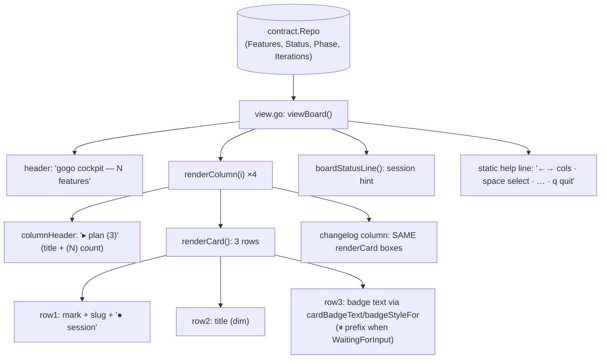
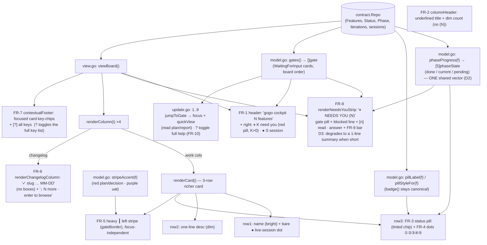

# Report — feature `cockpit-redesign`

- **feature:** Restyle the terminal cockpit TUI (`cli/internal/tui/`) into the Claude-Design 1b + 1c mockup
- **status:** awaiting-uat
- **completed:** 2026-07-12
- **branch / commits:** `main` · working tree (uncommitted at report time)

The gogo terminal cockpit now renders the **1b + 1c** Claude-Design mockup: a header
attention summary, status **pills**, phase **dots ①②③④⑤**, left **gate stripes**, a
**collapsed changelog**, a **contextual footer**, and a top **needs-you inbox strip**
with number-key answering — a *visibly, obviously* different board, not a token diff.

## Run status / gaps

All phases completed; no open issues. Plan → implement (in-context) → review (fresh
`gogo-reviewer`, APPROVE) → test (fresh `gogo-tester`, GREEN) → report. Review's three
findings (REV-001..003) and test's one nit (TEST-001) are all **fixed** and re-verified
green. Gates: `gofmt -l` clean · `go vet ./...` clean · `go test -race ./...` green.

## Summary

The previous attempt at this redesign only "ported the palette" (which was already
correct) and produced **no visible change**. This feature does the real work: a
**presentation-only refactor** of the existing render path that adds the mockup's
**structural layout + new per-card elements** over the **same `contract.Repo`** — **no
contract change, no new pipeline state**. The CLI stays a deterministic, LLM-free reader
that never mutates pipeline state. Version bumped **0.17.0 → 0.18.0**.

## Planned vs shipped

Shipped **as planned** — every functional requirement FR-1..FR-10 landed, with D1→B
(one feature, 1b + 1c together @0.18.0), D2→A (both dots and bars over one shared
vector), and D3→A (strip is a shortcut + graceful degradation). Two concretizations
made during implementation, both within the accepted plan's latitude:

- **D2 rendering split (where dots vs bars appear).** The plan kept both "dots as the
  dense-board default, bars where space allows." As-built: the **dots** render on every
  board card; the **segmented bar** renders on the **needs-you strip** gate rows (full
  width = room for the richer bar). Both call the one `phaseProgress(f)` vector.
- **FR-10 number key = "read".** The mockup labels gate rows `[1] read plan` / `[2] read
  report`. As-built, pressing a number **focuses** that gate's card **and opens its
  primary view** (plan.md / report.md via `quickView`) — literally "read", and the card
  is left focused so the board move key (`[m]`/`[d]`) acts next. This is FR-10's "route
  its primary action" reading.

## Implementation

The redesign is **one shared model with thin renderers**, keeping every new element
**substring-assertable** (no TTY under `go test` → lipgloss emits plain text):

- **One phase-progress model.** `phaseProgress(f) [5]phaseState` maps a feature's
  phase/round (or gate/terminal status) to a `done | current | pending` vector. The
  **FR-4 dots** and the **FR-9 segmented bar** are two renderers over it — so "dots
  and/or bars" is a rendering choice, not two code paths.
- **`badge()` stays canonical.** A new `pillLabel(f)` / `pillStyleFor(f)` transform
  drives the **FR-3 chip** (colored text on a tinted wash), so `badge()` and its tests
  are untouched. `pillStyleFor` mirrors `badge()`'s precedence, so a card's pill color
  can never disagree with its text.
- **Gate stripe = a heavy border, not a width hack.** The **FR-5 left stripe** recolors
  a custom `gateBorder` whose left edge is a heavy `┃` (red plan/decision · purple uat),
  **independent of focus** — visible, width-preserving, and substring-assertable (a
  flowing card keeps the plain `│`).
- **The needs-you strip** (`renderNeedsYouStrip`, FR-8) sits above the board; the columns
  give up its height in `colAvail()` so strip + board both fit, and on a short terminal
  the strip **degrades to a one-line summary** (D3). The collapsed **changelog** (FR-6)
  is a plain `✓ slug … MM-DD` list, windowed with unit-height rows.

### Changes (as-built)

| File | Change | Note |
|---|---|---|
| `cli/internal/tui/styles.go` | modified | New tokens (secondary, faint, pending-dot, tinted pill bgs, strip bg) + precomputed pill / phase-dot / segment styles + `gateBorder` (heavy `┃`) + `stripBoxStyle`. Removed dead `uatStyle` + `colStyleSet.badge` (REV-002). |
| `cli/internal/tui/model.go` | modified | `phaseProgress` + `phaseIndex`/`phaseIndexFromStatus`; `phaseDots`/`phaseDotsPlain`/`phaseBar`; `pillLabel`/`pillStyleFor`; `stripeAccent`; `gates()`/`gateFor`; `isChangelogCol`; `showAllKeys` field. |
| `cli/internal/tui/view.go` | modified | FR-1 header summary, FR-8 strip + D3 degradation, FR-2 underlined headers, FR-3/4/5 richer `renderCard` (pill + dots + `┃` stripe), FR-6 collapsed changelog, FR-7 contextual footer. Removed `cardBadgeText`/`badgeStyleFor` (superseded by pillLabel). |
| `cli/internal/tui/update.go` | modified | FR-10 number keys (`gateNumberKey` + `jumpToGate` → focus + `quickView`) + `?` full-help toggle. |
| `cli/internal/tui/window.go` | modified | `colAvail` subtracts `stripHeight()` (D3); `cardHeights` unit rows for the collapsed changelog. |
| `cli/main.go`, `.claude-plugin/plugin.json` | modified | Version `0.17.0` → `0.18.0` (both, together). |
| `cli/internal/tui/redesign_test.go` | added | Unit tests pinning FR-1..FR-10 (phaseProgress, pills, stripe, gates, strip, header, footer, keys). |
| `cli/internal/tui/{tui,waiting,window}_test.go` | modified | Updated for the restyle (no `(N)`, card `●` + header session count, pill wording); window integration tests repointed to the plan column + changelog-collapse coverage added. `TestBadgeAwaitingPlanAcceptance` / `TestColumnSeparatorRendered` stay green. |

## Decisions & rationale

See [decisions.md](../decisions.md).

| Decision | Choice | Reason |
|---|---|---|
| D1 — scope / sequencing | **B: one feature (1b + 1c) @0.18.0** | User chose a single release over a 1b-first slice. |
| D2 — dots and/or bars | **A: both, one shared `phaseProgress` vector** | Two thin renderers over one source of truth; dots on the dense board, bars on the roomy strip ("where space allows"). |
| D3 — strip duplicates gates + short-terminal | **A: strip is a shortcut (gates stay in columns) + graceful degrade** | Preserves the spatial model + existing column navigation/tests; the strip collapses to a summary line so the board never overflows. |
| REV-001 (review) | decision-gate strip key `[g] resume` → **`[m] resume`** | `g` has no board handler; `m` is the real go/resume key (`move.go`). |
| REV-002 (review) | remove dead `uatStyle` + `colStyleSet.badge` | Orphaned by the badge→pill migration. |
| REV-003 (review) | number the strip's first **9** gates only | `gateNumberKey` parses one digit; a 10th+ gate keeps its column, no dead key. |
| TEST-001 (test) | fix the stale `[g] resume` doc-comment | Comment-only; the rendered text was already correct. |

## Review outcome

One round, fresh-eyes `gogo-reviewer` (did not write the code). Verdict **APPROVE** —
no blockers, no majors. Three agent-fixable findings (REV-001 minor, REV-002/003 nits),
all **fixed in-context** and re-verified green. The reviewer independently confirmed:
`phaseProgress` never panics (unknown → all-pending; `done`/shipped → all-done via the
length guard); `pillStyleFor` precedence matches `badge()`; the strip↔windowing coupling
has **no cycle** (`stripDegraded` reads `m.height`, never `colAvail`) and under-fills
rather than overflows; the CLI stays LLM-free and mutates no state; the test updates were
repointed, not weakened. See [review-01.md](../review-01.md) / [review/issues.json](../review/issues.json).

## Test outcome

One round, fresh-eyes `gogo-tester`. Verdict **GREEN**. The automated suite
(`gofmt`/`vet`/`go test -race`) is green. The **live-TUI fidelity check** ran two ways:
a deterministic render harness (real repo + the fixture's uat gate + a purpose-built
**all-three-gate** workspace at tall and short heights, plus live key drives of FR-10)
**and** a **live tmux drive of the actual binary** — `capture-pane -e` decoded, every
color matched its design token exactly (strip bg `#171b24`, red `#ff6b6b`, session green
`#57d977`, secondary `#b7bdc9`, amber `#e6a14a`). FR-1..FR-10 and D1/D2/D3 all present and
matching the mockup. One comment-only nit (TEST-001), fixed. No hands-on check was blocked.
See [test-01.md](../test-01.md) / [test/issues.json](../test/issues.json).

## Diagrams

The as-built UML set — open [diagrams.html](./diagrams.html) (same folder):

- **flow** (`flow.mmd`) — the shipped board render flow: `viewBoard` → header summary /
  needs-you strip / columns (cards vs collapsed changelog) / contextual footer, fed by the
  new pure helpers (`phaseProgress`, `pillLabel`, `gates`, `stripeAccent`).
- **sequence** (`sequence.mmd`) — the new FR-10 number-key gate-answer interaction:
  key → `gates()` → `jumpToGate` (focus + `quickView` read plan/report).

## Before / after comparison

The plan captured a before (as-is) **flow** set, copied into this bundle as
`report/before/flow.mmd`. Comparing the two **flow** diagrams (before → after):

**Before (as-is):**

**After (as-built):**

**What changed.** The before path was a flat `viewBoard → header/columns/cards/status/help`
with plain-text badges, `(N)` counts, full-card changelog boxes, and a static help line.
The after path introduces **four new pure helpers** (`phaseProgress`, `pillLabel`, `gates`,
`stripeAccent`) feeding **new elements**: the header **attention summary**, the **needs-you
strip** (with the segmented bar), **underlined** column headers, a **3-row card** with a
**pill + dots + `┃` gate stripe**, a **collapsed changelog list**, and a **contextual
footer** (replacing the static help line, with `?` for the full list). The **sequence**
diagram is **new** (after only) — the before had no number-key interaction. No diagram kind
was removed.

## Knowledge updates

- **`.gogo/knowledge/project-knowledge.md`** (`Mode: proxy`) — updated the gogo-owned
  cockpit summary to describe the redesigned board (pills, dots, gate stripe, needs-you
  strip, collapsed changelog, contextual footer, number keys) and the shared
  `phaseProgress` model, at CLI 0.18.0. The proxied upstream `README.md` was **not**
  edited.
- **Consider upstreaming (user's call):** if the `README.md` documents the cockpit's
  look/keys, it now lists a needs-you strip, phase dots, status pills, `1..9` gate
  answering, and `?` for the full key list — worth a line in `README.md` if it enumerates
  board keys/UI.

## Follow-ups & known limitations

- **>9 simultaneous gates** are reachable only in their columns, not by number key (the
  strip numbers the first 9; keys are single-digit). Negligible in practice; documented.
- **Variant 1d (phone companion)** stays a separate future web app that consumes `.gogo`
  data — explicitly out of scope for this terminal cockpit.
- The change is on the working tree (uncommitted at report time); commit when ready.

## Summary (TL;DR)

- **What shipped:** the gogo terminal cockpit (`cli/internal/tui/`) restyled into the
  Claude-Design **1b + 1c** mockup — header attention summary, status **pills**, phase
  **dots ①②③④⑤**, left **gate stripes** (`┃`), a **collapsed changelog**, a **contextual
  footer**, and a **needs-you inbox strip** with `1..9` gate answering + `?` full-help —
  all over the **same `contract.Repo`**, no contract or pipeline-state change. Version
  **0.18.0**.
- **Review:** **APPROVE** (fresh eyes) — 3 non-blocking findings, all fixed in-context.
- **Test:** **GREEN** — automated suite + a live-TUI fidelity check (render harness **and**
  a live tmux drive with colors verified against the design tokens); FR-1..FR-10 match the
  mockup.
- **Follow-ups:** >9-gate number-key cap (documented), 1d phone companion out of scope,
  commit the working tree when ready — see **Follow-ups** above.
