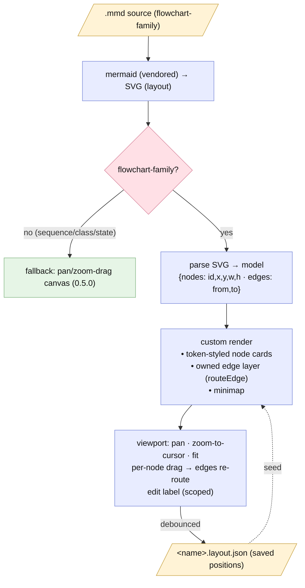

# Plan — xplan-style interactive diagram viewer + before/after UML compare

Status: **done** (2026-07-01). Accepted (user, 2026-07-01) — hybrid renderer (D1=A), staged; D2=A (move+restyle+persist, no label-edit), D3–D6 as recommended; D7=A (localStorage + export) resolved mid-build.

## As-built outcome
- **Shipped as planned** — FR1–FR11. `/gogo:view` now renders **xplan-style
  interactive** flowchart diagrams (custom node cards, per-node **drag with live
  edge re-routing**, zoom/fit/minimap, **persisted layout** via localStorage +
  Export), falling back to the 0.5.0 pan/zoom canvas for other kinds. **Before/after
  UML compare** (plan draws `charts/before/`, report copies to `report/before/` +
  side-by-side), and **`/gogo:done` prints a `file://` viewer link**. Vanilla-JS,
  offline, zero-dep. Version **0.5.0 → 0.6.0**. Working tree **uncommitted**.
- **Review APPROVE** (REV-001..007 verified, 6 rounds). **Test GREEN** — Stage 1
  driven **live in Chromium** (drag→re-route + persist-on-reload confirmed);
  Stages 2/final green.
- **Decisions tightened mid-build:** D2=A (no label-edit), D7=A (localStorage +
  Export, since `file://` can't write the sidecar from JS).
- **Pending:** the 0.6.0 release (commit/tag).
- Full write-up: [report/report.md](./report/report.md). Diagrams: [report/diagrams.html](./report/diagrams.html).

## Goal
Three related diagram/report upgrades:

1. **Make `/gogo:view` render diagrams the way xplan does** — not a flat mermaid
   image, but **custom-styled nodes/edges you can move** (per-node drag with live
   edge re-routing) and **modify**, staying offline / zero-dep.
2. **After `/gogo:done`, print a link to the report HTML** in the output.
3. **Before/after UML compare** — at **plan ①** draw the UML of the *existing*
   flow being changed (the "before"); at **report ⑤** draw the as-built ("after")
   and **compare** before↔after.

## Context — what exists today
- **Viewer (0.5.0):** `skills/gogo-view/SKILL.md` + `assets/viewer/`
  (`viewer.template.html`, `interactive.js` 133 lines, `viewer.css`). It renders
  each `.mmd` with the **vendored mermaid** to SVG and wraps that SVG in a
  **pan/zoom/drag-canvas** with per-diagram controls. There is **no per-node drag,
  no custom node styling, no editing** — the diagram is mermaid's flat output
  moved around as one image. (Per-node interactivity was the deliberate D3 stretch.)
- **Diagrams:** authored as **mermaid `.mmd`** by `gogo-mermaid`; plan ① draws the
  *intended design*, report ⑤ draws the *as-built* set into `report/` (kinds:
  flow/sequence/class/activity/use-case). The vendored runtime lives at
  `.gogo/resources/mermaid.min.js`.
- **`/gogo:done`** (`skills/gogo-done`) copies a report bundle to
  `.gogo/changelog/<date>-<slug>/` and points the user at the static
  `diagrams.html` — it does **not** build/print an interactive viewer link.
- **xplan reference** (`~/repos/xplan`): renders diagrams from a **structured
  node/edge model** (never mermaid for display). Reusable, dependency-light cores:
  `useCanvasViewport` (pan/zoom-to-cursor/fit/**per-node drag** via a `pos` map),
  `diagramGeometry` (`borderAnchor` + `routeEdge` — a pure **orthogonal edge router**
  that re-routes every frame from live node boxes), a token palette → CSS vars
  (color by node `state`), a minimap (inverse-transform), and debounced
  **persist-positions**. xplan does **not** edit node labels (content is authored
  upstream). The research's recommended port: **let mermaid lay out, parse its
  rendered SVG once into `{nodes:[{id,x,y,w,h}], edges:[{fromId,toId}]}`, then own
  interaction (drag + `routeEdge` + recolor + minimap) from that model** — xplan's
  architecture, seeded from mermaid instead of an API. Per-row coloring / label
  editing need the structured model; whole-node recolor + drag can be seeded from
  mermaid's SVG.
- **Constraints** (`.gogo/knowledge/`): **offline, zero-dep, no build** (vanilla
  JS only, over `file://`); only ever write under `.gogo/`; keep enumerations in
  sync; bump `plugin.json`.

## Functional requirements

### Stage 1 — xplan-style interactive renderer (the viewer)
- **FR1 — Structured model, seeded from mermaid.** After mermaid renders a
  flowchart-family `.mmd` to SVG, parse that SVG into a `{nodes:[{id,x,y,w,h,
  label,classes}], edges:[{fromId,toId,label}]}` model (node `<g>` ids + `getBBox`;
  edges from mermaid's from→to encoding). Non-flowchart kinds (sequence / class /
  stateDiagram) **fall back** to today's pan/zoom-canvas (graceful, no regression).
- **FR2 — Custom node/edge styling + owned edge layer.** Render nodes with gogo's
  own token palette (CSS vars; color by node class/role) — visibly *not* mermaid's
  default look. **Own the edge layer**: hide mermaid's baked edge paths and redraw
  edges from the model with a ported orthogonal router (`borderAnchor`+`routeEdge`)
  so they **re-route live** as nodes move.
- **FR3 — Per-node move + viewport + minimap.** Port xplan's viewport core to
  vanilla JS: pan, zoom-toward-cursor, fit, and **per-node drag** (updates the
  node's `pos`; edges re-route each frame; `CLICK_SLOP` separates click from drag).
  Keep the per-diagram controls; add a **minimap** (inverse-transform, click-to-recenter).
- **FR4 — Persist layout.** Save dragged positions to a sidecar
  `.gogo/resources/view/<name>.layout.json` (debounced) so re-opening keeps the
  arrangement; a **"reset layout"** control restores mermaid's original positions.
- **FR5 — Modify = reposition + restyle + persist (D2=A, accepted).** The v1
  "modify" is: drag to reposition, custom restyling, and **persisted layout** (FR3/
  FR4). **Label editing is deferred / out of scope for v1** (xplan itself doesn't
  edit labels; a proper edit needs a `.mmd` writer + re-layout). Revisit later.
- **FR6 — Offline / portable / zero-dep.** All vanilla JS under `assets/viewer/`
  (split into small modules); no network, no build, no runtime deps; over
  `file://`. If parsing fails or mermaid is missing, **fall back** to the current
  renderer (never a blank page).

### Stage 2 — before/after UML compare
- **FR7 — Plan ① draws the "before".** `gogo-plan` (via `gogo-mermaid`) draws the
  **as-is UML of the existing flow being changed** into `charts/before/*.mmd`
  (+ `charts/before/manifest.json`), clearly labeled the *before* baseline. (The
  plan's intended-design diagram stays as the design view.)
- **FR8 — Report ⑤ draws the "after" + compares.** `gogo-knowledge` draws the
  as-built set into `report/*.mmd` (after), **copies the before set into the report
  bundle** (so it's self-contained), and adds a **before↔after comparison** to
  `report.md`: side-by-side per matching kind + a prose "what changed".
- **FR9 — Viewer compare mode.** `/gogo:view` renders **before | after
  side-by-side** for a report that carries both; *stretch* (D4) — a structural
  **node-diff** that highlights added / removed / changed nodes using the FR1 model.

### Stage 3 — done → HTML link
- **FR10 — `/gogo:done` prints an HTML link.** After archiving, `gogo-done`
  builds the interactive viewer page for the changelog entry (reusing the
  `gogo-view` build) and prints its **`file://` link** in the Return output
  (best-effort; falls back to the static `diagrams.html` path).

### Cross-cutting
- **FR11 — Docs + version + sync.** Update `docs/*` (view/flow/architecture +
  the before/after model) + README; bump `plugin.json` **0.5.0 → 0.6.0**; sync
  enumerations; extend `charts-manifest.schema.json` only if the before-set needs a
  `role` tag (else a separate `before/manifest.json`).

## Approach (recommended)
Port xplan's architecture **seeded from mermaid** (D1): mermaid does layout once;
we parse its SVG into a model and own interaction. Deliver in **three stages**
(D-stage), the renderer first since FR8/FR9/FR10 reuse it.

1. **Stage 1 (renderer):** new `assets/viewer/` modules — `viewport.js` (ported
   `useCanvasViewport`), `geometry.js` (ported `borderAnchor`+`routeEdge`),
   `mermaid-parse.js` (SVG→model), `render.js` (token-styled nodes + owned edge
   layer + minimap + drag + persist). `interactive.js` becomes the orchestrator
   with a **fallback** to the 0.5.0 pan/zoom path. Token palette in `viewer.css`.
2. **Stage 2 (before/after):** `gogo-mermaid` + `gogo-plan` draw the before set
   (`charts/before/`); `gogo-knowledge` draws after + the comparison; `gogo-view`
   gains side-by-side compare mode.
3. **Stage 3 (done link):** `gogo-done` builds + links the viewer page.
4. **Cross-cutting:** docs/version/enumeration sweep.

### Alternatives considered
- **Post-process mermaid SVG only** (recolor + translate node groups, keep
  mermaid's baked edges) — *rejected*: dragging a node leaves its edges behind, so
  "move them" looks broken. Owning the edge layer (FR2) is what makes drag work.
- **Full structured model authored upstream** (gogo diagrams become JSON; rewrite
  `gogo-mermaid` + every phase) — *rejected as too big*: seeding the model from
  mermaid's render gives ~the same interaction without an auto-layout engine or a
  pipeline-wide rewrite, and keeps portable `.mmd` authoring.
- **Edit + round-trip to `.mmd`/re-layout** — *deferred*: even xplan doesn't edit
  labels; full round-trip needs a mermaid *writer* + re-layout. FR5 stays a
  view-level scoped edit.

## Open decisions (recommendations — see `decisions.md`)
- **D1 — FR-A approach.** **A.** hybrid: mermaid-layout → parse SVG → structured
  model → custom render + interact (flowchart-family rich; graceful fallback for
  other kinds). **B.** post-process mermaid SVG only. **C.** full upstream
  structured model. **Rec: A.** *Load-bearing.*
- **D2 — "modify" scope.** **A.** reposition + restyle + **persist positions** now;
  label-edit (FR5) a stretch. **B.** include in-session label editing now.
  **Rec: A** (ship move+restyle+persist; label-edit if it's cheap).
- **D3 — Which kinds get the rich renderer.** Flowchart-family (gogo `flow` +
  `use-case`, both flowcharts) rich; `sequence`/`class`/`activity`(stateDiagram)
  fall back to pan/zoom-canvas. **Rec: as stated** (extend later).
- **D4 — Compare mechanism (FR9).** **A.** side-by-side before|after + prose
  "what changed". **B.** also a computed structural node-diff (added/removed/
  changed highlighted), enabled by the FR1 parser. **Rec: A committed, B stretch.**
- **D5 — Before-set storage.** Plan writes `charts/before/`; report ⑤ copies it
  into the report bundle for self-contained archive/view. **Rec: as stated.**
- **D6 — Layout persistence.** Sidecar `<name>.layout.json` under
  `.gogo/resources/view/` (inspectable, portable) vs `localStorage`. **Rec: sidecar.**

## Changes checklist (build order)
**Stage 1**
1. `assets/viewer/geometry.js` (ported `borderAnchor`+`routeEdge`, pure).
2. `assets/viewer/viewport.js` (ported pan/zoom/fit/drag core).
3. `assets/viewer/mermaid-parse.js` (rendered-SVG → `{nodes,edges}`; kind-detect).
4. `assets/viewer/render.js` (token-styled nodes, owned edges, minimap, drag,
   persist, label-edit if D2=A-stretch); `assets/viewer/viewer.css` token palette.
5. `assets/viewer/interactive.js` → orchestrator + fallback to the 0.5.0 path.
6. `skills/gogo-view/SKILL.md` — copy the new asset modules; note the rich vs
   fallback rendering + the `.layout.json` sidecar.

**Stage 2**
7. `skills/gogo-mermaid/SKILL.md` — a `before/` (as-is) set + the compare view
   conventions. `skills/gogo-plan/SKILL.md` — draw the as-is "before" at ①.
8. `skills/gogo-knowledge/SKILL.md` — draw after + copy before + write the
   comparison into `report.md`. `skills/gogo-view/SKILL.md` — side-by-side compare.
9. `templates/contracts/charts-manifest.schema.json` (+ docs) only if a `role`
   tag is needed for before/after; else `before/manifest.json`.

**Stage 3**
10. `skills/gogo-done/SKILL.md` + `commands/done.md` — build + print the viewer link.

**Cross-cutting**
11. `docs/*` (view/flow/architecture) + README; `.claude-plugin/plugin.json`
    `0.5.0 → 0.6.0`; enumeration sync.

## Tests (how we'll verify — see `test-strategy.md`)
- **Stage 1:** on a flowchart `.mmd`, the built page parses to a `{nodes,edges}`
  model, renders token-styled nodes, **drag a node → its edges re-route**, minimap
  + zoom/fit/reset-layout work, positions persist to `<name>.layout.json` and
  reload; a `sequenceDiagram` `.mmd` **falls back** cleanly; mermaid-missing → the
  summary still reads. All offline (no `http(s)://`), `node --check` on every JS.
- **Stage 2:** plan ① on a fixture writes `charts/before/*.mmd`; report ⑤ writes
  `report/*.mmd` + copies before + a before↔after section in `report.md`;
  `/gogo:view` shows them side-by-side.
- **Stage 3:** `/gogo:done` on a fixture prints a working `file://` link to the
  built page (and a static fallback).
- **Cross-cutting:** docs/enumerations in sync; version 0.6.0; schemas valid.

## Out of scope
- Round-tripping edits back to `.mmd` or re-running layout after an edit.
- A from-scratch auto-layout engine (mermaid does layout).
- Rich interaction for sequence/class/state kinds (fallback only; later).
- Collaborative/multi-user editing or a served viewer (offline file:// only).

## Diagrams (intended design)
The viewer's runtime data flow — mermaid lays out, we parse to a model and own
interaction. Also `charts/viewer-pipeline.mmd`; offline `charts/diagrams.html`.

