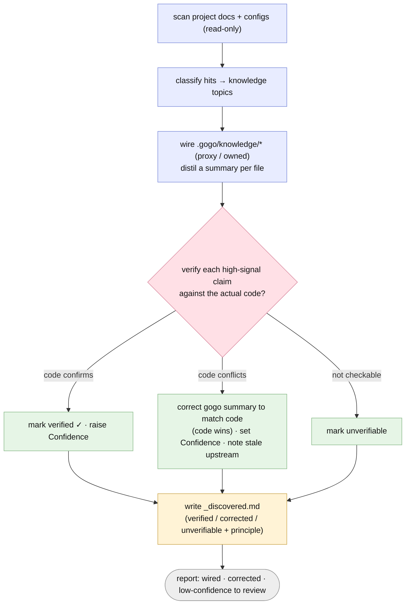

# Plan — Hosted docs site + code-verified discovery

Status: **done** (2026-06-30). Accepted (user, 2026-06-30) — D1–D4 as recommended; D5 (sync stale agent files) resolved fix-now.

## As-built outcome
- **Shipped as planned** — **Part A:** a GitHub Pages docs site under `docs/`
  (`docs/_config.yml`, Jekyll + `just-the-docs` remote theme + mermaid, deploy from
  `main` `/docs`, no local build) with pages **index · commands · flow · agents
  (I/O) · discovery · contracts** + the folded-in **architecture**; README gains a
  Documentation link. **Part B:** a new `gogo-build` **Step 5 verify-against-code**
  (code wins; per-claim verified ✓ / corrected / unverifiable in `_discovered.md`;
  the "code is the source of truth" principle), mirrored into the template.
  Version **0.3.0 → 0.4.0**. Working tree **uncommitted** (release pending).
- **All FR1–FR7 satisfied.** Docs enumerate the real 10 commands /
  4 agents / 5 phases (grep-verified); Part B verified live on a fixture.
- **Deviation reconciled:** `_config.yml` was first placed at repo root; moved to
  `docs/_config.yml` (deploy-from-`/docs`) per D4 — see `decisions.md`.
- **Review:** APPROVE — 3 minors (REV-001 stale self-knowledge, REV-002 duplicate
  diagram edge, REV-003 stale agent role files [D5 fix-now]) → all **verified**.
  **Test:** GREEN — Part A structure/accuracy + Part B dogfood (Jest+npm doc vs
  Vitest+pnpm code → corrected, code wins, upstream untouched) all pass; 1 nit
  (dropped ✓) → **verified**.
- **Residual / next:** enable GitHub Pages (D4: `gh`, source `main` `/docs`) after
  the 0.4.0 release; then confirm the live site at `https://zawadzkib.github.io/gogo/`.
- Full write-up: [report.md](./report.md). Diagrams: [charts/diagrams.html](./charts/diagrams.html).

## Goal
Two related pieces of "make gogo legible and accurate":

- **Part A — a detailed, GitHub-hosted documentation site** (GitHub Pages) that
  explains, for a newcomer: every command, how the flow works (phases, loops,
  gates, resume), **what each agent consumes and produces**, how **discovery**
  (`/gogo:build`) works, the knowledge budget + `/gogo:skills`, and the typed
  contracts.
- **Part B — code-verified discovery.** After `/gogo:build` wires
  `.gogo/knowledge/` from the project's docs, add a pass that **verifies the
  distilled claims against the actual code**; where a doc-derived summary conflicts
  with code, **code wins** (docs can be outdated) — correct the gogo-owned summary
  and adjust `Confidence`, and record what was verified/corrected.

## Context — what exists today
- **Docs today:** `README.md` (overview + commands), `docs/architecture.md`
  (the two splits + file map, shipped in 0.3.0), `templates/contracts/README.md`
  (the artifact shapes), and each `skills/*/SKILL.md` (the authoritative logic).
  No hosted site, no `_config.yml`, no Pages setup. GitHub renders repo Markdown +
  mermaid, but there's no navigable docs front-end.
- **The facts the site needs already exist** and must not be duplicated/forked:
  the flow + gates live in `skills/gogo/SKILL.md`; per-agent behaviour in
  `agents/*.md` + the phase skills; produces/consumes in
  `templates/contracts/*` + `gogo-contracts`; discovery in `skills/gogo-build/SKILL.md`.
  The site distils + links these; it is not a second source of truth.
- **Discovery today** (`skills/gogo-build/SKILL.md`): Steps 1–6 = scaffold →
  discover (read-only scan) → classify → wire each knowledge file (proxy/owned,
  set `Confidence` by source quality) → write `_discovered.md` → report. It trusts
  the docs it reads; it never cross-checks them against the code. Stale docs →
  stale knowledge → the pipeline plans against wrong facts.
- **Constraints** (`.gogo/knowledge/`): core stays **dependency-free**; only ever
  write under `.gogo/`; never edit a proxied upstream file; keep enumerations in
  sync; bump `plugin.json` on behavioural change. **No local build step** is a
  standing value — the docs site must not introduce one.

## Functional requirements
### Part A — documentation site
- **FR1 — Pages site, no local build.** A `/docs` site served by **GitHub Pages**
  (Jekyll + a remote theme; GitHub builds it — **no committed deps, no local build,
  no CI**). `_config.yml` sets title/theme/nav; each page carries front matter for
  nav order. Honors gogo's no-build / zero-local-dep value.
- **FR2 — Content coverage.** Pages for: **index** (what gogo is · install/update ·
  quick start · nav); **commands** (every `/gogo:*` — purpose, args, reads/writes);
  **flow** (the five phases, the implement↔review↔test loops, decision gates,
  resume); **agents** (the I/O reference — for the orchestrator + `gogo-developer` +
  `gogo-reviewer` + `gogo-tester`, what each **consumes** and **produces**);
  **discovery** (how `/gogo:build` finds + wires docs, proxy vs owned, **and the new
  code-verification of Part B**); **knowledge & skills** (the budget + `/gogo:skills`);
  **contracts** (the typed artifacts). Fold in the existing `architecture.md`.
- **FR3 — Diagrams render on the site.** The flow, an agent produces/consumes view,
  and the discovery-verification flow render via the theme's mermaid support.
- **FR4 — DRY + discoverable.** Distil from (and link to) the README/skills/contracts
  — don't duplicate them verbatim. `README.md` gets a prominent **Documentation**
  link to the published site. State plainly: **code/skills are authoritative; the
  site is generated from them and may lag** (ties to Part B's principle).

### Part B — code-verified discovery
- **FR5 — Verify-against-code pass.** After wiring (`gogo-build` Step 4), add a
  verification pass: for each **high-signal** distilled claim (tech stack, build/
  run/test commands, test framework, entry points, key scripts), cross-check it
  against the actual code (manifests + lockfiles, test/CI configs, entry files,
  `package.json` scripts, etc.). On a conflict, **code wins** — correct the
  gogo-owned summary to match code and set `Confidence` accordingly. Pure
  Glob/Grep/Read; never edits the upstream doc (proxy `Source:` stays; only the
  gogo summary is corrected, with a note + an "upstream looks stale" suggestion).
- **FR6 — Record verification.** `_discovered.md` gains a verification section:
  per high-signal claim → **verified ✓** / **corrected** (doc said X → code shows Y)
  / **unverifiable**, plus the explicit principle *"code is the source of truth;
  docs may be outdated."* Corrections are surfaced in the build report. Mirror the
  principle into `templates/knowledge/_discovered.md` so new projects inherit it.
- **FR7 — Still pure / portable / idempotent / safe.** No new dependency; only
  writes under `.gogo/`; preserves every `## gogo overrides` + `Mode: owned` body;
  re-runs reconcile (re-verify, don't churn).

## Approach (recommended)
1. **Docs site (Part A)** — `_config.yml` (Pages, `remote_theme:
   just-the-docs/just-the-docs`, mermaid enabled, nav). Author the `docs/*.md`
   pages above with nav front matter; fold `architecture.md` into the nav. Mermaid
   blocks reuse the diagrams we already have. README → "Documentation" link.
2. **Verified discovery (Part B)** — insert a **verify step** into
   `skills/gogo-build/SKILL.md` (new Step 5, between wiring and `_discovered.md`);
   teach Steps 4/6 + the report to record verified/corrected/unverifiable and the
   "code is source of truth" principle; update `commands/build.md`'s description +
   `templates/knowledge/_discovered.md`.
3. **Sync + version** — README/docs/skill enumerations in sync; bump
   `plugin.json` (Part B is behavioural) `0.3.0 → 0.4.0`.

### Alternatives considered
- **MkDocs Material / Docusaurus / VitePress** for the site — *rejected*: prettier
  but adds a Node/Python build + deps + CI, breaking gogo's no-build / zero-dep
  value. just-the-docs on Pages is built by GitHub with nothing committed.
- **A single self-contained HTML page** — *rejected for the site*: no nav/search,
  harder to extend; fine for the offline diagram viewer, not for "detailed docs."
- **Exhaustively verify every knowledge line against code** (Part B) — *rejected*:
  much isn't mechanically checkable with pure Glob/Grep/Read; verify the
  high-signal, checkable claims and mark the rest `unverifiable`.
- **Auto-rewrite the upstream doc to match code** — *rejected*: violates "never
  edit a proxied upstream file." We correct only the gogo summary + suggest the
  upstream fix.

## Open decisions (recommendations — see `decisions.md`)
- **D1 — Docs tooling.** **A.** Pages from `/docs`, Jekyll + `just-the-docs`
  remote theme + mermaid (GitHub-built, zero local deps). **B.** self-contained
  HTML. **C.** MkDocs/Docusaurus (build + deps). **Rec: A.**
- **D2 — Scope/staging.** One feature, two parts (A docs, B discovery), each
  independently reviewable/mergeable. **Rec: one feature; ship A and B as they
  land.** (Split into two features if you'd rather.)
- **D3 — Verification depth (Part B).** **A.** high-signal, mechanically-checkable
  claims; **B.** exhaustive. **Rec: A.**
- **D4 — Enabling Pages** (a repo setting, not a file). I can enable it via
  `gh api` (Settings → Pages → deploy from `main` `/docs`), or you toggle it.
  **Rec: I run the `gh` step after merge; you confirm.**

## Changes checklist (build order)
1. `_config.yml` — Pages config (title, `remote_theme`, mermaid, nav, `include`).
2. `docs/index.md`, `docs/commands.md`, `docs/flow.md`, `docs/agents.md`,
   `docs/discovery.md`, `docs/contracts.md` — authored with nav front matter;
   `docs/architecture.md` gets front matter + a nav slot.
3. `skills/gogo-build/SKILL.md` — new **Step 5 verify-against-code**; Steps 4/6 +
   report updated for verified/corrected/unverifiable + the principle.
4. `commands/build.md` — describe the verification pass.
5. `templates/knowledge/_discovered.md` — verification section + the principle.
6. `README.md` — "Documentation" link to the site.
7. `.claude-plugin/plugin.json` — `0.3.0 → 0.4.0`.
8. Sync sweep — command/agent/phase enumerations consistent across site, README,
   skills.

## Tests (how we'll verify — see `test-strategy.md`)
- **Site builds + renders:** `_config.yml` + every page's front matter parse;
  mermaid blocks well-formed; internal links resolve; nav lists every page. (Pages
  build itself is GitHub-side; locally we validate structure, optionally `jekyll
  build` only if already present.)
- **Content accuracy (no drift):** the commands/agents/phases the site lists match
  the actual `commands/`, `agents/`, and `skills/gogo` flow (grep cross-check).
- **Verified discovery (the headline case):** a fixture project whose doc states a
  **stale** fact (e.g. `CLAUDE.md` says "Jest" while `package.json` + lockfile show
  **Vitest**) → build's verify pass corrects the `tech-stack`/`testing-tools`
  summary to Vitest, lowers/sets `Confidence`, and logs a **corrected** row in
  `_discovered.md`; a fact the code **confirms** → **verified ✓**; an unprovable
  claim → **unverifiable**. Upstream file left untouched; suggestion surfaced.
- **Portability/safety/idempotency:** verify works with no jq/node; only `.gogo/`
  written; re-run reconciles without churn; overrides/owned preserved.

## Out of scope
- Versioned docs, custom domain, a search backend beyond the theme, autogenerated
  API docs.
- Auto-enabling Pages from here without confirmation (D4 — provide/confirm the step).
- Rewriting upstream docs to match code (we correct only gogo-owned summaries and
  suggest upstreaming).
- Changing the pipeline phases, contracts, or `/gogo:skills`.

## Diagrams (intended design)
The new **verified-discovery** control flow (Part B) — the genuinely new system
behaviour. Also `charts/verified-discovery.mmd`; viewer `charts/diagrams.html`.

