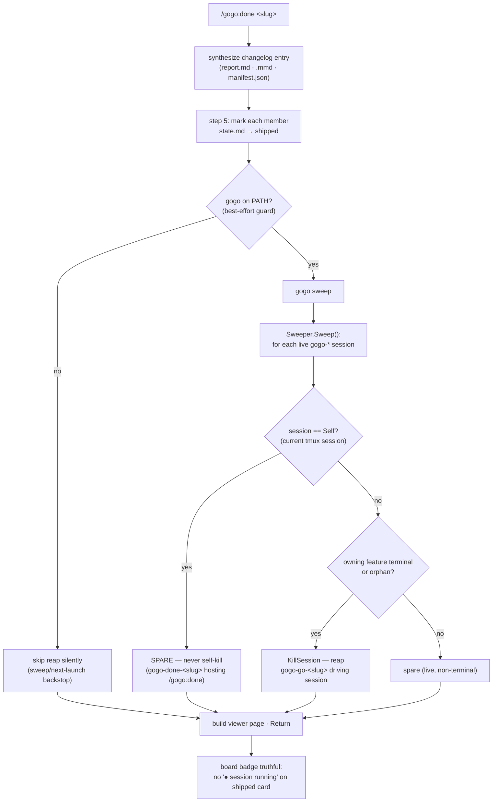
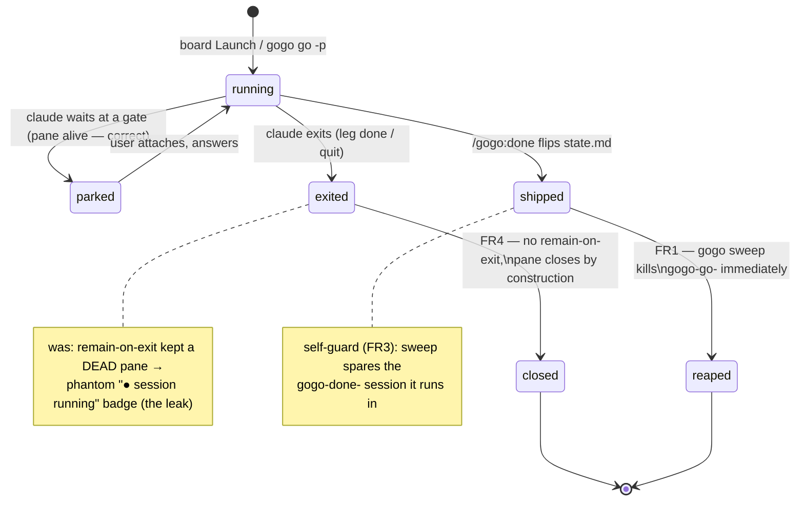

# Plan — feature `immediate-kill-at-ship`

Status: accepted 2026-07-12 · **adjusted at review D4→B, 2026-07-12** (targeted ship-reap) · built 0.17.0

> **As-built adjustment (D4→B, review round 2).** This plan was accepted with **D1=A**
> (the `/gogo:done` ship-reap calls **plain `gogo sweep`**). During review, REV-002 showed a
> plain whole-board sweep at ship can truncate a *different* feature's concurrent `/gogo:done`.
> The user chose **D4→B**: the ship-reap is now **targeted — `gogo sweep <slug>...`** (reaps
> only the shipped slug(s)' sessions, via a new `Sweeper.Only` filter), and **plain
> `gogo sweep` (no slug) stays the manual whole-board cleanup**. So wherever the sections below
> say the skill runs "plain `gogo sweep`", the **shipped** behaviour is the targeted
> `gogo sweep <member-slug>...`. REV-001 (the ship's own `gogo-done-<slug>` host lingers until
> quit/next sweep) was accepted as works-as-designed. See `decisions.md` D4 and `adjustments.md`.

**Reap a feature's driving tmux session the moment it ships, and stop the board's
interactive launches from leaking dead panes** — so a shipped/finished card never
shows a phantom "● session running" badge and the user never has to run
`gogo sweep` by hand. This is the **D5=B refinement deferred from
`persistent-session-orchestrator` v0.15.0**: v0.15.0 shipped kill-at-ship as
**`gogo sweep` + opportunistic-on-next-launch reap only (D5=A)**; `/gogo:done`
itself never reaped the session it just shipped, and the board's own `m`/`d`
launches leave `remain-on-exit` corpses behind.

## Goal

When `/gogo:done` ships a feature, **reap the tmux session(s) that drove it,
immediately, as part of the ship** — best-effort, never failing a ship. And
**stop the board's interactive `Launch()` from leaking** dead panes by dropping
its `remain-on-exit on`, bringing it in line with the persistent-session
`-p`/`--attach` paths that already never leak. Net acceptance signal: **right
after a real `/gogo:done`, `tmux list-sessions` shows no live `gogo-*` *driving*
(`gogo-go`/`gogo-plan`) session for the shipped slug, and the board badge is
truthful.** (As-built/REV-001 caveat: the ship's own `gogo-done-<slug>` *host*
session is deliberately spared by the self-guard - it cannot reap the session it
runs in without truncating itself - so it lingers until the user quits it (FR4
then closes the pane) or a later sweep reaps it; the *driving* session, the actual
leak, is reaped immediately.)

## Context — what exists today (code = source of truth)

Two root causes were verified against the tree:

1. **`/gogo:done` never reaps.** `skills/gogo-done/SKILL.md` step 5 ("Mark each
   member terminal") flips each member's `state.md` → `shipped`, then goes straight
   to the viewer build + Return. **No reap step.** The driving `gogo-go-<slug>`
   session that ran the pipeline is left alive. D5=A parked immediate reap as a
   later refinement (`.gogo/work/feature-persistent-session-orchestrator/decisions.md`
   D5: *"A `/gogo:done` hook (B) is noted as a later refinement once we want
   immediate kill-at-ship rather than next-sweep/next-launch"*). This is that hook.

2. **The board's interactive `Launch()` leaks by construction.**
   `cli/internal/launch/launch.go` `Launch()` (the board's `m`/`d`/`g` launcher —
   `m.launcher` in `cli/internal/tui/model.go:141`) runs `tmux set-option ...
   remain-on-exit on` (**launch.go:459**) so the pane lingers *after* claude exits.
   The badge is computed live from `launch.ListSessions()` (live tmux sessions), so
   a dead-but-remaining pane still reads "running." By contrast the
   persistent-session paths **never set remain-on-exit**: headless `RunPhase`
   (`claude -p`) has no pane, and `LaunchPersistent` (`--attach`, launch.go:544)
   explicitly comments *"the pane closes when claude exits (no orphan by
   construction)."* Only the board's `Launch()` leaks.

**Reuse already shipped (v0.15.0 — do NOT re-implement):**

| Building block | Where | What it gives us |
|---|---|---|
| `launch.SessionMatchesSlug` | `launch.go:337` | exact `gogo-<action>-<slug>` convention parse (never substring — TEST-005) |
| `launch.KillSession` / `ListSessions` | `launch.go:493` / `:393` | kill a `gogo-*` session · list live ones |
| `orchestrator.TerminalStatus` | `orchestrator.go:113` | `shipped`/`aborted`/`done` ⇒ no live session expected |
| `orchestrator.Sweeper` + `gogo sweep` | `sweep.go` · `cli/go.go:215` | the reaper: kills terminal-feature + orphan sessions; injectable `List`/`Kill`; `--dry-run` |
| `Sweeper.owningFeature` / `shouldReap` | `sweep.go:80/95` | attribution + reap rules already there |

**The self-kill hazard (the one non-obvious point).** `/gogo:done` can itself run
*inside* a `gogo-done-<slug>` tmux session — the Go TUI board's `d`/`m` keys launch
`claude "/gogo:done <slug>"` via `Launch()` into `gogo-done-<slug>`
(`cli/internal/tui/move.go:26/38`). If, after flipping `state.md` → `shipped`, the
skill sweeps that slug (even the **targeted** `gogo sweep <slug>` shipped under
D4→B — the hosting session *is* the shipped slug's), the sweeper sees the member is
now terminal and `SessionMatchesSlug("gogo-done-<slug>", "<slug>")` is **true**
(ActionDone is in the match set) — so **sweep would kill the very session it is
running in**, truncating `/gogo:done` mid-flight (before the viewer build / Return).
This is a pre-existing latent bug in `gogo sweep` (a user running it from inside an
attached `gogo-go-x` session where `x` is terminal would self-kill too). The fix — a
**self-guard** — is the one genuinely-needed Go change and is generally useful. (It
is orthogonal to D4→B's slug filter: the filter stops a ship truncating *other*
features; the self-guard stops it truncating *itself*.)

## Functional requirements

- **FR1 — `/gogo:done` reaps its own driving session at ship.** After the "Mark
  each member terminal" step flips every member's `state.md` → `shipped`,
  `gogo-done` runs a **best-effort bash step** that reaps the live `gogo-*`
  session(s) for the shipped slug(s). Order matters: the state flip is **before**
  the reap (so the sweeper sees the feature as terminal). Every other `/gogo:done`
  behaviour is unchanged (synthesis-not-copy, idempotent, `.gogo/`-only).

- **FR2 — a reap failure never fails a ship.** The reap step is guarded
  (`command -v gogo >/dev/null 2>&1 && gogo sweep >/dev/null 2>&1 || true`): if the
  `gogo` CLI is not on PATH, or the reap errors, `/gogo:done` **skips it silently**
  and still ships. Portability contract honoured — the core loop needs no external
  deps; the existing `gogo sweep` / next-launch reap remains the backstop when the
  CLI is absent.

- **FR3 — `gogo sweep` never kills the session it is running in (self-guard).** The
  `Sweeper` skips the tmux session it is itself hosted in (resolved from the current
  tmux session name when `$TMUX` is set), so the FR1 ship-reap cannot truncate
  `/gogo:done` when that runs inside a board-launched `gogo-done-<slug>` session —
  and `gogo sweep` becomes safe to invoke from *any* session context. Injected as a
  seam (like `List`/`Kill`) so it is unit-testable without a real tmux.

- **FR4 — the board's interactive `Launch()` no longer leaks.** Drop the
  `remain-on-exit on` `set-option` from `launch.go` `Launch()`. A board-launched
  `gogo-*` session then closes when claude exits — exactly like `LaunchPersistent`
  and the headless `-p` path — so a finished session disappears, the live-session
  badge is truthful, and dead panes never pile up. (Sessions that park at a gate
  keep claude alive and the pane open on their own; `remain-on-exit` only ever kept
  a *dead* pane, which is precisely the leak.)

- **FR5 — additive contract + paired version bump.** Update `docs/cli-contract.md`
  for the sweep behaviour additively (ship auto-invokes sweep; sweep spares its own
  session; the board launch no longer sets `remain-on-exit`). Bump
  `.claude-plugin/plugin.json` `version` and `cli/main.go` `Version` **together** to
  **0.17.0** (both currently 0.16.0; `cockpit-cards-and-cli-awareness` lands 0.16.0).

## Approach (recommended)

The whole feature is **three small, scoped edits + housekeeping** — no new CLI
command, no new file, no new dependency.

1. **Go — self-guard on `Sweeper` (FR3).** Add an injectable "current session" seam
   to `cli/internal/orchestrator/sweep.go` (`Self func() string` or a `Self string`,
   defaulting in `cmdSweep` to the current tmux session via
   `tmux display-message -p '#S'` when `$TMUX` is set, else `""`). In the `Sweep()`
   scan, **skip the session equal to `Self`** before `shouldReap`. This makes
   `gogo sweep` self-preserving.

2. **Skill — reap step in `/gogo:done` (FR1/FR2).** In
   `skills/gogo-done/SKILL.md`, add a step **after** step 5 ("Mark each member
   terminal"): a best-effort, classifier-safe bash line that runs a **targeted**
   `gogo sweep <member-slug>...` **(as-built, D4→B; the plan originally said plain
   `gogo sweep`)** (guarded on `command -v gogo`; never fails the ship). Because the
   members are already `shipped`, the targeted sweep reaps their `gogo-go-<slug>` /
   `gogo-plan-<slug>` sessions via the exact-convention parse — restricted to the
   named slug(s) so it never touches another feature's concurrent ship (REV-002) —
   and, thanks to FR3, never the `gogo-done-<slug>` session hosting `/gogo:done`
   itself. Document that the reap is best-effort and skipped when the CLI is absent.

3. **Go — drop `remain-on-exit` (FR4).** Delete the single `set-option ...
   remain-on-exit on` line in `launch.go` `Launch()` and correct the two doc
   comments (`:443`, `:458`) that describe the old behaviour. Scope check confirmed:
   `Launch()` is called **only** by the TUI board (`m.launcher`); the args builder
   `TmuxNewSessionArgs` (unit-tested) is untouched.

4. **Housekeeping (FR5).** Additive `docs/cli-contract.md` edit; version bump in the
   two paired files.

**Why targeted `gogo sweep <slug>` in the skill (as-built, D4→B — superseding the
plan's original D1=A).** The plan first argued for **plain `gogo sweep`**: the state
flip is `shipped`-first, so the just-shipped session is already terminal and a plain
sweep reaps it, and collateral reaping was thought "safe by definition." **Review
REV-002 disproved that premise** — a *just-shipped (terminal)* feature CAN keep a
live session (its own `gogo-done-<slug>` still finishing `/gogo:done`), so a plain
whole-board sweep at ship can **truncate a *different* feature's concurrent
`/gogo:done`**. The user chose **D4→B**: the ship-reap passes the shipped slug(s)
(`gogo sweep <member-slug>...`) so it only ever touches its *own* card's sessions.
The self-guard (FR3) makes the call safe against **self**-truncation; the **slug
filter** (`Sweeper.Only`) is what makes it safe against truncating **others**. Plain
`gogo sweep` (no slug) remains the manual whole-board orphan cleanup. See D1 + D4.

### Alternatives considered

- **D1 — reap mechanism.** (A, recommended-at-plan) skill bash step calling **plain
  `gogo sweep`** + the self-guard; (B) a **targeted `gogo sweep <slug...>`** variant
  that reaps only the named slugs' sessions — more surgical and a precise match to
  the FR wording, but adds a CLI arg + arg-parse relaxation + tests; (C) a **Go
  `gogo done` wrapper** that ships and reaps — pulls `done` into the CLI, the
  explicitly-deferred gate/state-CLI slice; over-scoped. **Accepted at plan as A;
  CHANGED to B at review (D4→B, 2026-07-12)** — REV-002 showed a plain sweep can
  truncate a concurrent other-slug `/gogo:done`, which the slug filter (B) prevents.
  C remains out of scope.

- **D2 — the board `remain-on-exit` fate.** (A, recommended) **drop it** — badge is
  truthful *immediately*, matching the `-p`/`--attach` paths; cost is losing the
  post-exit scrollback of a *finished* session (mitigated: attach/peek while live;
  the durable trail is `.gogo/work/` + events + report). (B) **keep it but
  reap-dead-panes on sweep** — preserves post-exit read but the badge lies until the
  next sweep runs, and needs new `pane_dead` logic; worse for the actual complaint.
  (C) **rely on ship-reap + sweep only, keep remain-on-exit** — does **not** fix the
  `m`-launched *non-terminal-but-finished* feature (its dead pane isn't reaped until
  the 24h TTL or a ship, since `shouldReap` spares a non-terminal owner). **A** is
  both simplest and most correct for the badge.

- **D3 — best-effort reap (never fail a ship).** Recommended and non-negotiable: the
  reap is guarded + `|| true`; a missing CLI or a reap error is a silent skip.

## Changes checklist (as-built — includes the D4→B targeted-sweep adjustment)

1. `cli/internal/orchestrator/sweep.go` — add the `Self` seam + skip-self in
   `Sweep()`; **(D4→B) add the `Only []string` targeted-filter seam** +
   `matchesOnly()`/`inScope()`, and scope `cleanupTerminalRegistries`/
   `cleanupStaleLocks` to the named slugs.
2. `cli/go.go` `cmdSweep` — default `Self` from `launch.CurrentSession()`; **(D4→B)
   parse `gogo sweep [--dry-run] [<slug>...]` (each slug `validSlug`-guarded) → `Only`**;
   update `sweepHelp` usage.
3. `cli/internal/launch/launch.go` — add `CurrentSession()` (feeds `Self`); drop the
   `remain-on-exit on` `set-option` in `Launch()` (FR4); fix the `Launch` doc comment.
4. `cli/internal/orchestrator/orchestrator_test.go` — `TestSweepSparesSelf` (FR3) +
   **(D4→B) `TestSweepTargetedOnlyNamedSlug`** (targeted reap spares other slugs).
5. `skills/gogo-done/SKILL.md` — new best-effort reap step after "Mark each member
   terminal", running **targeted `gogo sweep <member-slug>...`**; Degradation note.
6. `docs/cli-contract.md` — additive 0.17.0 note (ship auto-invokes a **targeted**
   sweep; sweep spares its own session; slug-arg targeted mode; no `remain-on-exit`);
   command-surface line `gogo sweep [--dry-run] [<slug>...]`. **(D4→B enum sync)**
   `README.md` + `skills/gogo-cli/SKILL.md` sweep usage strings updated too.
7. `.claude-plugin/plugin.json` + `cli/main.go` `Version` → **0.17.0** (paired).

## Tests

| Level | What it proves | How |
|---|---|---|
| **Go unit** (automated) | `gogo sweep` **spares the session it runs in** even when that session's feature is terminal (FR3) | `TestSweepSparesSelf`: inject `List`/`Kill` + `Self:"gogo-done-x"` with feature `x` shipped; assert `x`'s driving `gogo-go-x` **is** reaped but `gogo-done-x` (== `Self`) is **not** ✓ |
| **Go unit** (automated, **D4→B**) | a **targeted** `gogo sweep <slug>` reaps **only** the named slug's sessions (REV-002 fix) | `TestSweepTargetedOnlyNamedSlug`: `Only:["x"]`, `Self:"gogo-done-x"`; assert `gogo-go-x` reaped but `gogo-done-z` (other terminal feature) + orphan + self are all **spared** ✓ |
| **Go gates** | no regression | `gofmt -l .` clean · `go vet ./...` clean · `go test -race ./...` green (the required `cli/` gate) |
| **Shell / stub-claude** (best-effort) | a ship leaves **no live session for the slug** | a small harness: create a fake `gogo-go-<slug>` tmux session, run the reap step against a `shipped` state.md, assert `tmux list-sessions` shows no `gogo-*` for the slug — degrades to skip when tmux absent (portability) |
| **Hands-on (RAN live, tmux present — no gate needed)** | the real proof: a targeted ship-reap removes the shipped slug's **driving** session while sparing a concurrent other-slug ship + all real host sessions; `remain-on-exit` drop closes a finished pane | **run safely** via a scratch tmux harness (a real killing whole-board `gogo sweep` is host-global, so it was NOT run): `gogo sweep kastest-scratch-1` reaped only its own driving session, spared a concurrent `gogo-done-*` host + the 3 real host sessions; self-guard demoed from inside the host session; `remain-on-exit` removal shown by a live pane-close demo; whole-board via `--dry-run` only. ✓ GREEN |

`remain-on-exit` is a tmux side effect with no clean unit seam; its removal is
proven by the shell/hands-on checks + code review, and the comment change documents
the new contract.

## Sequencing constraint (hard)

**Build only AFTER `cockpit-cards-and-cli-awareness` ships.** That feature is
mid-build (`.gogo/work/feature-cockpit-cards-and-cli-awareness/state.md`:
`phase: implement · status: implementing`) and also touches `cli/` — the one-owner
discipline forbids two concurrent builds on the same code. **Planning now is fine
(read-only).** When `/gogo:go` runs this feature, it targets **0.17.0** (cockpit-cards
lands 0.16.0). If cockpit-cards moved any of `launch.go` / `sweep.go` / the sweep
contract, re-verify the line references at build time (code = source of truth).

## Out of scope

- **A Go `gogo done`** command / pulling ship+gate into the CLI (the deferred
  gate/state-CLI slice; D5=C).
- ~~**A targeted `gogo sweep <slug>`** CLI argument (D1=B) — not needed~~ **→ MOVED
  INTO SCOPE (D4→B, 2026-07-12):** the shipped ship-reap *is* the targeted
  `gogo sweep <slug>...`. Only the *whole-board* plain `gogo sweep` (no slug) and the
  sweep TTL/orphan/lock rules stay unchanged.
- **Changing sweep's TTL / orphan / lock-cleanup rules**, the registry, or the
  `--attach` / `-p` persistent-session lifecycle — all reused unchanged.
- **The python `board.py` cockpit** and the `/gogo:done` board-mode intent routing —
  untouched (the reap is a skill step in the shared entry-writer).
- **Any pre-existing doc drift** unrelated to reap (e.g. the `diagrams.html` mention
  in the `state.md` file-list comment).

## Intended design

The ship→reap flow — where the new best-effort reap slots into `/gogo:done`, and
how the self-guard spares the hosting session:

The session lifecycle, with the two new edges this feature adds (immediate
reap-at-ship, and the board pane closing on exit instead of leaking):

## Summary (TL;DR)

- **What:** `/gogo:done` reaps the tmux session that drove a feature **the moment it
  ships** (best-effort), and the board's interactive `Launch()` stops leaking dead
  panes by dropping `remain-on-exit` — so a shipped/finished card never shows a
  phantom "● session running" badge and nobody runs `gogo sweep` by hand.
- **Why:** the D5=A slice shipped kill-at-ship as sweep + next-launch-only; the
  session that `/gogo:done` just shipped kept running, and board launches left
  `remain-on-exit` corpses. This is the deferred **D5=B** refinement.
- **Approach (as-built):** a **self-guard** so a sweep never kills its own hosting
  session, a **targeted `Sweeper.Only` filter** so `gogo sweep <slug>` (and thus the
  ship-reap) touches only the named slug(s) (**D4→B**), a **best-effort, targeted
  `gogo sweep <member-slug>...` step** in `/gogo:done` after members flip to `shipped`,
  and **dropping `remain-on-exit`** from the board's `Launch()` — reusing
  `Sweeper`/`SessionMatchesSlug`/`KillSession` wholesale. One additive CLI arg
  (`gogo sweep [<slug>...]`), no new command, no new dependency; bump to **0.17.0**.
- **Decisions (resolved):** D1 reap mechanism — accepted **A** (plain sweep + self-guard)
  at plan, **CHANGED to B** (targeted `gogo sweep <slug>`) at review via **D4→B** after
  REV-002; D2 `remain-on-exit` fate → **A** (drop it); D3 best-effort reap → **yes**.
  Review REV-001 (own host lingers) accepted as works-as-designed.
- **What happened next:** plan accepted 2026-07-12; built after `cockpit-cards-and-cli-awareness`
  shipped (both touch `cli/`); implemented → reviewed (D4→B adjustment) → tested GREEN on **0.17.0**.
