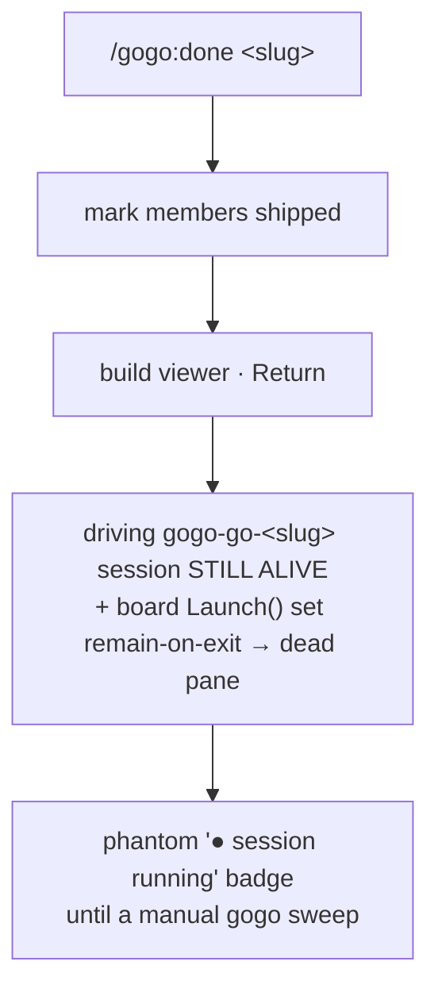

# Report — feature `immediate-kill-at-ship`

- **feature:** Immediate kill-at-ship — `/gogo:done` reaps its driving tmux session at ship (targeted), and the board's `Launch()` stops leaking dead panes
- **status:** awaiting-uat
- **completed:** 2026-07-12
- **branch / commits:** n/a (uncommitted working tree; gogo defers commits to the user)

## Run status / gaps

All phases completed; **no open issues**. plan ① → implement ② (2 rounds) → review ③ (2 rounds, APPROVE) → test ④ (1 round, GREEN, all hands-on run live) → report ⑤. One review decision gate (**D4→B**) was raised and resolved by the user mid-pipeline. Final review issues: REV-002 `verified`, REV-001 `wontfix` (accepted), REV-003 `fixed`. Final test issues: TEST-001 `fixed`, TEST-002 `wontfix` (pre-existing, out of scope).

## Summary

**What shipped:** when `/gogo:done` ships a feature it now **reaps the tmux session(s) that drove it — immediately, and only its own** — so a just-shipped card no longer shows a phantom "● session running" badge and nobody has to run `gogo sweep` by hand. It also **drops `remain-on-exit`** from the board's interactive launcher, so a finished board session's pane closes on its own instead of lingering as a dead corpse. **Why:** the v0.15.0 kill-at-ship slice (D5=A) only reaped on the next manual sweep / next launch; the session `/gogo:done` had just shipped kept running, and board launches left `remain-on-exit` panes. This is the deferred **D5=B** refinement, on **0.17.0**.

## Planned vs shipped

Shipped close to the accepted plan, with **one deliberate mid-pipeline change** driven by review:

- **Changed (D4→B, accepted by the user at review):** the plan accepted **D1=A** — the ship-reap calls **plain `gogo sweep`** (whole-board), justified as "collateral is safe by definition." Review **REV-002** disproved that premise (a *just-shipped* feature can still hold a live `gogo-done-<slug>` session mid-ship), so the ship-reap became **targeted** — `gogo sweep <slug>...` reaping only the shipped slug(s) via a new `Sweeper.Only` filter. Plain `gogo sweep` (no slug) stays the **manual** whole-board cleanup. This moved the previously out-of-scope "targeted sweep (D1=B)" **into scope**.
- **Shipped as planned:** the FR3 self-guard (`Sweeper.Self`), the FR4 `remain-on-exit` drop, the best-effort/never-fail-a-ship guarantee (D3), the additive contract note, and the paired 0.17.0 version bump.
- **Accepted as works-as-designed (REV-001):** the ship's *own* `gogo-done-<slug>` host session lingers until the user quits it (then FR4 closes it) or a later sweep — a sweep cannot reap the session it runs in without truncating itself.

## Implementation

The change is **three scoped Go/skill edits + housekeeping**, all reusing the existing v0.15.0 reaper (`Sweeper`, `SessionMatchesSlug`, `KillSession`) — no new command, no new dependency, one additive CLI arg.

- **Self-guard (FR3).** `Sweeper` gained a `Self string` seam (the tmux session the sweep is hosted in, resolved by the new `launch.CurrentSession()` via `tmux display-message -p '#S'` when `$TMUX` is set). `Sweep()` skips `sess == Self` **before** the reap rules, so a `/gogo:done` running inside a board-launched `gogo-done-<slug>` session can never kill its own host mid-flight.
- **Targeted filter (D4→B / REV-002 fix).** `Sweeper` gained an `Only []string` seam. When non-empty, `matchesOnly()` restricts the session scan and `inScope()` restricts the lock/registry cleanup to just the named slugs (exact `SessionMatchesSlug` parse — no substring). Empty `Only` short-circuits to the unchanged whole-board behavior. `cmdSweep` now parses `gogo sweep [--dry-run] [<slug>...]` (each slug `validSlug`-guarded) and passes `Only`.
- **Ship-reap step (FR1/FR2).** `skills/gogo-done/SKILL.md` gained a step 6 (after "mark each member shipped"): a best-effort, classifier-safe `command -v gogo … && gogo sweep <member-slug>... … || true`. Because the members are already terminal and the reap is slug-targeted, it kills their driving `gogo-go`/`gogo-plan` sessions and nothing else. Order is load-bearing: the state flip precedes the reap.
- **`remain-on-exit` drop (FR4).** `launch.Launch()` no longer runs `tmux set-option … remain-on-exit on`; a board session's pane now closes when claude exits (a parked gate keeps claude — and the pane — alive), matching `LaunchPersistent` and the headless `-p` path.

### Changes (as-built)

| File | Change | Note |
|---|---|---|
| `cli/internal/orchestrator/sweep.go` | modified | `Sweeper.Self` (self-guard, FR3) + `Sweeper.Only` (targeted filter, D4→B) seams; `matchesOnly()`/`inScope()`; scoped `cleanupTerminalRegistries`/`cleanupStaleLocks` |
| `cli/go.go` | modified | `cmdSweep` parses `gogo sweep [--dry-run] [<slug>...]` (validSlug-guarded), wires `Self`+`Only`; `sweepHelp` updated |
| `cli/internal/launch/launch.go` | modified | new `CurrentSession()`; dropped `remain-on-exit on` in `Launch()` (FR4) + corrected `Launch` doc comment |
| `cli/internal/orchestrator/orchestrator_test.go` | modified | `TestSweepSparesSelf` (FR3) + `TestSweepTargetedOnlyNamedSlug` (D4→B) |
| `skills/gogo-done/SKILL.md` | modified | best-effort targeted ship-reap (new step 6; viewer → step 7) + Degradation note |
| `docs/cli-contract.md` | modified | additive `### Changed in 0.17.0` block + command-surface line `gogo sweep [--dry-run] [<slug>...]` |
| `README.md`, `skills/gogo-cli/SKILL.md` | modified | sweep usage strings synced to `[<slug>...]` (REV-003) |
| `.claude-plugin/plugin.json`, `cli/main.go` | modified | paired version bump → **0.17.0** |

## Decisions & rationale

See [decisions.md](../decisions.md).

| Decision | Choice | Reason |
|---|---|---|
| D1 — reap mechanism | **A at plan, CHANGED to B at review** | Plan chose plain `gogo sweep` for minimalism; review REV-002 showed it can truncate a concurrent other-slug ship, so a targeted `gogo sweep <slug>` was adopted (D4→B). |
| D2 — `remain-on-exit` fate | **A — drop it** | Badge truthful immediately; matches the `-p`/`--attach` paths; only ever kept a *dead* pane. |
| D3 — best-effort reap | **A — silent skip, never fail a ship** | Portability: the core loop needs no external deps; the standalone sweep / next-launch reap stays the backstop. |
| D4 — ship-reap scope (review) | **B — targeted `gogo sweep <slug>`** | "A ship should touch only its own card's session, never the whole board." Fixes REV-002; plain sweep stays the user's manual cleanup. REV-001 (own host lingers) accepted as works-as-designed. |

## Review outcome

Two rounds, verdict **APPROVE**. See [review/issues.json](../review/issues.json) · [review-01.md](../review/review-01.md) · [review-02.md](../review/review-02.md).

- **Round 1:** APPROVE with two minor NEEDS-USER-DECISION findings — **REV-001** (shipped card keeps a "running" badge from its own lingering host session) and **REV-002** (a plain ship-sweep could truncate a *different* feature's concurrent `/gogo:done`). Routed to the user as decision **D4**.
- **Round 2 (after the D4→B fix):** APPROVE. **REV-002 → verified** (the `Only` filter genuinely closes the race, traced on the real tree; whole-board mode byte-identical). **REV-001 → wontfix** (no safe in-scope fix; honestly documented). **REV-003 (new, minor) → fixed** — two stale command-surface enumerations (`README.md`, `skills/gogo-cli/SKILL.md`) synced to the new slug arg.

## Test outcome

One round, verdict **GREEN**, all hands-on **run live** (tmux present; nothing blocked). See [test/issues.json](../test/issues.json) · [test-01.md](../test/test-01.md).

- **Go suite:** `gofmt`/`vet`/`go test -race ./...` clean, including `TestSweepTargetedOnlyNamedSlug`, `TestSweepSparesSelf`, `TestSweepReapsOrphansAndTerminal`, `TestSweepDryRunKillsNothing`, `TestSkillsBashNoUnsafeRm`.
- **Hands-on (safe scratch-tmux harness):** targeted `gogo sweep <scratch-slug>` reaped only its own driving session while sparing a concurrent different-feature `gogo-done` host **and all 3 real host sessions** (live REV-002 proof); `--dry-run` killed nothing; the self-guard was demoed from inside the hosting session; the `remain-on-exit` removal was confirmed by grep + a live pane-close demo. A real whole-board killing `gogo sweep` and a real `/gogo:done` were deliberately **not** run (host-global tmux / destructive).
- **CLI/artifact:** `gogo sweep --help` and invalid-slug rejection (`bad/slug` → exit 1) match parsing; typed artifacts conform to their schemas.
- **Findings:** TEST-001 (plan.md not yet reconciled to as-built) **fixed**; TEST-002 (pre-existing `events.jsonl` chronology nit) **wontfix** (out of scope).

## Diagrams

The as-built UML set — open [diagrams.html](./diagrams.html) (same folder):

- **flow** (`flow.mmd`) — the targeted ship→reap control flow: mark shipped → best-effort `gogo sweep <slug>...` → self-guard → `matchesOnly` targeted filter → terminal/orphan check → reap.
- **activity** (`activity.mmd`) — the session lifecycle state machine, with the two shipped edges (immediate reap-at-ship; pane closes on exit instead of leaking).
- **class** (`class.mmd`) — the code structure: `Sweeper.Self`/`Only` seams + `matchesOnly`/`inScope`, `cmdSweep`'s wiring, and `launch.CurrentSession`/`Launch` changes.

## Before / after comparison

A before (as-is) set was captured at plan ① and copied into this bundle (`report/before/flow.mmd`). Only the **flow** kind exists in both sets.

**Flow — before (as-is):**

**Flow — after (as-built):** see `flow.mmd` above / in the viewer — `/gogo:done` marks members shipped, then runs a best-effort **targeted** `gogo sweep <slug>...` that (self-guard) spares its own host, (targeted filter) spares other features, and reaps the named slug's driving session; the board `Launch()` no longer sets `remain-on-exit`.

**What changed:** the after flow inserts the reap between "mark shipped" and "Return", and removes the `remain-on-exit` leak from the launch path. The badge is now truthful for the driving session immediately (the host session lingers by design — REV-001). The **activity** and **class** kinds are **added** (after only) — the before set drew only the ship flow.

## Knowledge updates

- **`code-review-standards.md`** (owned) — added a verified gotcha: a *terminal* feature can still hold a *transiently-live* session (its own `gogo-done-<slug>` mid-ship), so "reaping a terminal feature's session is always safe" is false; a ship-time reap must be slug-targeted + self-guarded.
- **`test-strategy.md`** (owned) — added a safety note: `gogo sweep` (no slug) is host-global on tmux, so hands-on reaper testing must use a targeted `gogo sweep <scratch-slug>` + `--dry-run`, never a real whole-board sweep (it would reap the user's real sessions).
- No `Mode: proxy` originals were touched. **Consider upstreaming:** nothing this round (the CLI-contract note lives in the gogo-owned `docs/cli-contract.md`).

## Follow-ups & known limitations

- **REV-001 (known cosmetic limitation):** the ship's own `gogo-done-<slug>` host session lingers until the user quits it (FR4 then closes the pane) or a later sweep reaps the now-terminal feature. Inherent to self-reaping. A future *board-side, badge-only* option could suppress "running" on a shipped card whose only live session is its own done-host — out of this feature's Go/skill scope.
- **TEST-002 (deferred):** a couple of `events.jsonl` lines from earlier phases carry non-chronological placeholder timestamps — a telemetry-hygiene gap in whichever phase emits them, unrelated to this feature's code.
- **Out of scope (unchanged):** a Go `gogo done` wrapper (D5=C), the sweep TTL/orphan/lock rules, the `--attach`/`-p` persistent-session lifecycle, and the python `board.py` cockpit.

## Summary (TL;DR)

- **Shipped (0.17.0):** `/gogo:done` now reaps a shipped feature's driving tmux session **immediately and only its own** (best-effort, targeted `gogo sweep <slug>...`), and the board's `Launch()` no longer leaks dead panes (`remain-on-exit` dropped) — so a shipped card's badge is truthful and no manual sweep is needed.
- **Review:** APPROVE (2 rounds) — REV-002 verified fixed by the targeted-sweep change (D4→B), REV-001 accepted as works-as-designed, REV-003 (doc-sync) fixed.
- **Test:** GREEN — Go race suite + live scratch-tmux hands-on all pass; no code issues.
- **Follow-ups:** the REV-001 host-session badge (cosmetic, board-side) and the TEST-002 events-timestamp hygiene nit, both noted above.
