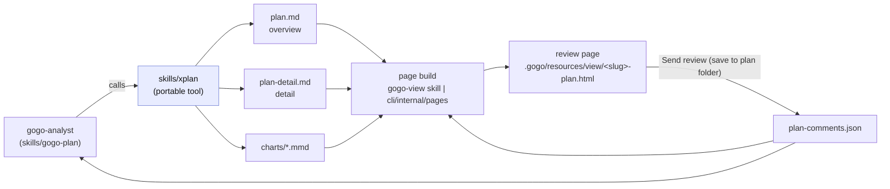

# Plan — interactive plan review (two-file plans + a commentable plan page + `xplan`)

Status: awaiting acceptance

**Planning becomes a reviewable artifact.** Today a gogo plan is one long `plan.md`
that you read top-to-bottom and answer in chat. This change splits it into a
**high-level overview** you can grasp in a minute and a **detailed plan** that holds
every file, field and schema; renders both into **one interactive web page** where you
can **select a line and comment on it like a PR**, **comment on the diagrams**, reply
in threads, mark threads resolved, and **answer Claude's open questions inline**; and
sends the whole review back to disk as **one JSON file the analyst reads and answers**.
The whole mechanism lands in **its own portable folder (`skills/xplan/`)** so gogo
only calls it and it can be lifted out later. **The terminal view does not change.**

---

## Goal

Make planning **interactive and configurable**: a two-document plan (high-level +
detailed), a web plan page that supports **PR-style line comments, threaded replies,
resolve/open state, diagram comments and inline answers to Claude's questions**,
persisted as a **separate comments JSON** that the LLM can read and answer — with the
planning mechanism factored into a **separate, portable tool** gogo merely invokes.

**Acceptance signal.** For a real feature: `/gogo:plan` writes `plan.md` (overview) +
`plan-detail.md` (detail); `/gogo:view <slug>:plan` opens ONE page carrying both docs
and their diagrams; selecting a line opens a comment box; a reply and a Resolve work;
a diagram gets a comment; Claude's open questions render as options + free text;
pressing **Send review** produces `plan-comments.json`; the analyst re-entered on that
slug reads it, **answers every open thread in the same file**, revises the plan, and
the reopened page shows the AI replies — with any comment whose line moved listed in
the page's **global comments** section rather than lost. `gogo view` in the terminal
prints the same markdown it prints today, byte-for-byte.

---

## Context — what exists today

**Plans are one file, and its path is a frozen contract.** `plan.md` at
`.gogo/work/feature-<slug>/plan.md` is read by every phase
(`skills/gogo-implement|review|test|knowledge/SKILL.md`), presented by
`skills/gogo-accept/SKILL.md`, listed by `cli/internal/contract/files.go` `Artifacts`,
and **gated on** by `cli/internal/contract/contract.go` — `PlanSections` /
`planWritten` / `Feature.PlanUnwritten` / `PlanUnwrittenReason` (a plan counts as
written at **`PlanSectionsRequired = 2`** `## ` sections). `docs/cli-contract.md` §1
calls it *Guaranteed (from plan ①)* and **monotonic** — nothing deletes it.
`skills/gogo-view/SKILL.md` states the rule outright: *"do not move `plan.md` into a
`plan/` folder — its path is the contract every phase reads."*

**There are TWO page builders, and they must stay in step.**

| Builder | Where | Used by |
|---|---|---|
| Skill (LLM pre-renders the markdown) | `skills/gogo-view/SKILL.md` | `/gogo:view` |
| Go (goldmark) | `cli/internal/pages/pages.go` | `gogo view -w`, board `w`, plans-tab `w` |

Both fill the same template `assets/vnm/viewer.template.html` (tokens
`GOGO_VIEW_SUMMARY`, `GOGO_VIEW_DIAGRAMS`, `GOGO_VIEW_LAYOUTS`, `GOGO_VIEW_LAYOUT`,
`GOGO_VNM_SRC`, `GOGO_VIEWER_SRC`, `GOGO_VIEWER_CSS`) and load two classic scripts at
end-of-body: the vendored `vnm-browser.js` then `assets/vnm/viewer.js`. Bundles are
described by `pages.Bundle{Name,Title,MarkdownPath,DiagramDir,BeforeDir,ManifestPath}`
and built at three call sites: `cli/view.go` `featureBundle`, `cli/internal/tui/drill.go`
`bundleFor`, `cli/internal/tui/plans_tab.go` `planBundleFor`. The Go copy of the assets
is a `go:embed` duplicate kept byte-identical by `cli/Makefile` `sync-assets`.

**The page is completely offline and completely read-only.** It opens over `file://`;
`fetch()` and ES modules are blocked there, which is why layouts are prebuilt in Node
(`assets/vnm/layout.mjs`) and inlined. **There is no server anywhere in the product** —
`grep -rn "net/http" cli/` returns nothing. The only thing the page persists today is
dragged node positions, to `localStorage` (`gogo-view:layout:<key>`), plus an
export-to-`layout.json` download.

**The diagram runtime already exposes node identity — for flowcharts.**
`assets/vnm/vnm-browser.js:7701` sets `card.dataset.id = nd.id` on every flowchart node
(`div.vnm-node[data-id]`), so per-node anchoring is available by DOM delegation with
**no renderer change**. A **sequence** diagram is different: `buildSequencePayload`
returns `svg: renderSequenceSvg(...)` — a static SVG inside a pan/zoom shell, with no
per-element handles. Class/state mounts do query `g[data-id]`, so they are probably
addressable too, but that is unverified.

**Project plans are a second, parallel plan surface.** `cli/internal/plans/plans.go`
stores one markdown file per plan at
`~/.gogo/projects/<name>/.gogo/plans/<plan-id>.md` (front-matter + body), authored by
`skills/gogo-project-plan/SKILL.md`, rendered by the same `pages` package
(`planBundleFor`, no diagrams). The user's brief covers this surface too.

**Open questions live in prose.** `decisions.md` (from `templates/decisions.template.md`)
is a human audit log — `## D<n>`, Options, gogo recommends, `Status: OPEN`, then a
`### RESOLVED (user, <date>)` block. Nothing machine-readable renders it.

---

## Functional requirements

| # | Requirement |
|---|---|
| **FR1** | A plan is **two markdown documents**: `plan.md` (**overview**, the unchanged contract path) and `plan-detail.md` (**detail**). `plan-detail.md` is **optional** — its absence is a legacy single-file plan, handled byte-for-byte as today. |
| **FR2** | The **overview** opens with a short "what this plan is about" paragraph, then **main changes at a high level**, the **architecture / sequence / component / actor / use-case diagrams** the change warrants, **risks**, **pros and cons of the chosen approach**, and closes with a **link to the detailed plan**. The **detail** carries the file-by-file changes, new fields, schemas, and tests. |
| **FR3** | The plan page lets a reader **select a line of plan text and attach a comment**, PR-style (GitHub/Bitbucket), on **both** documents. |
| **FR4** | Comments are **threads**: replies to comments, and a per-thread status **open / resolved**. |
| **FR5** | **Diagrams are commentable**: every diagram carries a per-diagram thread, and — where the mounted DOM exposes a node id (`div.vnm-node[data-id]`, the flowchart family) — a **per-node** thread. Kinds without addressable elements degrade to per-diagram. |
| **FR6** | Comments persist in a **separate JSON file** governed by a schema: anchor + body + `replies[]` + `status` + author. One file per plan, covering both docs and the diagrams. |
| **FR7** | A comment whose anchor can no longer be resolved after a plan edit is **never lost**: it moves to a **global comments section at the bottom** of that document's part of the page, marked *outdated*, keeping its original quoted line. |
| **FR8** | The user can **send the review** — the browser-side state is **saved directly into the plan's own folder** (`.gogo/work/feature-<slug>/` for work items, `~/.gogo/projects/<name>/.gogo/plans/` for project plans), offline, with no network. Direct save uses the File System Access API (a one-time folder grant, handle remembered); where the browser lacks it, the page degrades to a named download and prints the exact destination path. |
| **FR9** | The **analyst can answer**: re-entering planning on a slug, it reads every open thread, appends an **`ai`-authored reply**, resolves what it addressed, revises the plan, and logs the delta in `adjustments.md`. |
| **FR10** | **Claude's open questions render in the page** as a **choice of options + a free-text field**; the answers ride back in the same JSON and are folded into `decisions.md` by the analyst. |
| **FR11** | **The terminal view is unchanged.** `gogo view` / the drill-in glamour viewers print the same markdown they print today. No TUI work in this item. |
| **FR12** | The mechanism (plan-document spec + templates + comments contract + review-page layer) lives in **one self-contained folder, `skills/xplan/`**, which gogo **calls**; it carries no gogo-specific paths and can be copied to another project's `.claude/skills/` as-is. |
| **FR13** | **Project plans** (`~/.gogo/projects/<name>/.gogo/plans/<plan-id>.md`) get the same two-document shape and the same review page, with their comments beside them. |

---

## Approach

### The shape in one picture



### The four decisions that shape it

**1. `plan.md` stays where it is; the detail is an additive sibling.** `plan.md`
becomes the overview and keeps its path, its `PlanSections >= 2` gate and its
`Guaranteed (from plan ①)` status; `plan-detail.md` is a new **optional** file. Every
one of the ~30 work items already on disk keeps working unchanged, and the frozen
contract stays **additive** — the same discipline every release since 0.10.0 has held.
Moving `plan.md` under a `plan/` folder is explicitly forbidden by the contract and by
`gogo-view`, and would touch every reader at once.

**2. The round trip saves straight to the plan's folder — no server (D1, user-decided).**
This is a local, single-user tool, so **Send review** writes `plan-comments.json`
**directly into the work folder** (work items) or the **project plan folder** (project
plans). Mechanically: the page asks once for the plan folder via the **File System
Access API** (`showDirectoryPicker`, secure-context on `file://` in Chromium), persists
the granted handle, and every later send is a silent in-place save. On a browser
without the API the page degrades to a `Blob` download named
`<slug>-plan-comments.json` and prints the exact destination path; the analyst also
checks `~/Downloads` read-only as a courtesy. A local HTTP server (`gogo view
--serve`) stays the named follow-up — it is a new capability (no `net/http` in `cli/`
today) and nothing in the loop depends on it.

**3. The review layer composes with the renderer; it does not replace it.** The page
gains a third asset — `review.js` + `review.css` from the tool folder — loaded after
`viewer.js`. Line anchoring works because the summary is emitted with **line-addressed
spans**; diagram anchoring works by delegating clicks to the existing
`div.vnm-node[data-id]` cards. `vnm-browser.js` is untouched. Conveniently,
`pages.ensureResources` already copies **any** `.js`/`.css` in the embedded assets dir
into `.gogo/resources/viewer/`, and `//go:embed assets` picks up new files
automatically — so the Go side needs only the `Makefile` / `go:generate` copy list
extended.

**4. Anchors are content-addressed, and orphans are a designed outcome.** A comment
stores `{doc, line, hash, quote, contextHash}`. Resolution at render time is: exact
hash at the recorded line → unique hash anywhere in the doc (re-anchor, show *moved*)
→ **orphan** (global section, marked *outdated*, quote preserved). Resolution is a pure
function of (document, comments) computed in the page, so **neither page builder has to
write anything** and the CLI keeps its "never mutates pipeline state" invariant.

### Pros and cons of this approach

| | |
|---|---|
| **Pro** | Nothing existing breaks: additive file, additive JSON, additive page assets; every legacy plan renders exactly as today. |
| **Pro** | No new dependency, no server, no network — the page still opens by double-clicking a file. |
| **Pro** | Per-node diagram comments come **free** from a runtime property that already exists (`card.dataset.id`), with zero renderer changes. |
| **Pro** | The tool folder is created **up front**, so "extract it later" is a copy, not a refactor. |
| **Con** | The direct save needs one-time folder-grant UX (File System Access API); non-Chromium browsers fall back to a download until the follow-up server lands. |
| **Con** | Two page builders must both learn the new tokens — a known drift trap in this repo (the 0.29.0 lesson: a rule stated in two places is one constant). Mitigated by a `pages` golden test and a skill/Go parity test. |
| **Con** | The overview/detail split is prose discipline enforced on an LLM; a lazy analyst can still write one fat overview. Mitigated by templates + a section check, not by a hard gate. |
| **Con** | Per-node comments cover the flowchart family only in v1; sequence diagrams get per-diagram threads. |

### Risks

| Risk | Mitigation |
|---|---|
| **Enumeration drift** — the feature-file set is listed in `state.template.md`, `docs/cli-contract.md` §1, `README.md`, `contract.Artifacts`, and five skills. | Slice 1 ends with a grep sweep; add `plan-detail.md` to the same test that pins `Artifacts` ordering (`contract_test.go` `TestArtifactsListing`). |
| **A phase reads only the overview and builds the wrong thing.** | The overview MUST link the detail, and ②/③/④ are instructed to read both; `gogo-implement`'s "work the Changes checklist" pointer moves to the detail file explicitly. |
| **Comment loss on edit** — the user's stated fear. | Orphans are a first-class rendered state (FR7), never a delete; the JSON is append-only in spirit (threads are never removed, only resolved). |
| **The page becomes a second source of truth.** | The markdown stays authoritative; the JSON only ever carries commentary, never plan text. |
| **Scope** — this is four features in a trench coat. | Delivered as three slices with a usable product at the end of each; the server round-trip and the standalone publish are explicit follow-ups. |
| **Parallel work in flight** — `feature-notify-only-at-user-gates` is mid-implement on `hooks/` and `cli/`. | This plan touches neither `hooks/` nor the TUI board; the `cli/` overlap is confined to `internal/pages` + the three bundle call sites. |

### Alternatives considered

| Alternative | Why not |
|---|---|
| **Keep one `plan.md` with an overview section + anchors.** | Simplest, and it fails the explicit ask for two documents; a 700-line plan stays a 700-line plan in the terminal and in `git diff`. |
| **`plan/overview.md` + `plan/detail.md`.** | Breaks the frozen contract path that every phase, the classifier, and four accept paths read. Rejected by `docs/cli-contract.md` and `gogo-view` in writing. |
| **A local server (`gogo view --serve`) as the primary round trip.** | Best UX, but it makes the review loop depend on the Go binary and adds an HTTP surface to a product that has none. Recommended as a **follow-up**, not the baseline. |
| **Download + drop-in as the primary round trip.** | Works everywhere with zero grant UX, but leaves a manual file move on every send. The user chose direct save (D1); the download survives as the automatic fallback where the File System Access API is unavailable. |
| **Comments inside the markdown (HTML comments / footnotes).** | Corrupts the artifact every phase reads, and cannot carry threads/status cleanly. The user asked for a separate JSON; the separate JSON is also the right answer. |
| **A new `/gogo:comments` slash command.** | Grows the command set 13 → 14 and its four enumerations. The existing re-entry paths (`/gogo:plan <slug>`, `/gogo:resume`, the UAT loop) already mean "fold in the user's input" — reuse them. |
| **Coordinate pins for diagram comments.** | Universal, but gogo persists dragged node positions, so a pin's meaning drifts the first time someone rearranges the diagram. |
| **A separate repo/plugin for the planning tool now.** | Maximum portability, but gogo could not dogfood it in one release. A self-contained `skills/xplan/` folder is portable *enough* (copy it into `.claude/skills/`) at a fraction of the cost. |

---

## Changes checklist

Three slices, each shippable. Build order within each slice is top-to-bottom.

### Slice 1 — the two-document plan + the `xplan` tool folder

1. **Create `skills/xplan/`** — the portable tool. `SKILL.md` (frontmatter
   `name: xplan`, `user-invocable: false`) stating the plan-document spec, the
   overview/detail split, and the review contract; it addresses its own files
   **relative to its skill base directory**, never `${CLAUDE_PLUGIN_ROOT}`, so a copy
   under `.claude/skills/xplan/` works unchanged.
2. `skills/xplan/templates/overview.template.md` — About / Main changes / Diagrams /
   Risks / Pros and cons / **Detailed plan →** link.
3. `skills/xplan/templates/detail.template.md` — Context & key code paths /
   Functional requirements / Changes checklist / Data & schema changes / Tests /
   Out of scope.
4. **`skills/gogo-plan/SKILL.md`** — Step 3 splits: `plan.md` = overview (keeping the
   required Goal / Context / Functional requirements / Approach + alternatives /
   `## Summary (TL;DR)` skeleton and the `Status:` line), `plan-detail.md` = Changes
   checklist / schemas / Tests / Out of scope; both authored via `xplan`. Restate the
   write order rule: **both plan docs before `state.md`**.
5. **`agents/gogo-analyst.md`** — same split in the agent's own brief.
6. **`skills/gogo-project-plan/SKILL.md`** — the project plan gains the same two-part
   shape (`<plan-id>.md` overview + `<plan-id>-detail.md`), with the front-matter
   contract (`targets:`, `## Source briefs`, preserved keys) untouched.
7. **Readers, in one sweep:** `skills/gogo-implement/SKILL.md` (contract inputs +
   "work the Changes checklist" now points at the detail),
   `skills/gogo-review/SKILL.md`, `skills/gogo-test/SKILL.md` (Tests section moves),
   `skills/gogo-knowledge/SKILL.md` (⑤ reconciles **both** docs to as-built),
   `skills/gogo-accept/SKILL.md` (present the overview, name the detail).
8. **`cli/internal/contract/files.go`** — `Artifacts` adds `plan-detail.md` directly
   after `plan.md` (present-only). Update `contract_test.go` `TestArtifactsListing`.
9. **`cli/internal/contract/contract.go`** — **no change**: `PlanSections` /
   `planWritten` stay keyed on `plan.md`. Add a comment saying so on purpose.
10. **Contract + docs sync:** `docs/cli-contract.md` §1 table (+ a "Changed in
    0.31.0 — additive" note), `templates/state.template.md` file legend,
    `README.md` "What gets created in your project" table.

### Slice 2 — the review page (comments in the browser)

11. **`skills/xplan/contracts/plan-comments.schema.json`** — the new contract
    (shape in *Data & schema* below), modelled on
    `templates/contracts/issues-list.schema.json`.
12. **`skills/xplan/assets/review.js`** — the review layer: line gutters + selection,
    the comment composer, threads/replies, resolve toggle, the diagram-comment
    delegation (`closest('.vnm-node')[data-id]` → per-node; the figure → per-diagram),
    anchor resolution (exact → search → orphan), the **global comments** section, the
    questions form, `localStorage` draft state, and the **Send review** download.
13. **`skills/xplan/assets/review.css`** — gutter, marker, thread card, resolved
    state, orphan block, question form. Matches `assets/vnm/viewer.css`'s dark article
    palette.
14. **`assets/vnm/viewer.template.html`** — new tokens `GOGO_VIEW_DETAIL`,
    `GOGO_VIEW_COMMENTS`, `GOGO_VIEW_QUESTIONS`, `GOGO_REVIEW_SRC`,
    `GOGO_REVIEW_CSS`; a `<article class="detail">` slot; `review.js` loaded **after**
    `viewer.js`. All new tokens default to empty/`{}` so a report page is unchanged.
15. **`cli/internal/pages/pages.go`** — `Bundle` gains `DetailPath`, `CommentsPath`;
    `BuildHTML` renders the detail with the same goldmark pass, inlines the comments
    JSON, and emits **line-addressed** summary markup. The two `.js`/`.css` additions
    need no `ensureResources` change (it already copies any `.js`/`.css`).
16. **`cli/Makefile` `sync-assets` + `cli/internal/pages/embed.go` `go:generate`** —
    add `review.js` / `review.css` to the copy list (source of truth:
    `skills/xplan/assets/`).
17. **Bundle call sites:** `cli/view.go` `featureBundle`, `cli/internal/tui/drill.go`
    `bundleFor`, `cli/internal/tui/plans_tab.go` `planBundleFor` — fill the new fields
    when the files exist.
18. **`skills/gogo-view/SKILL.md`** — the skill builder learns the same tokens and the
    line-addressed emission rule, so both builders produce the same page.

### Slice 3 — the round trip, the AI answers, and the questions

19. **Send review** — saves `plan-comments.json` **directly into the plan's folder**
    via a one-time File System Access folder grant (handle persisted, later sends are
    silent in-place saves); without the API, falls back to a download named
    `<slug>-plan-comments.json` and prints the exact destination path to drop it at.
20. **`skills/xplan/SKILL.md`** gains the **answer** procedure: read the comments
    file, for every `open` thread append a reply with `author: "ai"`, resolve what the
    revision addresses, leave genuinely-open questions open with a stated reason.
21. **`skills/gogo-plan/SKILL.md`** — a new step ahead of revision: *if
    `plan-comments.json` exists with open threads, answer them first, then revise*.
    Same round-based discipline as the UAT loop (log the delta in `adjustments.md`).
    Look for the file in the feature folder, else read-only in `~/Downloads` and copy it in.
22. **`agents/gogo-analyst.md`** — the same in the agent brief, alongside the UAT loop
    it already documents.
23. **Questions** — the analyst authors `questions[]` into the comments JSON alongside
    each `decisions.md` `## D<n>`; the page renders each as radio options + a free-text
    box; answers come back as `answer`/`answerText` and the analyst writes the matching
    `### RESOLVED (user, <date>)` block into `decisions.md`. `decisions.md` stays the
    human audit log; the JSON is only transport.
24. **Version + docs** — bump `.claude-plugin/plugin.json` and `cli/main.go` to
    **0.31.0**; README gets a short "Reviewing a plan" section; `docs/` (`flow.md`,
    `contracts.md`) note the new contract.

### Data & schema changes

**`plan-comments.json`** — one per plan, at `.gogo/work/feature-<slug>/plan-comments.json`
(work items) or `~/.gogo/projects/<name>/.gogo/plans/<plan-id>.comments.json` (project
plans):

```jsonc
{
  "schema": 1,
  "slug": "interactive-plan-review",
  "updated": "2026-07-31",
  "threads": [
    {
      "id": "C-001",
      "doc": "plan.md",              // plan.md | plan-detail.md | diagram:<stem>
      "anchor": {
        "line": 42,                   // 1-based at capture time
        "hash": "…",                  // sha256 of the normalized line
        "quote": "the literal line text",
        "node": "xplan"            // diagram threads only; "" = whole diagram
      },
      "status": "open",              // open | resolved | outdated
      "author": "user",              // user | ai
      "body": "why is this a sibling file?",
      "created": "2026-07-31T10:11:12Z",
      "replies": [
        { "author": "ai", "body": "because plan.md's path is the frozen contract.",
          "created": "2026-07-31T10:30:00Z" }
      ]
    }
  ],
  "questions": [
    {
      "id": "D1",                    // matches a decisions.md ## D<n>
      "doc": "plan.md",
      "question": "Which round-trip mechanism?",
      "options": [ { "key": "A", "label": "download + drop-in" },
                   { "key": "B", "label": "local server" } ],
      "recommend": "A",
      "answer": "",                  // the chosen key, filled in the page
      "answerText": ""               // free text, always available
    }
  ]
}
```

Rules: threads are **never deleted** — resolution is a status change; `outdated` is
assigned at render time, not stored; ids are `C-<nnn>`, never reused; unknown keys are
ignored by readers (forward-compatible).

---

## Tests

Levels per `.gogo/knowledge/test-strategy.md` — artifact-level for the skills, Go
unit/golden for `cli/`, and a real browser drive for the page.

| Level | What is verified |
|---|---|
| **Go unit / golden** (`cli/internal/pages/pages_test.go`) | A bundle with a detail + comments renders both articles, inlines the JSON, emits line-addressed spans, leaves **no unreplaced token**, and contains **no `http(s)://`**. A bundle with **neither** produces a page byte-identical to today's (the backward-compat pin). |
| **Go unit** (`cli/internal/contract/contract_test.go`) | `Artifacts` lists `plan-detail.md` right after `plan.md` when present, and is unchanged when absent. `PlanSections` still keys on `plan.md` only (a detail-only folder is still "unwritten"). |
| **Go source-scan guard** | The `sync-assets` copy list and the `go:generate` line name **every** file in `skills/xplan/assets/` — the drift guard for the two-builder trap (fails loudly on an empty scan). |
| **Artifact / dogfood** | `/gogo:plan` on a scratch goal produces both docs with the required sections and a working detail link; `/gogo:accept` presents the overview; ② reads the detail's checklist; ⑤ reconciles both. |
| **Browser (Playwright MCP)** | Open a built page over `file://`: click a line → composer opens → save → marker + thread appear; reply; resolve; click a flowchart node → per-node thread; click a sequence figure → per-diagram thread; answer a question (option + free text); **Send review** downloads a JSON that validates against the schema. |
| **Orphan behaviour** | Edit the plan (insert lines above, reword a commented line), rebuild the page, assert: shifted comment re-anchors; reworded comment appears in **global comments** as *outdated* with its original quote; **nothing is lost**. |
| **Round trip** | Drop the JSON in, re-enter planning, assert every open thread gains an `ai` reply, resolved threads are marked, `adjustments.md` records the delta, and answered questions land as `### RESOLVED` blocks in `decisions.md`. |
| **Terminal unchanged (FR11)** | `gogo view <slug>:plan` (no `-w`) prints the same markdown as before; the drill-in artifact list gains one row and nothing else changes. |
| **Gates** | `gofmt -l .` clean · `go vet ./...` clean · `go test -race ./...` green, including `TestCLICommandEnumerationInSync` and `TestSkillsBashNoUnsafeRm`. |

---

## Out of scope

- **Any TUI/terminal change** (FR11) — no board column, no new key, no new status enum
  value. The `⏸ N comments` cue on a card is a follow-up.
- **A local HTTP server / `gogo view --serve`** — the frictionless round trip. Named as
  the first follow-up work item; see decision **D1**.
- **Publishing `xplan` as a standalone marketplace skill / separate repo** — the
  folder is built to be liftable; actually lifting it is a packaging item.
- **Per-node comments on sequence diagrams** (static SVG, no element handles) and on
  class/state (unverified) — per-diagram threads cover them in v1.
- **Editing plan text in the browser** — the page reviews, it does not author. Same
  stance as the viewer's existing "no label editing" rule.
- **Multi-user / concurrent review, auth, or comment merge** — single-user, one JSON.
- **Changelog/report pages gaining comments** — the review loop belongs to planning.
- **Any change to `vnm-browser.js`** — the vendored renderer stays untouched.
- **A new slash command** — the command set stays at 13 (decision **D7**).

---

## Summary (TL;DR)

- **What:** plans become **two documents** — a high-level overview (description, main
  changes, diagrams, risks, pros/cons, link to the detail) and a detailed plan — both
  rendered into **one interactive web page** with **PR-style line comments, threaded
  replies, open/resolved status, diagram comments, and inline answers to Claude's
  questions**, persisted as **one `plan-comments.json`** the analyst reads and answers.
- **Why:** planning is where design is decided, and today it is a wall of text you can
  only answer in chat — there is no way to point at *that line* or *that box* and ask.
- **How:** additive everywhere — `plan.md` keeps its frozen path and gains an optional
  `plan-detail.md`; the page gains a `review.js`/`review.css` layer over the untouched
  vendored renderer; per-node diagram anchoring comes free from `card.dataset.id`; the
  round trip **saves the JSON straight into the plan's folder** — work folder for
  work items, project folder for project plans — with a download fallback (a local
  server is the named follow-up). All of it lives in **`skills/xplan/`**, a
  self-contained folder gogo merely calls, so lifting it out later is a copy rather
  than a refactor.
- **Shape:** **three slices** — (1) two-document plans + the tool folder, (2) the
  commentable page, (3) the round trip + AI answers + questions. **The terminal view
  does not change.**
- **Next:** accept this plan (8 open decisions in `decisions.md` want your call — above
  all **D1**, the round-trip mechanism), then `/gogo:go`.
