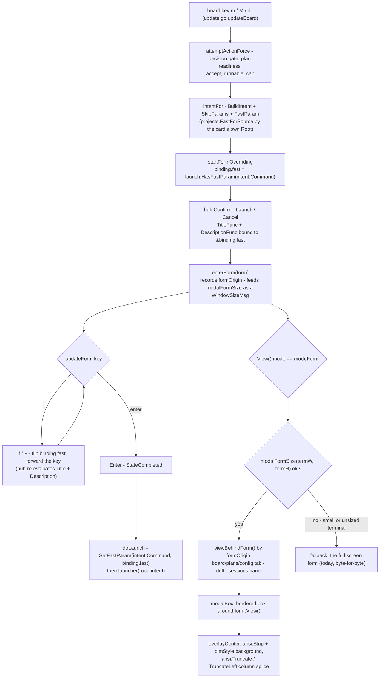

# Plan — launch-confirm-modal-and-fast-toggle

Status: **as-built** (shipped as 0.36.0, 2026-08-02; accepted with D1=B three-option select, D2=B launch-confirm only, D3=A dimmed backdrop, D4=A formOrigin — see *As built* below for the deltas the review/test rounds drove)

## As built (0.36.0) — deltas from the drafted approach

The plan below is the accepted contract; four things shipped differently, all logged
in [adjustments.md](./adjustments.md) and the issues lists:

- **D1=B, refined by REV-001:** the go confirm is the three-option Select (`Launch` /
  `Launch --fast  (token-lean gogo-fast)` / `Cancel`) — but the exact command lives in
  the **title**, re-evaluated **live** via `TitleFunc` as the selection moves (huh sizes
  a Select one *pre-wrap* row per option, so a command-carrying label pushed `Cancel`
  out of view at realistic slugs/widths). One producer holds: title and `doLaunch` both
  build the command through `launch.SetFastParam`.
- **D2=B is the form SITE:** the modal composites the one `m`/`M`/`d` launch-confirm
  site — ship and accept confirms included; `P` and the other 14 sites stay
  full-screen (REV-002, documented in docs/cli-contract.md).
- **The modal minimum is 60x15, not 60x12** (REV-006 — measured with a real-length
  repo root wrapping the title); below it, or unsized, the render is the old
  full-screen form byte-for-byte, and huh's default-width truncation there is
  pre-existing 0.35.0 behaviour.
- **The `M` FORCING note is compressed** to the cap + blocking slugs (`forcingNote`) —
  the bounce's remedy tail advises a gate already passed and cost the options their
  rows at small sizes. The merged-ship modal at exactly 60x15 shows its Launch/Cancel
  row after one Enter (focus-follow; pinned by test, TEST-001 accepted as-designed).

The f-toggle prose in FR2/FR3 below reads as drafted (D1=A); the accepted D1=B Select
supersedes it — FR2's "f flips it" became "the selection flips it, title updates live".

**In one sentence:** the cockpit's launch confirmation **replaces the whole screen** with a
bare huh form (which is why it reads as "a new window opened"), and it can only launch at
whatever speed the *source config* says — so this change renders **every** cockpit form as a
**centered box composited over the view it was opened from**, and gives the `/gogo:go`
confirm a **per-launch fast toggle** whose state is visible in the command line it is about
to run.

## Goal

Two linked changes to the board's launch confirmation, both from the user's own words:

> *"we also need to add fast option here too... also this move look bit weird, can we open
> terminal modal and select option we want to move it? instead opening new window? does
> there is modal option in terminal?"*

1. **A per-launch FAST option.** The `m`/`M` confirm must let the user choose `--fast` for
   **this run**, seeded from the source's `fastMode` config (0.34.0) but overridable either
   way, with the shown command line updating to match.
2. **A real modal.** The confirm must render as a **bordered box over the still-visible
   board**, not as a full-screen replacement that blanks the rest of the terminal.

**Acceptance signal:** on a real terminal, pressing `m` on a card draws a framed dialog in
the middle of the screen with the board still readable (dimmed) around it; `f` flips the
launch between full and fast and the `will run: claude "/gogo:go <slug> --fast"` line
changes with it; a bare **Enter still launches** exactly the command shown.

**Answering the user's question directly:** no, a terminal has **no native modal**. A TUI
"modal" is always a **composite** — you render the background, render a box, and splice the
box's cells over the background's. That is what this plan builds, and the technique's
constraints (width/height clamping, a small-terminal fallback) are stated below rather than
discovered later.

## Context — what exists today

The cockpit is the Go TUI in `cli/internal/tui/` (Bubble Tea + lipgloss + huh, styles
precomputed at init). Repo at **0.34.0**; **0.35.0 is taken by `card-selection-border`**,
which is mid-implement in this working tree — see *Baseline* below.

### The confirm's render path — full-screen by construction

| # | Where | What happens |
|---|---|---|
| 1 | `cli/internal/tui/update.go:287` (`m`) / `:292` (`M`) / `:294` (`d`) | key → `launchAction` / `launchForce` |
| 2 | `cli/internal/tui/move.go:381-409` `launchActionForce` | guard chain → bounce, or `startFormOverriding` |
| 3 | `cli/internal/tui/move.go:421-465` `startFormOverriding` | seeds `m.binding = &formBinding{confirm: true}` (`:442`), builds the `huh.NewConfirm()` (`:453-461`) titled by `confirmSummary`, then `m.form = newForm(...)` (`:463`) and **`m.mode = modeForm`** (`:464`) |
| 4 | **`cli/internal/tui/view.go:26-30`** | **`case modeForm: return "\n" + m.form.View() + "\n"`** — the ENTIRE screen is the form. Nothing else is drawn. |

Step 4 is the whole defect. There is no compositing anywhere in the codebase (`lipgloss.Place`
is unused; lipgloss v1 ships no layer/canvas API), so a form has always meant "the board
disappears".

**Every other form shares that one render site.** All **16** form entries assign
`m.mode = modeForm` and are drawn by that same three-line `case` — `config_tab.go:101/130/148`
(source add/edit/remove, project colour), `delete.go:47` (`x` trash), `move.go:464` (launch),
`plans_tab.go:444/665/971/1085` (project-UAT, spawn, mint, plan-with-claude),
`session_ops.go:203/321/473/522` (`P` plan session, `R` adopt, panel re-assign, panel kill),
`update.go:758/814/843` (attach picker, kill confirm, kill picker). So the modal is **one
change at one site**, not sixteen.

### The confirm's text + the fast plumbing

`confirmSummary` (`move.go:467-482`) builds one line:

```
will run: claude "<command>"  in tmux session <name>  at <root>  · permission: auto (classifier)
```

`intentFor` (`move.go:277-286`) is what puts `--fast` in `<command>` today — for an
`ActionGo` intent only, resolved through `projects.FastForSource(m.capWatchSources(), in.Root)`
and rendered by `launch.FastParam` (`cli/internal/launch/launch.go:411-422`). **There is no
per-launch override anywhere**: the config decides, the confirm displays, the user can only
accept or cancel. `launch.Intent.Session` is computed by `BuildIntent` from action+slug, so
appending or removing ` --fast` changes **only** `Command` — never the session name.

`confirmSummary` has a **second caller**: the `P` plan-session confirm
(`session_ops.go:197`), whose intent is `ActionPlan` — the plan leg never carries `--fast`.

### Facts the design must respect (all verified against the code)

- **`newForm()` is the ONE construction site** (`model.go:151-158`), guarded by the
  source-scan `TestNewFormIsTheOnlyFormConstructionSite` (`plans_tab_test.go:1442-1481`).
  A second choke point must follow the same pattern, not compete with it.
- **The Model is a value copied on every Update (TEST-001)** — huh field targets must live
  behind the heap-stable `*formBinding` (`model.go:94-131`), and **every** `tea.Msg` (not just
  keys) must reach a live form (`update.go:202-210`), because huh's own protocol is async.
- **The CONFIRM-DEFAULT CONVENTION** (canonical statement in `move.go:421-441`): a forward
  move seeds `confirm: true` so **Enter submits**. `TestConfirmDefaultForwardMovesSubmitOnEnter`
  (`confirm_default_test.go:36-50`) drives a **bare Enter** on the board confirm and asserts the
  launcher fired **exactly once**. Any design that inserts a field *before* the Launch/Cancel
  confirm turns one Enter into two and **fails that test** — correctly.
- **`pickerOrigin`** (`model.go:363-368`) exists because inferring the return mode from
  `m.drill != nil` was stale. Origin is **recorded, never inferred** — the modal's background
  must obey the same rule.
- **Colour is never the only cue** (`non-functional-requirements.md`, Diagnosability): under
  `go test` there is no TTY and lipgloss flattens every style, so a state must be carried by a
  **word or a glyph** to be assertable in `View()`.
- **`TestBoardKeyHelpInSync`** (`key_help_sync_test.go`) AST-parses the `switch msg.String()`
  of `updateBoard` / `updateDrill` / `updateSessions` only. A key handled inside `updateForm`
  is **outside** that guard — which is a reason to document it deliberately, not a licence to
  leave it undocumented.

### Measured, not assumed — three probes against the pinned deps

Run against the exact pinned versions (`huh v1.0.0`, `lipgloss v1.1.1-0.20250404203927`,
`x/ansi v0.11.6`) in a scratch module using this repo's own `go.sum`:

| # | Question | Measured answer |
|---|---|---|
| P1 | Does `Form.WithWidth(w)` alone give a correct narrow layout? | **No.** After the form has already seen a wide `WindowSizeMsg`, `WithWidth(72)` **truncates** the title (`…at /re`) because the group height was computed for the wide layout. With **no** size message at all it wraps but **loses the `Launch  Cancel` row entirely**. `WithWidth` is a trap here. |
| P2 | Does feeding the form a **smaller `WindowSizeMsg`** work? | **Yes.** `Update(tea.WindowSizeMsg{Width:72, Height:40})` on a form whose `f.width == 0` wraps the title over two lines, keeps the description **and** the buttons, and reports `w=72 h=7`. huh recomputes width *and* height in the same pass (`form.go:533-556`), and `f.height` is only ever set by an explicit `WithHeight`, so **every** size message recomputes. |
| P3 | Can the confirm's title change live as a bound value flips? | **Yes.** `Confirm.TitleFunc(fn, &binding.fast)` + `DescriptionFunc(fn, &binding.fast)` (`field_confirm.go:116-134`) re-evaluate whenever the bound value's hash changes; `Group.Update` broadcasts `updateFieldMsg` to **every** field on **every** update (`group.go:270`). Probe output shows `--fast` appearing in the rendered title and `speed: ⚡ FAST …` in the description after the flip. |

Two more facts that decide the overlay technique:

- **`lipgloss.Width` IS `ansi.StringWidth`** (`lipgloss/size.go:8-24`) — so cutting columns
  with `x/ansi` can never disagree with how lipgloss measured the board.
- **`github.com/charmbracelet/x/ansi` is already compiled into `internal/tui`**
  (`go list -deps ./internal/tui` lists it, via lipgloss). Importing it directly costs a
  `go.mod` require-block move and **zero** new download or supply-chain surface.

### Baseline

`go build ./...` **clean**, `go vet ./internal/tui/` **clean**, `gofmt -l .` **clean**,
`go test ./internal/tui/` **green (6.9s)** — measured just now, with
`feature-card-selection-border` mid-implement in the tree (`styles.go` + `view.go` modified).
That is a *snapshot*, not a gate: this feature is **sequenced after card-selection-border
lands** and plans against **its plan** as the baseline (`focusBorder`/`cardFocusedSelected`
exist, card frames are border-only, `changelogFocusStyle` is gone). None of those symbols are
touched here — the overlap is zero — but the **build gates must be re-measured on the merged
tree** before implementing.

## Functional requirements

### Group A — the per-launch fast toggle

| FR | Requirement |
|---|---|
| **FR1** | The board's `/gogo:go` launch confirm (`m` / `M` on a plan- or in-progress card) carries a **per-launch fast toggle**, **seeded** from the effective command `intentFor` already built — so the seed and the source's `fastMode` config agree **by construction**, with no second resolver. |
| **FR2** | **`f`** (and `F`) flips it while the confirm is open. The confirm's **title shows the effective command line** — `claude "/gogo:go <slug> --fast"` vs `claude "/gogo:go <slug>"` — and updates **live** with the flip. |
| **FR3** | The confirm's **description states the speed in words** plus the key that changes it: `speed: fast — token-lean gogo-fast pipeline · f toggles` / `speed: full pipeline · f toggles fast`. Words, not colour: it survives a no-colour terminal and is assertable in `View()`. When `M` is forcing past a cap, the existing `FORCING past the source cap - …` note is **kept, not replaced**. |
| **FR4** | The launch runs **exactly the command the confirm showed** — the toggle is applied to `Intent.Command` through **one** producer, and the intent's `Session`/`Root`/`Slugs` are untouched. |
| **FR5** | The toggle is **per-launch only**. It **never writes** the source's `config.json`; `fastMode` on disk is unchanged, so the next launch re-seeds from the config. |
| **FR6** | **No fast toggle on a non-go confirm** — a ship (`/gogo:done`), an accept (`/gogo:accept`), the `P` plan-session (`/gogo:plan`) and every plans-tab spawn are **byte-for-byte** today's, and `f` is **not** intercepted there (typing `f` into a merged-ship release name still types `f`). |
| **FR7** | A bare **Enter still launches** — one Confirm field, `confirm: true`, the CONFIRM-DEFAULT CONVENTION untouched. `y`/`n`/`←`/`→`/`esc` behave exactly as today. |

### Group B — the modal overlay

| FR | Requirement |
|---|---|
| **FR8** | A form renders as a **centered, bordered box composited over the view it was opened from**; the background stays visible (dimmed) around it. |
| **FR9** | The background is the **recorded** origin, never inferred: a new `formOrigin` set at **one** choke point (`enterForm`) selects board/plans/config tab · drill · sessions panel. It **replaces** `pickerOrigin` — one field, so the return mode and the background can never disagree. |
| **FR10** | The form is laid out by feeding it the **modal's inner size as a `WindowSizeMsg`** (P2), from **one** producer `modalFormSize(termW, termH) (w, h int, ok bool)`. `WithWidth` is not used (P1). |
| **FR11** | **The modal can never exceed the terminal.** The height handed to huh bounds the form, and the box adds a fixed, known amount of chrome — so `lipgloss.Height(view) <= termH` and every line's width `<= termW`, at every size where a modal renders. |
| **FR12** | **Small-terminal / unsized fallback:** below the named minimums — and before any `WindowSizeMsg` has arrived (`m.width == 0`) — `View()` renders **today's full-screen form byte-for-byte** and the form receives the raw terminal size. One rule, one producer (`ok == false`), used identically for layout and for render. |
| **FR13** | The overlay is **assertable without a TTY**: in `View()` under `go test`, both the background's text and the form's text are present, and the box's border glyphs are present. |
| **FR14** | **No key-surface change** to `updateBoard` / `updateDrill` / `updateSessions` (`TestBoardKeyHelpInSync` unchanged); no new board key, no changed layout, no contract or pipeline-state change. |
| **FR15** | Cancel **and** finish return to `formOrigin` for every form — `esc`, the Cancel option, and every `finish*` path land exactly where the form was opened. |

### BDD scenarios

```gherkin
Feature: A modal launch confirmation with a per-launch fast option

  Background:
    Given the gogo cockpit board on a 200x40 terminal
    And a source "web" whose fastMode config is off

  Scenario: The confirm is a modal, not a new window (FR8, FR13)
    When I press "m" on a plan-accepted card
    Then the board's cards are still visible around a bordered box
    And the box contains "will run: claude \"/gogo:go <slug>\""
    And the box's border glyphs are present without any colour

  Scenario: Toggling fast changes the command it will run (FR1, FR2, FR4)
    Given the launch confirm is open for a source with fastMode off
    Then the shown command is "/gogo:go <slug>" with no --fast
    When I press "f"
    Then the shown command becomes "/gogo:go <slug> --fast"
    And the description reads "speed: fast"
    When I press Enter
    Then exactly one launch fires, with the command "/gogo:go <slug> --fast"

  Scenario: The seed comes from the source config, and flipping it back works (FR1, FR5)
    Given a source whose fastMode config is ON
    When I press "m" on one of its cards
    Then the shown command already carries --fast
    When I press "f" and then Enter
    Then the launch command has NO --fast
    And the source's config.json still reads fastMode: true

  Scenario: A bare Enter still launches (FR7)
    When I press "m" and then Enter with no other keystroke
    Then exactly one launch fires

  Scenario: No fast toggle where it does not apply (FR6)
    Given a ready card selected with space
    When I press "d" and then "f"
    Then the confirm shows no speed line
    And the launched command carries no --fast

  Scenario: A small terminal falls back to the full-screen form (FR12)
    Given a 46x9 terminal
    When I press "m" on a launchable card
    Then the view is exactly the full-screen form it renders today
    And no board text and no box border are drawn

  Scenario: The modal opens over where it was opened from (FR9, FR15)
    Given I drilled into a card and pressed esc back to the board
    When I press "x" to delete a card
    Then the background behind the modal is the BOARD, not the drill
    And cancelling returns me to the board
```

## Approach

**Chosen: one composite render site + one form-entry choke point + one command producer.**

### 1. The overlay — strip, dim, splice

There is no native modal in a terminal; a modal is a **composite**. The technique:

1. Render the background (`m.viewBehindForm()` — see step 2) and the box.
2. For each background line, **strip its ANSI** (`ansi.Strip`) and re-render it through the
   existing `dimStyle`. Stripping is what makes the splice exact: a plain background line has
   no open SGR state to bleed into the box, so there is no reset-injection guesswork and no
   "the box inherited the card's background colour" class of bug at all. It also produces
   precisely the dimmed-backdrop look the user described.
3. **Splice** the box's rows into the middle: for each covered row,
   `dim(left) + boxRow + dim(right)`, cutting the plain background with `ansi.Truncate` /
   `ansi.TruncateLeft` at the box's column span and padding the left part to an exact column
   count. Because `lipgloss.Width` *is* `ansi.StringWidth`, those cuts land on exactly the
   cells lipgloss drew.

This lives in **one new file**, `cli/internal/tui/modal.go`, with two pure functions
(`overlayCenter(bg, box string, w, h int) string`, `modalFormSize(termW, termH int) (int, int, bool)`)
plus the box style — all unit-testable with plain strings.

**Sizing (P1/P2).** `WithWidth` is not used: it leaves the height computed for the *previous*
width, which truncates the title or drops the Launch/Cancel row outright. Instead the form is
handed a **`WindowSizeMsg` carrying the modal's inner size**, which is the one path where huh
recomputes width *and* height together. Because the height we hand it bounds the form, the
box's total height is bounded too — FR11 holds by construction rather than by a second check.

**Constraints, stated up front:** a form clamped narrow **wraps** its title (never truncates)
and grows taller; a tall form (the plans-tab mint's Text field) is clamped by huh exactly as
it is today, just against a slightly smaller height (2 rows of chrome). Below the named
minimums the modal is not attempted at all (FR12).

### 2. `enterForm` — the second choke point

All 16 sites assigning `m.mode = modeForm` become one call:

```go
// enterForm is the ONE place a huh form becomes the active mode: it records the
// ORIGIN (the view the modal composites over and every cancel/finish returns to)
// and lays the form out at the modal's inner size. Guarded by a source scan, the
// newForm()/TestNewFormIsTheOnlyFormConstructionSite precedent.
func (m *Model) enterForm(f *huh.Form) tea.Cmd
```

It returns the `tea.Cmd` to hand back (`tea.Batch(f.Init(), sizeCmd)`), so the 16 `start*`
helpers return `tea.Cmd` and their callers `return m, m.startX(...)` instead of
`return m, m.form.Init()`. Batching rather than discarding is deliberate: huh's protocol is
async, and dropping a form's own command is precisely the TEST-001 failure this codebase
already paid for once.

`formOrigin` **replaces** `pickerOrigin` (`model.go:368`): the background and the return mode
are the same question, and this repo's own TEST-006 rule says one user-visible rule is one
constant. Verified equivalent at every existing site — every non-picker form is opened while
`m.mode == modeBoard` (the plans/config *tabs* are tabs, not modes), which is exactly what
those `finish*` paths hard-code today.

### 3. The fast toggle — one command producer, one bound value

- `cli/internal/launch/launch.go` gains the pair beside `FastParam`:
  `HasFastParam(cmd string) bool` and `SetFastParam(cmd string, fast bool) string` —
  **field-exact**, never a substring match (the TEST-005 rule), idempotent, and a no-op when
  the command already matches. `FastParam` stays; `intentFor` is **untouched**, so
  `TestBoardGoIntentCarriesFastParam` and the headless/auto-pickup paths are byte-for-byte.
- `startFormOverriding` seeds `m.binding.fast = launch.HasFastParam(intent.Command)` — the
  seed reads the command `intentFor` already resolved, so there is exactly one place that
  decides what "fast" means for this launch.
- The confirm gets `.Title(initial).TitleFunc(fn, &b.fast)` (Title first, so `title.val` is
  never empty and no "loading" flicker) and `.DescriptionFunc(fn, &b.fast)`; both call the
  same `confirmSummary` / speed-line producers.
- `updateForm` intercepts `f`/`F` **only** when the form carries a toggle
  (`m.pendingFast` set, i.e. an `ActionGo` confirm), flips the bound bool, and **still forwards
  the key to the form** — the forward is what drives huh's `updateFieldMsg` broadcast, and `f`
  is not in huh's Confirm keymap (`shift+tab`/`enter`/`tab`/`h`/`l`/`←`/`→`/`y`/`Y`/`n`/`N`), so
  forwarding is inert.
- `doLaunch` applies `launch.SetFastParam(intent.Command, m.binding.fast)` — the same producer
  the title rendered from, so **what launched is what was shown** (FR4) by construction rather
  than by agreement.

### Alternatives considered

| Alternative | Why not |
|---|---|
| **A second huh `Confirm` field ("Fast mode?") before Launch/Cancel** | Turns the one-keystroke `m`→Enter launch into two Enters and **fails `TestConfirmDefaultForwardMovesSubmitOnEnter`** — the convention's canonical guard. Rejected on measured behaviour, not taste. |
| **Replace the Confirm with a 3-option Select (`Launch` / `Launch --fast` / `Cancel`)** | Closest to the user's literal "select option we want", and keeps one Enter. But it retires `binding.confirm` as the discriminator for one form only, loses `y`/`n`, and makes the forward/destructive convention state two shapes. **Kept as fork D1-B** — it is a real choice, not a strawman. |
| **`Form.WithWidth(w)` to size the modal** | **Measured broken** (P1): truncates the title, or drops the Launch/Cancel row when no size message follows. |
| **ANSI-aware splice that PRESERVES the background's colours** | Prettier, but it must cut styled lines mid-SGR and re-open the state on the right-hand fragment — the bleed-bug class this design deletes outright. **Fork D3-B.** |
| **Only band the middle rows (no left/right background)** | Avoids column cutting entirely, but leaves blank gutters beside the box — it looks like a stripe, not a modal, and only saves ~15 lines. |
| **Hand-roll an ANSI stripper instead of importing `x/ansi`** | Re-implements a parser that is already **linked into this binary** via lipgloss. Zero download saved, real edge cases bought. |
| **Add `--fast` to the headless `gogo go`** | A **command-surface change** (`TestCLICommandEnumerationInSync`, the contract's "no command-surface change" claims) for a path that already reads the config. Out of scope; noted as a fast-follow. |
| **Persist the toggle back to `config.json`** | Silently rewriting a source's config from a launch dialog is a surprising, invisible write. The config tab already owns that field. |

## Intended design



The as-is baseline — the full-screen `case modeForm` and the config-only fast resolution —
is captured separately in `charts/before/flow.mmd`.

## Changes checklist

In build order. Everything is inside `cli/` except steps 8-9.

1. **`cli/internal/launch/launch.go`** — beside `FastParam` (`:411-422`) add
   `FastToken` (the literal `--fast`), `HasFastParam(cmd) bool` and
   `SetFastParam(cmd string, fast bool) string`: split on whitespace, compare the token
   **exactly** (never `strings.Contains`), append at the end when adding. `FastParam` and
   every existing caller unchanged.
2. **`cli/internal/tui/modal.go` (new)** — `modalFormSize(termW, termH) (w, h int, ok bool)`
   with its named minimums and margins as consts; `overlayCenter(bg, box string, termW, termH int) string`;
   `modalBoxStyle` (rounded border in `subtleBorder`, `Padding(0, 1)`). Pure, no Model.
3. **`cli/internal/tui/model.go`** — add `enterForm(f *huh.Form) tea.Cmd` next to `newForm`
   (same doc-comment shape, naming the guard); rename `pickerOrigin` → `formOrigin` and set it
   **only** in `enterForm`; add `fast bool` to `formBinding` (heap-stable, TEST-001) and
   `pendingFast bool` to the Model.
4. **`cli/internal/tui/` — the 16 form sites** → `return m, m.enterForm(newForm(...))`:
   `config_tab.go:101/130/148`, `delete.go:47`, `move.go:464`, `plans_tab.go:444/665/971/1085`,
   `session_ops.go:203/321/473/522`, `update.go:758/814/843`; each `start*` returns `tea.Cmd`,
   each caller drops its own `m.form.Init()`. Delete the per-picker `m.pickerOrigin = m.mode`
   assignments (now redundant).
5. **`cli/internal/tui/move.go`** — `startFormOverriding`: seed `binding.fast` +
   `m.pendingFast` for an `ActionGo` intent; give the Confirm `.Title(...).TitleFunc(...)` and
   `.DescriptionFunc(...)` bound to `&m.binding.fast`, composing the speed line with the
   existing FORCING note. `confirmSummary` gains a variant that takes the effective command
   (one producer, both callers). `doLaunch` applies `SetFastParam`.
6. **`cli/internal/tui/update.go`** — `updateForm`: intercept `f`/`F` when `m.pendingFast`
   (flip, then forward); rewrite an incoming `WindowSizeMsg` through `modalFormSize` before
   forwarding (`:54-57`); `cancelForm`'s `returnMode` becomes `m.formOrigin` unconditionally
   (`:638-641`) and every `finish*` uses it; clear `pendingFast` wherever the other `pending*`
   fields are cleared (the recorded five-place `pending*` contract: field · dispatch ·
   returnMode · clear · preserve).
7. **`cli/internal/tui/view.go:26-30`** — the composite: `modalFormSize` → box + `overlayCenter`
   over `viewBehindForm()`, else today's string. Extract `View()`'s `default:` branch into
   `viewTab()` so `View` and `viewBehindForm` share **one** producer.
8. **Docs** — `README.md` (the "Moves launch Claude" bullet: the confirm is a modal over the
   board; `f` toggles `--fast` per launch, seeded from `fastMode`, never written back);
   `skills/gogo-cli/SKILL.md` (the fast-mode section: config default + per-launch override);
   `cli/main.go` `printHelp` (a line under the board keys naming the confirm's `f`);
   `docs/cli-contract.md` (a **"Changed in 0.36.0 — presentation/interaction only"** note, the
   0.19.0/0.20.0 pattern: no `.gogo/` key, no command surface, no classifier input).
9. **Version bump** (behavioural change) — `.claude-plugin/plugin.json` `version` → **0.36.0**
   and `cli/main.go:23` `Version = "0.36.0"`.
10. **`go.mod`** — `github.com/charmbracelet/x/ansi` moves from the indirect block to the
    direct require block (`go mod tidy`). No new module, no `go.sum` change.
11. **Gates** — `cd cli && gofmt -l . && go vet ./... && go test -race ./...`, re-measured on
    the tree **with `card-selection-border` merged**.

## Tests

**Level: Go unit tests in `package tui` and `package launch`** — the level where the defect
lives, driving real `View()` / `Update()` output with no TTY. Plus one manual terminal pass,
which is phase ④'s job.

New `cli/internal/launch/fast_param_test.go`:

| Test | What it pins |
|---|---|
| `TestSetFastParamRoundTrips` | `Set(Set(c,false),true) == c` for a command `intentFor` really produces (incl. one carrying `--skip-acceptance --skip-uat`); idempotent in both directions. |
| `TestFastParamMatchedExactlyNeverBySubstring` | A command whose text merely *contains* `fast` (e.g. a slug `fast-path`) is untouched — the TEST-005 rule applied to a token. |

New `cli/internal/tui/launch_modal_test.go`:

| Test | What it pins |
|---|---|
| `TestLaunchConfirmSeedsFastFromSource` | `fastMode: true` source → the confirm opens with the toggle **on** and the title already showing `--fast`; a plain source → off. Seed agrees with `intentFor`. |
| `TestFastToggleChangesTheLaunchedCommand` | `m` → `f` → Enter fires the recording launcher **exactly once** with `--fast`; and from a fast source, `m` → `f` → Enter fires **without** it. |
| `TestFastToggleShowsInTheConfirm` | After `f`, the rendered form contains `/gogo:go <slug> --fast` **and** the word `fast` in the speed line; before it, neither. Colourless render — the word is the cue. |
| `TestFastToggleDoesNotWriteSourceConfig` | Toggle + launch, then re-read the store: `Source.FastMode` unchanged (FR5). |
| `TestNoFastToggleOnNonGoConfirms` | Ship / accept / `P` plan-session confirms show no speed line, and `f` reaches the form (a merged-ship release-name Input still receives the character). |
| `TestBareEnterStillLaunchesOnce` | The CONFIRM-DEFAULT guard, re-asserted at the new shape (`confirm_default_test.go` must also stay green **unchanged**). |
| `TestFormRendersAsModalOverItsOrigin` | At 200x40 the `modeForm` view contains a background card's slug **and** the confirm's text **and** the box border glyph. |
| `TestModalBackgroundFollowsRecordedOrigin` | Drill → esc → board → open a form: the background is the **board**. Open from the drill: the background is the **drill**. Open from the sessions panel: the **panel**. The `pickerFromDrill` bug, generalised. |
| `TestModalNeverExceedsTheTerminal` | Over a size matrix (200x40, 120x30, 90x24, 80x20) and a form matrix (launch, merged ship, source edit, plan mint): every rendered line width `<= termW` and total height `<= termH`. |
| `TestSmallTerminalFallsBackToFullScreen` | At 46x9 and at an unsized model (`m.width == 0`), `View()` equals `"\n" + m.form.View() + "\n"` **byte-for-byte** — the fallback is the old code path, not an approximation. |
| `TestOverlayKeepsEveryFormLine` | Every line of `m.form.View()` appears in the composite (anti-clipping); **anti-vacuity:** fails if the form view has fewer than 3 lines. |
| `TestOverlayCentersAndPreservesBackgroundWidth` | Pure `overlayCenter` unit: a synthetic styled background + a box → every output line is exactly `termW` wide and the box sits centered. |
| `TestEnterFormIsTheOnlyModeFormSite` | **Source scan**: `m.mode = modeForm` appears in `model.go` only (inside `enterForm`); anti-vacuity floored on files scanned, the `TestNewFormIsTheOnlyFormConstructionSite` precedent. |
| `TestEveryFormReturnsToItsOrigin` | For each form kind: `esc` **and** the Cancel option land back on `formOrigin` (FR15) — the mutation-pinned returnMode leg 0.33.0 recorded. |

**Regression suites that must stay green unchanged:** `confirm_default_test.go` (all cases),
`key_help_sync_test.go` (`TestBoardKeyHelpInSync` — no board/drill/panel key added),
`skip_test.go` (`TestBoardGoIntentCarriesSkipParams` / `…FastParam`), `card_test.go` pickers,
`session_ops_test.go`, `sessions_panel_test.go`, `plans_view_test.go` force-confirm cases,
`plans_tab_test.go:1442` (`TestNewFormIsTheOnlyFormConstructionSite`).

> **Known blast radius to watch (flagged, not hidden).** Several existing tests assert
> substrings of `m.View()` **while a form is open** — `plans_view_test.go:748-763` and
> `:853-860` (`/gogo:go next`, `FORCING past the source cap`, `cap 1 reached`),
> `card_test.go:402-409` (the kill picker's rows), `plans_tab_test.go:1130`. The modal wraps
> the form's title at the modal width, so a break can land **inside** an asserted substring,
> and the newly-drawn background can introduce text an **absence** assertion trips on. The
> modal width must therefore be generous enough that these keep passing; where one genuinely
> cannot, **scope that assertion to `m.form.View()` — never weaken the guard**.

**Manual (phase ④, real terminal + tmux):** open the confirm at 200x50, 120x30 and 80x24;
check the board is readable around the box and nothing overflows; press `f` and watch the
command line change; launch fast and confirm the spawned session's command carries `--fast`;
run once with `NO_COLOR=1`; open the source-edit, mint, delete and kill forms to confirm they
all read as dialogs; shrink the terminal under the minimum and confirm the full-screen
fallback.

## Out of scope

- **A `--fast` flag on the headless `gogo go`** — a command-surface change; the headless path
  already reads the source config. A clean fast-follow if wanted.
- **Persisting the toggle to `config.json`** — the config tab owns `fastMode`; a launch dialog
  must not silently rewrite it.
- **Per-launch overrides of `--skip-acceptance` / `--skip-uat`** — the same shape, but the user
  asked for fast; adding gate-skips to a launch dialog is a **safety** change, not a speed one,
  and deserves its own decision.
- **The auto-pickup launch** (`pickup.go`) — unattended by design, no confirm to put a toggle on.
- **Scrolling inside a form** — huh clamps a too-tall form today and will keep clamping it;
  making forms scrollable is a separate change.
- **Restyling the forms themselves** (a huh theme) — this change frames them, it does not
  repaint them.
- **The `⚡fast` card chip, `contract.Feature.FastMode()`, the `mode: fast` state line and the
  `gogo-fast` skill** — all 0.34.0, all unchanged.

## Decisions

Four forks are worth your call; **D1** and **D3** change what you see, **D2** and **D4** change
how big the diff is. Full statements in `decisions.md`.

- **D1 — how the fast option is chosen.** **A (recommended):** keep the Launch/Cancel Confirm
  and add an `f` toggle whose state is spelled out in the description (one Enter preserved,
  smallest diff). **B:** replace it with a three-option Select (`Launch` / `Launch --fast` /
  `Cancel`) — closest to your literal words, maximally discoverable, but it retires
  `binding.confirm` for that one form and loses `y`/`n`.
- **D2 — how many forms get the modal.** **A (recommended):** **all 16**, via the one render
  site — they already share it, and the plumbing (`enterForm`) is needed either way. **B:** the
  launch confirm only — a smaller diff, but delete/kill/mint keep "opening a new window".
- **D3 — the background treatment.** **A (recommended):** **strip + dim** — deterministic,
  no ANSI bleed, and the classic dimmed-backdrop look. **B:** preserve the background's colours
  with a styled ANSI splice — prettier, but re-opens the bleed class.
- **D4 — `pickerOrigin`.** **A (recommended):** **replace** it with `formOrigin` (one field for
  one question, per this repo's TEST-006 rule). **B:** add `formOrigin` alongside — smaller
  diff, two fields meaning the same thing.

## Summary (TL;DR)

- **What:** the cockpit's launch confirmation becomes a **modal over the still-visible board**,
  and gains a **per-launch `--fast` toggle** that changes the command line it is about to run.
- **Why (root cause):** `view.go:26-30` renders `modeForm` as **the entire screen** — there is
  no compositing anywhere in the CLI — and `--fast` is decided **only** by the source's
  `fastMode` config in `intentFor` (`move.go:283`), with no per-run override.
- **How:** one composite render site (`ansi.Strip` + dim the background, splice a bordered box
  over it), one form-entry choke point (`enterForm` — records the origin, lays the form out by
  feeding it the modal's size as a `WindowSizeMsg`), and one command producer
  (`launch.SetFastParam`) shared by what the confirm **shows** and what `doLaunch` **runs**.
- **Measured, not assumed:** `WithWidth` truncates the title and can drop the Launch/Cancel row
  (**P1**); a smaller `WindowSizeMsg` lays the form out correctly (**P2**); `TitleFunc` bound to
  the toggle updates the command line live (**P3**). `x/ansi` is already linked in via lipgloss.
- **Risk:** contained to `cli/internal/tui/` + one `launch` helper — no contract, no pipeline
  state, no board key, no classifier input. The real hazards are named and tested: the
  one-Enter launch (`confirm_default_test.go` stays green **unchanged**), the size matrix, and
  the existing `View()` substring assertions the wrap could break.
- **Next:** accept this plan (four forks above — **D1** the toggle shape, **D2** the modal's
  reach, **D3** the backdrop, **D4** the origin field), then `/gogo:go` builds it as **0.36.0**,
  sequenced **after** `card-selection-border` (0.35.0) lands.
