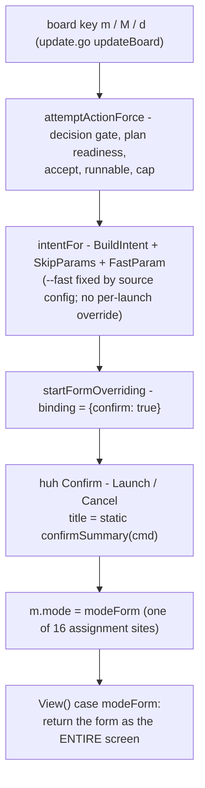
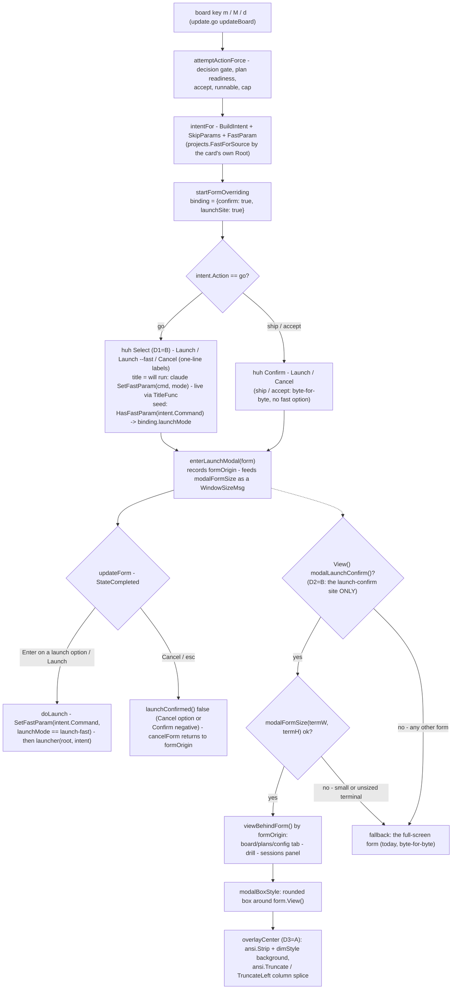

# Report — feature `launch-confirm-modal-and-fast-toggle`

- **feature:** A modal launch confirmation with a per-launch --fast toggle (0.36.0)
- **status:** awaiting-uat
- **completed:** 2026-08-02
- **branch / commits:** main (uncommitted working tree — gogo defers commits to the user)

## Run status / gaps

**All phases completed; no open issues.** Plan (accepted with 4 resolved forks) → implement (4 rounds: 1 build + 3 fix) → review (2 rounds, verdict **clean**; all 7 findings resolved, REV-001..007 `verified`) → test (1 hands-on round + a tests-only closure; TEST-001 `fixed` by its own required part) → report. Gates at hand-off: `gofmt -l` clean · `go vet` clean · `go test -race ./...` green (13 packages, 598 test functions).

## Summary

Pressing `m` on a cockpit card used to **replace the whole screen** with a bare form — reading as "a new window opened" — and a launch could only run at whatever speed the source's `fastMode` config dictated. This feature makes the launch confirmation a **real modal**: a bordered box composited over the still-visible, dimmed board. And the `/gogo:go` confirm becomes a **three-option select** — `Launch` / `Launch --fast` / `Cancel` — seeded from the source's config but overridable **per launch**, with the exact command it will run shown in the title and **updated live** as the selection moves. A terminal has no native modal; this is the classic composite (render background, strip + dim it, splice a box over it), built once as pure helpers.

## Planned vs shipped

Shipped per the accepted plan **with the D1=B/D2=B fork resolutions**, plus four review/test-driven refinements (full statements in the plan's *As built* section):

| Delta | What changed | Driven by |
|---|---|---|
| Command placement | In the Select's **title** (live via `TitleFunc`), not the option labels — a wrapped label pushed `Cancel` out of huh's row-per-option viewport | REV-001 (major) |
| Modal scope | The one `m`/`M`/`d` launch-confirm **site** — ship/accept confirms are modals too; `P` + 14 other sites stay full-screen | REV-002 / D2=B |
| Modal minimum | **60x15** (was drafted 60x12) — measured with a real-length repo root; below it the full-screen fallback is byte-for-byte 0.35.0 | REV-006 |
| FORCING note | Compressed to the cap + blocking slugs (`forcingNote`) — the remedy tail advises a gate already passed | REV-001/round 3 |

Everything else matched: seed-from-config through one resolver, per-launch-only (config never written), `formOrigin` replacing `pickerOrigin`, strip+dim backdrop, byte-for-byte fallback, no board key or contract change.

## Implementation

**The fast option (D1=B).** `launch.SetFastParam` / `HasFastParam` / `FastToken` are the one producer/matcher pair for the `--fast` token (field-exact, idempotent, TEST-005-safe). `startFormOverriding` builds a `huh.Select` for a go intent: options `Launch` / `Launch --fast  (token-lean gogo-fast)` / `Cancel`, pre-highlighted from `HasFastParam(intent.Command)` (the command `intentFor` already resolved — config and seed agree by construction), title `will run: claude "<cmd>"` re-evaluated live through the same `SetFastParam` the launch applies (`doLaunch`), so **what launches is what was shown**. Bare Enter submits the seeded option — the CONFIRM-DEFAULT convention in its Select shape, structurally pinned. The choice never touches `config.json`.

**The modal (D2=B · D3=A · D4=A).** `modal.go` holds three pure helpers: `modalFormSize` (the ONE producer for layout *and* render; min 60x15, generous 120-col form cap), `overlayCenter` (every background line ANSI-**stripped** and re-rendered dim — a plain line has no open SGR state, so nothing can bleed into the box — then the box's rows spliced in with `x/ansi` column cuts, which use the same ruler lipgloss measured with), and `padToWidth`. `enterLaunchModal` records **`formOrigin`** (one field for backdrop + return mode, replacing `pickerOrigin`) and lays the form out by feeding it the modal's inner size as a `WindowSizeMsg` (probe P2; `WithWidth` is measured-broken, P1). `View()` composites only when `binding.launchSite` marks the active form; small/unsized terminals get today's full-screen form **byte-for-byte**.

### Changes (as-built)

| File | Change | Note |
|---|---|---|
| `cli/internal/launch/launch.go` | modified | `FastToken` + `HasFastParam` + `SetFastParam`; `FastParam` shares the token |
| `cli/internal/tui/modal.go` | added | pure overlay + size producer + box style, named minimums |
| `cli/internal/tui/model.go` | modified | `formBinding.launchSite/launchMode`, `goLaunch*` consts, `launchConfirmed`, `formOrigin` |
| `cli/internal/tui/move.go` | modified | go Select + live title, `enterLaunchModal`, `modalLaunchConfirm`, `forcingNote`, `doLaunch` applies `SetFastParam`; dead `startForm` deleted |
| `cli/internal/tui/update.go` | modified | modal `WindowSizeMsg` rewrite, `launchConfirmed` completion, `formOrigin` returns |
| `cli/internal/tui/view.go` | modified | `viewTab`/`viewBehindForm` extraction; the composite at `modeForm` |
| `cli/internal/tui/session_ops.go` | modified | `pickerOrigin` → `formOrigin` rename |
| `cli/internal/launch/fast_param_test.go` | added | round-trip + field-exact-token guards |
| `cli/internal/tui/launch_modal_test.go` | added | 15 tests: seeds, live title, fires-once, cancel, no-config-write, FR6 boundary, modal-over-origin, recorded origin, size matrix, minimum + fallback cells, overlay units, origin returns |
| `cli/internal/tui/confirm_default_test.go` | modified | structural guard extended to the Select's `launchMode` seed |
| `cli/main.go` · `.claude-plugin/plugin.json` · `cli/version_test.go` | modified | version 0.36.0 + a board-keys help line |
| `cli/go.mod` | modified | `charmbracelet/x/ansi` → direct require (already linked via lipgloss; zero new supply chain) |
| `README.md` · `docs/cli-contract.md` · `skills/gogo-cli/SKILL.md` | modified | the modal + per-launch select, the site scope, the 60x15 minimum; a "Changed in 0.36.0 — presentation/interaction only" contract note |

## Decisions & rationale

All four plan forks were the user's, resolved at acceptance; the in-flight calls below them were the orchestrator's, per reviewer recommendation. See [decisions.md](../decisions.md) and [adjustments.md](../adjustments.md).

| Decision | Choice | Reason |
|---|---|---|
| D1 — fast option shape | **B: three-option Select** | The user's literal "select option we want"; both launch modes visible, no key to learn; one Enter kept |
| D2 — modal reach | **B: launch confirm only (for now)** | Smallest risk; the overlay stays reusable per-site. Clarified in-flight to the form **site** (`m`/`M`/`d` incl. ship/accept) — consistency between the three launch keys beats consistency with `P` |
| D3 — backdrop | **A: strip + dim** | Deterministic — deletes the SGR-bleed bug class outright; the classic modal look |
| D4 — origin field | **A: `formOrigin` replaces `pickerOrigin`** | One field for one question (TEST-006); backdrop and return mode can never disagree |
| REV-002 scope call | Keep site scope + document | Reviewer-recommended option (a) |
| TEST-001 closure | Tests-only (its required part) | The behavior is reachable and matches the accepted forced-Select precedent; product change explicitly optional |

## Review outcome

**Two rounds, final verdict clean.** Round 1: 1 major + 3 minor + 1 nit. The major (REV-001) was the round's real find: huh sizes a Select's group one **pre-wrap** row per option, so command-carrying labels pushed `Cancel` out of view at realistic slugs — the suite was green only because the fixture slug was 4 chars. Round 2 **verified all five fixes** (mutation-checking the new tests) and added two minors — REV-006 (the modal minimum was ~3 rows optimistic under a real-length repo root; raised to 60x15) and REV-007 (a prose sweep) — fixed in round 3 and **independently verified by the phase-④ tester's live terminal drive**. See [review-01.md](../review-01.md), [review-02.md](../review-02.md), [review/issues.json](../review/issues.json).

## Test outcome

**Hands-on, real terminal (tmux + the built 0.36.0 binary + a stub `claude` on PATH — no real Claude ever launched), plus the full Go suite re-run fresh.** Exercised at 200x50/120x30/80x24/60x15/60x14/46x9 and under `NO_COLOR=1`: modal compositing with dimmed backdrop and intact borders for `m`/`M`/`d` (ship/accept/merged included), live title flip, bare-Enter-launches-once (stub argv log), Esc/Cancel returning to origin, per-launch choice never rewriting `config.json` and re-seeding fresh, cap bounce + `M`-force with the FORCING note against a real live session, and the D2=B full-screen boundary (`x`/`K`/`P`). No hands-on check was blocked or skipped. One minor found (TEST-001: the merged-ship modal at exactly 60x15 reveals its Launch/Cancel row after one Enter — reachable-by-design), closed by its own required tests-only part. See [test-01.md](../test-01.md), [test/issues.json](../test/issues.json).

## Diagrams

One as-built **flow** diagram — the confirm path from keypress through the Select/Confirm split, the modal composite, and the one-producer command line: [flow.mmd](./flow.mmd) (open via `/gogo:view`, which renders this bundle interactively; `layouts.json` is prebuilt). No sequence/class/state diagram: the change adds two binding fields and four pure helpers — no new types of consequence, no new cross-process interaction, no new pipeline states.

## Before / after comparison

The plan captured an as-is baseline ([before/flow.mmd](./before/flow.mmd), copied into this bundle).

**Before** — the two defects, structurally: `--fast` decided once in `intentFor` from source config (no override anywhere), and `case modeForm` returning the form as the whole view (16 sites, no background, origin only recorded for pickers):

**After** — the go confirm forks to the three-option Select with a live one-producer title; the render composites over the recorded origin with a named fallback:

**What changed:** the one straight line grew two deliberate forks — *which widget* (Select for go, Confirm for ship/accept) and *which render* (composite when the launch site fits, full-screen otherwise) — and the command line stopped being a fixed string: seed, title, and launch all flow through `SetFastParam`, so they cannot disagree. Origin went from picker-only to recorded-for-the-site (`formOrigin`).

## Knowledge updates

- **`coding-rules.md`** (owned, Go section): recorded the measured huh gotcha — a Select sizes its group one **pre-wrap** row per option, so option labels must stay one-line, with variable text in `TitleFunc`/`DescriptionFunc` (the REV-001 class).
- **`test-strategy.md`** (owned): recorded the fixture-realism rule — View()-assertion fixtures must vary **realistic slug/root lengths**, not just the 4-char happy path (REV-001 and REV-006 were both invisible to short fixtures).
- **`tech-stack.md`** (owned): test-count line refreshed (598 test functions as of 0.36.0).

Nothing to upstream — no proxied original was touched.

## Follow-ups & known limitations

- **A `--fast` flag on the headless `gogo go`** — a command-surface change; clean fast-follow (plan's out-of-scope).
- **Per-launch `--skip-acceptance`/`--skip-uat` overrides** — same shape, but a safety change deserving its own decision.
- **Extending the modal to the other 14 form sites** — `modal.go` is reusable by design; a per-site one-liner when wanted (D2=B "for now").
- **Merged-ship modal at exactly 60x15** shows Launch/Cancel after one Enter (focus-follow; pinned by test). First-paint visibility there would be a small product change (TEST-001's optional part).
- The below-minimum fallback inherits 0.35.0's huh default-width truncation on very narrow terminals — pre-existing, unchanged.

## Summary (TL;DR)

- **Shipped (0.36.0):** the cockpit's launch confirmation is now a **modal over the still-visible board** (strip+dim composite, 60x15 minimum, byte-for-byte full-screen fallback), and the `/gogo:go` confirm is a **three-option select** — `Launch` / `Launch --fast` / `Cancel` — seeded from `fastMode`, with the exact command live in the title and applied by the same producer that launches it. Per-launch only; config never written.
- **Review:** clean after 2 rounds — 7 findings, all fixed and **verified** (the major: wrapped option labels hid `Cancel`).
- **Test:** green — full suite + a real-terminal tmux drive at six sizes with a stubbed `claude`; 1 minor closed tests-only as designed.
- **Next:** verify it yourself (UAT) — then `/gogo:done` ships it, or your feedback loops it back. Follow-ups listed above.
