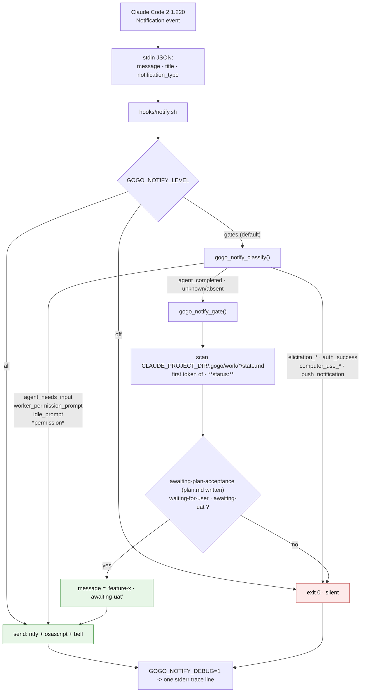
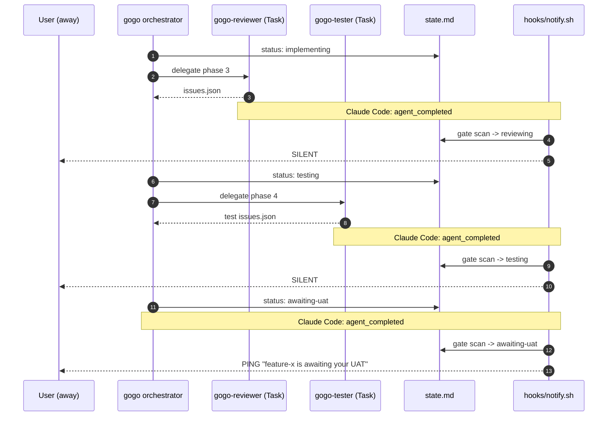

# Plan — notify only at user gates

Status: **accepted** (user, 2026-07-31) · **as-built** (report ⑤, 2026-07-31 — D4/D5
refinements annotated inline; see `report/report.md` for planned-vs-shipped)

**gogo's notification hook fires on every Claude Code notification, including the
"a subagent finished" ping that lands after *each* phase hand-off — so a single
`/gogo:go` run buzzes the phone three-to-six times and every buzz is titled
"gogo needs your input" when nothing needs the user.** This plan teaches
`hooks/notify.sh` to read the `notification_type` Claude Code already puts on its
stdin payload, and to cross-check gogo's own gate statuses in `.gogo/work/*/state.md`,
so a ping means *you are actually blocking the pipeline*.

## Goal

Make the gogo notification hook fire **only when the user is genuinely needed** —
a plan-acceptance gate, a decision gate, the UAT gate, or a real
permission/needs-input prompt from Claude Code — and stay **silent** on routine
pipeline churn (implement → review → test hand-offs, subagent completions, status
writes, telemetry appends).

**Acceptance signal:** a full `/gogo:go` run from `plan-accepted` to
`awaiting-uat` produces **exactly one** notification — the one at the UAT gate —
instead of one per subagent hand-off; and `bash hooks/notify.sh --selftest` proves
the verdict for every notification type without sending anything.

## Context — what exists today

### The hook, and why it over-fires

There are exactly two hooks in the plugin, wired by
`/Users/bartlomiej.zawadzki/repos/gogo/hooks/hooks.json`:

| Event | Script | Behaviour |
|---|---|---|
| `SessionStart` | `hooks/config-check.sh` | prints a one-line `/gogo:build` reminder; harmless |
| `Notification` | `hooks/notify.sh` | **ntfy push + macOS banner + terminal bell, unconditionally** |

`hooks/notify.sh` (unchanged since the initial commit `e08659d` — `git log -- hooks/notify.sh`
returns one entry) does exactly four things: read stdin, pull `.message` with `jq`,
**and send**. There is **no filter of any kind** — not on the event, not on gogo's
state. Two lines carry the whole defect:

```bash
[ -n "$msg" ] || msg="gogo needs your input"     # every event is relabelled as a gate
title="gogo • ${PWD##*/}"                         # ...and every event looks identical
```

So the hook's own header comment ("fires when the agent pauses for you — e.g. to
accept a plan or answer a decision gate") describes an **intent the script never
implements**. It fires on *everything Claude Code calls a notification*.

### What Claude Code actually sends (verified against the binary, not assumed)

The `Notification` hook payload in the installed build
(`/Users/bartlomiej.zawadzki/.local/share/claude/versions/2.1.220`, `claude --version` = 2.1.220)
is built as:

```js
{...base, hook_event_name:"Notification", message, title, notification_type}
```

and the dispatcher passes `matchQuery: notificationType`. Scanning that binary for
`notificationType:"…"` yields **ten** distinct values — and only some of them mean
"a human is blocking":

| `notification_type` | Example message | Does the user need to act? |
|---|---|---|
| `agent_needs_input` | `<label> needs your input: …` | **yes** |
| `worker_permission_prompt` | `<agent> needs permission for <tool>` / `needs network access to <host>` | **yes** |
| `idle_prompt` | `Claude is waiting for your input` | **yes** (fires once per idle window) |
| **`agent_completed`** | **`<label> finished` / `<label> failed`** | **no — this is the spam** |
| `elicitation_response` · `elicitation_complete` | MCP elicitation lifecycle | no |
| `auth_success` · `computer_use_enter` · `computer_use_exit` · `push_notification` | lifecycle / transport | no |

**`agent_completed` is the smoking gun.** `skills/gogo/SKILL.md` (lines 129-140) has
the orchestrator **delegate ① ③ ④ to fresh `Task` subagents** — `gogo-analyst`,
`gogo-reviewer`, `gogo-tester` — and the review→implement→test loop respawns the
reviewer and the tester **every round**. Each subagent that returns emits one
`agent_completed` notification, the hook sees it, and (because `jq` extracts a
`.message` of `"gogo-reviewer finished"`, or falls back to the literal string when
`jq` is absent) it pushes a ping that reads as though gogo needs the user.
That is precisely the user's report: *"when review → developer → tester changes it
sends notification."* It is not `state.md` writes and not `events.jsonl` appends —
those touch no hook at all. It is one notification per phase hand-off.

### What "the user is really needed" already means in gogo

gogo already has a **single authoritative predicate** for this, in the CLI:

`/Users/bartlomiej.zawadzki/repos/gogo/cli/internal/contract/contract.go:171`

```go
func (f *Feature) WaitingForInput() bool {
	switch f.Status {
	case "awaiting-plan-acceptance":
		return !f.Authoring()
	case "waiting-for-user", "awaiting-uat":
		return true
	}
	return false
}
```

Three gate statuses — `awaiting-plan-acceptance` (plan gate), `waiting-for-user`
(decision gate / mid-UAT re-plan lock), `awaiting-uat` (UAT gate) — minus the
**authoring carve-out**: an `awaiting-plan-acceptance` folder whose `plan.md` is not
yet written is *not* a gate (`contract.go:150`, since 0.29.0). Everything else
(`plan-accepted`, `implementing`, `reviewing`, `testing`, `shipped`, `done`,
`aborted`) flows unattended. `gogo status` surfaces the same predicate as the
greppable `WAIT` column (`cli/status.go:116`). **This plan reuses that definition
rather than inventing a second one.**

### Constraints this must respect

- **Portability** (`non-functional-requirements.md`): the core loop needs zero
  external deps; `jq` and ntfy are optional and must degrade, never hard-fail.
- **Hooks are best-effort and side-effect-light**; never block or crash a session.
- **Prefer degrading to MISSING over degrading to WRONG** — but for a *notifier*
  "missing" means a silent gate, so the unknown-input rule is a real decision (D1).
- **A user-visible rule stated in more than one place is ONE constant** (TEST-006,
  0.29.0 — three of four hand-written copies of the concurrency-cap rule had gone
  stale). The gate-status list is exactly such a rule, which is why FR8 pins it.
- **Diagnosability** (0.28.0 bar): *"a failure the user can see but not explain is a
  bug."* This hook has been an unobservable black box since the initial commit —
  which is why the defect survived this long. FR6 fixes that directly.

## Functional requirements

**FR1 — Classify every notification by `notification_type`.**
`notify.sh` reads `notification_type` from the stdin payload and decides one of
three verdicts: `notify` · `silent` · `gate-conditional`. Parsing uses `jq` when
present and a POSIX `grep`/`sed` fallback when not, so the classification never
depends on an optional tool.

**FR2 — Always notify on a blocking prompt.**
`agent_needs_input`, `worker_permission_prompt`, `idle_prompt` → **notify**, gate or
no gate. Plus a one-line hedge: **any** type whose name contains `permission` is
always allowed, so a future/renamed permission type can never be silently swallowed.

**FR3 — Never notify on lifecycle noise.**
`elicitation_response`, `elicitation_complete`, `auth_success`, `computer_use_enter`,
`computer_use_exit`, `push_notification` → **silent**, always.

**FR4 — `agent_completed` notifies only when a gogo gate is open.**
This is the requirement that fixes the reported bug *and* keeps the one ping the user
wants. A reviewer/tester subagent returning mid-loop (status `implementing` /
`reviewing` / `testing`) is silent; the **same** event at the end of a run — when
phase ⑤ has written `awaiting-uat` — pings, because a gate genuinely opened.
*(As-built refinement, D4/REV-001: "open" became "**newly** open" — review round 1
proved a gate parked on ANOTHER work item re-enabled per-hand-off pings, so the
gate-conditional branch now pings only for gates not in the last-notified set,
remembered in `.gogo/resources/notify/gates` (an already-gitignored path, REV-012)
— the plan's A4 back-pocket case, activated as an edge-latch rather than a time
window.)*

**FR5 — The gate scan mirrors `contract.WaitingForInput()` exactly.**
Scan `$CLAUDE_PROJECT_DIR/.gogo/work/*/state.md` for a `- **status:**` line whose
**first token** is `awaiting-plan-acceptance`, `waiting-for-user`, or `awaiting-uat`,
applying the authoring carve-out (an `awaiting-plan-acceptance` item counts only if a
sibling `plan.md` exists with ≥ 2 `## ` sections). Two traps the implementation must
handle, both already solved on the Go side:
- the status line carries a **trailing legend comment** listing every status
  (`- **status:** implementing   <!-- awaiting-plan-acceptance | … -->`), so a naive
  substring grep matches *every* state.md — compare the first token only;
- the template's leading **multi-line HTML comment** contains example field lines, so
  only lines outside a comment block count.

**FR6 — The hook is observable.** `GOGO_NOTIFY_DEBUG=1` prints one stderr line per
invocation: the type, the verdict, the gate count, and the delivery channels used.
Nothing is written to disk. This is what turns the next such report from a guess into
a reading. *(As-built scope note, REV-017: "nothing written" holds for the DEBUG
trace itself — it is stderr-only. Since D4 the hook does maintain ONE disk artifact,
the edge-latch seen-file `.gogo/resources/notify/gates`, written on every gate-class
event including dry runs; that is D4's documented state, not a debug side effect.)*

**FR7 — One knob, three values.** `GOGO_NOTIFY_LEVEL` = `gates` (default, the
behaviour above) · `all` (today's fire-on-everything, for debugging or for anyone who
liked it) · `off` (kill switch). Unrecognised value → `gates`.

**FR8 — The gate list cannot drift.** `bash hooks/notify.sh --selftest` runs the
decision function over a built-in payload × fixture table and exits 0/1 without
sending anything; a Go test in `cli/` runs it, and a second Go test asserts the
statuses enumerated in `notify.sh` are exactly those `contract.WaitingForInput()`
accepts.

### Behaviour (BDD)

```gherkin
Background:
  Given the gogo plugin is installed with its Notification hook wired
  And GOGO_NOTIFY_LEVEL is unset (so it defaults to "gates")

Scenario: A review subagent finishes mid-run
  Given feature-foo/state.md reads "status: reviewing"
  When Claude Code sends {"notification_type":"agent_completed","message":"gogo-reviewer finished"}
  Then no push, no banner and no bell are emitted
  And the hook exits 0

Scenario: The run lands at the UAT gate
  Given feature-foo/state.md reads "status: awaiting-uat"
  When Claude Code sends {"notification_type":"agent_completed","message":"gogo-tester finished"}
  Then one notification is emitted
  And its message names feature-foo and the awaiting-uat gate

Scenario: A plan is written and awaits acceptance
  Given feature-bar/state.md reads "status: awaiting-plan-acceptance"
  And feature-bar/plan.md exists with 5 "## " sections
  When any notification arrives
  Then one notification is emitted naming feature-bar

Scenario: The analyst wrote state.md before plan.md (authoring)
  Given feature-baz/state.md reads "status: awaiting-plan-acceptance"
  And feature-baz/plan.md does not exist
  When {"notification_type":"agent_completed"} arrives
  Then no notification is emitted, because an unwritten plan is not a gate

Scenario: A permission prompt while no gogo work is at a gate
  Given every state.md reads "status: implementing"
  When {"notification_type":"worker_permission_prompt","message":"gogo-tester needs permission for Bash"}
  Then one notification is emitted carrying that message verbatim

Scenario: Lifecycle noise
  When {"notification_type":"auth_success"} arrives
  Then no notification is emitted regardless of gate state

Scenario: The legacy escape hatch
  Given GOGO_NOTIFY_LEVEL is "all"
  When {"notification_type":"agent_completed"} arrives
  Then one notification is emitted (0.30.0 behaviour, byte-for-byte)
```

## Approach

**Recommended: put the whole decision in `hooks/notify.sh`, as one pure bash
function, and pin it with a `--selftest` plus two Go guards.**

```
Notification (any type)
   └─ notify.sh
       ├─ level off?                      -> exit 0
       ├─ level all?                       -> send (legacy)
       ├─ classify(notification_type)
       │     notify          -> send, message = Claude's own text
       │     silent          -> exit 0
       │     gate-conditional-> scan .gogo/work/*/state.md
       │                          gate open  -> send, message = "feature-x · awaiting-uat"
       │                          no gate    -> exit 0
       └─ send = ntfy (if topic) + osascript (if present) + bell   [unchanged]
```

Three properties make this the right shape:

- **One authority per rule.** The event classification lives only in `notify.sh`;
  the *gate* rule's authority stays `contract.WaitingForInput()`, and FR8's guard
  makes the bash copy provably identical rather than merely intended to be
  (TEST-006's lesson, applied).
- **Zero new dependencies.** Pure bash with a `jq`-optional parse; the hook keeps
  working on a machine with neither `jq` nor `curl` nor `osascript`.
- **Testable for the first time.** `--selftest` follows the house convention for
  vendored executables (`coding-rules.md`: pure stdlib, pure ASCII, documented exit
  codes) and makes the verdict table assertable in the Go suite. *Why the simpler
  version does not suffice:* this hook's only current verification is "run a
  pipeline and see whether your phone buzzes" — which is exactly how a
  fires-on-everything bug survived from the initial commit to 0.30.0.

**The message also changes.** Today every ping is titled `gogo • <dir>` with the body
`gogo needs your input`, which is indistinguishable across all ten event types. After
this change the body is either **Claude's own message** (for a real prompt) or a
**named gate** (`feature-notify-only-at-user-gates · awaiting-uat`), so the ping tells
the user what to go do.

### Alternatives considered

| Alternative | Why not |
|---|---|
| **A1 — Filter declaratively with a `matcher` in `hooks.json`.** The dispatcher does pass `matchQuery: notification_type`, so `"matcher": "agent_needs_input\|idle_prompt\|…"` would work. | Rejected as the *primary*: it puts the same enumeration in two files (TEST-006 drift), the matcher's semantics for `Notification` are undocumented and version-dependent (I derived them from the binary), and FR4 still needs the type inside the script for the gate-conditional branch. One place, not two. |
| **A2 — Turn off `agentPushNotifEnabled` in the user's `~/.claude/settings.json`.** | Not a gogo fix (leaves the plugin broken for everyone else), it is host-global rather than project-scoped, and it would also kill `agent_needs_input` — the one agent signal that *is* real. |
| **A3 — Drop the `Notification` hook; drive pings from a `Stop`/`SubagentStop` hook that watches `state.md`.** | Misses genuine permission prompts (the most blocking case), and it would make the notifier depend on an LLM having written `state.md` on time — which `non-functional-requirements.md` explicitly forbids as a safety basis ("skipped on **all three** of its live runs"). |
| **A4 — Rate-limit / dedupe pings with a timestamp file under `.gogo/`.** | Treats the symptom, adds mutable state, and would still suppress the *right* ping as readily as the wrong one. Keep it in the back pocket only if spam survives the classifier. |

### Risks and unknowns

- **The type list is one build's snapshot.** Ten values were read out of 2.1.220; a
  future build may add more. Mitigated by FR7's `all` escape hatch, FR2's
  `*permission*` hedge, and D1's unknown-type rule — never by pretending the list is
  closed.
- **Whether an ordinary main-session permission prompt carries a `notification_type`
  at all.** The literal `"Claude needs your permission to use …"` does **not** appear
  in the 2.1.220 binary (only `worker_permission_prompt` does), so this may be a
  worker-only signal in this build. Recorded as an assumption; FR6's debug trace
  resolves it empirically during implement, before the classifier is frozen.
- **`CLAUDE_PROJECT_DIR` may be unset** in some launch paths. Fall back to `$PWD`,
  exactly as `hooks/config-check.sh:12` already does.

## Changes checklist

In build order:

1. **`hooks/notify.sh`** — the whole fix. Add `gogo_notify_type()` (jq-or-grep
   payload parse), `gogo_notify_classify()` (FR2/FR3/FR4 + D1), `gogo_notify_gate()`
   (FR5 state.md scan with first-token + comment-block + authoring handling),
   `gogo_notify_send()` (the existing three channels, unchanged), the
   `GOGO_NOTIFY_LEVEL` / `GOGO_NOTIFY_DEBUG` knobs, and the `--selftest` path.
   Keep `set -euo pipefail` and the best-effort `|| true` on every send.
2. **`hooks/hooks.json`** — update the `description` string only (no `matcher`; see
   A1). The wiring itself does not change.
3. **`cli/notify_hook_test.go`** *(new, package `main`)* —
   `TestNotifyHookSelftest` shells out to `bash ../hooks/notify.sh --selftest`
   (skipping if `bash` is absent), and
   `TestNotifyHookGateStatusesMatchContract` derives the gate statuses by running
   every status in the enum through `contract.WaitingForInput()` and asserts
   `hooks/notify.sh` enumerates exactly those — the anti-drift guard. Follow the
   existing `readRepoFile(t, "..", …)` helper in `cli/cli_enum_test.go:97` and the
   source-scan shape of `cli/skills_lint_test.go`.
4. **`README.md`** (the `GOGO_NTFY_TOPIC` paragraph, ~line 666) — document that the
   hook now pings only at gates, plus the two new env vars.
5. **`docs/flow.md`** (line 208, "The Notification hook pings the user.") — say
   *which* events ping, so the decision-gate narrative stays true.
6. **`.claude-plugin/plugin.json`** — version bump to **0.31.0** (confirmed by the
   user, D3: new env knobs + a selftest is feature-shaped). *(As-built correction:
   `cli/main.go`'s `Version` constant bumps with it — `TestVersionMirrorsPlugin`
   enforces the mirror; the plan missed the companion edit.)*
7. **Knowledge reconcile at phase ⑤** — `project-knowledge.md:43-44` (`notify.sh
   (Notification → ntfy/macOS/bell)`), `testing-tools.md:25` (add `--selftest` to the
   documented invocation), `docs/architecture.md:137`.

Enumeration-sync grep before hand-off (per `coding-rules.md`): `grep -rn
"notify.sh\|GOGO_NTFY\|Notification"` across `README.md`, `docs/`, `hooks/`,
`skills/`, `.gogo/knowledge/` — every hit above is already listed. *(As-built
correction: `skills/` added to the sweep — review round 1 found the
decision-gate sentence's twin at `skills/gogo/SKILL.md:405`, REV-008.)*

## Tests

| Level | What | How |
|---|---|---|
| **Unit (bash)** | The verdict for all ten known types × {gate open, no gate}, plus unknown/absent type, plus all three `GOGO_NOTIFY_LEVEL` values | `bash hooks/notify.sh --selftest` — built-in table, temp-dir fixtures via `CLAUDE_PROJECT_DIR`, **sends nothing** |
| **Unit (bash)** | The two FR5 parse traps: a `- **status:** implementing <!-- awaiting-plan-acceptance \| … -->` line must **not** count as a gate; a `- **status:**` line inside the leading comment block must be skipped | selftest fixtures |
| **Unit (bash)** | Authoring carve-out: `awaiting-plan-acceptance` + missing/stub `plan.md` → no gate; + a written `plan.md` → gate | selftest fixtures |
| **Unit (bash)** | Degradation: no `jq`, no `curl`, no `osascript`, unreadable `.gogo/` → exit 0, never a crash | selftest runs the decision path with `PATH` narrowed |
| **Go guard** | `TestNotifyHookSelftest` — the selftest is green in CI | `cd cli && go test ./...` |
| **Go guard** | `TestNotifyHookGateStatusesMatchContract` — the bash gate list == `contract.WaitingForInput()`'s | source scan of `../hooks/notify.sh` |
| **E2E (dogfood)** | The acceptance signal: run `/gogo:go` on a scratch feature with `GOGO_NOTIFY_DEBUG=1`; capture the stderr trace; assert `agent_completed` appears ≥ 3 times with verdict `silent` and exactly one `notify` at `awaiting-uat` | manual, per `tech-stack.md`'s dogfood strategy |
| **Gates** | `gofmt -l .` clean · `go vet ./...` clean · `go test -race ./...` green | non-negotiable for any `cli/` change |

The E2E run doubles as the empirical check on the two open assumptions (which types
actually arrive, and whether main-session permission prompts carry a type at all).

## Out of scope

- **Changing what the pipeline does at a gate** — no new statuses, no new gate
  semantics, no changes to `state.md`'s contract, `docs/cli-contract.md`, or the
  four work-index classes. This plan only changes *who gets told*.
- **The `SessionStart` hook** (`config-check.sh`) — untouched.
- **New delivery channels** (Slack, email, desktop toast on Linux). The existing
  ntfy + osascript + bell trio is unchanged; only the *decision to send* changes.
- **A notification history / log file under `.gogo/`.** FR6's stderr trace is the
  diagnosability answer; a persisted log is a separate feature if ever wanted.
- **Any change to `~/.claude/settings.json`** — the fix lives in the plugin.

## Intended design

How the hook will decide, end to end:



And what that means during a real `/gogo:go` run — the same `agent_completed` event
suppressed three times and delivered once, because only the last one coincides with
an open gate:



The as-is baseline of both flows is captured in `charts/before/`.

## Summary (TL;DR)

- **What's wrong:** `hooks/notify.sh` has fired on **every** Claude Code
  `Notification` since the initial commit, with no filter and a hardcoded
  "gogo needs your input" label. Claude Code 2.1.220 sends **ten** notification
  types, and one of them — **`agent_completed`** — fires each time a `gogo-analyst`
  / `gogo-reviewer` / `gogo-tester` subagent returns, i.e. **once per phase
  hand-off, every loop round**. That, not `state.md` writes, is the buzzing.
- **What's being built:** a classifier inside `notify.sh` — notify on
  `agent_needs_input` / `worker_permission_prompt` / `idle_prompt` / anything
  `*permission*`, stay silent on lifecycle noise, and for `agent_completed` (and
  anything unrecognised) **ping only when a gogo work item is actually at a gate**.
- **Why it's shaped this way:** the gate rule already exists as one authority —
  `contract.WaitingForInput()` (`awaiting-plan-acceptance` minus authoring ·
  `waiting-for-user` · `awaiting-uat`) — so the bash mirrors it and a Go guard makes
  the two provably identical, instead of a second enumeration free to drift.
- **What you get back:** the ping that matters. A `/gogo:go` run goes from ~3-6
  meaningless buzzes to **one**, at the UAT gate, naming the feature — plus
  `GOGO_NOTIFY_DEBUG=1` so the hook is never an unexplainable black box again, and
  `GOGO_NOTIFY_LEVEL=all|off` as the escape hatch.
- **What happens next:** accept this plan, then `/gogo:go` builds it — one bash file
  plus two Go guard tests, a doc pass, and a version bump; **two decisions (D1, D2)
  are logged in `decisions.md`** with recommendations, and the E2E dogfood run
  resolves the two recorded assumptions before the classifier is frozen.
