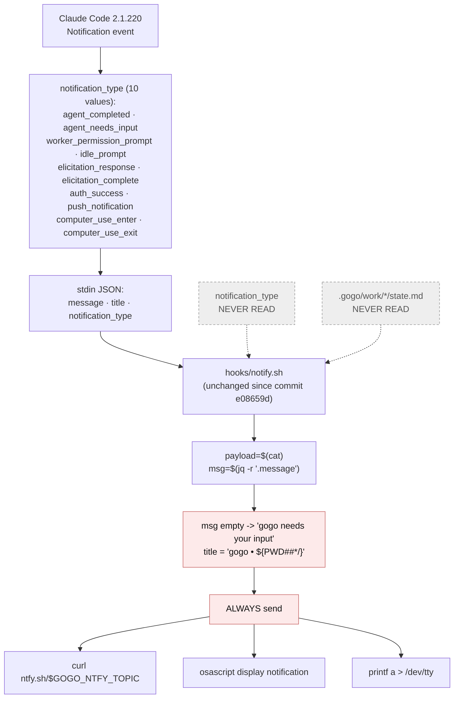
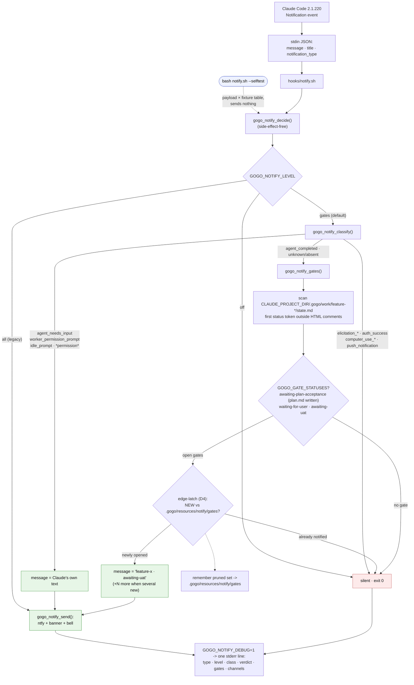
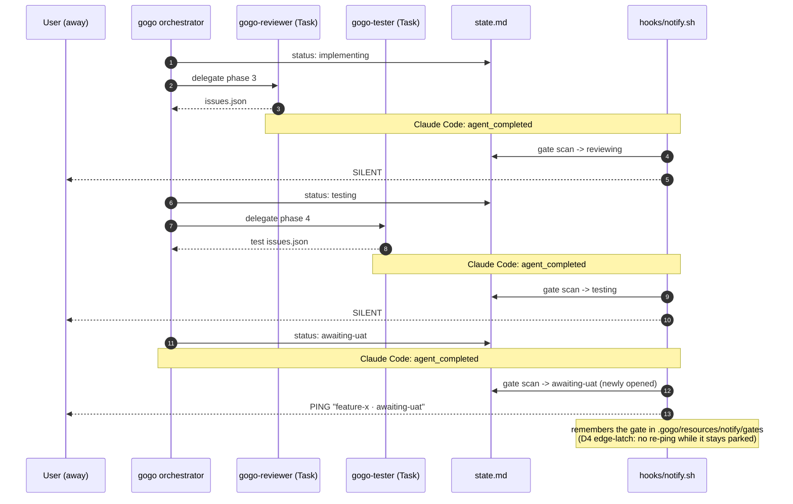

# Report — feature `notify-only-at-user-gates`

- **feature:** Notify only at user gates — filter the Notification hook by notification_type + gogo's open gates
- **status:** awaiting-uat
- **completed:** 2026-07-31
- **branch / commits:** main (uncommitted working tree; ships as 0.31.0)

## Run status / gaps

**All phases completed — plan → implement (5 rounds) → review (3 rounds, APPROVE) → test (green after D5) → report. No open issues.** The living issue lists close out at: review 19 findings (15 verified · 3 fixed in the final round · 1 wontfix-by-contract), test 3 findings (1 fixed · 2 wontfix-by-acceptance, D5). One tooling note: `report/layouts.json` / `diagrams.html` are not prebuilt (`very-nice-mermaid` was not resolvable by the layout tool, exit 3) — `/gogo:view` renders the interactive page from the `.mmd` sources on demand.

## Summary

Since its first commit, gogo's Notification hook fired on **every** Claude Code notification with the fixed label "gogo needs your input" — so one `/gogo:go` run buzzed the phone once per subagent hand-off, 4-6 times, and none of the pings marked a real gate. **0.31.0 rebuilds `hooks/notify.sh` into a classifier**: blocking prompts always notify, lifecycle noise never does, and everything else — notably `agent_completed`, the spam source — notifies **only when a `.gogo/work` item newly arrives at a user gate**, with the ping naming the feature and its gate. A full pipeline run now produces **exactly one notification, at the UAT gate**.

## Planned vs shipped

Shipped as planned (FR1-FR8, approach and all three alternatives rejected as planned), **plus three as-built refinements the pipeline itself forced**:

- **FR4 "gate open" became "gate NEWLY open" (D4, the edge-latch).** Review round 1 proved the plan's repo-wide gate scan re-enabled per-hand-off pings whenever *any other* work item sat parked at a gate — the normal state of an active tree (this repo had one at that moment). The user chose the **edge-latch**: the hook remembers the last-notified gate set in `.gogo/resources/notify/gates` (an already-gitignored path) and pings only for gates not in it, pruning as gates close. This was the plan's own A4 "back pocket" case, activated.
- **The version bump is three files, not one** — `cli/main.go`'s `Version` const and `cli/version_test.go`'s pin mirror `plugin.json` (enforced by `TestVersionMirrorsPlugin`; the plan listed only `plugin.json`).
- **`skills/gogo/SKILL.md` carried a twin of the docs/flow.md sentence** the plan's enumeration-sync grep missed (its sweep list omitted `skills/`); both now updated, and the sweep list gained `skills/`.

## Implementation

**The whole decision lives in one pure-bash function, `gogo_notify_decide()`** (jq optional — a POSIX grep/sed fallback parses the payload without it):

1. **Level knob** — `GOGO_NOTIFY_LEVEL`: `gates` (default) · `all` (legacy fire-on-everything) · `off` (kill switch); unrecognised → `gates`.
2. **Type classifier** — `agent_needs_input` / `worker_permission_prompt` / `idle_prompt` (D2) plus anything `*permission*` → **always notify** with Claude's own message, verbatim; `elicitation_*` / `auth_success` / `computer_use_*` / `push_notification` → **always silent**; `agent_completed` and any unknown/absent type (D1) → gate-conditional.
3. **Gate scan** — `.gogo/work/feature-*/state.md`, first status token outside HTML comments (both parse traps handled: the same-line legend comment and the template's leading comment block; whitespace tolerance mirrors the Go `stateLine` parser). The gate statuses are one greppable constant, `GOGO_GATE_STATUSES`, **provably identical to `contract.WaitingForInput()`** — including the authoring carve-out (an `awaiting-plan-acceptance` item with no written `plan.md` is not a gate).
4. **D4 edge-latch (read)** — the open-gate set is diffed against the last-notified set; only **new** gates ping (`feature-x · awaiting-uat`, `(+N more)` when several). `gogo_notify_main` then re-remembers the pruned set — the hook's single side effect; a missing/unreadable/unwritable seen-file degrades to fire-on-open-gate, never to silence.
5. **Send** — the original three channels, hardened: ntfy via `--data-raw` (a leading `@` is never a filename), the macOS banner via **argv-form osascript** (strings never interpolated into AppleScript source — the injection review round 1 proved is gone), quiet brace-guarded writes everywhere (no stderr leaks without a tty or with a read-only `.gogo/`).

**Observability:** `GOGO_NOTIFY_DEBUG=1` prints one stderr line per invocation (`type · level · class · verdict · gates · channels`); `GOGO_NOTIFY_DRYRUN=1` computes and traces without sending (the latch still updates — a dry run is still an invocation). **`bash hooks/notify.sh --selftest`** runs 44 cases — the full type × fixture verdict table, both FR5 parse traps, the authoring carve-out, the latch lifecycle end-to-end (the script's own write, no hand-made state), read-only-`.gogo` quietness, level knob, degradation, and byte-exact message round-trip — sending nothing, on both macOS bash 3.2 and bash 5.x.

### Changes (as-built)

| File | Change | Note |
|---|---|---|
| `hooks/notify.sh` | rewritten | classifier + gate scan + D4 latch + knobs + 44-case `--selftest` |
| `hooks/hooks.json` | modified | description now states the gate-ping behaviour (wiring unchanged) |
| `cli/notify_hook_test.go` | added | `TestNotifyHookSelftest` (runs the selftest in CI) + `TestNotifyHookGateStatusesMatchContract` (three-source anti-drift guard: template enum × `WaitingForInput()` predicate × bash constant) |
| `cli/main.go` | modified | `Version` → 0.31.0 (mirror rule) |
| `cli/version_test.go` | modified | release-train pin → 0.31.0 |
| `README.md` | modified | `GOGO_NTFY_TOPIC` section documents gate-only pings + both new env knobs + `--selftest` |
| `docs/flow.md` | modified | decision-gate step names which events ping |
| `skills/gogo/SKILL.md` | modified | the twin decision-gate sentence, same clause |
| `.claude-plugin/plugin.json` | modified | version 0.31.0 (D3) |

## Decisions & rationale

Full audit trail: [decisions.md](../decisions.md).

| Decision | Choice | Reason |
|---|---|---|
| **D1** — unknown/absent `notification_type` | Gate-conditional | The reported defect is over-notification; the miss-risk is bounded by the `*permission*` hedge and recoverable via the debug trace; `GOGO_NOTIFY_LEVEL=all` restores fail-open in one env var |
| **D2** — `idle_prompt` | Always notify | Not the spam source, and the one signal that still reaches the user when a phase skill forgets its `state.md` write — the last-resort safety net |
| **D3** — version shape | 0.31.0 | New env knobs + a selftest is feature-shaped, not a patch |
| **D4** — a parked gate elsewhere re-pings every hand-off (REV-001) | **Edge-latch** (`.gogo/resources/notify/gates`) | Launch-mode independent (the reviewer's scope-to-slug alternative cannot derive a slug for interactive sessions), keeps the acceptance signal literally true, degrades to fire-on-open-gate, never to silence |
| **D5** — two live-only assumptions (which types 2.1.220 really emits; whether main-session permission prompts carry a type) | Accept and skip | Classifier fully proven against synthetic payloads; FR2's hedge + D1 bound the risk; the user's own UAT with `GOGO_NOTIFY_DEBUG=1` doubles as the live observation |

## Review outcome

**Three rounds, final verdict APPROVE.** 19 findings ([review/issues.json](../review/issues.json), snapshots [review-01](../review-01.md) · [review-02](../review-02.md) · [review-03](../review-03.md)): 15 verified fixed, 3 fixed in the closing round, 1 wontfix (a `|` in a folder name is outside the slug grammar). The reviews were adversarial and empirical — highlights:

- **REV-001 (major → D4):** live-reproduced the parked-gate re-ping and drove the edge-latch decision.
- **REV-002 (major):** a working **AppleScript injection** through the old quote-only escaping (`do shell script` executed) — closed by the argv form, re-verified by re-running the exploit.
- **REV-010 (major):** the latch's write half was **structurally untestable** (the dry-run seam doubled as the write-disable flag) — deleting the write kept all tests green while resurrecting the original bug. Fixed by making DRYRUN mean "send nothing" only; the acceptance mutation now fails 3 cases.
- Every non-trivial guard was **mutation-verified**: removing the first-token split, the comment tracking, the latch read, the latch write, or the write braces each drops the selftest below green; adding a gate status to the contract alone fails the Go guard by name.

## Test outcome

**Green** ([test/issues.json](../test/issues.json), snapshot [test-01.md](../test-01.md)). Levels exercised: **CLI** (selftest 43→44 cases under bash 3.2 and 5.3), **Go** (full `gofmt` / `go vet` / `go test -race`, 13 packages, 544 test functions), and the **E2E dogfood** — the plan's acceptance signal replayed against the real hook: `implementing` → `reviewing` → `testing` hand-offs all silent, `awaiting-uat` → **exactly one notification naming the feature and gate** (real banner fired), repeat → silent via the latch; plus every FR2-FR5 edge case and a cleaned-up probe against this repo's real open gates. Findings: **TEST-001** (trailing space on verbatim messages) fixed and pinned byte-exact; **TEST-002/003** (live-session observations) accepted-and-skipped per **D5** — no silent skip: the disposition is the user's, recorded in [decisions.md](../decisions.md).

## Diagrams

Interactive page: build via `/gogo:view` (prebuilt `layouts.json` skipped — renderer not resolvable here).

- `flow.mmd` — the as-built decision pipeline: level switch → classifier → gate scan → **D4 latch** → send/silent, with the `--selftest` entry and the debug trace.
- `sequence.mmd` — one `/gogo:go` run: three silenced hand-offs, one UAT-gate ping, latch silence after.

## Before / after comparison

The plan-time as-is baseline is carried in [`before/`](./before/) (same two kinds).

### Flow — before



### Flow — after



**What changed:** the before diagram's defect is structural — `notification_type` and every `state.md` sit on disk **unread** (the dashed dead nodes) while the send path is unconditional. After, both feed the decision: the type picks a class, the state scan finds the gates, and the D4 latch makes "gate open" mean "gate **newly** open". The always-send node is gone; the two green paths are a blocking prompt (verbatim message) and a newly-opened gate (named message).

### Sequence — before

```mermaid
sequenceDiagram
  autonumber
  participant U as User (away)
  participant O as gogo orchestrator
  participant A as gogo-analyst (Task)
  participant R as gogo-reviewer (Task)
  participant T as gogo-tester (Task)
  participant H as hooks/notify.sh

  O->>A: delegate phase 1
  A-->>O: plan.md
  Note over A,H: Claude Code: agent_completed
  H-->>U: PING "gogo needs your input"

  O->>R: delegate phase 3
  R-->>O: issues.json
  Note over R,H: Claude Code: agent_completed
  H-->>U: PING "gogo needs your input"

  O->>R: re-review after fixes
  R-->>O: issues.json (round 2)
  Note over R,H: Claude Code: agent_completed
  H-->>U: PING "gogo needs your input"

  O->>T: delegate phase 4
  T-->>O: test issues.json
  Note over T,H: Claude Code: agent_completed
  H-->>U: PING "gogo needs your input"

  Note over U,H: 4+ identical pings per run;<br/>none of them is a real gate,<br/>and the real UAT gate looks the same
```

### Sequence — after



**What changed:** the same `agent_completed` event, four deliveries before, one after — and the one that survives is the one that matters, named after its feature and gate. No kinds were added or removed between the sets.

## Knowledge updates

Gogo-owned files updated at this phase: `project-knowledge.md` (the hooks line now describes the classifier), `testing-tools.md` (the hook's documented invocation gained `--selftest`), `tech-stack.md` (test-function count + the hook's test note), `code-review-standards.md` (the REV-010 lesson: a test seam must never gate the side effect it exists to pin). Repo docs `docs/architecture.md` (hooks line) updated alongside. **No upstreaming suggestions** — everything landed in gogo-owned surfaces.

## Follow-ups & known limitations

- **The type list is one build's snapshot** (2.1.220). D1 makes unknown types gate-conditional and the `*permission*` hedge fail-open; the first live run with `GOGO_NOTIFY_DEBUG=1` after installing 0.31.0 will name any type the classifier has never seen (this doubles as D5's deferred live observation).
- **The latch is per-repo, shared across sessions** — one ping per newly-opened gate per repo, by design (one phone, one ping). Concurrent invocations can at worst duplicate a ping, never lose one (review round 3, verified with 8 concurrent runs).
- **A live main-session permission prompt's payload shape** remains unobserved (D5) — if it carries no `notification_type` it classifies gate-conditional; `idle_prompt` remains the safety net.
- Deliberately out of scope (per plan): new delivery channels, a notification history file, any `~/.claude/settings.json` change.

## Summary (TL;DR)

- **Shipped:** `hooks/notify.sh` 0.31.0 — a notification classifier with a contract-mirrored gate scan and the D4 edge-latch; a `/gogo:go` run now buzzes **once, at the UAT gate, naming the feature**, instead of 4-6 anonymous pings. Two new knobs (`GOGO_NOTIFY_LEVEL`, `GOGO_NOTIFY_DEBUG`), a 44-case `--selftest`, two Go anti-drift guards.
- **Review verdict:** APPROVE after 3 adversarial rounds — 19 findings, every fix mutation- or exploit-verified, none open.
- **Test verdict:** green — selftest on both bashes, full race suite, E2E dogfood proving the exactly-one-ping acceptance signal; two live-only checks explicitly accepted-and-skipped by the user (D5).
- **Follow-ups:** see above — chiefly, watch the first live `GOGO_NOTIFY_DEBUG=1` run for unknown types.
