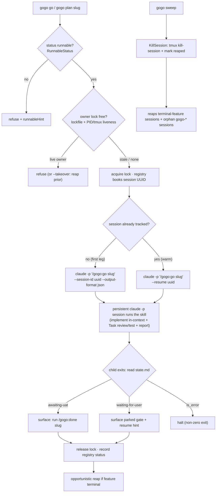

# Plan — persistent-session orchestrator (CLI as session-lifecycle manager)

Status: **as-built / shipped through report ⑤ (0.15.0) — awaiting-uat.** Accepted
2026-07-11 (D1–D6 as recommended); built + reviewed (2 rounds APPROVE, REV-001..004
verified) + tested (149/149 green; true-e2e verified by a live smoke, D7). The as-built
reconciliation lives in [report/report.md](report/report.md); two review-driven additions
beyond the plan letter — a `validSlug` write-scope guard and refusing over a live
*untracked* board session — are recorded there under "Planned vs shipped".

**In one line:** rework the `gogo` CLI so it stops *re-implementing* the
pipeline loop and instead **launches or `--resume`s ONE persistent `claude -p`
session per feature that runs the existing `/gogo:go` skill** — turning the Go
CLI into a pure **session-lifecycle + display manager** (no routing, no phase
loop in Go). This is **Slice 1 (the foundation)** of a multi-slice program; it
also lands the two hard fixes from a live incident: a **one-owner-per-work-item
lock** and a **session registry + kill-at-ship + orphan-sweep**.

## Goal

Replace the per-phase Go orchestrator (`gogo run`, v0.13.0) — which spawns
separate dev / review / test `claude -p` sessions and re-routes in Go via
`contract.Route` — with a **persistent-session model**: `gogo go <slug>`
launches (or resumes) **one** `claude -p "/gogo:go <slug>"` session that runs
the *whole* feature (implement in-context + review/test as nested `Task`
subagents + report), and the CLI only manages that session's lifecycle. Kill the
**routing-drift bug class** (one loop, in the skill — never a second copy in
Go), **maximize warmth** (the dev session stays warm across the entire feature,
incl. UAT loops), and **reuse the skills wholesale**.

**Acceptance signal:** `gogo go <slug>` and `gogo plan <slug>` launch-or-resume a
registry-tracked persistent session running the existing skill; a second
`gogo go`/`gogo plan` on a feature a **live** session already owns is **refused
(or taken over)**; every session is tracked and **reaped at ship**; `gogo sweep`
kills orphans. The Go per-phase loop and `contract.Route` are gone. `go test
-race ./...` is green with new tests for the lock, the registry round-trip, reap,
and orphan-sweep (all with an **injected launcher/killer** — no real claude).

## Context — what exists today (code = source of truth)

The CLI (`cli/`, Go 1.25) is a deterministic cockpit that reads the frozen
`.gogo/` contract (`docs/cli-contract.md`) with **no LLM in the read path** and
delegates every state-changing action to a launched `claude`. Version is
**0.14.0** (the goal cites 0.13.0 as the baseline — 0.14.0's *unattended-ops*
work landed on top; this plan builds on 0.14.0).

The pieces this change touches:

- **`cli/internal/orchestrator/orchestrator.go`** — the Slice-1 per-phase
  orchestrator. `Run()` re-implements the whole ②→③→④(→⑤) loop in Go: spawns a
  fresh dev `claude -p --session-id <uuid>` build, keeps it **warm** across fix
  rounds via `--resume`, spawns **review/test fresh** (new uuid), reads
  `issues.json`/`result.json`, and routes via **`contract.Route`**, with round +
  cost **bounds** that gate. *This whole loop is what the persistent-session
  model deletes.*
- **`cli/internal/orchestrator/registry.go`** — the CLI-owned per-feature
  bookkeeping at **`.gogo/resources/cli/sessions/<slug>.json`** (`DevUUID`,
  `Round`, `Phase`, `CostUSD`, `Sessions[]`). *Extended into the session
  registry.*
- **`cli/internal/contract/route.go`** (+ `route_test.go`) — the `Route(track,
  result, issues)` decision function. Its **only** non-test callers are the two
  lines in `orchestrator.go` (verified: `grep contract.Route`). *Becomes dead
  when the Go loop goes.*
- **`cli/internal/launch/launch.go`** — the launch primitives to **reuse**:
  `RunPhase` / `PhaseArgs` / `PhaseOpts` / `RunResult` (the `claude -p
  --session-id | --resume --output-format json` plumbing), `SessionMatchesSlug`
  (exact `gogo-<action>-<slug>` parse, TEST-005), `ListSessions` / `HasSession` /
  `HasTmux` / `HasClaude`, `BuildIntent` / `ResumeIntent` / `TmuxNewSessionArgs`.
  **The leak:** `Launch` (tmux path) sets `tmux set-option remain-on-exit on`
  (**line 443**) so a session's pane lingers after `claude` exits — and
  **nothing reaps it** (confirmed: 7 orphaned `gogo-*` sessions piled up in the
  incident). *We add a reap helper and stop leaking by construction on the new
  path.*
- **`cli/run.go`** — `cmdRun` dispatches `gogo run`: enforces the acceptance
  gate (`RunnableStatus`), picks the newest runnable feature, and calls
  `orchestrator.New(...).Run()`. *Reworked into `gogo go`.*
- **`cli/main.go`** — the subcommand switch + `printHelp` (+ `Version =
  "0.14.0"`).
- **`cli/internal/tui/`** — `move.go` launches `/gogo:go`/`/gogo:done`/… via
  `launch.Launch`; `update.go`/`model.go` already detect a card's **live
  session** (`liveSessionFor(slug, m.sessions)` over `launch.ListSessions()` +
  `SessionMatchesSlug`). *We reuse this liveness detection for the lock; the
  board drill-in display is a later slice — untouched here beyond lock/cleanup
  awareness.*
- **Frozen contract** `docs/cli-contract.md` already documents the session
  registry as *CLI-owned, not pipeline state* (§0.11.0). *We extend it additively.*

**The spike is proven (this session, claude 2.1.207):** headless `claude -p`
spawns nested `Task` subagents (`GOGO-NESTED-OK`), and `--resume` of a session
that used a nested Task recalls its context (`ZEBRA-91`). So
`claude -p "/gogo:go <slug>"` running the nested loop, then `--resume`d across a
UAT gap, is validated. The prior spike proved `--session-id`/`--resume`
round-trip and that `--output-format json` returns `session_id` + `total_cost_usd`.
Treat these as established.

### The cost model (a design constraint, not a bug)

`--resume` is **stateless**: it re-sends the whole transcript as **input tokens**
every time. Keeping a tmux session alive does **not** avoid this (the model holds
no server-side state between calls); the prompt cache is server-side with a
~5-minute TTL, so after a UAT gap the resume is **cold** (full re-send, no cache
hit). **Warm still wins** because the resumed session skips *re-deriving*
understanding (it re-reads its own transcript, not the codebase). **Mitigations,
designed in:** keep transcripts lean (the skills already offload state to the
on-disk contracts under `.gogo/work/`), rely on Claude's **auto-compaction**, and
**resume the leanest session that can do the job**. The registry records
per-session `total_cost_usd` (already captured from the JSON envelope) so a later
slice can surface cost; this slice keeps that plumbing.

## Functional requirements

The CLI becomes a **session-lifecycle + display manager**. No pipeline logic, no
routing in Go.

**Launch-or-resume the persistent session**
1. **FR1 — `gogo go <slug>` launches or resumes ONE persistent session running
   the existing skill.** With no session tracked for the feature, assign a v4
   UUID and run `claude -p "/gogo:go <slug>" --session-id <uuid> --output-format
   json`; with a session already tracked (and the feature not terminal), run
   `claude -p "/gogo:go <slug>" --resume <uuid>`. The CLI **blocks** on the
   `-p` child and treats its **exit** as the leg-complete signal (D2, spike-proven),
   capturing the JSON envelope (`session_id`, `total_cost_usd`). It runs **no
   phase loop and no routing in Go** — the skill owns implement (in-context) +
   review/test (nested `Task`) + report.
2. **FR2 — `gogo plan <slug>` launch-or-resumes a persistent session running
   `/gogo:plan <slug>`** through the same lifecycle machinery (its own tracked
   session; plan and go are distinct legs of the same feature's work).
3. **FR3 — the acceptance gate still guards `gogo go`.** `gogo go` only launches
   when `state.md` `status` permits it (the SAME rule `/gogo:go` enforces —
   `plan-accepted` / mid-pipeline); it refuses `awaiting-uat` / `waiting-for-user`
   / terminal with the existing guidance (reuse `RunnableStatus` +
   `runnableHint`). `gogo plan` accepts an unplanned or `plan`-phase feature.
4. **FR4 — exit classification + surface.** When the `-p` child exits, read
   `state.md` (deterministic reader) and surface the leg's outcome:
   `awaiting-uat` → "pipeline green — run `/gogo:done <slug>` to ship";
   `waiting-for-user` → print the parked decision + how to resolve (a
   `/gogo:resume <slug>`, or re-run `gogo go <slug>` to resume the warm session);
   an `is_error` envelope → **halt** (never march a failed leg as green). This
   replaces the Go loop's `Outcome`/gate reporting.

**The one-owner lock (req 1)**
5. **FR5 — one live owner per work item.** Before launching/resuming, `gogo go`
   and `gogo plan` **acquire an exclusive owner lock** for the slug. If a
   **live** owner already exists, they **refuse** by default (clear message +
   how to attach/sweep), or **take over** with `--takeover` (seize + reap the
   prior). A **stale** lock (holder dead) is silently **reclaimed**. The lock is
   released when the invocation's `-p` child exits.
6. **FR6 — liveness is cross-checked, not just a file.** A lock records the owner
   (PID, session UUID, tmux session name if any, host, started-at). "Live" =
   the PID answers signal-0 **or** a matching `gogo-*` tmux session is running
   (`launch.ListSessions()` + `SessionMatchesSlug`, exact parse — never
   substring, TEST-005). Either dead → the lock is stale and reclaimable. (This
   is what catches the incident's board-launched tmux racers.)

**The session registry + reap (req 2)**
7. **FR7 — the registry tracks the session lifecycle.** Extend
   `.gogo/resources/cli/sessions/<slug>.json` to record the persistent session's
   UUID, its kind (`go` | `plan`), tmux session name (attach mode), last PID,
   status (`running` | `parked` | `awaiting-uat` | `shipped` | `reaped`),
   timestamps, and the existing per-session cost/turns telemetry. A missing or
   garbled registry degrades to a **fresh** run (never a crash) — unchanged
   invariant. Still **CLI-owned state, never pipeline state** (writes stay under
   `.gogo/resources/`).
8. **FR8 — reap at ship/completion.** A reap kills the tracked `claude` session
   **and** its tmux session (`tmux kill-session`) and marks the registry
   `reaped`. Reap fires (a) **opportunistically** when `gogo go`/`gogo plan`/the
   board see the feature is terminal (`shipped` / `aborted`), and (b) on demand
   via `gogo sweep`. The new persistent path **never sets `remain-on-exit on`**,
   so it leaves no lingering pane by construction; the reaper additionally cleans
   up any leftover `gogo-*` tmux sessions (incl. board-launched ones).
9. **FR9 — `gogo sweep` (orphan-sweep command).** `gogo sweep` reaps (1)
   sessions whose owning feature is now terminal (the kill-at-ship backstop), and
   (2) **orphans** — a live `gogo-*` tmux session (or a registry entry) with **no
   live, non-terminal owning feature**, or older than a TTL. `gogo sweep --dry-run`
   lists what it would kill. Attribution is by exact `SessionMatchesSlug`, never
   substring.

**Coexistence + hygiene**
10. **FR10 — the in-chat plugin path is unchanged.** `/gogo:go`, `/gogo:plan`,
    `/gogo:done`, the skills, and the templates are **not modified**; the CLI is
    the only thing reworked. The board keeps launching the same slash commands.
11. **FR11 — `gogo run` deprecation.** `gogo run` remains as a thin **alias** that
    prints a one-line deprecation notice and forwards to `gogo go` (one version),
    so existing muscle-memory / scripts don't break.
12. **FR12 — version + contract sync.** Bump `.claude-plugin/plugin.json` +
    `cli/main.go` `Version` together (**0.14.0 → 0.15.0**); update `docs/cli-contract.md`
    additively (the lock file, the extended registry, `gogo go`/`gogo plan`/`gogo
    sweep`) and the CLI help/README subcommand list.

## Approach

**Chosen: the CLI is a session-lifecycle manager over the one skill.** Delete the
Go per-phase loop; make `gogo go <slug>` essentially **one `RunPhase` call** whose
command is the whole `/gogo:go <slug>` skill, wrapped by a **lock** (before) and a
**registry update + conditional reap** (after). `gogo plan` is the same wrapper
with command `/gogo:plan <slug>`. The skill does everything the Go loop used to
sequence — because it already does, in the in-chat path (implement in-context,
`Task`-delegated review/test, report, gates, the UAT loop). We keep exactly one
routing rule, and it lives in the skill.

Concretely:

- **Rework `cli/internal/orchestrator/` into the session manager.** Replace
  `orchestrator.go`'s `Run()` loop with a `Session` type: `LaunchOrResume()`
  (lock → resolve first-vs-resume from the registry → `RunPhase` → classify exit
  → update registry → release lock → opportunistic reap-if-terminal) and `Reap()`.
  Keep + extend `registry.go`. *Package-name decision below (D3): keep
  `orchestrator` to minimize import churn, or rename to `session`.*
- **Delete `contract/route.go` + `route_test.go`** and the Go loop's routing —
  the skill is the single source of the routing rule (killing the drift bug that
  motivated this). *(D4.)* Fold whatever is still useful in `orchestrator_test.go`
  / `run_e2e_test.go` into the new tests.
- **Add a reap helper to `launch`** — `KillSession(name)` (`tmux kill-session -t
  <name>`, best-effort) + a `Reap(root, slug, reg)` that kills the tracked tmux +
  marks the registry. Single argv, no shell (injection-safe, matching the file's
  existing discipline).
- **Add a lock package/type** — `.gogo/resources/cli/locks/<slug>.lock` (JSON),
  `Acquire` / `Release` / liveness cross-check reusing `launch.ListSessions` +
  `SessionMatchesSlug` and a `pidAlive` signal-0 check. Injectable liveness +
  killer seams so tests assert refuse/reclaim/takeover with no real process.
- **`main.go` + `run.go`→`go.go`**: add `go`, `plan`, `sweep` cases; keep `run`
  as the deprecating alias; rewrite `printHelp`.

### Alternatives considered

- **Attachable-tmux persistent session (interactive `claude`, not `-p`).** The
  user could attach and answer a gate *live* in the warm session. But it can't
  cleanly capture the JSON envelope or block on exit (must poll state.md + tmux
  liveness), and it is **exactly the `remain-on-exit` shape that leaked**.
  Rejected as the default; offered as the **`--attach` option** (D5) layered on
  the `-p` default.
- **Keep the Go per-phase loop, just add the lock + reap.** Leaves the
  routing-drift bug class alive (two copies of the routing rule) and doesn't
  deliver the warmth win (dev re-spawned per phase). Rejected — it's the very
  thing this slice exists to remove.
- **Park `contract.Route` / the per-phase orchestrator for a multi-model future.**
  Multi-model (gemini/codex) would also run *through the skill via the persistent
  session*, so a Go per-phase router is unlikely to return. Keeping dead, tested
  code invites drift. Recommend delete (D4); a later slice can re-derive if ever
  needed.

## Intended design (diagram)

The CLI becomes a thin **session-lifecycle manager**: guard the owner lock,
launch-or-resume the one persistent `claude -p` session running the skill,
classify its exit, and reap. Full set (flow · sequence · activity) in
`charts/` + `charts/diagrams.html`; the as-is baseline is in `charts/before/`.

## Changes checklist (in build order)

1. **`cli/internal/launch/launch.go`** — add `KillSession(name string) error`
   (`tmux kill-session`, best-effort) and a small `pidAlive(pid int) bool`
   (signal-0) helper. Do **not** change the board's existing `Launch`/`remain-on-exit`
   yet (deferred board slice) — the reaper covers its orphans. *(FR8.)*
2. **`cli/internal/orchestrator/registry.go`** — extend `Registry` /
   `SessionInfo` for the session lifecycle (kind, tmux name, PID, status,
   timestamps); keep back-compat load (garbled → fresh). *(FR7.)*
3. **New `cli/internal/orchestrator/lock.go`** (+ test) — the owner lock:
   `Acquire(root, slug, owner) (Lock, taken bool, live *Owner)`, `Release`,
   liveness cross-check (injectable `livenessFn`). *(FR5/FR6.)*
4. **`cli/internal/orchestrator/orchestrator.go`** — replace `Run()` with the
   `Session` manager: `LaunchOrResume()` + `Reap()` + `Sweep()`; keep the
   `PhaseRunner` seam (rename to a session runner) for test injection. Delete the
   loop, the bounds, and the `Route` calls. *(FR1/FR2/FR4/FR8/FR9.)*
5. **Delete `cli/internal/contract/route.go` + `route_test.go`** (+ prune
   `contract`/`tui` `stagec_test.go` refs to `Route`). *(D4.)*
6. **`cli/run.go` → `cli/go.go`** — `cmdGo` (launch-or-resume + lock + surface),
   `cmdPlan`, `cmdSweep`; `cmdRun` becomes the deprecating alias. Reuse
   `RunnableStatus` / `runnableHint` / `newestRunnable`. *(FR1/FR2/FR3/FR9/FR11.)*
7. **`cli/main.go`** — dispatch `go` / `plan` / `sweep` (+ keep `run`); rewrite
   `printHelp`; bump `Version` to `0.15.0`. *(FR11/FR12.)*
8. **`.claude-plugin/plugin.json`** — `version: 0.15.0`. *(FR12.)*
9. **`docs/cli-contract.md`** — additive "Changed in 0.15.0": the lock file, the
   extended session registry, `gogo go`/`gogo plan`/`gogo sweep`, `gogo run`
   alias. *(FR12.)*
10. **`README.md`** (+ the `## gogo overrides` summary in
    `.gogo/knowledge/project-knowledge.md` at report ⑤) — the CLI subcommand list
    and the persistent-session model. *(FR12 / enumeration-sync.)*
11. **Tests** — see below.

## Tests

Go unit tests with an **injected launcher / killer / liveness** (no real claude,
no real tmux — the established pattern: `orchestrator_test.go`'s `fakeRunner`
implements `PhaseRunner` and writes the canned contract files; `tui_test.go`
injects `m.launcher`). Gates: `gofmt -l .` clean · `go vet ./...` clean · `go
test -race ./...` green.

1. **Launch-or-resume resolver** — first run (empty registry) → a fresh
   `--session-id <uuid>` invocation; a re-run (registry has the UUID, feature
   non-terminal) → a `--resume <uuid>` invocation. Table test on the pure
   resolver. *(FR1/FR2.)*
2. **Lock refusal / reclaim / takeover** — a lock held by a **live** owner (fake
   liveness = alive) → `gogo go` **refuses**, launcher **never called**; a
   **stale** lock (fake liveness = dead) → reclaimed + launched exactly once;
   `--takeover` on a live lock → prior reaped + launched once. *(FR5/FR6.)*
3. **Registry round-trip** — a launched session is recorded, reloaded, and a
   re-run resumes the SAME UUID; garbled JSON → fresh. *(FR7.)*
4. **Reap kills the tracked session + tmux** — inject a fake killer; `Reap` on a
   terminal feature calls `KillSession(tracked-tmux)` and marks the registry
   `reaped` + releases the lock. *(FR8.)*
5. **Orphan-sweep** — given fake `ListSessions` (`gogo-go-a`, `gogo-done-b`,
   `gogo-go-orphan`) and a fake repo where `a` is live/in-progress but `orphan`
   has no live non-terminal feature → `Sweep` kills exactly the orphans, spares
   `a`; attribution via `SessionMatchesSlug` (assert `oauth` ≠ `auth`,
   `awaiting-card` ≠ `waiting-card`, TEST-005). *(FR9.)*
6. **Exit classification** — a fake runner that writes `state.md` `awaiting-uat`
   → "run /gogo:done" + lock released; `waiting-for-user` → gate surfaced +
   resume hint; `is_error` envelope → halt, non-zero. *(FR4.)*
7. **`gogo run` alias** — dispatches to `gogo go` and prints the deprecation
   line. *(FR11.)*
8. **Hermetic stub-claude e2e** — extend the existing `run_e2e_test.go`
   pattern (a stub `claude` bash script on `PATH` that records argv + writes
   canned `state.md`/JSON): assert `gogo go` builds the right argv
   (`--session-id`/`--resume`, `-p "/gogo:go <slug>"`, permission flag) and
   classifies the stubbed exit — crossing the real `exec.Command` boundary the
   unit fakes don't. *(FR1/FR4.)*

**The true end-to-end** — a real `gogo go` driving a real `claude -p "/gogo:go"`
through implement/review/test — **cannot run unattended in CI** (non-deterministic,
billable, needs a live model). Per `test-strategy.md` / gogo-test this is a
**hands-on check → user-decision gate at phase ④**, never a silent skip: the tester
surfaces it for the user to run once by hand (or explicitly skip). The hermetic
stub-claude e2e (test 8) is the CI-runnable proxy.

## Out of scope (DEFERRED to later slices — noted, not built here)

- **Gate/state CLI commands** — `gogo accept` / `gogo adjust` / `gogo done` (the
  board still launches `/gogo:accept` / `/gogo:done`; ship still runs the skill).
- **Board drill-in showing sessions + status + metrics** — the cost/turns
  telemetry stays *recorded* (FR7) but is not surfaced in the TUI here.
- **The "gogo-cli" assistant skill.**
- **Multi-model (gemini/codex/opencode)** behind an agent-type seam.
- **Changing the board's `Launch` / `remain-on-exit`** — left to the deferred
  board slice; the reaper covers its orphans in the meantime.
- **A `/gogo:done` reap hook** (skill-side kill-at-ship) — this slice reaps via
  `gogo sweep` + opportunistic detection instead (D6); a skill hook is a later
  refinement.

## Summary (TL;DR)

- **What:** turn the `gogo` CLI from a *pipeline re-implementer* into a **pure
  session-lifecycle + display manager** — `gogo go <slug>` / `gogo plan <slug>`
  **launch-or-`--resume` ONE persistent `claude -p` session** running the
  existing `/gogo:go` / `/gogo:plan` skill (implement warm in-context + review/test
  as nested `Task` subagents + report), spike-proven on claude 2.1.207.
- **Why:** one loop in the skill **kills the routing-drift bug class**, the single
  session **maximizes warmth** across the whole feature (incl. UAT loops), and it
  **reuses the skills wholesale** — the Go per-phase loop + `contract.Route`
  become dead code and are deleted.
- **Plus the two incident fixes:** a **one-owner-per-work-item lock** (lockfile +
  PID/tmux liveness cross-check — refuse or `--takeover`) so parallel sessions
  can't race the same feature, and a **session registry + kill-at-ship + `gogo
  sweep`** so sessions are reaped instead of piling up as orphans (the `remain-on-exit`
  leak is gone by construction on the new path).
- **How it's proven:** unit tests with an **injected launcher/killer/liveness**
  (lock refusal, registry round-trip, reap, orphan-sweep) + a hermetic stub-claude
  e2e; the real end-to-end is a **hands-on check → user gate**, never a silent skip.
- **What happens next:** accept this plan → `/gogo:go` builds it (0.15.0). Open
  forks for you are in `decisions.md` — the **lock mechanism**, **`gogo go` vs
  reworking `gogo run`**, **the fate of `contract.Route`**, **headless `-p` vs
  attach**, and **who reaps at ship**.
