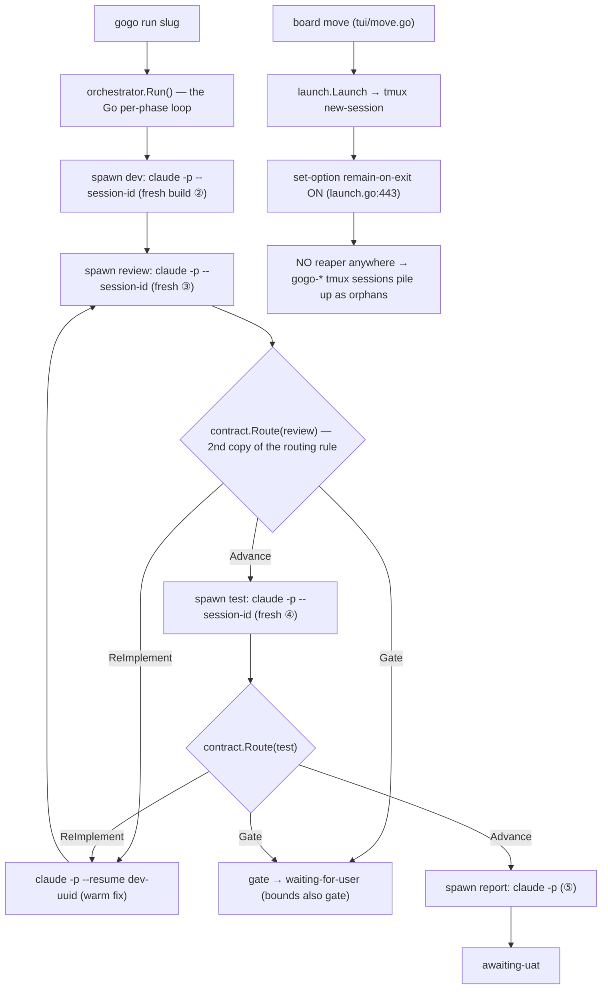
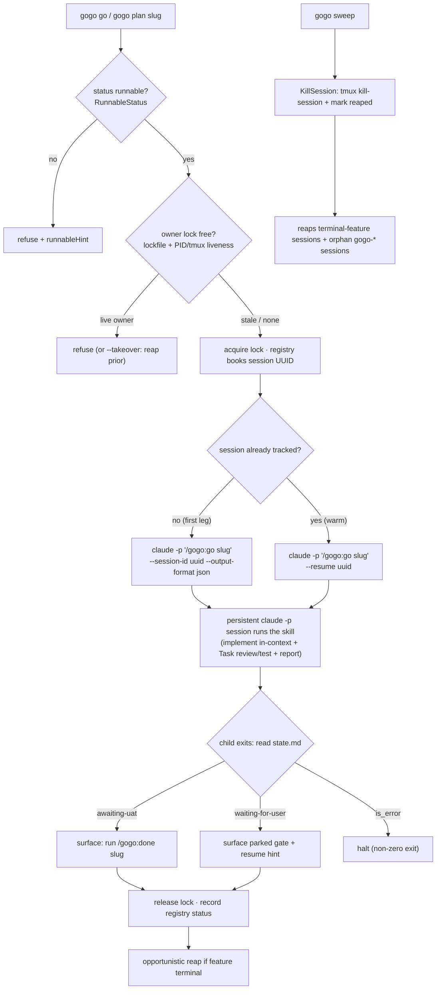

# Report — feature `persistent-session-orchestrator`

- **feature:** the `gogo` CLI reworked into a persistent-session lifecycle manager over the one `/gogo:go` skill (+ one-owner lock, session registry, kill-at-ship, orphan-sweep)
- **status:** awaiting-uat
- **completed:** 2026-07-12
- **branch / commits:** `main` · not yet committed (gogo defers commits to the user)

**What shipped, in one line:** the `gogo` CLI stopped *re-implementing* the pipeline loop — `gogo go <slug>` / `gogo plan <slug>` now **launch-or-`--resume` ONE persistent `claude -p` session** running the existing skill, and the CLI is a pure **session-lifecycle manager** (owner lock · session registry · exit classification · reap / `gogo sweep`). Version **0.14.0 → 0.15.0**.

## Run status / gaps

All phases completed; **no open issues.** plan ✅ · implement ✅ (2 rounds: build + 1 review-fix round) · review ✅ (2 rounds, round-2 APPROVE, REV-001..004 all verified) · test ✅ (suite 149/149 + hands-on; TEST-001 verified by a live smoke) · report ✅. The one hands-on gate (the true end-to-end, TEST-001 / decision **D7**) was **resolved and verified** — see Test outcome.

## Summary

The CLI previously carried a **second copy of the pipeline loop** in Go (`gogo run` → `orchestrator.Run()` spawning fresh dev/review/test `claude -p` sessions and re-routing via `contract.Route`), which meant the routing rule lived in two places and could drift, and a live incident showed board-launched sessions **piling up as orphaned tmux panes** (the `remain-on-exit` leak with no reaper). This slice **deletes that Go loop** and makes the CLI launch **one persistent session that runs the whole feature through the skill** (implement in-context + review/test as nested `Task` subagents + report), keeping the single routing rule in the skill. It also lands the two incident fixes the plan called out: a **one-owner-per-work-item lock** and a **session registry + kill-at-ship + `gogo sweep`**.

## Planned vs shipped

Shipped **as planned** (all of FR1–FR12, every decision D1–D6 as accepted), with **two correctness improvements added during review** beyond the plan letter:

- **As planned:** `gogo go`/`gogo plan` launch-or-resume one persistent `claude -p` session; the acceptance gate still guards `gogo go` (`RunnableStatus`); exit classification reads `state.md` (awaiting-uat / waiting-for-user / `is_error` halt); the one-owner lock (lockfile + PID/tmux liveness cross-check, refuse-by-default, `--takeover`, stale-reclaim); the extended session registry (per-leg, degrade-to-fresh); reap at ship + `gogo sweep` orphan reaper; the `--attach` path that never sets `remain-on-exit`; `gogo run` deprecating alias; version + `docs/cli-contract.md` + README sync. The Go loop + `contract.Route` are deleted.
- **Added in review (not in the plan letter, but within FR5/FR6's intent):** (1) a **write-scope slug guard** (`validSlug`) so a `..`/`/` slug can't escape `.gogo/resources/` (REV-001); (2) the lock now **also refuses over a live *untracked* `gogo-*` session** that wrote no lockfile — the exact board-launched racer the lock exists to catch, which the first cut missed (found while fixing REV-002/003).
- **Not changed (deliberately, FR10):** the `/gogo:go` / `/gogo:plan` / `/gogo:done` skills, commands, and templates. The CLI is the only thing reworked.

## Implementation

The CLI is now a thin **session-lifecycle manager**. `gogo go`/`gogo plan` build a `Session` (in `cli/internal/orchestrator`) and call **`LaunchOrResume`**, which: reaps opportunistically if the feature is already terminal → **acquires the owner lock** (`Acquire`) → resolves **fresh-`--session-id` vs warm-`--resume`** from the registry (`ResolveInvocation`, pure) → runs the persistent session (headless `claude -p`, blocking, via `launch.RunPhase`; or an attachable tmux via `launch.LaunchPersistent` with `--attach`) → **classifies the exit** by reading `state.md` (`classifyExit`) → books telemetry + updates the registry → releases the lock. There is **no phase loop and no routing in Go** — the skill owns implement (in-context) + review/test (nested `Task`) + report.

**The lock** (`lock.go`, D1=C) is a lockfile (`.gogo/resources/cli/locks/<slug>.lock`) recording PID + uuid + tmux + host + started-at, whose liveness is cross-checked against **both** signal-0 (`launch.PidAlive`) **and** a matching live `gogo-*` tmux session (exact `launch.SessionMatchesSlug`, never substring). Either alive → live (refuse-by-default, or `--takeover` seizes + reaps the prior); both dead → stale, silently reclaimed. The fresh create is **atomic** (`O_CREATE|O_EXCL`), and a live **untracked** board session (no lockfile) is refused too.

**The registry** (`registry.go`) tracks a per-leg (`go` | `plan`) persistent session — uuid, tmux name, PID, a lifecycle status (`running`/`parked`/`awaiting-uat`/`shipped`/`reaped`), timestamps, and per-leg cost/turns telemetry — under `.gogo/resources/cli/sessions/<slug>.json`. Missing/garbled/legacy-`gogo run` → degrades to a fresh run, never a crash.

**The reaper** (`sweep.go`, `launch.KillSession`, D5=A) kills a feature's tracked session at ship (opportunistically) and, via `gogo sweep`, reaps orphaned `gogo-*` sessions (no live non-terminal owning feature) + a TTL backstop, with `--dry-run`. The `--attach` path never sets `remain-on-exit`, so it leaves no lingering pane by construction.

### Changes (as-built)

| File | Change | Note |
|---|---|---|
| `cli/internal/orchestrator/orchestrator.go` | rewritten | `Run()` per-phase loop → `Session.LaunchOrResume` + `Reap` + `classifyExit` + `ResolveInvocation`; injectable `Runner`/`Attacher`/`Killer`/`Lister`/`Live` seams |
| `cli/internal/orchestrator/lock.go` | added | owner lock: atomic `O_EXCL` acquire, PID+tmux liveness cross-check, refuse/reclaim/takeover, untracked-board-session refuse, `SetTmux` |
| `cli/internal/orchestrator/registry.go` | modified | extended to per-leg `PersistentSession` (status/timestamps/telemetry); back-compat degrade-to-fresh |
| `cli/internal/orchestrator/sweep.go` | added | `Sweeper` — kill-at-ship + orphan reaping (exact attribution) + TTL + `--dry-run` + stale-lock heal |
| `cli/internal/launch/launch.go` | modified | `KillSession`, `PidAlive`, `LaunchPersistent`/`TmuxPersistentArgs` (no `remain-on-exit`), `ActionPlan`; refreshed stale doc-comments |
| `cli/go.go` | added (was `run.go`) | `cmdGo`/`cmdPlan`/`cmdSweep` + `cmdRun` deprecating alias; `validSlug` write-scope guard |
| `cli/main.go` | modified | dispatch `go`/`plan`/`sweep` (+ `run`); `Version` 0.14.0 → 0.15.0; rewritten help |
| `cli/internal/contract/route.go` + `route_test.go` | removed | the routing rule now lives only in the skill (D3=A) |
| `cli/internal/contract/result.go` | removed | dead `PhaseResult`/`ReadResult` after the loop went (REV-004) |
| `cli/run.go` + `cli/run_e2e_test.go` | removed | superseded by `go.go` + `go_e2e_test.go` |
| `cli/internal/orchestrator/orchestrator_test.go` · `cli/go_e2e_test.go` | rewritten/added | resolver · lock refuse/reclaim/takeover/board-racer · registry round-trip · reap · orphan-sweep (TEST-005) · exit classification · slug validation · hermetic stub-claude e2e |
| `.claude-plugin/plugin.json` | modified | `version` 0.15.0 |
| `docs/cli-contract.md` · `README.md` | modified | additive §0.15.0 (lock, registry, `gogo go`/`plan`/`sweep`, `run` alias) + subcommand list |

## Decisions & rationale

All six plan-time forks were accepted as recommended at acceptance; one hands-on gate (**D7**) opened at test and was resolved. See [decisions.md](../decisions.md).

| Decision | Choice | Reason |
|---|---|---|
| **D1** lock mechanism | **C** — lockfile **+** PID/tmux liveness cross-check | Catches the board tmux racer, records the owner, and self-heals a stale lock — a pure file or a pure scan each miss a case |
| **D2** naming | **A** — rename `gogo run` → `gogo go` (+ `gogo plan`), keep `run` as a deprecated alias | The verb should match the skill it launches; `run`'s per-phase meaning is gone |
| **D3** `contract.Route` | **A** — delete `route.go`/`route_test.go` + the Go loop | A second copy of the routing rule is the drift bug this slice removes; keep one rule, in the skill |
| **D4** `-p` vs attach | **C** — headless `-p` default + `--attach` option | `-p` is spike-proven, cost-lean, race-free exit; `--attach` preserves live-answer ergonomics without making the leak-prone path the default |
| **D5** who reaps at ship | **A** — `gogo sweep` + opportunistic reap | Keeps `/gogo:done` + skills untouched (FR10); `gogo sweep` is the durable orphan-reaper the incident demands |
| **D6** lock contention | **A** — refuse-by-default, `--takeover` to seize | The incident was *silent* double-driving; refusing loudly is the safe default |
| **D7** true e2e (test gate) | **light real smoke** | The change under test is the CLI session-manager; a real `gogo plan` leg exercises exactly the new code against a live model, cheaper than a full pipeline |

## Review outcome

**Two rounds, both APPROVE.** Round 1 found no blockers/majors and 4 agent-fixable findings (3 minor + 1 nit); all were fixed in-context and **round 2 VERIFIED every one** with no regressions and no new findings.

- **REV-001** (write-scope): `gogo plan` fed an unvalidated slug into `LockPath`/`RegistryPath` — a `..` slug could escape `.gogo/resources/`. Fixed with `validSlug`.
- **REV-002** (wrong reap): takeover/reclaim reaped the lockfile's pre-collision base tmux name. Fixed by reaping **by slug** (`reapMatchingSessions`, exact `SessionMatchesSlug`) + recording the real name via `Lock.SetTmux`.
- **REV-003** (TOCTOU): non-atomic acquire. Fixed with `O_CREATE|O_EXCL`; **also closed a gap the review didn't flag** — the lock now refuses over a live untracked (board) session.
- **REV-004** (dead code): deleted the orphaned `contract/result.go`; refreshed stale `launch.go` comments.

See [review/issues.json](../review/issues.json), [review-01.md](../review/review-01.md), [review-02.md](../review/review-02.md).

## Test outcome

**GREEN.** From `cli/`: `gofmt -l .` clean · `go vet ./...` clean · `go test -race ./...` **149/149** across all packages — including the hermetic **stub-claude e2e** (`TestGoE2EStubClaude`: crosses the real `exec.Command("claude",…)` boundary — first-launch argv, warm `--resume`, `is_error` halt, `run`-alias) and the full lock/registry/reap/sweep suite. Hands-on CLI (built binary, `0.15.0`): `--version`/help, `gogo sweep --dry-run` correctly **sparing** the live in-flight session, the REV-001 traversal refusal, the `gogo run` deprecation-forward, and throwaway-fixture status-gate hints.

**TEST-001 (the true end-to-end) — verified by a live smoke** (D7). `gogo plan psorch-smoke` drove a **real** `claude -p "/gogo:plan psorch-smoke"`: fresh `--session-id`, real `exec` + JSON-envelope parse, the real `gogo-plan` skill parked at `awaiting-plan-acceptance`, and the CLI **classified the exit correctly** (exit 2 + resume hint). Side effects confirmed: the registry booked a `plan` session with a real uuid, `status: parked`, and **live telemetry** (cost $4.69, 11 turns, 745s); the **lock was released**. This exercises the whole new CLI path against a live model. See [test/issues.json](../test/issues.json), [test-01.md](../test-01.md).

## Diagrams

The as-built UML set — open [diagrams.html](./diagrams.html) (same folder):

- **flow** (`flow.mmd`) — `gogo go/plan` control flow: lock guard (incl. the untracked board racer) → launch-or-resume the persistent `claude -p` → classify exit → reap/sweep.
- **sequence** (`sequence.mmd`) — two orchestrators over one skill: the CLI session manager spawns `claude -p "/gogo:go"`, the skill runs implement in-context + `Task` review/test + report.
- **activity** (`activity.mmd`) — the session lifecycle: none → running → parked/awaiting-uat (resume) → shipped/orphaned → reaped.
- **class** (`class.mmd`) — the shipped structure: `Session` manager + `Registry`/`PersistentSession`, `Lock`/`Owner`, `Sweeper`, and the injectable `SessionRunner`/`AttachFn`/`LivenessFn`/`Lister` seams.

## Before / after comparison

Plan ① captured a **before** (as-is) flow, copied into this bundle at `report/before/flow.mmd`. Only the **flow** kind exists in both sets (the before baseline drew one diagram); the after set **adds** sequence, activity, and class (shown above).

**What changed:** the before is the **per-phase Go loop** (`gogo run` → `orchestrator.Run()` spawning fresh dev/review/test sessions, re-routing via **two copies** of the rule with `contract.Route`) **plus** the board-launch `remain-on-exit` leak with **no reaper**. The after collapses all of that into **one persistent session guarded by the lock**, with the routing rule living only in the skill, and a reaper (`gogo sweep` + opportunistic) that stops orphans by construction.

**Before — the deleted per-phase Go loop + the orphan leak:**

**After — the persistent-session lifecycle manager:**

## Knowledge updates

- **`.gogo/knowledge/project-knowledge.md`** (`## gogo overrides`) — updated the CLI section from the per-phase `gogo run` orchestrator to the 0.15.0 persistent-session model (subcommands + lock/registry/reap).
- No `Mode: proxy` `Source:` file was touched, and no `## Custom` section was changed. **Consider upstreaming** (user's call): a one-line note in the project README/CLAUDE.md that `gogo run` is now a deprecated alias for `gogo go` — already reflected in `README.md`'s CLI section.

## Follow-ups & known limitations

Deferred to later slices (noted in the plan, not built here):

- **Gate/state CLI commands** (`gogo accept`/`gogo adjust`/`gogo done`) — the board still launches the slash commands.
- **Board drill-in** surfacing session status + cost/turns telemetry (the data is *recorded* now, not displayed).
- **Multi-model** (gemini/codex) behind an agent-type seam.
- **Changing the board's `Launch`/`remain-on-exit`** — the reaper covers its orphans meanwhile.
- **A `/gogo:done` reap hook** for *immediate* kill-at-ship (this slice reaps via `gogo sweep` + opportunistic detection, D5).
- Minor: `writeOwner` ignores a write error on the just-created lock handle (consistent with the file's best-effort discipline; negligible).

## Summary (TL;DR)

- **What shipped:** the `gogo` CLI became a **pure session-lifecycle manager** — `gogo go`/`gogo plan` launch-or-`--resume` **one persistent `claude -p` session** running the existing skill; the Go per-phase loop + `contract.Route` are **deleted**; plus a **one-owner lock** (lockfile + PID/tmux liveness, refuse/`--takeover`, atomic acquire, board-racer refuse) and a **session registry + `gogo sweep`** reaper. Version **0.15.0**.
- **Review verdict:** **APPROVE** (2 rounds; REV-001..004 all fixed and verified, no regressions).
- **Test verdict:** **GREEN** (`gofmt`/`vet`/`race` clean, 149/149 incl. the hermetic stub-claude e2e; the true e2e **verified** by a live `gogo plan` smoke).
- **Follow-ups:** the deferred slices above (gate/state CLI, board drill-in, multi-model, board `Launch` cleanup, `/gogo:done` reap hook) — none blocking.
