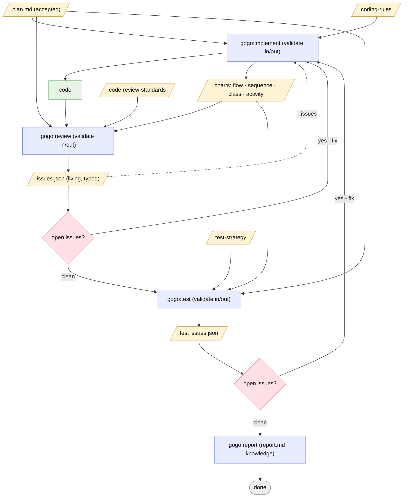

# Plan — Composable, validatable pipeline commands

Status: **done — Stage A** (2026-06-24). Accepted (user, 2026-06-24) — D1–D7 as recommended.

## As-built outcome
- **Stage A shipped** (per D7): the four JSON-Schema contracts + `gogo-contracts`
  validation skill, the living `issues.json` (review/test), `implement --issues`
  + as-built charts, and the four standalone commands (`implement`/`review`/`test`
  /`report`). Docs synced; version **0.1.4 → 0.2.0**. Working tree **uncommitted**.
- **Review:** 2 rounds — CHANGES (1 major chart-kind contract drift + 4 sync) →
  **APPROVE**. **Test:** GREEN (issues-list negative cases all rejected; the
  `fixed ⇒ fixed_in_round + fix_summary` conditional fires; portability fallback holds).
- **Deferred to Stage B:** rewiring `/gogo:go` + the orchestrator loop to chain on
  `result.json`/`pipeline.json`. Standalone commands emit `result.json`; consuming
  it is Stage B.
- Full write-up: [report.md](./report.md). Diagrams: [charts/diagrams.html](./charts/diagrams.html).

## Goal
Break the monolithic `/gogo:go` run into **standalone, individually-runnable
phase commands** that behave like **typed functions in a pipeline chain**: each
declares the documents it consumes, **validates its inputs**, does its work, and
**validates its outputs** before hand-off. Because the workers are LLMs
(non-deterministic), the contract + validation at every boundary is what
guarantees correct data flows to the next command. `/gogo:go` becomes a thin
orchestrator that chains the same commands and loops until the issue lists are
empty.

## Context — what exists today
- **Commands:** `build`, `plan`, `go`, `status`, `resume`. `go` is a *monolithic*
  orchestrator — it runs implement→review→test→report **internally** by delegating
  to agents; phases ②③④⑤ are **not** separately runnable.
- **Phase skills** already exist and are the natural unit to expose:
  `gogo-implement` ②, `gogo-review` ③, `gogo-test` ④, `gogo-knowledge` ⑤
  (+ `gogo-plan` ①, `gogo-mermaid`).
- **Agents:** `gogo-developer` ②, `gogo-reviewer` ③, `gogo-tester` ④.
- **Artifacts today** are mostly prose: `plan.md`, `review-NN.md`, `test-NN.md`
  (free-form markdown), `report.md`, `charts/`, `state.md`, `decisions.md`. Nothing
  is machine-validated; hand-offs rely on the next agent re-reading prose.
- **Constraints** (`.gogo/knowledge/`): core loop must stay **dependency-free**;
  optional tools (`jq`, Playwright, `mmdc`) must degrade gracefully; only ever
  write under `.gogo/`; keep all enumerations in sync; bump `plugin.json` version.

## Functional requirements
- **FR1 — Standalone phase commands.** Add `/gogo:implement`, `/gogo:review`,
  `/gogo:test`, `/gogo:report`, each runnable on its own for a feature slug, each
  thin (invoke the phase skill). `go`, `plan`, `build`, `status`, `resume` stay.
- **FR2 — Declared, validated inputs.** Each command declares the documents it
  accepts (required + optional) and runs a **validate-in** gate: every required
  input must exist, parse, and conform to its contract. Invalid/missing → STOP
  with a precise contract error; never do work on bad input.
- **FR3 — Validated, typed outputs.** Each command produces artifacts that conform
  to a defined contract and runs a **validate-out** gate before hand-off (repair
  once, else mark `blocked`). The next command can rely on the shape.
- **FR4 — Issues-list contract (JSON).** `review` and `test` emit a structured
  issues list: array of `{ id, title, description, proposed_solution, severity,
  priority, status, origin, found_in_round, fixed_in_round?, fix_summary? }`.
  `severity ∈ {blocker,major,minor,nit}`, `priority ∈ {P0,P1,P2,P3}`,
  `status ∈ {open,fixed,verified,wontfix,new}`.
- **FR5 — Living issues list.** Re-running `review`/`test` **updates the same list
  in place** (open→fixed/verified, adds `new`), so "review after fixes" is just
  re-running `review`. A human-readable `review-NN.md`/`test-NN.md` snapshot is
  rendered each round for the audit trail.
- **FR6 — `implement` consumes an issues list.** `/gogo:implement --issues <path>`
  takes plan + coding-rules + an issues list, fixes the open issues, and writes
  back **what was fixed and how** (`status: fixed`, `fix_summary`, `fixed_in_round`).
  Plain `/gogo:implement` (no issues) builds the plan from scratch.
- **FR7 — `implement` produces as-built charts.** Implementation emits the as-built
  diagram set (flow / sequence / class / activity-or-state, per the diagram-subject
  rules — the *product*, never the task list) into `charts/`; `review` and `test`
  consume them as inputs.
- **FR8 — Deterministic chaining state.** Each command writes a small per-run
  `result.json` (`{phase,status,inputs[],outputs[],validated_in,validated_out,
  summary}`); a feature-level `pipeline.json` indexes current artifacts + validity.
  `state.md` stays the human-facing phase/status file.
- **FR9 — `go` orchestrates the commands.** `/gogo:go` chains
  plan✓ → implement → review → (loop implement↔review on open issues, bounded ~3) →
  test → (loop back to implement on open test issues) → report, deciding purely on
  **issues-list emptiness** + `result.json`. No bespoke logic that the standalone
  commands don't also use.
- **FR10 — Contracts are documented + portable.** Schemas live in the plugin
  (`templates/contracts/*.schema.json`) with a human contract doc; validation is
  **two-tier**: structural via `jq`/JSON-schema *if present*, else agent-checks
  against the schema; semantic checks (right slug, real paths, unique ids, valid
  enums) always run. No new required dependency.

## Approach (recommended)
Introduce a **contract layer** and expose each phase as a thin command over its
existing skill; keep the artifacts the workers already write, but add a
machine-validatable JSON contract for the data that crosses phase boundaries.

1. **`gogo-contracts` skill (new)** — the pipeline's "type system": defines each
   artifact schema (plan, issues-list, charts-manifest, phase-result, pipeline
   index) and the reusable **validate-in / validate-out** procedure (two-tier,
   portable). Every phase skill calls it at entry and exit.
2. **Schemas** — `templates/contracts/{issues-list,phase-result,pipeline,charts-manifest}.schema.json`
   + `templates/contracts/README.md` documenting each shape and which command
   produces/consumes it.
3. **Expose commands** — add `commands/{implement,review,test,report}.md` (thin),
   each invoking its phase skill with `validate-in → work → validate-out`.
4. **Upgrade phase skills** — `gogo-implement` (accept `--issues`, emit charts +
   fix-backs), `gogo-review`/`gogo-test` (emit the JSON issues-list contract +
   render the md snapshot; idempotent living-list updates), `gogo-knowledge`
   (standalone `report`). Each declares its input/output contracts.
5. **Rewire `gogo` orchestrator + `go`** — loop on issues-list emptiness using
   `result.json`/`pipeline.json`; delegate to the same commands/skills.
6. **Sync + docs + version** — update every enumeration (orchestrator, README
   feature-folder + commands tables, `state.template` file-list), bump version.

### Alternatives considered
- **Hard-require `jq`/a JSON-schema validator** for validation — *rejected*:
  breaks the dependency-free portability bar. Two-tier (optional jq, else
  agent-validate) keeps it portable.
- **Agent-only validation, no schemas** — *rejected*: not reliably checkable; the
  whole point is to catch a bad LLM hand-off, which needs an explicit shape.
- **Literally 5 commands** (separate `implement-from-review`, `review-after-fixes`)
  — *rejected*: duplication. Idempotent, input-driven `implement`/`review` collapse
  them (see D5).
- **Markdown-first issues list** — *rejected for the contract*: not machine-checkable.
  JSON is the contract; markdown is the rendered human view (D1).

## Open decisions (recommendations — see `decisions.md`)
- **D1 Issues list: JSON-first** (machine contract) + rendered `*-NN.md` human view. *Rec.*
- **D2 One living `issues.json` per track** (review, test), updated in place; `*-NN.md` = per-round snapshot. *Rec.*
- **D3 Validation = in-plugin schemas + two-tier check** (jq if present, else agent), via `gogo-contracts`. *Rec.*
- **D4 Chaining state = per-run `result.json` + feature `pipeline.json`**, with `state.md` staying human-facing. *Rec.*
- **D5 Three idempotent worker commands** (`implement`/`review`/`test`) + `report` + orchestrator `go`. *Rec.*
- **D6 Chart kinds from `implement`:** flow + sequence + class + activity/state-when-relevant. *Confirm kinds.*
- **D7 Phasing:** Stage A = contracts + validation + issues-JSON + standalone `review`/`implement`/`test`/`report`; Stage B = rewire `go` chaining + `pipeline.json`/`result.json`. *Rec. two stages.*

## Changes checklist (build order)
1. `templates/contracts/` — `issues-list.schema.json`, `phase-result.schema.json`,
   `pipeline.schema.json`, `charts-manifest.schema.json`, `README.md` (contract doc).
2. `skills/gogo-contracts/SKILL.md` — schema registry + validate-in/out procedure.
3. `skills/gogo-review/SKILL.md` — emit `issues.json` (living) + render `review-NN.md`; validate in/out.
4. `skills/gogo-implement/SKILL.md` — `--issues` fixes + fix-backs; emit as-built charts; validate in/out.
5. `skills/gogo-test/SKILL.md` — emit test `issues.json` + `test-NN.md`; loop-back contract; validate in/out.
6. `skills/gogo-knowledge/SKILL.md` — standalone report; validate in.
7. `commands/{review,implement,test,report}.md` — thin entry points.
8. `skills/gogo/SKILL.md` + `commands/go.md` — orchestrate via the commands; loop on issues-emptiness; `result.json`/`pipeline.json`.
9. `templates/state.template.md` (+ feature-folder enumerations), `README.md` (commands + What-gets-created), `.claude-plugin/plugin.json` version.

## Tests (how we'll verify — see `test-strategy.md`)
- **Contract unit checks:** feed each command a malformed input (missing field,
  bad enum, wrong slug) → it must reject at validate-in with a clear error.
- **Standalone runs:** `/gogo:review <slug>` on a scratch repo yields a schema-valid
  `issues.json`; `/gogo:implement --issues issues.json` marks them fixed with
  `fix_summary`; re-running `/gogo:review` flips them to `verified` / adds `new`.
- **Chaining:** `/gogo:go` loops implement↔review until empty, then test, then
  report — driven only by issues-list state.
- **Portability:** validation works with `jq` absent (agent-validate path).
- **Sync/version:** grep enumerations; confirm version bumped; diagrams render.

## Diagrams (intended design)
Open `charts/diagrams.html` for all three (offline). The command pipeline —
typed artifacts flowing through validate-in/out, looping on issues:

- `charts/issue-lifecycle.mmd` — an issue's status lifecycle in the living `issues.json`.
- `charts/handoff.mmd` — a validated review→implement hand-off through `gogo-contracts`.

## Out of scope
- Rewriting the plan ① acceptance gate or the knowledge/build system.
- A compiled validator or any new runtime dependency.
- Parallelizing phases / multi-feature orchestration.
- Changing the agents' review/test *judgment* — only their **output contract**.
