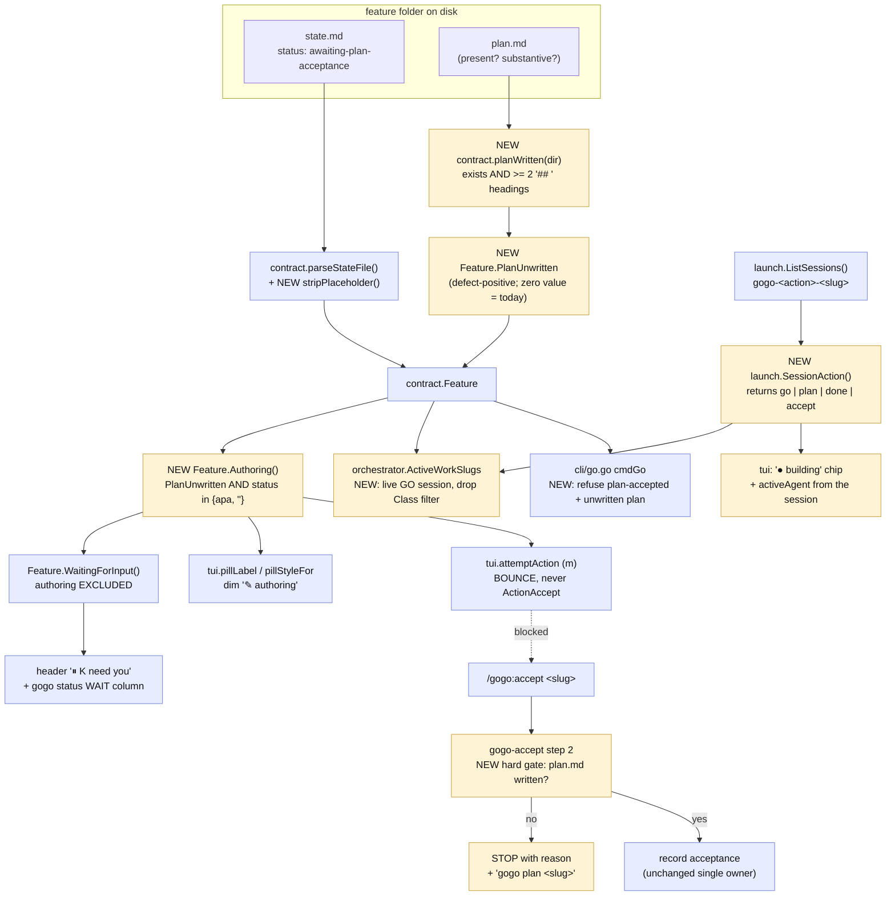
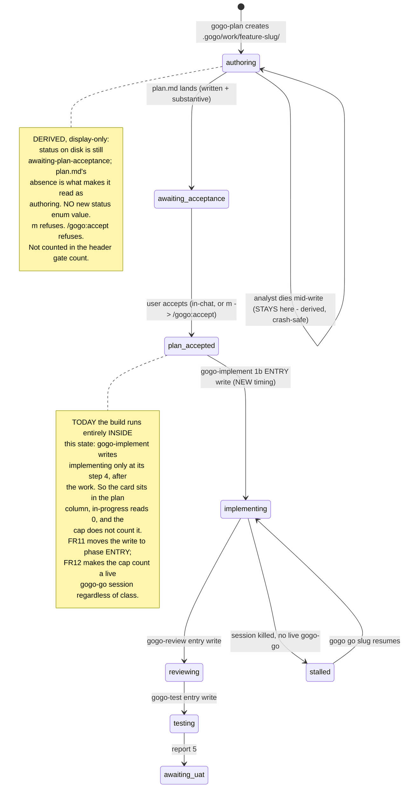

# Plan — plan-readiness-gate

Status: awaiting acceptance

**The board narrates the past, not the present.** Two live sightings, one root cause: a
card offered `⏸ accept plan` while its `plan.md` did not yet exist, and a card sat in the
**plan** column reading `plan-accepted` while a session was actively editing files and
running tests for it (`in progress 0`, `● 2 session`). Both happen because **`state.md`
is a completion log, not an occupancy record** — every phase writes it once, at a
boundary, describing work that is already over. This plan fixes the writer (record
occupancy at phase **entry**) and, where safety depends on it, makes the readers **verify
instead of trust**. **No new `status` enum value, no change to the frozen classifier.**

## Goal

Make the board's displayed state **agree with what is actually happening**, in both
directions:

- A work item under **authoring** must never be offered for acceptance, and must read
  differently from one genuinely awaiting acceptance.
- A work item being **built** must not sit in the plan column, must not read `plan-accepted`,
  and must count against its source's concurrency cap.

Both must be **crash-safe**: a session that dies must leave an item that is *visibly*
incomplete or stalled, never one that silently looks fine.

**Acceptance signal (two probes):**
1. A folder with a template `state.md` (`awaiting-plan-acceptance`) and **no `plan.md`**
   reads `✎ authoring`, is excluded from `⏸ K need you`, `m` refuses, and `/gogo:accept`
   refuses before presenting anything.
2. A feature with a live `gogo-go-<slug>` session reads as **building** on the board
   **and** counts against its source cap, even in the window before the developer writes
   `state.md`.

---

## Context — one root cause, two sightings

I verified every claim in both reports against the tree. **Four need correcting**, and
the corrections change where the fix belongs.

### The unifying defect

`state.md` is written **at phase boundaries, describing the phase that just ended**:

| Phase skill | Where it writes `state.md` | Consequence |
|---|---|---|
| `gogo-plan` | **step 5**, after `plan.md` (step 3) — writes the *exit* status `awaiting-plan-acceptance` ("planning is done, over to you") | If the analyst reorders and writes it early, the gate opens **before the plan exists** |
| `gogo-implement` | **§④ Update state** — *after* §② does all the work and §③ validates out | `status: implementing` means "implementing just **finished**". During the entire build the disk still says `plan-accepted` |
| `gogo-review` | `SKILL.md:96`, in §④ Route — after §② review and §③ validate-out | same |
| `gogo-test` | `SKILL.md:100`, after the test run | same |

So the on-disk status is **never** the status of work in flight. It is the status of work
that has stopped. Sighting 1 is that boundary write landing **too early relative to its
own output**; sighting 2 is it landing **too late relative to the work it names**.

The telemetry has the same shape: `gogo-implement` §④ appends **both** `phase-started`
*and* `phase-done` in one burst at the end. `events.jsonl` is a post-hoc log, not a live
stream — which is why the user's guess ("it will switch on first review when events get
updated") is essentially right.

### Sighting 1 — a plan offered before it is written

| Claim | Verified at |
|---|---|
| The template ships pre-set "ready to accept" values | `templates/state.template.md:27-29` — `- **feature:** <one-line title>` · `- **phase:** plan` · `- **status:** awaiting-plan-acceptance` |
| The classifier never checks `plan.md` | `cli/internal/contract/contract.go:314-335` `classify()` — matches on status / report / phase only; a bare template folder falls to `default: ClassUnfinished` → `ColPlan` |
| The placeholder leaks straight to the card | `state.go:38-39` sets `f.Title = val` verbatim; `view.go:614-617` falls back to the slug only when the title is **empty** — `<one-line title>` is not empty |
| `/gogo:accept` gates only on status | `skills/gogo-accept/SKILL.md:43-49` — "Proceed **only** when `status: awaiting-plan-acceptance`". No `plan.md` precondition anywhere |
| The board routes `m` straight there | `cli/internal/tui/move.go:67-69` |

**Is accepting a never-written plan reachable end to end? Yes.** Board `m` →
`attemptAction` (`move.go:59-69`) → `ClassUnfinished` + status match → `ActionAccept`,
**uncapped, no `plan.md` check** → `claude "/gogo:accept <slug>"` → gogo-accept step 1
resolves the folder ✓, step 2 gates on status ✓ (**passes**), step 3 says "Present the
plan. Show `plan.md`'s summary…" with no file to read, step 5 records acceptance
unconditionally. **The only thing between a nonexistent plan and `plan-accepted` is the
LLM noticing at step 3.** That is not a gate.

`skills/gogo-implement/SKILL.md` §① *would probably* catch it ("confirm … **and `plan.md`
exists**") — but only after acceptance is recorded, the single-owner `plan-accepted` event
is emitted, and (in a `planAcceptanceSkip` source) the reload auto-pickup
(`cli/internal/tui/pickup.go:33-45`) has already fired `claude -p /gogo:go <slug>` at it
unattended. And that catch is itself LLM prose. **Severity: high.**

### Sighting 2 — an item being built sits in the plan column

| Claim | Verified at |
|---|---|
| `classify` takes only the state-derived Feature + changelog; **sessions are not an input** | `contract.go:314` `func classify(f *Feature, cl []*ChangelogEntry)` |
| Its in-progress arm is phase/status only | `contract.go:363-373` `inProgressPhaseOrStatus` — `phase ∈ {implement, review, test}` OR `status ∈ {implementing, reviewing, testing}` |
| A mid-build item still reads `plan: plan-accepted`, so it falls to `default:` → `ClassUnfinished` → **plan** column | `contract.go:325-334` + `Column()` at `contract.go:36-49` |
| The session signal exists and is already used — but never for placement | `m.sessions` from `launch.ListSessions()` (`model.go:403,684`); `hasLiveSession` drives the footer (`view.go:198`) and changelog rows (`view.go:299`) |
| **The cap does not count it** | `orchestrator/cap.go:37` — `if f.Class != contract.ClassInProgress { continue }` |

**The cap bypass is real and is the severity argument.** `ActiveWorkSlugs` requires
`Class == ClassInProgress` **and** a live session. An item building under a stale
`plan-accepted` fails the first test, so it is invisible to `CapExceeded` — a second
`gogo go` in the same repo is allowed, and two Claude sessions edit one working tree.
That is precisely what the cap exists to prevent. The one-owner lock does **not** cover
it: `.gogo/resources/cli/locks/<slug>.lock` is per-**slug**, not per-repo. The same
under-count also frees a slot for the reload **auto-pickup** (`pickup.go:51-55`), so a
plan's other members can auto-fire into a repo that is already busy.

**A third symptom, found while tracing:** `renderCard` (`view.go:622-625`) computes the
live-agent chip as `activeAgent(f)`, which maps `f.Phase` — still `plan` — to `"analyst"`.
So a card that is being **built** displays **`● analyst`**. The card is wrong in its
column, its status pill, *and* its agent chip, all from the same stale phase line.

### Corrections — where the reports are wrong

**1. `cli/internal/contract/files.go:42` is not the classifier, and it *does* check
existence.** That line is `add("plan.md", …)` in `Artifacts()` — the **drill-in file
list** — and `add` wraps `fileExists` (`files.go:36-40`). It is correct. The real gap is
`classify()`/`loadFeature()` in `contract.go`.

**2. `gogo-plan` does not document writing `state.md` early and `plan.md` last — it
documents the opposite.** `skills/gogo-plan/SKILL.md` orders: **1** folder · **2** analyse
· **3** write `plan.md` · **4** charts · **5** init `state.md`. This makes the bug *worse*:
the observed folder (`state.md` + `decisions.md` + `charts/`, no `plan.md`) proves the
analyst **ran the steps out of order**. Prose ordering is advisory to an LLM, so
**re-stating the ordering cannot be the fix** — it has to be enforced by a reader.

**3. `launch.SessionMatchesSlug` does *not* make the action available.** It loops all four
actions and returns a bare `bool` (`launch.go:481-495`). The *convention* encodes the
action and the parse correctly lives in `launch` (per `coding-rules.md` TEST-005), but
**no function returns it**. Telling `gogo-plan-<slug>` (authoring) from `gogo-go-<slug>`
(building) needs a new `launch.SessionAction()` — see **FR13**.

**4. The `⏸ x3` badge is not a card badge.** Grepping every `⏸`/`×` producer leaves
exactly two: `view.go:150` — the **header** pill `⏸ K need you`, fed by `needsYouCount()`
(`model.go:1057-1067`), which counts `WaitingForInput()` across all four columns; and
`view.go:603` — `⛓ ×N`, a card chip needing a `correlation:` line, and
`~/.gogo/projects/*/.gogo/plans/` does not exist on this machine, so no item carries one.
So `⏸ x3` = **`⏸ 3 need you`**. *Is it meaningful for a plan-phase item?* Only when the
item is genuinely at a gate — today an authoring item **inflates** it. FR2 fixes that for
free.

### One more symptom

A template `created:` of `<YYYY-MM-DD>` sorts the broken card to the **top** of the plan
column: `sortFeaturesNewestFirst` (`contract.go:375-382`) compares raw strings and `'<'`
(0x3C) > `'2'` (0x32). The most broken card is the most prominent one. And `v` on it
silently drops to the file list (`drill.go:188-193` returns `ok=false`) with no message.

---

## Functional requirements

### Slice A — plan readiness (the authoring case)

**FR1 — A written plan is a checked fact.** The contract reader determines, per feature,
whether `plan.md` is **written** (present and substantive) or **unwritten**. It exposes
this as an additive `Feature` field plus `Authoring()` = *unwritten plan* **and** status is
`awaiting-plan-acceptance` or empty. The field must be **defect-positive**
(`PlanUnwritten bool`) so a zero-value `Feature` keeps today's meaning byte-for-byte and
`contract/waiting_test.go` stays green unchanged.

**FR2 — An authoring item is not a user gate.** `WaitingForInput()` excludes an
`Authoring()` feature, so it drops out of `⏸ K need you` (`needsYouCount`) and the
`gogo status` `WAIT` column.

**FR3 — Visually distinct.** An authoring card renders a **dim `✎ authoring`** pill instead
of the red `⏸ accept plan`, and carries **no gate stripe**. It stays in the **plan** column
in `ClassUnfinished` — **the four classes and the class→column mapping are unchanged.**

**FR4 — The board's accept action refuses.** `m` on an authoring card bounces, never
`ActionAccept`: `plan.md not written yet — <slug> is still being authored`. Nothing
launches.

**FR5 — `/gogo:accept` refuses before presenting.** `skills/gogo-accept/SKILL.md` step 2
gains a **second hard gate**: `plan.md` must exist and be substantive. Otherwise STOP with
a precise reason and the recovery command.

**FR6 — Template placeholders never render as card text.** `parseStateFile` treats a value
that is a bare `<…>` placeholder as **empty** (`<one-line title>`, `<slug>`, `<YYYY-MM-DD>`,
`<git branch | n/a>`). The card falls back to the slug, and the placeholder `created:`
stops sorting broken cards to the top. One defensive-reader rule for every key — matching
the contract's own "parse defensively" mandate (`docs/cli-contract.md:404`).

**FR7 — Crash-safe by construction.** Because the signal is **derived at every read**, an
analyst that dies mid-authoring leaves an item that reads `✎ authoring` forever — nothing
to un-set, no cleanup step to miss, existing half-written folders fixed with no migration.

**FR8 — The unaccepted-plan invariant is strengthened, never weakened.** A feature at
`plan-accepted` with an unwritten `plan.md` is **refused** by both launch paths:
`gogo go <slug>` (`cli/go.go`) and the board's `m`. `/gogo:go` still requires
`plan-accepted`; this adds a requirement and removes none.

### Slice B — phase occupancy (the silent-build case)

**FR11 — Phases record occupancy at ENTRY, not completion at exit.** `gogo-implement`,
`gogo-review` and `gogo-test` write `phase: <p>` + `status: <p-ing>` and append the
`phase-started` event as their **first act after validate-in passes** (a new §①b), *before*
doing the work. The existing §④ keeps the exit write (iterations bump, `phase-done`).
`skills/gogo/SKILL.md` states the same for the in-context ② path.
**Result: an item being built reads `implementing` on disk, so it classifies in-progress in
every reader — TUI, `gogo status`, the cap, and any headless consumer — with no change to
`classify()` and no change to the frozen §3 table.**

**FR12 — The cap counts live builds, not classes.** `orchestrator.ActiveWorkSlugs` counts a
feature in `root` that has a live **`go`** session, regardless of its file-derived class.
The `Class == ClassInProgress` filter is removed: it is a redundant test that lies exactly
when the writer lags, and the cap's job — *don't let two builds clobber one working tree* —
is answered precisely by "is there a live build session here". This makes the safety guard
**deterministic and independent of LLM discipline**.

**FR13 — The session's ACTION is parseable where it is owned.** New
`launch.SessionAction(session, slug) (Action, bool)` returns the action component of the
`gogo-<action>-<sanitized-slug>[-N]` convention with an **exact slug-component compare**;
`SessionMatchesSlug` is refactored to delegate to it, so there stays exactly **one** parser
(`coding-rules.md` TEST-005). This is what lets every consumer tell `gogo-plan-<slug>`
(authoring — Slice A) from `gogo-go-<slug>` (building — Slice B), so Slice B can never
paper over Slice A.

**FR14 — Disagreement is shown, never hidden.** When a card's live session contradicts its
file-derived state, the card says so:
- live `go` session + status `plan-accepted`/`awaiting-plan-acceptance` → an amber
  **`● building`** chip and a status-line note. The card keeps its **file-derived column**
  (one source of truth across TUI / `gogo status` / `pages`), and the chip covers the
  launch-to-first-write window that FR11 shrinks (see **D6** for the column-override
  alternative).
- `activeAgent` derives from the **session action** when the phase disagrees, so a card
  being built shows `● developer`, never `● analyst`.
- `gogo status` gains a live-session marker (it calls no `ListSessions()` today) so the
  headless table cannot lie either.

**FR15 — Stalled is visible in the other direction too.** With FR11, a killed build leaves
`implementing` with no live session. That must read **stalled**, not running: the card
shows the working status with no `●` dot and a `· stalled` cue.
`RunnableStatus("implementing")` is already true, so `gogo go <slug>` resumes it — verify
no regression.

### Cross-cutting

**FR9 — The CLI still writes only its sanctioned roots.** Every CLI change here is
read-side and display-side. No new CLI write, no pipeline-state mutation, no LLM in the
read path. The `~/.gogo/`-only rule for the cockpit's own data is untouched.

**FR10 — Enumeration sync + version.** `docs/cli-contract.md`, `README.md`,
`docs/commands.md`, `commands/accept.md`, `skills/gogo/SKILL.md`,
`skills/gogo-plan/SKILL.md`, `skills/gogo-implement|review|test/SKILL.md` and
`templates/state.template.md` describe the new cues and gates consistently; the plugin
version bumps `0.27.0 → 0.28.0`.

---

## Approach — fix the writer, verify at the reader

Two complementary moves, applied to both sightings:

| | **Make the writer honest** | **Make the reader verify** |
|---|---|---|
| **Slice A** | `state.md` after `plan.md`, restated as a hard rule (FR10) | `planWritten()` → `Authoring()` → pill, gate count, `m`, `/gogo:accept` (FR1-FR8) |
| **Slice B** | write occupancy at phase **entry** (FR11) | cap keys on a live `go` session (FR12); card cues the disagreement (FR14-FR15) |

**The writer moves are LLM prose — the same class of instruction that already failed once
in Slice A.** That is exactly why each is paired with a deterministic reader-side guard.
Where a *safety* property depends on it (the cap), the reader guard is the fix and the
writer change is the improvement.

### Slice A: derive readiness, don't invent a status

The alternative — a new `authoring` status that `gogo-plan` sets on scaffold — reads
cleanly and, checked site by site, degrades safely by default (`classify`,
`WaitingForInput`, `RunnableStatus`, `PlannableStatus`, `TerminalStatus`,
`autoPickupReady`, `readyToShipStatus` all land on the right answer with no code change).
**But it does not fix what happened.** An LLM analyst does not `cp` the template — it
*writes* `state.md`, and `skills/gogo-plan/SKILL.md` step 5 explicitly instructs it to
"Set `state.md`: … **status=awaiting-plan-acceptance**". The safety would rest on the
analyst honouring a two-phase write in the right order — **the discipline that just
failed**. Prose guarding prose. And `status` is a **frozen-contract enum**
(`docs/cli-contract.md:394`); 14 sites name `awaiting-plan-acceptance` today. Recorded as
**D1**.

### Slice B: why not a session-aware classifier, and why not a TUI-only override

The coordinator's question, answered with what the code shows:

- **Session-aware `classify` is wrong.** `launch.ListSessions()` returns `nil` when tmux is
  absent (`launch.go:537-540`), and tmux is a **soft dep** by the portability NFR. So the
  core classifier would give **different answers for the same tree** depending on the host
  and on whether the caller happens to have tmux — and `docs/cli-contract.md` §3 is the
  **frozen, authoritative** classifier table, quoted verbatim from
  `skills/gogo-status/SKILL.md`. A deterministic file-surface reader must stay a function
  of the files.
- **A TUI-only display override is insufficient.** `cli/status.go` calls `ListSessions()`
  **zero** times, so `gogo status` would keep lying — and, decisively, **the cap reads
  `f.Class`** (`cap.go:37`), so the working-tree-clobbering bug would survive untouched.
- **Fixing the writer (FR11) fixes all of them at once** — columns, `gogo status`, the cap,
  `pages`, headless — with no contract change and no new coupling.
- **And the cap gets its own deterministic guard (FR12)** so the one *safety* property does
  not depend on an LLM writing a file on time.

Recorded as **D4** (where the fix belongs) and **D5** (the cap's `Class` filter).

### What "written" means (the stub check)

`planWritten(dir)` = `plan.md` exists **and** contains **at least two `## ` headings**.

Measured against the 25 existing plans in `.gogo/work/`: the smallest is **5,494 bytes**
and the fewest headings is **8**. A 4× margin with no false negative on any real plan; a
scaffold stub has 0-1. Structural rather than size-based, so a genuinely terse plan is
never rejected for brevity. Alternatives in **D2**.

### The design



### The timing fix, which is the whole of Slice B

```mermaid
sequenceDiagram
  autonumber
  actor U as User
  participant B as gogo board (TUI)
  participant C as claude /gogo:go &lt;slug&gt;
  participant D as gogo-implement
  participant S as state.md
  participant K as cap (ActiveWorkSlugs)

  U->>B: m on a plan-accepted card
  B->>C: launch tmux gogo-go-&lt;slug&gt;
  C->>D: phase 2 implement
  D->>D: validate-in (plan-accepted AND plan.md exists)
  D->>S: NEW 1b entry write: phase=implement status=implementing + phase-started
  Note over S,K: TODAY this write happens only at step 4,<br/>after ALL the work - so for the whole build<br/>state.md still says plan-accepted
  D->>D: edit files, run tests (minutes)
  B->>K: reload: is this repo busy?
  K-->>B: NEW counts a live gogo-go session (Class filter dropped)
  B-->>U: card reads implementing, in-progress column, cap enforced
  D->>S: step 4 exit write: iterations bump + phase-done
```

And the lifecycle the two slices produce together — `charts/state.mmd`:



### Alternatives considered

| Option | Verdict |
|---|---|
| New `authoring` status enum value (Slice A) | Rejected — prose guarding prose; frozen-enum change across 14 sites. **D1-B**. |
| Ordering fix only (Slice A) | Rejected as *the* fix — already the documented order, violated anyway. Kept as a belt (FR10). **D1-C**. |
| Session-aware `classify` (Slice B) | Rejected — tmux is a soft dep, so the frozen classifier would become host-dependent. **D4-B**. |
| TUI display override only (Slice B) | Rejected — leaves `gogo status` and, critically, **the cap** lying. **D4-C**. |
| Make `WaitingForInput()` stat the disk | Rejected — it is a pure status predicate pinned by `contract/waiting_test.go` on a `Dir`-less `Feature`; I/O belongs in the loader, where `detectReport` already lives. |
| Block only in `gogo-accept` | Rejected as sufficient — the card still lies and the `⏸` count still inflates. Kept as the **second** gate (FR5). |

---

## Changes checklist — in build order

### 1. Contract reader (Slice A, load-bearing)

- **`cli/internal/contract/contract.go`** — add `PlanUnwritten bool` to `Feature`
  (defect-positive; zero value = pre-0.28 meaning); add `planWritten(dir string) bool`
  (bounded read; any read error → treat as **written**, so a permissions hiccup never
  invents a defect); set `f.PlanUnwritten = !planWritten(dir)` in `loadFeature`; add
  `Authoring()`; refine `WaitingForInput()`'s `awaiting-plan-acceptance` arm to
  `!f.Authoring()`. **`classify()` unchanged.**
- **`cli/internal/contract/state.go`** — add `stripPlaceholder(s string) string` (a value
  that is exactly `<…>` → `""`), applied in `parseStateFile` after `stripComment`, for
  every key.

### 2. Session-action parser (shared by both slices)

- **`cli/internal/launch/launch.go`** — add `SessionAction(session, slug string) (Action, bool)`;
  refactor `SessionMatchesSlug` to `_, ok := SessionAction(...)`. One parser, exact
  slug-component compare (TEST-005).

### 3. Cap correctness (Slice B, the safety fix)

- **`cli/internal/orchestrator/cap.go`** — `ActiveWorkSlugs` drops the
  `f.Class != ClassInProgress` filter and counts a feature whose live session's action is
  `ActionGo`. Document why the class filter was a lying redundancy. Both cap callers
  (`cli/go.go` `capBlock`, `tui/move.go` `capBounce`) and `autoPickupFreeSlot` inherit the
  fix through the shared helper.

### 4. Board display (both slices)

- **`cli/internal/tui/styles.go`** — `const authoringMarker = "✎"`; a `pillBuilding` style.
- **`cli/internal/tui/model.go`** — `badge()` returns `"authoring"` before the
  `awaiting-plan-acceptance` arm; `pillLabel()` gains `✎ authoring`; `pillStyleFor()` →
  `pillDim` for authoring; `stripeAccent()` gives an authoring card no stripe;
  `activeAgent()` prefers the live session's action over a stale `f.Phase`.
- **`cli/internal/tui/view.go`** — the `● building` chip (FR14) and the `· stalled` cue
  (FR15) on `renderCard`.
- **`cli/internal/tui/move.go`** — `attemptAction` bounces for `Authoring()`, and for
  `plan-accepted` + `PlanUnwritten` (FR8).
- **`cli/internal/tui/drill.go`** — a status line when a plan-column card has no `plan.md`,
  instead of silently showing the file list.
- **`cli/go.go`** — `runnableHint` for an authoring feature; `cmdGo` refuses a
  `plan-accepted` feature whose `PlanUnwritten` is true, before acquiring the lock.
- **`cli/status.go`** — a live-session marker column (calls `launch.ListSessions()`;
  tmux-optional, `nil` degrades to today's output).

### 5. The writer (skills)

- **`skills/gogo-implement/SKILL.md`** — new **§①b Enter the phase**: on validate-in pass,
  write `phase`/`status` + `phase-started` *before* §②; §④ keeps the exit write + the
  iterations bump + `phase-done` (and no longer emits the entry event).
- **`skills/gogo-review/SKILL.md`**, **`skills/gogo-test/SKILL.md`** — the same entry write.
- **`skills/gogo/SKILL.md`** — state the entry-write rule for the in-context ② path, and
  mirror the ① `plan.md` precondition.
- **`skills/gogo-plan/SKILL.md`** — step 5 hard rule: *"`state.md` is written **after**
  `plan.md` — never scaffold a `state.md` carrying `status: awaiting-plan-acceptance`
  before the plan exists. If you do, every reader shows the item as `✎ authoring` and
  refuses to accept it."*
- **`skills/gogo-accept/SKILL.md`** — step 2 becomes two gates (status, then `plan.md`
  written); Hard rules gain *"Never record acceptance for a plan that is not written."*
- **`commands/accept.md`** — mirror the second gate.

### 6. Docs, knowledge, version

- **`docs/cli-contract.md`** — a `### Changed in 0.28.0` note: the derived **authoring**
  display state and the **`● building`** cue are *presentation only* (§2's `status` enum,
  the four classes and the class→column mapping are **unchanged**); the cap's rule now
  keys on a live `go` session; the phases write their status at **entry**, so a reader sees
  in-flight work sooner. Make §1's "**Guaranteed** (from plan ①)" for `plan.md` explicit:
  *a folder without it is mid-authoring, and no reader may treat its `status` as a gate*.
- **`.gogo/knowledge/coding-rules.md`** — refine **TEST-004** with the sanctioned
  exception: *gate on `status`; a presence check may only ever **REFUSE**, never
  **PROMOTE**, and only on a **monotonic** artifact* — and add the new rule *a phase writes
  its occupancy status at entry, not its completion status at exit*. (Phase ⑤ owns this
  write; noted here so review/report do it.)
- **`README.md`** — `✎ authoring` and `● building` in the card-cue list.
- **`docs/commands.md`** — `/gogo:accept`'s refusal conditions.
- **`templates/state.template.md`** — a one-line comment noting `awaiting-plan-acceptance`
  is only meaningful once `plan.md` exists.
- **`.claude-plugin/plugin.json`** — `version` → `0.28.0`.

---

## Tests

Gates before hand-off (`coding-rules.md`): `gofmt -l .` clean · `go vet ./...` clean ·
`go test -race ./...` green.

### BDD scenarios

```gherkin
Feature: the board's displayed state agrees with what is happening

  Scenario: a plan under authoring is never offered for acceptance
    Given .gogo/work/feature-demo/ has a template state.md with status awaiting-plan-acceptance
    And it contains decisions.md and charts/ but no plan.md
    When the cockpit board loads the repo
    Then the demo card sits in the plan column with the pill "✎ authoring"
    And it is not counted in the header "⏸ K need you" pill
    And "gogo status" shows "-" in its WAIT column

  Scenario: the board refuses to launch an accept for it
    When the user presses m on the demo card
    Then no launch intent is produced
    And the status line names plan.md as not written and offers "gogo plan demo"

  Scenario: the accept skill refuses before presenting
    When /gogo:accept demo runs
    Then it stops at the plan.md gate
    And state.md still reads awaiting-plan-acceptance
    And no plan-accepted event is appended to events.jsonl

  Scenario: a stub plan is treated as unwritten
    Given plan.md exists but carries fewer than two "## " headings
    Then the item reads authoring and both accept paths refuse

  Scenario: the analyst finishes and the gate opens normally
    Given plan.md now carries a Goal and seven further "## " sections
    Then the pill reads "⏸ accept plan" and m routes to "/gogo:accept demo"

  Scenario: crash-safety while authoring
    Given the authoring session died and its tmux pane is gone
    Then the card still reads "✎ authoring" and is still not acceptable

  Scenario: template placeholders never render
    Given state.md carries "- **feature:** <one-line title>" and "- **created:** <YYYY-MM-DD>"
    Then the card title falls back to the slug "demo"
    And the placeholder created date does not sort demo above real-dated cards

  Scenario: an accepted plan whose file is missing cannot be built
    Given state.md reads plan-accepted and plan.md does not exist
    When the user presses m, or runs "gogo go demo"
    Then it is refused with a reason naming the missing plan.md

  Scenario: implement announces itself at entry, not at exit
    Given feature-demo is plan-accepted with a written plan.md
    When gogo-implement passes validate-in
    Then state.md reads phase implement and status implementing BEFORE any file is edited
    And events.jsonl carries phase-started with no phase-done yet
    And the board places demo in the in-progress column

  Scenario: a live build counts against its source cap
    Given a live tmux session named "gogo-go-demo" in source root R
    And demo's state.md still reads plan-accepted (the pre-first-write window)
    When the cap is evaluated for another slug in R with ConcurrentWorkItems 1
    Then demo is counted as active and the second launch is refused

  Scenario: an authoring session never counts as a build
    Given a live tmux session named "gogo-plan-demo"
    Then demo is NOT counted against the cap
    And its card reads "✎ authoring", never "● building"

  Scenario: the card cues a live build that the file has not caught up with
    Given a live "gogo-go-demo" session and status plan-accepted
    Then the card shows the "● building" chip
    And its agent chip reads "● developer", never "● analyst"

  Scenario: a killed build reads stalled, not running
    Given status implementing and no live session for demo
    Then the card shows the working status with a "· stalled" cue and no ● dot
    And "gogo go demo" still resumes it
```

### Level map

| Level | What | Where |
|---|---|---|
| Unit (Go) | `planWritten` (real / stub / absent / unreadable); `Authoring()`; `WaitingForInput()` **unchanged for a zero-value `Feature`**; `stripPlaceholder`; placeholder `created` no longer sorts first | new `cli/internal/contract/authoring_test.go`; existing `contract_test.go`, `waiting_test.go` |
| Unit (Go) | `SessionAction` — each of the four actions, the `-N` collision suffix, the `auth`/`oauth` and `waiting-card`/`awaiting-card` cross-attribution cases from TEST-005; `SessionMatchesSlug` behaviour byte-for-byte unchanged | `cli/internal/launch/launch_test.go` |
| Unit (Go) | `ActiveWorkSlugs` counts a live `go` session on a `plan-accepted` feature; does **not** count a live `plan`/`accept`/`done` session; existing cap tests stay green | `cli/internal/orchestrator/cap_test.go` |
| Unit (Go) | `badge`/`pillLabel`/`pillStyleFor`/`stripeAccent` for authoring; `needsYouCount` excludes it; `activeAgent` prefers the session action; the `● building` and `· stalled` cues | new `cli/internal/tui/authoring_test.go`; extend `redesign_test.go`, `waiting_test.go` |
| Unit (Go) | `attemptAction` — authoring bounces; `plan-accepted` + unwritten bounces; a **written** plan still yields `ActionAccept` (guards `TestAcceptMoveGuard` from regressing) | extend `cli/internal/tui/accept_test.go` |
| Golden | `gogo status` WAIT + session columns over an authoring fixture and a building fixture | `cli/status_test.go` |
| Integration (Go, tmpdir) | `LoadRepo` over a fixture tree: template-only → authoring; folder + real plan → gate; no `state.md` → authoring | `cli/internal/contract/testdata` |
| Manual / dogfood | Scaffold `feature-zz-authoring-probe/` with a bare template `state.md`; open `gogo`; confirm pill / count / `m` bounce / `v` message; drop a real `plan.md` in; confirm the gate opens. Delete the probe. | live board |
| Manual / dogfood | With `ConcurrentWorkItems: 1`, start a `/gogo:go` on one slug and immediately try `m` on another in the same source — confirm the cap now refuses during the pre-first-write window. | live board |
| Manual | Run `/gogo:go` on a small feature and watch the card move to **in progress** within seconds of launch (not after implement finishes). | live board |

---

## Out of scope

- **Any change to the `status` enum, the four work-index classes, or the class→column
  mapping** (frozen contract §2/§3 untouched).
- **Making `classify()` session-aware.** Rejected with evidence — see **D4**.
- **Overriding a card's column from the session signal.** Recorded as **D6-B**; v1 cues the
  disagreement and lets FR11 shrink the window.
- **Making `events.jsonl` a genuinely live stream.** FR11 moves `phase-started` to the real
  start, which is most of the value; a per-step telemetry stream is separate work.
- **Auto-recovering or auto-restarting a dead session.** The item is made *visible* and the
  recovery command is *named*.
- **Routing `m` on an authoring card to `/gogo:plan` to resume authoring.** Now cheap given
  FR13 — recorded as **D3-B**; v1 bounces with the command named.
- **The `⛓ ×N` correlation chip.** Investigated, ruled out as the observed `⏸ x3`, correct
  as written.
- **A `plan.md` JSON schema.** `docs/contracts.md` deliberately keeps it a prose contract.
- **`templates/contracts/events.schema.json`'s stale "known values" list** (omits
  `awaiting-uat`). Harmless — the field is a free string by design. Noted for a later sweep.
- **Migrating existing folders.** None needed — both signals are derived at read time.

---

## Summary (TL;DR)

- **One root cause, two sightings.** `state.md` is a **completion log, not an occupancy
  record**: every phase writes it once, at a boundary, describing work that is already
  over. So a plan gets offered before it is written (the boundary write landing too early
  relative to its own output), *and* a card being actively built sits in the **plan**
  column reading `plan-accepted` (the boundary write landing too late relative to the work
  it names — `gogo-implement` writes status only at **§④**, after all the work).
- **The severity is the cap, not the cosmetics.** `orchestrator/cap.go:37` requires
  `Class == ClassInProgress`, so an item building under a stale `plan-accepted` is **not
  counted** — a second build can start in the same repo and clobber the working tree, and
  the per-**slug** owner lock does not cover it. Separately, accepting a never-written plan
  is reachable end to end; the only thing preventing it is an LLM noticing a missing file.
- **The approach: fix the writer, verify at the reader.** Phases record occupancy at
  **entry** (FR11) — which fixes columns, `gogo status`, the cap and headless readers at
  once, with no contract change. Because that is LLM prose, each is paired with a
  deterministic guard: a `plan.md` check drives the `✎ authoring` state and both accept
  gates (FR1-FR8), and the cap keys on a **live `go` session** rather than a class (FR12),
  using a new `launch.SessionAction()` that tells authoring sessions from build sessions
  (FR13).
- **What the reports got wrong:** `files.go:42` is the drill-in list and *does* check
  existence; `gogo-plan` already documents `plan.md` **before** `state.md` (the analyst
  ignored it — which is why prose ordering cannot be the fix); `SessionMatchesSlug` returns
  only a `bool`, so the action is **not** yet available; and `⏸ x3` is the **header**
  `⏸ 3 need you` pill, which an authoring item wrongly inflates.
- **What happens next:** six forks are open in `decisions.md` — **D1** Slice-A shape,
  **D2** stub strictness, **D3** what `m` does on an authoring card, **D4** where the
  Slice-B fix belongs, **D5** the cap's `Class` filter, **D6** cue vs column override.
  Answer those (or accept the recommendations), then `/gogo:go` builds it as **0.28.0**.
