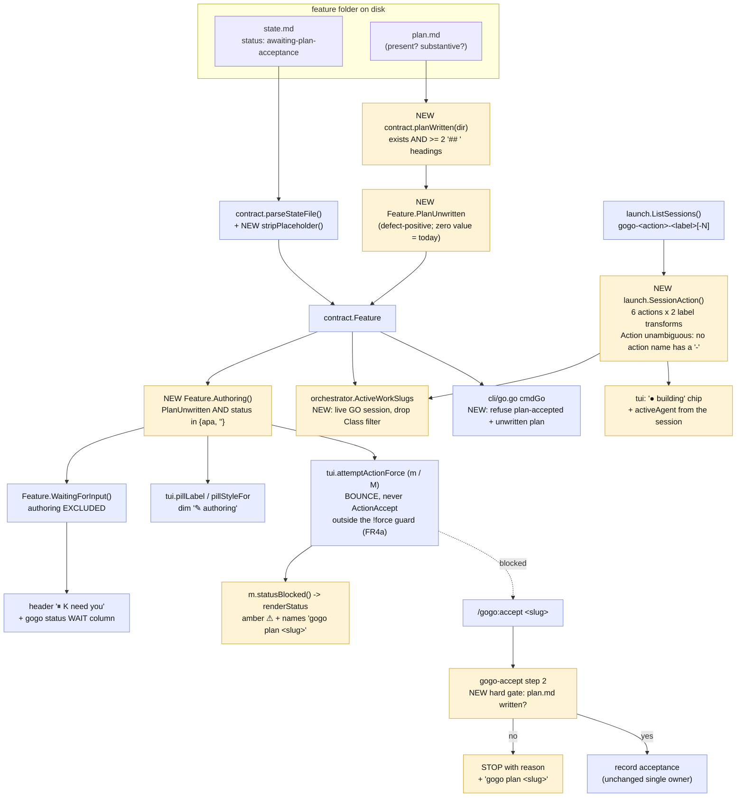
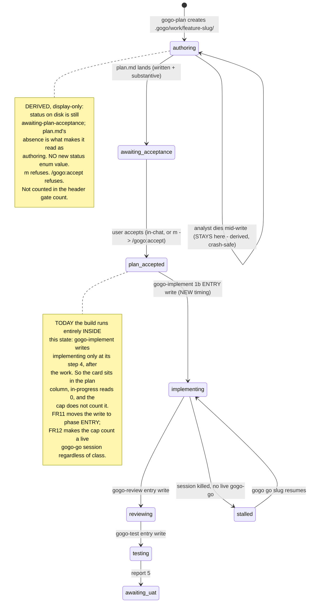

# Plan — plan-readiness-gate

Status: **accepted** (user, 2026-07-29) - D1-D6 resolved on gogo's recommendations
As-built: **shipped as 0.29.0** (2026-07-31) - see [`report/report.md`](report/report.md).
Phase ⑤ reconciliation below; the design fences further down are the plan-time **intent** and
are kept as the historical record, superseded by the as-built set in `report/`.

## As-built reconciliation (phase ⑤, re-reconciled 2026-07-31)

> **This block was rewritten by ⑤'s SECOND pass.** A first ⑤ ran on 2026-07-30, wrote a report
> bundle, and parked the item at `awaiting-uat`. It then found the FR11 exit-write regression
> (below), the item was walked back off the UAT gate on purpose so the stale bundle could not
> ship, and ②③④ ran four more review rounds and two more test rounds. **Every count in this
> block is the final one.**

**Every FR shipped. One FR is shipped-but-unproven, and the release claim is scoped for it.**
Detail, evidence and the full follow-up list live in [`report/report.md`](report/report.md);
this block is the plan's own record so the contract and the outcome sit in one file.

- **Shipped as planned:** FR1-FR10, FR12-FR15 (see the report's planned-vs-shipped table).
  43 product files (38 modified + 5 new test files), +2115/-174 on tracked product files plus
  2743 lines of new test files, **76 new top-level tests** (67 in the 5 new files + 9 added to
  existing ones). All four gates green including the hermetic run with `claude` absent.
  `gogo --version` → `0.29.0`.
- **Rounds, in full:** ② implement **12** · ③ review **7** (APPROVE) · ④ test **4** (PASS) ·
  ⑤ report **2**. `review/issues.json` carries **36** findings (28 verified · 7 fixed ·
  1 open, REV-024, which is ⑤'s own and is closed by this pass); `test/issues.json` carries
  **3**, all verified. **The `gogo` skill bounds implement↔review at ~3 rounds and this ran to
  7** - a process finding recorded in the report, not just a code one.
- **FR11 shipped as prose and is NOT established as effective.** The entry write was
  **skipped on all three of its live runs (n=3)**, including this feature's own review rounds
  01-03. Recorded unsoftened in the "Known limitation" note below and in the report.
  **Two additions found at ⑤:** phase ④ did not honour it either (`events.jsonl` carries zero
  review and zero test events across 3+2 rounds), and because ③/④'s exit write had
  ALSO been dropped, a skipped entry write left the line stale **indefinitely** rather
  than one phase late. Phase ⑤ caught that; the user's call was to RESTORE the exit write
  and keep the entry write (belt and braces), so the floor is 0.28.0's one-phase lag. The `· state lags` detector is what makes that
  visible, and is why the release claim rests on the detector rather than the instruction.
- **Added beyond the plan, all review-driven refinements of a named FR:**
  `orchestrator.CapRuleClause` (three of four hand-written copies of the cap's rule were
  stale), `CapSweepRemedy` + `CapRefusal` (targeted sweep only), `tui.phaseLineLags` → the
  `· state lags` cue (**not** in the accepted plan; it exists because FR11's prose half failed
  on its first live run), `tui.planUnready` (the render path was opening `plan.md` every
  frame), FR8 extended to the reload **auto-pickup**, `tui.moveChip` (**one** footer-chip
  producer for both go-capable classes, after the two hand-kept copies were each caught
  advertising a move that bounces), `tui.notRunnableBounce` in **both** go-producing arms
  (REV-026: the board was launching what `gogo go` refuses), and
  `tui.selectableForShip`/`pruneSelection` (a stale ship selection is pruned on reload, not
  merely filtered at the read).
- **Two guards moved from prose into `cli/skills_lint_test.go`,** because the entry-write rule
  had by then failed twice as prose: the three phase skills must write occupancy at **entry
  and exit** and must **scope** the exit write away from a gate status; and
  `code-review-standards.md` must keep the *"do not flag the exit write as duplication"*
  clause and must not revert to the wording that invited its removal.
- **Folded in on the user's fix-now call at ④:** TEST-001 - `parseStateFile` had no notion of
  a multi-line `<!-- -->` block, so the shipped template's commented-out `correlation:`
  legend example parsed as real data and painted a bogus `⛓ ×3` chip. **That is the `x3`
  badge in the original bug report**, which an earlier analysis mis-attributed to the
  header's `⏸ 3 need you` pill. **And TEST-002** - `attemptActionForce` consulted
  `WaitingForUser()` for **display** only, so `m`/`M` on a card paused at a decision gate
  returned a real `/gogo:go` intent with an **empty** bounce: the only thing between a
  keypress and a relaunch was a STOP instruction inside the spawned session's own prompt.
  A gate guarded only by an instruction to the thing being gated is not guarded - this
  release's own thesis, one level up. Now refused **outside** every `!force` condition, naming
  the open decision by ID and the right artifact (`decisions.md` + `/gogo:resume`, or `uat.md`
  + re-acceptance when `isUATReplan`).
- **The two knowledge writes this plan deferred to ⑤ are DONE:** `.gogo/knowledge/
  coding-rules.md` now carries TEST-004's sanctioned exception (*a presence check may only
  ever REFUSE, never PROMOTE, and only on a MONOTONIC artifact*) and the new rule *a phase
  writes its occupancy status at entry AND AGAIN at exit - two writers on purpose*, plus TEST-006 and
  TEST-007. `test-strategy.md`, `code-review-standards.md`,
  `non-functional-requirements.md` and `project-knowledge.md` were updated too.
- **Nothing was dropped.** Two items were diagnosed and recorded rather than attempted
  (hardening bare `gogo sweep`; cross-source sweep owner resolution via
  `projects.AllSources`) - both already recorded in this plan and carried into the report's
  follow-ups.
- **Diagram set:** ②'s `charts/` note said a **class** diagram would carry no signal; ⑤
  reversed that and drew one, because the release's central idea is "one producer, many
  quoting surfaces" and that is what **six** review findings and both surviving mutations
  were about. The as-built set is flow / sequence / activity / class in `report/`, all four
  **re-drawn at ⑤'s second pass** (the exit write restored in the sequence and activity
  views; the m/M legality chain and the single `moveChip` producer added to the flow and
  class views), with the plan-time before set copied to `report/before/`. No use-case
  diagram: the release adds no new user capability.
- **Found at ⑤'s first pass and since FIXED:** three shipped-prose sites carried FR11's old
  skip count (`skills/gogo-review/SKILL.md`, `skills/gogo-test/SKILL.md`,
  `cli/internal/tui/model.go`). Review round 04 swept them - re-checked for **truth** rather
  than renumbered, since the old sentences carried an implied causal claim the evidence
  falsifies.
- **Found at ⑤'s second pass, NOT fixed here (⑤ writes only under `.gogo/`):**
  `cli/internal/tui/move.go:192-193` - `decisionGateBounce`'s godoc still ends with two
  sentences describing `notRunnableBounce`. REV-032's fix gave `notRunnableBounce` its own doc
  but left the orphaned lines attached to its neighbour, so the orphaned-doc family
  (REV-014 → REV-032 ×3) has a **fourth** occurrence on disk. Comment-only, no behaviour;
  carried into the report's follow-ups.

**The board narrates the past, not the present.** Two live sightings, one root cause: a
card offered `⏸ accept plan` while its `plan.md` did not yet exist, and a card sat in the
**plan** column reading `plan-accepted` while a session was actively editing files and
running tests for it (`in progress 0`, `● 2 session`). Both happen because **`state.md`
is a completion log, not an occupancy record** — every phase writes it once, at a
boundary, describing work that is already over. This plan fixes the writer (record
occupancy at phase **entry**) and, where safety depends on it, makes the readers **verify
instead of trust**. **No new `status` enum value, no change to the frozen classifier.**

## Goal

Make the board's displayed state **agree with what is actually happening**, in both
directions:

- A work item under **authoring** must never be offered for acceptance, and must read
  differently from one genuinely awaiting acceptance.
- A work item being **built** must not sit in the plan column, must not read `plan-accepted`,
  and must count against its source's concurrency cap.

Both must be **crash-safe**: a session that dies must leave an item that is *visibly*
incomplete or stalled, never one that silently looks fine.

**Acceptance signal (two probes):**
1. A folder with a template `state.md` (`awaiting-plan-acceptance`) and **no `plan.md`**
   reads `✎ authoring`, is excluded from `⏸ K need you`, `m` refuses, and `/gogo:accept`
   refuses before presenting anything.
2. A feature with a live `gogo-go-<slug>` session reads as **building** on the board
   **and** counts against its source cap, even in the window before the developer writes
   `state.md`.

---

## Context — one root cause, two sightings

I verified every claim in both reports against the tree. **Four need correcting**, and
the corrections change where the fix belongs.

### The unifying defect

`state.md` is written **at phase boundaries, describing the phase that just ended**:

| Phase skill | Where it writes `state.md` | Consequence |
|---|---|---|
| `gogo-plan` | **step 5**, after `plan.md` (step 3) — writes the *exit* status `awaiting-plan-acceptance` ("planning is done, over to you") | If the analyst reorders and writes it early, the gate opens **before the plan exists** |
| `gogo-implement` | **§④ Update state** — *after* §② does all the work and §③ validates out | `status: implementing` means "implementing just **finished**". During the entire build the disk still says `plan-accepted` |
| `gogo-review` | `SKILL.md:96`, in §④ Route — after §② review and §③ validate-out | same |
| `gogo-test` | `SKILL.md:100`, after the test run | same |

So the on-disk status is **never** the status of work in flight. It is the status of work
that has stopped. Sighting 1 is that boundary write landing **too early relative to its
own output**; sighting 2 is it landing **too late relative to the work it names**.

The telemetry has the same shape: `gogo-implement` §④ appends **both** `phase-started`
*and* `phase-done` in one burst at the end. `events.jsonl` is a post-hoc log, not a live
stream — which is why the user's guess ("it will switch on first review when events get
updated") is essentially right.

### Sighting 1 — a plan offered before it is written

| Claim | Verified at |
|---|---|
| The template ships pre-set "ready to accept" values | `templates/state.template.md:27-29` — `- **feature:** <one-line title>` · `- **phase:** plan` · `- **status:** awaiting-plan-acceptance` |
| The classifier never checks `plan.md` | `cli/internal/contract/contract.go:314-335` `classify()` — matches on status / report / phase only; a bare template folder falls to `default: ClassUnfinished` → `ColPlan` |
| The placeholder leaks straight to the card | `state.go:38-39` sets `f.Title = val` verbatim; `view.go:614-617` falls back to the slug only when the title is **empty** — `<one-line title>` is not empty |
| `/gogo:accept` gates only on status | `skills/gogo-accept/SKILL.md:43-49` — "Proceed **only** when `status: awaiting-plan-acceptance`". No `plan.md` precondition anywhere |
| The board routes `m` straight there | `cli/internal/tui/move.go:83-84` (line refs are HEAD/0.28.0) |

**Is accepting a never-written plan reachable end to end? Yes.** Board `m` →
`attemptAction` → `attemptActionForce` (`move.go:31,41,73-85`) → `ClassUnfinished` + status
match → `ActionAccept`,
**uncapped, no `plan.md` check** → `claude "/gogo:accept <slug>"` → gogo-accept step 1
resolves the folder ✓, step 2 gates on status ✓ (**passes**), step 3 says "Present the
plan. Show `plan.md`'s summary…" with no file to read, step 5 records acceptance
unconditionally. **The only thing between a nonexistent plan and `plan-accepted` is the
LLM noticing at step 3.** That is not a gate.

`skills/gogo-implement/SKILL.md` §① *would probably* catch it ("confirm … **and `plan.md`
exists**") — but only after acceptance is recorded, the single-owner `plan-accepted` event
is emitted, and (in a `planAcceptanceSkip` source) the reload auto-pickup
(`cli/internal/tui/pickup.go:33-45`) has already fired `claude -p /gogo:go <slug>` at it
unattended. And that catch is itself LLM prose. **Severity: high.**

### Sighting 2 — an item being built sits in the plan column

| Claim | Verified at |
|---|---|
| `classify` takes only the state-derived Feature + changelog; **sessions are not an input** | `contract.go:314` `func classify(f *Feature, cl []*ChangelogEntry)` |
| Its in-progress arm is phase/status only | `contract.go:363-373` `inProgressPhaseOrStatus` — `phase ∈ {implement, review, test}` OR `status ∈ {implementing, reviewing, testing}` |
| A mid-build item still reads `plan: plan-accepted`, so it falls to `default:` → `ClassUnfinished` → **plan** column | `contract.go:325-334` + `Column()` at `contract.go:36-49` |
| The session signal exists and is already used — but never for placement | `m.sessions` from `launch.ListSessions()` (`model.go:403,684`); `hasLiveSession` drives the footer (`view.go:198`) and changelog rows (`view.go:299`) |
| **The cap does not count it** | `orchestrator/cap.go:37` — `if f.Class != contract.ClassInProgress { continue }` |

**The cap bypass is real and is the severity argument.** `ActiveWorkSlugs` requires
`Class == ClassInProgress` **and** a live session. An item building under a stale
`plan-accepted` fails the first test, so it is invisible to `CapExceeded` — a second
`gogo go` in the same repo is allowed, and two Claude sessions edit one working tree.
That is precisely what the cap exists to prevent. The one-owner lock does **not** cover
it: `.gogo/resources/cli/locks/<slug>.lock` is per-**slug**, not per-repo. The same
under-count also frees a slot for the reload **auto-pickup** (`pickup.go:51-55`), so a
plan's other members can auto-fire into a repo that is already busy.

**A third symptom, found while tracing:** `renderCard` (`view.go:622-625`) computes the
live-agent chip as `activeAgent(f)`, which maps `f.Phase` — still `plan` — to `"analyst"`.
So a card that is being **built** displays **`● analyst`**. The card is wrong in its
column, its status pill, *and* its agent chip, all from the same stale phase line.

### Corrections — where the reports are wrong

**1. `cli/internal/contract/files.go:42` is not the classifier, and it *does* check
existence.** That line is `add("plan.md", …)` in `Artifacts()` — the **drill-in file
list** — and `add` wraps `fileExists` (`files.go:36-40`). It is correct. The real gap is
`classify()`/`loadFeature()` in `contract.go`.

**2. `gogo-plan` does not document writing `state.md` early and `plan.md` last — it
documents the opposite.** `skills/gogo-plan/SKILL.md` orders: **1** folder · **2** analyse
· **3** write `plan.md` · **4** charts · **5** init `state.md`. This makes the bug *worse*:
the observed folder (`state.md` + `decisions.md` + `charts/`, no `plan.md`) proves the
analyst **ran the steps out of order**. Prose ordering is advisory to an LLM, so
**re-stating the ordering cannot be the fix** — it has to be enforced by a reader.

**3. `launch.SessionMatchesSlug` does *not* make the action available** — still true at
HEAD, but the function's shape changed. It now loops **six** actions (0.28.0 added
`ActionAuthor` and `ActionResume`) and **two** label transforms (the new 48-char bounded
`sanitizeLabel` plus the pre-0.28.0 `unboundedLabel`, kept as a read-side back-compat
candidate), and still collapses all of it to a bare `bool` (`launch.go:758-777`). The
convention encodes the action and the parse correctly lives in `launch` (per
`coding-rules.md` TEST-005), but **no function returns it**. Telling `gogo-plan-<slug>`
(authoring) from `gogo-go-<slug>` (building) needs a new `launch.SessionAction()` — design
re-derived against the new shape in **FR13**.

**4. The `⏸ x3` badge is not a card badge.** Grepping every `⏸`/`×` producer leaves
exactly two: `view.go:150` — the **header** pill `⏸ K need you`, fed by `needsYouCount()`
(`model.go:1057-1067`), which counts `WaitingForInput()` across all four columns; and
`view.go:603` — `⛓ ×N`, a card chip needing a `correlation:` line, and
`~/.gogo/projects/*/.gogo/plans/` does not exist on this machine, so no item carries one.
So `⏸ x3` = **`⏸ 3 need you`**. *Is it meaningful for a plan-phase item?* Only when the
item is genuinely at a gate — today an authoring item **inflates** it. FR2 fixes that for
free.

### One more symptom

A template `created:` of `<YYYY-MM-DD>` sorts the broken card to the **top** of the plan
column: `sortFeaturesNewestFirst` (`contract.go:375-382`) compares raw strings and `'<'`
(0x3C) > `'2'` (0x32). The most broken card is the most prominent one. And `v` on it
silently drops to the file list (`drill.go:188-193` returns `ok=false`) with no message.

### Re-verified against HEAD — 0.28.0 (`40c70a1`, tag `v0.28.0`)

0.28.0 shipped after this plan was written and touched `launch.go` (+349/-21),
`plans_tab.go`, `update.go` and `move.go`. Re-checked every premise; the tree builds and
`contract` / `orchestrator` / `launch` tests are green at HEAD.

**Every load-bearing finding survived.** The files this plan's core depends on were **not
touched by 0.28.0**: `cli/internal/orchestrator/cap.go` (last `78691bc`),
`cli/internal/contract/contract.go` (`c084960`), `cli/internal/contract/state.go`
(`78691bc`), `cli/status.go` (`621c6dd`), `skills/gogo-accept/SKILL.md` (`621c6dd`),
`skills/gogo-implement/SKILL.md` (`a377a2f`), `templates/state.template.md` (`78691bc`).
So `classify()` still has no `plan.md` check, `cap.go:37` still carries
`f.Class != contract.ClassInProgress`, `gogo-implement` still writes state only at §④, and
`launch.SessionAction()` still does not exist.

**0.28.0 independently confirmed this plan's thesis and named this work item as the fix.**
Its shipped report lists as a carried-forward limitation
(`.gogo/changelog/2026-07-29-plans-tab-launch-diagnostics-and-view/report.md:100-102`):

> **`state.md` still narrates the past, not the present** — it is written at each phase's
> exit, so a work item mid-build reads as its previous state. Not in this item's scope;
> planned separately as `feature-plan-readiness-gate`.

**And we hit the bug ourselves, in this repo's own pipeline.** During 0.28.0's phase ⑤,
`state.md` was **stale on entry**: it read `phase: implement` / `status: implementing` /
`test=1` after implementation *and* testing were both finished, and its `resume:` line
still warned about a `test/result.json` that test round 2 had already corrected to
`open_issues: 0`. That is the "completion log, not an occupancy record" thesis observed
live — the file described a phase that had ended two phases ago, and its stale resume hint
actively misdirected the next reader.

**The repo now states this plan's cap-severity argument itself.** `SessionMatchesSlug`'s
own doc comment at HEAD (`launch.go:746-752`):

> The cap is what makes that dangerous rather than cosmetic: `ActiveWorkSlugs` would
> UNDER-count the running build, so the per-source cap would let a second build start in
> the same repo and clobber the working tree, which is the exact safety property Leg 3
> exists to protect.

0.28.0 fixed the **attribution** half of that under-count (the six-action list + the
label-cap back-compat widening). **The classification half — the `Class` filter — is still
open, and is this plan's FR12.** Better still, `cap.go`'s own comment already states the
correct rule and then contradicts it in code:

> The clobber risk is a **LIVE build session**: a parked in-progress feature (no session)
> is not fighting over the working tree, so it is deliberately not counted.

The stated rationale is exactly FR12's. The `Class` filter is not in that rationale — FR12
makes the code match its own documented intent.

**Three premises moved and are re-derived below:** `SessionMatchesSlug`'s shape (FR13),
`attemptAction`'s signature and the new `M` force override (FR4/FR8), and the arrival of a
real status-severity system that FR14 must reuse rather than reinvent.

---

## Functional requirements

### Slice A — plan readiness (the authoring case)

**FR1 — A written plan is a checked fact.** The contract reader determines, per feature,
whether `plan.md` is **written** (present and substantive) or **unwritten**. It exposes
this as an additive `Feature` field plus `Authoring()` = *unwritten plan* **and** status is
`awaiting-plan-acceptance` or empty. The field must be **defect-positive**
(`PlanUnwritten bool`) so a zero-value `Feature` keeps today's meaning byte-for-byte and
`contract/waiting_test.go` stays green unchanged.

**FR2 — An authoring item is not a user gate.** `WaitingForInput()` excludes an
`Authoring()` feature, so it drops out of `⏸ K need you` (`needsYouCount`) and the
`gogo status` `WAIT` column.

**FR3 — Visually distinct.** An authoring card renders a **dim `✎ authoring`** pill instead
of the red `⏸ accept plan`, and carries **no gate stripe**. It stays in the **plan** column
in `ClassUnfinished` — **the four classes and the class→column mapping are unchanged.**

**FR4 — The board's accept action refuses.** `m` on an authoring card bounces, never
`ActionAccept`: `plan.md not written yet — <slug> is still being authored`. Nothing
launches, and **no confirm form opens** (see FR4a). Insertion point at HEAD is
`attemptActionForce` (0.28.0 split `attemptAction` into a thin wrapper over it), before the
`f.Status == "awaiting-plan-acceptance"` branch at `move.go:82-84`.

**FR4a — A missing plan is a legality rule, not a cap: `M` must not force past it.**
0.28.0 added `attemptActionForce(ship, force)` and the **`M`** key, where `force=true`
skips the per-source cap bounce "and only that guard — every other legality rule still
applies" (`move.go:34-39`). The FR4 and FR8 refusals are legality rules, so they must be
evaluated **outside** the `!force` conditions. A `force` that could conjure an acceptance
for a nonexistent plan would weaken the hard invariant this plan exists to strengthen.

**FR5 — `/gogo:accept` refuses before presenting.** `skills/gogo-accept/SKILL.md` step 2
gains a **second hard gate**: `plan.md` must exist and be substantive. Otherwise STOP with
a precise reason and the recovery command.

**FR6 — Template placeholders never render as card text.** `parseStateFile` treats a value
that is a bare `<…>` placeholder as **empty** (`<one-line title>`, `<slug>`, `<YYYY-MM-DD>`,
`<git branch | n/a>`). The card falls back to the slug, and the placeholder `created:`
stops sorting broken cards to the top. One defensive-reader rule for every key — matching
the contract's own "parse defensively" mandate (`docs/cli-contract.md:404`).

**FR7 — Crash-safe by construction.** Because the signal is **derived at every read**, an
analyst that dies mid-authoring leaves an item that reads `✎ authoring` forever — nothing
to un-set, no cleanup step to miss, existing half-written folders fixed with no migration.

**FR8 — The unaccepted-plan invariant is strengthened, never weakened.** A feature at
`plan-accepted` with an unwritten `plan.md` is **refused** by both launch paths:
`gogo go <slug>` (`cli/go.go`) and the board's `m`. `/gogo:go` still requires
`plan-accepted`; this adds a requirement and removes none.

### Slice B — phase occupancy (the silent-build case)

**FR11 — Phases record occupancy at ENTRY, not completion at exit.** `gogo-implement`,
`gogo-review` and `gogo-test` write `phase: <p>` + `status: <p-ing>` and append the
`phase-started` event as their **first act after validate-in passes** (a new §①b), *before*
doing the work. The existing §④ keeps the exit write (iterations bump, `phase-done`).
`skills/gogo/SKILL.md` states the same for the in-context ② path.
**Result: an item being built reads `implementing` on disk, so it classifies in-progress in
every reader — TUI, `gogo status`, the cap, and any headless consumer — with no change to
`classify()` and no change to the frozen §3 table.**

> **As-built note (⑤).** Read this FR's title against its own third sentence: the plan said
> *"the existing §④ keeps the exit write"*, and the build nonetheless **removed** it. That was
> an unintended consequence, not a design; the shipped rule is **entry AND AGAIN at exit -
> two writers on purpose**, restored on the user's call. See the reconciliation block at the
> top of this file and the report's limitations section.

**FR12 — The cap counts live builds, not classes.** `orchestrator.ActiveWorkSlugs` counts a
feature in `root` that has a live **`go`** session, regardless of its file-derived class.
The `Class == ClassInProgress` filter (`cap.go:37`) is removed: it is a redundant test that
lies exactly when the writer lags, and the cap's job — *don't let two builds clobber one
working tree* — is answered precisely by "is there a live build session here", which is
**already what `cap.go`'s own doc comment says the rule is**. This makes the safety guard
**deterministic and independent of LLM discipline**. It also closes the *classification*
half of the under-count whose *attribution* half 0.28.0 fixed.

**FR12a — The cap's user-visible copy must move with the rule.** 0.28.0 deliberately wrote
the rule into the bounce string (`move.go:175`): *"the cap counts in-progress work items
with a live session, per source; plans are never counted"*. FR12 changes that rule, so the
sentence must change with it — to *"the cap counts work items with a live build session,
per source"* — or the most legible message in the cockpit becomes the most wrong. Same for
the `cap.go` doc comment and any `gogo go --force` help text.

**FR13 — The session's ACTION is parseable where it is owned.** New
`launch.SessionAction(session, slug) (Action, bool)` returns the action component of the
`gogo-<action>-<label>[-N]` convention with an **exact label-component compare**;
`SessionMatchesSlug` is refactored to `_, ok := SessionAction(...)`, so there stays exactly
**one** parser (`coding-rules.md` TEST-005). Re-derived against 0.28.0's shape — **six**
actions and **two** candidate label transforms:

- **The `Action` return is unambiguous, and here is why.** The match is on the literal
  `"gogo-" + action + "-"`, and **no action name contains a `-`** (`go`, `plan`, `done`,
  `resume`, `accept`, `author`). So the action is the token between the first and second
  `-` after `gogo`, and no action can be confused with another or with a label that merely
  *starts* with an action name (`gogo-go-plan-foo` reads as action `go`, label `plan-foo`,
  because the string after `gogo-` begins `go-`, not `plan-`).
- **Every genuine ambiguity lives in the LABEL, not the action, and none of it changes the
  answer.** Two >48-char slugs sharing a 48-char prefix mint the same bounded label; a
  label ending in digits collides with `uniqueSession`'s `-N` suffix (`gogo-go-foo-2` reads
  as either slug `foo` run 2 or slug `foo-2`). In all such cases the *slug attribution* is
  ambiguous but the **action is identical**, so `SessionAction`'s `Action` is safe even
  where its `bool` inherits the existing attribution fuzziness. It returns exactly what
  `SessionMatchesSlug` returns today, plus the action — **no behaviour change**.
- **Guard the invariant structurally, not by example.** Add a test that fails if any
  `Action` constant ever contains a `-` (which is what makes the parse unambiguous), so a
  future action like `plan-b` cannot silently reopen it. Per `test-strategy.md`, *prefer a
  guard that cannot be escaped*.
- **Both label candidates must be tried, in the same order**, so the 0.28.0 back-compat
  widening (REV-009) is preserved rather than quietly reverted.

This is what lets every consumer tell `gogo-plan-<slug>` (authoring — Slice A) from
`gogo-go-<slug>` (building — Slice B), so Slice B can never paper over Slice A.

**FR13a — Known interaction, recorded not solved.** 0.28.0's report carries a limitation:
*"a session is named for the plan **title** while the analyst derives its own slug, so
`SessionMatchesSlug` can miss it"*. Verified — `PlanIntent` mints
`sessionName("plan", label)` from the plan title (`launch.go:557,574`). This affects
**`gogo-plan-*`** attribution, so it weakens Slice A's live-vs-dead authoring
discrimination (**D3-B**) — but **not FR12**, because a build session is minted by
`BuildIntent(ActionGo, []string{f.Slug})` from the real slug. FR12's counting is unaffected;
say so rather than over-claiming.

**FR14 — Disagreement is shown, never hidden — through 0.28.0's severity system.** When a
card's live session contradicts its file-derived state, the card says so:
- live `go` session + status `plan-accepted`/`awaiting-plan-acceptance` → an amber
  **`● building`** chip and a status-line note. The card keeps its **file-derived column**
  (one source of truth across TUI / `gogo status` / `pages`), and the chip covers the
  launch-to-first-write window that FR11 shrinks (see **D6** for the column-override
  alternative).
- `activeAgent` derives from the **session action** (FR13) when the phase disagrees, so a
  card being built shows `● developer`, never `● analyst`.
- `gogo status` gains a live-session marker (it calls no `ListSessions()` today) so the
  headless table cannot lie either.

**FR14a — Reuse the status-severity system; do not invent a cue mechanism.** 0.28.0 added
exactly what this needs, so every new message routes through it:
`m.setStatus(level, s)` with the `statusBlocked` (amber — *carries the unblock*) and
`statusFailed` (red — *carries the tool's own words*) shorthands (`model.go:57-83`), the
severity reset at `Update`'s single `tea.KeyMsg` choke point (`update.go:178`), and
`renderStatus` (`view.go:995-1006`). Concretely: **FR4/FR4a/FR8 refusals are
`statusBlocked`** — they are gates, and each must name its unblock (`gogo plan <slug>`).

**FR14b — Satisfy the Diagnosability bar (NFR, since 0.28.0).** *"A failure the user can
see but not explain is a bug, even when the code is correct."* So:
- **Distinguish blocked from failed from done, and survive a colourless terminal** — colour
  alone is flattened by a no-colour TTY *and* by TTY-less `go test`. Pair every level with
  its glyph (`statusWarnMarker` `⚠ `, `statusErrMarker` `✗ `), which is also what makes it
  **assertable in `View()`**. The `✎ authoring` / `● building` cues are glyph+word for the
  same reason.
- **A refusal names its number where it has one.** The stub refusal says *how far short* it
  fell (`plan.md has 1 of the 2 sections a written plan needs`), not "too small" — the
  bar's *"a limit must name its number"* rule.

**FR15 — Stalled is visible in the other direction too.** With FR11, a killed build leaves
`implementing` with no live session. That must read **stalled**, not running: the card
shows the working status with no `●` dot and a `· stalled` cue.
`RunnableStatus("implementing")` is already true, so `gogo go <slug>` resumes it — verify
no regression.

### Cross-cutting

**FR9 — The CLI still writes only its sanctioned roots.** Every CLI change here is
read-side and display-side. No new CLI write, no pipeline-state mutation, no LLM in the
read path. The `~/.gogo/`-only rule for the cockpit's own data is untouched.

**FR10 — Enumeration sync + version.** `docs/cli-contract.md`, `README.md`,
`docs/commands.md`, `commands/accept.md`, `skills/gogo/SKILL.md`,
`skills/gogo-plan/SKILL.md`, `skills/gogo-implement|review|test/SKILL.md` and
`templates/state.template.md` describe the new cues and gates consistently; the plugin
version bumps `0.28.0 → 0.29.0` (0.28.0 shipped while this plan sat at the gate).

---

## Approach — fix the writer, verify at the reader

Two complementary moves, applied to both sightings:

| | **Make the writer honest** | **Make the reader verify** |
|---|---|---|
| **Slice A** | `state.md` after `plan.md`, restated as a hard rule (FR10) | `planWritten()` → `Authoring()` → pill, gate count, `m`, `/gogo:accept` (FR1-FR8) |
| **Slice B** | write occupancy at phase **entry** (FR11) | cap keys on a live `go` session (FR12); card cues the disagreement (FR14-FR15) |

**The writer moves are LLM prose — the same class of instruction that already failed once
in Slice A.** That is exactly why each is paired with a deterministic reader-side guard.
Where a *safety* property depends on it (the cap), the reader guard is the fix and the
writer change is the improvement.

### Slice A: derive readiness, don't invent a status

The alternative — a new `authoring` status that `gogo-plan` sets on scaffold — reads
cleanly and, checked site by site, degrades safely by default (`classify`,
`WaitingForInput`, `RunnableStatus`, `PlannableStatus`, `TerminalStatus`,
`autoPickupReady`, `readyToShipStatus` all land on the right answer with no code change).
**But it does not fix what happened.** An LLM analyst does not `cp` the template — it
*writes* `state.md`, and `skills/gogo-plan/SKILL.md` step 5 explicitly instructs it to
"Set `state.md`: … **status=awaiting-plan-acceptance**". The safety would rest on the
analyst honouring a two-phase write in the right order — **the discipline that just
failed**. Prose guarding prose. And `status` is a **frozen-contract enum**
(`docs/cli-contract.md:394`); 14 sites name `awaiting-plan-acceptance` today. Recorded as
**D1**.

### Slice B: why not a session-aware classifier, and why not a TUI-only override

The coordinator's question, answered with what the code shows:

- **Session-aware `classify` is wrong.** `launch.ListSessions()` returns `nil` when tmux is
  absent (`launch.go:537-540`), and tmux is a **soft dep** by the portability NFR. So the
  core classifier would give **different answers for the same tree** depending on the host
  and on whether the caller happens to have tmux — and `docs/cli-contract.md` §3 is the
  **frozen, authoritative** classifier table, quoted verbatim from
  `skills/gogo-status/SKILL.md`. A deterministic file-surface reader must stay a function
  of the files.
- **A TUI-only display override is insufficient.** `cli/status.go` calls `ListSessions()`
  **zero** times, so `gogo status` would keep lying — and, decisively, **the cap reads
  `f.Class`** (`cap.go:37`), so the working-tree-clobbering bug would survive untouched.
- **Fixing the writer (FR11) fixes all of them at once** — columns, `gogo status`, the cap,
  `pages`, headless — with no contract change and no new coupling.
- **And the cap gets its own deterministic guard (FR12)** so the one *safety* property does
  not depend on an LLM writing a file on time.

Recorded as **D4** (where the fix belongs) and **D5** (the cap's `Class` filter).

### What "written" means (the stub check)

`planWritten(dir)` = `plan.md` exists **and** contains **at least two `## ` headings**.

**Re-measured at HEAD** across the **28** work items now on disk (up from 25): **all 28
have a `plan.md`**, the smallest is still **5,494 bytes** (`feature-cli-distribution`) and
the fewest `## ` headings is still **8** — six items sit at that floor. A **4× margin** with
no false negative on any real plan; a scaffold stub has 0-1. Structural rather than
size-based, so a genuinely terse plan is never rejected for brevity. Alternatives in **D2**.

### The design



### The timing fix, which is the whole of Slice B

```mermaid
sequenceDiagram
  autonumber
  actor U as User
  participant B as gogo board (TUI)
  participant C as claude /gogo:go &lt;slug&gt;
  participant D as gogo-implement
  participant S as state.md
  participant K as cap (ActiveWorkSlugs)

  U->>B: m on a plan-accepted card
  B->>C: launch tmux gogo-go-&lt;slug&gt;
  C->>D: phase 2 implement
  D->>D: validate-in (plan-accepted AND plan.md exists)
  D->>S: NEW 1b entry write: phase=implement status=implementing + phase-started
  Note over S,K: TODAY this write happens only at step 4,<br/>after ALL the work - so for the whole build<br/>state.md still says plan-accepted
  D->>D: edit files, run tests (minutes)
  B->>K: reload: is this repo busy?
  K-->>B: NEW counts a live gogo-go session (Class filter dropped)
  B-->>U: card reads implementing, in-progress column, cap enforced
  D->>S: step 4 exit write: iterations bump + phase-done
```

And the lifecycle the two slices produce together — `charts/state.mmd`:



### Alternatives considered

| Option | Verdict |
|---|---|
| New `authoring` status enum value (Slice A) | Rejected — prose guarding prose; frozen-enum change across 14 sites. **D1-B**. |
| Ordering fix only (Slice A) | Rejected as *the* fix — already the documented order, violated anyway. Kept as a belt (FR10). **D1-C**. |
| Session-aware `classify` (Slice B) | Rejected — tmux is a soft dep, so the frozen classifier would become host-dependent. **D4-B**. |
| TUI display override only (Slice B) | Rejected — leaves `gogo status` and, critically, **the cap** lying. **D4-C**. |
| Make `WaitingForInput()` stat the disk | Rejected — it is a pure status predicate pinned by `contract/waiting_test.go` on a `Dir`-less `Feature`; I/O belongs in the loader, where `detectReport` already lives. |
| Block only in `gogo-accept` | Rejected as sufficient — the card still lies and the `⏸` count still inflates. Kept as the **second** gate (FR5). |

---

## Changes checklist — in build order

### 1. Contract reader (Slice A, load-bearing)

- **`cli/internal/contract/contract.go`** — add `PlanUnwritten bool` to `Feature`
  (defect-positive; zero value = pre-0.28 meaning); add `planWritten(dir string) bool`
  (bounded read; any read error → treat as **written**, so a permissions hiccup never
  invents a defect); set `f.PlanUnwritten = !planWritten(dir)` in `loadFeature`; add
  `Authoring()`; refine `WaitingForInput()`'s `awaiting-plan-acceptance` arm to
  `!f.Authoring()`. **`classify()` unchanged.**
- **`cli/internal/contract/state.go`** — add `stripPlaceholder(s string) string` (a value
  that is exactly `<…>` → `""`), applied in `parseStateFile` after `stripComment`, for
  every key.

### 2. Session-action parser (shared by both slices)

- **`cli/internal/launch/launch.go`** — add `SessionAction(session, slug string) (Action, bool)`
  covering **all six** actions and **both** label candidates in 0.28.0's order; refactor
  `SessionMatchesSlug` (`launch.go:758-777`) to `_, ok := SessionAction(...)` so one parser
  remains (TEST-005). Add the structural guard test that no `Action` constant contains a
  `-` (FR13).

### 3. Cap correctness (Slice B, the safety fix)

- **`cli/internal/orchestrator/cap.go`** — `ActiveWorkSlugs` drops the
  `f.Class != ClassInProgress` filter (line 37) and counts a feature whose live session's
  action is `ActionGo`. Update the doc comment: it already says the rule is "a LIVE build
  session", so record that the code now matches its stated rationale. Both cap callers
  (`cli/go.go` `capBlock`, `tui/move.go` `capBounce`) and `autoPickupFreeSlot` inherit the
  fix through the shared helper.
- **`cli/internal/tui/move.go`** — update `capBounce`'s rule sentence (line 175) per
  **FR12a**; keep the `press M to force` affordance 0.28.0 added.

### 4. Board display (both slices)

- **`cli/internal/tui/styles.go`** — `const authoringMarker = "✎"`; a `pillBuilding` style.
  Reuse the existing `statusWarnMarker` / `statusErrMarker` for status-line severity.
- **`cli/internal/tui/model.go`** — `badge()` returns `"authoring"` before the
  `awaiting-plan-acceptance` arm; `pillLabel()` gains `✎ authoring`; `pillStyleFor()` →
  `pillDim` for authoring; `stripeAccent()` gives an authoring card no stripe;
  `activeAgent()` prefers the live session's action (FR13) over a stale `f.Phase`.
- **`cli/internal/tui/view.go`** — the `● building` chip (FR14) and the `· stalled` cue
  (FR15) on `renderCard`.
- **`cli/internal/tui/move.go`** — `attemptActionForce` (**not** the thin `attemptAction`
  wrapper) bounces for `Authoring()` and for `plan-accepted` + `PlanUnwritten` (FR8),
  **outside** the `!force` guards so `M` cannot override a legality rule (FR4a). Route the
  bounces through `statusBlocked` (FR14a).
- **`cli/internal/tui/drill.go`** — a `statusBlocked` line when a plan-column card has no
  `plan.md`, instead of silently showing the file list.
- **`cli/go.go`** — `runnableHint` for an authoring feature; `cmdGo` refuses a
  `plan-accepted` feature whose `PlanUnwritten` is true, before acquiring the lock.
- **`cli/status.go`** — a live-session marker column (calls `launch.ListSessions()`;
  tmux-optional, `nil` degrades to today's output).

### 5. The writer (skills)

- **`skills/gogo-implement/SKILL.md`** — new **§①b Enter the phase**: on validate-in pass,
  write `phase`/`status` + `phase-started` *before* §②; §④ keeps the exit write + the
  iterations bump + `phase-done` (and no longer emits the entry event).
- **`skills/gogo-review/SKILL.md`**, **`skills/gogo-test/SKILL.md`** — the same entry write.
- **`skills/gogo/SKILL.md`** — state the entry-write rule for the in-context ② path, and
  mirror the ① `plan.md` precondition.
- **`skills/gogo-plan/SKILL.md`** — step 5 hard rule: *"`state.md` is written **after**
  `plan.md` — never scaffold a `state.md` carrying `status: awaiting-plan-acceptance`
  before the plan exists. If you do, every reader shows the item as `✎ authoring` and
  refuses to accept it."*
- **`skills/gogo-accept/SKILL.md`** — step 2 becomes two gates (status, then `plan.md`
  written); Hard rules gain *"Never record acceptance for a plan that is not written."*
- **`commands/accept.md`** — mirror the second gate.

### 6. Docs, knowledge, version

> **Build-time corrections (implement ②, 2026-07-30).** Three small, obvious ones, recorded
> here rather than escalated:
> 1. The `docs/cli-contract.md` note below says *"`### Changed in 0.28.0`"* — a leftover from
>    before the re-verification renumbered the release. It shipped as **`### Changed in
>    0.29.0`**, matching the version bump in this same section.
> 2. **`.gogo/knowledge/coding-rules.md` was NOT edited.** Its bullet's own parenthetical
>    assigns the write to phase ⑤ (*"Phase ⑤ owns this write; noted here so review/report do
>    it"*), and a knowledge file is reconciled by the report phase, so ② left it alone.
>    **Carried to ⑤:** refine TEST-004 with the sanctioned exception (*gate on `status`; a
>    presence check may only ever **REFUSE**, never **PROMOTE**, and only on a **monotonic**
>    artifact*) and add *a phase writes its occupancy status at entry AND AGAIN at exit - two
>    writers on purpose, because one of them is an LLM following prose*.
> 3. **Two extra surfaces were swept for the same enumerations** (review check #1 requires
>    *all* of `docs/*.md`, not the plan's hand-list): `docs/flow.md` (①'s written-plan
>    precondition + a "Resume" note on the entry write) and `docs/index.md`,
>    `skills/gogo-cli/SKILL.md` and `skills/gogo-status/SKILL.md` (the card-cue vocabulary
>    and the cap's rule sentence, which FR12a also lives in there). Two **additional**
>    FR12a copies of the old cap sentence were found and updated: `README.md` and
>    `skills/gogo-cli/SKILL.md`.
> 4. **One un-planned fix, in scope of FR4/FR14b:** the footer key-chip advertised
>    `[m] accept` on an authoring card, i.e. it promised the exact move that now bounces.
>    It reads `[m] ✗ plan not written` instead — the same say-one-thing-do-another defect
>    the plan exists to remove, found by driving the live board.

> **Out of scope, recorded rather than silently left (review round 02, REV-011).** Review asked
> whether **bare `gogo sweep` should confirm before killing a session it judged an orphan.** It
> should — but not in this work item, and here is the reasoning rather than a shrug.
>
> The *reachable* defect was that this feature's own cap bounce **recommended** the bare form.
> That is fixed at the root: `orchestrator.CapSweepRemedy` can only ever emit the **targeted**
> `gogo sweep <slug>...`, both cap surfaces quote it, and two guards assert the targeted form is
> present **and** the bare form absent. So nothing in the product now points a user at the
> dangerous command.
>
> Hardening the command *itself* is a different change with its own fork: bare `gogo sweep` is
> the **sanctioned manual cleanup** (`sweepHelp` documents it, `--dry-run` previews it), and it
> is invoked by `/gogo:done` — in its targeted form, which a confirmation must not break. Making
> it interactive needs a decision about non-TTY callers (a prompt that blocks a headless
> `claude -p` session is a worse failure than the one it prevents), which means either a
> `--yes` flag or TTY detection. That is a change to a command this plan does not otherwise
> touch, so it belongs in its own item.
>
> **The real fix is deeper than a prompt, and worth stating for whoever picks it up:** the bare
> sweep judges every host-wide `gogo-*` session against **one repo's** feature list, so another
> source's live build is classified *"orphan — no owning feature"* purely because the sweep is
> looking in the wrong repo. With the projects store the CLI already knows every registered
> source (`projects.AllSources`), so the honest fix is to resolve a session's owner across **all
> registered sources** before calling it an orphan — a confirmation would only paper over a
> misclassification. Recorded here; not attempted in 0.29.0.

> **Known limitation, recorded on evidence (review round 01, REV-006; reconfirmed rounds 02 and
> 03).** **FR11's writer half is advisory and was observed skipped on ALL THREE of its live runs
> so far.** Implement honoured it (entry 23:22, exit 00:06 - 44 minutes apart, so FR11
> demonstrably works there), but every **review** round executed with `state.md` still reading
> `implement` / `implementing` and no review `phase-started` in `events.jsonl` - round 01,
> round 02 **after the prose was moved into the numbered flow**, and round 03 again. So the
> prose fix is not established as effective: **n=3, all three skipped.** That is the plan's own
> thesis landing on the plan's own fix: *"the writer moves are LLM prose - the same class of
> instruction that already failed once in Slice A."*
>
> **The detector fired on this feature's own card, which is the strongest evidence available
> that the deterministic half works.** Throughout review round 03 this work item sat at
> `phase: implement` / `status: implementing` with `iterations: review=2` while a review was
> demonstrably running, and `events.jsonl`'s newest line was implement's own `phase-done` - arm
> A's shape exactly. A board watching this repo would have shown `· state lags` on
> `plan-readiness-gate` while the feature that adds the cue was being reviewed. Worth saying in
> the ⑤ report verbatim: the writer half failed three times and the reader half caught it.
>
> **The release claim must therefore rest on the DETECTOR, not on the writer.** Do not soften
> this: nothing here entitles the report to say ③/④ narrate the present. And note the detector's
> own bound (REV-017): `· state lags` means *`state.md` and `events.jsonl` disagree about the
> current phase* - one half of step 1 did not land - and its **silence is not proof of health**,
> since a later mid-phase event can mask arm A.
>
> Two responses, and the second is the one that actually holds:
> 1. **Prose** (attempted, unproven): the entry write moved from a sibling `## ①b` section into
>    **step 1 of the numbered `## ② Steps` flow** in all three phase skills, on the theory that
>    an instruction outside the numbered steps is one that gets skipped. Rounds 02 and 03 skipped
>    it anyway, so treat this as a hypothesis that has not paid off.
>
>    **And FR11 as first written made things WORSE, which phase ⑤ caught and the user chose to
>    fix in this release.** Moving the write to entry, FR11 also *removed* the **exit** write
>    (`gogo-implement|review|test` §④ had set `phase`/`status` since before 0.28.0) on the theory
>    that the entry write superseded it. It does not - the entry write is the half that gets
>    skipped. With only that half, `state.md` stopped advancing **at all**: it stuck at whatever
>    phase last actually wrote it, so the file went from *reliably one phase behind* to
>    *arbitrarily stale*. Proof on this feature's own disk: it read `implement`/`implementing`
>    with `review=3 · test=1` on entry to ⑤, where 0.28.0 would have read `test`/`testing`. That
>    removal was an **unintended consequence of FR11, not a designed part of it** - the plan never
>    argued for dropping the exit write, and no FR called for it.
>
>    **The user's call: restore the exit write AND keep the entry write - belt and braces.** The
>    entry write sets phase/status at the start (correct when it fires); the exit write advances
>    them at the end (guarantees the line still moves when the entry write is skipped). Floor =
>    0.28.0's one-phase lag, ceiling = this plan's intent, with `· state lags` as the backstop
>    when both miss. The §④ sections now say in so many words that the redundancy IS the design,
>    so a future reader does not tidy it away again.
> 2. **A deterministic reader-side detector** — the half that works. The existing cues cannot
>    see this case: `● building` and the cap both key on a live `gogo-go` session, which is
>    present for the whole warm run through ②③④⑤, so a phase line lagging by one phase looks
>    identical to a healthy one. But `events.jsonl` *can*, in **two** shapes (widened in round
>    02 per REV-009, after review showed the first shape missed the most common one):
>    - the newest event is a **`phase-done` for the very phase `state.md` names** — a forward
>      hand-off (②→③, ③→④, ④→⑤) that nothing claimed;
>    - the newest event is an **entry event** (`phase-started` / `fix-round`) naming a
>      **different** phase than the line does — the loop **back** to implement (the pipeline's
>      most common re-entry) or a half-completed step 1.
>
>    Both require a live BUILD session and a working status. That is `tui.phaseLineLags` → the
>    **`· state lags`** cue - file-derived, no new coupling, silent when `events.jsonl` is
>    absent, and silent on a terminal item with a lingering session (REV-010).
>
> **So the release must not claim "the board no longer narrates the past" unconditionally.**
> The accurate claim: it does not for **②**, and for **③/④/⑤** it either narrates the present
> or **says out loud that it cannot**. Carried to ⑤ for the report's limitations section.

- **`docs/cli-contract.md`** — a `### Changed in 0.29.0` note: the derived **authoring**
  display state and the **`● building`** cue are *presentation only* (§2's `status` enum,
  the four classes and the class→column mapping are **unchanged**); the cap's rule now
  keys on a live `go` session; the phases write their status at **entry**, so a reader sees
  in-flight work sooner. Make §1's "**Guaranteed** (from plan ①)" for `plan.md` explicit:
  *a folder without it is mid-authoring, and no reader may treat its `status` as a gate*.
- **`.gogo/knowledge/coding-rules.md`** — refine **TEST-004** with the sanctioned
  exception: *gate on `status`; a presence check may only ever **REFUSE**, never
  **PROMOTE**, and only on a **monotonic** artifact* — and add the new rule *a phase writes
  its occupancy status at entry AND AGAIN at exit - two writers on purpose, because one of
  them is an LLM following prose*. (Phase ⑤ owns this
  write; noted here so review/report do it.)
- **`README.md`** — `✎ authoring` and `● building` in the card-cue list.
- **`docs/commands.md`** — `/gogo:accept`'s refusal conditions.
- **`templates/state.template.md`** — a one-line comment noting `awaiting-plan-acceptance`
  is only meaningful once `plan.md` exists.
- **`.claude-plugin/plugin.json`** — `version` → `0.29.0`.

---

## Tests

Gates before hand-off (`coding-rules.md`): `gofmt -l .` clean · `go vet ./...` clean ·
`go test -race ./...` green. Baseline verified at HEAD before planning: `go build ./...`
clean, `contract` / `orchestrator` / `launch` green.

### The 0.28.0 test standards this must satisfy

`test-strategy.md` and `code-review-standards.md` gained rules in 0.28.0 that this feature
is unusually exposed to — it adds guards, and a guard that does not bite is worse than none:

- **Mutation is the coverage check, and `go build ./...` runs FIRST for every mutation.** A
  mutation that does not compile is `BUILD-FAIL`, not a result. Report the sweep with
  counts (e.g. *"N mutations, compile-checked first, all fail, each in the expected test"*).
- **A mutation can compile, be valid, and still never reach the assertion.** So every
  assertion here names the **exact reason**, not a proxy: the refusal asserts the verbatim
  string and *which* gate refused (unwritten plan vs wrong status vs cap), and the cap tests
  assert the **tally** (`1 of 1`) plus the counted slug — not merely "it refused". This is
  the trap that made two 0.28.0 refusal tests pass because a member was *not found* rather
  than *not shipped*.
- **Prefer a guard that cannot be escaped** (review #11a). Two of this plan's rules are
  cross-site agreements, so assert them **structurally**: (a) `SessionMatchesSlug` must
  delegate to `SessionAction` — fail if either re-inlines the action loop; (b) no `Action`
  constant may contain a `-` (FR13). A future copy-paste then cannot reopen the hole.
- **Every named wiring gets a test that bites** (review #11b — 0.28.0 shipped a wiring whose
  launch-package function was tested while its TUI call site was not). Each FR here names a
  call site; each call site gets its own assertion, not just the helper it calls.
- **Refusals are diagnosable** (review #10, NFR Diagnosability). Assert that a refusal
  carries its **unblock** (`gogo plan <slug>`), that the stub refusal **names its number**
  (`1 of 2 sections`), and that severity is legible **without colour** — the `⚠ ` / `✗ `
  glyph is present in `View()` output under TTY-less `go test`.

### BDD scenarios

```gherkin
Feature: the board's displayed state agrees with what is happening

  Scenario: a plan under authoring is never offered for acceptance
    Given .gogo/work/feature-demo/ has a template state.md with status awaiting-plan-acceptance
    And it contains decisions.md and charts/ but no plan.md
    When the cockpit board loads the repo
    Then the demo card sits in the plan column with the pill "✎ authoring"
    And it is not counted in the header "⏸ K need you" pill
    And "gogo status" shows "-" in its WAIT column

  Scenario: the board refuses to launch an accept for it
    When the user presses m on the demo card
    Then no launch intent is produced
    And the status line names plan.md as not written and offers "gogo plan demo"

  Scenario: the accept skill refuses before presenting
    When /gogo:accept demo runs
    Then it stops at the plan.md gate
    And state.md still reads awaiting-plan-acceptance
    And no plan-accepted event is appended to events.jsonl

  Scenario: a stub plan is treated as unwritten
    Given plan.md exists but carries fewer than two "## " headings
    Then the item reads authoring and both accept paths refuse

  Scenario: the analyst finishes and the gate opens normally
    Given plan.md now carries a Goal and seven further "## " sections
    Then the pill reads "⏸ accept plan" and m routes to "/gogo:accept demo"

  Scenario: crash-safety while authoring
    Given the authoring session died and its tmux pane is gone
    Then the card still reads "✎ authoring" and is still not acceptable

  Scenario: template placeholders never render
    Given state.md carries "- **feature:** <one-line title>" and "- **created:** <YYYY-MM-DD>"
    Then the card title falls back to the slug "demo"
    And the placeholder created date does not sort demo above real-dated cards

  Scenario: an accepted plan whose file is missing cannot be built
    Given state.md reads plan-accepted and plan.md does not exist
    When the user presses m, or runs "gogo go demo"
    Then it is refused with a reason naming the missing plan.md

  Scenario: implement announces itself at entry, not at exit
    Given feature-demo is plan-accepted with a written plan.md
    When gogo-implement passes validate-in
    Then state.md reads phase implement and status implementing BEFORE any file is edited
    And events.jsonl carries phase-started with no phase-done yet
    And the board places demo in the in-progress column

  Scenario: a live build counts against its source cap
    Given a live tmux session named "gogo-go-demo" in source root R
    And demo's state.md still reads plan-accepted (the pre-first-write window)
    When the cap is evaluated for another slug in R with ConcurrentWorkItems 1
    Then demo is counted as active and the second launch is refused

  Scenario: an authoring session never counts as a build
    Given a live tmux session named "gogo-plan-demo"
    Then demo is NOT counted against the cap
    And its card reads "✎ authoring", never "● building"

  Scenario: the card cues a live build that the file has not caught up with
    Given a live "gogo-go-demo" session and status plan-accepted
    Then the card shows the "● building" chip
    And its agent chip reads "● developer", never "● analyst"

  Scenario: a killed build reads stalled, not running
    Given status implementing and no live session for demo
    Then the card shows the working status with a "· stalled" cue and no ● dot
    And "gogo go demo" still resumes it

  Scenario: M forces past the cap but never past a missing plan
    Given feature-demo is plan-accepted and plan.md does not exist
    When the user presses M (the force move)
    Then it is still refused, naming the missing plan.md
    And no launch intent is produced

  Scenario: refusals are legible without colour
    Given any of the refusals above is on the status line
    When View() renders under a TTY-less test
    Then the output carries the warn glyph "⚠ " and names the unblock "gogo plan demo"
    And the stub refusal names its number, e.g. "1 of the 2 sections"

  Scenario: the session-action parser keeps today's matching behaviour
    Given any session name and slug pair
    Then SessionAction's bool return equals SessionMatchesSlug's old result
    And the Action return is one of go, plan, done, resume, accept, author
    And a >48-char slug still matches its pre-0.28.0 unbounded session name
```

### Level map

| Level | What | Where |
|---|---|---|
| Unit (Go) | `planWritten` (real / stub / absent / unreadable); `Authoring()`; `WaitingForInput()` **unchanged for a zero-value `Feature`**; `stripPlaceholder`; placeholder `created` no longer sorts first | new `cli/internal/contract/authoring_test.go`; existing `contract_test.go`, `waiting_test.go` |
| Unit (Go) | `SessionAction` — all **six** actions, both label candidates (incl. a >48-char slug's pre-0.28.0 unbounded name), the `-N` collision suffix, and the `auth`/`oauth` + `waiting-card`/`awaiting-card` cross-attribution cases from TEST-005; `SessionMatchesSlug`'s result **byte-for-byte unchanged** | `cli/internal/launch/launch_test.go` |
| Structural (Go) | no `Action` constant contains a `-` (FR13); `SessionMatchesSlug` delegates rather than re-inlining the loop | `cli/internal/launch/launch_test.go` |
| Unit (Go) | `ActiveWorkSlugs` counts a live `go` session on a `plan-accepted` feature (asserting the **tally and the slug**, not just refusal); does **not** count a live `plan`/`accept`/`done`/`author`/`resume` session; existing cap tests stay green | `cli/internal/orchestrator/cap_test.go` |
| Unit (Go) | `attemptActionForce(ship=false, force=true)` still refuses an authoring / plan-unwritten card (FR4a), while still forcing past a pure cap bounce | `cli/internal/tui/accept_test.go` |
| Unit (Go) | severity: each refusal sets `statusLevelWarn`; `View()` carries the `⚠ ` glyph and the unblock string under TTY-less test; the stub refusal names its number | new `cli/internal/tui/authoring_test.go` |
| Unit (Go) | `badge`/`pillLabel`/`pillStyleFor`/`stripeAccent` for authoring; `needsYouCount` excludes it; `activeAgent` prefers the session action; the `● building` and `· stalled` cues | new `cli/internal/tui/authoring_test.go`; extend `redesign_test.go`, `waiting_test.go` |
| Unit (Go) | `attemptAction` — authoring bounces; `plan-accepted` + unwritten bounces; a **written** plan still yields `ActionAccept` (guards `TestAcceptMoveGuard` from regressing) | extend `cli/internal/tui/accept_test.go` |
| Golden | `gogo status` WAIT + session columns over an authoring fixture and a building fixture | `cli/status_test.go` |
| Integration (Go, tmpdir) | `LoadRepo` over a fixture tree: template-only → authoring; folder + real plan → gate; no `state.md` → authoring | `cli/internal/contract/testdata` |
| Manual / dogfood | Scaffold `feature-zz-authoring-probe/` with a bare template `state.md`; open `gogo`; confirm pill / count / `m` bounce / `v` message; drop a real `plan.md` in; confirm the gate opens. Delete the probe. | live board |
| Manual / dogfood | With `ConcurrentWorkItems: 1`, start a `/gogo:go` on one slug and immediately try `m` on another in the same source — confirm the cap now refuses during the pre-first-write window. | live board |
| Manual | Run `/gogo:go` on a small feature and watch the card move to **in progress** within seconds of launch (not after implement finishes). | live board |

---

## Out of scope

- **Any change to the `status` enum, the four work-index classes, or the class→column
  mapping** (frozen contract §2/§3 untouched).
- **Making `classify()` session-aware.** Rejected with evidence — see **D4**.
- **Overriding a card's column from the session signal.** Recorded as **D6-B**; v1 cues the
  disagreement and lets FR11 shrink the window.
- **Making `events.jsonl` a genuinely live stream.** FR11 moves `phase-started` to the real
  start, which is most of the value; a per-step telemetry stream is separate work.
- **Auto-recovering or auto-restarting a dead session.** The item is made *visible* and the
  recovery command is *named*.
- **Routing `m` on an authoring card to `/gogo:plan` to resume authoring.** Now cheap given
  FR13 — recorded as **D3-B**; v1 bounces with the command named.
- **The `⛓ ×N` correlation chip.** Investigated, ruled out as the observed `⏸ x3`, correct
  as written.
- **A `plan.md` JSON schema.** `docs/contracts.md` deliberately keeps it a prose contract.
- **`templates/contracts/events.schema.json`'s stale "known values" list** (omits
  `awaiting-uat`). Harmless — the field is a free string by design. Noted for a later sweep.
- **Migrating existing folders.** None needed — both signals are derived at read time.
- **The cross-repo same-slug cap OVER-count.** 0.28.0 reproduced it and deferred it as *its*
  D5 (two repos with an identically-named slug counting each other). It lives in the same
  function FR12 edits but is the **opposite** direction; FR12 neither fixes nor worsens it.
  Flagged in `decisions.md` so review does not conflate the two D5s.
- **FR13a's plan-session attribution gap** — `PlanIntent` names a session after the plan
  **title** while the analyst derives its own slug, so `gogo-plan-*` sessions can miss
  attribution (0.28.0's known limitation). Recorded, not fixed here; it gates **D3-B** only.

---

## Summary (TL;DR)

- **One root cause, two sightings.** `state.md` is a **completion log, not an occupancy
  record**: every phase writes it once, at a boundary, describing work that is already
  over. So a plan gets offered before it is written (the boundary write landing too early
  relative to its own output), *and* a card being actively built sits in the **plan**
  column reading `plan-accepted` (the boundary write landing too late relative to the work
  it names — `gogo-implement` writes status only at **§④**, after all the work).
- **The severity is the cap, not the cosmetics.** `orchestrator/cap.go:37` requires
  `Class == ClassInProgress`, so an item building under a stale `plan-accepted` is **not
  counted** — a second build can start in the same repo and clobber the working tree, and
  the per-**slug** owner lock does not cover it. Separately, accepting a never-written plan
  is reachable end to end; the only thing preventing it is an LLM noticing a missing file.
- **The approach: fix the writer, verify at the reader.** Phases record occupancy at
  **entry** (FR11) — which fixes columns, `gogo status`, the cap and headless readers at
  once, with no contract change. Because that is LLM prose, each is paired with a
  deterministic guard: a `plan.md` check drives the `✎ authoring` state and both accept
  gates (FR1-FR8), and the cap keys on a **live `go` session** rather than a class (FR12),
  using a new `launch.SessionAction()` that tells authoring sessions from build sessions
  (FR13).
- **What the reports got wrong:** `files.go:42` is the drill-in list and *does* check
  existence; `gogo-plan` already documents `plan.md` **before** `state.md` (the analyst
  ignored it — which is why prose ordering cannot be the fix); `SessionMatchesSlug` returns
  only a `bool`, so the action is **not** yet available; and `⏸ x3` is the **header**
  `⏸ 3 need you` pill, which an authoring item wrongly inflates.
- **Re-verified against 0.28.0 (`40c70a1`): every load-bearing finding survived, three
  premises moved.** `cap.go`, `contract.go`, `state.go`, `status.go`, `gogo-accept` and
  `gogo-implement` were all untouched, so the `Class` filter, the missing `plan.md` check
  and the exit-only state write are all still there. 0.28.0's **own shipped report names
  this work item as the planned fix** for "`state.md` still narrates the past, not the
  present", and we hit the bug during its phase ⑤ (state read `implementing`/`test=1` after
  testing had finished, with a stale resume hint). What moved: `SessionMatchesSlug` now has
  six actions and two label transforms (FR13 re-derived — the `Action` return is provably
  unambiguous because no action name contains a `-`); `attemptAction` split into
  `attemptActionForce` with an `M` force key (**new FR4a: `M` must not force past a missing
  plan**); and a real status-severity system arrived, which FR14a/FR14b now reuse instead of
  inventing a cue.
- **What happens next:** six forks are open in `decisions.md` — **D1** Slice-A shape,
  **D2** stub strictness, **D3** what `m` does on an authoring card, **D4** where the
  Slice-B fix belongs, **D5** the cap's `Class` filter, **D6** cue vs column override. All
  six recommendations survived re-verification; D3 and D5 came out **better founded**.
  Answer those (or accept the recommendations), then `/gogo:go` builds it as **0.29.0**.
