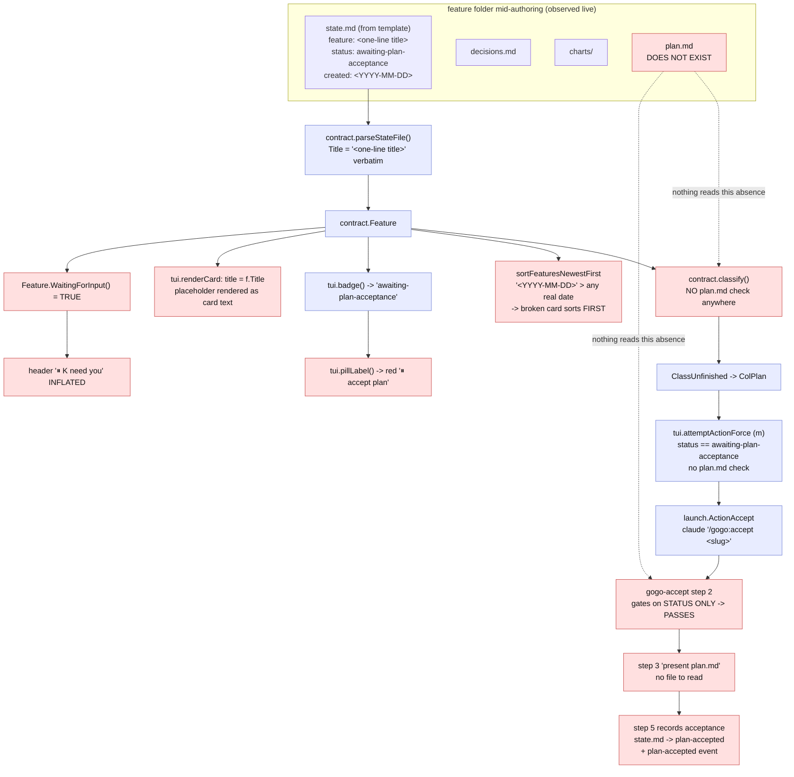
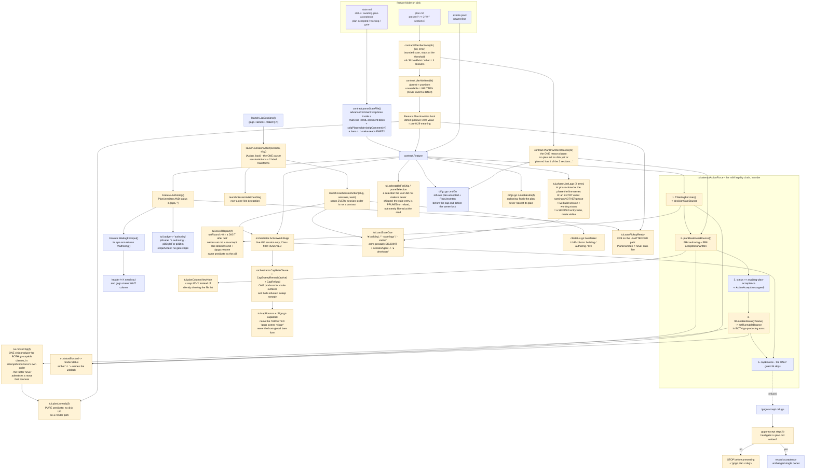

# Report - feature `plan-readiness-gate`

- **feature:** Plan-readiness + phase-occupancy gate - the board stops narrating the past
- **status:** awaiting-uat
- **completed:** 2026-07-31
- **branch / commits:** `main`, uncommitted working tree. 43 product files (38 modified + 5 new test files), +2115/-174 on tracked product files plus 2743 lines of new test files. Ships as **0.29.0**.

**What shipped, in one paragraph.** `state.md` was a **completion log, not an occupancy record** - every phase wrote it once, at a boundary, describing work that had already stopped. That single defect produced two live sightings: a template-scaffolded folder born reading `awaiting-plan-acceptance` with **no `plan.md` on disk**, so the board offered an unwritten plan for acceptance and leaked the literal string `<one-line title>` as a card title; and an item **mid-build** that still read `plan-accepted`, which failed `cap.go`'s class test and was therefore **invisible to the concurrency cap** - the working-tree-clobber risk, and the real severity. 0.29.0 fixes the readers deterministically (plan readiness is derived at every read; the cap keys on a live build session) and *instructs* the writers to record occupancy at phase entry - **and again at exit**. **The reader half works. The writer half has not paid off yet, and this report scopes the release claim accordingly.**

**A note on this document.** It is the **second** phase-⑤ pass. A first ⑤ ran on 2026-07-30 and parked the item at the UAT gate - then found that FR11 had silently removed the phases' **exit** write. The item was walked back off `awaiting-uat` on purpose so the stale bundle could not ship, four more review rounds and two more test rounds ran, and this bundle was regenerated from the reconciled plan. Where the two disagree, **this one is right**.

---

## Run status / gaps

**All five phases completed; no open issues.** ① plan accepted (D1-D6 resolved on gogo's recommendations) · ② implement, **12 rounds** · ③ review, **APPROVE** after **7 rounds** · ④ test, **PASS** after **4 rounds** · ⑤ report, **2 passes** (this document). `review/issues.json` carries **36** findings, `test/issues.json` **3**; **none open or new** at hand-off.

Four things a reader should have rather than discover:

- **28 of the 36 review findings are `verified`; 7 are `fixed` but not re-reviewed** (REV-028/029/030/031/032/035/036 - all minor or nit, raised in round 07's APPROVE and fixed after it). Phase ④ round 4 then swept five of them hands-on. The issues list distinguishes the two states on purpose, so this report does not claim 36/36 verified. **The one that was `open` at hand-off, REV-024, is ⑤'s own and is closed by this document** (see Knowledge updates).
- **All four gates were re-run independently at this pass and are green**: `gofmt -l .` clean · `go vet ./...` clean · `go test -race -count=1 ./...` green (**12** tested packages, 1 with no test files) · the hermetic `env PATH="$(dirname $(which go)):/usr/bin:/bin" go test -count=1 ./...` green with `command -v claude` **empty**. `.claude-plugin/plugin.json` and `cli/main.go` both read `0.29.0`, pinned by `TestVersionMirrorsPlugin`.
- **Nothing is committed.** The whole release sits in the working tree, by instruction.
- **The process itself failed a bound, and that is a finding.** The `gogo` skill bounds implement↔review at ~3 rounds per finding; this ran to **7 review rounds and 12 implement rounds**, and several later rounds fixed defects that earlier fixes introduced - including by the orchestrator. See "The process finding" below; it is not a footnote.

---

## Summary

The board could only ever describe where work **had been**, never where it **was**, because every phase skill wrote `state.md` at a boundary describing the phase that had just ended. 0.29.0 attacks that from both sides. On the **reader** side it derives *"is `plan.md` actually written"* at every read and uses it to refuse acceptance on all four launch paths, and it makes the concurrency cap key on the presence of a **live `gogo-go-<slug>` build session** rather than on a file-derived class - turning the one **safety** guard from something contingent on LLM write-ordering into something deterministic. On the **writer** side it instructs `gogo-implement`, `gogo-review` and `gogo-test` to record occupancy as **step 1** of their numbered flow, before doing any work - **and again at their exit**, two writers on purpose.

Because the writer change is LLM prose, each half is paired with a deterministic guard - and that pairing is what saved the release twice. The writer instruction was **skipped on all three of its live runs**, including this feature's own review rounds, while the reader-side `· state lags` detector fired **on this feature's own card, during its own review**. Then the writer change turned out to have *removed* the pre-existing exit write, making a skipped entry write leave the line stale indefinitely instead of one phase late; phase ⑤ caught that, and the user's call was to restore the exit write and keep both.

Phase ④ additionally found and fixed **TEST-001**, which turned out to be the `x3` badge from the original bug report (the shipped template's *commented-out* `correlation:` legend example was parsing as real data), and **TEST-002**, the board offering a real launch on a card paused at a decision gate.

**No status enum value was added.** The frozen `status` enum, the four work-index classes and the class->column mapping in `docs/cli-contract.md` §2/§3 are byte-for-byte unchanged; `authoring`, `building`, `stalled` and `state lags` are all **derived display states**.

---

## Planned vs shipped

**Every FR shipped.** One shipped as prose and is not established as effective (FR11); the rest are code. Beyond the plan, a set of review- and test-driven additions - all refinements of a named FR, none new scope - plus two fold-ins taken on the user's fix-now call.

| FR | Shipped | Note |
|---|---|---|
| FR1 plan readiness is a checked fact | yes | `contract.PlanSections` -> `planWritten` -> `Feature.PlanUnwritten` (defect-positive) -> `Authoring()` |
| FR2 an authoring item is not a user gate | yes | `WaitingForInput()`'s `awaiting-plan-acceptance` arm returns `!Authoring()` |
| FR3 visually distinct | yes | dim `✎ authoring` pill, no gate stripe, stays `ClassUnfinished` in the plan column |
| FR4 / FR4a the board refuses, and `M` cannot force it | yes | `planReadinessBounce` sits **outside** both `!force` guards in `attemptActionForce` |
| FR5 `/gogo:accept` refuses before presenting | yes | a second hard gate at step 2 of `skills/gogo-accept/SKILL.md` |
| FR6 template placeholders never render | yes | `stripPlaceholder`; a placeholder `created:` now sorts **last** rather than first |
| FR7 crash-safe by construction | yes | derived at every read; no flag to un-set, no migration |
| FR8 the unaccepted-plan invariant is strengthened | yes, **and widened** | plus the reload **auto-pickup** path (REV-003) - the one launch path with no human in the loop |
| FR9 the CLI writes only its sanctioned roots | yes | every change is read-side or display-side; no new product write |
| FR10 enumeration sync + version | yes, **and widened** | the sweep went past the plan's hand-list to every `docs/*.md` plus `skills/gogo-cli` and `skills/gogo-status`, finding two further stale copies of the cap sentence |
| FR11 phases record occupancy at **entry** | **shipped as prose; not established as effective** - and it regressed the exit write before being corrected | see the limitation below. Shipped rule: **entry AND AGAIN at exit** |
| FR12 / FR12a the cap counts live builds | yes | `cap.go`'s `Class` filter removed; the rule sentence single-sourced as `orchestrator.CapRuleClause` |
| FR13 / FR13a the session action is parseable where it is owned | yes | `launch.SessionAction` is the one parser; `SessionMatchesSlug` delegates in one line |
| FR14 / FR14a / FR14b disagreement is shown, through 0.28.0's severity system | yes | `● building`, `● developer`, the `gogo status` **LIVE** column; refusals are `statusBlocked` and name their unblock and their number |
| FR15 stalled is visible in the other direction | yes | `· stalled` on a working status with no live session |

**Added beyond the plan, all in the spirit of a named FR:**

- **`orchestrator.CapRuleClause`** - one shared constant for the cap's user-visible rule, after **three of the four** hand-written copies were found stale (REV-002). FR12a asked for the sentence to move with the rule; single-sourcing makes the drift impossible instead of merely forbidden.
- **`orchestrator.CapSweepRemedy` + `CapRefusal`** - the targeted-sweep remedy, single-sourced (REV-011, REV-019). See "the dangerous remedy" below.
- **`tui.phaseLineLags` -> the `· state lags` cue** - a deterministic reader-side detector for a phase that starts and forgets to record itself (REV-006, widened to two arms by REV-009, given a status whitelist by REV-010). **Not in the accepted plan.** It exists because FR11's prose half was observed failing on its first live run, and it is the half the release claim now rests on.
- **`tui.planUnready`** - a pure predicate, because the first cut opened `plan.md` on every render frame (REV-007).
- **`tui.moveChip`** - **one** footer-chip producer for both go-capable classes (REV-030). The two hand-kept copies had each been caught promising a move that bounces; the chip now reads `[m] ✗ plan not written` / `[m] ✗ paused` / `[m] ✗ not runnable` exactly where `m` refuses.
- **`tui.notRunnableBounce`, in both go-producing arms** (REV-026) - the board was returning `ActionGo` with an **empty** bounce for a status `gogo go` refuses.
- **`tui.selectableForShip` / `pruneSelection`** (REV-027, REV-033) - a stale ship selection is pruned on reload rather than filtered at the read, so it cannot resurrect itself.
- **Two guards in `cli/skills_lint_test.go`** - the entry+exit rule, and the review standard that protects it, moved out of prose into a test after the rule had failed twice as prose.
- **TEST-001's block-aware `parseStateFile`** and **TEST-002's decision-gate launch guard** - both folded in on the user's fix-now call. See the test outcome.

**Dropped / deliberately not done:** nothing from the plan was dropped. Two items were **diagnosed and recorded rather than attempted** (hardening bare `gogo sweep`, and cross-source sweep owner resolution) - both are in Follow-ups with their reasoning.

**One reversal at ⑤:** ②'s `charts/manifest.json` recorded that a **class** diagram would carry no signal. This bundle has one. Reason: the release's central architectural idea is *"one producer, many quoting surfaces"*, and **six** review findings (REV-002, 012, 016, 030, 031, plus both surviving mutations) were about exactly that structure going stale. An ownership view is what a future maintainer needs; the flow chart shows it only as edges.

---

## Implementation

Two complementary moves, applied to both sightings: **make the writer honest, and make the reader verify.** Where a *safety* property depends on it, the reader guard is the fix and the writer change is only an improvement.

### Slice A - plan readiness, derived at every read

`contract.PlanSections(dir) (int, error)` counts `## ` sections in `plan.md` with a bounded scan that stops at the threshold, and its error return distinguishes the **three** answers a refusal has to tell apart: a count, `fs.ErrNotExist` (no plan at all), and anything else (present but unreadable). `planWritten` then makes one deliberate asymmetry: **an unreadable `plan.md` counts as written**, so a permissions hiccup or a mid-write truncation can never *invent* a defect that refuses the user's accept. The threshold is **2 `## ` sections** (D2=A), measured over all 28 work items on disk: the fewest sections any real plan carries is **8**, a 4x margin, and a fresh scaffold has 0-1.

`Feature.PlanUnwritten` is **defect-positive on purpose** - the zero value means "the plan is written", so every synthetic `Feature` in every existing test keeps its pre-0.29.0 meaning byte-for-byte, and `contract/waiting_test.go` stayed green unchanged. `Authoring()` = `PlanUnwritten` **and** status is `awaiting-plan-acceptance` or empty.

**One reason clause, quoted everywhere.** `contract.PlanUnwrittenReason(dir)` produces the single sentence every refusal repeats - `"no plan.md on disk yet"` or `"plan.md has 1 of the 2 sections a written plan needs"`. Five call sites across three files quote it (`cli/go.go` x2, `tui/move.go` x2, `tui/drill.go`), so the board bounce, the headless refusal, the runnable hint and the drill note cannot drift into four different diagnoses of one fact - and a test can assert the **exact reason** rather than a proxy.

**The refusal is a legality rule, not a cap.** 0.28.0 added an `M` force key whose `force=true` skips the per-source cap "and only that guard". So `planReadinessBounce` is evaluated **outside** both `!force` conditions in `attemptActionForce`. `M` can force past a cap; it can never conjure an acceptance for a plan that does not exist.

**All four launch paths refuse, including the unattended one.** The board's `m`/`M`, `gogo go <slug>` (before the cap and before the owner lock), `/gogo:accept` (a second hard gate at step 2, before presenting anything), and - added by review - `autoPickupReady`, the reload auto-pickup, which fires `claude -p /gogo:go` with no human in the loop.

### Slice B - phase occupancy, and the cap that no longer trusts a class

**`launch.SessionAction(session, slug) (Action, bool)`** is now the one parser of the `gogo-<action>-<label>[-N]` convention; `SessionMatchesSlug` is a one-line delegation to it, so TEST-005's "exactly one parser" survives. The `Action` return is **provably unambiguous**: the match is on the literal `"gogo-" + action + "-"` and **no action name contains a `-`**, so `gogo-go-plan-foo` reads as action `go` with label `plan-foo`. That invariant is guarded **structurally** - a test parses the `Action` const block out of `launch.go` and fails if any constant ever contains a `-`, or if the six-action list and the const block disagree. Every genuine ambiguity in the convention (48-char prefix collisions, a label ending in digits versus `uniqueSession`'s `-N` suffix) lives in the **label** and leaves the action identical.

`HasSessionAction(slug, sessions, want)` scans **every** session rather than the first attributed one, because a slug can legitimately hold both an authoring and a build session and tmux's list order is not a contract.

**The cap's `Class` filter is gone.** `ActiveWorkSlugs` now counts a feature in `root` with a live `gogo-go-<slug>` session, full stop. This is framed not as changing the rule but as **removing a contradiction**: `cap.go`'s own doc comment already said *"the clobber risk is a LIVE build session"*, and the `Class` filter appeared nowhere in that rationale while lying exactly when the writer lagged. An `authoring` (`gogo-plan-`) session is still not counted, which is what stops Slice B papering over Slice A.

Two consequences were made explicit rather than left implicit:

- **A terminal feature still holding a live build session IS counted** (REV-008), deliberately. Review standard #9 already records that *"reaping a terminal feature's session is safe by definition"* is false - a just-shipped feature can hold the very session that is shipping it - so a live build session in that tree is a real Claude editing a real working tree.
- **The cross-repo same-slug OVER-count is untouched**, and is the **opposite** direction from the under-count fixed here. It is 0.28.0's own deferred D5; the two must not be conflated.

### The writer, as it actually shipped: two writers on purpose

The shipped rule is **not** "at entry instead of exit". It is **at entry, and AGAIN at exit**:

- the **entry write** (step 1 of each phase skill's numbered `## ② Steps` flow) sets `phase`/`status` before any work - correct when it fires;
- the **exit write** (§④, alongside the `iterations` bump) sets them again - which is what guarantees the line moves **at all** when the entry write is skipped;
- the exit write is **scoped**: it never overwrites a gate status (`waiting-for-user`, `awaiting-uat`), so a card that enters a decision or UAT gate stays in it (REV-022).

**Floor = 0.28.0's one-phase lag. Ceiling = live.** The redundancy is deliberate and load-bearing, and each §④ now says so in the file itself, because one of the two writers is an LLM following prose. This is not what FR11 as accepted described - see the limitation section for how it got here.

### The three card cues, and why they are provably disjoint

`cardStateCue` has three arms and its switch order is **not** load-bearing:

| Cue | Fires when |
|---|---|
| `● building` | a **pre-build** status (`plan-accepted` / `awaiting-plan-acceptance`) **and** a live build session - the launch-to-first-write window |
| `· state lags` | a **working** status (`implementing` / `reviewing` / `testing`) **and** a live build session **and** the telemetry contradicts the phase line |
| `· stalled` | a **working** status **and no** live session - the session died mid-phase |

An earlier version of the code claimed *"order matters"* and a mutation proved the claim unpinned (REV-013). The replacement is a real guard: `TestCueArmsAreMutuallyExclusive` over a cross-product, **plus a reachability check** so the exclusivity assertion cannot pass vacuously. The reviewer re-derived disjointness independently over a wider matrix - 13 statuses x 9 phases x 85 events x 11 session sets = **109,395 combinations, 0 overlaps**, all three arms reached.

Every cue is **glyph + word**, so it survives a colourless terminal *and* is assertable in `View()` under TTY-less `go test` - the Diagnosability bar 0.28.0 added.

### The `m`/`M` legality chain, in its shipped order

The second half of the release, driven entirely by review and test rounds 04-07, is that the board's move key now **refuses in a fixed, single-sourced order**, and the footer chip is derived from the same decision rather than re-decided:

1. **`f.WaitingForUser()`** -> `decisionGateBounce` (TEST-002, new)
2. **`planReadinessBounce(f)`** -> FR4 authoring / FR8 accepted-but-unwritten
3. **`status == awaiting-plan-acceptance`** -> `ActionAccept`, uncapped
4. **`!RunnableStatus(f.Status)`** -> `notRunnableBounce`, in **both** go-producing arms (REV-026)
5. **`capBounce`** - **the only guard `M` skips**

Steps 1, 2 and 4 sit **outside** every `!force` condition, because each is a legality rule and `M` overrides the cap *and only the cap*. `tui.moveChip` walks the same precedence, so the footer can no longer advertise a move that bounces. The decision-gate refusal also picks the **right artifact**: `decisions.md` + `/gogo:resume` for a plain fork, `uat.md` + re-acceptance for a UAT re-plan round, discriminated by `isUATReplan` - the same predicate the card's pill uses, so the two agree by construction rather than by convention.

### Changes (as-built)

| File | Change | Note |
|---|---|---|
| `cli/internal/contract/contract.go` | modified | `Feature.PlanUnwritten` + `Authoring()`; `PlanSections` / `planWritten` / `PlanUnwrittenReason`; `WaitingForInput()`'s gate arm; `loadFeature` derives readiness at every read. **`classify()` untouched.** |
| `cli/internal/contract/state.go` | modified | `advanceComment` (multi-line comment state carried across lines - TEST-001) + `stripPlaceholder` (FR6) |
| `cli/internal/launch/launch.go` | modified | `SessionAction` (the one parser) + `HasSessionAction`; `SessionMatchesSlug` delegates |
| `cli/internal/orchestrator/cap.go` | modified | `Class` filter removed; `liveBuildSession`; `CapRuleClause`, `CapSweepRemedy`, `CapRefusal` |
| `cli/internal/tui/model.go` | modified | `badge`/`pillLabel`/`pillStyleFor` authoring arms; `sessionAgent`, `buildingDisagreement`, `stalledPhase`, `phaseLineLags`, `cardStateCue`; `pruneSelection`, `selectableForShip`, `uatRound`, `isUATReplan` |
| `cli/internal/tui/move.go` | modified | the five-step legality chain; `decisionGateBounce`, `notRunnableBounce`, `planReadinessBounce`, `planUnready` - all outside the `!force` guards; `capBounce` quotes the shared clause + targeted remedy |
| `cli/internal/tui/view.go`, `styles.go` | modified | the cue chips; `moveChip` + `footerChips`; `authoringMarker`, `buildingMarker`, `stalledMarker`, `pillBuilding` |
| `cli/internal/tui/drill.go` | modified | `v` on a plan-column card with no `plan.md` says **why** instead of silently showing the file list |
| `cli/internal/tui/pickup.go` | modified | `autoPickupReady` refuses an unwritten plan (REV-003) |
| `cli/internal/tui/config_tab.go`, `update.go` | modified | both cap surfaces quote `CapRuleClause`; the severity reset at the key choke point |
| `cli/go.go` | modified | `cmdGo` refuses `plan-accepted` + unwritten before the cap and before the lock; `runnableHint`; `capBlock` quotes the shared clause + remedy |
| `cli/status.go` | modified | a **LIVE** column (`building` / `authoring` / `live`); tmux-optional, `nil` degrades to today's output |
| `cli/main.go` | modified | `--help` interpolates `CapRuleClause` |
| `cli/skills_lint_test.go` | modified | the entry+exit rule and the review standard that protects it, as **tests** rather than prose |
| `cli/cap_rule_test.go`, `go_plan_readiness_test.go`, `internal/contract/authoring_test.go`, `internal/launch/session_action_test.go`, `internal/tui/authoring_test.go` | **added** | 5 files, 2743 lines, 67 top-level tests (plus 9 added to existing files) |
| `cli/{go_cap,go_e2e,status,version}_test.go`, `internal/{orchestrator/cap,tui/pickup}_test.go` | modified | extended; the three tests that needed `claude` on PATH now use the real stub seam (REV-001) |
| `skills/gogo-{implement,review,test}/SKILL.md` | modified | the entry write as **step 1 of the numbered `## ② Steps` flow**, **and** the restored, gate-scoped §④ exit write with the "the redundancy IS the design" note |
| `skills/gogo/SKILL.md`, `skills/gogo-plan/SKILL.md` | modified | the entry+exit rule for the in-context ② path; the hard rule that `state.md` is written **after** `plan.md` |
| `skills/gogo-accept/SKILL.md`, `commands/accept.md` | modified | the second hard gate, and *"never record acceptance for a plan that is not written."* |
| `skills/gogo-cli/SKILL.md`, `skills/gogo-status/SKILL.md` | modified | the card-cue vocabulary, the cap's rule sentence, and the hand-off blink explained where users read it |
| `docs/cli-contract.md` | modified | a `### Changed in 0.29.0` note: the derived states are **presentation only**; §1's `plan.md` guarantee made explicit |
| `docs/{commands,flow,index}.md`, `README.md` | modified | the cues, the refusal conditions, the two-arm detector rule |
| `templates/state.template.md` | modified | a note that `awaiting-plan-acceptance` is only meaningful once `plan.md` exists, plus a warning against comment tokens inside a legend block |
| `.claude-plugin/plugin.json` | modified | `version` -> `0.29.0` (mirrored by `cli/main.go`, pinned by `TestVersionMirrorsPlugin`) |

---

## Decisions & rationale

All six planning forks were **resolved on gogo's recommendations** (user, 2026-07-29); three further calls were made during the build. Full text in [decisions.md](../decisions.md) and [adjustments.md](../adjustments.md).

| Decision | Choice | Reason |
|---|---|---|
| **D1** shape of the Slice-A fix | **A** - derive readiness, no new status | The alternative (a new `authoring` status set on scaffold) would rest the safety on an LLM analyst honouring a two-phase write in the right order - **the exact discipline that just failed**. Prose guarding prose. Deriving it is enforced in Go, is crash-safe with nothing to un-set, and retroactively repairs folders already broken on disk with no migration. It also avoids changing a frozen-contract enum named at 14 sites. |
| **D2** how strict is "written" | **A** - exists **and** >= 2 `## ` sections | The only option that satisfies "or still a stub" with a **measured** margin: across all 28 work items the fewest sections any real plan carries is 8 (a 4x margin) and a scaffold has 0-1. Structural rather than size-based, so a legitimately terse plan is never rejected for brevity. A byte floor is an arbitrary number that ages badly; requiring the `## Summary (TL;DR)` section would have marked 10 real plans as stubs. |
| **D3** what `m` does on an authoring card | **A** - bounce with the reason and the unblock | Least surprise, and 0.28.0's confirm-default convention makes it *safer* than it looked: a forward move seeds `confirm: true` so a bare Enter submits, and option A opens **no form at all**, so the convention cannot fire onto a folder a live analyst may be mid-write on. Option B (route to `/gogo:plan`) is now **more** dangerous, and must be gated on FR13a being fixed first. |
| **D4** where the Slice-B fix belongs | **D** = A + a display cue | Fixing the **writer** fixes every consumer at once (columns, `gogo status`, the cap, `pages`, headless) with no contract change. A session-aware `classify()` was rejected on evidence: `ListSessions()` returns `nil` without tmux, and tmux is a soft dep, so the **frozen** classifier would give different answers for the same tree on different hosts. A TUI-only override was rejected because `cli/status.go` makes **zero** session calls and, decisively, **the cap reads `f.Class`** - the clobber bug would have survived. The cue covers the residual window the writer fix cannot remove. |
| **D5** keep the cap's `Class` filter? | **A** - drop it; count a live `go` session | A guard that exists to prevent working-tree corruption must not be contingent on an LLM's write ordering. The repo argued this side itself: `cap.go`'s doc comment already said the rule is "a LIVE build session", and `SessionMatchesSlug`'s comment already named the under-count as a clobber risk. FR12 makes the code match its own documented intent. |
| **D6** cue the card or move it | **A** - cue only, keep the file-derived column | **One source of truth** for placement across the TUI, `gogo status`, `pages` and the cap. Overriding the column would make the TUI structurally disagree with every headless reader - the same split D4-C was rejected for - and would create a card that "moves back" when a session ends before a write. |
| *phase ⑤* the FR11 exit-write regression | **restore the exit write, keep the entry write** (user's call) | The entry write is prose an LLM follows and had been skipped on all three of its live runs. With only that half, `state.md` stopped advancing **at all** - it stuck at whatever phase last actually wrote it, so the file went from *reliably one phase behind* to *arbitrarily stale*. Belt and braces gives a floor (0.28.0's one-phase lag) and a ceiling (live), with `· state lags` as the backstop when both miss. |
| *phase ④* fold TEST-001 into this release | **fix now** (user's call) | Same defect family as FR6 (the template's legend leaking into card UI), three lines away in the same function, and triggered by **precisely** the fixture this plan's own Slice-A scenarios prescribe. Shipping Slice A while leaving it would ship a release whose own prescribed test fixture renders a false claim. |
| *phase ④* fold TEST-002 into this release | **fix now** (user's call) | The board offered a real `/gogo:go` launch on a card paused at a decision gate, with an **empty** bounce, for both `m` and `M`. `WaitingForUser()` existed and drove the **display** but never the **move**, so the only thing between a keypress and a relaunch was a STOP instruction inside the spawned session's own prompt. A gate guarded only by an instruction to the thing being gated is not guarded - which is this release's own central evidence. |
| *build-time* `docs/cli-contract.md` note version | `### Changed in **0.29.0**` | A leftover `0.28.0` from before the re-verification renumbered the release; corrected in place rather than escalated. |
| *build-time* `.gogo/knowledge/coding-rules.md` deferred to ⑤ | deferred, **written, then corrected** | The checklist's own parenthetical assigns the write to ⑤. ⑤'s first pass wrote it as *"at entry, NOT at exit"*; restoring the exit write made that false, so it was corrected in place to *"at entry AND again at exit"* (REV-021, REV-024). |

---

## Review outcome

**APPROVE after 7 rounds** - 36 findings: **1 blocker, 6 majors, 23 minors, 6 nits**; 28 verified, 7 fixed-not-re-reviewed, 1 (REV-024) belonging to ⑤ and closed by this document. Snapshots: [review-01.md](../review-01.md) · [review-02.md](../review-02.md) · [review-03.md](../review-03.md) · [review-04.md](../review-04.md) · [review-05.md](../review-05.md) · [review-06.md](../review-06.md) · [review-07.md](../review-07.md) · contract: [review/issues.json](../review/issues.json).

**The blocker was a real CI break.** Three new `cli` tests needed `claude` on `PATH`, so the release gate would have failed on any clean runner (REV-001). The fix used the real `writeStubClaude`/`wireStub` seam rather than a skip, and *strengthened* the tests: they now also assert no `argv.log` and no `locks/` dir, pinning "refuses before launch **and** before the lock". The **hermetic run became a permanent fourth gate**.

**Three of the six majors were copy that had drifted from its own code.** REV-002: FR12a asked for the cap's rule sentence to move with the rule, and three of the four hand-written copies were stale - including the **source-edit form the user reads while setting the cap**, which stated the opposite of what the code did. Single-sourced to `orchestrator.CapRuleClause`. REV-003: FR8's refusal was missing on the reload **auto-pickup** path, the one launch path with no human in the loop. REV-021: the knowledge sweep after the exit-write restoration was incomplete, and one of the three stale sites was `code-review-standards.md` check #13 telling the next fresh-eyes reviewer to **flag the restored write as a defect** - the precise mechanism by which the regression comes back, wearing the clothes of good-faith review.

The other three majors: REV-011 (the dangerous remedy, below), REV-025 (a raw `uat` **substring** test that disagreed with the card's own pill), REV-026 (the not-runnable guard added to one arm only, so the board launched what `gogo go` refuses).

### Three defects we shipped, then caught, worth recording rather than hiding

**1. We recommended a command that destroys other people's work.** FR12 means a cap blocker can be an **already-shipped** item whose session outlived a failed ship-reap - and for that, *"ship one first"* is impossible advice. So the bounce was changed to recommend `gogo sweep`. **Bare.** A bare `gogo sweep` is **host-global**: with `Sweeper.Only` empty it judges every `gogo-*` session on the machine against **this repo's** feature list, so another source's **in-flight build** - which has no owning feature *here* - is classified *"orphan - no owning feature"* and **killed, with no confirmation**. The most legible message in the cockpit was pointing the user at a command that destroys work (REV-011).

The fix is at the root: **`orchestrator.CapSweepRemedy` can only ever emit the targeted `gogo sweep <slug>...`**, both cap surfaces quote it, and guards assert the targeted form is **present** *and* the bare form **absent** - three tests across two packages. `CapRefusal` then makes the empty-remedy contract real at both call sites rather than merely documented (REV-019), so the function cannot degrade into naming the bare form.

**The deeper diagnosis, recorded because a confirmation would only paper over it:** the bare sweep judges host-wide sessions against **one repo's** feature list. The CLI already knows every registered source via `projects.AllSources`, so the honest repair is **cross-source owner resolution** before calling a session an orphan. Out of scope for 0.29.0, diagnosed, and in Follow-ups. Hardening the command *itself* also needs its own decision about non-TTY callers (a prompt that blocks a headless `claude -p` session is a worse failure than the one it prevents). **The destructive behaviour was reasoned from the code and deliberately never executed** - executing it would have killed the user's live sessions - so it remains *unconfirmed*, and this report says so rather than claiming a reproduction it does not have.

**2. We told an aborted feature it had "already shipped".** A round-06 fix aligned `notRunnableBounce`'s terminal arm to `runnableHint`'s - which `cmdGo` **never reaches**, because it returns earlier for `TerminalStatus` with its own sentence and exit 0. The board was matched to a string the CLI never prints, and the alignment put a plain falsehood in front of the user (REV-031). Both surfaces now key on `orchestrator.TerminalStatus` and each says what is actually true of that status, with `aborted` split out from `shipped`/`done`.

**3. The footer promised `[m] go` on cards that bounce.** `footerChips` kept two hand-written copies of one rule - a 5-case arm and a 3-case one - and the short copy lied twice: `in-progress` + `awaiting-plan-acceptance` advertised *"not runnable"* while `m` legally **accepts**, and `in-progress` + `plan-accepted` with an unwritten plan advertised `[m] go` while FR8 bounces (REV-030). Four verified cases, **two of them created by that same round's fixes**. Collapsed into the single `moveChip` producer that walks `attemptActionForce`'s own precedence.

All three are the same shape: **a rule kept in two places, or aligned to something that was never true.** That is why the class diagram in this bundle is an ownership view.

### The other findings, grouped

- **Correctness of the new guards:** the detector saw only forward hand-offs and missed the pipeline's **most common** re-entry, ③->② (REV-009, second arm added); it had no status whitelist, so a terminal feature with a lingering session read `· state lags` (REV-010); its "order matters" claim was unpinned (REV-013).
- **Assertions that were not checks:** REV-012 (a structural guard that was file-granular and comment-blind, so a partial hand-write survived the whole suite) and REV-016 (the producers were asserted but their **call sites** were not, so either surface could stop calling its producer and hand-write fresh copy with the suite green). Both are enumerated in the methodology section below.
- **Honesty of the comments:** REV-017 corrected the detector's justification - *the decision was right, the stated reason was not* - and is the origin of the narrower reading of the cue recorded below. REV-004, REV-005, REV-014, REV-018, REV-020, REV-023, REV-032, REV-034 were record, render and doc accuracy.
- **Selection safety, a chain in which each fix exposed the next layer:** REV-027 -> REV-033 -> REV-035. A stale ready-ship selection was **filtered** at the read (so it did not ship) but **survived** (so it resurrected when the card became ready again); pruning it closed the resurrect and introduced a drop on a degraded read, which was judged the safer direction and carried forward.
- **Performance:** REV-007 - the render path opened `plan.md` every frame just to test a boolean; replaced by the pure `planUnready`.

**Two reviewer push-backs were judged, and one reviewer corrected their own previous round.** Round 2 asked for a test that fails when `cardStateCue`'s arms are swapped; **no such test can exist once the arms are disjoint**. The developer said so instead of writing a test that passes for the wrong reason, and the reviewer accepted: *"the developer noticed that instead of writing a test that passes for the wrong reason, which is the failure mode this feature keeps hitting."* In round 7 the reviewer reproduced their **own** round-06 proposal (hoist the `RunnableStatus` check above the class switch), found the suite refuses it - `ClassReadyToShip`'s legal status **is** `awaiting-uat` - and said so plainly.

### The process finding

**The `gogo` skill bounds implement↔review at ~3 rounds. This ran to 7 review rounds and 12 implement rounds.** That is worth naming as a finding about the process, not only about the code:

- **Several later rounds fixed defects that earlier fixes introduced.** REV-030's two lying chip shapes were *created* in the round that fixed REV-031; REV-032 is the third occurrence of a defect first filed as REV-014 (and, per the follow-ups below, a fourth is still on disk); REV-035 is the residue of REV-033's fix, which was itself the residue of REV-027's.
- **Some of those were the orchestrator's own.** Round 04 records that three production-Go changes landed *after* round 03's APPROVE with **no ③ pass**, and had to be reviewed retroactively; the lesson recorded there - **a fix round after an APPROVE still needs a review pass** - is exactly why rounds 05-07 happened at all.
- **The recurring cause is fixing the instance instead of the shape.** Review round 07 puts it in one line: *"both keep recurring because the fix was applied to the instance instead of the shape."* The rounds that ended a defect family were the ones that produced a **single producer** (`CapRuleClause`, `CapSweepRemedy`, `moveChip`, `selectableForShip`) or a **structural guard** (`skills_lint_test.go`) - never another instance fix.

### The methodology worth carrying forward - fourteen variants of "an assertion that looks like a check and isn't"

**This is the most transferable thing in the release.** Across 0.28.0 and 0.29.0, **fourteen distinct** ways were found for a test to look like a check while checking nothing - or for a *mutation sweep* to report a false result. **Two were the reviewer's own harness mistakes**, which is precisely why they are worth writing down: a mutation count produced by a broken harness is not trustworthy in either direction. And **three of the last four were found in guards written to close the earlier ones.**

**The four harness rules** - a wrong sweep is worse than no sweep:

| # | Variant | Where it bit | The rule it produces |
|---|---|---|---|
| 1 | **A mutation that does not compile** - scored as "the code is unguarded" when it was a syntax error in the mutation. And `go build ./...` does **not** type-check `_test.go`, so a mutation to a test file compiles clean and then fails at test time for the wrong reason. | 0.28.0 (reviewer's own first pass); 0.29.0 rounds 02-03 | Compile-check **every** mutation **first**, and use **`go vet ./...`**, not `go build`. |
| 2 | **An insertion whose replacement contains its anchor** - a naive "the anchor is gone" landed-edit check reports `EDIT-DID-NOT-LAND` for a perfectly applied insertion. | round 01, mutation M4 (reviewer's own harness) | Assert the edit landed via a **marker unique to the new text**, never via the absence of the anchor. |
| 9 | **A nameless CAUGHT that was really a compile error** - a failure with no test name attached looks like a catch and is not one. | round 03, mutation C1 (reviewer's own) | **Nameless CAUGHT ⇒ UNSCORED.** Re-run compile-clean before scoring it. |
| 10 | **A shell `&&` after a pipe masking the exit code** - the harness's own command reported success for a broken mutation because the pipeline's exit status was the last stage's, not the compile's. | across the 0.28.0/0.29.0 sweeps | Never chain `&&` after a pipe when the pipe's exit code is the result; check the compile step directly, or `set -o pipefail`. |

**The six ways an assertion misses its target:**

| # | Variant | Where it bit | The rule it produces |
|---|---|---|---|
| 3 | **A structural guard matching its own comment** - satisfied by the doc comment that *described* the rule, so deleting the code passed. | REV-007 / REV-012 | Strip `//` comments before a structural grep (`tuiFuncBody`), and pair the structural half with a **behavioural** half. |
| 4 | **Two lipgloss styles that render identically under a TTY-less terminal** - a "these differ" assertion compared rendered strings, equal with colour flattened, so it passed for the right *and* the wrong style. | round 01, mutation M20 | Compare style **properties** (`GetForeground()` / `GetBold()`), and make every user-visible cue **glyph + word**. |
| 5 | **A fixture whose removal changed no assertion** - decoration masquerading as a test input. | 0.28.0 (a missing `Correlations` link); REV-004 | Mutate the **fixture**, not only the code. |
| 6 | **An exclusivity assertion that is true vacuously** - "no two arms overlap" passes trivially if the matrix never reaches an arm. | REV-013 | Pair every exclusivity assertion with a **reachability guard**; shrinking the matrix must **fail**. |
| 7 | **A guard-only mutation that can never fail while production code is correct** - reverting the guard alone proves nothing. | round 03, A13b | Use a **two-part mutation**: weaken the guard **and** introduce the defect it exists to catch. |
| 8 | **A guard satisfied by its own producer's body** - the producer was asserted, the **call sites** were not. | REV-016 (mutations D4, D5 both SURVIVED) | Assert the **wiring**: rendered output where the surface is readable, a structural call-site check where it is not. |

**The four added by rounds 04-07 - three of them found in guards written to close the ten above:**

| # | Variant | Where it bit | The rule it produces |
|---|---|---|---|
| 11 | **A guard that is unreachable because an earlier branch always returns.** A message arm was aligned to another surface's terminal case, which that surface never reaches. Aligning to dead code propagates a falsehood. | REV-031 - an **aborted** feature told it had "already shipped" | Check the arm you are matching **can actually execute**. |
| 12 | **A guard matched a substring its own subject also contains.** `Contains(exit, "reviewing")` passed against the regression because the same section carries a `phase-done` JSON event with `"status":"reviewing"`. | the skills-lint guard for the exit write | Match the **shape** of the instruction (`status: reviewing`), not a word from the neighbourhood. |
| 13 | **An anchor written from memory never lands.** The mutation's anchor was recalled rather than read, the edit silently did nothing, and the run reported a PASS. | test round 03 (the tester's own harness) | Always **re-read the bytes** you are about to mutate, and verify the edit landed. |
| 14 | **A test that pins ONE surface of a shared predicate.** A fix unified three call sites behind one predicate; the test asserted only the action path, so reverting the renderer or the toggle left the suite green. | REV-025 / REV-030 | **Mutate EVERY surface** the fix claims to unify. |

**The shape that recurs:** the thing asserted was **one level away from the thing that matters** - the producer instead of the wiring (8), the comment instead of the code (3), the arm instead of its reachability (6, 11), one surface instead of all of them (14). The remedy that generalises is the one `test-strategy.md` already carried and now carries with teeth: **make the assertion name the exact reason**, and **prefer a guard that cannot be escaped**. All fourteen are now enumerated in [`test-strategy.md`](../../../knowledge/test-strategy.md), along with the **control-pair** technique round 3 needed (with the defect reintroduced, the hardened guard fails and the raw one passes) for scoring a guard-only change.

---

## Test outcome

**PASS after 4 rounds**, 3 findings, **all verified**. Snapshots: [test-01.md](../test-01.md) · [test-02.md](../test-02.md) · [test-03.md](../test-03.md) · [test-04.md](../test-04.md) · contract: [test/issues.json](../test/issues.json) · result: `test/result.json` (`round: 4`, `open_issues: 0`).

Levels exercised: **CLI** (`gogo status`, `gogo go`, the headless refusals with their exit codes), **TUI driven live via tmux** (`send-keys` / `capture-pane` against fixture trees with a PATH-stubbed `claude`), and **artifact** (the state files each path writes, or refuses to write). No UI/browser level applies - gogo is a plugin plus a terminal CLI. **Nothing was skipped and no hands-on check was blocked.** Host safety was verified before *and* after every round: `tmux list-sessions` showed exactly the two protected user sessions and neither was touched, and **no bare `gogo sweep` was ever run** - only targeted `gogo sweep <scratch-slug>`.

### TEST-001, and the loop it closes

Round 1 passed all six hands-on scenarios and found one thing. `parseStateFile` matched `- **key:** value` on **any** line, and `stripComment` only ever removed a comment that opened on the **same** line - so it had no notion of a multi-line `<!-- ... -->` block. The shipped template's optional-`correlation` legend wraps an **example** line inside exactly such a block:

```
- **correlation:** [plan-XXXX]   plan id(s) this item belongs to, e.g. [plan-7f3a, plan-9c2e]
```

That example parsed as a **real field**, and `parseCorrelationList` split its prose on commas into three bogus plan ids - painting a **`⛓ ×3`** chip on any item scaffolded straight from the template. At full pane width the chip expanded to the three literal bogus ids, which is direct visual proof of the misparse.

**That is the `x3` badge in the user's original bug report.** An earlier analysis attributed it to the header's `⏸ 3 need you` pill; that attribution was wrong, and this closes the loop on the original report.

**The user chose to fix it in this release as same-family**, and the reasoning is a scope judgement worth recording: it is the same defect family Slice A already addresses (the template's own legend leaking into card UI), it lives **three lines away in the same function** FR6's `stripPlaceholder` extends, and it is triggered by *precisely* the fixture this plan's own Slice-A scenarios prescribe - so shipping Slice A while leaving it would ship a release whose own prescribed test fixture renders a false claim.

**As built:** `contract.advanceComment` carries an "inside an unclosed `<!--`" flag across lines and `parseStateFile` skips any line that **starts** inside a block. Single-line behaviour is byte-for-byte unchanged. Every edge case is decided in the *"may only ever make a value MISSING, never wrong"* direction, including an unterminated opener, which comments out the rest of the file - deliberately, because that is what a markdown renderer shows, and because it is **visible** rather than silent (the card reads malformed/authoring instead of plausibly wrong).

**The guard reads the shipped template itself, and it paid for itself within minutes.** `TestShippedTemplateScaffoldParsesClean` and `TestTemplateScaffoldRendersNoCorrelationChip` open `templates/state.template.md` rather than a copy, and both first assert the template **still contains** the hazard, so they cannot pass because the hazard was deleted instead of handled. The first draft of the template's new *warning note* contained a literal comment closer, which ended the legend block early and reopened the exact defect - the test failed on the spot. Both the template and the parser's doc comment now record that a closer appearing in prose inside a block ends it: that is what the file **means**, not a parser bug to route around.

Round 2 re-verified hands-on at **200 and 400 columns** (the exact width at which the bogus chip had appeared), confirmed a genuine uncommented `correlation:` line still renders its correct chips (no false negative traded in), verified all four documented edge cases against dedicated fixtures, and **independently mutated** the fix (`if commented && false`) to confirm the guard bites - then restored `state.go` md5-verified byte-for-byte.

### TEST-002 - the gate the board did not enforce

Round 3 reproduced, before changing anything, that a `ClassInProgress` card at `waiting-for-user` returned intent `/gogo:go <slug>` with an **empty** bounce, for both `m` and `M`. `WaitingForUser()` existed and was used for **display** - the badge, the ⏸ count, the stripe - but `attemptActionForce` never consulted it. So the only thing between a keypress and a relaunch of a paused item was a STOP instruction inside the spawned session's own prompt. **That is prose enforcement, and this release's central evidence is that prose enforcement fails.**

Fixed in the shape FR4a established - before the class switch, **outside every `!force` condition** - naming the open decision **by ID** and the right artifact. Both directions were asserted, not assumed: the gate **holds** (a paused card keeps its stripe, its ⏸ count and its refusal, and §④'s scoped exit write no longer overwrites the gate status) and the gate **opens** (once the status legitimately moves on, the same card yields `ActionGo` again). A gate you cannot leave would be worse than one you can bypass.

### TEST-003, and the final two rounds

TEST-003 hardened the standards guard's phrase match to survive a markdown re-wrap, proven with a **control pair** rather than a single mutation - because a guard-hardening revert cannot fail while the defect is absent. With the forbidden phrase reintroduced *wrapped across a line break*, the hardened guard fails and the raw-matching guard passes. That technique is now recorded in `test-strategy.md`.

Round 4 was the final hands-on pass, and it exercised five things the earlier rounds could not have: both previously-lying `moveChip` shapes now show the correct chip and both `m` presses do exactly what the chip promises; the `decisions.md`-vs-`uat.md` discriminator holds on a plain decision, on the explicit false-positive shape (an `open-decision` containing the literal substring "uat" but no round number) and on a genuine UAT round; a legitimate ready-card selection survives an ordinary reload, is dropped after a mid-write truncation, and does **not** resurrect when the file is restored; `aborted` / `shipped` / `done` / empty-status all read truthfully on both the board and headless `gogo go`; and all six round-01 scenarios were re-swept with no regressions despite `move.go`, `view.go` and `model.go` all being touched again.

**One judgement the tester was asked for and gave:** REV-035's drop-on-degraded-read is **not worse** than the resurrect it replaced - it is the safer, principle-consistent direction (degrade to missing, never to wrong; bounded, recoverable harm versus an unattended-looking ship of a card the user never selected). Not escalated as a new issue; carried as a known limitation.

**One self-caught methodology note from round 3, recorded rather than omitted.** Verifying the targeted-sweep-frees-the-slot regression, the tester ran headless `gogo go` after sweeping the blocker - at which point the cap no longer blocked and the command proceeded to a **real** `claude -p` invocation against the scratch fixture. It changed nothing, escaped neither `GOGO_DATA_HOME` nor the scratch repo, and left the fixture's `state.md` untouched - but it was an avoidable call. The rest of that round used the confirm-gated TUI board for anything past a refusal check.

---

## Diagrams

The as-built set lives beside this file: **`report/flow.mmd`**, **`report/sequence.mmd`**, **`report/activity.mmd`**, **`report/class.mmd`**, indexed by [`report/manifest.json`](./manifest.json), with prebuilt interactive models in `report/layouts.json` (**4 laid out, 0 skipped**). All four were **re-drawn at ⑤'s second pass**. The plan-time before set is copied into [`report/before/`](./before/) - md5-verified against `charts/before/` - so this bundle is self-contained. Open it interactively with `/gogo:view`.

- **flow** - the whole read-side derivation (plan readiness feeding the pill, the gate counts, all four accept paths and the drill note) **plus the `m`/`M` legality chain in its shipped order** and the single `moveChip` producer the footer quotes; the session-action parser plus `events.jsonl` feeding the cap, its single-sourced rule, the targeted sweep remedy, the three card cues and the `gogo status` LIVE column.
- **sequence** - the timing fix as it actually shipped: the occupancy write at phase **entry** *and again* at **exit**, a second `m` refused because the cap counts the live `gogo-go` session while the file still reads `plan-accepted`, and the hand-off blink arm A now produces.
- **activity** - the work-item lifecycle, including the **derived** display states that carry no status enum value (`authoring`, `stalled`, `state lags`) and the decision / UAT gate the board now refuses to relaunch past.
- **class** - **added at ⑤** (reversing ②'s note): the single-source producers and the surfaces that quote them, plus the skills-lint guards that turned the entry+exit rule from prose into a test.
- **No use-case diagram.** The release adds no new user capability: no new command, no new key, no new screen. It changes what existing capabilities **refuse** and what existing cards **say**, which flow and activity already carry.

---

## Before / after comparison

Both kinds present in the before set are present in the after set; the after set **adds** `activity` and `class`, and nothing was removed.

### flow - before



### flow - after



**What changed.** Before, `plan.md`'s absence was **read by nobody**: `classify()` had no check, the template placeholder rendered verbatim as the card title, a placeholder `created:` sorted the most-broken card to the **top**, the pill was the red `⏸ accept plan`, the header gate count was inflated, and `m` -> `/gogo:accept` -> *"present the plan"* -> **record acceptance** was reachable end to end, with nothing between a nonexistent plan and `plan-accepted` except an LLM noticing a missing file. After, absence is a **checked fact** derived at every read, feeding one shared reason clause into four refusals plus a fifth on the unattended path. The two dashed edges marked "nothing reads this absence" are gone.

The after chart also carries something the before chart had no equivalent of: an explicit, **ordered legality chain**. That is the part the rounds *after* the first ⑤ added, because the same say-one-thing-do-another defect turned out to live in the *move* path too - a paused card offering a launch, a non-runnable card returning `ActionGo`, a footer chip promising a move that bounces. Note what did **not** change: `classify()` and the class->column mapping are identical, so an authoring item is still `ClassUnfinished` in the plan column - only what it **says** and what it **permits** moved.

### sequence - before

```mermaid
sequenceDiagram
  autonumber
  actor U as User
  participant B as gogo board (TUI)
  participant C as claude /gogo:go &lt;slug&gt;
  participant D as gogo-implement
  participant S as state.md
  participant K as cap (ActiveWorkSlugs)

  U->>B: m on a plan-accepted card
  B->>C: launch tmux gogo-go-&lt;slug&gt;
  C->>D: phase 2 implement
  D->>D: 1 validate-in
  D->>D: 2 edit files, run tests (MINUTES) - no state write at all
  B->>K: reload: is this repo busy?
  K-->>B: cap.go:37 skips it (Class != ClassInProgress) -> repo looks FREE
  B-->>U: card in the PLAN column, pill plan-accepted,<br/>header 'in progress 0', agent chip reads '● analyst'
  U->>B: m on ANOTHER slug in the same repo
  B->>C: SECOND build launches - two sessions, one working tree
  D->>D: 3 validate-out
  D->>S: 4 ONLY NOW: phase=implement status=implementing<br/>+ phase-started AND phase-done in one burst
  B-->>U: card finally moves - after the work is already over
```

### sequence - after

```mermaid
sequenceDiagram
  autonumber
  actor U as User
  participant B as gogo board (TUI)
  participant C as claude /gogo:go &lt;slug&gt;
  participant D as gogo-implement
  participant S as state.md
  participant E as events.jsonl
  participant T as tmux (ListSessions)
  participant K as cap (ActiveWorkSlugs)

  U->>B: m on a plan-accepted card
  B->>B: attemptActionForce: decision gate, then planReadinessBounce,<br/>then RunnableStatus - all OUTSIDE the !force guards
  B->>C: launch tmux gogo-go-&lt;slug&gt;
  C->>D: phase 2 implement
  D->>D: validate-in: plan-accepted AND plan.md written (&gt;= 2 '## ')
  D->>S: step 1 ENTRY write: phase=implement status=implementing
  D->>E: append phase-started
  Note over S,K: BEFORE 0.29.0 the only write was at step 4,<br/>after ALL the work - so for the whole build<br/>state.md still said plan-accepted
  D->>D: edit files, run tests (minutes)

  U->>B: m on a DIFFERENT card in the same source (cap 1)
  B->>T: ListSessions()
  T-->>B: gogo-go-&lt;slug&gt; is live
  B->>K: ActiveWorkSlugs(repo, root, sessions, target)
  K->>K: HasSessionAction(slug, sessions, ActionGo)
  Note over K: the Class filter is GONE, so the running build is<br/>counted even while the file still reads plan-accepted<br/>(file-derived class: unfinished)
  K-->>B: 1 of 1 - the blocking slug is named
  B-->>U: cap 1 reached ... live build session, per source<br/>+ the TARGETED gogo sweep remedy - press M to force

  B->>B: renderCard: cardStateCue '● building', sessionAgent '● developer'

  D->>S: step 4 EXIT write: phase/status AGAIN + iterations bump
  D->>E: append phase-done
  Note over D,S: TWO WRITERS ON PURPOSE. The entry write is prose an LLM<br/>follows and was skipped on all 3 of its live runs. The exit<br/>write is what makes the line MOVE AT ALL. Floor = one phase<br/>behind, as in 0.28.0. Ceiling = live. Scoped, so it never<br/>overwrites a gate status such as waiting-for-user.

  D-->>C: hand off to review
  Note over S,E: in the hand-off gap state.md names the phase that just<br/>ended and events.jsonl carries its phase-done - arm A of<br/>the '· state lags' cue. Seconds at a healthy hand-off, but lit<br/>for a WHOLE phase when the entry write is skipped. That<br/>difference is the signal.
```

**What changed.** Before, the second `m` **launched**: the cap skipped the running build because its file-derived class was `ClassUnfinished`, so the repo looked free and two Claude sessions edited one working tree. After, the second `m` is **refused** - the cap asks tmux, not the file - and the refusal names the blocking slug, the rule and the **targeted** sweep remedy. The write side gained **two** arrows where the plan intended one to move: entry *and* exit.

**Read the asymmetry honestly:** the cap arrow is code and is deterministic; **both** write arrows are instructions to an LLM, and the limitation below is about exactly those. The final note is new to this pass and is a **cost**, not a feature: with the exit write restored, arm A of the detector blinks at every healthy hand-off. That was accepted knowingly - a blink self-clears, a whole-phase glow does not, and before the restoration arm A was silent precisely when the file was at its worst.

### added at ⑤ - activity and class

Neither kind existed in the before set, so there is nothing to compare them against. `activity.mmd` is new because the release introduces **derived** lifecycle states that carry no status enum value, and a reader needs to see that `authoring`, `stalled` and `state lags` are display states rather than statuses - and, since test round 3, that the decision / UAT gate is now *enforced* on the move path rather than merely drawn. `class.mmd` is new because the release's central structural idea - single-source producers with many quoting surfaces - is what six review findings and both surviving mutations were about.

---

## Knowledge updates

Five gogo-owned files updated; **no proxied upstream file was touched** and no `## Custom` section was modified.

| File | What was added |
|---|---|
| `.gogo/knowledge/coding-rules.md` | **TEST-004's sanctioned exception** (*gate on `status`; a presence check may only ever **REFUSE**, never **PROMOTE**, and only on a **monotonic** artifact*) and the new rule **a phase writes its occupancy status at entry AND AGAIN at exit - two writers on purpose, because one of them is an LLM following prose**. Plus **TEST-006** (a user-visible rule stated in more than one place must be one constant, with its wirings pinned) and **TEST-007** (a remedy a message recommends is part of the product's safety surface). |
| `.gogo/knowledge/test-strategy.md` | The **fourteen variants** of "an assertion that looks like a check and isn't", grouped as four harness rules, six ways an assertion misses its target, and the four found later by applying the list to the guards written for it. Plus the **control-pair** technique for scoring a guard-only change. |
| `.gogo/knowledge/code-review-standards.md` | Check **#12** - a remedy a refusal recommends must be as safe as the refusal itself, and a rule stated in N places must be one constant whose call sites are pinned (its cross-reference corrected from ten to fourteen at this pass). Check **#13** - **`state.md` must be current DURING a phase, and it takes TWO writers**; it flags a skill that writes occupancy only at exit *and* one that writes it only at entry, and it explicitly instructs a reviewer **not** to flag the exit write as duplication, because a good-faith "tidy-up" is exactly how the regression returns. |
| `.gogo/knowledge/non-functional-requirements.md` | The Reliability bar sharpened: `state.md` is an **occupancy record, not a completion log** - written at a phase's **entry and again at its exit**, two writers on purpose - and, because that write is LLM prose, any **safety** property must key on a deterministic signal instead. |
| `.gogo/knowledge/project-knowledge.md` | The 0.29.0 release entry, explicitly superseding the dated 0.28.0 cap sentence still in the file, extended at this pass with the later rounds' additions (the enforced decision gate, the not-runnable guard, the single chip producer, the restored exit write). |

**REV-024 is closed by this document.** ⑤'s first pass recorded the coding-rules and NFR rows as *"occupancy at entry, NOT completion at exit"*. Restoring the exit write made both rows describe a rule that no longer exists, in the very artifact `/gogo:done` synthesizes the changelog entry from. Review carried it open across four rounds precisely so it could not be lost between phases; the two rows above are the fix. The same pass also corrected the disputed variant count (`test-strategy.md` says **fourteen**, and `code-review-standards.md` #12's cross-reference now agrees).

**Consider upstreaming (your call, not gogo's):** nothing. The rules above are gogo-pipeline rules and belong in `.gogo/knowledge/`; none of them is a statement about the project that `README.md` or a CLAUDE.md should carry.

**One budget note:** `project-knowledge.md` is now **474 lines**, well past the 400-line determinism budget it was already over before this release. It is a candidate for `/gogo:skills` extraction - the per-release history section is exactly the "cohesive, situational" shape that rule targets.

---

## Follow-ups & known limitations

### The limitation that scopes the release claim: FR11's writer half has not paid off

**Do not soften this.** FR11 instructed the three phase skills to write `state.md` at phase **entry**. It was **skipped on all three of its live runs - n=3, all three skipped** - including this feature's own review rounds 01, 02 and 03. Round 02 skipped it *after* the prose had been moved out of a sibling `## ①b` section and into **step 1 of the numbered `## ② Steps` flow**, on the theory that an instruction outside the numbered steps is one that gets skipped. Round 03 skipped it again. **Treat that prose fix as a hypothesis that has not yet paid off.** It is the plan's own thesis landing on the plan's own fix: *"the writer moves are LLM prose - the same class of instruction that already failed once in Slice A."*

**The reader half caught what the writer half missed.** Throughout review round 03 this work item sat at `phase: implement` / `status: implementing` with `iterations: review=2` while a review was demonstrably running, and `events.jsonl`'s newest line was implement's own `phase-done` - **arm A's shape exactly**. A board watching this repo would have shown **`· state lags`** on `plan-readiness-gate` while the feature that adds the cue was being reviewed. That is the strongest available evidence that the deterministic half works.

**So the claim that ships is scoped.** The board narrates the present **for ②**. For **③/④/⑤** it either narrates the present **or says out loud that it cannot**. Nothing here entitles this report to say ③/④ narrate the present, and it does not.

**FR11 also caused a regression the plan never called for, and it is the reason this bundle exists twice.** Moving the write to entry, the build also *removed* the **exit** write that `gogo-implement|review|test` §④ had performed since before 0.28.0, on the theory that the entry write superseded it. It does not - the entry write is the half that gets skipped. With only that half, `state.md` stopped advancing **at all**: it stuck at whatever phase last actually wrote it, so the file went from *reliably one phase behind* to *arbitrarily stale*. Proof on this feature's own disk: on entry to ⑤'s first pass it read `implement`/`implementing` with `review=3 · test=1`, where 0.28.0's exit write would have left `test`/`testing`. **No FR called for that removal.** Phase ⑤ caught it; **the user's call was to restore the exit write and keep the entry write - belt and braces**, floor = 0.28.0's one-phase lag, ceiling = live. Each §④ now states that the redundancy **is** the design, `code-review-standards.md` #13 forbids flagging it as duplication, and `cli/skills_lint_test.go` makes both facts a test rather than a hope.

**Phase ④ behaved the same way as ③, twice.** `events.jsonl` carried **zero** review and **zero** test events across the first three review rounds and two test rounds. So the instruction's observed skip count is **higher** than n=3; this report keeps **n=3** as the number review verified and notes that ④ did not honour it either.

**The cue's meaning is narrower than "the phase line is stale."** Arm B's shape is **ambiguous by construction**: `implement`/`implementing` with a newest `phase-started`/review is byte-identical on disk whether (i) review started and skipped its state write - the cue is right - or (ii) implement re-entered, wrote its state, and its best-effort event append failed - `state.md` is correct and the cue blames the right file for the wrong reason. Nothing on disk separates them. So the honest reading is: **`state.md` and `events.jsonl` disagree about the current phase; one half of step 1 did not land** - and the user checks which. **And silence is not proof of health**: a later mid-phase event (`issues-found`, `round-opened`) overwrites the `phase-done` that arm A keys on, and the cue goes quiet while the phase line is still stale.

**One cost accepted with the restoration.** Arm A now blinks at **every healthy hand-off**, over the seconds-to-a-minute gap between one phase's exit write and the next phase's entry write. Not a false positive in the strict sense (the named phase *has* ended and nothing has claimed the next); it self-clears exactly as the `● building` chip does; and the same shape stays lit for a **whole phase** when the entry write is genuinely skipped - which is the difference a user actually sees. Both shapes are pinned in `TestPhaseLineLagsCue`, with a note not to delete arm A to silence the blink: that would blind the detector to the n=3 failure it exists for. Review supplied the stronger argument for keeping it - **before** the exit write was restored, arm A was silent exactly when the file was worst, because a skipped entry write left `state.md` naming an earlier phase and the arm's precondition never held.

### Carried forward

| Limitation | Status |
|---|---|
| **FR11's advisory writer (n=3, all skipped)** | Above. The detector **plus the restored exit write** are the shipped guarantee; the entry-write rule stays in the skills because a detector is a detector, not a guarantee. |
| **REV-035 - `pruneSelection` keys on ABSENCE** | Shipped knowingly. The reader degrades to absence on purpose, so a truncated `state.md` or an unreadable source **drops a legitimate ship selection**, silently and permanently. Judged the safer direction and confirmed hands-on by ④: **degrade to missing, never to wrong** - bounded, recoverable harm versus an unattended-looking ship of a card the user never selected. |
| **REV-036 - `uatRound` is looser than its contract** | Shipped knowingly. It takes the **first integer anywhere after "uat"**, so `D4 - uat asked for a v2 header` reads as round 2. Pre-existing in the pill and now on one more surface; bounce/pill agreement is unaffected because both use the same predicate. Anchor it on `^\s*uat\s+round\s+(\d+)` when someone next touches it. |
| **NEW, found at ⑤'s second pass: the orphaned-doc family has a FOURTH occurrence.** `cli/internal/tui/move.go:192-193` - `decisionGateBounce`'s godoc still ends with two sentences describing `notRunnableBounce` (confirmed with `go doc -all -u`). REV-032's fix gave `notRunnableBounce` its own doc but left the stale lines attached to its neighbour. | Comment-only, no behaviour. **Not fixed here** - phase ⑤ writes only under `.gogo/`, and this is a product file. A two-line fix for the next release; and since this family has now recurred four times, the `go/ast` first-word doc guard review proposed is worth more than a fifth instance fix. |
| **Cross-source sweep owner resolution** | **Diagnosed, out of scope.** The bare sweep judges host-wide sessions against **one repo's** feature list, so another source's live build reads as an orphan. `projects.AllSources` already knows every registered source, so resolving a session's owner across all of them is the real repair - a confirmation prompt would only paper over a misclassification. |
| **Bare `gogo sweep` still asks no confirmation** | **Diagnosed, deferred**, and no longer *recommended* by anything in the product. Making it interactive needs its own decision about non-TTY callers (a prompt that blocks a headless `claude -p` session is a worse failure than the one it prevents), so it needs either a `--yes` flag or TTY detection - a change to a command this release does not otherwise touch. **Still unconfirmed by design:** the destructive behaviour was reasoned from the code and deliberately never executed, because executing it would have killed the user's live sessions. |
| **0.28.0's cross-repo same-slug cap OVER-count** | Untouched. **This is the opposite direction from the under-count fixed here - do not conflate them.** Two repos with an identically-named live slug still count each other. It lives in the same function FR12 edits; FR12 neither fixes nor worsens it. |
| **FR13a - plan-session attribution** | `PlanIntent` names a session after the plan **title** while the analyst derives its own slug, so `gogo-plan-*` sessions can miss attribution. Weakens Slice A's live-vs-dead authoring discrimination and **gates D3-B**. Does **not** affect FR12: a build session is minted from the real slug. |
| **D3-B** - `m` on an authoring card routing to `/gogo:plan` | Deferred. Now cheap given FR13, but must be gated on FR13a first, and 0.28.0's confirm-default convention would let a stray Enter launch a second analyst onto a folder a live analyst may be mid-write on. |
| **D6-B** - overriding a card's column from the session signal | Deferred. v1 cues the disagreement and lets the entry write shrink the window. |
| **`events.schema.json`'s "known values" list omits `awaiting-uat`** | Pre-existing drift, harmless (the field is a free string by design). Noted for a later sweep. |
| **`charts/state.mmd` (②'s artifact) describes the detector as arm A only** | Superseded rather than edited: ②'s chart set is left as its own record, and `report/activity.mmd` carries the corrected two-arm description. |
| **Process: 7 review rounds against a ~3-round bound** | Recorded as a finding, not a footnote - see "The process finding". The repeated cause was fixing the instance instead of the shape; the rounds that ended a family produced a single producer or a structural guard. |
| **`adjustments.md` gained a compact rounds 05-08 section at ⑤** | REV-028 asked for it during review and only its `plan.md` half landed. Written at this pass so the audit trail is not missing the rounds that changed the most behaviour. |

---

## Summary (TL;DR)

- **What shipped.** `state.md` was a **completion log, not an occupancy record**. 0.29.0 derives *"is `plan.md` actually written"* at every read and refuses acceptance on **all four** launch paths (board `m`/`M`, `gogo go`, `/gogo:accept`, and the unattended auto-pickup), renders a dim `✎ authoring` card that no longer inflates the gate count or leaks `<one-line title>`, and - the severity - makes the concurrency cap key on a **live `gogo-go-<slug>` build session** instead of a file-derived class, closing the under-count that let a second build clobber one working tree. The phases now record occupancy at **entry and again at exit - two writers on purpose**. Review and test rounds then carried the same principle into the move path: a paused card, a non-runnable card and a footer chip can no longer promise a move that bounces. **No status enum value, no classifier change, no class->column change.** 43 product files, 76 new tests, four gates green including a hermetic run with `claude` absent.
- **Review verdict: APPROVE** after **7 rounds** - 36 findings (1 blocker, 6 majors, 23 minors, 6 nits), none open; 28 verified, 7 fixed in or after the APPROVE round and not re-reviewed. Review caught a **remedy that could destroy work** (the cap bounce recommending a host-global bare `gogo sweep`), an **aborted feature being told it had "already shipped"**, and a **guard that was not a check** at several levels.
- **Test verdict: PASS** after **4 rounds** - three findings, all verified hands-on. **TEST-001** turned out to be the **`x3` badge from the original bug report**, mis-attributed by an earlier analysis: the shipped template's commented-out `correlation:` legend was parsing as real data, fixed with block-aware parsing and guarded by a test that reads the **shipped template itself**. **TEST-002** found the board offering a real launch on a card paused at a decision gate, with an empty bounce, for both `m` and `M`.
- **The honest bit.** **FR11's writer half is a hypothesis that has not paid off: skipped on all three of its live runs (n=3).** Worse, it silently **removed** the exit write, turning a bounded one-phase lag into an unbounded one; ⑤ caught that and the user restored both writers. The release claim is scoped to match - the board narrates the present **for ②**; for **③/④/⑤** it either narrates the present or **says out loud that it cannot**, via the `· state lags` cue whose meaning is *"`state.md` and `events.jsonl` disagree about the current phase; one half of step 1 did not land"* - and whose **silence is not proof of health**. A board watching this repo would have flagged **this very work item** while it was being reviewed.
- **The process is a finding too.** The pipeline bounds implement↔review at ~3 rounds; this ran to **7**, and several later rounds fixed defects introduced by earlier fixes - including by the orchestrator. The rounds that actually ended a defect family were the ones that produced a **single producer** or a **structural guard**, never another instance fix.
- **The most transferable thing here is the methodology section**: **fourteen** distinct variants of an assertion that looks like a check and isn't - two of them the reviewer's own harness mistakes, and three of the last four found in guards written to close the earlier ones.
- **Follow-ups** are above: FR11's advisory writer · REV-035 (a mid-write `state.md` can drop a legitimate ship selection) · REV-036 (`uatRound`'s loose digit rule) · the fourth orphaned-doc occurrence at `move.go:192` · cross-source sweep owner resolution · bare `gogo sweep` confirmation (still unconfirmed, by design) · 0.28.0's cross-repo **over**-count, which is the **opposite** direction from this release's **under**-count and must not be conflated with it · FR13a · D3-B / D6-B.
