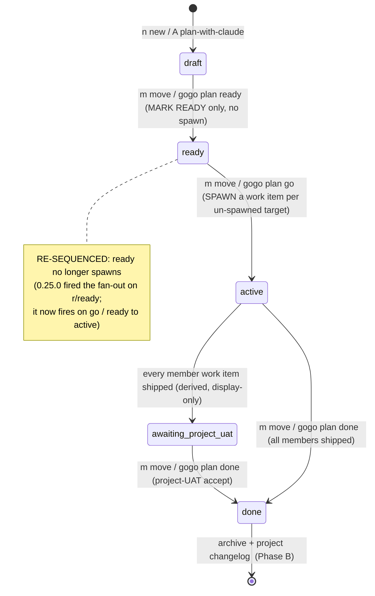
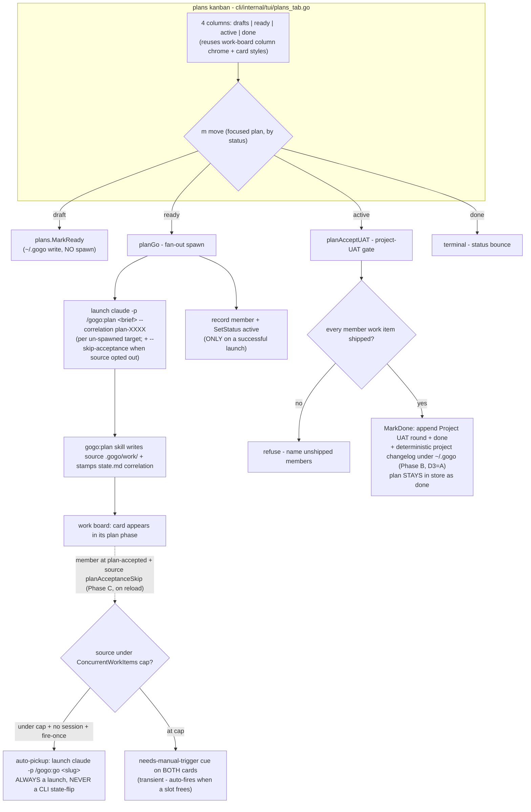

Status: **accepted** (user, 2026-07-23)

# Plan — plans-board-kanban

**Turn the cockpit's plans tab into a 4-column kanban (drafts · ready · active ·
done) that mirrors the work board, with an all-manual plan lifecycle: the user
moves a plan through its phases on the TUI (and via CLI verbs), and the 0.25.0
auto-spawn that fired on `ready` is re-sequenced onto a new `go` (ready→active)
step.** The **whole vision (FR1-FR6) is in scope for this one build** (user's call,
D1=B): the kanban + re-sequence (**Phase A**), the deterministic done-archive
(**Phase B**, D3=A), and the reload-driven auto-pickup for skip-configured sources
(**Phase C**, D4=B). The phases are a build order, not separate ships — all are
implemented + tested together.

Ships as **0.26.0**. The four forks are resolved — see `decisions.md`.

---

## Context — what exists today

The plans tab lives in `cli/internal/tui/plans_tab.go` and is a **grouped list**,
not a kanban. `viewPlans` renders three stacked sections — `ACTIVE · READY ·
DRAFTS` (via `planSections`) with an `N active · N ready · N drafts` header —
plus a plan-detail pane (`viewPlanDetail`). Navigation state is a **flat cursor**
(`m.planIdx` over `groupedPlans()`), an open-detail pointer (`m.planDetail`), and
a target cursor (`m.planSourceIdx`). `done` plans are terminal and **omitted**
from the list.

The persisted lifecycle is in `cli/internal/plans/plans.go`:
**`draft → ready → active → done`** (`StatusDraft`/`Ready`/`Active`/`Done`), plus a
derived, display-only **`awaiting-project-uat`** (`DerivedStatus`, shown when an
`active` plan's every member work item is shipped). A plan is CLI-owned data under
`~/.gogo/projects/<project>/.gogo/plans/<id>.md` — the store is **write-capable**,
but the CLI **never** writes a source's `.gogo/work/` (a spawn launches
`/gogo:plan` and the skill writes the work item + stamps the `correlation:` line).

**The behaviour we are re-sequencing.** 0.25.0 overloaded `r`
(`planReadyAndSpawn` in the TUI, `planReady` / `gogo plan ready` in `cli/plan.go`)
to do **both** mark-ready **and** an auto-spawn fan-out — one
`/gogo:plan <brief> --correlation plan-XXXX` per un-spawned target
(`finishPlanSpawn` / the `planReady` loop), riding each source's per-source
`--skip-acceptance` (`launch.SkipParams`, `projects.SkipForSource`), recording a
member + flipping the plan `active` **only on a successful launch**. We move that
fan-out off `ready` and onto a new `go` step.

**What already works and is reused as-is:**

| Building block | Where | Reused for |
|---|---|---|
| Member ↔ feature resolution by `(source, plan-id correlation)` | `spawnedFeature` (tui), `memberFeature` (plans) | plan-detail work-item status list |
| Project-UAT gate (refuses until every member shipped) + `MarkDone` | `plan.go planDone`, `plans.go MarkDone`, tui `planAcceptUAT`/`finishPlanDone` | active→done move (Phase A) + the archive hook (Phase B, FR5) |
| Per-source concurrency cap (in-progress + live-session count, scoped to a source root) | `orchestrator.CapForSource`/`ActiveWorkSlugs`/`CapExceeded`, tui `capBounce` | the auto-pickup cap two-branch (Phase C, FR6) |
| Board `m`→go launch (BuildIntent(ActionGo) + `SkipParams` + the launcher seam) | `move.go intentFor`/`launchAction`, `launch.BuildIntent` | the auto-pickup launch is byte-for-byte a manual go (Phase C, FR6) |
| Fan-out spawn (per-source brief + skip flag, fire-once, member-on-success) | `finishPlanSpawn` (tui), `planReady` loop (cli) | moves onto `go` (FR3) |
| Work-board column chrome + card boxes | `view.go` (`renderColumn`, `columnHeader`, `interleaveSeparators`, `boardColWidth`, `colAvail`, `fitEnd`, `columnStyles[i].card/.cardFocused`) | the 4-column plans kanban (FR1) |
| Per-source / per-project card colors | `sourceDot`, `sourceColor`, `projectColor` | plan cards keep their origin colors |
| Heap-stable `*formBinding` + `updateForm` completion routing | `model.go`, `update.go` | every confirm/launch on the tab (TEST-001) |

**Code is the source of truth.** The `project-knowledge.md` "0.21.0-0.24.0" note
narrates the plan lifecycle as `draft → ready → active → done` and the tab as a
grouped list — verified against `plans.go` + `plans_tab.go`; no drift found. The
knowledge doc lags the 0.25.0/0.25.1 auto-spawn + `A`-analyst work (it is not
mentioned there), but the **code** carries it; this plan is grounded in the code.

---

## Functional requirements

All six are in scope for this build. Phase tags mark **build order only**
(**[A]** kanban + re-sequence · **[B]** done-archive · **[C]** auto-pickup) — not
separate ships.

### FR1 [A] — the plans tab is a 4-column kanban

Render the focused project's plans as **four columns — `drafts · ready · active ·
done`** — with the **same look/feel as the work board**: column headers +
windowing, bordered cards, a focused-card highlight, vertical separators between
columns, and per-source/per-project card colors. Reuse the work board's column
chrome and card-box styles rather than a parallel renderer; only the per-card
*content* (a plan's title, `⛓ plan-XXXX` chip, `K of M work items` + the
per-source dot strip, and the derived `awaiting-project-uat` cue) is plan-specific.
Navigation mirrors the board: `←→/h l` move columns, `↑↓/j k` move cards, `enter`
opens the plan detail.

- **Given** a project with a draft, a ready, an active, and a done plan, **when**
  the user opens the plans tab, **then** the plan appears as a card in the column
  matching its status, under a `drafts / ready / active / done` header row.
- **Given** the plans kanban, **when** the user presses `→` then `↓`, **then**
  focus moves to the next column and down one card, exactly as on the work board.
- **Given** an active plan whose every member work item is shipped, **when** it is
  shown, **then** its card carries the `awaiting-project-uat · press m` cue (the
  existing derived status), so the ready-to-accept plan is visible at a glance.

### FR2 [A] — all plan phase moves are manual, via one board-style move

A single **`m` move** (mirroring the work board's `m`) advances the **focused**
plan **one column right**, resolving the phase-appropriate action from its current
status:

| Focused plan status | `m` does | Mechanism |
|---|---|---|
| `draft` | mark ready (draft→ready) | `plans.MarkReady` — a `~/.gogo/` store write, **no spawn** |
| `ready` | **go**: spawn a work item into every un-spawned target (ready→active) | the fan-out confirm + launch (FR3) |
| `active` | accept project-UAT (active→done) | `planAcceptUAT` gate + `MarkDone` (Phase B adds the archive, FR5) |
| `done` | bounce — terminal | status hint, no move |

- **Given** a focused draft plan, **when** the user presses `m`, **then** the plan
  flips to `ready` (a store write) and **nothing is spawned** — it waits for
  implementation.
- **Given** a focused active plan with an unshipped member, **when** the user
  presses `m`, **then** the move **refuses** with a message naming the unshipped
  member(s) — the existing project-UAT guard, no state change.
- **Given** a focused done plan, **when** the user presses `m`, **then** a status
  line says it is already done and nothing changes.

### FR3 [A] — re-sequence the auto-spawn off `ready` onto `go`

Mark-ready **no longer spawns**. A new **`go`** step owns the fan-out:

- `plans.MarkReady` / `gogo plan ready` / the draft→ready move → **mark ready
  only** (targetless and targeted alike), byte-for-byte the old targetless branch.
- A new **`gogo plan go <id>`** verb + the ready→active move → **spawn** a work
  item into every **un-spawned** target (its per-source brief as the goal, its
  `--skip-acceptance` when the source opted out), record a member + flip the plan
  `active` **only on a successful launch**, idempotent (an already-spawned target
  is skipped). The 0.25.0 `finishPlanSpawn` (tui) + `planReady` fan-out (cli) body
  **move here**; the CLI still writes nothing under a source's `.gogo/`.

- **Given** a targeted ready plan, **when** the user runs `go` (key or
  `gogo plan go`), **then** one `/gogo:plan … --correlation plan-XXXX` launches per
  un-spawned target, a member is recorded per successful launch, and the plan
  becomes `active`.
- **Given** a plan whose targets are all already spawned, **when** `go` runs
  **again**, **then** it is a no-op ("all N targets already spawned") — no
  re-launch.
- **Given** a source with `planAcceptanceSkip`, **when** `go` spawns into it,
  **then** the launched command carries `--skip-acceptance` (via `SkipForSource` /
  `SkipParams`), resolved from the **focused project's** source (cross-project skip
  isolation, REV-001 preserved).

### FR4 [A] — plan detail lists the work items + each one's status

The plan detail shows the **list of the plan's work items** and **each one's
current status/phase**, read via the existing `spawnedFeature` (contract reader).
This is largely the current `viewPlanDetail` target-source list (source dot + name
+ spawned feature's slug + status pill); reframe its heading as `WORK ITEMS` and
keep the `＋ create work item` affordance for un-spawned targets.

- **Given** an active plan with two spawned members, **when** the user opens its
  detail, **then** each member row shows the source, the work item's slug, and its
  live status pill (e.g. `review r2`, `awaiting-uat`, `shipped`), read from the
  board contract — never a source `.gogo/` write.

### FR5 [B] — active→done archives the plan + writes a project changelog (D3=A)

On active→done, `MarkDone` (today: append a `## Project UAT` round + flip `done`)
**also writes a deterministic, LLM-free project-changelog entry** under
`~/.gogo/projects/<name>/.gogo/changelog/<date>-<id>/` (path mirrors how `plans.Dir`
builds its dir: `filepath.Join(projects.Dir(project), ".gogo", "changelog", …)`).
The entry records **date · plan id · plan title · the shipped member work items**
(`source : slug`, plus a one-line pulled from each member's state/report **only when
cheaply available** from the already-loaded board contract, else just `source:slug`).
**No launched `claude -p` synthesis.** The plan **stays in the plans store as
`status=done`** so the kanban's 4th `done` column (which reads `plans.List`) still
shows it — "archive" is the **additional** durable record + the in-place `done` flip,
never a move-out of `plans/`. All writes stay under `~/.gogo/`.

- **Given** an active plan whose members are all shipped, **when** the user accepts
  the project-UAT (`m` / `gogo plan done`), **then** the plan flips to `done`, a
  changelog entry is written at `~/.gogo/projects/<name>/.gogo/changelog/<date>-<id>/`
  recording the date, plan id/title, and each shipped `source:slug`, and **no**
  source `.gogo/` is touched.
- **Given** the plan is now `done`, **when** the plans kanban re-renders, **then** the
  plan still appears as a card in the **`done`** column (it stayed in the store).
- **Given** a member's status/report line is not cheaply available from the loaded
  contract, **when** the entry is written, **then** that member is recorded as just
  `source:slug` (the writer never blocks on or launches anything to enrich it).

### FR6 [C] — reload-driven auto-pickup for skip-configured sources (D4=B)

When `go` spawns a work item into a source with **`planAcceptanceSkip`**, that work
item is picked up **automatically from plan → implementation** without a manual
`gogo go`. **The pickup is ALWAYS a launched `claude -p /gogo:go <slug>` (an
attachable detached tmux session, byte-for-byte a manual go — carrying
`--skip-acceptance`/`--skip-uat` per the source's flags via
`SkipForSource`/`SkipParams`), and the CLI writes NO source pipeline state.**

**Where it fires:** ONLY from the open cockpit's existing **reload path** — the
fsnotify-driven `reloadMsg` handler (`cli/internal/tui/update.go`, after
`m.reload()`; a spawn writes the source `.gogo/work/`, which the `watchSet` watches →
debounced `reloadMsg`). The 5s `sessionsMsg` tick is a secondary refresh. This is
**not** a CLI daemon; a headless/scheduled caller could reuse the same reconcile
function as a later follow-up (out of scope here).

**Eligibility — a member is a pickup candidate when ALL hold:**
1. its **source has `planAcceptanceSkip`** (`projects.SkipForSource` /
   `Source.PlanAcceptanceSkip`) — a non-skip source is **never** auto-fired;
2. its work item is at **`plan-accepted`** — the exact state a manual first
   `gogo go` acts on (`orchestrator.RunnableStatus`; a skip-acceptance spawn
   auto-accepts, so the member lands there). Auto-pickup keys on the **initial
   `plan-accepted` handoff** only, never a mid-pipeline status, so it never
   auto-resumes a parked/headless mid-run;
3. it has **no live session** (`liveSessionFor` / exact `SessionMatchesSlug` — the
   dedupe guard, never substring);
4. it has **not already been auto-fired this cockpit lifetime** — a **fire-once**
   in-memory set keyed by the composite `featureKey` (`Root\x00Slug`).

**The cap two-branch (the source's INTEGER `ConcurrentWorkItems`, counted
per-source):** `active := ActiveWorkCount(m.repo, root, m.sessions, slug)` (distinct
in-progress + live-session features whose `Root == root`, excluding the member),
`cap := CapForSource(capWatchSources, root)` — the exact trio the board's
`capBounce` uses (never global, never per-plan). Two members of one plan in two
different sources each get their own per-source budget.
- **Free slot** (`!CapExceeded(cap, active)` — e.g. `cap=1` and nothing running, or
  `cap=2` with one free) → **auto-fire** `/gogo:go <slug>` and add the composite key
  to the fire-once set.
- **Repo busy** (`CapExceeded` — e.g. `1/1` or `2/2`) → **do NOT fire.** Surface a
  visible **"needs manual trigger"** cue on **both** the eligible work-item card
  (work board) **and** its plan card (plans kanban), so the user sees it is ready and
  can start it themselves (`gogo go` / board `g`). This is an explicit signal, not a
  silent wait. A cap-skipped member is **not** added to the fire-once set, so on a
  **later** reload once a slot frees it **auto-fires then** and the cue clears
  (transient / auto-when-free — the queue drains itself).

**Real gates are never waived:** auto-pickup only removes the **initial keypress**.
A genuine mid-pipeline decision gate still parks the launched session at
`waiting-for-user` and surfaces on the board's "needs you" exactly as a manual run
would.

- **(a) free slot fires once.** **Given** a skip-source member at `plan-accepted`,
  no live session, its source under cap, **when** the cockpit reloads, **then**
  exactly one `/gogo:go <slug>` launches (fake-launcher fired once).
- **(b) fire-once, no relaunch.** **Given** that member already auto-fired, **when**
  the cockpit reloads again, **then** it does **not** relaunch (the composite key is
  in the fire-once set).
- **(c) non-skip source is not fired.** **Given** an eligible member whose source
  has **no** `planAcceptanceSkip`, **when** the cockpit reloads, **then** nothing
  auto-launches — it waits for the user's manual `gogo go`.
- **(d) at-cap does not fire, shows the cue.** **Given** a skip-source member
  eligible but its source **at** cap (`ConcurrentWorkItems=1` with a run in flight,
  or `2/2`), **when** the cockpit reloads, **then** nothing auto-launches and the
  member's **work-item card and its plan card both show the "needs manual trigger"
  cue**.
- **(e) slot frees → transient auto-fire.** **Given** that cap-blocked member, **when**
  the running job finishes and a slot frees on a later reload
  (`ConcurrentWorkItems=2` with one free counts as under cap), **then** it auto-fires
  then and the manual cue clears (it was never added to the fire-once set while
  blocked).
- **(f) live session is not double-fired.** **Given** a skip-source member that
  already has a live `gogo-*` session, **when** the cockpit reloads, **then** it is
  not fired again (the no-live-session guard).
- **(g) a real gate parks + surfaces.** **Given** an auto-fired run that hits a
  genuine decision gate, **then** its session parks at `waiting-for-user` and shows
  on the board's "needs you" — the gate is not waived.

---

## Approach (recommended)

**Reshape the existing plans tab in place — do not build a second cockpit.** The
work board already solves 4-column layout, windowing, focus, separators, and card
styling; the plans kanban reuses that chrome and adds only a plan-typed card
renderer and a plan-typed column partition. A fully generic
`renderColumn[T]`/interface abstraction over both `Feature` and `Plan` would be
more code than it saves (two card bodies that genuinely differ) — so the reuse is
**shared column chrome + card-box styles**, with a small `renderPlanCard`. One line
on why the simpler thing does not suffice: `Plan` and `Feature` are different types
with different card content and different move semantics (store writes + launches
vs pipeline launches), so a shared card renderer would need a type switch that is
messier than one focused `renderPlanCard`.

**Model additions (mirror the board's `cols`/`colIdx`/`cardIdx`):**
`planCols [4][]plans.Plan`, `planColIdx int`, `planCardIdx [4]int`, plus
`planColumnTitles = {"drafts","ready","active","done"}` and the matching status
vector. A `rebuildPlans()` partitions `m.plans` into `planCols` by status (now
**including** `done` as the 4th column), called wherever `loadPlans()` runs. The
flat `m.planIdx` + `groupedPlans()`/`planSections` grouped-list path is retired
(`viewPlans` becomes `viewPlansBoard`); `m.planDetail`/`m.planSourceIdx` stay.

**Move dispatch (`m`):** a small `planMove()` reads the focused plan's status and
calls `planMarkReady` (draft), `planGo` (ready — the renamed fan-out), or
`planAcceptUAT` (active); `done` bounces. Each keeps its own huh confirm and the
existing `updateForm` completion routing (`pendingPlanSpawn`→`finishPlanSpawn`,
`pendingPlanDone`→`finishPlanDone`), so no new form plumbing.

**CLI (`cli/plan.go`):** split `planReady` into a **mark-ready-only** `planReady`
(drop the fan-out) and a **new** `planGo` holding the fan-out; add `go` to
`isPlanStoreVerb` + `cmdPlanStore` + `planStoreHelp`. `gogo plan go` is lenient
(a draft or ready plan spawns → active). `gogo plan ready` and `gogo plan promote`
(single-source manual spawn) are otherwise unchanged.

**Phase B — done-archive (FR5, `plans.go`).** Add a `ChangelogDir(project)` helper
mirroring `Dir` (`filepath.Join(projects.Dir(project), ".gogo", "changelog")`) and a
deterministic `writeChangelogEntry(project, plan, members)` that renders a fixed
markdown record (date · id · title · `source:slug` lines) to
`<ChangelogDir>/<date>-<id>/entry.md`. `MarkDone` calls it after appending the
`## Project UAT` round and before/with the `done` flip — one extra `~/.gogo/` write,
no launch, no LLM. The TUI done-move already routes through
`planAcceptUAT`→`finishPlanDone`→`plans.MarkDone`, so the archive rides that path
with **no** TUI change beyond a status line. The member one-liners are pulled from
the **already-loaded** board contract passed into the accept (never a fresh read or
launch); absent → `source:slug`. The plan stays in the store as `done` (kanban 4th
column parity).

**Phase C — reload-driven auto-pickup (FR6, TUI).** Add a fire-once set
`autoPickedUp map[string]bool` (composite `featureKey`) to the Model and a pure
reconcile `autoPickupCandidates()` returning the eligible members + their resolved
`ActionGo` intents. The `reloadMsg` handler (after `m.reload()`) calls it and
`tea.Batch`es the launch cmd(s) alongside the existing `waitForReload` — the launch
reuses the board's `intentFor(launch.ActionGo, f)` + launcher seam, so an auto-fired
session is byte-for-byte a manual `m`→go (incl. `SkipParams`). The at-cap branch
computes a render-time predicate `autoPickupBlocked(f)` (skip-source + `plan-accepted`
+ no session + `CapExceeded`) that drives the "needs manual trigger" cue on both the
work-board card (`renderCard`) and the plan card (`renderPlanCard`); it stores
nothing, so the cue is transient and clears when a slot frees. Fire-once records only
ACTUAL launches (never a cap-skip), so a freed slot auto-fires on the next reload.

**Invariants honored:** every change writes only `~/.gogo/` (plan file + members +
status); every spawn/pickup is a launched `claude -p` (skill writes the source
`.gogo/work/`); bindings stay heap-stable `*formBinding` (TEST-001); no em-dash;
sessions attributed by exact `SessionMatchesSlug` (TEST-005); `gofmt`/`vet`/
`test -race` green before hand-off; version → **0.26.0** in `plugin.json` +
`cli/main.go`.

### Alternatives considered

- **Keep the grouped list, only re-sequence spawn.** Rejected — the user's core ask
  is the kanban; re-sequencing alone misses the point.
- **A generic `Board[T]` renderer shared by work + plans.** Rejected as
  over-engineering (see above) — the card bodies and move semantics differ enough
  that a shared renderer is net-more code.
- **Distinct keys `r`/`g`/`D` instead of one `m` move.** Considered; the user chose
  the board-consistent single `m` (D2=A). Handlers are identical either way, so this
  was a keymap choice, not architecture; today's `r`/`D` fold into `m`.
- **Auto-pickup: permanent-manual-once-blocked vs transient/auto-when-free.** A
  cap-blocked member could be marked permanently manual (simpler). Rejected in favour
  of the transient rule (D4=B): the queue drains itself when a slot frees, matching
  the user's intent — the fire-once set records only actual launches, so a cap-skip
  stays eligible.
- **Auto-pickup as an explicit `gogo plan pickup` verb (D4 option A).** Simpler and
  daemon-free, but not truly automatic; the user chose reload auto-fire (D4=B). The
  reconcile is factored as a pure function so a future verb/scheduler can reuse it.

---

## Build order

All of FR1-FR6 ship together as **0.26.0** (D1=B). The phases are a sane build +
review order, each leaving the tree green, not separate ships:

- **Phase A — kanban + re-sequence (FR1-FR4).** The 4-column kanban, the manual `m`
  move, spawn re-sequenced off `ready` onto `go`, and the plan-detail work-item
  status list. This is the structural reshape everything else builds on; land it
  first (TUI + `plan.go`) so the columns + move dispatch exist.
- **Phase B — done-archive (FR5, D3=A).** Extend `plans.MarkDone` with the
  deterministic project-changelog record + the `ChangelogDir` helper; the `done`
  move already routes through it. Small, `plans.go`-local, no TUI move change.
- **Phase C — auto-pickup (FR6, D4=B).** The reload-path reconcile: the eligibility
  scan, the fire-once set, the cap two-branch (auto-fire vs the manual-trigger cue),
  and the launch (reusing the board's `ActionGo` intent). The most behavioural piece
  and the one that touches both the work-board and plan-card renderers (the cue), so
  it lands last on top of a working kanban + a settled lifecycle.

**Why this order:** Phase A is the foundation the moves + cards depend on; B is an
isolated store extension; C is the only cross-renderer, launch-firing piece, so it
goes last where A's move plumbing and B's `done` state are already in place. All
three are implemented, reviewed, and tested in this one pipeline run before ship.

---

## Changes checklist (in build order — Phases A/B/C)

**Phase A — kanban + re-sequence (FR1-FR4):**
1. **`cli/plan.go`** — split `planReady` into mark-ready-only; add `planGo` (the
   moved fan-out, incl. `planFeatureSpawned`/`planHasMember`/`sourceInProject`
   reuse); register `go` in `isPlanStoreVerb` + `cmdPlanStore` + `planStoreHelp`.
2. **`cli/internal/tui/model.go`** — add `planCols`/`planColIdx`/`planCardIdx`;
   `planColumnTitles` + status vector; call `rebuildPlans()` from `loadPlans()`;
   retire `planIdx`/`planSections`/`groupedPlans` usage in favour of the columns.
3. **`cli/internal/tui/plans_tab.go`** — `viewPlansBoard` (reuse `boardColWidth`,
   `interleaveSeparators`, column header, `colAvail`/`fitEnd` windowing, and
   `columnStyles[i].card/.cardFocused`) + `renderPlanCard`; rename
   `planReadyAndSpawn` → `planGo` (fan-out) and add `planMarkReady`; add
   `planMove()` (dispatch by status); reframe the detail heading to `WORK ITEMS`.
4. **`cli/internal/tui/update.go`** — plans-tab keymap: `←→/h l` columns, `↑↓/j k`
   cards, `enter` detail, **`m`** move (dispatch), keep `n`/`A`/`c`/`+`/`e`/`x`;
   today's `r`/`D` fold into `m` (D2=A).

**Phase B — done-archive (FR5, D3=A):**
5. **`cli/internal/plans/plans.go`** — add `ChangelogDir(project)` (mirrors `Dir`)
   + a deterministic `writeChangelogEntry` (date · id · title · `source:slug`
   lines) writing `<ChangelogDir>/<date>-<id>/entry.md`; extend `MarkDone` to call
   it (one extra `~/.gogo/` write, no launch/LLM), keeping the plan in-store as
   `done`. Member one-liners are pulled from the already-loaded contract, else
   `source:slug`. (Optional `MarkActive` convenience; the fan-out already calls
   `SetStatus(StatusActive)`.)

**Phase C — auto-pickup (FR6, D4=B):**
6. **`cli/internal/tui/model.go`** — add the fire-once set `autoPickedUp
   map[string]bool` (composite `featureKey`); a pure `autoPickupCandidates()`
   (eligibility scan → members + `ActionGo` intents) + `autoPickupBlocked(f)`
   (render-time at-cap predicate) reusing `CapForSource`/`ActiveWorkCount`/
   `CapExceeded` + `SkipForSource` + `liveSessionFor`.
7. **`cli/internal/tui/update.go`** — in the `reloadMsg` handler (after
   `m.reload()`) run the reconcile and `tea.Batch` the launch cmd(s) with
   `waitForReload`; record the composite key in `autoPickedUp` on each fire.
8. **`cli/internal/tui/view.go` + `plans_tab.go`** — the "needs manual trigger" cue
   on the work-board card (`renderCard`) and the plan card (`renderPlanCard`) when
   `autoPickupBlocked` holds.

**Cross-cutting:**
9. **Enumeration sync** — the contextual help lines (`viewPlansBoard` help, detail
   help), `skills/gogo-cli` + `cli/main.go printHelp` (the new `gogo plan go`
   verb), and `README.md` plans-tab prose (kanban + `m` move + auto-pickup).
10. **Version bump** — `.claude-plugin/plugin.json` + `cli/main.go` → **0.26.0**.

---

## Tests

Follow the existing table/substring style (no TTY under `go test` → lipgloss emits
plain text); reuse `seedDataHome`, `sizedWorkspace`, `proj`/`src`, `send`, `tab`,
and the fake-launcher seam. Everything is message-driven/pure (no real tmux/claude).

**Phase A (FR1-FR4) — `cli/internal/tui` + `cli` (`plan_test.go`):**
- kanban renders four `drafts/ready/active/done` columns with each plan in its
  status column (FR1); `←→`/`↑↓` move column/card focus (FR1); `m` on a draft marks
  ready and spawns nothing (FR2/FR3); `m` on a ready fires the fan-out launcher once
  per un-spawned target + flips active (FR3, message-driven, mirrors
  `TestPlansTabAcceptSpawnsPerTarget`); `m` on an active with an unshipped member
  refuses (FR2); a launch error records no member (REV-005 parity); cross-project
  skip isolation preserved (mirrors `plans_tab_cross_project_skip_test.go`); plan
  detail lists members + status pills (FR4).
- **`plan_test.go`** — `gogo plan ready` now **only** marks ready (targeted +
  targetless) and spawns nothing; `gogo plan go` fans out (adapt
  `TestCmdPlanReadyFansOut` → `TestCmdPlanGo…`), idempotent, launch-failure +
  invalid-target reporting preserved; help text lists `go`. Adapt the folded
  `r`/`D` tests to `m`.

**Phase B (FR5) — `cli/internal/plans` + `cli/internal/tui`:**
- `MarkDone` on an all-shipped plan writes `<ChangelogDir>/<date>-<id>/entry.md`
  under `~/.gogo/projects/<name>/.gogo/` (assert path + that it records date, id,
  title, and each `source:slug`), and the plan **stays** in `plans.List` as `done`
  (kanban `done`-column parity); a member with no cheap one-liner records bare
  `source:slug`; no source `.gogo/` write. The plans-tab `m` on an all-shipped
  active still opens the UAT confirm → `MarkDone` (the archive rides `finishPlanDone`).

**Phase C (FR6) — `cli/internal/tui` (the six/seven BDD cases, fake-launcher):**
- (a) skip-source member at `plan-accepted`, no session, under cap → one auto-launch
  on `reloadMsg`; (b) a second reload does **not** relaunch (fire-once set); (c) a
  non-skip source member is not auto-fired; (d) a skip-source member with its source
  **at** cap (`ConcurrentWorkItems=1` busy, and `2/2`) does not fire and its
  work-item card + plan card both show the manual-trigger cue; (e) `ConcurrentWorkItems=2`
  with one free slot fires (under cap), and a freed-slot-on-later-reload transient
  fire clears the cue; (f) a member with a live session is not double-fired; (g) an
  auto-fired run at a real gate parks `waiting-for-user` + shows on the board (the
  gate predicate, not the launch, drives this). Assert the fired intent is
  `ActionGo` carrying the source's `SkipParams`.

**Gates** — `gofmt -l .` clean · `go vet ./...` clean · `go test -race ./...`
green (incl. `TestSkillsBashNoUnsafeRm`, enum-sync guards).

---

## Out of scope

- A **headless/scheduled** auto-pickup runner (a `gogo plan pickup` verb or cron):
  FR6 fires only from the open cockpit's reload loop; the reconcile is factored pure
  so a future caller can reuse it, but no such caller ships here.
- A **launched-synthesis** project changelog (D3 option B) — FR5 is the deterministic
  record only.
- Changing the **work board's** move/columns, the contract schema, or any source
  `.gogo/` layout (FR6 only ADDS a card cue + a launch, no work-board move change).
- The `A` plan-with-claude analyst flow, `n` quick draft, `+` add target, `c`
  single-source spawn, `x` delete — carried unchanged.
- Cross-repo *merged* project ships, worktrees (roadmap P5), multi-model runners.

---

## Intended design (diagrams)

The plan lifecycle as a **state machine** — note the trigger re-sequencing (spawn
moves off `ready` onto `go`) and that `awaiting-project-uat` is a derived,
display-only status:

The **control flow** of the `m` move and where each transition writes vs launches
— every spawn and the Phase-C auto-pickup are launched `claude -p`, never a CLI
state-flip:

The as-is baseline (grouped list + overloaded `r`) is captured in
`charts/before/flow.mmd` for the report phase's before/after compare.

## Decisions (all resolved — see `decisions.md`)

- **D1 = B** — build the **whole vision (FR1-FR6) in this one plan**, shipped as
  0.26.0 (Phase A/B/C = build order, not separate ships).
- **D2 = A** — a **single board-style `m` move**; today's `r`/`D` fold into it (their
  tests are adapted); CLI verbs `gogo plan ready`/`go`/`done` kept.
- **D3 = A** — the done-archive is a **deterministic, LLM-free** project-changelog
  record under `~/.gogo/projects/<name>/.gogo/changelog/<date>-<id>/`; the plan stays
  in-store as `done` (kanban 4th-column parity).
- **D4 = B** — auto-pickup **auto-fires from the cockpit's reload path** with the
  required guards (skip-source · `plan-accepted` · no session · fire-once) and the
  **cap two-branch** (under cap → fire; at cap → a visible manual-trigger cue on both
  cards, transient/auto-when-free). The launch is always `claude -p /gogo:go`.

---

## Summary (TL;DR)

- **What:** reshape the cockpit **plans tab into a 4-column kanban** (`drafts ·
  ready · active · done`) that mirrors the work board, with an **all-manual**
  lifecycle moved by a **board-style `m`** key + mirror CLI verbs.
- **Why:** the plans tab is a grouped list today; the user wants it to look and
  behave like the work board, and wants the 0.25.0 auto-spawn **re-sequenced off
  `ready`** so `ready` means "waiting for implementation, nothing spawned."
- **Approach:** reuse the work board's column chrome + card-box styles (add only a
  plan-typed partition + `renderPlanCard`); split spawn off `ready` onto a new
  **`go`** step (`gogo plan go` + the ready→active move); extend `MarkDone` with a
  deterministic project changelog (plan stays in-store as `done`); auto-pickup fires
  from the cockpit reload path for skip-sources under cap (a manual-trigger cue when
  at cap). All writes stay under `~/.gogo/`; every spawn/pickup is a launched
  `claude -p /gogo:go|plan`, never a CLI state-flip.
- **Chosen scope (D1=B):** the **whole vision (FR1-FR6)** ships together as
  **0.26.0** — build order **Phase A** (kanban + re-sequence) · **Phase B**
  (done-archive, D3=A) · **Phase C** (reload auto-pickup, D4=B) — implemented +
  tested together.
- **Next:** the orchestrator gates re-acceptance of this revised plan; on accept,
  `/gogo:go` builds all three phases in one run.

Status: awaiting acceptance
