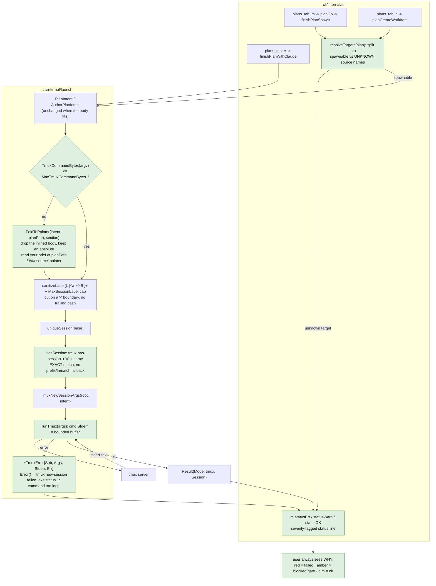

# Plan — plans-tab launch diagnostics and plan view

Status: **accepted** (user, 2026-07-29) — D1-D6 resolved on gogo's recommendations

**Reconciled to as-built at report ⑤ (2026-07-30).** Five in-flight corrections are folded into
the text below and each is marked where it applies, so this file matches what shipped as 0.28.0:
**A2** FR1.5's `capture-pane` target form was **wrong as accepted** and is corrected inline;
**A3** the fold was additionally wired at the two `gogo plan` CLI doors, a file this checklist
never listed (an orchestrator scope call, recorded as such); **A4** `SessionMatchesSlug` gained a
read-side back-compat widening for pre-0.28.0 session names; **A5** the plans-tab confirm default
(`m` → Enter confirms) plus the named CONFIRM-DEFAULT CONVENTION was added on the user's call and
was not in the accepted plan at all. Every correction is also in
[adjustments.md](./adjustments.md) and in the [report](./report/report.md).

**In one paragraph.** Starting a session from the cockpit's plans tab can fail with nothing
but `exit status 1`, and a plan can only be read in a cramped inline pane. This plan makes
every launch **self-reporting** — tmux's own words reach the status line, oversized commands
are caught before tmux sees them, and blocked/failed/ok become visually distinct — then gives
plan cards the same **`v` (terminal) / `w` (web)** viewers work-item cards already have. A
third leg answers the "cap of 1" suspicion: the cap is **already per-source and already
excludes plans**, so that leg is about *discoverability and two real bugs found next to it*,
not a cap redesign.

---

## Goal

Three linked fixes to the `gogo` TUI cockpit (`cli/internal/tui` + `cli/internal/launch`),
shipping together because they share one root cause: **the cockpit does not tell you why
nothing happened.**

1. **BUG — launching a session from the plans tab fails at tmux** with an unhelpful
   `exit status 1`. Make the failure self-reporting first, then fix the cause.
2. **FEATURE — plan view parity.** Add `v` (terminal view) and `w` (interactive web page) to
   the plans tab, reusing the work board's seams.
3. **CLARITY — the concurrency cap.** Verify the user's mental model against the code, fix
   the two genuine defects found beside it, and say plainly where the code is already right.

**Acceptance signal.** From the plans tab: a launch that fails names tmux's real error; a
launch that is blocked says what is blocking it and how to unblock it; a plan opens in the
glamour viewer with `v` and in a browser page with `w`; and `go test -race ./...`,
`go vet ./...`, `gofmt -l .` are clean in `cli/`.

---

## Context — what exists, verified in code

Everything below was checked against the tree and, where it is a claim about tmux, **measured
on this machine (tmux 3.7b)**. Where the briefing was wrong, it is called out.

### The launch path

| Thing | State | Evidence |
|---|---|---|
| `launch.Launch` | `exec.Command("tmux", args...).Run()`, wraps only the exit code | `cli/internal/launch/launch.go:620-622` |
| `launch.LaunchPersistent` | same pattern | `launch.go:716-718` |
| `launch.KillSession` | same pattern | `launch.go:663` |
| `sanitizeLabel` / `sessionName` | `[^a-z0-9-]+` → `-`, **no length cap** | `launch.go:459-472` |
| `HasSession` | `tmux has-session -t <name>` — not an exact test | `launch.go:573-578` |
| `AttachArgs` | `switch-client` inside tmux, `attach-session` outside | `launch.go:596-601` |
| attach error handling | `tea.ExecProcess`'s `err` is **discarded**; always reports `detached from X` | `tui/update.go:597-599`, `tui/peek.go:111-113` |
| `statusStyle` | `lipgloss.NewStyle().Faint(true)` — **one voice for every outcome** | `tui/view.go:954-956` |

### The measured tmux facts

| Claim | Verdict | Measurement |
|---|---|---|
| Session-name length is the root cause | **FALSE** | `tmux new-session -s <name>` succeeded at 93, 210, 520, 1010 and **2010** chars. Length is not a failure, but it *does* eat the command budget below. |
| `-t` resolves exact → prefix → fnmatch | **TRUE, and it bites** | `has-session -t gogo-test-al` returned true for session `gogo-test-alpha-beta-gamma`. Worse: **`kill-session -t gogo-plan-foo` killed `gogo-plan-foobar-long`**, and `capture-pane -t <prefix>` read the wrong session's pane. `-t "=<name>"` is exact and fixes all three. |
| tmux has a command-length limit | **TRUE — this is the root cause** | Bisected: last OK = **16 317 bytes**, first failure = **16 318**, stderr `command too long` (and `failed to send command` at the boundary), exit status 1. |
| `-c <bad dir>`, a missing binary, `.`/`:` in the name | not failures on 3.7b | all returned rc=0 |
| tmux runs the command through a shell | **FALSE — argv is preserved verbatim** | An argv probe showed spaces, newlines and `$(…)`/backticks/`;`/`*` arriving intact as one element. The injection-safety claim in the code comments **holds**. |

### The reproduction

The user's live plan `~/.gogo/projects/dotai/.gogo/plans/plan-30939c06.md` is **20 240 bytes**,
titled *"Catalogue side of the matching engine - normalise, store, embed, hard-filter"* — the
exact 83-char session name seen running. Replaying the real spawn argv through the real
`launch` code:

```
argv elements=10, total bytes=20128
--- what the CURRENT code reports (.Run(), stderr discarded) ---
    tmux new-session failed: exit status 1
--- what a stderr-capturing version would report ---
    tmux new-session failed: exit status 1: command too long
```

**The body of the plan is inlined into the tmux command line.** Measured across the user's real
data:

| Path | Command bytes | Verdict |
|---|---|---|
| `m` spawn, `BriefFor` hit (`plan-1948afcd`) | 10 717 | fits, at **66 % of budget** |
| `m` spawn, `BriefFor` hit (`plan-30939c06`) | 5 021 | fits |
| `m` spawn, **`BriefFor` misses → whole body** (`plan-1948afcd`) | **16 337** | **over — `command too long`** |
| `m` spawn, **`BriefFor` misses → whole body** (`plan-30939c06`) | **20 213** | **over — `command too long`** |
| `A` author, goal = a pasted multi-KB spec | **17 607 / 21 453** | **over — `command too long`** |

Usable budget after fixed overhead: **~15 000 chars** for an `A` goal, **~16 100** for an `m`
brief. A pasted spec or a `## Source briefs` section without a matching `### <source>`
subsection blows it, and the user sees only `exit status 1`.

### The plans tab vs the work board

- Work board (`tui/update.go:258-263`): `v` → `quickView(f)`, `w` → `buildPageCmd()`.
- Plans tab (`tui/plans_tab.go:122-157`): binds `left/h`, `right/l`, `up/k`, `down/j`, `enter`,
  `n`, `A`, `m`, `x`. **No `v`, no `w`** — confirmed. (The brief said "~123-147"; it is 122-157.)
- A project plan is **one markdown file** at `~/.gogo/projects/<name>/.gogo/plans/<id>.md` with
  **no `charts/`** — confirmed (`plans.Path`, `internal/plans/plans.go`).
- **`pages.BuildHTML` degrades cleanly** with empty `DiagramDir`/`BeforeDir`/`ManifestPath` —
  *verified by running it* on the real plan: no error, 27 768 bytes of HTML, the summary
  rendered, an empty diagram slot, `layouts` `{}`. `contract.ReadManifest("")` returns
  `(nil, nil)` and `Manifest.TitleFor` is nil-safe.

### The concurrency cap — the user's model is already the implementation

The user's expectation ("cap per source, many plans at once, many work items at once in
*different* sources, cap only work items in progress") **is what the code already does.**
Verified by running the real helpers:

```
PROBE-B same source (A), other slug   root=/repos/a cap=1 active=[work-a] blocked=true
PROBE-B different source (B)          root=/repos/b cap=1 active=[]       blocked=false
PROBE-B resume the busy one           root=/repos/a cap=1 active=[]       blocked=false
PROBE-C source AT cap 1: plan spawn -> fired=1 [/gogo:plan body --correlation plan-…]
```

- `orchestrator.CapForSource` matches `s.Path == root` — **per-source** (`cap.go:62-69`). ✅
- `ActiveWorkSlugs` counts only `f.Root == root` **and** `ClassInProgress` **and** a live
  session, excluding the target (`cap.go:27-47`). ✅
- Plans are `plans.Plan`, not `contract.Feature` — **structurally uncountable**. ✅
- `plans_tab.go` never calls `capBounce` — plan launches are **not** cap-gated (probe C). ✅
- `projects.DefaultConcurrentWorkItems = 1` (`projects.go:47`) — the "cap 1" the user saw. All
  three of their sources carry `"concurrentWorkItems": 1`. It is editable in the config tab,
  whose field already reads *"0 = unlimited; N caps live in-progress features"*
  (`config_tab.go:114`).

**So the cap is not the bug.** But three real things sit next to it:

1. **Dangling plan targets are silently dropped.** Reproduced: a plan in project `dotai` whose
   `targets:` names `gogo` (a source of a *different* project) passes `planGo`'s guard, opens
   the confirm *"Accept plan-XXXX and spawn 1 work item(s)? into: gogo"*, and then
   `finishPlanSpawn` `continue`s past the unresolvable source and lands on
   `"no spawnable targets for plan-XXXX"` — **zero launches, plan untouched**. The user's live
   `dotai/plan-1948afcd` (`targets: gogo`, `status: ready`, `members: 0`) is exactly this shape.
   **This is the most likely thing they actually hit.**
2. **Every status message looks identical.** Cap bounce, dangling target, tmux failure and
   success all render through `statusStyle` = faint grey. The user could not tell a cap bounce
   from a tmux failure **because they are typographically the same**.
3. **A plan-spawned work item's session never attributes to it.** The spawn session is named
   after the **plan title** (`gogo-plan-catalogue-side-…---normalise-…`) while the analyst
   derives its own slug (on disk: `feature-catalogue-ingestion`). `SessionMatchesSlug` returns
   **false** — verified against the live session. Consequences: no `●` dot, `a` attach says
   "no running session", `l` peek falls back to the log, and the cap **under**-counts it. Two
   contributing causes: the slug regexes disagree (`planSlugHint` = `[^a-z0-9]+` collapses `-`,
   `sanitizeLabel` = `[^a-z0-9-]+` keeps it, so `" - "` → `---` vs `-`), and `SessionMatchesSlug`
   omits `ActionAuthor` and `ActionResume` from its action list.

### Corrections to the briefing

- **"Length is the root cause"** → no. Names up to 2 010 chars launch fine. The real limit is
  the **whole command line at ~16 317 bytes**.
- **"There is an enum-sync guard test that will fail otherwise"** → **no such test exists for
  TUI keys.** `TestCLICommandEnumerationInSync` (`cli/cli_enum_test.go`) guards **CLI
  subcommand verbs** (`gogo go`, `gogo plan`, …) across four doc sites; it is blind to key
  bindings, and nothing asserts the plans-tab help strings. This plan therefore **adds** that
  guard rather than relying on one.
- **"`-c` with a bad dir / a missing binary"** → not failure modes on tmux 3.7b (rc=0).
- **`kill-session`/`capture-pane` prefix resolution** was not in the briefing and is a
  wrong-session hazard, proven by experiment.

---

## Functional requirements

### Leg 1 — the launch is self-reporting

- **FR1.1 — tmux's real stderr reaches the error.** One internal `runTmux(sub string, args
  []string) error` captures `cmd.Stderr` into a bounded buffer and, on failure, returns a typed
  `*launch.TmuxError{Sub, Args, Stderr, Err}` whose `Error()` reads
  `tmux new-session failed: exit status 1: command too long`. Used by `Launch`,
  `LaunchPersistent` and `KillSession`. `HasSession` stays a bare predicate by design.
- **FR1.2 — oversized commands never reach tmux.** Exported `MaxTmuxCommandBytes` (16 317,
  measured) and `TmuxCommandBytes(argv []string) int`. `Launch`/`LaunchPersistent` preflight;
  over budget they **fold the inlined body into a pointer** (FR1.3) rather than failing, and if
  it *still* does not fit they return a typed error naming the byte count and the limit.
- **FR1.3 — fold-to-pointer instead of inlining a whole plan body.** The brief already lives on
  disk at `plans.Path(project, id)`. When over budget, the launched command drops the inlined
  body and carries an absolute pointer instead — *"read your brief at `<planPath>`, section
  `## Source briefs` → `### <source>`"*. **Under budget nothing changes, byte-for-byte.**
- **FR1.4 — session names are bounded.** `sanitizeLabel` caps the label (default 48 chars, cut
  on a `-` boundary, no trailing dash). Because `SessionMatchesSlug` calls the same helper, both
  sides stay in sync automatically.
  > **Corrected at implementation (REV-001, 2026-07-29).** The dash-boundary cut as written had
  > **no floor**, so a realistic title (`"Refactor NotificationDeliveryOrchestrationPipelineFor…"`)
  > collapsed to its first word, `refactor` - two plans sharing a first word then minted the *same*
  > session base, reintroducing the very TEST-005 attribution ambiguity FR1.4 exists to avoid. As
  > built, the boundary is honoured **only past `MaxSessionLabel/2`**; below that the hard 48-byte
  > cut stands (ugly but unique).
  > **Corrected at implementation (A4 / REV-009, 2026-07-29).** The cap applies to the **slug side**
  > of `SessionMatchesSlug` too, so as accepted this FR would have made every session a **pre-0.28.0**
  > gogo minted with a >48-char label stop matching the moment the user upgraded - measured against
  > the 83-char session running live on this host. As built, `SessionMatchesSlug` matches against
  > **both** transforms: the bounded one 0.28.0 mints with and the pre-0.28.0 `unboundedLabel`.
  > This is a **read-side widening, not a relaxation of FR1.4** — minting stays bounded.
- **FR1.5 - session probing is exact.** Every tmux `-t` **target** uses tmux's exact-match form,
  in the shape that target position actually accepts: `-t "=" + name` for **session** targets
  (`has-session`, `kill-session`, and - added at review, REV-008 - `attach-session` /
  `switch-client`), and `-t "=" + name + ":"` for `CapturePaneArgs`, whose `-t` is a **pane**
  target (verified: `-t "=gogo-plan-exact"` correctly refuses to match `gogo-plan-exact-long`).
  **`new-session -s` must NOT get the `=`** - it would become part of the name (verified: a session
  literally named `=gogo-eqtest` was created).
  > **Correction at implementation (A2, 2026-07-29) - the sentence above was wrong as accepted and
  > has been corrected.** As originally written FR1.5 put `CapturePaneArgs` on the bare `=` session
  > form. `capture-pane` needs the exact **PANE**
  > target `-t "=" + name + ":"`, not `-t "=" + name`. Measured on tmux 3.7b: a bare
  > `capture-pane -t "=gogo-x"` fails outright with `can't find pane: =gogo-x`, so shipping FR1.5
  > as written would have broken **every** log peek. The trailing `:` makes it a pane target whose
  > *session component* is exact-matched. Verified live end-to-end through `launch.CapturePane`:
  > `=<name>:` reads its own pane and refuses a prefix, while a plain `-t <prefix>` did read the
  > wrong session's pane (the hazard FR1.5 exists to close). `has-session` / `kill-session` take
  > **session** targets and keep the bare `=` form as specified.
- **FR1.6 — attach failures are reported.** `attachSession` and `attachFromPeek` surface
  `tea.ExecProcess`'s `err` instead of always claiming `detached from X`.
- **FR1.7 — attribution covers every action.** `SessionMatchesSlug` includes `ActionAuthor` and
  `ActionResume`; `planSlugHint` and `sanitizeLabel` agree on the same transform.

### Leg 2 — plan view parity

- **FR2.1 — `v` opens the plan markdown in the terminal viewer.** On the focused plan (kanban)
  and in the plan detail, reusing `openArtifact(contract.Artifact{Kind: KindMarkdown, Path:
  plans.Path(project, id)})` — the same glamour article renderer, width-keyed cache, spinner and
  paging keys the board uses.
- **FR2.2 — `esc` from a plan view returns to the plans tab.** A viewer-return flag mirroring
  the existing `m.peeking` pattern. **This is load-bearing:** `updateViewer`'s `esc` sets
  `mode = modeDrill`, and `viewDrill` dereferences `m.drill` with **no nil guard**
  (`tui/view.go:840-842`) — a naive wiring panics.
- **FR2.3 — `w` builds and opens the interactive page.** A `planBundleFor` producing
  `pages.Bundle{MarkdownPath: planPath, DiagramDir: "", BeforeDir: "", ManifestPath: ""}`, written
  via `pages.WritePage(projects.Dir(project), bundle)` →
  `~/.gogo/projects/<name>/.gogo/resources/view/<plan-id>.html`.
- **FR2.4 — the invariant holds.** The page and its viewer assets are written **only** under
  `~/.gogo/`; no source repo's `.gogo/` is touched.
- **FR2.5 — key enumerations stay in sync, and a test proves it.** The two plans-tab help lines,
  `main.go printHelp`, `README.md`, `docs/cli-contract.md` and `skills/gogo-cli/SKILL.md` all
  gain `v`/`w`; a **new guard test** derives the plans-tab keys from the `updatePlanList` /
  `updatePlanDetail` switches and fails if any is missing from the help lines.

### Leg 3 — the cap is legible

- **FR3.1 — unresolvable plan targets are refused up front, by name.** `planGo` (and `c`)
  partition targets into spawnable vs unknown *before* the confirm; the confirm lists only
  spawnable targets, and an unknown one produces *"plan targets `gogo`, which is not a source of
  project `dotai` — add it in the config tab, or retarget the plan"*. A plan with **no**
  resolvable target never opens a confirm it cannot honour.
- **FR3.2 — the status line has severity.** Three helpers (`statusErr` / `statusWarn` /
  `statusOK`) over the existing palette: red for failures, amber for blocked/gate, dim for
  success. Every launch site is classified. Presentation-only; no contract change.
- **FR3.3 — the cap has an in-TUI override.** The bounce currently ends *"run `gogo go <slug>
  --force`"*, which means leaving the cockpit. Add a force variant (`M`) routed through the
  existing confirm, which already names the cap and the blocking slugs.
- **FR3.4 — the cap's real scope is documented where it is read.** `capText` in the config tab
  and the help text state plainly: per **source**, counts only **in-progress work items with a
  live session**, plans are never counted, `0` = unlimited.

**Non-goals inside this leg:** the cap default stays **1** (the working-tree-clobber rationale in
`move.go:129-141` is sound and the field is already self-documenting), and the cap model itself
is **not** redesigned — it already matches the user's expectation.

### Added during the run - as-built, NOT in the accepted plan

Two requirements were added after acceptance. They are recorded here as additions rather than
back-dated into the legs above, so the accepted scope stays legible.

- **FR-A3 - the fold applies at the headless `gogo plan` doors too** (added at review round 01,
  REV-002; an **orchestrator scope call**, 2026-07-29). The accepted Changes checklist scoped
  `FoldToPointer` to three `internal/tui` sites and **never listed `cli/plan.go`**. But
  `gogo plan go` and `gogo plan promote` build the *identical* `launch.PlanIntent` and so blew the
  identical budget - measured **20 951 bytes** against the 16 317 limit on the user's real plan
  shape. Shipping without them would have left the cockpit fixed and the scriptable surface
  `README.md` advertises as its equivalent still broken, which is D1's **rejected option B** by
  accident. FR1.3 is phrased as a property of the *launch*, not of a key binding, so the omission
  was treated as a gap in the plan's coverage. As built: the same two-line seam at
  `cli/plan.go:451` (`planGo`) and `cli/plan.go:569` (`planPromote`) - `intent.Root = src.Path`,
  then `launch.FoldToPointer(...)` **after** `SkipParams` so the params survive the fold - plus
  `planKebab` delegating to `launch.SlugFromLabel` (REV-004) so the CLI and TUI slug hints cannot
  drift. Under-budget parity was re-derived through the real doors after the change.
- **FR-A5 - the plans-tab confirms submit on Enter, and the asymmetry is a written convention**
  (added at test round 01, TEST-001; **the user's call**, in their words *"m -> enter should
  confirm"*). Not a plan item at all: both plans-tab confirm constructors built an unseeded
  `&formBinding{}`, whose Go zero value means **Cancel**, so the same keystroke that launches on
  the board silently cancelled on the plans tab (pre-existing since 0.25.0). As built:
  `confirm: true` seeded at `startPlanSpawnForm` + `startPlanDoneForm`; `startDeleteForm` and
  `startKillForm` **deliberately keep `confirm: false`** so Enter stays safe on a destructive
  action; and the asymmetry is now the named **CONFIRM-DEFAULT CONVENTION**, stated canonically at
  `move.go`'s `startFormOverriding` with pointer comments at the four other sites.

---

## Approach

**Recommended: one release, three legs, shared test surface.**

The legs are not independent. Leg 1's typed error is what Leg 3's red status line renders; Leg 3's
target-resolution guard is what stops Leg 1's launch from being reached with a bad target; Leg 2
touches the same key switch and the same help lines Leg 3's status work touches. Splitting them
means three passes over `plans_tab.go` and three doc-sync rounds.

The shape is deliberately conservative:

- **`launch` stays pure-argv and unit-testable.** `TmuxCommandBytes`, `MaxTmuxCommandBytes`,
  the `=`-prefixed target builders, the bounded `sanitizeLabel` and `TmuxError.Error()` are all
  pure functions with no tmux dependency — exactly the seam the package already exposes.
- **The TUI reuses existing seams, adds none.** `openArtifact` already takes a bare
  `contract.Artifact` (path + kind), so `v` needs no new renderer. `pages.Bundle` already
  tolerates an empty diagram set (proven by running it), so `w` needs no new builder.
- **Nothing under budget changes behaviour.** The fold-to-pointer, the preflight and the
  severity styling are all no-ops on the happy path.

### Alternatives considered

| Alternative | Why not |
|---|---|
| **Truncate the goal** when over budget | Silently loses the brief the analyst wrote. The pointer keeps 100 % of it and costs one file read. |
| **Spill the goal to a temp file** and point at that | Redundant — the brief is *already* a file in `~/.gogo/`. A spill adds a lifecycle to manage. |
| **A new `--plan-file <path>` param** on `/gogo:plan` | A skill-contract change (enum-sync across skills, docs, README, `cli-contract.md`) for something the existing prose pointer already achieves. Revisit if the pointer proves unreliable. |
| **Cap the session name aggressively (e.g. 24)** | Names collide sooner and read worse; 2 010-char names launch fine, so the cap is hygiene, not a fix. 48 keeps them readable and unique. |
| **Give plans their own viewer/page builder** | Duplicates `openArtifact` + `pages`. The existing seams already take the exact inputs a plan provides. |
| **Fix the cross-repo same-slug over-count now** | Real (reproduced) but needs a per-feature registry read in a hot render path. Deferred — see **D5**. |
| **Ship the three legs separately** | See above; the seams overlap. A slice order is offered in **D6** if the reviewer wants it split. |

---

## Intended design

**The launch path** — where the preflight, the exact-match session probe and the captured
stderr sit. Green nodes are new; everything else is today's code, unchanged.



**The plans-tab viewers** — `v` and `w` over the seams that already exist. Note the `esc`
return path: it must **not** land on `modeDrill`.

```mermaid
sequenceDiagram
  autonumber
  actor U as user
  participant P as tui/plans_tab.go<br/>updatePlanList / updatePlanDetail
  participant PL as internal/plans
  participant PR as internal/projects
  participant D as tui/drill.go<br/>openArtifact
  participant PG as internal/pages
  participant BR as browser

  Note over U,BR: v - terminal view of the plan markdown
  U->>P: press v on the focused plan
  P->>PL: plans.Path(project, plan.ID)
  PL-->>P: ~/.gogo/projects/&lt;name&gt;/.gogo/plans/&lt;id&gt;.md
  P->>P: m.planViewing = true (viewer return-mode flag)
  P->>D: openArtifact(Artifact{Kind: KindMarkdown, Path: ...})
  D->>D: renderArtifactCmd -> glamour, article mdstyle, width-keyed cache
  D-->>U: modeViewer - paging, g/G, no drill needed
  U->>P: press esc
  P->>P: closePlanView(): mode = modeBoard, tab = tabPlans
  Note right of P: never modeDrill - viewDrill<br/>dereferences a nil m.drill

  Note over U,BR: w - self-contained interactive web page
  U->>P: press w on the focused plan
  P->>PL: plans.Path(project, plan.ID)
  P->>PR: projects.Dir(project)
  PR-->>P: ~/.gogo/projects/&lt;name&gt;/
  P->>PG: pages.WritePage(projectDir, Bundle)<br/>MarkdownPath = planPath, DiagramDir / BeforeDir / ManifestPath empty
  PG->>PG: renderSummary via goldmark, buildFigures yields nothing,<br/>readLayouts yields an empty map (verified: degrades, no error)
  PG-->>P: ~/.gogo/projects/&lt;name&gt;/.gogo/resources/view/&lt;id&gt;.html
  P->>BR: openBrowser(page)
  BR-->>U: offline article page (no source repo touched)
```

**The outcome taxonomy** — what the status line must be able to say. Today every one of these
renders as the same faint grey string.

```mermaid
stateDiagram-v2
  direction TB
  [*] --> KeyPressed

  KeyPressed --> Blocked: guard refused
  KeyPressed --> Failed: launch returned an error
  KeyPressed --> Launched: launcher returned a session

  state Blocked {
    direction TB
    Cap: cap N reached in &lt;source&gt; - already building X<br/>press M to force, or ship one
    Dangling: plan targets &lt;name&gt;, which is not a source of<br/>project &lt;p&gt; - add it in config, or retarget
    NoClaude: claude CLI not on PATH
  }

  state Failed {
    direction TB
    TooLong: tmux new-session failed: command too long<br/>(brief was N B, limit ~16317 B) - folded to a pointer
    Dup: tmux new-session failed: duplicate session: &lt;name&gt;
    OtherTmux: tmux &lt;sub&gt; failed: &lt;exit&gt;: &lt;real tmux stderr&gt;
    AttachFail: attach to &lt;session&gt; failed: &lt;tmux stderr&gt;
  }

  Blocked --> Amber
  Failed --> Red
  Launched --> Dim

  Amber: statusWarn - amber pill, "blocked, here is the unblock"
  Red: statusErr - red pill, always carries tmux's OWN words
  Dim: statusOK - dim, the existing success voice

  Amber --> Actionable
  Red --> Actionable
  Dim --> Actionable
  Actionable: every outcome names WHAT happened and WHAT to do next
  Actionable --> [*]
```

The as-is baseline for each of these is captured in `charts/before/` (same three kinds), so
report ⑤ can draw the after set and compare.

> **These three remain the *accepted design* and are left as accepted.** The **as-built** set -
> which differs in exactly two places: `capture-pane` on the pane-target form `=<name>:` (A2) and
> the `preflight` + `CommandTooLongError` node sitting *after* `TmuxNewSessionArgs` rather than
> before the name build - plus an added **class** diagram of the new types, lives in
> [`report/`](./report/) with a side-by-side before/after comparison in
> [`report/report.md`](./report/report.md).

---

## Changes checklist

Build order - `launch` first (pure, testable), then the TUI, then docs. **Boxes are ticked and
annotated to as-built (report ⑤, 2026-07-30);** items marked **[+ as-built]** were not in the
accepted list.

**1. `cli/internal/launch/launch.go`**
- [x] Add `TmuxError` (`Sub`, `Args`, `Stderr`, `Err`) with `Error()` and `Unwrap()`.
- [x] Add `runTmux(sub string, args []string) error` capturing a bounded stderr
      (`boundedBuffer`, `tmuxStderrLimit` = 2048 - **[+ as-built]** the bound is a named type so a
      huge stderr can never grow unbounded, and a capture failure can never fail a working tmux call).
- [x] Add `MaxTmuxCommandBytes` (16 317, with the measurement in a comment) and
      `TmuxCommandBytes(argv []string) int`.
- [x] Add `exactTarget(name string) string` (`"=" + name`); use it in `HasSession`,
      `KillSession` - and **[+ as-built]** `AttachArgs` (`attach-session` / `switch-client`,
      REV-008, after live verification of both branches). **Never** on `new-session -s`.
      **[corrected - A2]** `CapturePaneArgs` uses the separate `exactPaneTarget(name)` =
      `"=" + name + ":"`; the bare `=` form this checklist specified fails with `can't find pane`.
- [x] Bound `sanitizeLabel` with `MaxSessionLabel` (48), cutting on a `-` boundary
      **[corrected - REV-001]** only past `MaxSessionLabel/2`, else a hard cut.
- [x] Add `ActionAuthor` + `ActionResume` to `SessionMatchesSlug`'s action list.
      **[+ as-built - A4/REV-009]** and match against `unboundedLabel` as a second candidate base,
      so a pre-0.28.0 session keeps its attribution across the upgrade.
- [x] Add `FoldToPointer(in Intent, planPath, section string) Intent`
      **[+ as-built]** plus `Intent.Body` (the recorded fold target), `pointerText`, `intentFits`.
- [x] Route `Launch` + `LaunchPersistent` through the preflight and `runTmux`
      **[+ as-built]** with a typed `CommandTooLongError{Sub, Bytes, Limit}` as D1's backstop, and
      `KillSession` through `runTmux` too. Exported `SlugFromLabel`, `HasSessionArgs`,
      `KillSessionArgs` so the argv contracts are assertable without tmux.

**2. `cli/internal/tui/plans_tab.go`**
- [x] Align `planSlugHint` with `sanitizeLabel` (as built: it *calls* `launch.SlugFromLabel`).
- [x] `resolveTargets(plan) (spawnable, unknown []string)` + `unknownTargetHint`; wired into
      `planGo`, `planCreateWorkItem`, `startPlanSpawnForm`, `finishPlanSpawn` (FR3.1).
- [x] Fold-to-pointer at the two spawn sites and in `finishPlanWithClaude` (FR1.3).
- [x] `v` and `w` in `updatePlanList` **and** `updatePlanDetail`; as built the helpers are
      `planView()` / `planPageCmd()` / `planBundleFor()` / `currentPlan()` / `planPath()`
      (no `planViewCmd`).
- [x] Update both help lines.
- [x] **[+ as-built - A5/TEST-001]** seed `confirm: true` at `startPlanSpawnForm` and
      `startPlanDoneForm` so a bare Enter submits.

**3. `cli/internal/tui/` - the rest**
- [x] `model.go`: `planViewing bool` (viewer return-mode) **[+ as-built]** plus the
      `statusLevel` type, `setStatus` / `statusFailed` / `statusBlocked`; `styles.go`:
      `statusErrStyle` / `statusWarnStyle` **[+ as-built]** and the `✗` / `⚠` marker glyphs, so the
      severity survives a colourless terminal and is assertable in `View()`.
- [x] `update.go`: `updateViewer` esc → `closePlanView()` when `planViewing`; surface the
      attach error **[+ as-built]** through one shared package-level `attachOutcome(session, err)`
      (REV-003 - the previous test asserted a test-local copy, so the branch was unguarded);
      classify every launch status; reset `statusLevel` at the `tea.KeyMsg` choke point; `M` key.
      **[+ as-built]** `finishKill` carries the first killer error's words.
- [x] `peek.go`: surface the attach error in `attachFromPeek` (via the same `attachOutcome`).
- [x] `move.go`: `M` force-move (FR3.3) via `attemptActionForce` / `launchActionForce` /
      `startFormOverriding`; classify `capBounce` as **warn**. **[+ as-built]** the override note
      asks the guard what it overrode (REV-007/REV-010) instead of enumerating arms;
      `launchDoneMsg` carries a `level`; **A5's** CONFIRM-DEFAULT CONVENTION is stated here.
- [x] `view.go`: keep `statusStyle` as the dim default so untouched call sites are unchanged;
      add `statusOK`/`statusWarn`/`statusErr` + `renderStatus`. **[+ as-built]** nil guard in
      `viewDrill` (D3 defence in depth).
- [x] `config_tab.go`: cap help text (FR3.4) **[+ as-built]** plus `capScopeNote` in the source detail.
- [x] **[+ as-built]** `delete.go` / `drill.go`: classify the remaining refusals as *blocked*.

**4. `cli/plan.go` - [+ as-built, A3/REV-002] the headless doors**
- [x] `FoldToPointer` at `planGo` (`cli/plan.go:451`) and `planPromote` (`cli/plan.go:569`),
      after `SkipParams`, with `intent.Root = src.Path` so the budget is measured at the real anchor.
- [x] `planKebab` delegates to `launch.SlugFromLabel` (REV-004) - one transform, no drift.

**5. Docs + enumerations** - `cli/main.go printHelp`, `README.md`, `docs/cli-contract.md`,
`skills/gogo-cli/SKILL.md`. **[corrected - REV-012]** the docs were re-swept after A3 changed
`cli/plan.go` (the "all TUI/`launch`-side" claim had gone false), and two further drifts of the
same class were fixed: both docs listed only three exact-match probes (stale after REV-008) and
both described `capture-pane` with the bare `=<name>` form - **the A2 correction had never reached
the docs**.

**6. Version** - `.claude-plugin/plugin.json` and `cli/main.go` → **0.28.0** (behavioural change;
HEAD is `a377a2f`, 0.27.0). `cli/version_test.go` pins the pair.

---

## Tests

`cli/` gates are non-negotiable: `gofmt -l .` clean, `go vet ./...` clean, `go test -race ./...`
green. Baseline confirmed green before planning.

**`cli/internal/launch` (pure unit — no tmux)**

| Test | Asserts |
|---|---|
| `TestTmuxErrorCarriesStderr` | `Error()` contains both the exit status **and** the captured stderr; `Unwrap()` reaches the `*exec.ExitError`. |
| `TestTmuxCommandBytesAndLimit` | Byte accounting over a known argv; `MaxTmuxCommandBytes == 16317`. |
| `TestFoldToPointerDropsBodyKeepsPointer` | Over-budget intent loses the inlined body, gains the absolute plan path + section, and lands under the limit. |
| `TestFoldToPointerNoopUnderBudget` | An in-budget intent is returned **byte-for-byte**. |
| `TestExactTargetOnProbesNotOnCreate` | `HasSession`/`KillSession`/`CapturePaneArgs` argv start with `=`; `TmuxNewSessionArgs` `-s` does **not**. |
| `TestSanitizeLabelBounded` | ≤ `MaxSessionLabel`, cut on `-`, no trailing dash, idempotent; `SessionMatchesSlug` still matches a capped name. |
| `TestSessionMatchesSlugCoversAuthorAndResume` | `gogo-resume-x` / `gogo-author-x` attribute to `x`; the TEST-005 non-matches still fail. |

**`cli/internal/tui` (substring-assertable, fake `launcher`)**

| Test | Asserts |
|---|---|
| `TestPlansTabQuickView` | `v` on a focused plan enters `modeViewer` with the plan's path as `curArtifact`. |
| `TestPlansTabViewEscReturnsToPlansTab` | `esc` lands on `modeBoard`/`tabPlans` — **and does not panic with a nil `m.drill`** (the regression this guards). |
| `TestPlansTabWebPageWritesUnderGogoHome` | The built page path is under `~/.gogo/projects/<name>/`; **no** source root is written (asserted against a temp source dir). |
| `TestPlanBundleDegradesWithoutCharts` | `pages.BuildHTML` on a chart-less plan returns no error and renders the summary. |
| `TestPlansTabUnknownTargetRefusedBeforeConfirm` | The `dotai`/`targets: gogo` shape: no confirm opens, the status names the source **and** the project, zero launcher calls. |
| `TestPlansTabConfirmListsOnlySpawnableTargets` | A mixed plan confirms only the resolvable targets. |
| `TestSpawnOversizedBriefFoldsToPointer` | A >16 KB brief produces a launched command under the limit carrying the plan path. |
| `TestStatusSeverityDistinguishesOutcomes` | Cap bounce, launch failure and success render through **different** styles. |
| `TestForceMoveOverridesCap` | `M` on a cap-blocked card reaches the confirm; `m` still bounces. |
| `TestPlansTabKeyHelpInSync` (**new guard**) | Every key handled by `updatePlanList`/`updatePlanDetail` appears in the corresponding help line — the guard the briefing assumed already existed. |

**Manual / e2e (this host has tmux 3.7b + claude):** spawn the real `plan-1948afcd` and confirm
the unknown-target refusal; force an over-budget brief and confirm the message names the real
tmux error or the fold; `v`/`w` on a real plan; `a` on a plan-spawned work item now finds its
session.

### As-built test surface (report ⑤, 2026-07-30)

Every table row above shipped. The suite grew past the plan because review and test each found
properties the planned tests did not hold - the four new files are
`cli/internal/launch/tmux_test.go` (12 tests), `cli/internal/tui/plans_view_test.go` (23),
`cli/internal/tui/confirm_default_test.go` (3) and `cli/plan_fold_test.go` (4), plus edits to
`launch_test.go` (`TestCapturePaneArgs` / `TestAttachArgs` re-pinned to the exact-target forms) and
`version_test.go`. Notable **additions beyond the plan's table**:

| Added test | Why it was added |
|---|---|
| `TestSessionMatchesSlugSurvivesTheUpgrade` | A4/REV-009 - pins the read-side widening against the host's two **real** running session names, with 7 non-match cases proving nothing cross-attributes. |
| `TestPreflightRefusesOversizedCommand`, `TestBoundedBufferCapsCapture` | D1's backstop and the stderr bound were untested. |
| `TestCmdPlanGoFoldsOversizedBrief`, `TestCmdPlanPromoteFoldsOversizedBrief`, `TestCmdPlanDoorsUnderBudgetAreByteForByte`, `TestPlanKebabMatchesTUITransform` | A3/REV-002 + REV-004 - the headless doors. |
| `TestPlanSlugHintMatchesSessionTransform`, `TestCreateWorkItemFoldsOversizedBrief`, `TestPlanWithClaudeFoldsOversizedGoal` | REV-005 - **three shipped wirings whose reverts left the suite green**. |
| `TestAttachSitesShareOneOutcome` | REV-003 - fails if either attach site rebuilds the status inline, so the guard cannot be escaped by a future copy-paste. |
| `TestForceMoveClaimsOverrideOnlyWhenItOverrode` | REV-007 + REV-010 - `M` must not claim to force past a cap the arm never consulted. |
| `TestProjectUATRefusalIsBlocked`, `TestFinishPlanDoneRefusalIsBlocked`, `TestHeadlessAnalystIsBlocked`, `TestAttachingCueStaysOK`, `TestPartialKillFailureIsReported`, `TestStatusSeverityResetsPerKeypress` | REV-006 + REV-011 - the severity taxonomy was classified in code but only sampled in tests. |
| `TestConfirmDefaultForwardMovesSubmitOnEnter`, `TestConfirmDefaultDestructiveActionsNeedDeliberateChoice`, `TestConfirmDefaultsAreAlwaysExplicit` | A5/TEST-001 - drives a **bare Enter** through the real huh lifecycle and asserts the real side effect at all five confirm sites. |
| `TestUnderBudgetArgvIsUnaffectedByFoldPlumbing`, `TestSpawnUnderBudgetIsByteForByte` | D1=A's load-bearing property: under budget, nothing moves. |

---

## Out of scope

- **Redesigning the cap.** It already matches the user's model (proven). The default stays 1.
- **The cross-repo same-slug over-count** (`cap.go:23-26`) — reproduced, deferred, **D5**.
- **A `--plan-file` param on `/gogo:plan`.** The prose pointer avoids a skill-contract change.
- **Making the analyst's derived slug knowable at launch time.** The CLI cannot know it; the
  partial improvement (aligned regexes + full action list) is in FR1.7, the rest is **D4**.
- **`switch-client` semantics when the cockpit runs inside tmux.** Measured as non-failing;
  FR1.6 makes any real failure visible, which is the prerequisite for fixing it later.
- **P5 opt-in worktrees** — the standing structural answer to concurrency, unchanged here.

---

## Summary (TL;DR)

- **What.** Make every cockpit launch say *why* it failed or was blocked, stop inlining
  multi-KB plan bodies into tmux command lines, and give plan cards the `v`/`w` viewers work
  items already have.
- **Why.** Reproduced end-to-end: a real 20 KB plan body builds a **20 128-byte** tmux command,
  tmux refuses it at **16 317 bytes** with `command too long` on stderr, and `.Run()` throws that
  away — so the user sees `exit status 1`, in the same faint grey as a success.
- **The cap is not the bug.** It is already per-source, already ignores plans, already lets
  different sources run concurrently. The real neighbours are a **silently dropped dangling plan
  target** (the user's live `plan-1948afcd` is exactly this) and a **status line with one voice
  for every outcome**.
- **How.** Capture tmux stderr into a typed `TmuxError`; preflight the command size and fold an
  oversized brief into a pointer at the file that already holds it; probe sessions with tmux's
  exact-match `-t "="` form (a prefix `kill-session` provably killed the wrong session); reuse
  `openArtifact` and `pages.Bundle` for `v`/`w`; add severity to the status line.
- **Next.** Accept this plan, then `/gogo:go`. Two forks want your call before code:
  **D1** (fold-to-pointer vs a hard error) and **D6** (ship all three legs together vs slice).
