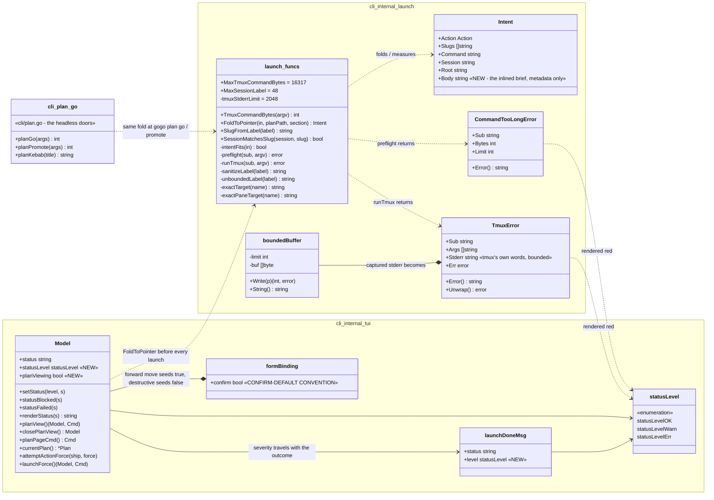
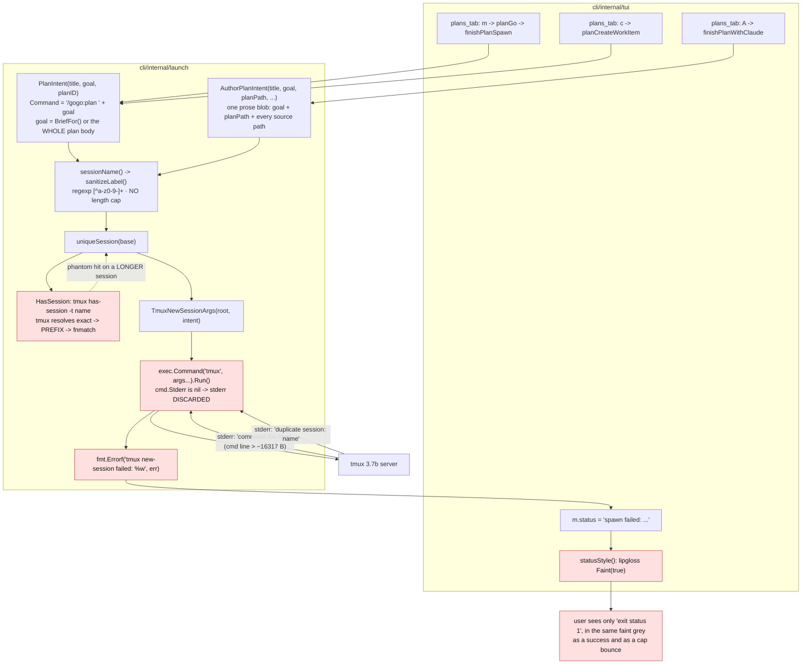
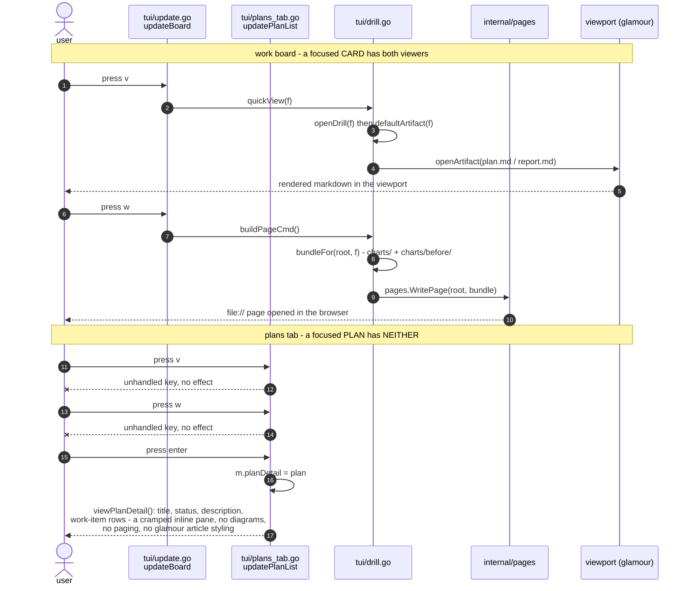
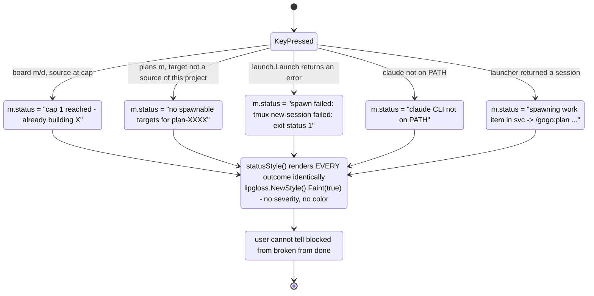

# Report - feature `plans-tab-launch-diagnostics-and-view`

- **feature:** Diagnosable cockpit launches, plans-tab `v`/`w` viewers, and a legible per-source cap
- **status:** awaiting-uat
- **completed:** 2026-07-30
- **branch / commits:** `main`, uncommitted working tree on top of `a377a2f` (0.27.0) - shipping as **0.28.0**

**What shipped, in one paragraph.** A cockpit launch that failed used to say `exit status 1` and
nothing else, in the same faint grey as a success. The cause turned out to be mundane and
completely invisible: **tmux refuses a command line longer than ~16 KB**, the plans tab **inlined
the entire plan brief into that command line**, and `launch.Launch` **threw tmux's stderr away**.
0.28.0 captures that stderr into a typed error, measures the command line **before** tmux sees it,
folds an oversized brief into an on-disk pointer at the file that already holds it, gives the
status line three voices (failed / blocked / ok) instead of one, and - separately - gives plan
cards the `v` (terminal) and `w` (web page) viewers work-item cards have had for releases. The
concurrency cap the user suspected turned out **not** to be the bug; it is now merely legible.

---

## Run status / gaps

**All five phases ran and the release is clean: no open issues in either track.** Plan (1) accepted
with D1-D6 resolved; implement (2) ran **4 rounds**; review (3) reached **APPROVE** after
**2 rounds**; test (4) reached **PASS** after **2 rounds** with `test/result.json` `open_issues: 0`;
report (5) is this document. `review/issues.json` holds **12** findings and `test/issues.json` **1**,
and **none of the 13 is `open` or `new`** - 8 review findings are `verified` (independently
re-derived in a later round), 4 are `fixed`, and the single test finding is `verified`.

Gates re-run at report time, in `cli/`: `gofmt -l .` clean, `go vet ./...` clean,
`go test -race ./...` green across all 13 packages, `gogo --version` -> `0.28.0`.

Two honest gaps, neither affecting the code:

- **`events.jsonl` is incomplete.** It carries plan, the plan-acceptance gate, implement rounds
  1-3 and test round 1, but **no review events at all**, no implement round 4, and no test round 2.
  Telemetry is append-only and best-effort by contract, and `state.md` is the resume file, so this
  is a gap in the audit trail rather than in the work - but a reader reconstructing the run from
  events alone would undercount it. This phase appended only its own two `report` lines
  (single-owner rule); it did not back-fill another phase's events.
- **`state.md` was stale on entry** - it still read `phase: implement` / `status: implementing`
  with `test=1`, written before test round 2 finished. Corrected by this phase to
  `phase: knowledge` / `status: awaiting-uat` / `test=2`. Its resume line also warned that
  `test/result.json` still showed `open_issues: 1`; that is no longer true, round 2 rewrote it to
  **0**.

---

## Summary

Three linked fixes shipped as one release because they share one root cause: **the cockpit did not
tell you why nothing happened.**

1. **Every launch is now self-reporting.** tmux's own stderr reaches the error; an over-budget
   command line is refused before tmux sees it, naming the byte count and the limit; an oversized
   plan brief is folded to a pointer instead of failing; every tmux `-t` target is exact-matched.
2. **Plan cards gained `v` and `w`** over the seams that already existed - `openArtifact` for the
   glamour terminal view, `pages.Bundle` for the self-contained offline page - so no new renderer
   was written.
3. **The cap is legible, not redesigned.** It was already per-source, already counted only
   in-progress work items with a live session, and already could not count plans. What was broken
   next to it: a **dangling plan target** was silently dropped after the user confirmed a spawn,
   and **every outcome rendered in the same faint grey**.

The load-bearing property throughout: **under budget, a launch is byte-for-byte what 0.27.0
produced.** That was re-derived twice against a side-by-side 0.27.0 build - 51/51 launched commands
identical at the end of implement, 24/24 through the real CLI doors at review - so the diagnostics
cannot have changed what a working launch does.

### The real root cause, and three briefing guesses that were wrong

The bug report arrived with a theory. Recording what the theory got wrong is the useful part, since
all three guesses were plausible:

| Claim in the briefing | Verdict | What was actually measured |
|---|---|---|
| The **session name** is too long | **FALSE** | `tmux new-session -s <name>` succeeded at 93, 210, 520, 1010 and **2010** chars. A long name is not a failure - it only eats the command budget below. |
| A **TUI key enum-sync guard test** already exists and will fail if keys drift | **FALSE - no such test existed** | `TestCLICommandEnumerationInSync` guards CLI subcommand **verbs** across four doc sites; it is blind to key bindings, and nothing asserted the plans-tab help strings. The plan therefore **added** that guard (`TestPlansTabKeyHelpInSync`) rather than relying on one. |
| tmux runs the launched command **through a shell** | **FALSE - argv is preserved verbatim** | An argv probe showed spaces, newlines, `$(...)`, backticks, `;` and `*` all arriving intact as one element. The injection-safety claim in the existing comments holds. |

**The actual cause, bisected on this host (tmux 3.7b):** the last accepted command line is
**16 317 bytes**, the first refused is **16 318**, and tmux's stderr says `command too long`. The
user's real spawn - plan `plan-30939c06`, a 20 240-byte plan body inlined whole because the
`## Source briefs` section had no matching `### <source>` subsection - built a command line of
**20 128 bytes**. `launch.Launch` called `exec.Command(...).Run()` with `cmd.Stderr` left nil, so
`command too long` was **discarded** and the user saw `exit status 1`. That is why it went
undiagnosed: the diagnostic existed, in tmux, and was being thrown away one function call from the
status line.

### The prefix-target hazard, found beside it

Not in the briefing, and worse than the reported bug in the shapes it could reach: tmux resolves a
plain `-t` target **exact -> prefix -> fnmatch**. Proven by experiment on this host, not inferred:

- `has-session -t gogo-test-al` answered **true** for session `gogo-test-alpha-beta-gamma`;
- **`kill-session -t gogo-plan-foo` killed `gogo-plan-foobar-long`** - the reaper could reap a
  session it was never asked about;
- `capture-pane -t <prefix>` read the **wrong session's pane** - a log peek showing another
  feature's output;
- and at review, `switch-client -t <prefix>` **resolved to a different session** - i.e. an attach
  could drop the user into someone else's live build.

Every `-t` target in `launch` now carries tmux's exact-match form. Which form depends on what the
target position accepts, and that distinction is the A2 correction below.

---

## Planned vs shipped

**All 11 planned FRs shipped, and the plan has been reconciled to as-built** - see
[plan.md](../plan.md), where every correction is marked inline rather than quietly rewritten.
Five things differ from the accepted text. Two were **plan errors**, one was a **scope call**, and
two were **additions**.

| # | Difference | Class | What changed |
|---|---|---|---|
| **A2** | **FR1.5 as accepted was wrong.** It put `CapturePaneArgs` on the bare session form `-t "=<name>"`. Measured on tmux 3.7b, `capture-pane -t "=gogo-x"` fails outright with `can't find pane: =gogo-x` - shipping FR1.5 as written **would have broken every log peek**. | plan error, corrected | `capture-pane` uses a separate `exactPaneTarget(name)` = `"=" + name + ":"` (a pane target whose *session component* is exact-matched); `has-session` / `kill-session` keep the bare `=`. Verified end-to-end through the real `launch.CapturePane`: `=<name>:` reads its own pane and refuses a prefix, while a plain `-t <prefix>` did read the wrong session's pane. |
| **REV-001** | **FR1.4's dash-boundary cut had no floor**, so a realistic title (`"Refactor NotificationDeliveryOrchestrationPipelineForRealtimeEvents"`) collapsed to `refactor`, and two plans sharing a first word minted the *same* session base - reintroducing the TEST-005 attribution ambiguity through a lossy transform. | plan under-specification, corrected | The boundary is honoured **only past `MaxSessionLabel/2`**; below that the hard 48-byte cut stands. Pinned by fixtures asserting two titles that share only a first word stay distinct and do not cross-attribute. |
| **A3** | **The fold was wired at the two `gogo plan` CLI doors** (`cli/plan.go:451` `planGo`, `cli/plan.go:569` `planPromote`) - **a file the plan's Changes checklist never listed.** | **orchestrator scope call**, recorded as such | Those doors build the *identical* `launch.PlanIntent`, so they blew the identical budget: **20 951 bytes** measured against the 16 317 limit on the user's real plan shape. Shipping without them left the cockpit fixed and the surface `README.md` advertises as its scriptable equivalent still broken - which is D1's **rejected option B** by accident. FR1.3 is phrased as a property of the *launch*, not of a key binding, so this was treated as a gap in the plan's coverage, not a scope boundary. Same two-line seam, plus `planKebab` delegating to `launch.SlugFromLabel` so the CLI and TUI slug hints cannot drift (REV-004). |
| **A4** | **Read-side session back-compat.** FR1.4's cap applies to the **slug side** of `SessionMatchesSlug` too, so every session a pre-0.28.0 gogo minted with a >48-char label would stop matching the moment the user upgraded. | addition (found at review round 02) | `SessionMatchesSlug` matches against **both** transforms - the bounded one 0.28.0 mints with and the pre-0.28.0 `unboundedLabel`. A **read-side widening, not a relaxation of FR1.4**: minting stays bounded, so no new long name is ever created. |
| **A5** | **The confirm-default convention.** Not in the plan at all. Both plans-tab confirm constructors built an unseeded `&formBinding{}`, whose Go zero value means **Cancel**, so the keystroke that launches on the board silently cancelled on the plans tab (pre-existing since 0.25.0). | addition, **the user's call** (*"m -> enter should confirm"*) | `confirm: true` seeded at `startPlanSpawnForm` + `startPlanDoneForm`; `startDeleteForm` / `startKillForm` **deliberately keep `confirm: false`** so Enter stays safe on a destructive action. The asymmetry is now the named **CONFIRM-DEFAULT CONVENTION**, stated canonically at `move.go`'s `startFormOverriding` with pointer comments at the four other sites. |

Nothing was dropped, and the deliberate out-of-scope items all stayed out: the cap default is still
**1**, the cap model is unchanged, there is no `--plan-file` skill param, D4's session recording was
not attempted, and D5's cross-repo over-count is still deferred.

One further correction worth naming because it is the *class* of bug this release is about:
**REV-012** caught that the A2 correction **had never reached the docs**. `docs/cli-contract.md`
and `README.md` still described `capture-pane` with the bare `=<name>` form, and still listed only
three exact-match probes after REV-008 added two more. A correction that lives only in the code is
half a correction.

---

## Implementation

The shape is deliberately conservative: **`launch` stays pure-argv and unit-testable, and the TUI
adds no new seam.** Everything the diagnostics need is a pure function with no tmux dependency, and
both viewers reuse machinery that already took exactly the inputs a plan provides.

### Leg 1 - the launch reports itself

- **`runTmux(sub, args)`** is now the single door for every state-changing tmux call
  (`Launch`, `LaunchPersistent`, `KillSession`). It sets `cmd.Stderr` to a **`boundedBuffer`**
  (2 048 bytes, drops the overflow and **never fails the child's write**, so capturing stderr can
  never break a tmux call that would otherwise have worked) and on failure returns
  **`*TmuxError{Sub, Args, Stderr, Err}`**, whose `Error()` reads
  `tmux new-session failed: exit status 1: command too long` and whose `Unwrap()` still reaches the
  `*exec.ExitError`. `HasSession` stays a bare predicate by design - "no such session" is an
  answer, not a failure.
- **A byte preflight** (`TmuxCommandBytes` + `MaxTmuxCommandBytes = 16317`) refuses an over-budget
  command line **before tmux sees it**, with a typed **`*CommandTooLongError{Sub, Bytes, Limit}`**
  naming both numbers - "shorten the brief" is only actionable when you know by how much.
- **`FoldToPointer(intent, planPath, section)`** is D1=A. `Intent` gained a **`Body`** field
  recording exactly the text the command inlines, so the fold can excise *only* that and leave the
  skill instruction, `--correlation` and the `--skip-*` params intact, substituting
  *"read your brief at `<planPath>`, section `## Source briefs` -> `### <source>`"*. Under budget it
  returns the intent **unchanged**, and an intent with no recorded body or no plan path is returned
  unchanged too, so the preflight surfaces an honest error rather than a silently truncated brief.
  `Intent.Body` and `Intent.Root` are metadata only - review re-proved structurally that neither can
  reach an argv or a serializer.
- **Session names are bounded** at `MaxSessionLabel = 48`, cut on a `-` boundary only past the
  half-way floor. `SlugFromLabel` exports the transform so the TUI's `planSlugHint` and the CLI's
  `planKebab` *call* it instead of re-implementing it.
- **`SessionMatchesSlug`** covers `ActionAuthor` and `ActionResume` (a `gogo-author-...` session was
  previously invisible to the board) and matches both label transforms for upgrade back-compat.
  Each candidate is still compared as a **whole base** - exact, or base plus a purely-numeric
  collision suffix - so adding a candidate can never turn a prefix into a match.
- **Attach failures surface.** `attachOutcome(session, err)` is a **package-level** function, not a
  closure, precisely so both attach sites make the identical decision *and a test can drive the real
  one* (see REV-003 below). The error used to be discarded, so a failed attach reported
  `detached from X`.

### Leg 2 - the plans-tab viewers

`v` calls `planView()`, which sets **`m.planViewing = true` before** handing off to `openArtifact`,
then `updateViewer`'s `esc` checks that flag and calls `closePlanView()` (-> `modeBoard`,
`tab = tabPlans`). This is load-bearing rather than cosmetic: the default `esc` path sets
`mode = modeDrill`, and `viewDrill` dereferenced `m.drill` with no nil guard, so a naive wiring
**panics the cockpit**. `viewDrill` also gained the nil guard as defence in depth (D3).

`w` calls `planPageCmd()` -> `pages.WritePage(projects.Dir(project), planBundleFor(...))`, writing
`~/.gogo/projects/<name>/.gogo/resources/view/<plan-id>.html`. `planBundleFor` passes the plan
markdown and **nothing else**: a plan has no `charts/`, and `pages.BuildHTML` degrades cleanly on an
empty diagram set (verified by running it on a real plan before any code was written). `w` also
works *from inside* an open plan view, where there is no drilled card to build a page from.

### Leg 3 - the cap made legible

- **`resolveTargets`** partitions a plan's `targets:` into spawnable and unknown **before** the
  confirm, and `unknownTargetHint` names the target *and* the project it is missing from plus the
  two ways out. Previously an unresolvable target sailed past every guard, opened a confirm
  promising a spawn, and was silently `continue`d over - zero launches, plan untouched.
- **Severity.** `statusLevel` is recorded beside `m.status` via `setStatus` / `statusBlocked` /
  `statusFailed`, and `renderStatus` paints red / amber / dim. The zero value is OK, so every
  unclassified call site keeps today's dim voice byte-for-byte, and the level is reset at
  `Update`'s `tea.KeyMsg` choke point so a stale severity can never recolour an unrelated message.
  Each severity also carries a **leading glyph**: colour alone is invisible in a colourless
  terminal and flattened by TTY-less `go test`, so the glyph is what makes the distinction both
  universal and **assertable in `View()`** - the project's own 0.16.0 lesson applied.
- **`M` forces past the cap** through the existing confirm, which now quotes the bounce it is
  overriding. The confirm asks the guard what the force overrode instead of enumerating the arms
  that never consult the cap (see REV-007/REV-010).
- **The cap says what it counts** - in the config form, the source detail (`capScopeNote`), the
  bounce text and `gogo --help`: per source, only in-progress work items with a live session,
  plans never counted, `0` = unlimited.

### Changes (as-built)

19 files modified, 4 test files added; **+1045 / -157** against `a377a2f`.

| File | Change | Note |
|---|---|---|
| `cli/internal/launch/launch.go` | modified (+370/-33) | `TmuxError`, `CommandTooLongError`, `boundedBuffer`, `runTmux`, `preflight`, `TmuxCommandBytes`, `MaxTmuxCommandBytes`, `MaxSessionLabel`, `FoldToPointer`, `pointerText`, `intentFits`, `exactTarget`, `exactPaneTarget`, `unboundedLabel`, `SlugFromLabel`, `HasSessionArgs`, `KillSessionArgs`, `Intent.Body`; `Launch`/`LaunchPersistent`/`KillSession`/`AttachArgs`/`CapturePaneArgs`/`sanitizeLabel`/`SessionMatchesSlug` reworked. |
| `cli/internal/launch/tmux_test.go` | **added** (452 lines) | 12 pure unit tests: stderr capture, the bound, byte accounting, all four fold properties, exact-target-on-probes-not-on-create, the bounded label incl. the REV-001 degenerate fixtures, the author/resume actions, the upgrade widening, the preflight. |
| `cli/internal/launch/launch_test.go` | modified (+26/-4) | `TestCapturePaneArgs` re-pinned to `=<name>:`; `TestAttachArgs` re-pinned to `=<name>` and asserts the pane form's colon never leaks into an attach target. |
| `cli/plan.go` | modified (+27/-8) | **A3:** the fold at `planGo` (:451) and `planPromote` (:569) after `SkipParams`, with `intent.Root = src.Path`; `planKebab` delegates to `launch.SlugFromLabel` and its private regex is gone. |
| `cli/plan_fold_test.go` | **added** (155 lines) | Drives the real `cmdPlanStore` through the injected `planLauncher` seam: both doors fold, under budget is byte-for-byte, `planKebab` matches the TUI transform. |
| `cli/internal/tui/plans_tab.go` | modified (+330/-56) | `resolveTargets`, `unknownTargetHint`, `planPath`, `currentPlan`, `planView`, `closePlanView`, `planPageCmd`, `planBundleFor`; `v`/`w` in both key switches; the fold at all three spawn/author sites (:531, :721, :977); `planSlugHint` delegates to `launch.SlugFromLabel`; `confirm: true` seeded at both confirm constructors; both help lines. |
| `cli/internal/tui/plans_view_test.go` | **added** (1101 lines) | 23 tests: both viewers from both origins, the `esc` non-panic regression, the `~/.gogo/`-only write invariant against a temp source dir, the unknown-target refusal, all three fold wirings, the whole severity taxonomy, `M`'s override honesty, the shared attach outcome, the key-help guard. |
| `cli/internal/tui/confirm_default_test.go` | **added** (239 lines) | **A5:** a bare Enter through the real huh lifecycle at all five confirm sites, asserted by **real side effect**; plus a structural test that fails on an unseeded `&formBinding{}`. |
| `cli/internal/tui/update.go` | modified (+83/-26) | `attachOutcome`; the `planViewing` esc and `w` branches in `updateViewer`; the `M` key; `statusLevel` reset per keypress; `finishKill` carries the first killer error's words; refusals reclassified as blocked. |
| `cli/internal/tui/move.go` | modified (+109/-27) | `attemptActionForce` / `launchForce` / `launchActionForce` / `startFormOverriding`; `launchDoneMsg.level`; the cap bounce names its scope and offers `M`; the **CONFIRM-DEFAULT CONVENTION** canonical statement. |
| `cli/internal/tui/model.go` | modified (+51/-13) | `statusLevel` type + `setStatus`/`statusFailed`/`statusBlocked`; `planViewing`; `Model.statusLevel`. |
| `cli/internal/tui/view.go` | modified (+62/-11) | `statusOK`/`statusWarn`/`statusErr` + `renderStatus`; the `viewDrill` nil guard; `M` in the all-keys footer. |
| `cli/internal/tui/styles.go` | modified (+18) | The severity styles and the two marker glyphs. |
| `cli/internal/tui/peek.go` | modified (+12/-12) | `attachFromPeek` uses the shared `attachOutcome`; peek refusals reclassified as blocked. |
| `cli/internal/tui/config_tab.go` | modified (+20/-6) | FR3.4 cap wording in the source form; `capScopeNote` in the source detail; the config status line renders severity. |
| `cli/internal/tui/delete.go`, `drill.go` | modified (+13/-4) | Remaining refusals classified as blocked; the destructive-default pointer comment. |
| `cli/main.go` | modified (+14/-8) | `Version` -> `0.28.0`; `printHelp` gains `v`/`w`/`M`, the status-severity legend and a **concurrency cap** block. |
| `cli/version_test.go` | modified (+4/-4) | Pins `0.28.0` and the release train name. |
| `.claude-plugin/plugin.json` | modified | `version` -> `0.28.0`. |
| `README.md`, `docs/cli-contract.md`, `skills/gogo-cli/SKILL.md` | modified (+61/-8) | The 0.28.0 behaviour, the exact-target forms (incl. `capture-pane`'s pane form after REV-012), the plan `v`/`w` keys, `M`, and the cap's real scope. |

---

## Decisions & rationale

All six forks were resolved **on gogo's recommendation** before any code was written
(see [decisions.md](../decisions.md)).

| Decision | Choice | Reason |
|---|---|---|
| **D1** - what happens when a brief exceeds tmux's limit | **A: fold to an on-disk pointer**, with a hard typed error as the backstop | The brief is *already* a file under `~/.gogo/`, so a pointer loses nothing, needs no contract change, and is a **no-op under budget**. B (hard error) blocks the user on a limit they did not create and cannot fix - the analyst wrote that brief. C (truncate) ships a mutilated spec. D (`--plan-file`) is the cleanest contract but a skill-contract change across five doc sites for the same effect. |
| **D2** - where a plan's `w` page is written | **A: the project home** `~/.gogo/projects/<name>/` | A plan has no repo of its own, and the hard invariant is that the CLI never writes a source repo's `.gogo/`. B was therefore not available. Costs one vendored renderer copy per project - exactly the footprint the NFRs already sanction. |
| **D3** - how the plan viewer returns from `modeViewer` | **A: a `planViewing` flag mirroring `peeking`**, plus the `viewDrill` nil guard anyway | The `peeking` precedent is right there and the change is local. C (let `esc` land on a nil-guarded drill) leaves the user on an empty screen they never asked for - worse UX than the panic it replaces. |
| **D4** - making a plan-spawned session attributable | **B for this release** (align the transforms + complete the action list), A as the immediate follow-up | The CLI **cannot** know the analyst's derived slug at launch time. Recording the session on the plan `Member` is the right answer but widens the blast radius into the `plans` schema mid-release; B is a strict improvement and unblocks the rest. |
| **D5** - the cross-repo same-slug cap over-count | **B: defer**, keeping the documented note | Reproduced, but it needs the *same slug in two different sources* to trigger, none of the user's three projects has that, and the fix would add a per-feature file read to a path that runs on every render. D4's follow-up subsumes it more cheaply. |
| **D6** - one release or three slices | **A: one release** | The legs share seams: Leg 1's typed error is what Leg 3's red status renders, Leg 3's target guard gates Leg 1's launch, and Leg 2 edits the same key switch and help lines Leg 3 touches. Slicing means three passes over `plans_tab.go` and three doc-sync rounds. |
| **A5** (in-flight, the user's call) | plans-tab forward moves confirm on Enter; destructive confirms do **not** | The board's `m` already submitted on Enter, so the plans tab silently cancelling on the same keystroke was a muscle-memory trap. But a destructive action must stay safe on Enter, so the two families deliberately disagree - and the asymmetry is now written down as a convention so nobody "aligns" them later. |

---

## Review outcome

**Verdict: APPROVE after 2 rounds** (round 1: 8 findings, round 2: 4) - see
[review-01.md](../review-01.md), [review-02.md](../review-02.md),
[review/issues.json](../review/issues.json). The reviewer re-derived every claim with their own
harness, fixtures and mutations rather than taking the fix report on trust, and the round-2 report
is explicit that it **did not reuse the developer's tests**.

**This is the most useful section of the report, because review caught three things implementation
had already declared done.**

**1. A correction that quietly reintroduced the bug it was fixing (REV-001, major).** FR1.4's
dash-boundary cut had no floor, so `"Refactor NotificationDeliveryOrchestrationPipelineFor..."`
collapsed to `refactor` - and two plans sharing a first word then minted the *same* session base.
That is exactly the TEST-005 attribution ambiguity the codebase already had a rule against, arriving
through a lossy transform instead of a substring match. The shipped test passed on every degenerate
case, because it asserted "the last segment is a whole word of the original" - true for `refactor`.

**2. A fix that stopped at the key binding (REV-002, major).** `FoldToPointer` was wired into the
TUI only, so `gogo plan go` still built **20 951 bytes** against the 16 317 limit on the user's real
plan shape. The new preflight *did* improve the message there - but a good error message on a
launch that cannot be made to work is D1's rejected option B, and `README.md` advertises
`gogo plan go` as the scriptable equivalent of the cockpit move. The plan's checklist never listed
`cli/plan.go`, so this was a coverage gap rather than a deviation; the orchestrator's scope call was
to fix it here (A3).

**3. Three shipped wirings whose tests did not bite at all (REV-005, minor - and the most
instructive).** Mutation-verified against the shipped tree, each revert applied alone:

| Revert | Result before the fix |
|---|---|
| `planSlugHint` back to the old `[^a-z0-9]+` regex (undoing half of FR1.7) | **every test green** |
| delete the fold at the `c` create-work-item site | **every test green** |
| delete the fold at the `A` plan-with-claude site | **every test green** |

All three are named explicitly in the plan's Changes checklist, and all three had shipped. The same
shape recurred twice more: **REV-003** (the FR1.6 attach test asserted a *test-local copy* of the
callback, so deleting the production error branch left the suite green - the test's own comment
claimed coverage it did not provide) and **REV-011** (three of four severity classifications were
unguarded because a fixture reused its data home, so the test's "other arm" block silently
re-tested the arm it had already covered).

### The methodology that fixed it - a lesson, not an anecdote

Two rules came out of this and are now recorded in
[`.gogo/knowledge/test-strategy.md`](../../../knowledge/test-strategy.md):

- **Compile-check every mutation before running the suite.** The reviewer's own first pass
  mis-scored a mutation because it was a syntax error in the mutation itself, not a finding about
  the code. The harness now runs `go build ./...` first and reports `BUILD-FAIL` instead of a test
  result. **A mutation count produced without compile-checking is not trustworthy**, in either
  direction.
- **A mutation that compiles and is semantically valid can still fail to reach the assertion,
  because something else compensates for it.** REV-011's fixture put the cursor back on the wrong
  plan; TEST-001's two round-2 fixtures refused because the member was **not found** (missing
  `Correlations`) rather than **not shipped**, so the property the test was named for was never
  exercised and a mutation to the shipped member's correlation was absorbed. The fix is not more
  mutations - it is making the assertion name the **exact reason** (the `1 of 2` tally, the specific
  refusal string) so a fixture that stops resolving fails loudly.

Under that method the final sweep was **24 mutations, all compile-checked first, all failing** - 6
for the A5 work plus an 18-strong regression re-sweep of every earlier fix.

**Two smaller review findings worth keeping:** REV-008 moved `AttachArgs` to the exact form too,
but only **after** live verification of both branches (the A2 discipline: measure before changing) -
and a bare prefix `switch-client` did resolve to a different session, the hazard reproduced.
REV-010 replaced an arm-enumerating condition for `M`'s override note with one that asks the guard
what it overrode: correct for every arm by construction, **shorter** than the clause it replaced,
and nothing left to keep in sync.

---

## Test outcome

**Verdict: PASS after 2 rounds, `open_issues: 0`** - see [test-01.md](../test-01.md),
[test-02.md](../test-02.md), [test/issues.json](../test/issues.json). Levels exercised: **CLI**
(both headless doors, real invocations), **live TUI** (real keystrokes into real tmux sessions
against isolated fixtures), and **unit/`-race`**. No browser level - the plugin has no web surface;
Playwright is for target projects.

Round 1 drove six things to completion, none skipped:

- **The original bug, end to end.** A 20 343-byte fixture plan with deliberately no matching
  `### <source>` subsection, spawned with `m` from the plans tab. The launched session's pane read
  the exact `pointerText()` shape, naming the plan's real on-disk path **and** the `### srca`
  section. Not `exit status 1`.
- **Both CLI doors** at over-budget size: `gogo plan go` and `gogo plan promote` both folded.
- **The D1 backstop, for real.** A project with **320 sources** makes the *non-foldable* source
  list alone exceed the budget. The live UI showed the typed error verbatim - *"plan-with-claude
  failed: tmux new-session refused before launch: the command line is 19747 bytes, tmux accepts at
  most 16317 - shorten the brief (it lives on disk; the launch already points at it)"* - and
  `tmux list-sessions` confirmed **no session was created**: the preflight refused before tmux was
  invoked at all.
- **`v` / `w` from both origins.** `esc` returned correctly from the list *and* from the detail,
  pane alive, no panic (the FR2.2 regression). `w`'s page landed under the isolated data home; a
  source of the same project carrying no `.gogo/` of its own **stayed completely empty**, verified
  before and after.
- **Cap legibility** on the work board with real keystrokes, including the `M` force path.
- **The upgrade transition (A4/REV-009)**, proven twice: `SessionMatchesSlug` matched both of the
  host's real running session names, and a scratch board carrying a fake **old-style** long session
  rendered the live dot marker, counted toward the cap by name, and attached cleanly with `a`. A
  read-only code pass confirmed all three surfaces bottom out in the *same* predicate.

Round 2 re-verified the A5 fix against the real binary rather than the developer's new test:
a bare Enter on a fresh plans-tab spawn confirm produced a **real tmux session, a plan flipped
ready -> active and a recorded member**; a bare Enter on a project-UAT accept confirm flipped a plan
to `done` and appended a `## Project UAT round`. The **destructive half was the highest-priority
check**: a bare Enter on `x` (delete) and on `K` (kill) both still reported `cancelled`, leaving the
feature on disk and the session alive. The safety convention did not move.

**Test hygiene.** Every round ran against isolated fixtures (`GOGO_DATA_HOME` under `/tmp`, a
stubbed `claude` recording its argv), never the user's real `~/.gogo/`. **The user's two live tmux
sessions were confirmed present and untouched before and after every round** - never attached to,
killed, resized or sent keys - and every scratch session created along the way was killed by
**exact** name. Both were re-confirmed present at report time.

The single test finding, **TEST-001**, was the confirm default (A5). It was **pre-existing since
0.25.0**, not introduced here, and the tester found it precisely because they drove real keystrokes
rather than reading the code - three existing unit tests had been quietly working around it by
hand-overriding `m.binding = &formBinding{confirm: true}`.

---

## Diagrams

The as-built set is chosen by what the diff introduced: a **flow** (the launch path), a
**sequence** (the new viewer interaction), an **activity** (the new outcome taxonomy) and a
**class** view (the new types). Sources are `report/*.mmd` with prebuilt models in
`report/layouts.json`; `/gogo:view` renders them interactively. **No use-case diagram** - the new
capabilities (`v`, `w`, `M`) already appear as real call paths in the sequence and flow, so an
actor-oval graph would restate them without adding signal.

- [`flow.mmd`](./flow.mmd) - the shipped launch path: `Intent.Body` as the fold target, the byte
  preflight and typed `CommandTooLongError` inside `Launch`, `runTmux`'s bounded stderr capture into
  `TmuxError`, and the exact-match probe forms.
- [`sequence.mmd`](./sequence.mmd) - `v` and `w` over the existing `openArtifact` + `pages` seams,
  including the `esc` return path that must not land on `modeDrill`.
- [`activity.mmd`](./activity.mmd) - the outcome taxonomy: blocked (amber) vs failed (red) vs
  launched (dim), and where the marker glyph makes it assertable.
- [`class.mmd`](./class.mmd) - the new types across `launch`, `tui` and `cli/plan.go`.

### As-built flow - the launch path

```mermaid
flowchart TD
  subgraph tui["cli/internal/tui"]
    K1["plans_tab: A -> finishPlanWithClaude"]
    K2["plans_tab: m -> planGo -> finishPlanSpawn"]
    K3["plans_tab: c -> planCreateWorkItem"]
    RT["resolveTargets(plan): split into<br/>spawnable vs UNKNOWN source names"]
    FOLD["launch.FoldToPointer(intent, planPath, section)<br/>called at the 3 brief-inlining sites<br/>(the TUI is what knows the plan path)"]
    STA["m.statusFailed / statusBlocked / setStatus(OK)<br/>records m.statusLevel beside m.status"]
    REN["m.renderStatus(): statusErr / statusWarn / statusOK<br/>red + '&#10007;' &middot; amber + '&#9888;' &middot; dim"]
  end

  subgraph launch["cli/internal/launch"]
    PI["PlanIntent / AuthorPlanIntent<br/>now also record Intent.Body<br/>(the inlined brief = the fold target)"]
    FIT{"intentFits(in):<br/>TmuxCommandBytes(TmuxNewSessionArgs(Root, in))<br/>&lt;= MaxTmuxCommandBytes (16317) ?"}
    PTR["fold: Command = replace(Body -&gt; pointer), Body = ''<br/>'read your brief at planPath, section ## Source briefs -&gt; ### source'<br/>params (--correlation / --skip-*) survive"]
    SN["sanitizeLabel(): [^a-z0-9-]+ then MaxSessionLabel (48) cap<br/>cut on a '-' boundary, no trailing dash<br/>exported as SlugFromLabel (one transform, no drift)"]
    US["uniqueSession(base)"]
    HS["HasSessionArgs: has-session -t '=' + name<br/>KillSessionArgs: kill-session -t '=' + name<br/>CapturePaneArgs: capture-pane -t '=' + name + ':'<br/>(a PANE target needs the ':' - a bare '=name' is rejected)"]
    TA["TmuxNewSessionArgs(root, intent)<br/>-s gets the BARE name (never '=')"]
    PRE{"preflight(sub, argv):<br/>still over budget ?"}
    CTL["*CommandTooLongError{Sub, Bytes, Limit}<br/>refused BEFORE tmux sees it, naming both numbers"]
    RUN["runTmux(sub, argv): cmd.Stderr = boundedBuffer(2048)"]
    TE["*TmuxError{Sub, Args, Stderr, Err}<br/>Error() = 'tmux new-session failed: exit status 1: command too long'<br/>Unwrap() -&gt; *exec.ExitError"]
  end

  TMUX["tmux server"]

  K1 --> FOLD
  K2 --> RT
  K3 --> RT
  RT -->|"unknown target"| STA
  RT -->|"spawnable"| FOLD
  FOLD --> PI
  PI --> FIT
  FIT -->|no| PTR
  PTR --> SN
  FIT -->|yes| SN
  SN --> US
  US --> HS
  HS --> TA
  TA --> PRE
  PRE -->|yes| CTL
  PRE -->|no| RUN
  RUN --> TMUX
  TMUX -->|"stderr text"| RUN
  RUN -->|error| TE
  RUN -->|ok| OK["Result{Mode: tmux, Session}"]
  CTL --> STA
  TE --> STA
  OK --> STA
  STA --> REN
  REN --> SEEN["user always sees WHY:<br/>red = failed &middot; amber = blocked/gate &middot; dim = ok"]

  classDef new fill:#e0f0e0,stroke:#40a040,color:#111
  class RT,FOLD,FIT,PTR,PRE,CTL,RUN,TE,STA,REN,SEEN,HS new
```



### As-built sequence - the plans-tab viewers

```mermaid
sequenceDiagram
  autonumber
  actor U as user
  participant P as tui/plans_tab.go<br/>updatePlanList / updatePlanDetail
  participant V as tui/update.go<br/>updateViewer
  participant PL as internal/plans
  participant PR as internal/projects
  participant D as tui/drill.go<br/>openArtifact
  participant PG as internal/pages
  participant BR as browser

  Note over U,BR: v - terminal view of the plan markdown (as built)
  U->>P: press v on a kanban card OR in an open plan detail
  P->>P: currentPlan - the open detail, else the focused kanban card
  P->>PL: plans.Path(project, plan.ID)
  PL-->>P: ~/.gogo/projects/&lt;name&gt;/.gogo/plans/&lt;id&gt;.md
  alt file missing
    P-->>U: statusBlocked no plan file at path - amber, no viewer
  else file present
    P->>P: m.planViewing = true, BEFORE openArtifact - the return-mode flag
    P->>D: openArtifact(Artifact{Kind: KindMarkdown, Path: ...})
    D->>D: renderArtifactCmd -> glamour, article mdstyle, width-keyed cache
    D-->>U: modeViewer - paging, g/G, spinner, no drill involved
  end
  U->>V: press esc
  V->>V: not peeking, but planViewing IS set
  V->>P: closePlanView - planViewing false, mode modeBoard, tab tabPlans
  Note right of V: it must NOT fall through to modeDrill -<br/>viewDrill dereferences m.drill, which is nil here.<br/>Verified: removing this branch panics the cockpit.

  Note over U,BR: w - self-contained interactive web page
  U->>P: press w on the plans tab, or from the open plan view
  P->>PL: plans.Path(project, plan.ID)
  P->>PR: projects.Dir(project)
  PR-->>P: ~/.gogo/projects/&lt;name&gt;/
  P->>PG: pages.WritePage(projectDir, planBundleFor(project, plan))<br/>MarkdownPath = planPath, DiagramDir / BeforeDir / ManifestPath EMPTY
  PG->>PG: renderSummary via goldmark, buildFigures yields nothing,<br/>ReadManifest of an empty path is nil-safe, readLayouts yields an empty map
  PG-->>P: ~/.gogo/projects/&lt;name&gt;/.gogo/resources/view/&lt;id&gt;.html
  P->>BR: openBrowser(page)
  BR-->>U: offline article page
  Note over P,PG: measured live - the page and the vendored renderer land ONLY<br/>under ~/.gogo/projects/&lt;name&gt;/ and the source repo is untouched
```

### As-built activity - the outcome taxonomy

```mermaid
stateDiagram-v2
  direction TB
  [*] --> KeyPressed

  KeyPressed: Update sees a tea.KeyMsg<br/>m.statusLevel reset to OK first - no stale severity

  KeyPressed --> Blocked: a guard refused
  KeyPressed --> Failed: the launch returned an error
  KeyPressed --> Launched: the launcher returned a session

  state Blocked {
    direction TB
    Cap: cap N reached in &lt;source&gt; - already building X<br/>counts in-progress work items with a live session, per source<br/>plans never count - press M to force, ship one, or force from the CLI
    Dangling: plan targets &lt;name&gt;, which is not a source of<br/>project &lt;p&gt; - add it in the config tab, or retarget the plan<br/>refused BEFORE the confirm - no promise it cannot honour
    NoClaude: claude CLI not on PATH
    NoSession: no running session, no live session to kill, nothing to peek
  }

  state Failed {
    direction TB
    TooLong: tmux new-session refused before launch -<br/>the command line is N bytes, tmux accepts at most 16317<br/>only after FoldToPointer could not shrink it
    TmuxSaid: tmux &lt;sub&gt; failed - &lt;exit status&gt; - &lt;real tmux stderr&gt;<br/>e.g. command too long, duplicate session &lt;name&gt;
    AttachFail: attach to &lt;session&gt; failed - &lt;err&gt;<br/>was always detached from &lt;session&gt;
    SpawnFail: spawn failed, plan-with-claude failed, page build failed
  }

  Blocked --> Amber
  Failed --> Red
  Launched --> Dim

  Amber: statusLevelWarn to statusWarn<br/>amber plus a leading warning glyph
  Red: statusLevelErr to statusErr<br/>red plus a leading cross, always carrying the real error words
  Dim: statusLevelOK to statusOK, which IS statusStyle<br/>the existing dim success voice, byte-for-byte

  Amber --> Actionable
  Red --> Actionable
  Dim --> Actionable
  Actionable: every outcome names WHAT happened and WHAT to do next<br/>and stays distinguishable on a COLOURLESS terminal via the glyph,<br/>which is what makes it render-assertable in the test suite
  Actionable --> [*]
```

### As-built class - the new types



---

## Before / after comparison

The plan-time as-is baseline is copied into this bundle as [`report/before/`](./before/) (three
kinds, with its own manifest and prebuilt layouts), so the archive is self-contained and compare
mode works with no dependency on `charts/`. All three before kinds have an after counterpart; the
**class** diagram is **added** (after only) because the plan drew no type-structure baseline - there
were no new types to compare against. Nothing was **removed**.

### flow - the launch path

**What changed.** The before flow ends at a dead end: `exec.Command(...).Run()` with `cmd.Stderr`
nil, so tmux's `command too long` is **discarded** and `fmt.Errorf` wraps only the exit code, which
`statusStyle` then renders in the same faint grey as a success. The after flow adds four things on
the same spine: a **fold** decision before the name is built, a **preflight** after the argv is
assembled (so the *whole* command line, session name included, is what gets measured), **stderr
capture** into a typed error, and a **severity** step before rendering. Also note what stopped being
a hazard: the before diagram shows `HasSession` taking a phantom prefix hit on a longer session (the
dotted feedback edge into `uniqueSession`); the after diagram has every `-t` on the exact form, with
`capture-pane` on the distinct pane form.

Before:



After:


### sequence - the viewers

**What changed.** The before sequence is a parity gap drawn literally: the work board's `v` and `w`
resolve through `quickView` / `buildPageCmd`, while the plans tab's `v` and `w` are **unhandled
keys** and the only way to read a plan is the cramped inline detail pane. The after sequence has
both keys resolving through the *same* seams the board uses, plus two things the before could not
show because they did not exist: the `alt` branch for a missing plan file (an amber refusal, not a
crash) and the `esc` return through `closePlanView`, annotated with why it must not fall through to
`modeDrill`.

Before:



After:

```mermaid
sequenceDiagram
  autonumber
  actor U as user
  participant P as tui/plans_tab.go<br/>updatePlanList / updatePlanDetail
  participant V as tui/update.go<br/>updateViewer
  participant PL as internal/plans
  participant PR as internal/projects
  participant D as tui/drill.go<br/>openArtifact
  participant PG as internal/pages
  participant BR as browser

  Note over U,BR: v - terminal view of the plan markdown (as built)
  U->>P: press v on a kanban card OR in an open plan detail
  P->>P: currentPlan - the open detail, else the focused kanban card
  P->>PL: plans.Path(project, plan.ID)
  PL-->>P: ~/.gogo/projects/&lt;name&gt;/.gogo/plans/&lt;id&gt;.md
  alt file missing
    P-->>U: statusBlocked no plan file at path - amber, no viewer
  else file present
    P->>P: m.planViewing = true, BEFORE openArtifact - the return-mode flag
    P->>D: openArtifact(Artifact{Kind: KindMarkdown, Path: ...})
    D->>D: renderArtifactCmd -> glamour, article mdstyle, width-keyed cache
    D-->>U: modeViewer - paging, g/G, spinner, no drill involved
  end
  U->>V: press esc
  V->>V: not peeking, but planViewing IS set
  V->>P: closePlanView - planViewing false, mode modeBoard, tab tabPlans
  Note right of V: it must NOT fall through to modeDrill -<br/>viewDrill dereferences m.drill, which is nil here.<br/>Verified: removing this branch panics the cockpit.

  Note over U,BR: w - self-contained interactive web page
  U->>P: press w on the plans tab, or from the open plan view
  P->>PL: plans.Path(project, plan.ID)
  P->>PR: projects.Dir(project)
  PR-->>P: ~/.gogo/projects/&lt;name&gt;/
  P->>PG: pages.WritePage(projectDir, planBundleFor(project, plan))<br/>MarkdownPath = planPath, DiagramDir / BeforeDir / ManifestPath EMPTY
  PG->>PG: renderSummary via goldmark, buildFigures yields nothing,<br/>ReadManifest of an empty path is nil-safe, readLayouts yields an empty map
  PG-->>P: ~/.gogo/projects/&lt;name&gt;/.gogo/resources/view/&lt;id&gt;.html
  P->>BR: openBrowser(page)
  BR-->>U: offline article page
  Note over P,PG: measured live - the page and the vendored renderer land ONLY<br/>under ~/.gogo/projects/&lt;name&gt;/ and the source repo is untouched
```

### activity - the outcome taxonomy

**What changed.** The before state machine converges: five distinct outcomes (cap bounce, dangling
target, tmux failure, no claude, success) all funnel into one `FaintGrey` state and end at
`Indistinguishable`. The after machine keeps them apart the whole way: three severity classes, each
with a colour **and** a glyph, and a terminal state that is `Actionable` rather than
`Indistinguishable`. Two other differences matter. The before `DanglingTarget` message is
`"no spawnable targets for plan-XXXX"`, emitted *after* the user confirmed a spawn; the after
version names the target and the project and is refused **before** the confirm. And the after
machine begins by resetting `m.statusLevel` at the keypress, which is what makes a stale severity
structurally impossible.

Before:



After:

```mermaid
stateDiagram-v2
  direction TB
  [*] --> KeyPressed

  KeyPressed: Update sees a tea.KeyMsg<br/>m.statusLevel reset to OK first - no stale severity

  KeyPressed --> Blocked: a guard refused
  KeyPressed --> Failed: the launch returned an error
  KeyPressed --> Launched: the launcher returned a session

  state Blocked {
    direction TB
    Cap: cap N reached in &lt;source&gt; - already building X<br/>counts in-progress work items with a live session, per source<br/>plans never count - press M to force, ship one, or force from the CLI
    Dangling: plan targets &lt;name&gt;, which is not a source of<br/>project &lt;p&gt; - add it in the config tab, or retarget the plan<br/>refused BEFORE the confirm - no promise it cannot honour
    NoClaude: claude CLI not on PATH
    NoSession: no running session, no live session to kill, nothing to peek
  }

  state Failed {
    direction TB
    TooLong: tmux new-session refused before launch -<br/>the command line is N bytes, tmux accepts at most 16317<br/>only after FoldToPointer could not shrink it
    TmuxSaid: tmux &lt;sub&gt; failed - &lt;exit status&gt; - &lt;real tmux stderr&gt;<br/>e.g. command too long, duplicate session &lt;name&gt;
    AttachFail: attach to &lt;session&gt; failed - &lt;err&gt;<br/>was always detached from &lt;session&gt;
    SpawnFail: spawn failed, plan-with-claude failed, page build failed
  }

  Blocked --> Amber
  Failed --> Red
  Launched --> Dim

  Amber: statusLevelWarn to statusWarn<br/>amber plus a leading warning glyph
  Red: statusLevelErr to statusErr<br/>red plus a leading cross, always carrying the real error words
  Dim: statusLevelOK to statusOK, which IS statusStyle<br/>the existing dim success voice, byte-for-byte

  Amber --> Actionable
  Red --> Actionable
  Dim --> Actionable
  Actionable: every outcome names WHAT happened and WHAT to do next<br/>and stays distinguishable on a COLOURLESS terminal via the glyph,<br/>which is what makes it render-assertable in the test suite
  Actionable --> [*]
```

### class - added (after only)

No before counterpart: the plan drew no type-structure baseline because the change *introduces* the
types (`TmuxError`, `CommandTooLongError`, `boundedBuffer`, `statusLevel`) and only extends two
existing ones (`Intent.Body`, `launchDoneMsg.level`). The after diagram is
[`class.mmd`](./class.mmd), shown under **Diagrams** above.

---

## Knowledge updates

Five gogo-owned knowledge files were updated. **No proxied upstream file was touched** - the one
`Mode: proxy` file, `project-knowledge.md`, was edited **only** inside its `## gogo overrides`
section, and no `## Custom` section was modified anywhere.

| File | Update |
|---|---|
| [`project-knowledge.md`](../../../knowledge/project-knowledge.md) | A **0.28.0** entry in `## gogo overrides`: the tmux byte limit as the root cause, fold-to-pointer, the exact-target forms (including `capture-pane`'s pane form), the bounded label plus the read-side back-compat widening, the plans-tab `v`/`w`, `M`, the status-line severity, and what the cap already did. |
| [`tech-stack.md`](../../../knowledge/tech-stack.md) | The tmux soft-dep entry now records the two **measured platform constraints** anyone touching the launch path needs: the ~16 317-byte command-line limit, and that a `-t` target resolves exact -> prefix -> fnmatch (with the two exact forms and which position takes which). Also corrected a stale fact the code disproved: the suite is **449** test functions across 13 packages, not "~120 as of 0.11.0". |
| [`non-functional-requirements.md`](../../../knowledge/non-functional-requirements.md) | A new **Diagnosability** bar: never discard a child process's stderr on a user-visible path; a failure must carry the underlying tool's own words; a limit must name the number; and a severity distinction must survive a colourless terminal, so it stays assertable. |
| [`code-review-standards.md`](../../../knowledge/code-review-standards.md) | Two new checks - **#10** discarded stderr / untyped external-tool errors and non-exact tmux targets; **#11** a test that asserts a *copy* of the production decision, or passes for a weaker reason than it claims (with the three concrete shapes seen here). |
| [`test-strategy.md`](../../../knowledge/test-strategy.md) | A new section on **mutation testing as the coverage check**: compile-check first, treat a compensated mutation as blind, and make the assertion name the exact reason. |

**Consider upstreaming (your call, not gogo's):** the tmux command-line limit and the exact-target
rule now live in `.gogo/knowledge/tech-stack.md`, but `README.md` and `docs/cli-contract.md` describe
them only inside the 0.28.0 release note. If they are meant to read as standing platform
constraints rather than release trivia, they belong in the CLI contract's own tmux section too.

---

## Follow-ups & known limitations

Carried forward deliberately, each with its reason:

- **D4 - a plan-spawned work item's session still may not attribute.** The launch names the session
  after the **plan title** while the analyst derives its own feature slug, and the CLI cannot know
  that slug at launch time. FR1.7 (one shared transform, the full action list) is a strict
  improvement but not a fix: whenever the analyst's slug differs from the title hint - the common
  case - the item shows no live dot, `a` says "no running session", `l` falls back to the log, and
  the cap under-counts it. **The immediate follow-up is D4 option A**: record the launched session
  name on the plan `Member` (`plans.Member{Source, SlugHint, Session}`) and consult it when
  attributing.
- **D5 - the cross-repo same-slug cap over-count is real and still present.** `ActiveWorkSlugs`
  tests liveness against the **global** tmux session list, so an identically-named slug in *another*
  source over-counts and **wrongly blocks** a launch. Reproduced during planning
  (`launching 'other' in /repos/b -> active=[shared-slug] blocked=true` while the session belonged
  to `/repos/a`). Deferred because it needs the same slug in two different sources to trigger, none
  of the user's three projects has that, and the fix would add a per-feature registry read to a path
  that runs on every render. D4's follow-up would make attribution root-aware and subsume it.
- **Pre-0.28.0 sessions depend on the read-side widening.** A session an older gogo minted with a
  >48-char label attributes only because `SessionMatchesSlug` still accepts the **unbounded** label
  as a second candidate base. That widening is load-bearing for the upgrade, not decorative: without
  it the cap would under-count a running build and let a second one clobber the same working tree.
  It is safe to remove **only** once no pre-0.28.0 session can still be running - and removing it
  early is exactly the kind of tidy-up that looks harmless.
- **`MaxTmuxCommandBytes` is pinned ~46 bytes conservative.** An independent bisection at implement
  time put the real boundary at 16 363 accepted / 16 364 refused under this package's byte
  accounting; the constant stays at the plan's measured **16 317**. Conservative is the safe
  direction (over budget means fold, never a lost brief), but the number is host- and
  version-specific to tmux 3.7b, not a protocol constant.
- **The `A` (plan-with-claude) source list is not foldable.** With enough sources the
  `name -> path; ...` list alone exceeds the budget, so the typed `CommandTooLongError` is the real
  outcome there (proven live at 320 sources). If that ever becomes a real configuration, the source
  list needs a pointer of its own.
- **Doc drift in gogo's own phase skills, noticed while writing this bundle.**
  `skills/gogo-knowledge/SKILL.md` and `skills/gogo-mermaid/SKILL.md` still instruct phase (5) to
  write and link a `report/diagrams.html`, but 0.27.0 removed the per-feature viewer in favour of
  `layouts.json` + `/gogo:view`. Recent report bundles (this one included) correctly have no
  `diagrams.html`, so the skills are stale, not the practice. Phase (5) may only write under
  `.gogo/`, so this is recorded here rather than fixed - a small, self-contained follow-up.
- **`project-knowledge.md` is now OVER the knowledge line budget.** Adding the 0.28.0 entry took it
  to **415 lines** (the `## gogo overrides` release log alone is 343), past the NFR's
  `>400 = OVER` bar; it was already at the top of WARN before this release. The entry was trimmed
  and its tmux measurements moved to `tech-stack.md` rather than duplicated, but the log is
  accretive by design, so the real fix is the project's own tool: **run `/gogo:skills`** and extract
  the older release history into an on-demand skill, keeping the always-read body current-releases
  only. Flagged rather than solved here - trimming someone's release history is not a report-phase
  decision.
- **The telemetry gap** described under *Run status / gaps*: review and test round 2 never appended
  their `events.jsonl` lines.

---

## Summary (TL;DR)

- **What shipped (0.28.0).** Cockpit launches now say *why* they failed or were blocked: tmux's own
  stderr is captured into a typed `TmuxError`, an over-budget command line is refused before tmux
  sees it (naming the byte count and the 16 317-byte limit), an oversized plan brief is **folded to
  a pointer** at the file that already holds it, every tmux `-t` target is exact-matched, the status
  line has three voices with glyphs, plan cards gained `v` / `w`, and the cap gained `M` plus an
  honest description of what it counts.
- **The root cause was invisible, not exotic.** tmux refuses a command line over ~16 KB; the plans
  tab inlined the whole plan brief into it (the user's real spawn: **20 128 bytes**); and `.Run()`
  discarded the `command too long` that would have explained it. Three plausible briefing theories -
  long session names, an existing key enum-sync test, tmux shelling out - were all measured **false**.
- **Review verdict: APPROVE** after 2 rounds, and it earned its keep: it caught a corrected
  transform that reintroduced the ambiguity it was fixing, a fix wired only behind the key binding
  (`gogo plan go` still built 20 951 bytes), and **three shipped wirings whose tests did not bite at
  all** - which produced the mutation-testing rules now in `test-strategy.md`.
- **Test verdict: PASS** after 2 rounds, `open_issues: 0` - driven with real keystrokes and real
  tmux sessions against isolated fixtures, including the destructive half of the confirm convention.
  **The user's two live tmux sessions were verified present and untouched throughout.**
- **Follow-ups above** - chiefly **D4** (record the session on the plan member, which also subsumes
  **D5**'s reproduced cross-repo cap over-count), and the note that pre-0.28.0 sessions rely on the
  read-side back-compat widening.
