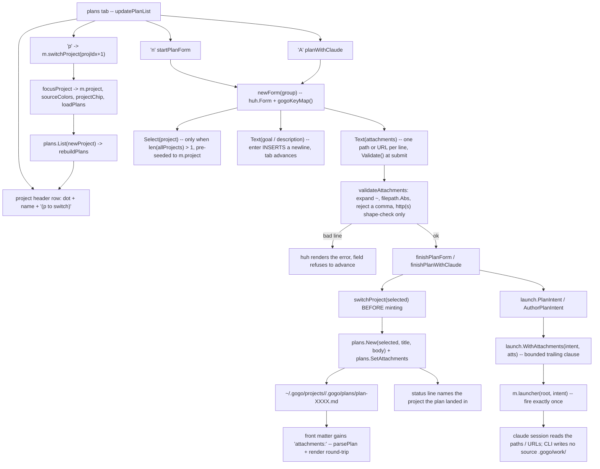
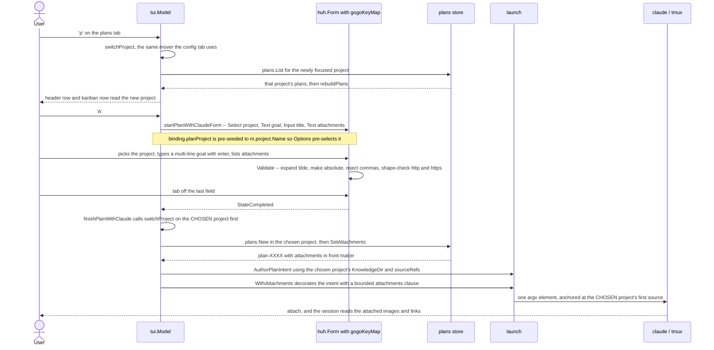
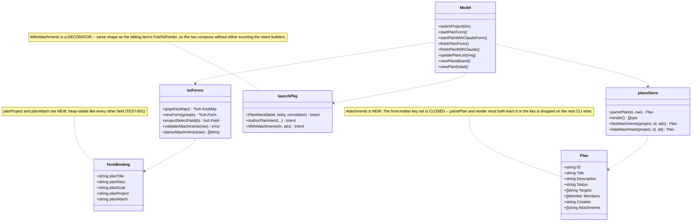

# Plan — project-first plan authoring

Status: awaiting acceptance

**In one paragraph.** The gogo cockpit's plans tab mints a plan into whichever project
happens to sort first alphabetically, never asks which project you meant, never shows you
which one you are looking at, and gives you no way to reach another project's plans without
leaving the tab. On top of that its goal box is a textarea where `enter` submits instead of
inserting a newline, and a plan has no concept of an attachment. This work item makes plan
authoring **project-first and body-first**: an explicit project choice when the answer is
ambiguous, a `p` switcher and a visible project on the tab itself, `enter` that actually
inserts a newline, and **first-class attachments** (image paths / URLs) recorded in the plan
file and named to the launched Claude session.

---

## Goal

Make minting and finding a project plan honest:

1. **You always know — and choose — which project a plan lands in.**
2. **You can see and switch the plans tab's project without leaving the tab.**
3. **The goal box behaves like a text box** — real newlines, paragraphs, lists, links — and a
   plan can carry **attachments** (local image paths or URLs) that the launched analyst reads.

**Acceptance signal.** From a cold `gogo global` with three registered projects: pressing `n`
or `A` on the plans tab presents a project choice defaulted to the focused project, and the
plan lands in the chosen one (the status line names it); pressing `p` on the plans tab moves
to the next project's plans without a detour through the board, and the tab header always
names the project on screen; a goal typed across several lines with `enter` survives into the
plan's body; a listed image path or URL is stored in the plan's front matter, survives a
`gogo plan ready` round-trip, is shown in the plan detail, and is named in the launched
session's prompt. `gofmt -l . && go vet ./... && go test -race ./...` stay clean in `cli/`.

---

## Context — what the code actually does today

Everything below was read in the tree at `a377a2f` (0.27.0) and, for the huh questions,
**executed** against the vendored `huh v1.0.0` / `bubbletea v1.3.10` in an isolated probe
module. Where the incoming brief or the prior analysis was imprecise, the correction is
marked.

### The wrong-project bug is real, and it is a two-line story

| # | Fact | Evidence |
|---|---|---|
| 1 | `NewCockpit` makes `projs[0]` the shared focus for the plans + config tabs. | `cli/internal/tui/model.go:331-343` (`focus = &projs[0]`) |
| 2 | `projects.List()` is **name-sorted**, so `projs[0]` is alphabetical, not meaningful. | `cli/internal/projects/projects.go:338` |
| 3 | `n` mints with `plans.New(m.project.Name, …)` — no project field on the form. | `plans_tab.go:587-602` (`startPlanForm`), `607-635` (`finishPlanForm`) |
| 4 | `A` does the same, and *also* derives its knowledge dir, source refs and session anchor from `m.project`. | `plans_tab.go:677-692`, `706-770` (`finishPlanWithClaude`) |

With `dotai`, `gogo`, `very-nice-mermaid` registered, the focus is **always `dotai`** — which is
exactly how `plan-1948afcd` (a plan whose every change lives in this repo) was minted into the
DotacjeAI project and had to be moved by hand.

**The sharpest evidence is gogo's own CLI.** `resolveProjectName` (`cli/source.go:147-166`)
already refuses to guess: with several projects it exits with *"several projects exist (…) -
pass `--project <name>`"*. **The scriptable surface is explicit; the interactive one silently
picks the first.** That inconsistency — not a missing feature — is what this fixes.

### A plan in a non-focused project is invisible *and* unreachable from the tab

- `loadPlans()` reads **only** `plans.List(m.project.Name)` — `model.go:567-575`.
- `updatePlanList` binds `left/h`, `right/l`, `up/k`, `down/j`, `enter`, `n`, `A`, `m`, `x` —
  and **no project key** (`plans_tab.go:121-160`). *(Correction to the brief: the vim aliases
  `h/l/j/k` are bound too, and the function spans 121-160.)*
- **The plans tab is the only tab without a project switcher.** The board has `p` →
  `cycleProjectChip` (`update.go:250-253`); the **config tab already has `p` →
  `switchProject`** (`config_tab.go:26-30`). *(Addition to the brief: the config-tab
  precedent matters — it hands us the exact function to reuse.)*
- **The plans tab never renders the project's name at all.** `viewPlansBoard`
  (`plans_tab.go:844-858`) draws four columns and a help line; the header/chips live in
  `viewBoard`, which the plans tab does not call (`view.go:26-37`). The config tab, by
  contrast, renders `project  (p to switch)` above its switcher (`config_tab.go:307`).
- The round-trip workaround does work (`focusProject` calls `loadPlans`, `model.go:475-499`).

**One useful simplification:** `NewProjectBoard` is **dead in production** — both real entry
points (`main.go:132`, `global.go:87`) call `NewCockpit`, so wherever the plans tab is
reachable `m.unified == true` and `m.allProjects` is the **full** registered set. There is no
empty/nil project-list edge to design around (`chooseBoard` refuses earlier with a friendly
hint, `main.go:129-131`).

### The goal box — measured, not assumed

Probe module built from `cli/go.mod` (same pinned deps), driving real `huh.Form` values.

| Question | Measured answer |
|---|---|
| Does `enter` insert a newline in `huh.NewText`? | **No.** `TextKeyMap.Next` is `{"tab","enter"}` and `Submit` is `{"enter"}` (`huh@v1.0.0/keymap.go:132-138`); `Text.Update` matches them and emits `NextField` (`field_text.go:331-337`). Probe: typing `a`, `enter`, `b` left the value `"a"` and the form **completed**. |
| Does a rebound keymap fix it? | **Yes.** With `Text.NewLine = {"enter","shift+enter","alt+enter","ctrl+j"}`, `Text.Next = {"tab"}`, `Text.Submit = {"ctrl+d"}`, the probe produced `"l1\nl2\n\nl4"` and `tab` still advanced. `Text.WithKeyMap` also pushes `NewLine` down into the textarea (`field_text.go:453-457`), which is what makes it work. |
| Does multi-line **paste** survive today? | **Yes — already.** Bracketed paste is on by default (`bubbletea@v1.3.10/tea.go:661`; gogo passes only `tea.WithAltScreen()`, `main.go:141`) and the probe's pasted `"line one\nline two\nline three"` landed intact in a default-keymap `NewText`. **This corrects the brief's open question: multi-line *content* is already reachable by paste; only *typing* a newline is broken.** |
| Does paste survive into `huh.NewInput`? | **No** — `"a\nb"` became `"a b"`. The **title** fields silently flatten. |
| Is `shift+enter` bindable? | **No.** No `tea.KeyType` in v1.3.10 renders as `shift+enter`; on most terminals it arrives as a plain CR. Including it in the binding string is harmless and future-proof, nothing more. |
| Does `ctrl+d` "submit from anywhere"? | **No.** `Text` treats `Submit` and `Next` identically — both emit `NextField` (`field_text.go:331`). Probe: `ctrl+d` on a middle field left the form in `StateNormal`. *(Correction to the prior analysis, which implied `ctrl+d` submits.)* Submission is still "advance off the last field". |
| Is the new binding discoverable? | **Free.** huh renders `Text.KeyBinds()` in the form footer (`field_text.go:251`); the probe's view showed `enter new line • ctrl+e open editor • ctrl+d submit`. |

### The plan store has no attachment concept, and its front matter is a closed set

`parsePlan` reads exactly `id|title|status|created|targets|members` and silently drops
anything else (`plans.go:135-178`); `render` writes exactly those keys (`plans.go:227-255`).
**A hand-added `attachments:` key would vanish on the next CLI write** — it must be a real
`Plan` field with matching parse + render. `parseList` splits on `,` (`plans.go:197-208`), so
a stored value can never contain a comma.

### Invariants this change must not break

- The CLI/TUI writes **only** `~/.gogo/` (and `.gogo/resources/`); a source's `.gogo/work/` is
  written **only** by a launched skill (`plans.go` package doc; `planCreateWorkItem`
  `plans_tab.go:337-389`).
- Every state change is a **launched Claude session**, never a CLI state flip.
- Spawned commands are a **single argv element, no shell** (`coding-rules.md`).
- huh field targets live behind the heap-stable `*formBinding` (TEST-001, `model.go:57-90`).
- Core loop needs **no external dependencies** — so a URL attachment is **shape-checked, never
  fetched**.

### Baseline

`gofmt -l .` clean, `go vet ./...` clean, `go test ./...` green (all packages) at `a377a2f`.

---

## Functional requirements

### FR1 — Minting a plan names its project, and asks when the answer is ambiguous

- **FR1.1** Both mint forms (`n` → `startPlanForm`, `A` → `startPlanWithClaudeForm`) gain a
  **project `huh.NewSelect[string]` as their FIRST field**, listing `m.allProjects` by name.
- **FR1.2** The field is **present only when `len(m.allProjects) > 1`** — mirroring
  `resolveProjectName`'s established rule (one project = no ambiguity = no prompt). With one
  project the form is byte-for-byte today's, minus the description change in FR1.4.
- **FR1.3** The select is **pre-seeded to the focused project** (`binding.planProject =
  m.project.Name` set *before* the field is built, so huh's `selectOption`/`selectValue` puts
  the cursor on it — `field_select.go:86-96,176-201`). The common case stays **one `enter`**.
- **FR1.4** Every mint form's description **names the destination project**, and the resulting
  status line reads `created draft plan-XXXX in <project>`. `startPlanForm` already names it;
  `startPlanWithClaudeForm` does not — it must.
- **FR1.5** On submit the model **switches focus to the chosen project before minting**, so
  `plans.New`, `projects.KnowledgeDir`, `sourceRefs()`, `firstSourcePath()` and
  `projects.Dir` all resolve against the **same** project. *(Without this the plan file would
  land in project B while the analyst session is anchored at project A's first source — a
  strictly worse bug than the one being fixed.)*
- **FR1.6** Cancelling still mints **nothing** (the 0.25.1 guarantee is preserved).

### FR2 — The plans tab shows its project, and switches it in place

- **FR2.1** `updatePlanList` binds **`p`** to `m.switchProject(m.projIdx + 1)` — **the exact
  call the config tab already makes** (`config_tab.go:26-30`). No new mover: `switchProject`
  re-derives colors, syncs the board chip on the unified board, resets the plans cursors and
  reloads (`model.go:550-561`, `475-499`).
- **FR2.2** `viewPlansBoard` renders a **project header row** above the kanban — the project's
  color dot + its name + a dim `(p to switch)` — mirroring `viewConfigLeft`'s line
  (`config_tab.go:307`). The tab can never again be silent about which project it shows.
- **FR2.3** `p` is bound on the **kanban only**, not in `updatePlanDetail` (a detail belongs to
  one plan of one project; switching under it would be incoherent). `esc` first, then `p`.
- **FR2.4** No "all projects" plans view. See **D2** — `plans.Plan` carries no project identity
  and every action site keys on `m.project.Name`, so a merged list would silently act on the
  wrong project.

### FR3 — `enter` inserts a newline in every gogo multi-line field

- **FR3.1** A single `gogoKeyMap() *huh.KeyMap` (built from `huh.NewDefaultKeyMap()`) rebinds
  **only** the `Text` group: `NewLine = enter, shift+enter, alt+enter, ctrl+j` ·
  `Next = tab` · `Prev = shift+tab` · `Submit = ctrl+d`. Every other field type is untouched,
  so `Input`, `Select` and `Confirm` keep `enter` exactly as today.
- **FR3.2** A `newForm(groups ...*huh.Group) *huh.Form` wrapper applies it, and **all 12**
  `huh.NewForm(` call sites use the wrapper (`delete.go`, `config_tab.go` ×3, `move.go`,
  `plans_tab.go` ×4, `update.go` ×3). Ten of them contain no `Text` field, so their behaviour
  is provably unchanged — the swap is what stops the next `Text` field from silently
  regressing.
- **FR3.3** `shift+enter` is included in the binding **knowingly inert** — bubbletea v1.3.10
  cannot deliver it. The plan says so out loud rather than implying it works.
- **FR3.4** The field `Description` spells the binding out (`enter = new line · tab = next ·
  ctrl+e = $EDITOR`), on top of huh's own auto-rendered help footer.
- **FR3.5** A multi-line body **round-trips** the store unchanged (`render` writes the body
  verbatim after the front-matter fence; `parsePlan` rejoins it) and renders across lines in
  the plan detail.

### FR4 — Attachments are first-class on a plan

- **FR4.1** `plans.Plan` gains `Attachments []string`, with matching `parsePlan` (`case
  "attachments"` → `parseList`) and `render` (`attachments: a, b` when non-empty) support.
- **FR4.2** Both mint forms gain an optional **`huh.NewText` attachments field — one path or
  URL per line** (a `Text`, not an `Input`, precisely because FR3 just made multi-line entry
  work and because paths contain spaces).
- **FR4.3** `Validate` runs at submit and **refuses to advance** with a named error when a line
  is neither an existing local file nor an `http(s)://` URL. Local paths are `~`-expanded and
  made absolute so the record is cwd-independent. A URL is **shape-checked only, never
  fetched** (the no-external-deps bar).
- **FR4.4** A value containing a **comma is rejected** with a clear message — the store's list
  format splits on `,` (D4).
- **FR4.5** `viewPlanDetail` renders an **ATTACHMENTS** block (one row per entry, marking a
  local path that no longer exists as `· missing`), and `gogo plan show` prints an
  `attachments:` line beside `targets:`.
- **FR4.6** Attachments are **referenced, never copied** into the project store (D3).

### FR5 — Attachments reach the launched session

- **FR5.1** A new `launch.WithAttachments(in Intent, atts []string) Intent` **decorator**
  appends one bounded clause naming the attachments to the intent's single trailing argv
  element. Empty list → the intent is returned **unchanged, byte-for-byte**.
- **FR5.2** It is applied at the three launch sites that carry a plan's content:
  `finishPlanWithClaude` (`A`), `planCreateWorkItem` (`c`) and `finishPlanSpawn` (the `m` go
  fan-out).
- **FR5.3** It is a **decorator, not a signature change** to `PlanIntent`/`AuthorPlanIntent` —
  deliberately the same shape as the sibling item's `FoldToPointer`, so the two compose and
  neither has to edit the other's function (see *Coordination*).
- **FR5.4** The clause is **bounded** (cap the count and the total bytes) so it can never be
  the thing that overflows a tmux command line.

### FR6 — Enumerations, docs and version stay in sync

- **FR6.1** The new `p` key lands in **every** plans-tab key enumeration: `viewPlansBoard`'s
  help line, `cli/main.go` `printHelp` (the "plans tab keys" block, `main.go:196-199`),
  `README.md` (the *Plans tab + spawn* bullet), and `skills/gogo-cli/SKILL.md`.
- **FR6.2** `docs/cli-contract.md` gains a short additive note: the `attachments:` front-matter
  key is **new store data under `~/.gogo/` only** — the frozen source-`.gogo/` contract is
  untouched.
- **FR6.3** `.claude-plugin/plugin.json` + `cli/main.go` version bumped (behavioural change).

---

## Approach

**The through-line: stop inventing, start reusing.** Every part of this already exists
somewhere in the cockpit — the discipline of asking (`resolveProjectName`), the project
switcher (`switchProject` on the config tab), the header line (`viewConfigLeft`), the
heap-stable form binding, the fire-once launcher seam. The change is mostly *wiring the
existing pieces into the one tab that never got them*.

**1 · Project-first minting (FR1).** A `huh.NewSelect` as the first field, conditional on
`len(m.allProjects) > 1`, pre-seeded to the focused project. `move.go:203`
(`huh.NewForm(huh.NewGroup(fields...))`) is the existing pattern for a conditionally-built
field slice — reuse it. On submit, call `switchProject(idx)` **first**, then run the existing
mint body unchanged; that one ordering choice is what keeps the plan file, the knowledge dir,
the source refs and the session anchor from disagreeing.

*Rejected: naming the project in the prompt and letting Claude find it.* The plan file is
written into one project's store **before** the session starts (`plans.New`, then
`AuthorPlanIntent` points the session at the resulting absolute path) — the store write cannot
be deferred to a model's guess. Free-text naming already exists where it can work:
`gogo plan new --project`.

*Rejected: changing `NewCockpit`'s `projs[0]` default.* It is also the **board's** default, and
the board makes it visible with chips. Once the plans tab shows its project (FR2.2) and asks at
mint (FR1.1), the default is harmless — and a cwd-aware default is a separate behaviour change
with its own blast radius (**D1**).

**2 · Reachability (FR2).** Bind `p` to `switchProject` — literally the config tab's line — and
render a project header row. Two small additions, one shared mover, zero new state.

*Rejected: an all-projects plans view.* `plans.Plan` has no project field, and `plans.Delete`,
`planMove`, `planCreateWorkItem`, `sourceByName` and `planAddTarget` all key on
`m.project.Name`. A merged list would need a project-carrying wrapper and a re-key of every
action site — a much larger change that the reported bug does not require (**D2**).

**3 · Multi-line entry (FR3).** One `gogoKeyMap()` + one `newForm()` wrapper, swapped in at all
12 form sites. `gogoKeyMap` and `newForm` live in `model.go` beside `formBinding` — the file
that already owns form state — so no new file is needed for ~20 lines.

*Rejected: applying the keymap only at the two Text-bearing sites.* It works today and
silently regresses the next `Text` field somebody adds. `coding-rules.md` names
enumeration-drift as this repo's top trap; a single construction site is the cheap structural
answer.

*Rejected: Bubble Tea v2 + huh v2 for real `shift+enter`.* That needs terminal
keyboard-enhancement (kitty) support and is a dependency upgrade across every form in the TUI.
Out of scope; raise separately if literal `shift+enter` is ever a hard requirement.

**4 · Attachments (FR4/FR5).** A typed `Attachments []string` on `Plan` with parse+render, an
optional one-per-line `Text` field with a real `Validate`, a detail-view block, and a
`WithAttachments` intent decorator.

*Rejected: auto-hoisting paths/URLs out of the goal prose.* The prior analysis proposed
scanning the goal for paths and URLs and lifting them into `attachments:`. That is lossy and
surprising — it would strip a URL the user wrote *as part of a sentence*, and it makes the
stored set a function of prose parsing. An explicit field is smaller, predictable, and
validatable.

*Rejected: a body `## Attachments` section instead of front matter.* `BriefFor`
(`plans.go:474-…`) proves body-section parsing is viable, but front matter is the deterministic
contract the CLI already owns, it round-trips for free, and it cannot be broken by a user
editing prose.

### Coordination with the sibling work item

`feature-plans-tab-launch-diagnostics-and-view` is planned and touches some of the same
functions. **No requirement here duplicates it**; the overlaps and the ordering are:

| Shared surface | Sibling does | This item does | Ordering |
|---|---|---|---|
| `updatePlanList` (`plans_tab.go`) | adds `v` + `w` | adds `p` | Independent keys, **same switch** — expect a trivial merge. Land the sibling first. |
| the two plans-tab help lines | rewrites both, adds a sync test (its FR2.5) | adds `p` to both | **This item's `p` must be in that test's expected set.** Land after. |
| `launch` intent building | adds `FoldToPointer(in, planPath, section) Intent` (its FR1.3) | adds `WithAttachments(in, atts) Intent` | Both **decorators over `Intent`** — deliberately composable, neither edits `PlanIntent`/`AuthorPlanIntent`. |
| the status line | adds `statusErr`/`statusWarn`/`statusOK` (its FR3.2) | emits new status strings | If the sibling lands first, **use its severity helpers** rather than bare `statusStyle`. |
| version | bumps to **0.28.0** | needs its own bump | **Take the next unclaimed minor** — 0.28.0 if this lands first, otherwise 0.29.0. Confirm at implement time. |

**Recommended order: sibling first, this second.** It is the smaller merge, and it gives this
item both the key-sync test and the status-severity helpers to land into.

---

## Intended design

Three views of how the feature works once built. The as-is baseline it replaces lives in
`charts/before/` (today's `projs[0]` default, the switcher-less plans tab, and the `A` call
sequence where `enter` advances instead of inserting a newline).

**Authoring path** — where the project choice, the switcher, multi-line entry and attachment
validation sit in the plans-tab flow (`charts/flow.mmd`):

**Runtime sequence** — `p` (switch) and `A` (plan-with-claude) once the project is explicit
(`charts/sequence.mmd`):

**Structure** — what the change adds to the existing types (`charts/class.mmd`):

---

## Changes checklist

Build order: store first (pure), then launch (pure), then the TUI, then docs.

**1. `cli/internal/plans/plans.go`**
- [ ] Add `Attachments []string` to `Plan`.
- [ ] `parsePlan`: `case "attachments": p.Attachments = parseList(val)`.
- [ ] `render`: emit `attachments: …` when non-empty (after `targets:`, before `members:`).
- [ ] Add `SetAttachments(project, id string, atts []string) (Plan, error)` beside `AddTarget`
      (same defensive load → mutate → `Save` shape).

**2. `cli/internal/launch/launch.go`**
- [ ] Add `WithAttachments(in Intent, atts []string) Intent` — appends one bounded clause to
      `in.Command`; empty/all-blank list returns `in` unchanged.
- [ ] Bound it: cap the entry count and total bytes; document the cap in a comment.

**3. `cli/internal/tui/model.go`**
- [ ] `formBinding`: add `planProject string` and `planAttach string`.
- [ ] Add `gogoKeyMap() *huh.KeyMap` (Text group only) + `newForm(groups ...*huh.Group)`.

**4. `cli/internal/tui/plans_tab.go`**
- [ ] `startPlanForm` / `startPlanWithClaudeForm`: build `[]huh.Field` conditionally — project
      `Select` first when `len(m.allProjects) > 1`, then the existing fields, then the
      attachments `Text`; construct via `newForm`. Pre-seed `binding.planProject`.
- [ ] Name the destination project in both forms' descriptions.
- [ ] Add `projectSelectField(b *formBinding) huh.Field`, `parseAttachments(raw string) []string`
      and `validateAttachments(raw string) error` helpers.
- [ ] `finishPlanForm` / `finishPlanWithClaude`: resolve the chosen project → `switchProject`
      **before** minting → mint → `SetAttachments` → status line names the project.
- [ ] `finishPlanWithClaude` / `planCreateWorkItem` / `finishPlanSpawn`: wrap the intent in
      `launch.WithAttachments`.
- [ ] `updatePlanList`: `case "p": m.switchProject(m.projIdx + 1)`.
- [ ] `viewPlansBoard`: project header row; help line gains `p switch project`.
- [ ] `viewPlanDetail`: ATTACHMENTS block; help line unchanged apart from that.

**5. `cli/internal/tui/` — the remaining form sites**
- [ ] Swap `huh.NewForm(` → `newForm(` in `delete.go`, `config_tab.go` (×3), `move.go`,
      `update.go` (×3), and the two remaining `plans_tab.go` confirms.

**6. `cli/plan.go`**
- [ ] `planShow`: print `attachments: …` when non-empty.

**7. Docs + enumerations (FR6)**
- [ ] `cli/main.go` `printHelp` — plans-tab key block gains `p`.
- [ ] `README.md` — the *Plans tab + spawn* bullet: `p` switcher, project-first mint,
      multi-line entry, attachments.
- [ ] `skills/gogo-cli/SKILL.md` — same key list.
- [ ] `docs/cli-contract.md` — additive note (FR6.2).

**8. Version**
- [ ] `.claude-plugin/plugin.json` + `cli/main.go` — next unclaimed minor (see *Coordination*).

---

## Tests

All at the layer that already exists; the Model is pure, so `Update` is driven directly with a
fake launcher and no TTY.

**`cli/internal/plans/plans_test.go`**
- Attachments survive a `New` → `SetAttachments` → `List`/`Get` round-trip (the closed
  front-matter set now includes them).
- A plan file whose front matter carries `attachments:` parses; re-`Save` does not drop it.
- An empty attachment set writes **no** `attachments:` line (byte-for-byte parity for existing
  plan files).

**`cli/internal/launch/launch_test.go`**
- `WithAttachments` with an empty list returns the intent **unchanged**.
- With entries it appends one clause naming each, and the result stays a single argv element.
- The bound holds: an over-long list is truncated, never unbounded.

**`cli/internal/tui/plans_tab_test.go`**
- *Project choice, multi-project:* on a 3-project workspace, `n` and `A` open a form whose
  first field is the project select, pre-selected to the focused project.
- *Project choice, single project:* the select is **absent** and the form matches today's.
- *Mint lands in the chosen project:* select the non-focused project → the plan appears under
  it, **not** under `allProjects[0]`; the status line names it.
- *Anchor follows the choice:* the fake launcher records the root, and it is the **chosen**
  project's first source (the FR1.5 trap, asserted directly).
- *Cancel mints nothing* (0.25.1 regression guard, re-asserted with the new field).
- *`p` switches in place:* `p` on the plans tab moves `m.project` and re-loads `m.plans`
  without leaving `tabPlans`; the rendered header names the new project.
- *Message-driven multi-line entry:* using the existing `send(m, huh.NextField())` /
  `runes(...)` / `pumpNoBlink` harness (`plans_tab_test.go:1023`), type `l1`, `enter`, `l2`
  into the goal field and assert the persisted description is `"l1\nl2"` — the direct
  regression guard for FR3, driving the **real** huh form.
- *Attachment validation:* a non-existent path and a comma-bearing path each keep the form
  open with an error; a valid `t.TempDir()` file and an `https://` URL both submit and persist.
- *Attachments reach the launch:* the fake launcher's `Intent.Command` names them.

**`cli/internal/tui/config_screen_test.go` / existing suites**
- Unchanged behaviour for the 10 non-`Text` forms after the `newForm` swap (the existing
  delete / kill / attach / source / color form tests are the guard — they must stay green
  untouched).

**Gates:** `gofmt -l .` clean · `go vet ./...` clean · `go test -race ./...` green.

**Manual/dogfood:** open `gogo global`, press `p` on the plans tab across all three projects,
mint a plan into `gogo` from a `dotai`-focused cockpit, type a three-paragraph goal, attach a
local PNG, and confirm the launched session names it.

---

## Out of scope

- **Slice C — "start work directly" (`A` on the board tab; reusing a live planning session)**
  and **Slice D — "add a source by browsing" (a `huh` file picker instead of a typed path)**
  from `~/.gogo/projects/gogo/.gogo/plans/plan-1948afcd.md`. They stay in that plan file as the
  backlog for a later spawn; **that plan must not be consumed or rewritten by this work item**
  (it is `status: ready`, `targets: gogo`, and now correctly filed under the `gogo` project
  whose single source is this repo — so it is spawn-ready when the user wants it).
- **Slice A2 — a project-level `.knowledge/` build** (`gogo project build`, a new
  `gogo-project-knowledge` skill). Real, but a separate feature; the user's three priorities do
  not need it.
- **Rendering the plan body as markdown** (`v` terminal view, `w` web page) — that is the
  sibling item's FR2.1-FR2.4. This item makes multi-line content *enterable and stored*; the
  sibling makes it *pretty*.
- **tmux launch diagnostics, the 16 KB command-line preflight, bounded session names, exact
  `-t "="` matching, status-line severity colours** — all the sibling item's FR1/FR3.
- **Copying attachments into the project store** (D3) and **`gogo plan new --attach`** — the
  interactive path is what the user asked for; the scriptable one can follow.
- **Changing `NewCockpit`'s `projs[0]` default / a cwd-aware focus** (D1).
- **An all-projects plans view** (D2).
- **Bubble Tea v2 / huh v2** for literal `shift+enter` (FR3.3).

---

## Summary (TL;DR)

- **What.** Plan authoring in the gogo cockpit becomes **project-first and body-first**: an
  explicit project choice when several projects exist, a `p` switcher plus a visible project
  name on the plans tab, `enter` that inserts a newline, and **first-class attachments** stored
  in the plan's front matter and named to the launched session.
- **Why.** `NewCockpit` focuses `projs[0]` and `projects.List()` sorts by name, so plans land
  in whichever project sorts first — verified, and it is exactly how `plan-1948afcd` was
  misfiled. Meanwhile `loadPlans()` reads only the focused project and the plans tab is the
  **only** tab with no project switcher and no project name on screen. Measured against the
  vendored huh, `enter` in a `NewText` **advances instead of inserting a newline** (paste
  already works; typing does not), and a plan has no attachment concept at all.
- **How.** Reuse, don't invent: the CLI's own `resolveProjectName` rule (ask only when
  ambiguous), the config tab's `switchProject` and header line, one `gogoKeyMap()` behind a
  `newForm()` wrapper applied at all 12 form sites, a typed `Plan.Attachments` with
  parse+render, and a `launch.WithAttachments` **decorator** that composes with the sibling
  item's `FoldToPointer` instead of colliding with it.
- **Guardrails.** The CLI still writes only `~/.gogo/`; every state change is still a launched
  session; commands stay a single argv element; URLs are shape-checked, never fetched.
- **Next.** Accept this plan, then run `/gogo:go` — ideally **after**
  `feature-plans-tab-launch-diagnostics-and-view` ships, so this lands into its key-sync test
  and status-severity helpers rather than merging around them.
