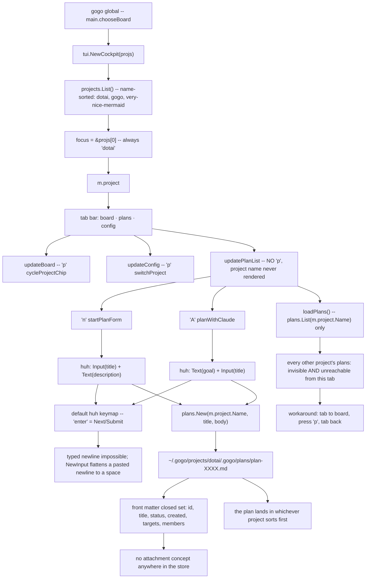
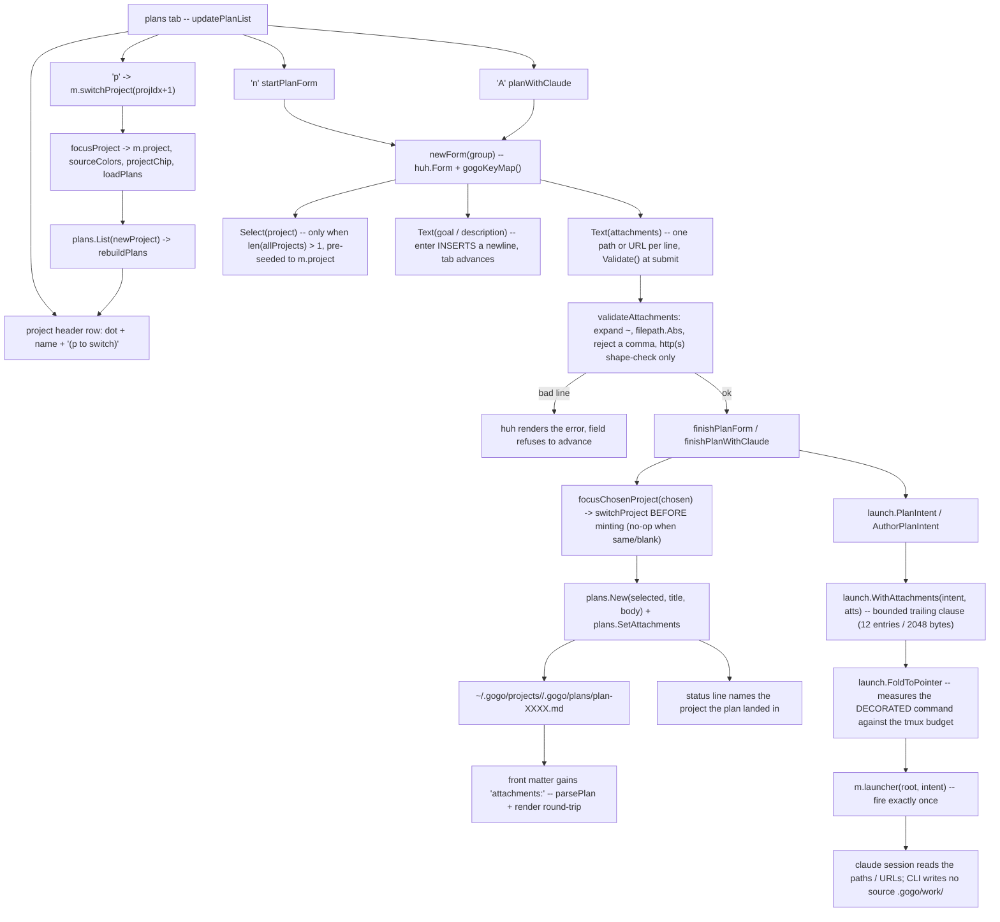
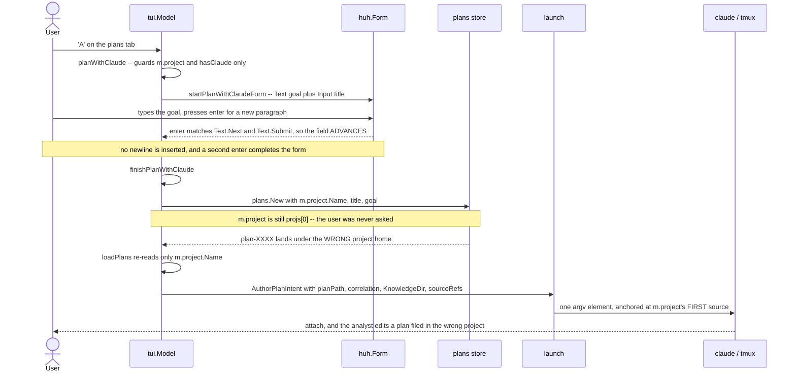
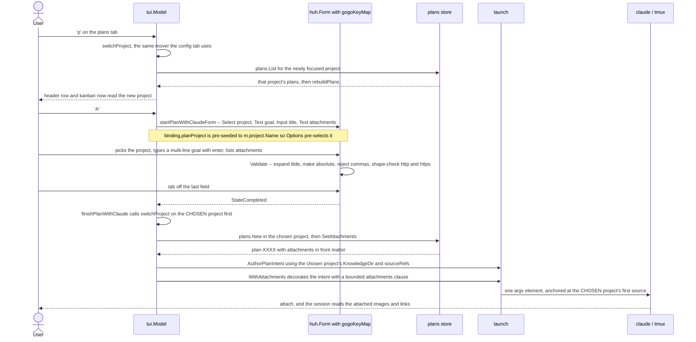

# Report — feature `project-first-plan-authoring`

<!-- Written by phase ⑤ (gogo-knowledge). The durable, as-built summary of what
shipped — the companion to plan.md (the contract), and the bundle /gogo:done
archives to .gogo/changelog/. -->

- **feature:** Project-first plan authoring — pick the project, switch it on the plans tab, multi-line goals, attachments
- **status:** awaiting-uat
- **completed:** 2026-07-31
- **branch / commits:** main (uncommitted working tree over `abb3def` / 0.29.0 → ships as **0.30.0**)

## Run status / gaps

All phases completed — plan (accepted via `/gogo:accept`), implement (3 rounds), review (2 rounds, **APPROVE**), test (1 round, **GREEN**), report. **No open issues** in either issues list.

## Summary

Plan authoring in the gogo cockpit is now **project-first and body-first**. Before this change, the plans tab silently minted every plan into whichever registered project sorted first alphabetically (`NewCockpit` focuses `projs[0]`, and `projects.List()` is name-sorted) — which is exactly how a real plan got misfiled and had to be moved by hand. The tab also never named the project on screen, had no way to reach another project's plans, swallowed typed newlines in its goal box (`enter` advanced instead of inserting a line break), and had no concept of an attachment. All four are fixed: both mint forms **ask which project** when the answer is ambiguous, the tab **shows and switches** its project in place, `enter` **inserts a newline** in every multi-line field, and a plan can carry **attachments** (local paths / URLs) that are stored in its front matter and named to the launched Claude session.

## Planned vs shipped

Shipped **as planned** across FR1–FR6, with four deviations — all recorded in review or forced by it:

| Deviation | What / why |
|---|---|
| `plans.AddAttachment` **dropped** | Planned only in the class diagram, never in the Changes checklist; shipped round 1 with no caller → review REV-006 flagged the untested exported surface; removed (option a, smallest diff). `SetAttachments` is the one write path. |
| `planColAvail()` **added** | Not in the plan: review REV-005 found the new always-on header row overflowed the kanban's height budget by 2–3 rows, pushing the status/help lines off screen. The plans tab now has its own budget, pinned by `TestPlansBoardFitsTerminalHeight`. |
| **Skill contracts updated** (`gogo-project-plan`, `gogo-plan`) | Not in the plan's FR6 sweep: review REV-001 found the `A`-launched analyst's output contract would silently drop the new `attachments:` key; REV-003 found the "final token" wording for `--correlation` no longer held once the attachments clause trails the params. Both docs now match the shipped command/file shapes. |
| **Version 0.30.0** | The plan said "next unclaimed minor — confirm at implement time"; the sibling shipped 0.28.0 and 0.29.0 landed after, so this took 0.30.0. |

## Implementation

**The through-line held: reuse, don't invent.** Every piece wires an existing mechanism into the one tab that lacked it.

- **Project-first minting (FR1).** Both mint forms (`n` quick-draft, `A` plan-with-claude) build their field list conditionally: when more than one project is registered, a `huh.NewSelect` **Project** field comes first, pre-seeded to the focused project (so the common case stays one keystroke). On submit, `focusChosenProject` runs the config tab's existing `switchProject` **before** minting — the single ordering choice that keeps the plan file, the knowledge dir, the source refs, and the tmux session anchor all resolving against the **same** project. A blank/same choice is a no-op, so the single-project form is byte-for-byte the old path. The status line names the destination (`created draft plan-XXXX in <project>`).
- **Reachability (FR2).** `p` on the plans kanban calls the exact `switchProject` the config tab already binds; a header row (`● <project>  (p to switch)`) renders above the kanban unconditionally. `p` is kanban-only — a plan detail belongs to one plan of one project.
- **Multi-line entry (FR3).** One `gogoKeyMap()` — huh's default keymap with **only the Text group rebound**: `enter` = newline, `tab` = next, `shift+tab` = back, `ctrl+d` = submit (`shift+enter` included knowingly inert on bubbletea v1.3.10). It is applied by `newForm()`, the **one construction site** used at **all 12** form sites in the package — and that wiring is pinned by a source-scan test (`TestNewFormIsTheOnlyFormConstructionSite`) that fails if a direct `huh.NewForm(` ever reappears, and fails loudly on an empty scan.
- **Attachments (FR4).** `plans.Plan.Attachments []string` joins the closed front-matter set (`parsePlan` + `render` + `SetAttachments`), serialized as a comma-separated `attachments:` line that an existing plan file without one round-trips byte-for-byte. Both mint forms gain an optional one-per-line Text field validated at submit: `~`-expansion, `filepath.Abs`, comma refused **on the raw line and again on the resolved path** (a comma re-entering via cwd/`$HOME` would silently split the stored list), directories refused by name, `http(s)://` URLs **shape-checked only, never fetched**. The plan detail renders an ATTACHMENTS block (a vanished local path is marked `· missing`); `gogo plan show` prints the list.
- **Attachments reach the session (FR5).** `launch.WithAttachments(in, atts)` is a **decorator over Intent** — the same shape as the sibling's `FoldToPointer`, so the two compose without touching the intent builders. It appends one bounded clause (≤ 12 entries, ≤ 2048 bytes, overflow summarized as "+N more in the plan file") and is applied at the three plans-tab launch sites (`A` author, `c` single spawn, `m` go fan-out) **before** the fold, so the tmux byte-budget preflight measures the real command. An empty set returns the intent unchanged, byte-for-byte.

### Changes (as-built)

| File | Change | Note |
|---|---|---|
| `cli/internal/plans/plans.go` | modified | `Plan.Attachments`, `parsePlan`/`render` attachments key, `SetAttachments` |
| `cli/internal/launch/launch.go` | modified | `WithAttachments` decorator + `MaxAttachmentEntries`/`MaxAttachmentClauseBytes` bounds |
| `cli/internal/tui/model.go` | modified | `formBinding.planProject`/`planAttach`; `gogoKeyMap()`; `newForm()` (the one construction site) |
| `cli/internal/tui/plans_tab.go` | modified | `p` switcher; project header row; project-first mint forms; attachment helpers (`attachmentsField`, `normalizeAttachment`, `validateAttachments`, `parseAttachments`); `focusChosenProject`; `WithAttachments` at 3 launch sites; ATTACHMENTS detail block |
| `cli/internal/tui/window.go` | modified | `planColAvail()` — the kanban's own height budget (review REV-005) |
| `cli/internal/tui/{update,delete,move,config_tab}.go` | modified | mechanical `huh.NewForm(` → `newForm(` swap (8 of the 12 sites) |
| `cli/plan.go` | modified | `planShow` prints `attachments:` |
| `cli/main.go` | modified | plans-tab help block (`p`, multi-line, attachments); Version 0.30.0 |
| `cli/internal/{plans,launch,tui}/…_test.go` | modified | 15 new/extended tests incl. two source-scan/height guards |
| `skills/gogo-project-plan/SKILL.md` | modified | output contract: `attachments:` shown + preserve-every-cockpit-key rule (REV-001) |
| `skills/gogo-plan/SKILL.md` | modified | Step 0 param wording matches the decorated command shape (REV-003) |
| `skills/gogo-cli/SKILL.md`, `README.md`, `docs/cli-contract.md` | modified | enumeration/doc sync (FR6) + the additive 0.30.0 contract note |
| `.claude-plugin/plugin.json` | modified | 0.30.0 |

## Decisions & rationale

All forks were resolved at plan acceptance (D1–D5 on the recommendations); review added three implementation-level calls. See [decisions.md](../decisions.md).

| Decision | Choice | Reason |
|---|---|---|
| D0 scope | One work item: project choice + visibility + multi-line + attachments | Smallest coherent slice matching the user's priorities; Slices C/D stay in `plan-1948afcd` as backlog |
| D1 `projs[0]` default | Keep it; make it visible + overridable | Fixes the actual harm (a *silent* wrong-project mint) with the smallest surface; a cwd-aware default has its own blast radius |
| D2 reachability shape | Per-project `p` switcher, no all-projects view | `plans.Plan` carries no project identity; a merged list would act on the wrong project at every action site |
| D3 attachment storage | Reference by path, never copy | Plain-markdown store, Claude reads paths directly; no invented storage lifecycle. Missing paths are marked in the detail |
| D4 store format | Typed `attachments:` front-matter key, comma refused | Matches the store's list fields, round-trips for free, can't be broken by prose edits |
| D5 keymap scope | `newForm()` at all 12 sites | One construction site is the structural fix for enumeration drift — and review made it a *guarded* one |
| REV-006 call | Drop `AddAttachment` | Exported surface with no caller and no test is scope creep |
| REV-003 call | Fix the docs, not the composition order | The parse is unambiguous either way; the skill wording was the thing that lied |
| REV-005 call | Give the kanban its own height budget | Counting the tab's *actual* chrome beats patching the shared board constant |

## Review outcome

**Two rounds → APPROVE.** Round 1: 7 findings (2 major, 4 minor, 1 nit), all agent-fixable — notably REV-001 (the analyst skill contract would drop `attachments:`) and REV-002 (the `newForm` single-site rule was unenforced). Round 2 **verified all 7** (REV-002 and REV-005 by mutation testing in a scratch copy), reopened nothing, and added 2 batchable minors (REV-008 stale manifest wording; REV-009 the guard could pass vacuously + a raw `os.Chdir`), both fixed in implement round 3. Final: **9 issues, 0 open**. See [review-01.md](../review-01.md), [review-02.md](../review-02.md), [review/issues.json](../review/issues.json).

## Test outcome

**Round 1 GREEN, nothing skipped.** Full suite: `gofmt` clean, `go vet` clean, `go test -race -count=1` **542/542** across 12 packages. CLI hands-on against an isolated `GOGO_DATA_HOME`: `--version` 0.30.0, help enumerations, and the load-bearing round-trip — a hand-added `attachments:` line **survives `gogo plan show` and a `gogo plan ready` re-save**. Live TUI hands-on in tmux: header names the project, `p` switches in place, mint forms show the project Select first (pre-seeded), a typed multi-line goal takes `enter` as newline without submitting, comma refusal and the `· missing` marker render, `esc` cancels with nothing minted and **no claude session ever spawned**. See [test-01.md](../test-01.md), [test/issues.json](../test/issues.json).

## Diagrams

The as-built set (open `../charts/diagrams.html` for the interactive plan-time viewer; this bundle's `.mmd` + `layouts.json` are read by `/gogo:view`):

- `flow.mmd` — the shipped plans-tab authoring path: switcher + header, project-first mint, multi-line entry, attachment validation, switch-before-mint, decorate-before-fold.
- `sequence.mmd` — runtime for `p` (switch in place) and `A` (plan-with-claude), ending anchored at the **chosen** project's first source.
- `class.mmd` — the added types: `Plan.Attachments` + `SetAttachments`, the `formBinding` fields, `gogoKeyMap`/`newForm`, the attachment helpers, `launch.WithAttachments`.

No activity/use-case kinds: no new state machine, and the new capabilities are already real call paths in flow + sequence.

## Before / after comparison

The plan-time as-is baseline lives in [`before/`](./before/) (two kinds). What changed, per kind:

**Flow — before** (the silent `projs[0]` default; no switcher, no attachments, `enter` submits):

**Flow — after** (explicit choice, in-place switch, validated attachments, bounded decoration):

*What changed:* the entry point stops being `projs[0]`'s silent luck — the header names the project, `p` moves it, the Select asks when ambiguous, and the mint path funnels through one switch-before-mint step. The store gains the `attachments:` key; the launch gains a bounded, fold-compatible clause.

**Sequence — before** (`enter` advances; the plan lands under the never-asked default; the session anchors at the wrong project's source):

**Sequence — after** (explicit project; multi-line goal; the whole chain — file, knowledge dir, refs, anchor — agrees):

*What changed:* the same `A` keystroke now runs through an explicit project choice and a keymap where `enter` writes prose instead of submitting; the mint and the launch resolve against one project by construction.

**Added (after only):** `class.mmd` — the before set had no structural diagram (the change *added* types; there was nothing to baseline).

## Knowledge updates

- `tech-stack.md` (owned) — test count refreshed (542 as of 0.30.0, was 449).
- `coding-rules.md` (owned) — new Go rule: every huh form goes through `newForm()` (the guarded single construction site); huh's `enter`-in-Text default is a recorded trap, and guards must never pass vacuously.

Nothing to upstream — the change is CLI/plugin-internal.

## Follow-ups & known limitations

- **Slices C + D** (start-work-directly `A` on the board; add-a-source file picker) stay as backlog in `~/.gogo/projects/gogo/.gogo/plans/plan-1948afcd.md` (`status: ready`, untouched by this item).
- **`gogo plan new --attach`** (scriptable attachments) deliberately deferred; the headless `gogo plan go`/`promote` spawns do not yet decorate with attachments (only the three TUI sites do — FR5.2's scope).
- **Literal `shift+enter`** needs bubbletea/huh v2 + terminal keyboard-enhancement; the binding ships inert by design.
- **Cwd-aware default focus (D1-B)** and an **all-projects plans view (D2-B)** remain possible follow-ups, now much cheaper to evaluate with the switcher + header in place.

## Summary (TL;DR)

- **Shipped (0.30.0):** project-first plan authoring — both mint forms ask **which project** when several exist (pre-seeded, switch-before-mint), the plans tab **names and switches** its project in place (`p` + header row), `enter` **inserts newlines** in every multi-line field via the guarded `newForm()`/`gogoKeyMap()` single site, and plans carry validated **attachments** stored in front matter and named (bounded) to launched sessions.
- **Review:** APPROVE — 9 findings across 2 rounds, all fixed and verified (2 by mutation), 0 open.
- **Test:** GREEN — 542/542 race suite, CLI + live tmux TUI hands-on, nothing skipped.
- **Next:** verify the work (UAT), then `/gogo:done project-first-plan-authoring` ships it; follow-ups above.
