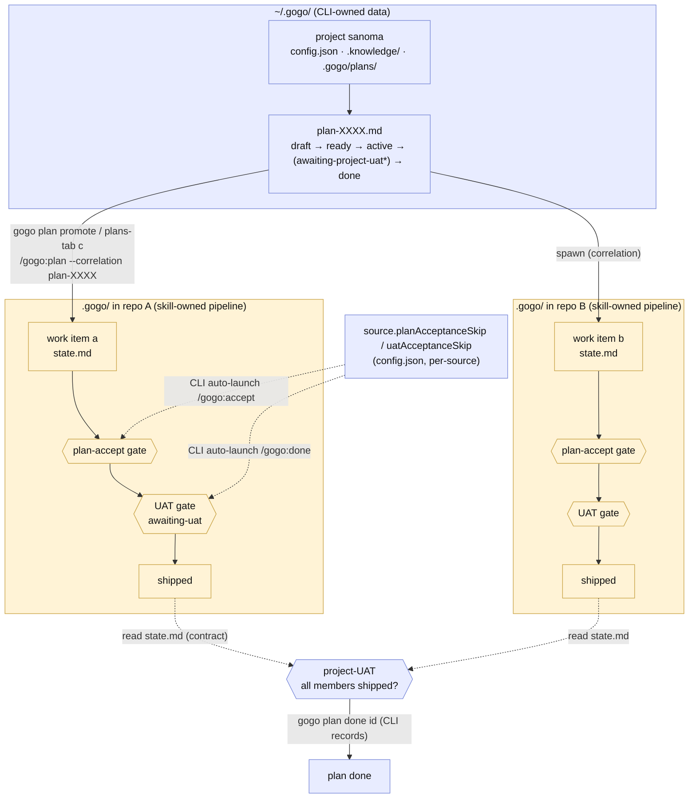

# Plan — project-scope-and-gates

Status: awaiting acceptance

**In one line:** make a gogo **project** a lightweight NAME-based container you can
create empty and grow (`gogo project add sanoma` → `gogo source add <path> --project
sanoma`), give it **project-level domain knowledge** and a **project-level UAT gate**
for cross-repo plans, and let a source **opt out** of the plan-acceptance / UAT gates —
all as **additive CLI/TUI-owned** changes with **zero skill and zero frozen-`.gogo`
contract changes**.

## Goal

Four asks, one coherent theme — *the project is the multi-repo unit of work, and its
gates should live where its data lives*:

1. **FR1 — Empty projects.** `gogo project add <name>` must create an EMPTY project
   (no repo, no `.gogo/`, no path). Today it treats its arg as a repo PATH and errors
   `has no .gogo/` — the exact wall the user hit with `gogo project add sanoma`.
2. **FR2 — Project knowledge.** Scaffold `~/.gogo/projects/<name>/.knowledge/` at
   `project add` — cross-repo DOMAIN knowledge (how the sources connect), distinct from
   each source's per-repo `.gogo/knowledge/`, surfaced separately in the config tab, and
   read by the project-plan author so a plan understands the whole domain.
3. **FR3 — Project-plan UAT.** A project plan spawns N work items across repos; each
   runs its own pipeline + gates. Add a **project-level UAT gate** so a plan is not
   `done` until (a) all its member work items are shipped AND (b) a project-UAT passes.
4. **FR4 — Per-source gate-skip flags.** `planAcceptanceSkip` + `uatAcceptanceSkip`
   per source (default false); when true, the pipeline SKIPS that gate for that
   source's work items — **auto-accept the plan / auto-pass UAT**.

**Acceptance signal:** `gogo project add sanoma` creates an empty, knowledge-scaffolded
project; a cross-repo plan can be driven to `done` only through a project-UAT accept;
and a source flagged skip auto-advances its own gates — with `go test -race ./...`,
`gofmt`, `go vet`, and the enum-sync + no-unsafe-rm lints all green, and single-project /
no-skip behaviour byte-for-byte unchanged.

## Context — what exists today (code = source of truth)

The shipped **projects·sources·plans** model (0.21.0, unified board 0.23.0) is all
CLI-owned data under `~/.gogo/`; the pipeline gates are all SKILL-enforced inside a
source's `.gogo/`.

| Surface | Where it lives | What it does today |
|---|---|---|
| **Project** | `~/.gogo/projects/<name>/config.json` (`cli/internal/projects/projects.go`) | a `{schema,name,color,sources[]}` entity; `EnsureHome` creates `~/.gogo/projects/` + the `~/.gogo/config.json` marker — **but never a per-project `.knowledge/` or `.gogo/plans/`** |
| **`gogo project add`** | `cli/project.go` `projectAdd` | **requires** `<repo>` with `.gogo/` (`resolveGogoRepo`), names the project after the basename, creates source #1 — no empty path |
| **Source** | `Source{Path,Name,MainBranch,ConcurrentWorkItems,Color}` | a repo with its own `.gogo/`; the per-source cap is resolved by root via `orchestrator.CapForSource` in `capBlock` (`cli/go.go`) |
| **Plan** | `~/.gogo/projects/<name>/.gogo/plans/<id>.md` (`cli/internal/plans/plans.go`) | front-matter + body; status `draft → ready → active → done` (`SetStatus`/`MarkReady`); spawns a work item per source via `launch.PlanIntent(... , plan.ID)` → `/gogo:plan <body> --correlation plan-XXXX`; `done` is defined but nothing sets it |
| **Work-item plan gate** | `skills/gogo-plan` + `skills/gogo-accept` | `/gogo:plan` STOPs at `state.md status: awaiting-plan-acceptance`; `/gogo:accept` (board `m`, `launch.ActionAccept`) or the in-chat gate records `plan-accepted` — the ONE recording path |
| **Work-item UAT gate** | `skills/gogo-done` + `skills/gogo` orchestrator | ⑤ ends at `awaiting-uat`; running `/gogo:done` IS the acceptance (appends a `uat.md` round, emits `uat-passed`, ships → `shipped`); issues instead lock the item `waiting-for-user` and re-plan the SAME item |
| **Config tab** | `cli/internal/tui/config_tab.go` | project switcher + per-source add/edit/remove huh form; a knowledge explorer that **already lists the project `.knowledge/` files but flatly mixed in with the source's** `.gogo/knowledge/` |
| **Plans tab** | `cli/internal/tui/plans_tab.go` | ACTIVE/READY/DRAFTS list, plan detail, `c` spawn a work item, `A` plan-with-claude author (`launch.AuthorPlanIntent`) |

**The invariant that shapes everything:** the CLI writes ONLY `~/.gogo/…` (project
config/knowledge/plans) and reads a source's `.gogo/` through the frozen contract; it
**never** writes a source's `.gogo/` and **never** mutates pipeline state — every state
change LAUNCHES a skill (`/gogo:accept`, `/gogo:go`, `/gogo:done`). A project plan is
CLI-owned data (not pipeline state), so the CLI **may** write it directly.

## Functional requirements

### FR1 — `gogo project add <name>` creates an empty project
- A bare **name** (a valid single path component, no `/` `\` `.` `..`) → create
  `~/.gogo/projects/<name>/` with `config.json` (no sources) + `.knowledge/` (FR2) +
  `.gogo/plans/`. No repo, no `.gogo/`, no path required.
- A **path** argument (contains a separator, or resolves to a dir with `.gogo/`) →
  today's behaviour byte-for-byte: create the project + source #1 (name = basename or
  `--name`), with color/branch/cap defaults.
- A path that exists but has **no `.gogo/`** → today's precise error
  (`… has no .gogo/ — run /gogo:build there first`).
- `gogo source add <path> --project <name>` continues to link sources into any project
  (empty or not) — unchanged.

### FR2 — project-level knowledge
- `project add` (empty OR with a source) scaffolds `.knowledge/` seeded with ONE
  template `project-knowledge.md` (headed: what the project is · the domain · **how the
  sources connect** · cross-cutting glossary · integration contracts). Idempotent — an
  existing `.knowledge/` is never clobbered.
- The config-tab knowledge explorer shows **two labelled groups**: `project knowledge`
  (`~/.gogo/projects/<name>/.knowledge/`) and `source knowledge` (the focused source's
  `.gogo/knowledge/`) — no longer one flat mixed list.
- The **plan-with-claude author** session (`AuthorPlanIntent`) is seeded to READ the
  project `.knowledge/` for domain context when writing the brief, so the whole-domain
  understanding flows INTO the plan (and thus into each spawned work item's goal body).

### FR3 — project-plan lifecycle + project-UAT gate
- **Derived gate:** a plan in `active` whose **every member work item is shipped** is
  shown as **`awaiting-project-uat`** (a computed display status; the persisted
  lifecycle stays `draft → ready → active → done`).
- **`gogo plan done <id>`** (+ a plans-tab accept key) is the project-UAT acceptance:
  it REFUSES unless every member is shipped (naming any unshipped members), records a
  project-UAT round, and flips the plan to persisted `done`.
- A member's shipped-ness is a **read** of that member's `state.md`/changelog via the
  existing contract reader (resolved by correlation, like `spawnedFeature`) — the CLI
  never writes a source's `.gogo/`.
- This is an **additional** gate ON TOP of each member's own `/gogo:done` UAT, not a
  replacement.

### FR4 — per-source gate-skip flags
- Additive optional `Source.PlanAcceptanceSkip` + `Source.UatAcceptanceSkip` bools
  (`omitempty`, schema stays `1`), default false, editable in the config-tab source
  form.
- When `planAcceptanceSkip` is true, a work item in that source at
  `awaiting-plan-acceptance` is **auto-accepted** (the CLI launches `/gogo:accept
  <slug>`) before `gogo go` proceeds.
- When `uatAcceptanceSkip` is true, a work item that exits a `gogo go` leg at
  `awaiting-uat` is **auto-shipped** (the CLI launches `/gogo:done <slug>`).
- The auto-advance is **explicit** (per-source opt-in), **visible** (config tab flag +
  a printed "auto-accepting because source X has …skip" line), and goes THROUGH the
  existing accept/done skill (their own gates still validate) — the skill and the frozen
  `.gogo` contract are **unchanged**.

## Approach (recommended)

The spine of the approach is a single principle: **put each new gate where its data
already lives, and never invent a second write path.** Project data is CLI-owned →
FR1/FR2/FR3 are CLI/TUI writes to `~/.gogo/`. Pipeline gates are skill-owned → FR4
reuses the existing accept/done skills and only supplies the user's pre-declared "yes".
The result is **no skill change and no frozen-`.gogo`-contract change anywhere.**

### FR1 — the empty-project model (name vs path, dual-mode)
Make `project add`'s positional **dual-mode**, biased to the user's stated primary flow
(create empty, add sources later):
- A **bare name** (`validName`, no separator) that is not an existing `.gogo/` dir →
  **empty project**. `gogo project add sanoma` works.
- A **path** (has a separator / `~` / `.`, or resolves to a `.gogo/` dir) → the current
  project+source #1 flow, byte-for-byte.
- Add an optional `--source <repo>` flag so `gogo project add sanoma --source
  ~/repos/sanoma-web` does both in one shot (additive; the path-positional still works).

A new `projects.EnsureProjectHome(name)` helper creates the dir + `config.json` +
`.knowledge/` + `.gogo/plans/` and is called on every `project add` (empty and
with-source), so scaffolding is single-sourced. `Save` keeps working for the config
write; `EnsureProjectHome` owns the dirs.

*Why dual-mode over name-only:* name-only is a cleaner mental model but silently
reinterprets the current `gogo project add ~/repos/app` positional from a PATH to a
NAME — that IS the "breaks the current single-arg flow confusingly" the brief warns
against. Dual-mode keeps every existing invocation identical and only adds the bare-name
case. (See Decisions FR1.)

### FR2 — the project-knowledge layer + how far the skill-read reaches
Scaffold `.knowledge/` with a seeded `project-knowledge.md` template (deterministic, no
LLM). Populate it by hand or via the plan-with-claude author (whose seed prompt gains a
line: *read `~/.gogo/projects/<name>/.knowledge/` for the cross-repo domain before
writing the brief*). Split the config-tab explorer into `project knowledge` /
`source knowledge` groups.

**Scope of the skill-read now:** the domain context reaches a spawned work item THROUGH
the well-authored brief (the author read `.knowledge/`, the brief seeds the work item's
goal body), **not** through a new cross-boundary read inside `gogo-plan`. That keeps the
per-source pipeline self-contained and the skill unchanged. A direct
`gogo-plan`-reads-`~/.gogo/.knowledge/` integration is deferred (Decisions FR2) — it is
a skill + cross-boundary change we only take if briefs prove insufficient.

### FR3 — the plan lifecycle addition + project-UAT mechanics
Because a plan is CLI-owned markdown, the whole gate is CLI-side and needs no skill:
- **Compute** `awaiting-project-uat` at read time: `Status == active && len(members) > 0
  && every member shipped`. This overlay is display-only; nothing new is persisted until
  the accept. (Mirrors how the work board derives ready-to-ship rather than persisting
  it — TEST-004 "gate on status, not artifact presence" is respected because the
  member-shipped check reads each member's `state.md status: shipped`, not file
  presence.)
- **`gogo plan done <id>`** (`plans.MarkDone` + a `plans.MembersShipped(...)` guard that
  reads the workspace): refuse-with-names unless every member shipped; on success append
  a `## Project UAT` round to the plan body (`## UAT round N — accepted (user, <date>) —
  via gogo plan done`) and `SetStatus(... , done)`.
- **Plans-tab `D`** key on a plan at `awaiting-project-uat` → a huh confirm → the same
  `MarkDone`.

For v1 the project-UAT is **accept-only** (no re-plan loop): if the cross-repo whole
doesn't work, the user's recourse is to open/re-run a member work item, then re-accept.
A full project-UAT re-plan loop (mirroring the work-item loop) is noted as future
(Decisions FR3).

### FR4 — the gate-skip enforcement mechanism (the hard one)
**Option (a): the CLI auto-accepts on the user's behalf by LAUNCHING the existing
accept/done skill, gated on the per-source flag.** No skill change, no `.gogo` change.

The two hooks live in the CLI orchestrator's `gogo go` flow, where the source root (and
thus its flags, resolved exactly like `CapForSource`) and the feature status are both in
hand:

| Flag | Where the CLI acts | What it launches |
|---|---|---|
| `planAcceptanceSkip` | `gogo go <slug>` (and board `m`→go) sees the feature at `awaiting-plan-acceptance` | auto-launch `/gogo:accept <slug>` (ActionAccept), then proceed to `/gogo:go` |
| `uatAcceptanceSkip` | the persistent `gogo go` leg exits classified `awaiting-uat` | auto-launch `/gogo:done <slug>` (ActionDone) |

Both reuse `launch.ActionAccept` / `ActionDone` — the SAME single-owner recording; the
skills' own gates still guard (gogo-accept refuses unless `awaiting-plan-acceptance`;
gogo-done refuses unless `awaiting-uat`). The flag only supplies the pre-declared
consent. Safety: default false · per-source · printed every time it fires · never a
global default. (See Decisions FR4 for why (b) skill-param and (c) state.md-carried are
rejected — both force a skill/contract change and, for (c), a CLI write into a source's
`.gogo/`.)

**FR3 × FR4 interaction (called out):** `uatAcceptanceSkip` removes a source's PER-ITEM
UAT so its members ship automatically; the FR3 project-UAT still gates the whole plan.
The two are orthogonal by construction — one is per-work-item (skill-launched), one is
per-plan (CLI-recorded).

### Alternatives considered
- **FR1 name-only** (always empty; `--source` for the convenience) — rejected: changes
  the positional meaning of the current `add <repo>` and breaks existing muscle memory.
- **FR2 `gogo project build` LLM synthesis** now — deferred: a new command + an LLM in a
  new path; the seeded template + author-read is the simplest that fully works.
- **FR3 persisted `awaiting-project-uat` enum** — deferred to derive-at-read: nothing
  naturally emits the transition (the CLI gets no event when a member ships), so a
  computed overlay avoids a poll/hook and a new persisted enum value.
- **FR4 (b) skill honors a `--skip` param** and **(c) state.md carries the flag** — both
  rejected: (b) changes the frozen skill contract; (c) both changes the `.gogo` state
  contract AND would need a CLI write into a source's `.gogo/` (the CLI can't, and the
  skill can't see CLI config) — a contradiction.

## Changes checklist — phased, each independently shippable

### Phase A — empty projects + project knowledge (0.24.0) · CLI/TUI only
- `cli/internal/projects/projects.go` — add `EnsureProjectHome(name)` (dir +
  `config.json` + `.knowledge/` + `.gogo/plans/`, idempotent) and a
  `SeedProjectKnowledge(name)` that writes `.knowledge/project-knowledge.md` from a
  template only if absent.
- `cli/project.go` — `projectAdd` dual-mode: bare-name → empty project (call
  `EnsureProjectHome` + `SeedProjectKnowledge`); path → today's source flow; add
  `--source <repo>` optional flag; update `projectHelp` + `FormatProjects` empty hint.
- `templates/` (or an embedded Go const) — the `project-knowledge.md` seed template.
- `cli/internal/launch/launch.go` — `AuthorPlanIntent` seed prose gains the
  "read `.knowledge/`" line (FR2 author-read).
- `cli/internal/tui/config_tab.go` — `viewConfigRight` splits the explorer into
  `project knowledge` / `source knowledge` labelled groups.
- `cli/main.go` — `Version` → `0.24.0`; `.claude-plugin/plugin.json` version bump.
- `docs/cli-contract.md` — additive "Changed in 0.24.0" note (empty projects + project
  `.knowledge/` scaffold; config-only, no `.gogo/` change).
- **Tests:** `cli/project_test.go` (bare-name empty add; path add unchanged; `--source`;
  `.knowledge/` + `.gogo/plans/` scaffolded), a `projects` unit test for
  `EnsureProjectHome`/`SeedProjectKnowledge` idempotency, `config_tab` test for the two
  groups.

### Phase B — project-plan lifecycle + project-UAT (0.25.0) · CLI-owned, reads source state
- `cli/internal/plans/plans.go` — `MembersShipped(project, id, ws)` (reads workspace),
  `DerivedStatus(...)` returning `awaiting-project-uat` when applicable, `MarkDone`
  (guarded, appends the `## Project UAT` round + `SetStatus done`); a
  `StatusAwaitingProjectUAT` display const.
- `cli/plan.go` — `gogo plan done <id>` verb (+ `isPlanStoreVerb` "done", dispatch,
  `planStoreHelp`); refuse-with-unshipped-members message.
- `cli/internal/tui/plans_tab.go` — paint `awaiting-project-uat`; `D` key → huh confirm →
  `MarkDone`; a plan-detail "N of M shipped" / project-UAT affordance.
- `cli/main.go` help (`gogo plan` verbs) + `docs/cli-contract.md` "Changed in 0.25.0".
- `cli/main.go` `Version` → `0.25.0` + plugin.json.
- **Tests:** `plan_test.go` (done refused with unshipped members; done accepted when all
  shipped; round appended; status→done), a plans-tab test for the derived status + `D`,
  `cli_enum_test.go` stays green with the new verb.

### Phase C — per-source gate-skip flags (0.26.0) · the CLI/skill-boundary one
- `cli/internal/projects/projects.go` — add `PlanAcceptanceSkip` + `UatAcceptanceSkip`
  (`json:"…,omitempty"`) to `Source`; a `SkipForSource(sources, root)` resolver
  (mirrors `CapForSource`).
- `cli/internal/tui/config_tab.go` — two huh confirm fields in the source add/edit form;
  show the flags in the source detail; `finishSourceForm` persists them.
- `cli/go.go` — `cmdGo`: if feature is `awaiting-plan-acceptance` and the source has
  `planAcceptanceSkip` → launch `/gogo:accept <slug>` (ActionAccept) + a printed note,
  then proceed. After the `gogo go` leg exits classified `awaiting-uat`, if the source
  has `uatAcceptanceSkip` → launch `/gogo:done <slug>` (ActionDone) + a printed note.
  (Both through the injectable launcher seam so tests assert fire-once without tmux.)
- `cli/source.go` — optional `--skip-plan-accept` / `--skip-uat` flags on `gogo source
  add`/edit (convenience; config tab is primary).
- `cli/main.go` `Version` → `0.26.0` + plugin.json + help; `docs/cli-contract.md`
  "Changed in 0.26.0" (additive Source config fields + auto-accept behaviour).
- **Tests:** `projects` test for the new fields round-tripping (+ omitempty), a
  `go`-path test that the auto-accept launch fires exactly once when the flag is set and
  never when it isn't (fake launcher), a config_tab test for the two fields.

## Tests — what will be verified, at which level
- **Unit (Go, per phase):** `projects` (empty add, scaffolding idempotency, skip-field
  round-trip), `plans` (`MembersShipped` guard, `DerivedStatus`, `MarkDone` refusal +
  success + round text), `launch`/`go` (auto-accept fires exactly once, gated on the
  flag, via the fake launcher — no tmux).
- **CLI behaviour:** `cmdProject` (bare-name vs path vs `--source` vs no-`.gogo/` error),
  `cmdPlanStore` (`done` refused/accepted), `cli_enum_test` (new `done` verb enumerated
  in help + dispatch).
- **TUI (substring-assertable, no TTY):** config-tab two knowledge groups + the two skip
  fields; plans-tab derived status + `D` accept.
- **Gates before hand-off (every phase):** `cd cli && gofmt -l . && go vet ./... && go
  test -race ./...`, plus `TestSkillsBashNoUnsafeRm` and the enum-sync guard green.
- **Dogfood:** `gogo project add sanoma` → empty + `.knowledge/`; `gogo source add … `;
  author a plan; spawn two members; ship both; `gogo plan done` gates then completes;
  flip a source's skip flags and watch a work item auto-advance.

## Out of scope
- **No skill changes and no frozen-`.gogo`-contract changes** — if analysis during build
  finds one is truly required, STOP and re-plan (the invariant the brief pins).
- A **project-UAT re-plan loop** (issues → re-plan the plan, mirroring the work-item UAT
  loop) — v1 is accept-only.
- A dedicated **`gogo project build`** LLM knowledge-synthesis flow — deferred; the
  seeded template + author-read cover the need now.
- A **direct `gogo-plan`-reads-project-`.knowledge/`** cross-boundary skill read —
  deferred; the brief carries the domain context.
- Worktrees (roadmap P5), any board-visual redesign, and changing the work-item UAT loop.

## Intended design

The project→sources→plan-lifecycle model plus the two gate flows (work-item gates the
skill owns; the project-UAT the CLI owns; the per-source skip short-circuit).

*(`awaiting-project-uat*` is a derived display status, not persisted.)*

The as-is baseline (today's model, no project-UAT, no skip, repo-required `project add`)
is captured in `charts/before/`.

## Summary (TL;DR)
- **What:** make a gogo project an empty-able, knowledge-bearing multi-repo container
  (`gogo project add sanoma`), add a **project-level UAT gate** before a cross-repo plan
  is `done`, and let a source **opt out** of the plan-accept / UAT gates.
- **Why:** the project is the real unit of multi-repo work; its container and its gates
  should live where its data already lives, and some repos don't want per-item gates.
- **How:** all **additive CLI/TUI writes to `~/.gogo/`** with **zero skill and zero
  frozen-`.gogo`-contract changes** — FR4's auto-advance reuses the existing
  `/gogo:accept` · `/gogo:done` skills, gated on a per-source flag (option **a**); the
  project-UAT is a CLI-recorded accept on the CLI-owned plan file (FR3); shipped across
  three independently shippable phases (**A** 0.24.0 empty projects + knowledge · **B**
  0.25.0 project-UAT · **C** 0.26.0 skip flags).
- **Key risks / decisions to gate:** **FR4 enforcement** (option a — CLI auto-launches
  the existing accept/done skill) and **FR3 mechanics** (derived `awaiting-project-uat` +
  a CLI `gogo plan done` accept) are the two that shape the pipeline — see Decisions.
- **Next:** the orchestrator presents this at the acceptance gate; on accept, `/gogo:go`
  builds **Phase A** first.

> Status: **accepted** (user, 2026-07-20) -> /gogo:go
