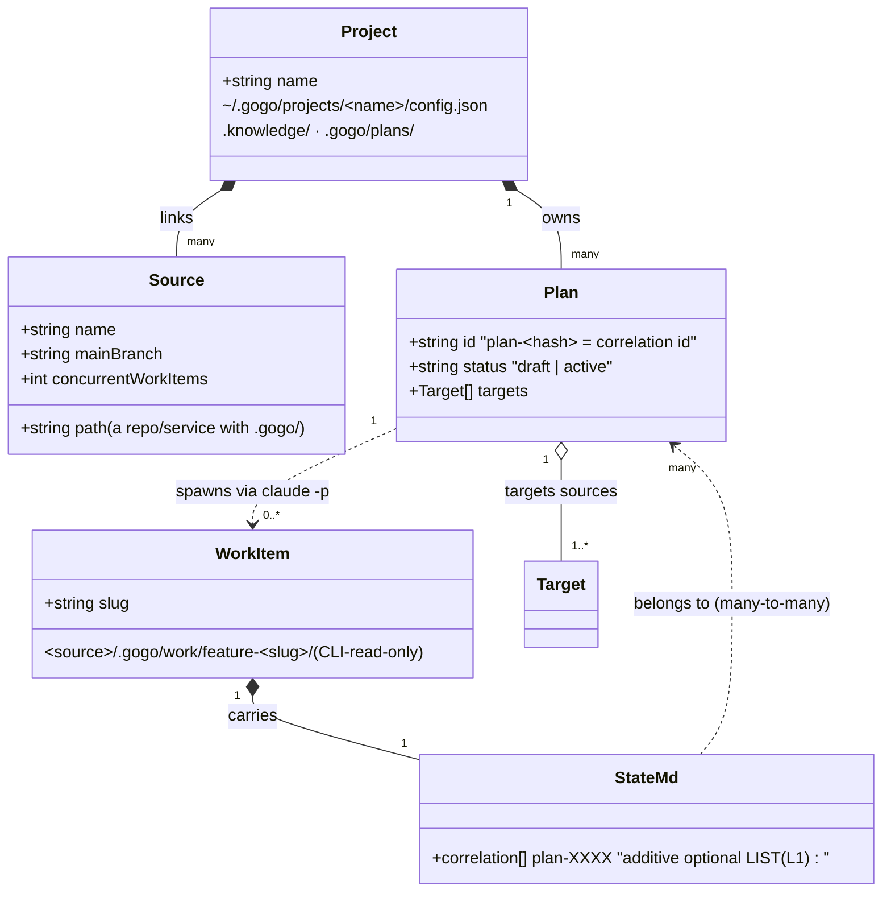

# Plan — projects · sources · plans (the gogo global cockpit, corrected model)

**Feature:** `projects-sources-plans` · phase ⑤ (report) · status **awaiting-uat** · shipped as **0.21.0**

> **As-built (2026-07-18):** implemented A→D, reviewed (7 findings, all fixed) and tested
> (1 minor + 2 nits, all fixed); gates green; one `0.21.0` drop. The Phase A–D checklist
> below is ticked to as-built; see **As-built deviations** (after the checklist) and the
> full [report/report.md](report/report.md).

A three-level re-architecture of the gogo cockpit. Today's uncommitted 5-phase epic
(P1–P4) is built on a **flat model where `project == one registered repo`**. This
plan re-grounds the cockpit on the **correct** model — a home-folder **PROJECT**
groups many **SOURCES** (repos with `.gogo/`), owns project-scoped **PLANS**, and a
plan spawns **WORK ITEMS** into sources, each stamped with the plan's **correlation**
id in its `state.md`. The reusable P1–P4 infrastructure is **reworked**, not
restarted (the second locked decision).

---

## Goal

Re-architect the cockpit so a **project** is a first-class home-folder entity
(`~/.gogo/projects/<name>/`) that links many **sources** (repositories, or monorepo
services, each with its own `.gogo/`), owns project-scoped **plans**, and lets the
user create a plan → target sources → **spawn a work item per source** (by launching
`claude -p` `gogo:plan`) that is stamped with the plan's `correlation:` list in the
source's `state.md`. Ship it as a tabbed TUI (**board · plans · config**), preserving
the graceful single-repo fallback byte-for-byte.

**Acceptance signal:** `gogo project add ~/repos/gogo` creates
`~/.gogo/projects/gogo/` with `~/repos/gogo` as source #1; `gogo` opens that project's
board (cards tagged by source); a plan created for the project can be spawned into ≥1
source, each new work item carries `correlation: [plan-XXXX]` in `state.md`, and every
member card shows `⛓ plan-XXXX` and filters together; a lone repo with no home project
still shows today's single-repo board. `cd cli && gofmt -l . && go vet ./... && go
test -race ./...` is green (incl. the enum-sync + no-unsafe-rm guards).

---

## Context

**Where the code actually is (verified against the tree, not the brief):**

- **Released line is 0.20.1.** `git show HEAD:.claude-plugin/plugin.json` → `0.20.1`;
  `git show HEAD:cli/main.go` → `Version = "0.20.1"`. The working tree carries P1–P4
  as `0.24.0`, but **every P1–P4 artifact is UNTRACKED**: `cli/internal/config/`,
  `cli/internal/drafts/`, `cli/internal/epics/`, `cli/project.go`, `cli/draft.go`,
  `cli/epic.go` are `??`, and `cli/main.go` is `M`. Feature folders
  `feature-multi-project-board`, `feature-config-and-concurrency-cap`,
  `feature-global-plan-drafts`, `feature-multi-repo-plans-correlation` are all
  untracked. **So the rework is free** — nothing is released, nothing to deprecate
  for real consumers.
- **Knowledge drift to reconcile at report ⑤:** `project-knowledge.md` `## gogo
  overrides` narrates P1–P4 (0.21.0–0.24.0) as shipped. They are not committed. The
  report phase should correct that once this rework lands. (Code is the source of
  truth; the doc drifted.)
- **P4 reversed by this rework.** `feature-multi-repo-plans-correlation` chose **D1=B**
  — correlation kept in a CLI store (`epics.json`), explicitly *out* of `.gogo`
  (`adjustments.md`: "cannot fit a single skill-written state.md correlation field").
  Locked decision #1 here **reverses** that: correlation lives in each source work
  item's `state.md` as an additive optional **list**. The many-to-many/retroactive
  concerns that drove D1=B are handled by (a) the list being plural and (b) a plan
  being able to add an existing work item (which re-stamps its state.md).

**The salvageable infra (all present, all reused):**

| Package / file | Today | This rework |
|---|---|---|
| `cli/internal/config/config.go` | flat `Project{Name,Path,Color,MaxConcurrent}` → `~/.config/gogo/projects.json`; `Home()` seam | **rework** → `cli/internal/projects`: home-folder Project entity + per-source Source; `MaxConcurrent`→ per-source `ConcurrentWorkItems` |
| `cli/internal/drafts/` (P3) + `cli/internal/epics/` (P4) | two CLI stores under `~/.config/gogo/` | **collapse** into ONE `cli/internal/plans` (project-scoped `~/.gogo/projects/<name>/.gogo/plans/`); draft = plan `status: draft`, epic = plan with members |
| `cli/internal/contract/state.go`, `contract.go` | `parseStateFile`; `LoadRepo`; `LoadProjects([]config.Project)`; `Feature.Project/Root/Epics`; `StampEpics` | **add** `correlation:` parsing → `Feature.Correlations []string`; `LoadProject(projects.Project)` reads all sources; drop the `StampEpics` store-overlay (correlation is now in state.md) |
| `cli/internal/launch/launch.go` | `PlanIntent`/`PlanIntentWithHint` launch `/gogo:plan <body>` (+ advisory prose hint) | **extend** to carry an explicit `--correlation plan-XXXX` param (injection-safe single argv element) |
| `cli/internal/tui/` | board renderer + lean 0.20.0 card anatomy + `matchFilter`/`splitFilter` + `modeConfig`/`modeDrafts`/`modeEpics` | **rework** modal C/D/E → **tabs** board/plans/config; retag cards by **source**; add plans tab (list + detail) + config tab (project switcher → sources → knowledge) |
| `cli/main.go` | `project`/`draft`/`epic` dispatch + `Version` + enum-sync guard | **rework** command surface: `project add/list/rm` creates the structure; new `source add/rm`; `plan …` supersedes `draft`/`epic`; keep `TestCLICommandEnumerationInSync` + `TestSkillsBashNoUnsafeRm` green |
| `skills/gogo-plan/SKILL.md` + `templates/state.template.md` | write plan.md + scaffold state.md | **add** an optional `--correlation` param the skill stamps as `correlation:` in state.md; add the optional line + file-list note to the template (enum-sync) |

**Invariants (held throughout):**
- **CLI reads sources' `.gogo/`, never writes them.** The CLI writes only its own data
  — `~/.gogo/projects/<name>/` (config, `.knowledge/`, `.gogo/plans/`). It must NOT
  write any source's `.gogo/work/`. **Spawning a work item = launching `claude -p`
  (`gogo:plan`)**, which writes the source's `.gogo/work/` and stamps correlation.
- **Additive + graceful fallback.** Lone repo, no home project → today's single-repo
  board, byte-for-byte. Absent `correlation:` field → today's behaviour.
- **Read path stays LLM-free and millisecond-fast** (contract parsers only).
- Per-source `.gogo/resources/cli/` (locks/sessions/logs) is unchanged — only
  `~/.config/gogo/` (projects.json + drafts + epics) is reworked/migrated.

**The design (UI source of truth):** the "Gogo Cockpit" Claude Design (project
`83feef99`). The excerpt file referenced by the brief was no longer on disk at plan
time, but the brief's distillation (tab bar; plans tab 4a; plan detail 4b; board 3a;
config 3b) is the authority used here. **Reconciliation:** the design predates the
correction and calls the per-repo units "projects"; in the corrected model those are
**SOURCES within a project**. So the board's per-card tag + filter chips = **sources**,
the config screen's left list = the focused project's **sources** + a **project
switcher**, and the header's "M projects" = the real home-folder projects. Same visual
language, lifted one level.

---

## Functional requirements

Grouped by the phase that delivers them (A–D). Each FR is independently checkable.

### Data model & stores

- **FR1 — Project entity store.** A new `cli/internal/projects` package (reworking
  `config`) owns home-folder project entities at `~/.gogo/projects/<name>/`. A project
  has `{schema, name, description, sources[]}`. Every read is defensive
  (missing/malformed → empty, never a crash), exactly like `config.Load` today.
- **FR2 — Source model.** Each project's `sources[]` holds
  `{path, name, mainBranch, concurrentWorkItems, color}` (per-source). A source path
  MUST contain a `.gogo/` dir (a repo, or a monorepo service with its own `.gogo/`).
  The per-project `MaxConcurrent` (P2) becomes per-source `concurrentWorkItems`
  (default 1; 0 = unlimited).
- **FR3 — Project folder layout.** `~/.gogo/projects/<name>/` contains `config.json`
  (the entity above), an optional `.knowledge/` dir (project-level knowledge), and
  `.gogo/plans/` (the project's plans). The gogo DATA home is `~/.gogo/` with a
  `GOGO_DATA_HOME` test seam (mirroring `GOGO_CONFIG_HOME`). See D1/D2.
- **FR12 — Project-scoped plans store (with a status lifecycle — D8).** A
  `cli/internal/plans` package (collapsing `drafts`+`epics`) owns per-project plans at
  `~/.gogo/projects/<name>/.gogo/plans/<plan-id>.md`: a `Plan{id: plan-<hash>, title,
  description, status, targets: []source, members: [{source, slugHint}], created}` as
  hand-editable markdown (front-matter + body, like drafts today). **A plan is ONE entity
  with a status lifecycle** `status ∈ draft → ready → active → done`: `draft` (being
  authored, the old "draft"), `ready` (targets chosen, spawnable), `active` (≥1 member
  spawned, the old "epic"), `done` (all members shipped — derived/terminal, optional in
  v1). `draft→ready` on the user marking it ready (or first target added); `ready→active`
  on first spawn. Defensive reads.
- **FR13 — Correlation in `state.md` (the reversal of P4 D1=B).** `contract` parses an
  additive, optional `correlation:` **list** from a source work item's `state.md`
  (`- **correlation:** [plan-7f3a, plan-9c2e]`) onto `Feature.Correlations []string`.
  Absent field → `nil` (today's behaviour byte-for-byte). `templates/state.template.md`
  gains the optional line + the file-list note. `docs/cli-contract.md §2` documents it
  as additive.

### Commands & migration

- **FR4 — `gogo project` creates the structure.** `gogo project add <repo>` creates
  `~/.gogo/projects/<name>/` (name = repo basename or `--name`) with `<repo>` as source
  #1 (`concurrentWorkItems: 1`, `mainBranch` = detected git default or `main`); it
  requires `<repo>` contain `.gogo/`. `gogo project list` renders the projects + their
  sources; `gogo project rm <name>` removes a project (its home folder; never a
  source's `.gogo/`). See D5.
- **FR5 — `gogo source` add/remove sources.** `gogo source add <repo> [--project
  <name>]` appends a source to a project (defaults to the sole project; errors if
  ambiguous and no `--project`); `gogo source rm <repo|name> [--project <name>]`
  removes one. A monorepo service is registered by pointing at the service dir (its own
  `.gogo/`) as a separate source. See D5.
- **FR6 — Migration.** A one-shot, best-effort, **non-destructive** migration converts
  a legacy `~/.config/gogo/projects.json` entry into a single-source project
  `~/.gogo/projects/<basename>/`, and folds legacy `drafts/` + `epics.json` into project
  plans where a target is resolvable. It runs once (skips when `~/.gogo/projects/`
  already exists), leaves the old files in place, and never blocks startup. See D4.
- **FR17 — Command surface + enum-sync (with `draft`/`epic` aliases — D9).** `gogo plan
  new/list/show/add/rm/delete/promote` is the canonical surface; **`gogo draft` and
  `gogo epic` remain as thin aliases** into `plan` (a draft/epic is just a plan in a status
  — D8): `gogo draft` ≈ `plan` filtered to `status: draft` (`draft new` seeds a `draft`
  plan), `gogo epic` ≈ plans with members. The `project`/`source`/`plan` verbs **and the
  `draft`/`epic` aliases** are enum-synced across `cli/main.go printHelp`, `README.md`,
  `docs/cli-contract.md`, `skills/gogo-cli/SKILL.md` (`TestCLICommandEnumerationInSync`),
  and `TestSkillsBashNoUnsafeRm` stays green.

### TUI (tabs, board, config, plans)

- **FR8 — Tabbed navigation.** `tab` / `shift+tab` cycle **board → plans → config**,
  replacing the modal `C`/`D`/`E` screens. `/` filter, `q` quit, `?` help persist.
  Drill/viewer/forms compose within the active tab. See D6.
- **FR7 — Board retagged by source + graceful fallback.** The board aggregates a
  focused **project's** sources; each card carries a per-source tag (colored dot +
  name); the filter bar has source chips (`all` + one per source, `p` cycles). Header:
  `gogo cockpit · N features · M projects · ⏸ K need you · ● S sessions`. **Inside a
  lone repo with no home project → today's single-repo board, byte-for-byte** (no tags,
  no chips, no project note). See D5 (board/project selection).
- **FR9 — Config tab.** Left = the focused project's **sources** (`a` add · `x` remove ·
  `e` edit per-source `concurrentWorkItems`/`mainBranch`/`color`/permission mode) + a
  **project switcher** on top; right = the focused source's detail + a **knowledge
  explorer** (`.gogo/knowledge/` files + sizes, and the project `.knowledge/`). Writes
  only `~/.gogo/…`.
- **FR10 — Plans tab (list, grouped by status — D8).** Header `plans · N active · M ready ·
  K drafts`. Three sections in lifecycle order — **ACTIVE** (each card = `▸ <title>`, a
  `⛓ plan-XXXX` chip, `K of M work items`, per-source colored dots greyed `· not created`
  until spawned), **READY** (targets chosen, spawnable, not yet spawned), **DRAFTS** (dashed
  `◌ <title>` + `⛓ plan-XXXX` + `draft · edited <ago>`). Keys: `↑↓ · enter open · n new ·
  A plan-with-claude · r mark ready · x delete`.
- **FR11 — Plan detail + spawn.** Breadcrumb `plans / <title>` + `⛓ plan-XXXX`;
  description; **TARGET SOURCES** list — each row = colored dot + source name + (work-item
  slug + status pill) OR (`slug: <hint>` + `＋ create work item`). `c create` **launches
  `claude -p` `gogo:plan`** seeded from the plan + the correlation id, anchored at the
  source root; the SKILL writes `<source>/.gogo/work/feature-<slug>/` and stamps
  `correlation: [plan-XXXX]`. `+ add repo` adds a target; `e edit plan`. The CLI never
  writes a source's `.gogo/work/`. See D3.
- **FR14 — Correlation overlay + filter.** The board reads `Feature.Correlations`
  directly from each source's `state.md` (no store overlay), paints one `⛓ plan-XXXX`
  chip per id (many-to-many), and a `#plan-XXXX` filter token narrows to that plan's
  members across sources. Unknown `#token` → literal text match (parity).

### Skill + spawn contract

- **FR15 — `gogo-plan` correlation param.** `gogo-plan` accepts an explicit
  `--correlation plan-XXXX` param and, when present, stamps `correlation: [plan-XXXX]`
  onto the work item's `state.md` (appending to any existing list). Absent → today's
  behaviour byte-for-byte. `launch.PlanIntent` carries it as a single injection-safe
  argv element. See D3.
- **FR16 — Add an existing work item to a plan (retroactive, many-to-many).** From plan
  detail (or `gogo plan add <plan-id> <source>:<slug>`), an existing source work item is
  linked to a plan: it is added to the plan's `members[]` AND (via a launched
  `gogo:plan --correlation` re-stamp, or a documented skill step) its `state.md`
  `correlation:` list gains the id — so a ticket in two plans carries both chips.
- **FR18 — Versioning (one 0.21.0 drop — D7).** Phases A–D are the implementation order
  (build + test between each) but ship as a **single `0.21.0`** release that supersedes the
  uncommitted 0.21–0.24. Reset the working-tree `0.24.0`; bump
  `.claude-plugin/plugin.json` + `cli/main.go Version` to `0.21.0` ONCE (at D / just before
  the drop). See D7.

---

## Approach

**One coherent target architecture, delivered in four independently-shippable phases.**

### Target data model

```
~/.gogo/                                  gogo DATA home (new; $GOGO_DATA_HOME seam)
  projects/
    <project-name>/
      config.json        { schema:1, name, description,
                           sources: [ {path, name, mainBranch,
                                       concurrentWorkItems, color} ] }
      .knowledge/        project-level knowledge md (optional)
      .gogo/
        plans/
          <plan-id>.md   front-matter {id: plan-<hash>, title, status,
                           targets:[source], members:[{source,slugHint}], created}
                           + free-text body (the plan brief / goal)

<source-repo>/                            a SOURCE (unchanged, CLI-read-only)
  .gogo/
    work/feature-<slug>/
      state.md           gains optional: - **correlation:** [plan-XXXX, ...]
    resources/cli/        locks/sessions/logs (per-source, unchanged)
```

### The plan → spawn → correlation path (the load-bearing flow)

1. User creates a **plan** for a project (plans tab `n`, or `A` to author it with a
   `claude -p` session). A `plan-<hash>` correlation id is minted at creation.
2. In **plan detail**, the user targets one or more **sources** and presses `c create
   work item` on a source row.
3. The CLI builds `launch.PlanIntent(sourceRoot, planBody, correlation)` →
   `claude -p "/gogo:plan <body> --correlation plan-XXXX"`, anchored at the **source
   root** (TEST-013), and launches it (tmux, or backgrounded `-p`). The CLI writes
   nothing under the source's `.gogo/work/`.
4. The `gogo:plan` **skill** (running in that source) writes
   `<source>/.gogo/work/feature-<slug>/` and, seeing `--correlation`, stamps
   `- **correlation:** [plan-XXXX]` in `state.md`. It derives the final slug.
5. The board reader parses `correlation:` from `state.md` onto
   `Feature.Correlations`; the card shows `⛓ plan-XXXX`, the plan card's per-source dot
   turns solid, and `#plan-XXXX` filters the members together across sources.
6. **Retroactive (FR16):** adding an existing work item to a plan re-runs step 3–4 with
   the real slug (or a documented skill re-stamp), appending the id to the state.md list
   — hence the LIST (a ticket may belong to several plans).

Why `claude -p` and not a direct CLI write: the hard invariant. The CLI is a
deterministic reader of sources' `.gogo/`; only the skills write pipeline state. The
design's "＋ create writes …" IS this launch, not a CLI file write.

### Salvage-vs-rework, per package

- **`config` → `projects` (rework, not delete).** Keep the defensive Load/Save/List
  shape, the `Home()`/env-seam pattern, and `Add`/`Remove` dedupe semantics; change the
  *shape* (flat repo → project entity with a sources list) and the *root*
  (`~/.config/gogo/projects.json` → `~/.gogo/projects/<name>/config.json`). The
  `MaxConcurrent` field + the `orchestrator/cap.go` guard survive, retargeted to
  per-source `concurrentWorkItems` (the launch guard reads the source's cap).
- **`drafts` + `epics` → `plans` (collapse).** One store, project-scoped. Reuse the
  drafts markdown front-matter parser (hand-editable, no YAML dep) for the plan file;
  reuse the epics `plan-<hash>` id minting + many-to-many member set. Drop the
  `Feature.Epics`/`StampEpics` **store overlay** entirely — correlation is now read from
  `state.md` (FR13), so the reader has no epics dependency (removing the
  `contract → epics` import, a net simplification).
- **`contract` (extend).** Add one `case "correlation":` branch to `parseStateFile`
  (parse `[a, b]` into `Feature.Correlations`), and `LoadProject(projects.Project)`
  that calls `LoadRepo` once per source (no reader fork), stamping `Feature.Source`
  (rename/alias of the `Project` field) + `Root`. `LoadRepo` + `FindRoot` (single-repo
  fallback) are untouched.
- **`launch` (extend).** `PlanIntent(label, body, correlation)` folds `--correlation
  plan-XXXX` into the command as a single argv element (no shell — injection-safe, like
  the existing slug-hint path). `PlanIntentWithHint` is retired (its advisory-prose
  hint is superseded by the explicit param).
- **`tui` (rework).** Replace the `mode` switch's `modeConfig`/`modeDrafts`/`modeEpics`
  with a `tab` field (board/plans/config) + within-tab modes (drill, form, plan-detail).
  Retag cards by source (`Feature.Source`), source filter chips replace the `@project`
  token semantics (chips are still `splitFilter`-style, just labelled sources). Add the
  plans tab (list + detail) and the config tab (switcher → sources → knowledge). Reuse
  the `formBinding` heap-stable pointer (TEST-001), the async viewer, and the launcher
  seam (fire-exactly-once) throughout.
- **`main.go` (rework).** `project add/list/rm` (rework), `source add/rm` (new), `plan`
  (supersedes `draft`/`epic`). Update `printHelp` + the three other enum-sync sources +
  the `board keys` help.

### Board / project selection (a `chooseBoard` extension)

A clean four-way (extends today's three-way seam, still pure/no-TTY testable):
1. **Inside a source that belongs to a project** → that **project's** board (aggregate
   its sources), the project focused. *(new)*
2. **Inside a lone repo with NO home project** → single-repo board (unchanged fallback).
3. **Outside any repo, ≥1 project** → the first/only project's board, switchable in the
   config tab / via `p`. *(rework of today's aggregate)*
4. **Outside, no projects** → today's "no .gogo/ found" error.

### Alternatives considered

- **Correlation in a CLI store (P4's D1=B) vs in `state.md` (chosen, locked).** The
  store keeps `.gogo` untouched but makes correlation invisible to anyone reading the
  repo and couples the reader to the store. `state.md` is self-describing, survives repo
  moves, and needs only a one-line additive parse; the list handles many-to-many. **Locked
  to state.md.**
- **Explicit `--correlation` param vs injected prose hint (P4's approach).** Prose is
  advisory (the analyst may ignore it); an explicit param is deterministic and
  injection-safe. **Chosen: explicit param.**
- **Fresh restart vs rework.** Restart throws away the board renderer, the defensive
  store pattern, the launch/tmux machinery, the huh forms, the id minting — all directly
  reusable. **Locked to rework.**
- **`config.json` vs literal `.config` file vs a `.config/` dir.** JSON `config.json` is
  tool-friendly + mirrors the existing defensive JSON parse; the user's word ".config"
  is honoured in spirit. **Chosen: `config.json`** (surfaced as D2).

---

## Intended design (diagrams)

Full sources + offline viewer in `charts/` (`class.mmd`, `sequence.mmd`,
`diagrams.html`); the as-is baseline is in `charts/before/`.

**Data model — Project · Sources · project-scoped Plans · WorkItems (correlation list in state.md):**



**Runtime — plan → spawn (`claude -p` `gogo:plan`) → correlation stamped in `state.md` → read back:**

```mermaid
sequenceDiagram
  autonumber
  actor User
  participant TUI as gogo TUI (plans/detail)
  participant Launch as launch.PlanIntent
  participant Claude as claude -p (gogo:plan)
  participant Work as source .gogo/work/
  participant Board as reader (LoadProject)
  User->>TUI: new plan (mint plan-XXXX) → open detail → c create work item on source S
  TUI->>Launch: PlanIntent(root=S, body, correlation="plan-XXXX")
  Launch-->>Claude: claude -p "/gogo:plan &lt;body&gt; --correlation plan-XXXX" (anchored at S)
  Note over TUI,Claude: CLI writes NOTHING under S/.gogo/work/
  Claude->>Work: write feature-&lt;slug&gt;/ + stamp state.md correlation: [plan-XXXX]
  Board->>Work: read state.md (LLM-free)
  Work-->>Board: Feature.Correlations = [plan-XXXX]
  Board-->>User: ⛓ plan-XXXX chip · #plan-XXXX filters members across sources
```

---

## Changes checklist (phased, each independently shippable)

### Phase A — projects & sources store + migration + commands + fallback (build+test; ships in 0.21.0)
- [x] `cli/internal/projects/projects.go` — Project entity + Source; `~/.gogo/projects/
      <name>/config.json`; `GOGO_DATA_HOME` seam; `Load/Save/List/Add/AddSource/
      RemoveSource/Remove`; degrade-to-empty. Rework `config` (keep `MaxConcurrent`
      logic as per-source `concurrentWorkItems`).
- [x] `cli/internal/orchestrator/cap.go` — retarget the cap guard to a source's
      `concurrentWorkItems`.
- [x] `cli/internal/contract/contract.go` — `LoadProject(projects.Project)` (per-source
      `LoadRepo`, stamp `Feature.Source`+`Root`); rename `Feature.Project`→`Source`
      (keep `Root`). Leave `LoadRepo`/`FindRoot` untouched.
- [x] `cli/main.go` — `chooseBoard` four-way; `project add/list/rm` reworked; `source
      add/rm` new; drop `draft`/`epic` dispatch (moves to `plan` in C — interim: keep a
      stub returning "use gogo plan" until C, OR land `plan` read-only here). Update
      `printHelp`.
- [x] `cli/project.go`, `cli/source.go` — command handlers.
- [x] Migration (FR6): one-shot best-effort in `projects` (or a small `migrate.go`),
      invoked at startup, guarded + non-destructive.
- [x] Update the three other enum-sync sources for `project`/`source`.
- [x] Tests: `projects` round-trip + seam + dedupe; `LoadProject` aggregation;
      `chooseBoard` four-way (**fallback**); enum-sync; migration idempotence.

### Phase B — tabbed TUI + board retagged by source + config tab (build+test; ships in 0.21.0)
- [x] `cli/internal/tui/model.go` — replace `modeConfig/modeDrafts/modeEpics` with a
      `tab` field (board/plans/config) + within-tab modes; `Feature.Source` tag;
      source filter chips; header project count.
- [x] `cli/internal/tui/update.go` — `tab`/`shift+tab` cycling; config-tab key map
      (`a`/`x`/`e`, project switcher, `p`); retire `C`/`D`/`E`.
- [x] `cli/internal/tui/view.go` + `styles.go` — source tags/dots; config tab (switcher
      → sources → knowledge explorer).
- [x] `cli/internal/tui/config_screen.go` — rework to per-source settings + project
      switcher + knowledge explorer.
- [x] Tests: tab cycling; source tag/filter; config CRUD via `formBinding`; per-source
      cap edit; single-repo parity (no tabs-break).

### Phase C — project-scoped plans (drafts+epics unified) + correlation + spawn (build+test; ships in 0.21.0)
- [x] `cli/internal/plans/plans.go` — project-scoped plan store (collapse `drafts`+
      `epics`); `Plan{id,title,description,status,targets,members,created}` with the
      `draft→ready→active→done` status lifecycle (D8); markdown front-matter + body;
      `plan-<hash>` id; CRUD + `AddMember`/`RemoveMember` + `SetStatus`/mark-ready.
- [x] `cli/internal/contract/state.go` — parse `correlation:` list → `Feature.Correlations`.
- [x] `templates/state.template.md` — add the optional `correlation:` line + file-list note.
- [x] `docs/cli-contract.md §2` — document `correlation:` (additive, optional).
- [x] `skills/gogo-plan/SKILL.md` — accept `--correlation plan-XXXX`; stamp/append it to
      `state.md`; absent → unchanged.
- [x] `cli/internal/launch/launch.go` — `PlanIntent(label, body, correlation)`; retire
      `PlanIntentWithHint`.
- [x] `cli/internal/tui/` — plans tab (list + detail); `c create work item` → launch via
      the launcher seam; `Feature.Correlations` chips + `#plan-XXXX` filter; drop
      `StampEpics` overlay + the `contract→epics` import.
- [x] `cli/main.go` + `cli/plan.go` — `plan new/list/show/add/rm/delete/promote/ready`
      (canonical); keep `draft`/`epic` as thin aliases into `plan` (D9); enum-sync all
      four sources (`project`/`source`/`plan` + the `draft`/`epic` aliases).
- [x] Migration of legacy drafts/epics → project plans (FR6 extension).
- [x] Tests: `plans` CRUD + id minting; `parseStateFile` correlation
      (**round-trip**: one/many/absent/malformed); `PlanIntent` correlation argv
      (**spawn**); plan-detail create-work-item builds the right intent (launcher seam,
      fire-exactly-once); board chip + `#plan-XXXX` filter; enum-sync `plan`.

### Phase D — `A` plan-with-claude trigger polish + version bump (ships 0.21.0)
- [x] `cli/internal/tui/` — plans tab `A` starts a `claude -p` `gogo:plan` session that
      authors a **new project plan** (mints the correlation id up front, seeds the
      session, writes the project plan); `n` = quick draft. Per-source dot polish
      (`· not created`); drafts-section niceties.
- [x] Wire the plan-authoring session lifecycle (launcher seam; no source `.gogo/` write).
- [x] Tests: `A` builds the plan-authoring intent (seam); plan-card per-source dot states.

---

## As-built deviations

Truthful record of where the shipped code differs from the plan as written above. Each
is a refinement made during implement/review, not a scope change (full detail:
[report/report.md](report/report.md) → *Decisions & rationale*).

- **`config` package kept alongside `projects` (not deleted).** The plan framed `config`
  as "reworked into `projects`." As built, `cli/internal/config` **survives read-only** as
  the legacy shape + the migration source — the minimal green path (deleting it wasn't
  needed to land the new model). `cli/internal/projects` is the new home-folder store.
- **`gogo plan <slug>` session-launcher and the store verbs coexist.** `cmdPlan` routes a
  RESERVED store-verb set (`new/list/show/add/rm/ready/promote/delete/…`) to the plan
  store and any other bare token to the persistent `/gogo:plan` session. A single-token
  slug that IS a store verb (e.g. a feature named `ready`) resolves to the store — the
  "never ambiguous" claim was softened (REV-004); multi-word slugs never collide.
- **Migration implemented as TWO packages** — `projects.MigrateLegacy()` (flat
  `projects.json` → single-source project) **and** `plans.MigrateLegacy()` (legacy
  `drafts/` + `epics.json` → project plans). Split to avoid a `projects`↔`plans` import
  cycle (FR6 assumed one seam). Guarded so a genuine no-op run leaves `~/.gogo` uncreated
  (REV-007).
- **The `A` trigger authors the PROJECT plan via a PLAIN `claude` session, not
  `/gogo:plan` (REV-002).** FR-D's `A` originally launched `/gogo:plan` with prose telling
  the analyst not to scaffold a work item — but `gogo-plan` Step 1 unconditionally
  scaffolds, the exact "prose is ignorable" failure D3 rejected. As built, `A` uses a new
  `launch.AuthorPlanIntent` (`ActionAuthor` — no slash, no `--correlation` flag) anchored
  at the project's FIRST SOURCE root, editing only the `~/.gogo` plan file (no
  `.gogo/work/` scaffold).
- **`draft`/`epic` shipped as thin CLI aliases (D9), not superseded.** FR17 originally had
  `plan` fully supersede them; D9 (user-chosen) keeps `gogo draft`/`gogo epic` as
  convenience aliases into `gogo plan` (draft ≈ status:draft; epic ≈ member/target-bearing,
  any status per REV-003). `draft rm <id>` deletes a memberless draft (TEST-001).

---

## Tests

**Levels, mapped to the four called-out families:**

- **Unit (Go, pure / no-TTY — the bulk):**
  - `projects`: Load/Save/Add/AddSource/RemoveSource round-trip; `GOGO_DATA_HOME` seam
    → `t.TempDir()`; degrade-to-empty on missing/malformed; path dedupe.
  - `contract.LoadProject`: merges all sources newest-first; stamps `Source`+`Root`; an
    empty/unreadable source contributes nothing (no crash).
  - **Correlation round-trip (reader):** `parseStateFile` on `correlation: [plan-a]`,
    `[plan-a, plan-b]`, absent, and malformed → correct `Feature.Correlations` (nil when
    absent — parity).
  - **Spawn:** `launch.PlanIntent(root, body, "plan-XXXX")` → `/gogo:plan <body>
    --correlation plan-XXXX` as a single trailing argv element (injection-safe, even with
    spaces/newlines); empty correlation degrades to a plain plan launch.
  - `plans`: CRUD + `plan-<hash>` minting (deterministic from a fixed instant) +
    many-to-many `AddMember`/`RemoveMember` idempotence.
  - Migration: legacy `projects.json`/`drafts`/`epics` → project(s) + plans; idempotent
    (second run is a no-op); non-destructive (old files remain).
  - **`chooseBoard` fallback:** four-way (in-source-of-project / lone-repo / outside-≥1 /
    outside-none) drives the right board without a TTY.
  - TUI: `tab` cycling; source tag + filter chips; plan card + plan detail render;
    `c create work item` fires the launcher **exactly once** with the right intent (seam).
  - **Enum-sync:** `TestCLICommandEnumerationInSync` green for `project`/`source`/`plan`
    (and no stale `draft`/`epic`). `TestSkillsBashNoUnsafeRm` stays green.
- **Integration (Go, temp dirs):**
  - `gogo project add <tmp-repo>` writes `~/.gogo/projects/<name>/config.json` (source #1);
    `gogo source add` appends; `gogo project list` renders the table.
  - `LoadProject` over two temp source repos merges + tags by source.
  - **Correlation round-trip end-to-end (reader side):** seed a source
    `feature-<slug>/state.md` with `correlation: [plan-XXXX]`; `LoadProject` → the card
    shows the chip and `#plan-XXXX` filters it in.
- **e2e / dogfood (skill side):** run `/gogo:plan <body> --correlation plan-XXXX` inside a
  source repo and assert `.gogo/work/feature-<slug>/state.md` carries `correlation:
  [plan-XXXX]`; open the board and see the chip. The **spawn** launch is asserted via the
  launcher seam (argv), never a real tmux/claude spawn under `go test`.
- **UI (terminal TUI, no Playwright):** substring-assertable `Update`/`View` tests
  (lipgloss emits plain text under `go test`) for tabs, source tags, plan detail, config
  switcher.

**Gates before hand-off (non-negotiable):** `cd cli && gofmt -l . && go vet ./... &&
go test -race ./...`.

---

## Out-of-scope

- **P5 opt-in worktrees** — stays queued (the roadmap's final phase).
- **The pipeline itself** — no change to phases ②–⑤ or the review/test/report skills;
  `gogo-plan` gains only the optional `--correlation` param.
- **Cross-source orchestration** beyond launching one `gogo:plan` session per targeted
  source (spawning into N sources = N independent launches; no transactional fan-out).
- **A rich in-TUI plan body editor** beyond `$EDITOR` / the `claude -p` authoring
  session.
- **Global (non-project) settings** under `~/.gogo/` (the multi-repo global-config
  roadmap) — this rework is project-scoped.
- **Pixel-exact design styling** beyond the distilled card/tab anatomy.

---

## Decisions (surface at the gate — options + recommendation for EACH)

> These are the seven the brief flags. Locked decisions #1 (correlation in state.md as a
> list) and #2 (rework, not restart) are NOT re-asked.

**D1 — Project data root.**
- (a) Introduce `~/.gogo/` as the gogo DATA home; projects live at
  `~/.gogo/projects/<name>/`; keep a `$GOGO_DATA_HOME` test seam (mirroring
  `GOGO_CONFIG_HOME`).
- (b) Keep `~/.config/gogo` and put projects under `~/.config/gogo/projects/<name>/`.
- **Recommend (a)** — honours the user's stated `~/.gogo/projects/<name>/` path; the
  seam keeps tests off the real home. `~/.config/gogo` (projects.json/drafts/epics) is
  migrated then left dormant. (Per-source locks/sessions/logs already live under each
  source's `.gogo/resources/cli/` — untouched.)

**D2 — Project folder layout.**
- (a) `config.json` (JSON: `{schema,name,description,sources[]}`), `.knowledge/` dir,
  `.gogo/plans/<plan-id>.md` (markdown front-matter + body).
- (b) A literal dotfile `.config` (JSON content) to match the user's word verbatim.
- **Recommend (a)** — `config.json` is tool-/diff-friendly and reuses the defensive JSON
  parser; the user's ".config" intent is honoured in spirit. Plans stay hand-editable
  markdown (reusing the drafts parser); `.knowledge/` mirrors a repo's `.gogo/knowledge/`.

**D3 — Spawn mechanism + correlation param.**
- Confirm: spawn = launch `gogo:plan` with the plan body + a correlation id; the SKILL
  writes the source work item + stamps `correlation:`. Sub-decision:
  - (a) an explicit `--correlation plan-XXXX` param on the launched slash command
    (parsed by `gogo-plan`), or
  - (b) inject the id via seeded prose (P4's advisory-hint style).
- **Recommend the spawn framing as stated + (a) the explicit param** — deterministic,
  injection-safe (single argv element), and not ignorable, unlike advisory prose.

**D4 — Migration.**
- (a) One-shot, best-effort, non-destructive auto-migration at startup (legacy
  `projects.json` → single-source projects; drafts/epics → plans); guarded to run once;
  no new verb.
- (b) A one-time `gogo migrate` command.
- **Recommend (a)** — simplest, and the stores are near-empty on the user's machine;
  avoids an enum-sync verb. (If the user prefers an explicit trigger, (b) is a small
  add.)

**D5 — `project add` / `source add` semantics.**
- `project add <repo>`: create project (name = basename or `--name`) + `<repo>` as source
  #1 (`concurrentWorkItems: 1`, `mainBranch` detected); require `.gogo/`.
- `source add <repo> [--project <name>]`: append a source (default = sole project; error
  if ambiguous). Monorepo services = separate sources pointing at each service's
  `.gogo/` dir.
- Board/project selection: the four-way `chooseBoard` above (in-source-of-project shows
  that project; lone repo → single-repo fallback; outside → first project, switchable).
- **Recommend as stated** — the `--project` disambiguator + basename default keep the
  common case one-liner while supporting multi-project machines.

**D6 — Tabs vs modes.**
- Confirm the key map: `tab`/`shift+tab` cycle **board → plans → config** (replaces modal
  `C`/`D`/`E`); `n` new plan / `A` plan-with-claude (plans tab); `p` cycles source chips
  (board) / project switcher (config); `/` filter, `q` quit, `?` help persist.
  Drill/viewer/forms compose within the active tab (drill on board; detail on plans;
  per-source form on config).
- **Recommend as stated.** The old `C`→config tab, `D`(drafts)+`E`(epics)+`e`(add-to-epic)
  → the plans tab + plan-detail "add card to plan".

**D7 — Versioning.**
- (a) One minor `0.21.0` "projects, sources & plans" superseding the uncommitted
  0.21–0.24 (if shipped together).
- (b) A minor per shipped phase: A→0.21.0, B→0.22.0, C→0.23.0, D→0.24.0.
- **Recommend (b)** — the phases are independently shippable and match the repo's
  one-minor-per-slice cadence; reset the working-tree `0.24.0` and re-land per phase.
  Keep the enum-sync + no-unsafe-rm guards green on every bump. (If the user ships A–D as
  one drop, fall back to (a) `0.21.0`.)

---

## Summary (TL;DR)

- **The correction:** a **PROJECT** is a home-folder entity (`~/.gogo/projects/<name>/`)
  that links many **SOURCES** (repos with `.gogo/`), owns project-scoped **PLANS**, and
  spawns **WORK ITEMS** into sources — each stamped with the plan's **`correlation:`
  list in `state.md`** (locked decision #1, reversing P4's CLI-store choice).
- **Rework, not restart (locked #2):** salvage the board renderer, the defensive store
  pattern (`config`→`projects`), the drafts+epics stores (collapsed into one
  project-scoped `plans`), the launch/tmux machinery, and the huh forms; replace the flat
  `project=repo` model + the modal C/D/E screens with the project→sources store + a
  tabbed TUI (**board · plans · config**).
- **The load-bearing flow:** plan → target sources → `c create work item` **launches
  `claude -p` `gogo:plan --correlation plan-XXXX`** (the CLI never writes a source's
  `.gogo/work/`); the skill writes the work item + stamps correlation; the board reads it
  back for `⛓ plan-XXXX` chips + `#plan-XXXX` filtering.
- **Four independently-shippable phases (A→D):** A = projects/sources store + migration +
  commands + fallback · B = tabbed TUI + source-tagged board + config tab · C =
  project-scoped plans + `correlation:` in state.md + plan-detail/spawn · D = `A`
  plan-with-claude polish.
- **Invariants held:** additive + graceful single-repo fallback (byte-for-byte),
  CLI-reads/skills-write, LLM-free millisecond read path, enum-sync + no-unsafe-rm guards
  green. **Seven decisions** (data root, folder layout, spawn param, migration, add
  semantics, tabs key map, versioning) are laid out with a recommendation each for the
  acceptance gate.
