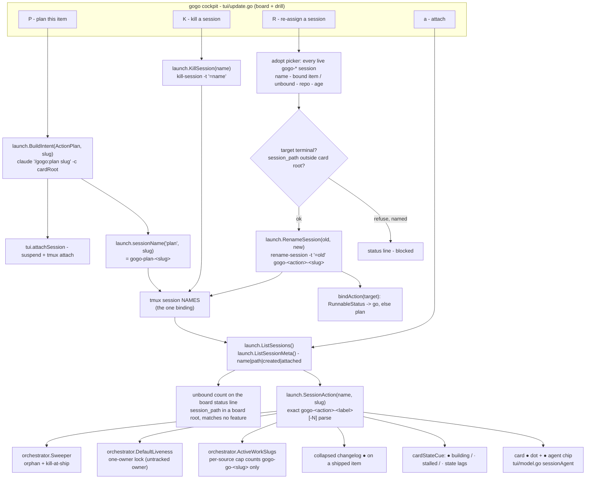
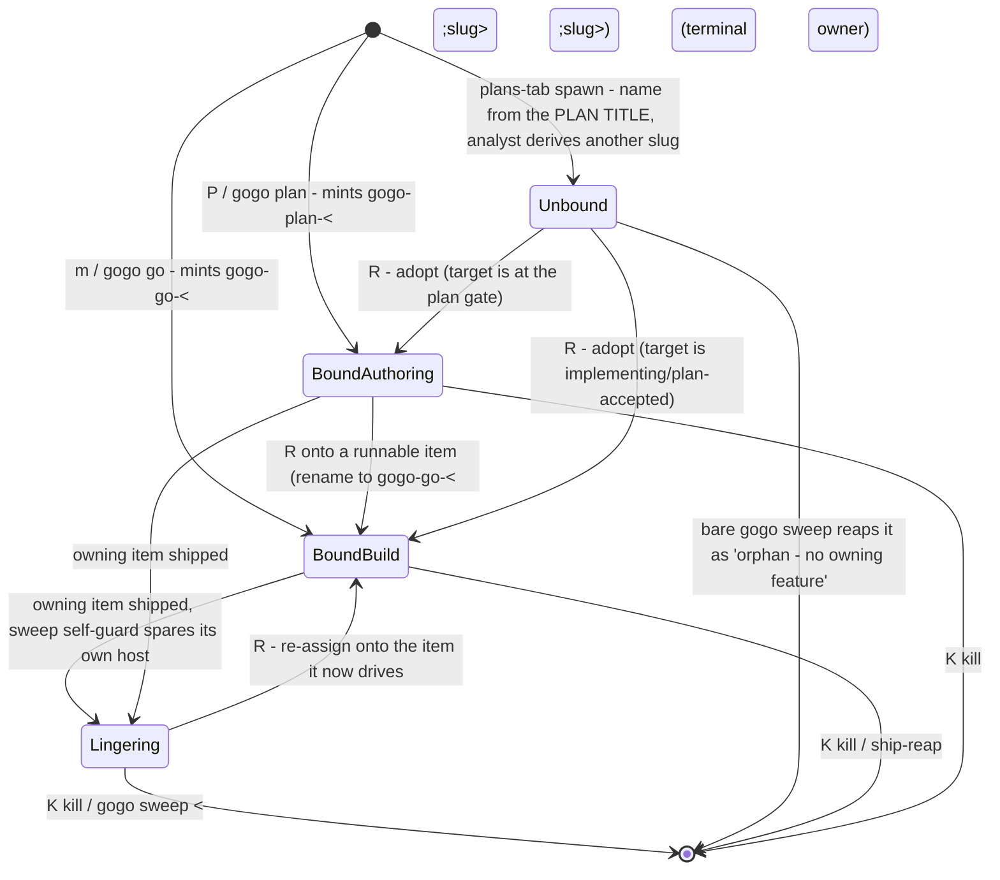

# Plan — session binding ops (start · kill · re-assign)

Status: **accepted** (user, 2026-08-01)

As-built 2026-08-01 (0.32.0): shipped as planned through ②–⑤ — review clean after 2
rounds (7 findings, all fixed; the first 5 verified by mutation), test green incl. the
real-tmux hands-on row. One marked correction: FR4/REV-003 — a shipped card's chips are
`[K]` only (see the note in FR4). Full detail: `report/report.md`.

**A gogo tmux session is bound to a work item by exactly one thing: its NAME.**
`gogo-<action>-<slug>` is minted once, at launch, from a label the launcher guessed —
and nothing in the tree can ever re-derive it. So when a human retasks a live session
onto a different item (the reported incident), the board keeps narrating the old
binding: the shipped card still shows `●`, the item actually being built shows
`· stalled`, and the concurrency cap does not count the real build. This plan makes the
binding **editable from the cockpit**: `P` starts a plan session for a card in an
attached tmux pane, `K` kills a chosen session from the board, and `R` re-assigns a live
session onto the item it is really driving — one `tmux rename-session`, after which
every reader corrects itself.

## Goal

Give the cockpit three session-binding operations, per work item:

1. **Start** a tmux session with claude inside, running `/gogo:plan` for the focused item.
2. **Kill** a *selected* session when one ticket holds several.
3. **Move / re-assign** a live session from one ticket to another.

**Acceptance signal:** on a real board, pressing `P` on a card opens an attached tmux
pane running `/gogo:plan <slug>`; pressing `R` on a `· stalled` card and choosing the
session that is really building it makes — within one session tick — the stalled cue
clear, the `●` dot and `● developer` chip appear on that card, the *old* card's `●`
disappear, and the per-source concurrency cap count the session; pressing `K` on a card
with two sessions offers a picker and kills only the chosen one. `gofmt`/`go vet`/
`go test -race ./...` stay green.

## Context — how a session is bound today, and why the incident happened

### The binding is the session name, and nothing else

Every session-aware reader in the CLI starts from `launch.ListSessions()` (a
`tmux list-sessions -F '#{session_name}'` filtered to `gogo-*`) and asks one question:

```go
// cli/internal/launch/launch.go:863
func SessionAction(session, slug string) (Action, bool)   // parses gogo-<action>-<label>[-N]
```

`SessionMatchesSlug` is a one-line delegation to it. The name itself is minted **once**,
at launch, by `sessionName(action, label)` (`launch.go:739`) → `"gogo-" + action + "-" +
sanitizeLabel(label)`. There is **no registry lookup, no cwd check, no pid mapping** in
the read path — `.gogo/resources/cli/sessions/<slug>.json` tracks the *resume uuid* and a
recorded tmux name for the persistent-session legs, but the board's dot, the agent chip,
the cues, the cap, the lock's liveness cross-check and the sweeper all derive from the
**name**:

| Reader | Where | Derives from |
|---|---|---|
| card `●` dot, `● <agent>` chip | `tui/model.go:1086` `sessionAgent`, `tui/view.go:615` | `HasSessionAction(slug, sessions, …)` |
| `● building` / `· stalled` / `· state lags` cues | `tui/model.go:1125-1310` `cardStateCue` | same |
| collapsed changelog `●` on a shipped item | `tui/view.go:302` `hasLiveSession(slug, m.sessions)` | same |
| per-source concurrency cap | `orchestrator/cap.go:112` `ActiveWorkSlugs` → `liveBuildSession` | `HasSessionAction(slug, …, ActionGo)` |
| one-owner lock liveness | `orchestrator/lock.go:46` `DefaultLiveness` | `SessionMatchesSlug` |
| `gogo sweep` orphan / kill-at-ship | `orchestrator/sweep.go:129` `owningFeature` | `SessionMatchesSlug` |

**Consequence:** a session's binding is frozen at birth. A human can retask the claude
inside it in seconds; the name — and therefore every reader — cannot follow.

### The incident, reproduced from the code

1. The user shipped item **A** with `/gogo:done`. `gogo-done`'s step 6 runs a targeted
   `gogo sweep <A>` — but the sweeper's **self-guard** (`sweep.go:57`, contract
   `docs/cli-contract.md:238-247`) never reaps *the session it is hosted in*. When the
   ship runs inside A's own pane, **that pane survives by design** — the contract already
   records this as "a known limitation of self-reaping".
2. Inside that surviving session the user typed `/gogo:plan …` and then went on to
   implement, creating item **B**. B's `state.md` reached `implementing`.
3. The board now reads: B has status `implementing` and **no** `gogo-*-B` session →
   `stalledPhase` (`model.go:1144`) → **`· stalled`**, no dot, no agent chip. A is
   `shipped`, sits in the collapsed changelog, and **still matches** the live
   `gogo-…-A` name → the `●` the user saw on a shipped item.

Both halves are the same fact seen from two ends: the session's name still says A.

### It is not only the retasking path

A plan spawned from the plans tab names its session after the **plan title**
(`launch.PlanIntent` → `sessionName("plan", label)`), while the analyst derives the real
feature slug from the goal — they almost never match. This host has a live example right
now:

```
gogo-plan-catalogue-side-of-the-matching-engine---normalise-store-embed-hard-filter
    session_path = /Users/bartlomiej.zawadzki/repos/dotai
    work items there: feature-catalogue-ingestion, feature-catalogue-real-source, …
```

That session is bound to **no** work item. It shows on no card — and a whole-board
`gogo sweep` in that repo would classify it *"orphan — no owning feature"* and kill a
live analyst without confirmation.

### What already exists (do not rebuild it)

- **A per-session kill picker** — but only in the **drill** (`K`, `tui/update.go:696`
  `killDrill` → `startKillPicker`): 1 session → a confirm, ≥2 → one / all N / cancel.
  The board's key map (`update.go:244` `updateBoard`) has **no `K`** at all, so the user
  must drill in first — and nothing on the board says so.
- **An attach picker** for ≥2 sessions (`attachFeature`, `update.go:597`).
- **A persistent plan leg**, `gogo plan <slug> [--attach]` (`cli/go.go:279`) — but it is
  a *shell* command, headless unless `--attach`, and there is **no cockpit key** for it.
  The board's `m` never produces `ActionPlan`; the refusals that say *"run `gogo plan
  <slug>`"* (`move.go:254` `planReadinessBounce`) send the user out of the cockpit.
- **Launch/attach plumbing to copy**: the plans-tab `A` launches then **suspends the TUI
  and attaches** (`planAuthorLaunchedMsg`, `update.go:146`), which is exactly the shape
  `P` needs.
- **tmux facts, verified on this host (tmux 3.7b):** `rename-session [-t target-session]
  new-name` exists (`tmux list-commands`); `-t` is a *session target* so it takes the
  exact `=<name>` form (`launch.exactTarget`) while `new-name` is a bare NAME (like
  `new-session -s`); `list-sessions -F '#{session_path}'` returns the launch anchor
  (`-c root`), i.e. the repo a session belongs to.

## Functional requirements

### FR1 — `P`: plan this item in an attached tmux session

- **Board and drill** gain `P` on the focused card: a confirm (`launch.PermissionSummary`
  as today), then `launch.BuildIntent(ActionPlan, [slug])` → `claude "/gogo:plan <slug>"`
  in a detached tmux session **anchored at the card's own root** (`m.rootFor(f)`), then
  the TUI **suspends and attaches** to it (the plans-tab `A` path).
- Session name is `gogo-plan-<slug>` — the slug is real, so the binding is **exact by
  construction**; the card's `●` dot and `● analyst` chip appear immediately.
- Guards, each naming its unblock: terminal status → *"`<slug>` is shipped — nothing to
  plan"*; an existing live `gogo-plan-<slug>` → **attach that one** instead of minting a
  second; no `claude` on PATH → blocked; no tmux → the existing backgrounded `claude -p`
  + log fallback, with the log path in the status line.
- Uncapped (planning never touches the working tree — the same rule `gogo plan` uses) and
  lock-free, exactly like every other board launch.

### FR2 — `K` on the board: kill a *selected* session

- The drill's kill path is promoted to a shared `killFeature(f)` and bound to `K` on the
  **board** as well — including a focused **changelog/shipped** card, which is where a
  lingering session shows up.
- Behaviour is the existing one, unchanged: 0 → a blocked hint; 1 → the Enter-safe
  confirm (the destructive half of the confirm-default convention); ≥2 → the picker
  (one / all N / cancel) killing by **exact** name.
- Bug fixed in passing: `cancelForm` infers the picker's origin from `m.drill != nil`
  (`update.go:549`), which is stale for a board-originated picker — a cancel would land
  the user in a drill they never opened. Replace `pickerFromDrill bool` with one
  `pickerOrigin mode` set where the picker starts.

### FR3 — `R`: re-assign a live session onto this work item

- `R` on a focused card (board + drill) opens a Select of **every live `gogo-*` session**,
  each row reading `name · <bound item | unbound> · <repo> · <age>`, plus Cancel. The
  choice is the confirmation (the kill picker's shape) — no second confirm.
- The chosen session is **renamed**:
  `tmux rename-session -t "=<old>" gogo-<action>-<targetSlug>` (collision-suffixed by the
  existing `uniqueSession`).
- **The action component is derived from the target's status** — `RunnableStatus`
  (`plan-accepted`/`implementing`/`reviewing`/`testing`) → `go`, else `plan` — and the
  picker shows the resulting name, so the user sees that adopting a building item mints a
  **build** session and therefore **counts against the source cap** (D4).
- Refusals, all named: the target is terminal (*"nothing to drive"*); the session's
  `session_path` is not inside the target's root (*"that session is anchored at X, this
  card lives in Y"* — a claude anchored elsewhere cannot write this item, and a false `●`
  is worse than none); the session is already bound to this slug; no tmux / no sessions.
- **Nothing else is written.** No pipeline state (renaming a tmux session is not a state
  write), and no registry rewrite (D3=A): the old card's tracked leg simply renders
  `stale`, which is true — its session is gone from *its* point of view.
- One action fixes both ends of the incident: the moved name stops matching A (the
  changelog `●` disappears) and starts matching B (dot, agent chip, cap, `a`/`l`/`K`
  targeting, and the one-owner lock's untracked-owner refusal for a second `gogo go B`).

### FR4 — the cockpit says when a session is bound to nothing

- New pure reader `launch.ListSessionMeta()` →
  `[]SessionMeta{Name, Path, Created, Attached}` from
  `tmux list-sessions -F '#{session_name}|#{session_path}|#{session_created}|#{session_attached}'`,
  with a pure parser for tests. `ListSessions()` is untouched, so every existing reader
  stays byte-for-byte.
- The idle board status line gains a count of **unbound** sessions — live `gogo-*`
  sessions whose `session_path` is one of the roots this board shows and which attribute
  to **no** feature there (the `gogo-plan-<plan title>` case, and a retasked session
  before it is adopted).
- Footer chips follow the symptom: a `· stalled` card offers `[R] adopt`; a shipped card
  holding a session offers `[K] kill`; a non-terminal card offers `[P] plan`.
  *(Implement-time correction, REV-003: the original text also gave the shipped card an
  `[R] re-assign` chip, but FR3 refuses a terminal TARGET by design — so that chip was a
  guaranteed bounce. The shipped card keeps `[K]` only; the re-assign of its lingering
  session happens via `R` on the card it should drive, which the unbound count and the
  terminal refusal text both point at.)*

### FR5 — the ship names the pane it cannot reap

`skills/gogo-done/SKILL.md` step 6 (the targeted ship-reap) gains one printed line when
`$TMUX` is set: this pane's own session is spared by the sweeper's self-guard, so quit it
when you are done — or re-assign it to another item from the cockpit (`R`). Text only;
no behaviour and no safety property depends on it.

## Approach

**Rename the name.** The binding is a string that every reader re-derives on each tick;
making that string editable is the whole feature. `R` is one `tmux rename-session`
through a new `launch.RenameSession` seam — no new state, no contract change, nothing to
keep in sync, and it composes with every existing rule (cap, lock, sweep, cues) *because*
they all parse the same name. `P` and `K` are the two missing keys around it: `P` mints a
correctly-named session so the user never has to retask an old pane, and `K` prunes the
ones they no longer want, from where they see them.

**Alternatives considered**

| Option | Why not |
|---|---|
| **A registry-based binding** (`sessions/<slug>.json` becomes the source of truth, name is cosmetic) | Rewrites every reader, and the registry is written by the *launcher* — a board-launched or hand-started session has none (this host: 4 live sessions, 0 registry files in that repo). The name is the one signal that always exists. |
| **Auto-rebind** (detect that a session moved to another item) | There is **no deterministic item-level signal**: `session_path` gives the repo, nothing gives the work item. A heuristic ("one stalled card + one unbound session") guesses, and this repo's NFR is explicit — *prefer degrading to MISSING over WRONG*. Manual move + a visible unbound count is the honest form (D2). |
| **Teach the skills to rename their own host session at entry** | Prose enforcement of a binding rule. The 0.29.0 evidence in `coding-rules.md` is that the phase-entry write was skipped on **all three** of its live runs; a binding that depends on it would be a new silent lie. Recorded as a possible future *addition*, never the mechanism. |
| **Auto-detach at ship** (rename the spared pane to a neutral name) | It would make that session an **orphan** by `sweep.go`'s own rule, so a later bare `gogo sweep` reaps a live claude with no confirmation. Keep the truthful name; make it actionable (D6). |
| **A full-screen sessions panel / a `gogo session` verb** | Both are bigger surfaces than the ask: the panel needs a new mode (and the tabs do not exist on a lone repo — where this incident happened), the verb costs a four-place enumeration sync. The card-anchored keys cover every flow the user described (D5). |

### Intended design

The three ops all write **one string** — the tmux session name — and every reader
re-derives from it (`charts/flow.mmd`):



Adopting a retasked session, end to end (`charts/sequence.mmd`):

```mermaid
sequenceDiagram
  autonumber
  actor U as user
  participant TM as tmux
  participant BD as gogo board (tui)
  participant LA as launch (SessionAction)
  participant CAP as orchestrator cap

  Note over TM: pane 'gogo-go-item-a' survives item-a's ship<br/>(sweeper self-guard spares its own host)
  U->>TM: types /gogo:plan then /gogo:go inside it -> item-b reaches implementing
  BD->>LA: SessionAction("gogo-go-item-a", "item-b")
  LA-->>BD: no match
  BD-->>U: item-b '· stalled', item-a (shipped) still shows ●

  U->>BD: R on item-b
  BD->>TM: list-sessions -F name|path|created|attached
  TM-->>BD: gogo-go-item-a | /repos/gogo | ...
  BD-->>U: picker: 'gogo-go-item-a - bound: item-a (shipped) - gogo - 2h'
  U->>BD: choose it
  BD->>BD: bindAction(item-b): implementing -> ActionGo
  BD->>TM: rename-session -t '=gogo-go-item-a' gogo-go-item-b
  TM-->>BD: ok

  Note over BD: next session tick (5s) - every reader re-derives from the NEW name
  BD->>LA: SessionAction("gogo-go-item-b", "item-b")
  LA-->>BD: (go, true)
  BD->>CAP: ActiveWorkSlugs(repo, root, sessions)
  CAP-->>BD: [item-b] - the live build is counted again
  BD-->>U: item-b ● developer (stalled cleared); item-a's changelog ● gone
```

And the states a session moves through (`charts/state.mmd`):



The as-is baseline — today's un-editable binding and the incident's failure path — is
captured separately in **`charts/before/`** (`flow.mmd`, `sequence.mmd`).

## Changes checklist

In build order:

1. **`cli/internal/launch/launch.go`** — `RenameSessionArgs(old, new)` (`{"rename-session",
   "-t", exactTarget(old), new}`) + `RenameSession` via the existing `runTmux` (typed
   `TmuxError`); `SessionMeta` + `ListSessionMeta()` + the pure `parseSessionMeta` line
   parser. No change to `sessionName` / `SessionAction` / `ListSessions`.
2. **`cli/internal/tui/model.go`** — a `renamer` seam (defaults `launch.RenameSession`,
   the `killer`/`launcher` pattern); `sessionMeta []launch.SessionMeta` refreshed
   alongside `m.sessions` (session tick + reload); `pendingAdopt`/`pendingPlanSession`
   form state; `pickerFromDrill` → `pickerOrigin mode`.
3. **`cli/internal/tui/session_ops.go` (new)** — `bindAction(f)`, `boundSlug(name,
   features)`, `unboundSessions(...)`, `adoptFeature` / `startAdoptPicker` /
   `finishAdopt`, `planFeature` (the `P` launch→attach), and `killFeature` moved out of
   `update.go` (drill `K` delegates to it).
4. **`cli/internal/tui/update.go`** — board `P`/`K`/`R`, drill `P`/`R`; `updateForm`
   completion routing for the two new `pending*` paths (same if-chain shape) and
   `formPreservesSelection`; the `cancelForm` origin fix.
5. **`cli/internal/tui/view.go`** — footer chips (`[P] plan`, `[K] kill`, `[R] adopt`),
   the `?` all-keys line, and the unbound count on the idle status line.
6. **Enumeration-sync (grep before hand-off):** `cli/main.go` `printHelp` *board keys* +
   *drill-in keys* blocks · `README.md` board/drill bullets (~L370-400) ·
   `skills/gogo-cli/SKILL.md` *Board keys* / drill prose · `docs/cli-contract.md` a
   **"Changed in 0.32.0"** additive note (no `.gogo/` key added or changed; the session
   **name** remains the binding; rename/kill are CLI-owned tmux acts, never pipeline
   state).
7. **`skills/gogo-done/SKILL.md`** step 6 — the FR5 line.
8. **`.claude-plugin/plugin.json`** + `cli/main.go` `Version` → **0.32.0** (mirrored by
   `TestVersionMirrorsPlugin`; 0.31.0 belongs to the in-flight
   `feature-notify-only-at-user-gates` — see D7).
9. **Phase ⑤ knowledge reconcile** — a `project-knowledge.md` `## gogo overrides` entry.

## Tests

| Level | What |
|---|---|
| unit — `cli/internal/launch` | `RenameSessionArgs` uses the exact `=<name>` **session** target and a bare new NAME (the guard that stopped a prefix target killing the wrong session); `parseSessionMeta` over a fixture (including a garbled line → skipped, never a crash). |
| unit — `cli/internal/tui` | `P` fires the launcher **exactly once** with `/gogo:plan <slug>` at the card's own root, then attaches (status observable `attaching gogo-plan-<slug>`); its refusals (terminal, no claude, already-live→attach). `K` on the board: the 0/1/≥2 arms, and a cancel returning to the **board** (the `pickerOrigin` fix). `R`: the renamer seam records exactly (old → `gogo-<derived action>-<slug>`), the derived action per status, and each refusal (terminal target, foreign `session_path`, already bound). The unbound count + the footer chips render. |
| guard | `TestBoardKeyHelpInSync` — reuse the existing `switchKeys` AST parser (`tui/plans_view_test.go:999`) over `updateBoard`/`updateDrill` and assert every handled key appears in **both** the `?` all-keys line and `cli/main.go`'s board/drill key blocks, so a new key can never ship undocumented. |
| phase ④ (real tmux, this host) | Start a plan session with `P` and confirm the pane runs `/gogo:plan <slug>`; retask a session by hand, adopt it with `R`, and watch the stalled cue clear, the dot/agent chip move, the old card's `●` vanish and the cap count it; `K` on a two-session card kills only the chosen one. Also verify the live unbound `gogo-plan-catalogue-…` session is reported as unbound rather than invisible. |
| gates | `cd cli && gofmt -l . && go vet ./... && go test -race ./...` green. |

### The behaviour, as scenarios

```gherkin
Feature: session binding ops in the gogo cockpit
  As a developer running several gogo sessions
  I want to start, kill and re-assign the tmux sessions behind my work items
  So that the board tells the truth about who is working on what

  Background:
    Given the gogo board is open on a repo with tmux and claude available

  Scenario: start a plan session for the focused item
    Given the focused card "session-binding-ops" is not shipped
    When I press "P" and confirm the launch
    Then a tmux session named "gogo-plan-session-binding-ops" runs claude "/gogo:plan session-binding-ops" anchored at that card's repo root
    And the TUI suspends and attaches me to it
    And the card shows a green session dot and the "analyst" agent chip

  Scenario: P on a card that already has a live plan session attaches instead of duplicating
    Given "gogo-plan-session-binding-ops" is already live
    When I press "P" on that card
    Then no new session is created
    And I am attached to the existing one

  Scenario: kill one of several sessions from the board
    Given the focused card holds "gogo-go-item-b" and "gogo-plan-item-b"
    When I press "K"
    Then I am offered each session by name, plus "all 2 sessions" and "Cancel"
    And choosing "gogo-plan-item-b" kills exactly that session
    And no pipeline state is written

  Scenario: cancelling a board-level kill returns to the board
    Given I previously drilled into another card and came back
    When I press "K" on the board and choose "Cancel"
    Then I am back on the board, not inside a drill I did not open

  Scenario: re-assign a retasked session onto the item it is really driving
    Given item-a is shipped and still carries the live session "gogo-go-item-a"
    And item-b reads "implementing" with no session, showing "· stalled"
    When I press "R" on item-b and choose "gogo-go-item-a"
    Then the session is renamed to "gogo-go-item-b"
    And item-b shows the live dot and the "developer" chip, and its stalled cue clears
    And the shipped item-a no longer shows a session dot in the changelog
    And the per-source concurrency cap counts item-b as building

  Scenario: adopting is refused when the session cannot possibly drive that item
    Given the live session "gogo-plan-catalogue-side-of-the-matching-engine" is anchored at another repo
    When I press "R" on a card in this repo and choose it
    Then the move is refused, naming the session's repo and the card's repo
    And nothing is renamed

  Scenario: a session bound to nothing is visible
    Given a live "gogo-*" session in this repo attributes to no work item
    Then the board's status line reports it as unbound
    And the stalled card's footer offers "[R] adopt"
```

## Out of scope

- A `gogo session` CLI verb and a full-screen sessions panel (D5) — the cockpit keys are
  the ask; both remain clean follow-ups.
- Minting a **brand-new** work item from a typed goal on the board (D1) — today's path is
  `gogo plan <new-slug> --attach`.
- Automatic re-binding of any kind (D2), and any change to `classify()`, the status enum,
  the class→column mapping, or the frozen `.gogo/` contract.
- A picker for `l` (peek) when a card holds ≥2 sessions; the cross-repo same-slug cap
  over-count (a known, separate limitation).

## Summary (TL;DR)

- **What:** three cockpit session operations — `P` start a `/gogo:plan` session in an
  attached tmux pane, `K` kill a *chosen* session from the board, `R` re-assign a live
  session onto the item it is actually driving — plus a visible count of sessions bound
  to nothing.
- **Why:** a session's binding is its **name**, minted once at launch and never
  re-derivable, so a retasked pane makes the board narrate the past — a shipped card
  showing `●`, the real work reading `· stalled`, and a live build **invisible to the
  concurrency cap** (the working-tree-clobber guard).
- **How:** `R` is one `tmux rename-session` behind a picker; because every reader
  (dot, agent chip, cues, cap, lock, sweep) re-derives from that name, correcting it
  corrects all of them at once. No pipeline-state write, no contract change, no new
  binding store.
- **Open forks:** seven decisions in `decisions.md` — the two that shape the build are
  **D2** (manual re-bind only, with a detector — recommended) and **D4** (the action
  component after a move is derived from the target's status, so the cap stays honest).
- **Next:** accept this plan (or tell me which decisions to flip), then `/gogo:go`
  builds it against the version noted in D7.
