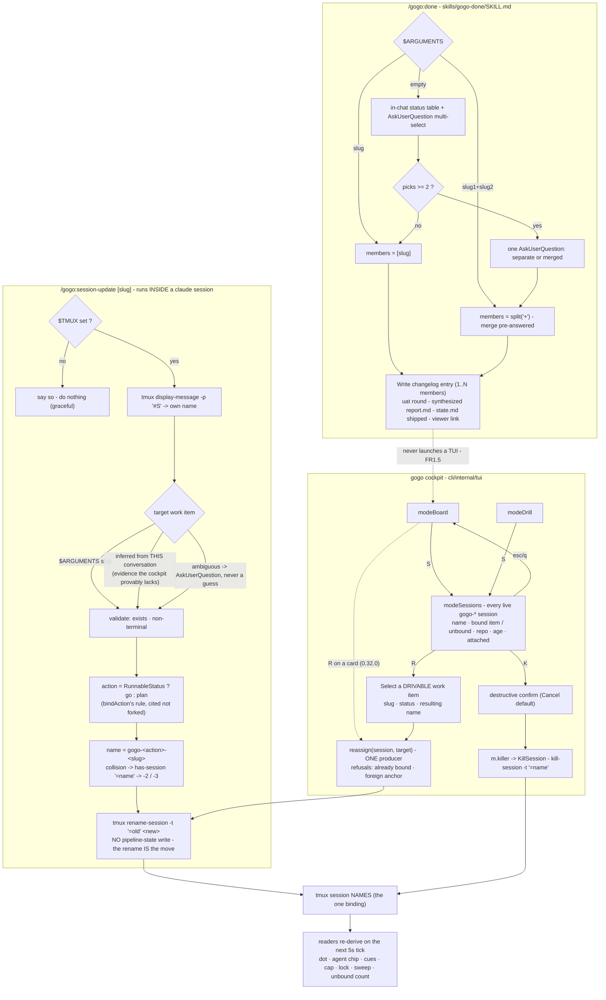

# Plan — sessions-panel-and-no-auto-board

Status: **accepted** (user, 2026-08-01) *(revised round 1 — see `adjustments.md`; D1 confirmed retire, D5=A rename+disclose)*

As-built 2026-08-01 (0.33.0): shipped as planned, all three slices, no deviations —
review approved after 2 rounds (11 findings, all resolved, fixes verified by mutation),
test green incl. real-tmux hands-on of the S panel and the session-update bash contract.
Full detail: `report/report.md`.

**A gogo session's binding to a work item is its tmux name — and that name goes stale the
moment your attention moves.** You ship the item you were on, start a new plan in the same
session, and the board now shows a live session hanging off a **changelog** item while the
**new** item shows none. Today the only repair is a cockpit round-trip. This change gives
that repair three doors — and, on the way, stops `/gogo:done` from hijacking your terminal
with a board nobody asked for.

## Goal

Three changes, one release:

1. **Bare `/gogo:done` never opens an interactive board.** No slug → the four-class status
   table + `AskUserQuestion` multi-select ship, in chat. No tmux pane, no curses, no intent
   file, no relaunch loop. Named-slug and `slug1+slug2` ships are untouched.
2. **`S` opens a sessions panel** in the `gogo` cockpit (board **and** drill) — every live
   `gogo-*` session listed, each **re-assignable** onto a different work item (`R`) or
   **closed** (`K`).
3. **`/gogo:session-update [slug]`** — a new slash command you can run **at any time from
   inside a claude session**: it works out which work item this session is *now* driving
   and **moves its own binding there**, off the shipped item it drifted from.

And it records the standing rule behind all three: **no gogo command opens an interactive
TUI as a side effect of another action.**

**The acceptance signal.** Ship an item, start a new plan in that same session, run
`/gogo:session-update` — the board stops showing the session on the changelog card and
starts showing it on the new item. And `/gogo:done` with no slug ships without ever taking
over the terminal.

## Context — what exists today

### The drift, precisely

A session is bound to a work item by **exactly one thing: its tmux name**
(`gogo-<action>-<slug>`), minted once at launch by `launch.sessionName` and re-derived by
every reader on every tick — the card dot, the agent chip, the `building`/`stalled` cues,
the per-source concurrency cap, the owner lock's liveness cross-check, and the sweeper.

Nothing re-mints that name when the work moves on. So the reported sequence produces two
wrong answers at once:

| Step | What the board shows |
|---|---|
| working on item A in session `gogo-done-A` | `● A` — correct |
| A ships → A moves to the changelog column | `● A` on a **changelog** card — a shipped item holding a live session |
| you start a new plan for item B **in that same session** | B shows **no session at all** — "some plans without sessions assigned" |

Both symptoms are the same stale string. 0.32.0 shipped the cockpit-side repair (`R` on a
card); this feature adds the two doors that were missing — a place that **lists** sessions,
and a way for a session to **correct itself from the inside**.

### Who actually knows what the session is doing

0.32.0's D2 rejected automatic re-binding with a finding that is still true:

> there is **no deterministic item-level evidence** — `#{session_path}` gives the repo,
> nothing gives the work item

That is true **for the cockpit**, which can only see tmux metadata. It is *not* true for
the **claude running inside the session**, which has the conversation that created the
plan. `/gogo:session-update` is the door that supplies exactly the evidence the cockpit
lacks — which is why it can be explicit **without guessing**.

It is also the honest form of 0.32.0's rejected **D2=C** ("teach `/gogo:plan` / `/gogo:go`
to rename their own host session at entry"). That was rejected because it is LLM prose
enforcement, and the analogous phase-entry write *"was skipped on all three of its live
runs"*. The difference: this is **user-invoked, on demand**. If you run it, it runs; if you
don't, nothing silently breaks — the board simply keeps showing what it showed. **No safety
property depends on an LLM remembering.**

### The done-board (slice 1's target)

`skills/gogo-done/SKILL.md` §*Board mode (no slug)* is ~130 lines: build a work-index,
detect `python3` + `tmux` + a tty, copy `assets/kanban/board.py` into
`.gogo/resources/kanban/`, launch it in a tmux window, block on a `wait-for` channel, read
`board-exit.code`, parse `board-intent.json` (schema v2), route the intent
(`view`/`ship`/`ship-merged`/`go`), **relaunch the board**. `board.py` is 625 lines of
vendored stdlib curses with an exit-code contract (`0` action · `1` cancel · `2` error).

Two facts shape the plan:

- **The skill already carries a complete non-interactive path.** Steps 4 + 5 render the
  same four-class table in chat, offer ready-to-ship items via `AskUserQuestion`, and hand
  the picks to the one entry-writer. Slice 1 is mostly a **deletion**.
- **Nothing else launches a bare `/gogo:done`.** The cockpit's `d` builds
  `launch.BuildIntent(launch.ActionDone, slugs, …)`, whose command is always
  `"/gogo:done " + strings.Join(slugs, "+")` — a **named** ship. Retiring board mode cannot
  break it.

Meanwhile the **`gogo` binary has been the interactive cockpit since 0.10.0** and is a
strict superset of `board.py`'s keys, in milliseconds, with no relaunch loop.

### The machinery all three slices reuse (shipped yesterday in 0.32.0)

| Piece | Where | What it gives us |
|---|---|---|
| `launch.ListSessionMeta()` / `SessionMeta` | `launch.go:961-1008` | every live `gogo-*` session as `name / path / created / attached` |
| `boundFeature` · `unboundSessions` · `pathWithinRoot` · `sessionAge` · `adoptRow` | `tui/session_ops.go` | attribution (exact convention parse, never substring — TEST-005) + the row renderer |
| `bindAction(f)` | `session_ops.go:34` | the action a moved session takes: `RunnableStatus` → `go`, else `plan` (0.32.0 D4=A) |
| `m.renamer` → `launch.RenameSessionUnique` | `model.go:375` / `launch.go:1197` | the re-assign primitive + the `-2`/`-3` collision suffix |
| `m.killer` → `launch.KillSession` | `model.go:367` / `launch.go:1145` | the close primitive (exact `-t "=<name>"`) |
| `adoptFeature` / `finishAdopt` | `session_ops.go:278-389` | the card-anchored `R`, with named refusals |
| `pickerOrigin` | `model.go:344` | a picker returns to the mode it was opened from |
| `launch.CurrentSession()` | `launch.go:1016` | the in-session self-identification (`display-message -p '#S'`) slice 3 mirrors in bash |

**0.32.0 decided D5 = "card keys only, no sessions screen"**, noting *"revisit B if managing
cross-repo orphans becomes a habit"*. It became a habit. This feature reverses D5
deliberately, with that decision cited.

### The name contract slice 3 must reproduce exactly

`sessionName(action, label)` = `"gogo-" + action + "-" + sanitizeLabel(label)`, where
`sanitizeLabel` lowercases, replaces `[^a-z0-9-]+` with `-`, trims `-`, caps at
**`MaxSessionLabel = 48`** (cutting on a `-` boundary only when that boundary is past 24,
else a hard cut), and maps empty → `run`. **For a real work-item slug** — already
`[a-z0-9-]` by construction — this reduces to `gogo-<action>-<slug>`, with the cap the only
non-identity step. Safety net: `SessionMatchesSlug` also keeps the **uncapped** form as a
second candidate base (REV-009), so even a >48-char slug still attributes if the cap is
missed — a missed cap degrades to *working*, never to *misattributed*.

### Measured tmux facts (verified on this host, tmux 3.7b, in the pane — not inferred)

| Fact | Evidence |
|---|---|
| A session **can rename itself from inside** | in-pane: `display-message -p '#S'` → `gogo-verify-self`; `rename-session -t "=gogo-verify-self" gogo-plan-target` → `rc=0`; `display-message -p '#S'` → `gogo-plan-target` |
| A rename onto a **live duplicate** is refused, never a clobber | `rc=1`, stderr `duplicate session: gogo-coll-b`; both sessions survive unchanged |
| `-t` resolves exact → prefix → fnmatch | already recorded in `tech-stack.md`; the `=<name>` exact form is mandatory (TEST-005 / FR1.5) |

The second fact is load-bearing: the skill must **pre-check and suffix**, not assume.

### The cockpit's shape the panel must fit

`cli/internal/tui` is a Bubble Tea model with four modes (`modeBoard`, `modeDrill`,
`modeViewer`, `modeForm` — `model.go:34`), dispatched in `Update` (`update.go:185`) and
`View` (`view.go:19`). `modeDrill` is the precedent for a full-screen panel: header,
sections, a cursored list, the status line, a faint key-help footer const. Every `huh` form
goes through `newForm()` (0.30.0); mutable form targets live behind the heap-stable
`*formBinding` (TEST-001).

**The enumeration trap lives inside the model too.** A new `pending*` form path must be
added in **five** places or it half-works: the field declaration (`model.go`), the
`StateCompleted` dispatch chain (`update.go:479-534`), `cancelForm`'s `returnMode` list
(`update.go:582`), `cancelForm`'s clear list (`update.go:594-604`), and
`formPreservesSelection` (`update.go:562`). Miss the third and Esc bounces to the board
instead of back to the panel.

`boardAllKeysLine` / `drillKeysLine` (`view.go:806-807`) are cross-checked against
`cli/main.go`'s printed key blocks **and** against the keys parsed out of `updateBoard` /
`updateDrill` by `TestBoardKeyHelpInSync` — which is exactly why **D2=C is free**: both
handlers are already guarded cases.

## Functional requirements

### FR1 — bare `/gogo:done` ships in chat, never in a TUI

1. **FR1.1** With **no slug**, `/gogo:done` renders the four-class work-index table
   (shipped · ready-to-ship · in-progress · unfinished) in chat and offers the
   **ready-to-ship** items via one `AskUserQuestion` multi-select, then applies the existing
   merge gate and the one entry-writer. **No** `python3`, `tmux`, curses, intent file, exit
   file, or relaunch loop.
2. **FR1.2** `/gogo:done <slug>` and `/gogo:done slug1+slug2+...` are **byte-for-byte
   unchanged**, including the merged-release-name confirm.
3. **FR1.3** Zero work items → say so and stop (unchanged). Items but **none** ready → still
   show the table, say plainly nothing is shippable, point at `/gogo:report <feature>`.
4. **FR1.4** Because `v`/`g` disappear with the board, the in-chat flow **names their
   replacements**: `/gogo:view <slug>`, `/gogo:go <slug>`, and the `gogo` cockpit.
5. **FR1.5** **Standing rule, recorded in the skill prose:** no gogo command may open an
   interactive terminal UI as a side effect of another action.

### FR2 — the done-board machinery is retired (**D1**)

1. **FR2.1** `skills/gogo-done/SKILL.md` loses the *Board mode* TUI path, the intent-routing
   table, the schema-v2 intent + exit-code prose, and the `.gogo/resources/kanban/` rows in
   its Inputs/outputs table. The *Fallback path* is promoted to **the** no-slug path;
   *Degradation* drops its board clauses.
2. **FR2.2** Every surface that enumerates board mode follows: `commands/done.md`,
   `skills/gogo/SKILL.md` §*Ship*, `skills/gogo-status/SKILL.md`'s cross-ref, `README.md`
   (the `/gogo:done` section, the `/gogo:status` cross-ref, the `.gogo/resources/` tree
   note), `docs/commands.md`, `docs/flow.md`, `docs/architecture.md`.
3. **FR2.3** `assets/kanban/board.py` and the `.gogo/resources/kanban/` scratch are deleted.
4. **FR2.4** A **durable guard** replaces the prose promise: a Go test scans every
   `skills/*/SKILL.md` + `commands/*.md` and fails if `board.py` or `board-intent`
   reappears — same shape as `TestSkillsBashNoUnsafeRm`, **anti-vacuity floor included**
   (an empty scan must fail loudly).

### FR3 — `S` opens the sessions panel (board **and** drill — D2=C)

1. **FR3.1** `S` (in `updateBoard` **and** `updateDrill`) opens a full-screen sessions panel
   (`modeSessions`) listing **every** live `gogo-*` session from the cached `m.sessionMeta`
   — not just this repo's. Rows reuse the existing `adoptRow` renderer
   (`name · bound: <slug> (<status>) | unbound · <repo> · <age> [· attached]`) so the two
   session lists cannot drift.
2. **FR3.2** `S` **always opens** — an empty panel names why it is empty (`tmux not
   installed` / `no live gogo-* sessions`), so the key never reads as a dead no-op. Rows
   come from cached meta: **no disk/tmux IO on the render path**.
3. **FR3.3** Keys: `↑↓`/`jk` cursor · `R` re-assign · `K` close · `esc`/`q` back **to
   wherever `S` was pressed** (board or drill — `pickerOrigin`'s rule, applied to the panel
   itself).
4. **FR3.4** The panel is **live**: the existing 5-second `sessionTick` refreshes
   `m.sessionMeta` in every mode, so rows appear/vanish without a keypress; the cursor
   **clamps** when the list shrinks.
5. **FR3.5** Read + tmux ops only — it never writes pipeline state.

### FR4 — `R` re-assigns the highlighted session onto another work item

1. **FR4.1** `R` opens a `huh` Select of every **drivable** (non-terminal) work item, each
   option reading `<slug> · <status> · → <resulting session name>` (the name `bindAction`
   derives for that target), plus **Cancel**. Cancel and Esc both return to the panel.
2. **FR4.2** The choice applies **the same refusals as the card-anchored `R`**, each naming
   its reason and its unblock: *already bound to that item* → nothing to move; *session
   anchored outside the target's repo* → a claude working elsewhere cannot drive this item.
   Drivable targets are **all shown**, never silently filtered — a refusal explains, a
   missing row puzzles (Diagnosability).
3. **FR4.3** On success: rename via `m.renamer` →
   `launch.RenameSessionUnique(old, launch.SessionNameFor(bindAction(target), slug))`;
   refresh; status names `old → new`; the user **stays in the panel**.
4. **FR4.4** **One producer, two entry points.** The refusal chain + rename + status message
   are extracted into a single function that both `finishAdopt` (card `R`) and the panel's
   `R` call — a user-visible rule stated twice must be one constant (TEST-006).
5. **FR4.5** No pipeline state written; the cap, lock, dot, cues and sweeper re-derive from
   the new name on their next tick.

### FR5 — `K` closes the highlighted session

1. **FR5.1** `K` opens the **destructive confirm** naming the exact session, defaulting to
   **Cancel** (the confirm-default convention — forward moves default affirmative,
   destructive ones must not).
2. **FR5.2** Confirm kills via `m.killer` → `launch.KillSession(name)` (exact
   `-t "=<name>"`). The status line carries **tmux's own words** on failure.
3. **FR5.3** After the kill the panel refreshes, the cursor clamps, the user stays. No
   pipeline state written.

### FR6 — enumeration sync for the new key surface

1. **FR6.1** `S` is documented in **both** `boardAllKeysLine` and `drillKeysLine`, and in
   **both** `cli/main.go` key blocks (`board keys:` and `drill-in keys`) —
   `TestBoardKeyHelpInSync` enforces all four from the parsed switches.
2. **FR6.2** The panel's own key line is a const (`sessionsKeysLine`) rendered in its footer
   and mirrored in a new `sessions panel keys` block in `cli/main.go`, guarded by a **new
   case** in `TestBoardKeyHelpInSync` over `updateSessions` — with its **own anti-vacuity
   floor** (the shared floor of 8 is wrong for a smaller switch, so the floor becomes
   per-case).
3. **FR6.3** The narratives follow: `README.md` §*The gogo CLI*, `skills/gogo-cli/SKILL.md`
   §*Board keys*, `docs/cli-contract.md`'s release note.
4. **FR6.4** A chip/hint shares its handler's predicate: the board status line's unbound
   count gains `· S sessions` as its pointer, rendered from the same condition the handler
   honours.

### FR7 — version

Behavioural change → **0.33.0** in `.claude-plugin/plugin.json`, `cli/main.go` `Version`,
and `cli/version_test.go`'s pinned `want` (**D4=A**).

### FR8 — `/gogo:session-update [slug]` — a session re-binds itself, on demand

A new ultra-thin `commands/session-update.md` + `skills/gogo-session-update/SKILL.md`
(markdown, in the plugin — no Go), runnable **at any time**, from inside any claude session:

1. **FR8.1 — resolve the host session.** `$TMUX` unset → say so plainly and **do nothing**
   (graceful degradation, never an error). Else `tmux display-message -p '#S'` yields this
   session's own name. (Bash inside a claude session *can* run tmux — the session is a tmux
   pane; verified in-pane.)
2. **FR8.2 — determine the target work item**, in this precedence:
   - an explicit `$ARGUMENTS` slug **pins** it (validate `.gogo/work/feature-<slug>/`
     exists; unknown slug → stop, listing the near matches);
   - else infer from **this session's own conversation** — the item it has been planning or
     building (the skill runs in-context; this is the evidence the cockpit provably lacks);
   - else, if that is not unambiguous, **ask** via `AskUserQuestion` over the non-terminal
     work items, newest-first. **Never guess** — the repo's MISSING-over-WRONG rule.
3. **FR8.3 — validate the target.** It must exist and be **non-terminal**: re-binding *onto*
   a `shipped`/`aborted`/`done` item is refused with its reason (that is the direction the
   drift already went, and the item has nothing left to drive) — the same `TerminalStatus`
   refusal `adoptFeature` applies.
4. **FR8.4 — derive the action from the target's status, quoting the one rule**:
   `plan-accepted` / `implementing` / `reviewing` / `testing` → **`go`**; anything else →
   **`plan`**. This is `orchestrator.RunnableStatus` as applied by
   `tui/session_ops.go:bindAction` (0.32.0 D4=A) — the skill **cites that source** rather
   than inventing a second rule, because the cap counts only `gogo-go-<slug>`.
5. **FR8.5 — mint the name by the documented contract**: `gogo-<action>-<sanitized-slug>`
   per `launch.sessionName` (lowercase, `[^a-z0-9-]+`→`-`, trim `-`, cap 48 — for a real
   slug this is `gogo-<action>-<slug>`).
   **Collision:** pre-check with `tmux has-session -t "=<name>"` and suffix `-2`, `-3`, …
   exactly like `launch.uniqueSession` — because a rename onto a live duplicate is
   **refused with `rc=1` / `duplicate session: <name>`** (measured), not silently merged.
6. **FR8.6 — rename with the exact target**: `tmux rename-session -t "=<old>" <new>` (`-t`
   is a session target, so `=`; the new name is a bare NAME, never `=`-prefixed).
   **Already correctly named → a no-op**, said plainly.
7. **FR8.7 — write no pipeline state.** The rename **is** the move (0.32.0 D3=A). The old
   card's tracked registry leg truthfully renders `stale`; the lock needs nothing.
8. **FR8.8 — report what changed**: `old → new`, which item now owns the session, and that
   the board corrects itself on its next 5-second tick.

### FR9 — `/gogo:session-update` is enumerated everywhere a command must be

`commands/session-update.md` (new) · `skills/gogo-session-update/SKILL.md` (new) ·
`README.md` command list · `docs/commands.md` · `skills/gogo/SKILL.md` (as an **ops**
command, not a pipeline phase) · `skills/gogo-cli/SKILL.md` (it is the in-session twin of
the cockpit's `R`). There is no automated commands-enumeration guard today — this is a
grep-before-you-finish item.

### FR10 — the three doors agree

The cockpit's `R`, the panel's `R`, and `/gogo:session-update` must produce the **same
name** for the same (session, target) pair — same action derivation, same sanitize, same
collision suffix. The Go side is one producer by construction (FR4.4); the skill **quotes**
that producer's rule and names its source file, so a future change to `bindAction` has one
obvious second place to update.

## Approach

**Three slices, one release.** Slice 1 is markdown-only, slice 2 is Go-only, slice 3 is
markdown-only. They share nothing but the version bump. Build order: **3 → 1 → 2** —
slice 3 is the live pain and the only one that unblocks a workflow already in progress.

### Slice 3 — `/gogo:session-update` (the in-session fix)

The command is ultra-thin per this repo's rule; all logic lives in
`skills/gogo-session-update/SKILL.md`:

```
$TMUX unset ─────────────▶ say so, do nothing (graceful)
     │ set
     ▼
tmux display-message -p '#S'  ─▶ <old session name>
     │
     ▼
target = $ARGUMENTS slug  |  inferred from this conversation  |  AskUserQuestion
     │                                                          (never a guess)
     ▼
validate: folder exists · status non-terminal
     │
     ▼
action = RunnableStatus(status) ? go : plan          (bindAction's rule, cited)
name   = gogo-<action>-<slug>                        (launch.sessionName's transform)
name   = uniquify(name)  via  tmux has-session -t "=<name>"  ─▶ -2 / -3 …
     │
     ▼
tmux rename-session -t "=<old>" <name>     ── no pipeline-state write ──▶ report old → new
```

The skill is pure `Bash` + `Read` (+ `AskUserQuestion` for the ambiguous case) and writes
**nothing** — not even under `.gogo/`. That is unusual for a gogo skill and worth stating
plainly: its entire effect is one `tmux rename-session`.

**Why a skill and not a CLI subcommand.** A `gogo session-update` verb would get the name
transform for free from the one Go producer — but it **cannot do FR8.2's inference**: the
CLI has no idea what the session is talking about, which is the whole reason this door
exists. It would also add a fourth enumeration set (`TestCLICommandEnumerationInSync` gates
`main.go` help + README + `docs/cli-contract.md` + `skills/gogo-cli/SKILL.md`) and a second
code path for the same act. The transform's only non-identity step for a real slug is the
48-char cap, and `SessionMatchesSlug` keeps the uncapped form as a fallback candidate — so
the drift risk is bounded and degrades to *working*.

### Slice 1 — delete the board from the done path

Subtractive: the fallback becomes the path. `gogo-done`'s §*Board mode (no slug)* collapses
to a short §*No-slug mode — the in-chat ship table*: classify (unchanged) → table
(unchanged) → `AskUserQuestion` multi-select (unchanged) → merge gate → the one
entry-writer (unchanged) → name `/gogo:view` / `/gogo:go` / the `gogo` cockpit (FR1.4).
Everything else in the skill — validate-in, the entry writer, the UAT accept round, the
ship-reap, the viewer link — is untouched.

### Slice 2 — `modeSessions`, modelled on `modeDrill`

A new mode, not a nested picker: a picker vanishes after one action, and you asked for
something that *opens and shows* sessions so several can be fixed in a row.

```
board ─S─┐
         ├─▶ modeSessions ──R──▶ modeForm (target Select) ──▶ reassign core ──▶ back
drill ─S─┘                └──K──▶ modeForm (kill confirm) ──▶ killer        ──▶ back
                          └─ esc/q ─▶ whichever mode opened it
```

Both forms record `pickerOrigin = modeSessions`, so Cancel **and** Esc land back in the
panel — which is why `pendingReassign` must join `cancelForm`'s **`returnMode`** list, not
just its clear list. The panel itself remembers its own opener (board vs drill) so `esc`
returns there (D2=C).

**The reassign core is extracted, not duplicated** (FR4.4): `finishAdopt`'s body becomes
`reassign(session string, target *contract.Feature) Model`, and `finishAdopt` becomes a
thin resolver in front of it. One rule, one wording, three doors.

### Alternatives considered

| Alternative | Why not |
|---|---|
| **Keep `board.py` behind `/gogo:done --board`** | Two cockpits stay alive and the whole intent protocol stays maintained. Was D1=B; your *"that's all what we need"* settled it — see D1's note. |
| **Auto-rename on every `/gogo:plan` / `/gogo:go` entry** (0.32.0 D2=C) | Automatic prose enforcement; the analogous phase-entry write was skipped on all three of its live runs. FR8 is the same idea made **explicit and user-invoked**. |
| **Heuristic auto-rebind from the cockpit** (0.32.0 D2=B) | No deterministic item-level evidence; MISSING-over-WRONG. FR8 supplies the evidence instead of guessing at it. |
| **`gogo session-update` as a CLI verb** | Cannot infer the item (see above); adds a fourth enumeration set. |
| **Nested pickers instead of a mode** | ~40 fewer lines, but does not *show* sessions — three sessions means three round-trips. |
| **Filter the `R` target list to same-root items** | Hides the card you are looking for with no explanation; the named refusal teaches. |

## Changes checklist (build order)

### Slice 3 — `/gogo:session-update` (markdown)

1. `skills/gogo-session-update/SKILL.md` (new) — the FR8 steps, the cited `bindAction` rule
   + its source file, the `launch.sessionName` transform, the measured tmux facts
   (self-rename works; duplicate rename is refused `rc=1`), the exact-target forms, the
   no-`$TMUX` degradation, and the "writes nothing" statement.
2. `commands/session-update.md` (new) — ultra-thin: front-matter (`description`,
   `argument-hint: "[feature-slug]"`, `allowed-tools: Read, Bash, Glob, Grep, AskUserQuestion`)
   + load-the-skill body.
3. `README.md` command list · `docs/commands.md` · `skills/gogo/SKILL.md` (ops command) ·
   `skills/gogo-cli/SKILL.md` (the in-session twin of `R`) — FR9.

### Slice 1 — the done path (markdown)

4. `skills/gogo-done/SKILL.md` — replace §*Board mode*; drop the three board rows from the
   Inputs/outputs table; fold in §*Merge gate + write*; rewrite §*Degradation*; update the
   front-matter `description`; add the FR1.5 standing-rule sentence.
5. `commands/done.md` — front-matter `description` + body step 2.
6. `skills/gogo/SKILL.md` §*Ship* (≈ 303-330); `skills/gogo-status/SKILL.md` line 8.
7. `README.md` (≈ 247-275, 291, 628); `docs/commands.md` (≈ 186-236); `docs/flow.md`
   (≈ 122-149); `docs/architecture.md` (≈ 141 / 157 / 173).
8. Delete `assets/kanban/board.py` and the stale `.gogo/resources/kanban/` scratch.
9. New guard `TestNoInteractiveBoardInSkills` (in `cli/`, beside the existing scanners) — FR2.4.

### Slice 2 — the sessions panel (Go)

10. `cli/internal/tui/model.go` — `modeSessions`; `sessIdx int`; `pendingReassign`;
    `sessionsOrigin mode` (board vs drill, for `esc`).
11. `cli/internal/tui/session_ops.go` — `openSessions()`, `focusedSession()`,
    `clampSessIdx()`, the extracted `reassign(session, target)` core, `startReassignPicker`,
    `finishReassignSession`, `startKillSessionForm(name)`; `finishAdopt` re-pointed at the core.
12. `cli/internal/tui/update.go` — `case "S"` in `updateBoard` **and** `updateDrill`;
    `case modeSessions` in `Update`'s KeyMsg dispatch; `updateSessions()`; the
    `pendingReassign` branch in `updateForm`'s `StateCompleted`; **`cancelForm` `returnMode`
    + clear**; `formPreservesSelection`.
13. `cli/internal/tui/view.go` — `case modeSessions`; `viewSessions()`; `sessionsKeysLine`;
    `S sessions` in **both** `boardAllKeysLine` and `drillKeysLine`; the `· S sessions`
    pointer on the unbound-count line (FR6.4).
14. `cli/main.go` — `S` in **both** the `board keys:` and `drill-in keys` blocks; a new
    `sessions panel keys` block; `Version = "0.33.0"`.
15. `cli/internal/tui/key_help_sync_test.go` — per-case anti-vacuity floor + the
    `updateSessions` case.
16. `cli/internal/tui/sessions_panel_test.go` (new) — the suite below.
17. `.claude-plugin/plugin.json` `version` → `0.33.0`; `cli/version_test.go` `want`.
18. `README.md` §*The gogo CLI* + `skills/gogo-cli/SKILL.md` §*Board keys* +
    `docs/cli-contract.md` release note.

### Phase ⑤ reconcile (not implement)

19. `.gogo/knowledge/tech-stack.md` (the `board.py` language entry + the `python3`/`tmux`
    soft-dep clause both become false; add the two measured tmux facts to its tmux section),
    `non-functional-requirements.md` §*Portability*, `project-knowledge.md` (the done-board
    narrative + the new command).

## Tests

The markdown halves have no unit suite (verification = dogfood + the source guards); the Go
half must pass `gofmt -l .` clean · `go vet ./...` clean · `go test -race ./...` green.

### Gherkin scenarios

```gherkin
Feature: a session re-binds itself on demand (/gogo:session-update)

  Scenario: the drift case, end to end
    Given I am working on work item "alpha" inside tmux session "gogo-done-alpha"
    And "alpha" has just shipped, so its state.md reads shipped and it sits in the changelog
    And in that same session I have started planning a new work item "beta"
    Then the board shows a live session on the CHANGELOG card "alpha"
    And the card "beta" shows no session at all
    When I run "/gogo:session-update" in that session
    Then the session is renamed to "gogo-plan-beta"
    And on the next board tick "alpha" shows no session
    And "beta" shows its live session
    And no file under .gogo/ is written

  Scenario: the action is derived from the target's status, not preserved
    Given my session is "gogo-done-alpha" and the target "beta" is plan-accepted
    When I run "/gogo:session-update beta"
    Then the new name is "gogo-go-beta"          # runnable -> go, so the cap counts it
    And when the target is instead awaiting-plan-acceptance the new name is "gogo-plan-beta"

  Scenario: an explicit slug pins the target
    When I run "/gogo:session-update beta"
    Then no question is asked and the session binds to "beta"

  Scenario: ambiguity asks rather than guesses
    Given the session's conversation does not clearly identify one work item
    And no slug argument was given
    When I run "/gogo:session-update"
    Then I am asked which work item, over the non-terminal items, newest first
    And nothing is renamed until I answer

  Scenario: re-binding onto a terminal item is refused
    When I run "/gogo:session-update alpha" and "alpha" is shipped
    Then nothing is renamed
    And the refusal says the item is shipped and has nothing to drive

  Scenario: a name collision suffixes instead of failing
    Given a live session "gogo-plan-beta" already exists
    When I run "/gogo:session-update beta" from a different session
    Then the rename target becomes "gogo-plan-beta-2"
    And the rename succeeds

  Scenario: already correct is a no-op
    Given my session is already "gogo-plan-beta" and the target is "beta"
    When I run "/gogo:session-update beta"
    Then nothing is renamed and it says so plainly

  Scenario: outside tmux it degrades, never errors
    Given $TMUX is not set
    When I run "/gogo:session-update"
    Then it says there is no tmux session to update and does nothing
    And it does not fail

Feature: a gogo command never opens an interactive board as a side effect

  Scenario: bare /gogo:done ships in chat
    Given python3, tmux and a tty are all available
    When I run "/gogo:done" with no slug
    Then no tmux window, pane or session is created
    And no .gogo/resources/kanban/ file is written
    And I see the four-class status table, then one multi-select of ready items
    And the picks are shipped by the same entry-writer as before

  Scenario: a named ship is unchanged
    When I run "/gogo:done my-feature"
    Then the entry, the shipped state and the viewer link are identical to 0.32.0

  Scenario: nothing is shippable
    Given no feature is report-complete
    When I run "/gogo:done" with no slug
    Then I see the table, a plain "nothing ready to ship" note, and a /gogo:report pointer
    And no board is opened

  Scenario: the guard holds
    When the suite scans skills/*/SKILL.md and commands/*.md
    Then no file references board.py or board-intent
    And the scan fails loudly if it inspected zero files

Feature: the sessions panel (S)

  Background:
    Given three live gogo-* sessions: one bound to a card, one bound to a shipped card,
      one bound to nothing

  Scenario Outline: S opens the panel from both surfaces
    Given I am on the <surface>
    When I press "S"
    Then the panel lists all three sessions with name, binding, repo and age
    And an attached session is marked with the word "attached"
    When I press "esc"
    Then I am back on the <surface>
    Examples:
      | surface |
      | board   |
      | drill   |

  Scenario: S with nothing to show still opens
    Given there are no live gogo-* sessions
    When I press "S"
    Then the panel opens and says there are no live gogo-* sessions

  Scenario: re-assign from the panel
    Given the cursor is on the session bound to the shipped card
    When I press "R" and choose the item that session is really driving
    Then exactly one rename is requested, to gogo-go-<slug> for a runnable target
    And the status line names old -> new
    And I am still in the panel

  Scenario Outline: a re-assign refusal names its reason
    When I press "R" and choose <target>
    Then nothing is renamed and the status line explains <reason>
    Examples:
      | target                          | reason                          |
      | the item it is already bound to | there is nothing to move        |
      | an item in a different repo     | it is anchored elsewhere        |

  Scenario: close a session
    When I press "K" on a session
    Then a confirm appears defaulting to Cancel, and Enter kills nothing
    When I press "K" again and choose Kill
    Then exactly one kill is requested for that exact session name
    And I am still in the panel, with the row gone

  Scenario: cancelling returns to the panel, not the board
    When I press "R" and then Esc
    Then I am back in the sessions panel

  Scenario: the key surfaces stay in sync
    Then "S" appears in the board key line, the drill key line, and both cli/main.go blocks
    And every key updateSessions handles appears in sessionsKeysLine and in
      cli/main.go's sessions panel keys block
    And the guard fails loudly if it parsed suspiciously few keys
```

### Levels

| Level | What | How |
|---|---|---|
| **Unit (Go)** | `reassign` refusals · `bindAction` per target · cursor clamping · empty-panel copy | pure functions, table-driven |
| **Component (Go, `Update`-driven)** | `S` from board **and** drill → panel → `R`/`K` → forms → back; fire-**exactly-once** on the `renamer`/`killer` seams; `pickerOrigin` on Cancel *and* Esc; `esc` returns to the opener | existing `recordingRenamer` / `recordingKiller` seams — no real tmux |
| **View (Go)** | rows render name/bound/repo/age/attached; the empty state names its reason; the footer renders `sessionsKeysLine` | `View()` substring assertions (plain text under `go test`) |
| **Source guards (Go)** | key-help sync (board + drill + sessions, per-case floors); no `board.py`/`board-intent`; version mirror | source/AST scans with anti-vacuity floors |
| **Dogfood (manual, slice 3)** | the drift scenario for real: ship an item, start a plan in the same session, run `/gogo:session-update`, watch the board move the dot | this repo, this session — reproducible on demand |
| **Dogfood (manual, slice 1)** | bare `/gogo:done` ships with no pane | this repo |

Slice 3 has **no automated test** — it is LLM-driven markdown, and the repo's convention for
that is dogfood + the source guards. Its riskiest step (the name transform) is mitigated by
`SessionMatchesSlug`'s uncapped fallback candidate, which turns a missed cap into a working
name rather than a broken binding.

## Out of scope

- **Attach (`a`) from the panel** — you scoped it: *"reassign them to different item or close
  them thats all what was needed"* (D3=A). An unbound session stays reachable via
  `tmux attach -t <name>`, or after an `R` makes it a card's session.
- **`S` on the plans / config tabs** — board + drill only (D2=C).
- **A `gogo session-update` CLI verb** and any headless session management.
- **Automatic re-binding** at phase entry or by heuristic — settled by 0.32.0 D2=A and
  re-affirmed here; `/gogo:session-update` is the explicit alternative.
- **Cross-repo re-assign** — the foreign-anchor refusal stands.
- **Moving the CLI-owned registry / lock** with a rename — 0.32.0 D3=A: the rename is the
  whole move.
- **Changing what `d` does in the cockpit** — it still launches `/gogo:done <slug>`.
- **The plans-tab kanban** — a different board, untouched.
- **Reviving `board.py` elsewhere** — if wanted, its own item.

## Intended design

**After — three doors onto one binding, and a `/gogo:done` that just ships.**



Three more diagrams live in `charts/`: `session-update.mmd` (the drift case as a runtime
sequence — ship, retask, run the command, the dot moves), `sequence.mmd` (the panel's
runtime), and `state.mmd` (the cockpit's mode machine with `modeSessions`). The as-is
baseline — the board-launching `/gogo:done`, the card-only session ops, and the drift with
no repair — is in `charts/before/`.

## Summary (TL;DR)

- **What:** three things. (1) Bare `/gogo:done` ships **in chat** instead of popping a
  curses kanban. (2) `S` opens a **sessions panel** (board + drill) listing every live
  `gogo-*` session, each **re-assignable** (`R`) or **closeable** (`K`). (3) A new
  **`/gogo:session-update [slug]`** lets a claude session **re-bind itself** to the item it
  is actually driving — runnable at any time.
- **Why:** a session's binding is just its tmux name, and that name goes stale the moment
  you ship one item and start planning the next in the same pane — leaving a live session on
  a **changelog** card and the new item showing none. And a command should do its one thing:
  an interactive board as a *side effect* of shipping is not that.
- **How:** slice 3 is a thin skill doing one `tmux rename-session` (no writes at all,
  quoting `bindAction`'s rule so it cannot fork); slice 1 is a **deletion** (promote the
  existing in-chat fallback, retire `board.py`, sync ~8 doc surfaces, add a source guard so
  a board cannot creep back); slice 2 is a **new `modeSessions`** reusing 0.32.0's
  `ListSessionMeta` / `bindAction` / `renamer` / `killer` with the refusal+rename core
  **extracted into one producer** shared by all three doors.
- **The insight:** the cockpit *cannot* know which item a session is driving (0.32.0 D2 —
  `session_path` gives the repo, nothing gives the item), but the claude **inside** it can.
  `/gogo:session-update` supplies exactly that missing evidence — which is why it is the
  honest, explicit form of the auto-rename idea 0.32.0 rejected.
- **Decisions:** all resolved at acceptance (2026-08-01) — D1 retire (confirmed
  explicitly), D2=C board+drill, D3=A no attach, D4=A 0.33.0, **D5=A** (session-update may
  rename a non-`gogo-*` host, disclosing the sweep-lifecycle enrolment).
