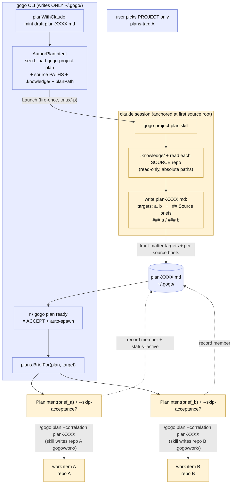

# Plan — smart-project-plans (0.25.0)

Status: awaiting acceptance

**Make the plans-tab `A` ("plan-with-claude") analyst-grade: the user picks only the
project, and Claude reads + analyzes the project's actual source repos, decides WHICH
sources the plan needs, writes a per-source brief for each, and — on acceptance — spawns
a work item into exactly those sources.** Today `A` launches a plain prose `claude`
session that just LISTS the sources and edits the plan file in place, with the user
hand-picking every target (`+`) and spawning each one by one (`c`). This feature turns
`A` into a cross-repo analyst and makes acceptance fan out the work items automatically.

---

## Context — what exists today

A **project** (`~/.gogo/projects/<name>/`) holds `config.json` (the linked **sources** —
repos that carry their own `.gogo/`), a cross-repo `.knowledge/` dir (seeded 0.24.0),
and `.gogo/plans/<id>.md`. A **plan** is a CLI-owned markdown file
(`draft → ready → active → done`) with front-matter `targets:` (source names) +
`members:` (spawned work items) and a free-text body. The plans-tab and `gogo plan …`
mutate it; a **spawn** is always a launched `claude -p /gogo:plan --correlation plan-XXXX`
(the skill writes the source's `.gogo/work/`, never the CLI).

Key code paths this change touches:

| Path | Role today |
|---|---|
| `cli/internal/tui/plans_tab.go` | `planWithClaude` (`A`), `planCreateWorkItem` (`c`), `planAddTarget` (`+`), `r` MarkReady, `D` project-UAT |
| `cli/internal/launch/launch.go` | `AuthorPlanIntent` (plain prose seed → `ActionAuthor`), `PlanIntent` (`/gogo:plan --correlation` spawn), `SkipParams`, the tmux/`-p` seam |
| `cli/internal/plans/plans.go` | `Plan{Targets,Members,Status}`, front-matter+body render/parse, `AddMember`/`AddTarget`/`SetStatus`/`MarkReady`/`MarkDone` |
| `cli/plan.go` | `gogo plan` verbs (`ready`, `promote`, `done`, …) |
| `cli/internal/projects/projects.go` | `Project`/`Source`, `KnowledgeDir`, `SkipForSource`, source paths + per-source `planAcceptanceSkip`/`uatAcceptanceSkip` |
| `skills/gogo-plan/SKILL.md` | the source-level analyst — analyzes ONE repo, scaffolds a source `.gogo/work/`, honors `--correlation` + `--skip-acceptance` |

**What `A` does today** (`planWithClaude` → `launch.AuthorPlanIntent`): mints a draft
plan, then launches a **plain interactive `claude` session** (`ActionAuthor`), anchored
at the project's **first source root** (a trusted repo), seeded with prose that reads the
project `.knowledge/`, LISTS the source labels the plan "may target", and edits the plan
markdown in place. It does **not** load an analyst, does **not** read the source repos,
and leaves targets **manually chosen** (`+`/`c`). The 0.24.0 per-source skip flags
(`planAcceptanceSkip`/`uatAcceptanceSkip`) are honored today only on the later
`/gogo:go` (via `move.go` → `SkipParams`); the spawn itself carries no skip param.

---

## Functional requirements

### FR1 — smart `A`: an analyst-loaded session that reads the sources and auto-selects targets
`A` launches a session that **loads and follows a cross-repo analyst skill**
(`gogo-project-plan`), grounded by the project `.knowledge/` and pointed at the project's
**source paths from `config.json`**. The session:
- **Reads + analyzes the actual source repos** (code = source of truth) against the goal,
  read-only, by absolute path (using each source's own `.gogo/knowledge/` when present);
- **Decides WHICH sources the plan needs** and **drafts a per-source brief** (what that
  source's work item should do) for each chosen target;
- **Writes the project plan file** with those targets **auto-selected** in front-matter
  `targets:` and a **per-source brief section** per target in the body, keeping the
  front-matter correlation id, and creating **no** `.gogo/work/` scaffolding.

The user only picks the project. The session **reads many source repos but writes only
the one `~/.gogo/` project-plan file** — never a source's `.gogo/`.

### FR2 — auto-spawn on acceptance
When the user **accepts** the authored plan (the plans-tab `r` / `gogo plan ready` step),
the CLI **automatically spawns a work item into each target source the analyst chose** —
one `launch.PlanIntent` → `claude -p /gogo:plan --correlation plan-XXXX` per target,
seeded with **that source's per-source brief** as the goal body, fired **once each**
through the launcher seam — instead of the user pressing `c` per source. Each spawn
records a member and flips the plan to `active`; the per-source
`planAcceptanceSkip` is honored on the spawned item (append `--skip-acceptance`).

### FR3 — additive fallback preserved
`n` (quick inline draft) and the manual `+` (add target) / `c` (spawn focused target)
stay **unchanged**. A plan with **no** analyst-chosen targets still works: `r` on a
targetless plan is today's plain `MarkReady` (spawns nothing); the user hand-picks and
spawns manually. The smart flow is purely the `A` upgrade plus the `r` auto-spawn — both
additive; a hand-authored or `n`-drafted plan behaves byte-for-byte as today.

### FR4 — respect the 0.24.0 gates
The project-UAT (FR3 of 0.24.0) is untouched: after auto-spawn the plan is `active`; when
every member ships it derives `awaiting-project-uat`; `D` / `gogo plan done` accepts →
`done`. The per-source skip flags stay per-source and injection-safe: `planAcceptanceSkip`
rides the spawned `/gogo:plan` as `--skip-acceptance`; `uatAcceptanceSkip` continues to
apply at each member's later `/gogo:go` (unchanged).

---

## Approach

The change is **CLI + one new skill**, no `.gogo/` contract change and no change to the
plan-file front-matter schema. Four moving parts:

### 1. New skill `skills/gogo-project-plan/SKILL.md` — the cross-repo analyst (FR1)
A `user-invocable: false` skill (loaded by the `A` session via the Skill tool, exactly as
`commands/plan.md` tells the orchestrator to "load the gogo-plan skill"). Its steps:

1. **Read the inputs** the CLI seeds it (all absolute paths, injection-safe single argv):
   the **plan-file path**, the project **name**, the **source paths + labels**, the
   **`.knowledge/` dir**, and the **correlation id**.
2. **Ground in the domain** — read the project `.knowledge/` (project-knowledge.md).
3. **Analyze each source** — for every source path, Glob/Grep/Read the repo **read-only**
   against the goal (following `analysis.md`'s spirit; use the source's own
   `.gogo/knowledge/` when present). Decide whether the goal needs a change in that repo.
4. **Select targets + write briefs** — set front-matter `targets:` to the chosen sources
   and write a **per-source brief** (goal + which files/areas + acceptance signal) for
   each target into the plan body.
5. **Write only the plan file** — edit the `~/.gogo/` plan markdown in place; keep its
   correlation id; **never** scaffold `.gogo/work/` and **never** write a source's
   `.gogo/`. Stop (acceptance is the plans-tab flow; this skill does not spawn).

**Why a new skill, not richer prose (the D-fork):** the output is a **strict contract**
the FR2 auto-spawn parses (front-matter `targets:` + a per-source brief section keyed by
source name). Plain prose is "ignorable" (the D3-rejected failure the 0.24.0 author
learned) and cannot guarantee that schema; and the existing `gogo-plan` skill produces
the **wrong shape** (it scaffolds a single source `.gogo/work/` + a source `plan.md`).
This mirrors 0.24.0 FR4's precedent that a skill change is the right tool when it is.

### 2. `launch.go` — upgrade `AuthorPlanIntent` to the analyst seed (FR1)
Keep `ActionAuthor` and the fire-once, plain-interactive-session, injection-safe shape.
Change the **seed prose** to: "Load the **gogo-project-plan** skill and follow it to
author this project plan," and pass the **source PATHS** (not just labels) so the analyst
can read the repos. Signature change: `AuthorPlanIntent(label, planPath, correlation,
knowledgePath string, sources []SourceRef)` where `SourceRef{Label, Path}` (a small
struct, or two parallel slices). Anchor unchanged (first source root). This is the only
launch.go signature change; the argv stays one trailing element.

### 3. `plans.go` — a per-source brief extractor (FR2)
Add a pure `BriefFor(p Plan, sourceName string) string` that extracts a target's brief
from the plan body by the skill's heading convention (a `## Source briefs` section with a
`### <source-name>` subsection). No front-matter/schema change — `Targets` already parses.
`BriefFor` returns "" when no brief section exists; the caller falls back to
`Description`/`Title` (today's `PlanIntent` body), so hand-authored plans still spawn.

### 4. The auto-spawn on accept (FR2) — plans-tab `r` + `gogo plan ready`
Overload the **accept step** to fan out the spawn:
- **`planReadyAndSpawn` (plans-tab `r`)**: if the plan has ≥1 target, open a **huh
  confirm** listing the not-yet-spawned targets ("spawn N work items into: a, b, c"), and
  on accept **loop** the existing `planCreateWorkItem` mechanics — build
  `PlanIntent(p.Title, BriefFor(p, target) || body, p.ID)`, resolve the target source's
  `SkipForSource`, append `SkipParams(planSkip,false)` (only `--skip-acceptance` is
  meaningful to `/gogo:plan`), fire **once** through `m.launcher`, and on success record
  the member + `SetStatus(active)`. Idempotent: skip a target already spawned
  (`spawnedFeature != nil`). A **targetless** plan → today's plain `MarkReady` (no
  launch). A failed launch leaves that target un-recorded (REV-005 discipline), never a
  phantom member.
- **`gogo plan ready <id>`** (or a sibling `gogo plan spawn <id>`) mirrors it headlessly
  (no confirm; print each spawn line), reusing `planLauncher` + `projects.SkipForSource`.
  `gogo plan promote` (single source) stays the manual fallback, unchanged.

The launcher seam (`m.launcher` / `planLauncher`) keeps every launch fire-exactly-once
and lets tests assert N fires with a fake — no real tmux/claude.

### Alternatives considered
- **FR1 via richer `AuthorPlanIntent` prose only (no skill)** — smallest surface, but the
  output schema the auto-spawn depends on is not guaranteed (prose is ignorable), and a
  plain session doing multi-repo analyst work is exactly what 0.24.0 rejected. Rejected.
- **FR1 by launching the `gogo-analyst` agent directly** — agents are Task-invoked
  subagents, not a top-level `claude` session verb, and the analyst writes a *source*
  `plan.md`, not a project plan with per-source briefs. Rejected (wrong output; not
  launchable as-is).
- **FR2 as a dedicated "spawn all" key (`S`) distinct from `r`** — keeps `r` a pure
  status flip, but adds surface and splits "accept" from "spawn," diverging from the
  vision ("when the plan is accepted it creates work items"). Kept as the documented
  alternative; recommend overloading `r` with a confirm.
- **Per-source briefs in front-matter** — front-matter is flat `key: value`; multi-line
  prose briefs don't fit `parseList`. Rejected in favor of body sections.
- **Fire the spawn from inside the analyst skill** — would make the CLI's launcher seam
  no longer the single spawn owner and put a spawn on the skill's side of the boundary at
  author time (before the user accepts). Rejected: spawn stays a CLI-launched action at
  the accept gate.

---

## Changes checklist (build order — ships as one 0.25.0)

1. **`skills/gogo-project-plan/SKILL.md`** (NEW) — the cross-repo analyst skill
   (`user-invocable: false`): read seeded inputs → read `.knowledge/` → analyze each
   source path read-only → set `targets:` + write per-source briefs → write only the plan
   file, no `.gogo/work/` scaffold. Keep it lean (knowledge line budget).
2. **`cli/internal/launch/launch.go`** — upgrade `AuthorPlanIntent`: seed "load +
   follow gogo-project-plan," accept source label+path pairs, keep injection-safe single
   argv + `ActionAuthor`. (Optional tiny `SourceRef` type.)
3. **`cli/internal/plans/plans.go`** — add pure `BriefFor(p, sourceName) string`
   (body-section extractor). No schema/front-matter change.
4. **`cli/internal/tui/plans_tab.go`** — (a) `planWithClaude` passes label+path pairs to
   the upgraded intent; (b) `r` → `planReadyAndSpawn`: confirm + loop-spawn per un-spawned
   target with its brief + per-source `--skip-acceptance`, record members, flip active;
   targetless → plain `MarkReady`. Update the tab's help/`sourceNames` accordingly.
5. **`cli/plan.go`** — `gogo plan ready` (or `gogo plan spawn`) mirrors the headless
   fan-out (reuse `planLauncher` + `projects.SkipForSource` + `plans.BriefFor`);
   `planPromote` unchanged. Update `planStoreHelp`.
6. **`.claude-plugin/plugin.json`** — bump `version` 0.24.0 → **0.25.0**.
7. **Enumeration-sync + docs** — reflect the new skill + the smart `A` + auto-spawn in
   `skills/gogo/SKILL.md`, `README.md` (plans-tab `A`/`r` lines), `docs/commands.md` /
   `docs/architecture.md`. Grep for the plans-tab `A` description before finishing.

---

## Tests

Go unit tests (the CLI gates: `gofmt` · `go vet` · `go test -race ./...`), extending the
existing `plans_tab_test.go` / `plans_test.go` / `plan_test.go` patterns with the fake
launcher seam:

- **`plans.BriefFor`** — extracts a target's brief from a `## Source briefs` / `###
  <name>` body; returns "" when absent; ignores an unrelated section (pure, table-driven).
- **`AuthorPlanIntent`** — the seed carries the "load gogo-project-plan" directive, the
  plan path, the `.knowledge/` path, and each **source path** (not just label); still one
  trailing argv (injection-safe with spaces in a path).
- **`planWithClaude`** — still mints a draft + fires the launcher **once**, now with the
  analyst seed + source paths; no-claude / no-source fallbacks unchanged.
- **`r` auto-spawn** — a plan with 3 targets: on confirm, the fake launcher fires **once
  per un-spawned target** (3), each `/gogo:plan --correlation plan-XXXX` carrying that
  target's brief body; 3 members recorded; status flips to `active`; an already-spawned
  target is skipped; a launch error records no member (REV-005).
- **skip flag** — a target source with `planAcceptanceSkip:true` gets `--skip-acceptance`
  appended to its spawn command; a plain source does not.
- **targetless `r`** — plan with no targets → plain `MarkReady`, **zero** launches.
- **`gogo plan ready`/`spawn`** — CLI mirror fires per target with the fake `planLauncher`,
  records members, flips active; `promote` (single) still works.

Manual smoke (documented, not gating — the portability contract): with `claude`+`tmux`
present, `A` on a two-source project opens a session that reads both repos and writes a
plan with auto-selected targets + briefs; `r` fans out two `/gogo:plan` sessions.

---

## Out of scope

- **Auto-running `/gogo:go` on the spawned items** — auto-spawn writes each source plan
  (and auto-accepts when the source opts out); driving each through implement→ship stays
  the board's `g`/`gogo go` (respecting `uatAcceptanceSkip`), as today.
- **A user-facing `/gogo:project-plan` slash command** — the new skill is CLI-launched
  only (`user-invocable: false`); no per-repo command-surface addition. (Add a thin
  command later only if a direct invocation is wanted.)
- **A project-plan re-plan/UAT loop** — the 0.24.0 accept-only project-UAT is unchanged.
- **`gogo-plan` reading the project `.knowledge/` directly** — still deferred (0.24.0
  FR2-b); domain context reaches each work item through the per-source brief.
- **Changing the plan-file front-matter schema** — `targets:`/`members:` stay as-is.

---

## Design — the smart `A` → analyze → accept → auto-spawn flow

---

## Summary (TL;DR)

- **What:** upgrade the plans-tab `A` so the user picks only the **project** — Claude
  reads + analyzes the project's real **source repos**, auto-selects the sources the plan
  needs, writes a **per-source brief** for each, and on **acceptance** auto-spawns a work
  item into exactly those sources.
- **Why:** today `A` is a plain prose session that only lists sources; the user hand-picks
  every target (`+`) and spawns each (`c`). The vision is "pick the project, Claude finds
  the sources, accepting fans out the work."
- **How:** a new **`gogo-project-plan`** analyst skill (loaded by the `A` session, reads
  many repos read-only, writes only the `~/.gogo/` plan with `targets:` + briefs) +
  **`AuthorPlanIntent`** carrying source **paths** + the skill directive + **auto-spawn**
  bound to the `r`/`gogo plan ready` accept step (loop `PlanIntent` per target with its
  brief, honoring per-source `--skip-acceptance`). No `.gogo/` contract change; `n`/`+`/`c`
  and the 0.24.0 project-UAT untouched. Ships as **0.25.0**.
- **Next:** accept this plan → `/gogo:go` builds it (CLI + skill, unit-tested via the
  launcher seam), then the project-UAT gates `done` as before.

> Status: **accepted** (user, 2026-07-22) -> /gogo:go
