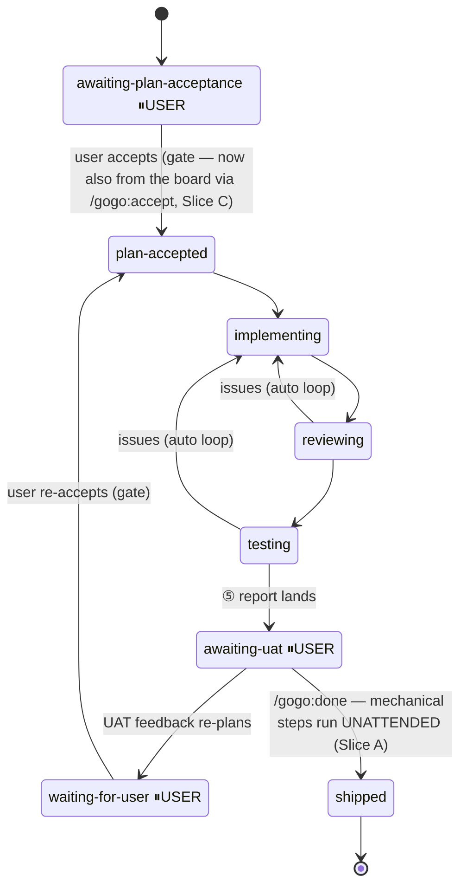
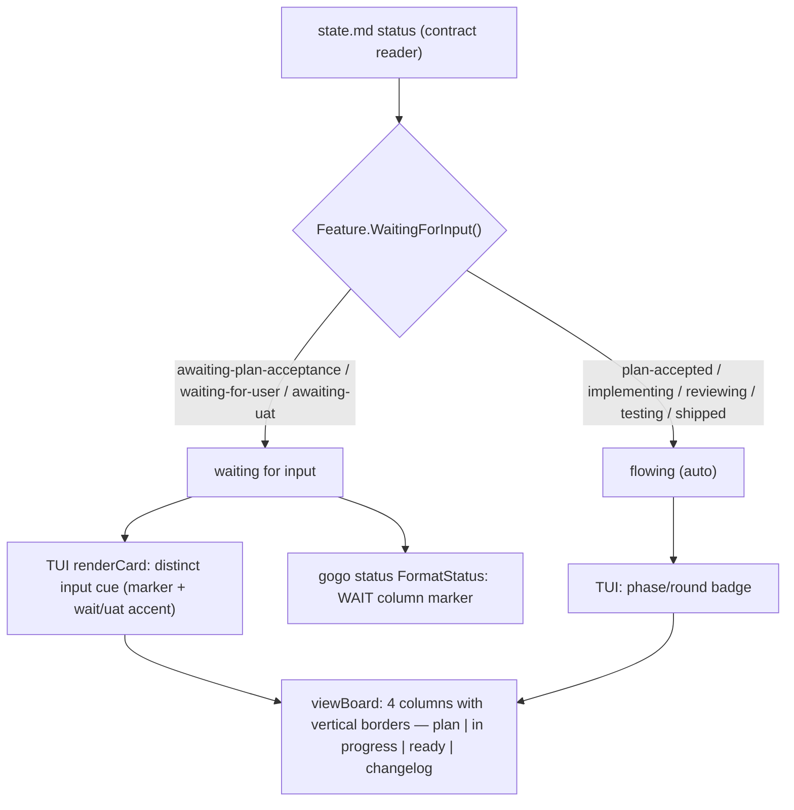
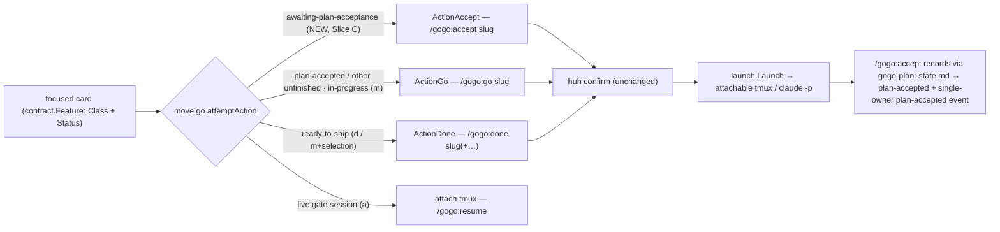

# Plan — unattended-ops-input-signals

Status: **accepted** (user, 2026-07-11) · **as-built** — shipped ②→⑤ on 2026-07-11 (v0.14.0)

**As-built note:** built exactly as planned across all three slices. One small,
behaviour-improving deviation from FR-A1's literal idiom (review REV-002): the
`before/` delete in `gogo-done` drops the `-name '*.mmd'` filter so `before/` clears
**whole** (matching the old `rm -rf "$dst/before"` exactly) while the top-level delete
keeps its `*.mmd` filter so the entry's `report.md`/`manifest.json` survive. The two
hands-on acceptance signals (a live prompt-free `/gogo:done`, a live board-accept
follow-through) were **user-skipped** at the test gate (D11/D12 → A), accepting the
green lint + unit tests + the tester's harness/tmux proof. Full detail in
`report/report.md`.

**Make `/gogo:done` (and the cockpit ops) run unattended, then make it visible on the
board which items are actually blocked on the user — and let the user *clear* the
plan-acceptance gate from the board.** Three linked problems ship as three
independently-valuable slices: **(A)** rewrite the skill-authored bash so gogo's own
mechanical file steps stop tripping Claude Code's "dangerous rm" permission classifier
(the thing that keeps halting `/gogo:done` even in auto mode); **(B)** give the CLI a
single `WaitingForInput()` predicate and *show* it — a distinct board/status indicator for
"waiting on the user" plus visible borders between the four kanban columns; and **(C)** add
a board **"accept plan"** action so an `awaiting-plan-acceptance` card the board now
*shows* (Slice B) can also be *cleared* from the board — completing the control surface.

## Goal

- **A — unattended done.** The mechanical parts of `/gogo:done` (changelog assembly,
  diagram copy, viewer build, board stale-file cleanup) complete with **no permission
  prompt**. This is not a genuine decision gate — it is gogo's own bash matching the
  harness's glob/`rm`-on-a-variable heuristic. Fix means: audit **every**
  `skills/*/SKILL.md` for the risky shape and rewrite each to be
  **permission-classifier-safe + deterministic + idempotent**.
- **B — classify + display "needs input".** Enumerate which pipeline states genuinely
  need the user vs the mechanical steps that must run unattended, express that as one
  `Feature.WaitingForInput()` helper, and surface it: a **distinct "waiting for input"
  indicator** on the TUI board cards and in the `gogo status` table, plus **vertical
  borders** between the four columns.
- **C — accept a plan from the board.** Give the board a working **accept** action on an
  `awaiting-plan-acceptance` card — the one card class whose `m` move today **dead-ends**
  (it launches `/gogo:go`, which refuses without `plan-accepted`). Respect the invariant
  that **the CLI never mutates pipeline state**: the board *launches* the acceptance in a
  claude session (a thin new `/gogo:accept <slug>` command that presents the plan and
  records acceptance through gogo-plan's existing recording), never a blind keypress
  state-flip. This **completes the control surface** — `awaiting-uat` already has `d` ship,
  `waiting-for-user` has `a` attach; plan-acceptance had no working action.

**Acceptance signal.** (A) a hands-on `/gogo:done` run advances through changelog
assembly + viewer build with zero permission prompts, and a lint over `skills/*/SKILL.md`
finds no unsafe `rm`/glob shape. (B) `go test -race ./...` green with a
`contract.WaitingForInput()` table test, a TUI badge render test, an updated
`status.golden`, and column borders visible in `viewBoard`; the frozen contract stays
additive. (C) `go test -race ./...` green with a move-guard test that an
`awaiting-plan-acceptance` card routes to the new `launch.ActionAccept` (`/gogo:accept
<slug>`) instead of the bouncing `/gogo:go`, plus a `BuildIntent(ActionAccept, …)` /
session-attribution test; the real proof is a **hands-on board accept** that flips a
plan-pending card to `plan-accepted` from an attachable session — a user-decision gate per
gogo-test if it can't run unattended in CI.

## Context — what exists (code = source of truth)

### A. The prompt-tripping bash (confirmed against the tree)

The only `rm` operations in **all** authored skill bash (grepped
`skills/*/SKILL.md`, plus `commands/ hooks/ agents/ templates/`) are two, both in
`skills/gogo-done/SKILL.md`:

| Location | Bash today | Risk |
|---|---|---|
| `gogo-done/SKILL.md:200-201` | `mkdir -p "$dst"` then `rm -f "$dst"/*.mmd; rm -rf "$dst/before"` | **glob-rm on a variable** + `rm -rf "$var/…"`. `dst=".gogo/changelog/${date}-${name}"` — if either token is empty the classifier fears `$dst`→"" → `rm -f /*.mmd` / `rm -rf /before`. **Primary culprit.** |
| `gogo-done/SKILL.md:321` | `rm -f "$res" "$code"` | `rm -f` on two bare **variables** (assigned literal paths two lines up, but the heuristic does no dataflow). Confirmed second trip point. |

Secondary, lower-risk shapes worth hardening in the same pass (scoped to **literal**
`.gogo/` paths, so far lower classifier risk, but the same family):

- `gogo-build/SKILL.md:55-61` — `mv .gogo/plans .gogo/work` and `mv "$legacy" .gogo/resources`
  (`$legacy` from a fixed literal loop list, guarded by `[ -d ]`).
- `gogo-build/SKILL.md:67-69` — `find .gogo/work -name diagrams.html -exec sed …` and
  `find .gogo/work -name 'diagrams.html.bak' -delete` (literal path, already `find`-based).

Every other filesystem write in skill bash is a `cp`/`mkdir` onto a **literal**
`.gogo/resources/…` path or from `${CLAUDE_PLUGIN_ROOT}` (safe). So the audit surface is
**small and fully enumerated** — the fix is concentrated, not sprawling.

The task's `:201` and `:321` line refs were verified against the current file; the block
also has `mkdir -p "$dst"` at `:200` (harmless when `$dst` empty, but guarded in the same
rewrite) and `cp "$f" "${dst}/…"` at `:205/:208` (already guarded by `[ -e "$f" ]`).

### B. The classifier, the badges, and the columns

- **`cli/internal/contract/contract.go`** has **two** narrow status predicates today —
  `WaitingForUser()` (`status=="waiting-for-user"`) and `AwaitingUAT()`
  (`status=="awaiting-uat"`). There is **no** single "needs user input" predicate, and
  **`awaiting-plan-acceptance` has no predicate at all** — it just falls through
  `classify()` to `ClassUnfinished` → the **plan** column, with no distinct signal.
- **`cli/internal/tui/model.go:242 badge()`** precedence: `waiting-for-user` → `running`
  → `awaiting-uat` → phase/round. **`cli/internal/tui/view.go:177-184`** picks the badge
  color: `waitStyle` for `WaitingForUser()`, `uatStyle` for `AwaitingUAT()`, else the
  column accent. So `awaiting-plan-acceptance` cards show a plain `plan-accepted`-style
  badge with **no** "you're blocking this" cue.
- **`cli/internal/tui/view.go:30-51 viewBoard` / `:63-111 renderColumn`** render four
  columns via `lipgloss.JoinHorizontal(lipgloss.Top, cols...)` where each column is a
  `Width(colWidth)` block — **no separators**. Width math lives in
  `cli/internal/tui/window.go:16 boardColWidth` (`(width-6)/4`).
- **`cli/status.go:39 FormatStatus`** prints a fixed 5-column table
  (CLASS · PHASE · STATUS · ITERATIONS · SLUG); golden at `cli/testdata/status.golden`.
  No "waiting" signal beyond the raw STATUS text.
- **Frozen contract `docs/cli-contract.md` §2** lists the full status enum (incl.
  `awaiting-plan-acceptance`, `waiting-for-user`, `awaiting-uat`); **§3** freezes the four
  classes → four columns. Any new *displayed* state must be **additive** (no key
  removed/renamed) — §3 already blesses the `awaiting-uat` badge as "an additive, optional
  presentation concern."

### The auto-vs-needs-input enumeration (the heart of B)

| state.md `status` | Meaning | Bucket |
|---|---|---|
| `awaiting-plan-acceptance` | plan written, plan-acceptance gate | **waiting for input** |
| `waiting-for-user` | a decision gate / mid-UAT re-plan lock | **waiting for input** |
| `awaiting-uat` | ⑤ landed; the UAT gate | **waiting for input** |
| `plan-accepted` | accepted; ② about to run | auto |
| `implementing` / `reviewing` / `testing` | the ②↔③↔④ fix loop | auto |
| _(the `/gogo:done` mechanical steps)_ | report/changelog assembly, diagram copy, viewer build | **auto — must not prompt (Slice A)** |
| `done` / `shipped` / `aborted` | terminal | auto |

`WaitingForInput()` = the first three. Everything else flows without the user; Slice A is
what guarantees the mechanical `/gogo:done` steps stay in the "auto" column in practice.

### C. The board control surface (confirmed against the tree)

- **The board delegates every state change; it never mutates pipeline state.**
  `cli/internal/launch/launch.go`'s package header is explicit — "It NEVER mutates
  pipeline state itself … every state-changing action launches Claude" — and coding-rules
  repeats it. The path is `move.go attemptAction` (class → `launch.Action`) →
  `launchAction` → a **huh confirm** → `launch.Launch` (attachable **tmux** session, or a
  backgrounded `claude -p` + log). Today's actions: `ActionGo` (`/gogo:go`), `ActionDone`
  (`/gogo:done`), `ActionResume` (`/gogo:resume`, the `--attach` gate path).
- **The dead end (verified).** `move.go:41-49` maps `ClassUnfinished` **and**
  `ClassInProgress` → `ActionGo`. An `awaiting-plan-acceptance` card classifies
  `ClassUnfinished` (`contract.go classify()` default — no report, `phase: plan`, status
  not implementing/…), so it sits in the **plan** column and pressing `m` launches
  `/gogo:go <slug>`, which **refuses** (its hard gate needs `state.md` `plan-accepted`). A
  `plan-accepted` card is *also* `ClassUnfinished`, but there `m`→`/gogo:go` is exactly
  right — so the move must branch on **`status`**, not class alone. `focusedCard()` returns
  a `*contract.Feature` that carries `.Status`, so the guard can read it.
- **How acceptance is recorded today (the one path a board accept must reuse).** The
  `gogo-plan` skill's acceptance step flips `state.md` `awaiting-plan-acceptance` →
  `plan-accepted`, adds the leading `Status: **accepted** (user, <date>)` line to
  `plan.md`, clears `open-decision`, and appends the **single-owner** `plan-accepted`
  event (plan's terminal event — no other owner emits it). A board accept must go through
  *that* recording; it must not invent a second acceptance path.
- **The control-surface gap (why C completes it):**

  | state.md `status` | board column | today's action | works? |
  |---|---|---|---|
  | `awaiting-uat` | ready | `d` ship → `/gogo:done` | yes |
  | `waiting-for-user` | in progress / plan | `a` attach to the live gate session | yes |
  | **`awaiting-plan-acceptance`** | **plan** | **`m` → `/gogo:go`** | **no — bounces (the gap)** |

- **Session attribution.** `launch.SessionMatchesSlug` (used by `a` attach / `l` peek)
  only walks `[]Action{ActionGo, ActionDone}` — a new accept session must be added there,
  or its `gogo-accept-<slug>` session won't be attributable back to its card.

## Functional requirements

### Slice A — unattended `/gogo:done` (bash-safety) — ships first, independently

- **FR-A1 — Harden the changelog-assembly delete (`gogo-done/SKILL.md:200-201`).** Before
  any delete, **guard**: `$dst` non-empty **and** resolves under `.gogo/changelog/`
  (refuse + exit otherwise). Replace the **glob-rm** `rm -f "$dst"/*.mmd` with a **scoped,
  non-glob, non-`rm`** delete — `find "$dst" -maxdepth 1 -type f -name '*.mmd' -delete` —
  and replace `rm -rf "$dst/before"` with a scoped `find "$dst/before" -type f -name
  '*.mmd' -delete` + `rmdir "$dst/before" 2>/dev/null || true`. Same observable effect
  (refresh the entry's diagram set inside the dated dir), now **empty-`$dst`-safe** and
  **idempotent**.
- **FR-A2 — Harden the board stale-file cleanup (`gogo-done/SKILL.md:321`).** Replace
  `rm -f "$res" "$code"` (bare variables) with a delete that carries **no bare-variable
  `rm`** — a scoped `find .gogo/resources/kanban -maxdepth 1 -type f \( -name
  board-intent.json -o -name board-exit.code \) -delete 2>/dev/null || true` (literal dir,
  named files). Same effect: clear any stale intent/exit file before the board runs.
- **FR-A3 — Audit + harden EVERY `skills/*/SKILL.md`.** The enumerated inventory (Context
  A) is the full set; harden each occurrence to the same safe idiom and record, per line,
  whether it was **genuinely destructive** or a **classifier false-positive**. Concretely:
  the two `gogo-done` sites (FR-A1/A2), and a lighter hardening of the two `gogo-build`
  migration sites (guard `$legacy`; keep the already-`find`-based deletes scoped to the
  literal `.gogo/work` path). No other skill needs a change (verified by grep).
- **FR-A4 — Behaviour-preserving + portable.** Every rewritten idiom stays POSIX sh under
  `set -euo pipefail`, adds **no** new dependency, keeps the block **deterministic +
  idempotent**, and never deletes anything outside the guarded `.gogo/` target dir. Add a
  one-line comment at each site naming *why* the idiom is shaped that way (so a future edit
  doesn't reintroduce the glob-rm).
- **FR-A5 — Regression guard (the testable artifact for Slice A).** Add a check that greps
  every `skills/*/SKILL.md` for the unsafe shapes — glob-`rm` (`rm …/*`), `rm -rf "$var…"`,
  and `rm -f "$var"` on a bare variable — and **fails** if any reappears. This is the
  durable proof the fix can't silently regress (the hands-on run is the real proof, but is
  a user-decision gate per gogo-test if it can't be exercised unattended in CI).

### Slice B — classify + display "waiting for input" + column borders

- **FR-B1 — `Feature.WaitingForInput()` predicate.** Add to `contract.go`, returning true
  for `awaiting-plan-acceptance`, `waiting-for-user`, `awaiting-uat` (the three genuine
  user gates). `WaitingForUser()` / `AwaitingUAT()` **stay** (they carry
  precedence-specific meaning); `WaitingForInput()` is the union the display layer reads.
- **FR-B2 — Board card indicator.** On any card where `WaitingForInput()` is true, the TUI
  shows a **distinct, unmissable "waiting for input" cue** (e.g. a leading marker/glyph +
  the existing `waitStyle`/`uatStyle` accent), **including `awaiting-plan-acceptance`**
  (which gets none today). The badge text stays the current state name; the *cue* is what's
  new — so at a glance the user sees which cards block on them vs flow. Precedence in
  `badge()` is preserved (waiting-for-user still wins mid-UAT).
- **FR-B3 — `gogo status` waiting signal.** `FormatStatus` gains a compact **waiting-for-input
  column/marker** (a dedicated column so it stays greppable and golden-stable). Update
  `cli/testdata/status.golden` to match; add at least one testdata feature in a waiting
  state (recommendation: flip `feature-ready` `status: done` → `awaiting-uat`, which keeps
  its ready-to-ship class and column counts unchanged) so the golden shows a real positive.
- **FR-B4 — Column borders.** Add a **visible vertical separator** between the four board
  columns (plan | in progress | ready | changelog) so it's clear where each card sits,
  **without** breaking the width math (`boardColWidth`), per-column windowing
  (`window.go`), or focus. The board's total width budget is re-derived to account for the
  separators.
- **FR-B5 — Frozen contract stays additive.** No `state.md` key or classifier rule
  removed/renamed. Update `docs/cli-contract.md` §2/§3 presentation notes to record the
  `WaitingForInput()` indicator + column borders as **additive presentation concerns**
  (same footing as the existing `awaiting-uat` badge note).
- **FR-B6 — Enumeration-sync + version bump.** Bump `.claude-plugin/plugin.json` `version`
  **and** `cli/main.go` `Version` together (0.13.0 → 0.14.0); reflect the change in the
  `project-knowledge.md` "gogo overrides" bullet and any README/docs that enumerate the CLI
  cockpit surface. Grep before finishing (coding-rules enumeration-sync).

### Slice C — a board "accept plan" action

- **FR-C1 — `launch.ActionAccept` + `BuildIntent` case.** Add `ActionAccept Action =
  "accept"` and a `BuildIntent` arm that resolves it to `Command "/gogo:accept <slug>"`
  and `Session sessionName("accept", slug)` — same shape as the `ActionGo` arm. Add
  `ActionAccept` to the action list `launch.SessionMatchesSlug` walks so a
  `gogo-accept-<slug>` session attaches (`a`) / peeks (`l`) like any other. Pure, table-
  tested — no state mutation in the CLI.
- **FR-C2 — move-guard routes an `awaiting-plan-acceptance` card to accept.** In
  `move.go attemptAction`, within the `ClassUnfinished` case, branch on **`f.Status ==
  "awaiting-plan-acceptance"`** → `launch.BuildIntent(ActionAccept, []string{f.Slug}, "")`;
  every other unfinished card (incl. `plan-accepted`) keeps `ActionGo`. The intent flows
  through the **unchanged** `launchAction` → huh confirm → `launch.Launch` path, so the
  board still never mutates state and the confirm shows `will run: claude "/gogo:accept
  <slug>"  in tmux …`. Reuse the `m` key (D8) — accept **is** the legal move for a
  plan-pending card, the move-guard's whole job.
- **FR-C3 — the thin `/gogo:accept` command + skill.** Add `commands/accept.md` (ultra-thin
  — invoke the skill, pass the slug, per coding-rules) and `skills/gogo-accept/SKILL.md`
  that: (1) resolves the feature, refusing with guidance if `state.md` status is **not**
  `awaiting-plan-acceptance`; (2) **presents the plan** (`plan.md` summary + open decisions)
  for the user to eyeball; (3) on the user's confirmation, records acceptance **exactly as
  `gogo-plan` does** — flip `state.md` → `plan-accepted`, add the `Status: **accepted**
  (user, <today>)` line to `plan.md`, clear `open-decision`, and emit the single-owner
  `plan-accepted` event — then tell the user to run `/gogo:go`. It is the plan-acceptance
  gate, reachable from the board; it **reuses gogo-plan's recording, not a second path**.
- **FR-C4 — accept-only; the invariant holds.** `/gogo:accept` records acceptance and
  **stops** (accept-only, D9) — it does **not** chain into `/gogo:go`; the board already
  offers `m`→`/gogo:go` on the now-`plan-accepted` card, mirroring the two-step chat flow
  (accept, then run). The CLI writes no pipeline state at any point — only the launched
  claude session does, through gogo-plan's recording (D7). The **direct board state-flip**
  (alternative D) is rejected unless the "CLI never mutates pipeline state" invariant is
  explicitly amended.
- **FR-C5 — enumeration-sync + additive contract + version.** A **new slash command**
  changes the "**12 commands**" count to **13** — update *every* live enumeration:
  `docs/architecture.md` ("12 slash commands"), `skills/gogo/SKILL.md`, `docs/commands.md`,
  `README.md` (command list + the board-keys paragraph), and `cli/main.go`'s `printHelp`
  board-keys line (`m` now also accepts a plan-pending card). Add an **additive**
  presentation note to `docs/cli-contract.md` (accept is a new delegated-launch board
  action — no `.gogo/` file-read-contract change). Share the single **0.13.0 → 0.14.0**
  bump (FR-B6) — one bump for the whole feature. Grep before finishing.

## Approach (recommended) + alternatives

### Slice A — safe-bash rewrite (recommended over moving to Go)

Rewrite the two `gogo-done` bash blocks (and lightly the `gogo-build` migration) to the
**guarded scoped-`find`** idiom: prove the variable is non-empty and under `.gogo/`, then
delete via `find <dir> -maxdepth 1 … -delete` (no glob, no bare-variable `rm`). This is the
smallest change that removes both classifier triggers, keeps the skill self-contained and
dependency-free, and preserves the exact idempotent behaviour.

- **Alternative (rejected, D1): move changelog assembly into the Go CLI** (`gogo`
  subcommand, prompt-free by construction). Bigger; introduces a **new CLI write surface
  into `.gogo/changelog`** (today the CLI's only write outside `.gogo/resources/` is
  trash) and a **hard binary dependency** in a path that must degrade with no external
  deps. The synthesized `report.md` is still LLM-authored, so only the mechanical copy
  could move — an awkward split. Safe-bash wins on simplicity + portability.

### Slice B — one predicate, three read-only display touches

Add `WaitingForInput()` in the contract layer (the single source of the concept), then read
it in three deterministic display sites: `badge()`/`renderCard` (board cue), `FormatStatus`
(status column), and a vertical-rule separator in `viewBoard`/`renderColumn`. No classifier
rule changes, no new column class — the item stays in its phase column; only its
*presentation* gains the cue.

- **Alternative (rejected, D2): a fifth "waiting" board column.** Breaks the §3 class→column
  1:1 contract and the four-column width/windowing math; and a waiting item legitimately
  still belongs to its phase column (a plan awaiting acceptance is still "plan"). A
  per-card cue is additive and truthful.
- **Column-border rendering (D4):** recommend a **1-cell styled vertical separator** joined
  between columns (least disruption to the width budget — re-derive `boardColWidth` for the
  3 gutters) over per-column full box borders (heavier; interacts with the focus highlight
  and per-column windowing).

### Slice C — a thin launched `/gogo:accept`, routed through the existing launch path

Add one new `launch.Action` (`ActionAccept` → `/gogo:accept <slug>`) and teach the
move-guard that a plan-pending card's legal `m` move is **accept**, not the bouncing `go`.
The launch reuses the **entire** existing confirm→`launch.Launch` machinery (attachable
tmux / backgrounded `claude -p`), so nothing new mutates state and the user still eyeballs
the plan in-session before it flips. The new `commands/accept.md` + `skills/gogo-accept/`
are deliberately thin: their only job is present-then-record, and the *record* delegates to
gogo-plan's existing acceptance recording (one owner of `plan-accepted`, no duplication).

- **Alternative (rejected, D7=B): the board flips `state.md` → `plan-accepted` directly**
  after a huh confirm — a deterministic single-line transition, simpler, no new command.
  But it is a **relaxation of the "CLI never mutates pipeline state" invariant** (today the
  CLI's only writes are under `.gogo/resources/` + the trash move), it **skips the
  plan-eyeball** a launched session gives, and it would need the `plan-accepted` event
  emitted from the CLI — a second owner of a single-owner event. **Recommend against**
  unless the invariant is explicitly amended.
- **Board key (D8):** recommend **reusing `m`** — the move-guard already means "the legal
  move for this card," and a plan-pending card's legal move is accept (there is none
  today). A dedicated `A` key is more discoverable but adds a key + doc surface for a move
  `m` should already own.
- **Accept-only vs accept-then-go (D9):** recommend **accept-only** — keep `/gogo:accept`
  single-responsibility; the board's `m`→`/gogo:go` on the now-`plan-accepted` card is the
  natural second step (mirrors the chat flow, where acceptance and `/gogo:go` are distinct).
- **View prerequisite (D10):** recommend **no** hard prerequisite — the launched
  `/gogo:accept` session presents the plan itself, so the eyeball is built into accept;
  gating the keypress on a prior `v` view would add hidden modality.

## Changes checklist (build order)

**Slice A (ship first):**
1. `skills/gogo-done/SKILL.md` — rewrite the `:200-201` assembly delete (FR-A1) and the
   `:321` board cleanup (FR-A2) to the guarded scoped-`find` idiom + explanatory comments.
2. `skills/gogo-build/SKILL.md` — lightly harden the `:55-69` migration `mv`/`find` sites
   (FR-A3); confirm no other skill needs a change.
3. Add the **lint guard** (FR-A5) — a Go test in the existing `cli/` suite reading
   `../../skills/*/SKILL.md`, **or** a standalone `--selftest` shell script (D6) — asserting
   no unsafe `rm`/glob shape remains.
4. `.claude-plugin/plugin.json` + `cli/main.go` `Version` bump can land with Slice A or B
   (behavioural change either way) — keep them together (FR-B6).

**Slice B:**
5. `cli/internal/contract/contract.go` — add `WaitingForInput()` (FR-B1).
6. `cli/internal/tui/model.go` + `view.go` (+ `styles.go` if a new marker style) — the card
   cue (FR-B2).
7. `cli/internal/tui/view.go` + `window.go` — column-border separator + width re-derivation
   (FR-B4).
8. `cli/status.go` + `cli/testdata/status.golden` (+ a waiting-state testdata `state.md`) —
   the status waiting column (FR-B3).
9. `docs/cli-contract.md` §2/§3 presentation notes (FR-B5); `project-knowledge.md` overrides
   bullet + README/docs enumeration-sync (FR-B6).
10. Tests (below).

**Slice C:**
11. `cli/internal/launch/launch.go` — add `ActionAccept`, the `BuildIntent` arm, and
    `ActionAccept` in `SessionMatchesSlug`'s action list (FR-C1).
12. `cli/internal/tui/move.go` — branch `ClassUnfinished` on `f.Status ==
    "awaiting-plan-acceptance"` → accept, else go (FR-C2). No change to `launchAction` /
    `startForm` / `doLaunch` (the confirm+launch path is reused verbatim).
13. `commands/accept.md` (ultra-thin) + `skills/gogo-accept/SKILL.md` (present-then-record,
    delegating to gogo-plan's acceptance recording) (FR-C3/FR-C4).
14. `cli/main.go` `printHelp` board-keys line + `docs/architecture.md` / `skills/gogo/SKILL.md`
    / `docs/commands.md` / `README.md` command list (**12 → 13**) + README board-keys
    paragraph + `docs/cli-contract.md` additive note (FR-C5). Version bump shared with FR-B6.
15. Tests (below).

## Tests

- **Slice A:** the **lint guard** (FR-A5) is the CI-runnable proof — greps `skills/*/SKILL.md`
  for glob-`rm` / `rm -rf "$var"` / `rm -f "$var"` and fails on any hit. Optionally a shell
  unit test of the rewritten idiom against an **empty `$dst`** (asserts nothing outside the
  target is touched). The **real** proof is a hands-on `/gogo:done` with no prompt — per
  gogo-test, if that can't be exercised unattended in CI it is a **user-decision gate**,
  never a silent skip.
- **Slice B (Go, in the existing `go test -race ./...` gate):**
  - `contract_test.go` — a table test for `WaitingForInput()` across all three waiting
    statuses + the auto negatives.
  - `tui_test.go` — extend `TestBadge` / add a render assertion that a waiting card (incl.
    `awaiting-plan-acceptance`) carries the distinct cue, and that `viewBoard` output
    contains the column separator glyph.
  - `status_test.go` + `status.golden` — regenerate the golden with the new waiting column
    and the flipped testdata positive.
  - `gofmt -l . · go vet ./... · go test -race ./...` all clean (coding-rules gate).
- **Slice C (Go, in the same gate):**
  - `move_test.go`/`tui_test.go` — extend `TestAttemptActionGuards`: an
    `awaiting-plan-acceptance` card (`ClassUnfinished`) routes to `launch.ActionAccept`
    (`/gogo:accept <slug>`), while a `plan-accepted` unfinished card still routes to
    `ActionGo` — the `status`-not-class branch is the regression guard against reopening the
    dead end.
  - `launch_test.go` — `BuildIntent(ActionAccept, ["s"], "")` yields `Command
    "/gogo:accept s"` + `Session "gogo-accept-s"`, and `SessionMatchesSlug("gogo-accept-s",
    "s")` is true (so `a`/`l` attribute the accept session).
  - **Skill contract:** a light check that `commands/accept.md` is thin (invokes the skill)
    and that `skills/gogo-accept/SKILL.md` records via the gogo-plan acceptance step (no
    second `plan-accepted` emitter) — plus the enumeration-sync grep (13 commands).
  - The **real proof** is a hands-on **board accept**: `m` on a plan-pending card opens the
    confirm, launches `/gogo:accept` in an attachable session, and after the user confirms
    the card flips to `plan-accepted` (then `m`→`/gogo:go` runs it). Per gogo-test, a
    user-decision gate if it can't be exercised unattended in CI — never a silent skip.

## Out of scope (explicitly deferred)

- **CLI hooks firing desktop/OS notifications** when an item enters a waiting-for-input
  state — the goal defers this to a later slice; this feature **only displays** the state on
  the board/status. (`WaitingForInput()` is the seam a later notification slice would read.)
- Reworking the four-class classifier or the class→column mapping (§3 stays frozen).
- Moving any `/gogo:done` logic into the Go CLI (rejected in D1).
- Broader hardening of `hooks/*.sh` — they contain no `rm`/glob-on-variable (verified).
- **Accept parity on the SKILL-side fallback board** (the `board.py` status-table +
  `board-intent.json` routing in `skills/gogo-done/SKILL.md`, used only when the Go TUI is
  unavailable). Slice C targets the **primary live cockpit** (the Go/Bubble Tea board the
  user actually hits); adding an accept action to the degraded fallback router can follow —
  it does not block the control-surface fix.
- A **direct board state-flip** to `plan-accepted` (rejected, D7=B) — it would relax the
  "CLI never mutates pipeline state" invariant.
- Chaining accept into `/gogo:go` (accept-then-go, deferred per D9) — accept-only ships.

## Summary (TL;DR)

- **What:** three linked fixes shipped as three slices — **(A)** make `/gogo:done`'s
  mechanical steps run **prompt-free** by rewriting gogo's own risky skill-bash; **(B)**
  classify and **show** which items are **waiting on the user** (board cue + `gogo status`
  column) with **borders** between the four columns; and **(C)** add a board **"accept
  plan"** action so a plan-pending card the board now *shows* can also be *cleared* from
  the board — completing the control surface (`d` ship, `a` attach, and now accept).
- **Why:** `/gogo:done` keeps halting on a false "dangerous rm" permission prompt (its own
  glob-`rm`-on-a-variable); the board gives no at-a-glance signal for what's blocked on the
  user vs flowing; and an `awaiting-plan-acceptance` card's only `m` move today **dead-ends**
  into a `/gogo:go` that refuses.
- **Approach:** **guarded scoped-`find`** rewrites (no glob, no bare-variable `rm`) over
  moving logic into Go; one `contract.WaitingForInput()` predicate read by three read-only
  display sites over a new board column; and a **new `launch.ActionAccept`** that routes an
  `awaiting-plan-acceptance` card's `m` to a thin launched **`/gogo:accept`** (which records
  via gogo-plan's existing acceptance step) — over a direct board state-flip, so the CLI
  still never mutates pipeline state.
- **Chosen slicing:** **Slice A (bash-safety) ships first and independently** — it fixes the
  pain the user hit right now — then **Slice B (board indicator + borders)**, then **Slice C
  (board accept)**.
- **What happens next:** the orchestrator owns the acceptance gate — **accept** to unlock
  `/gogo:go`, or request changes. Open forks (D1-D10) are in `decisions.md`, each with a
  recommendation.

## Intended design

**Status lifecycle — which gates are "waiting for input"** (the three `⏸ USER` states are
exactly what `WaitingForInput()` flags; every other transition flows unattended):

**Read + display flow — one predicate, three read-only display sites:**

**Board control surface — every state change is a delegated launch (Slice C fills the
plan-acceptance gap; the CLI never mutates state):**

