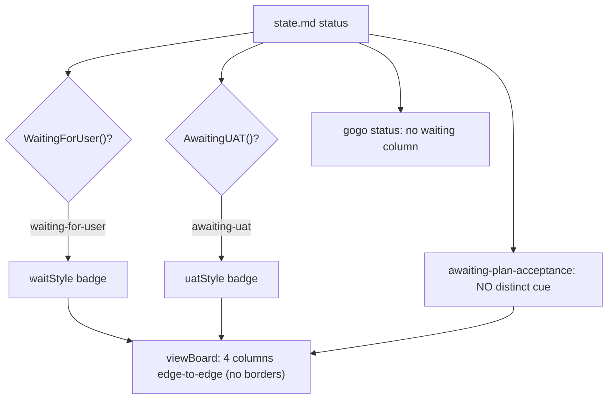
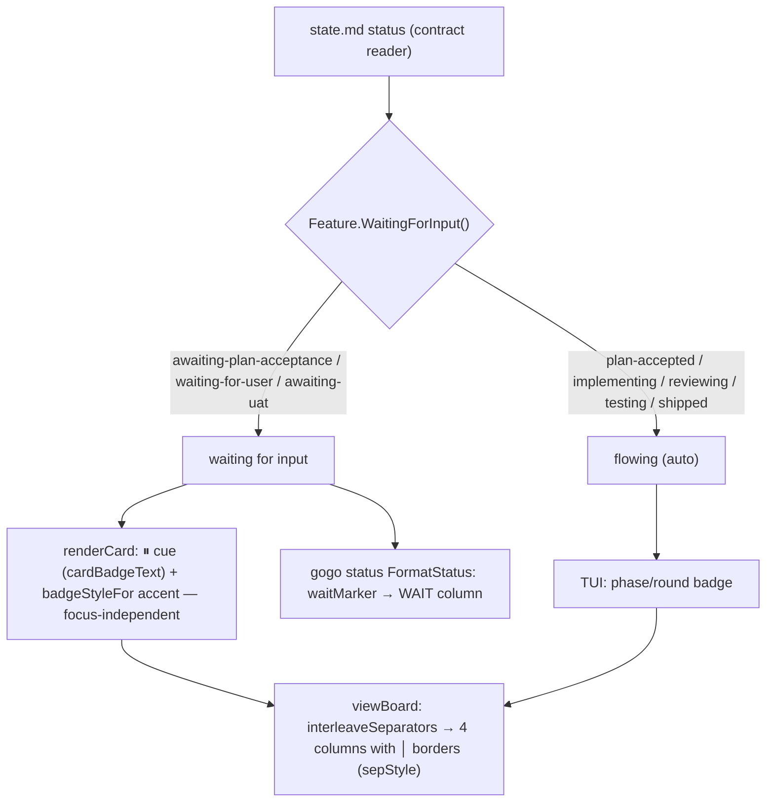

# Report — feature `unattended-ops-input-signals`

- **feature:** Unattended `/gogo:done` (skill-bash safety) + a board/status "waiting for input" indicator with column borders + a board accept-plan action
- **status:** awaiting-uat
- **completed:** 2026-07-11
- **branch / commits:** n/a (working tree; not committed by the pipeline)

Three linked fixes shipped as three independently-valuable slices: make `/gogo:done`'s
own mechanical steps run **prompt-free**, **show** on the board which items are blocked
on the user, and let the user **clear** the plan-acceptance gate from the board — all at
**v0.14.0**.

## Run status / gaps

All five phases completed. **No open code issues.** Implement ran 2 rounds (build +
one review-fix round); review ran 2 rounds and ended **APPROVE**; test ran and found
**zero code defects**. The only test findings were the plan's own two hands-on
acceptance signals that need a live claude session — **TEST-001** (a real prompt-free
`/gogo:done`) and **TEST-002** (a real board-accept follow-through). Both were
**user-skipped** at the test gate (**D11/D12 → A**, 2026-07-11), accepting the
unattended evidence; they are recorded `wontfix` in
[test/issues.json](../test/issues.json), not silently dropped. Slice A's real
prompt-free `/gogo:done` will be confirmed **organically** the next time a feature is
shipped via `/gogo:done`.

## Summary

`/gogo:done` kept halting on a **false "dangerous rm" permission prompt** — gogo's own
mechanical file steps matched Claude Code's glob-`rm`/`rm`-on-a-variable classifier. This
feature **(A)** rewrites that skill-bash to be classifier-safe, **(B)** adds one
`contract.WaitingForInput()` predicate and surfaces it (a board card cue, a `gogo status`
column, and borders between the four board columns) so it's visible at a glance which
items block on the user, and **(C)** adds a board **accept** action so an
`awaiting-plan-acceptance` card the board now *shows* can also be *cleared* from the
board — completing the control surface (`d` ships, `a` attaches, and now `m` accepts).

## Planned vs shipped

**Shipped exactly as the accepted plan describes**, across all three slices and all ten
plan decisions (D1-D10, each taken as recommended). One small, behaviour-improving
deviation surfaced in review:

- **REV-002 (Slice A, `before/` refresh):** FR-A1 literally prescribed
  `find "$dst/before" -type f -name '*.mmd' -delete`. Shipped without the `-name '*.mmd'`
  filter on the `before/` delete so the directory clears **whole** — matching the old
  `rm -rf "$dst/before"` **exactly** — while the top-level delete keeps its `*.mmd` filter
  so the entry's `report.md`/`manifest.json` survive. Strictly closer to the original
  behaviour; still classifier-safe.

## Implementation

The change is concentrated and additive — no classifier rule, class, or column was
removed or renamed.

**Slice A — classifier-safe skill bash.** The two `rm` sites in `gogo-done/SKILL.md` were
rewritten to a **guarded scoped-`find … -delete`** idiom: the changelog-assembly refresh
now guards `$dst` non-empty **and** under `.gogo/changelog/` (refuse + exit otherwise),
then deletes via `find` (no glob, no bare-variable `rm`); the board stale-file cleanup
replaced `rm -f "$res" "$code"` with a scoped `find` on the literal
`.gogo/resources/kanban` dir + named files. The `gogo-build` migration sites were lightly
hardened (guard `$legacy`, explanatory comments; the deletes there were already
`find`-based). A **regression lint** — `cli/skills_lint_test.go`
`TestSkillsBashNoUnsafeRm` — scans every `skills/*/SKILL.md` with command-anchored
regexes and fails if any glob-`rm` / `rm -rf "$var"` / `rm -f "$var"` shape reappears; it
is designed not to trip on prose mentions of those shapes.

**Slice B — one predicate, three read-only display sites.** `contract.Feature.WaitingForInput()`
returns true for exactly the three genuine user gates (`awaiting-plan-acceptance`,
`waiting-for-user`, `awaiting-uat`). The TUI board shows a leading **⏸** cue on any such
card (`cardBadgeText` + `badgeStyleFor`, on both focused and unfocused cards), and
`badge()` now surfaces `awaiting-plan-acceptance` as its own state name (it read as
"plan r1" before). `gogo status` gained a dedicated leading **WAIT** column
(`waitMarker`). `viewBoard` draws a one-cell **`│`** vertical separator between the four
columns (`interleaveSeparators`/`columnSeparator`), with `boardColWidth` re-derived to
reserve the 3 gutter cells.

**Slice C — a thin launched `/gogo:accept`, routed through the existing launch path.**
`launch.ActionAccept` resolves to `/gogo:accept <slug>` + a `gogo-accept-<slug>` session
(added to `SessionMatchesSlug`'s walk so `a`/`l` attribute it). `move.go attemptAction`
branches the `ClassUnfinished` case on **status** — `awaiting-plan-acceptance` →
`ActionAccept`, everything else (incl. `plan-accepted`) → `ActionGo` — closing the dead
end where `m` bounced into a `/gogo:go` that refuses. The new ultra-thin `commands/accept.md`
+ `skills/gogo-accept/SKILL.md` **present the plan then record acceptance through
gogo-plan's existing single-owner recording** (state flip + `Status: **accepted**` line +
the one `plan-accepted` event); accept-only, and **the CLI never mutates pipeline state**
— only the launched session does.

### Changes (as-built)

| File | Change | Note |
|---|---|---|
| `skills/gogo-done/SKILL.md` | modified | Slice A: guarded scoped-`find` rewrites of the two `rm` sites (+ REV-002 `before/` whole-clear) |
| `skills/gogo-build/SKILL.md` | modified | Slice A: `$legacy` guard + "why" comments on the migration sites |
| `cli/skills_lint_test.go` | added | Slice A: `TestSkillsBashNoUnsafeRm` regression lint |
| `cli/internal/contract/contract.go` | modified | Slice B: `WaitingForInput()` predicate |
| `cli/internal/tui/model.go` | modified | Slice B: `badge()` surfaces `awaiting-plan-acceptance` |
| `cli/internal/tui/view.go` | modified | Slice B: ⏸ cue (`cardBadgeText`/`badgeStyleFor`) + `interleaveSeparators`/`columnSeparator` |
| `cli/internal/tui/window.go` | modified | Slice B: `boardColWidth` re-derived for the 3 gutters |
| `cli/internal/tui/styles.go` | modified | Slice B: `waitingMarker` (⏸) + `sepStyle` |
| `cli/status.go` | modified | Slice B: leading `WAIT` column + `waitMarker` |
| `cli/testdata/status.golden` | modified | Slice B: regenerated (WAIT column) |
| `cli/internal/contract/testdata/repo/.gogo/work/feature-ready/state.md` | modified | Slice B: `done`→`awaiting-uat` (real WAIT positive; stays ready-to-ship) |
| `cli/internal/launch/launch.go` | modified | Slice C: `ActionAccept` const + `BuildIntent` arm + `SessionMatchesSlug` |
| `cli/internal/tui/move.go` | modified | Slice C: `ClassUnfinished` status-branch to `ActionAccept` |
| `commands/accept.md` | added | Slice C: ultra-thin `/gogo:accept` entry point |
| `skills/gogo-accept/SKILL.md` | added | Slice C: present-then-record (reuses gogo-plan's recording) |
| `cli/internal/contract/waiting_test.go`, `cli/internal/tui/waiting_test.go`, `cli/internal/tui/accept_test.go`, `cli/internal/launch/accept_test.go` | added | 8 new tests across the three slices |
| `cli/main.go`, `.claude-plugin/plugin.json` | modified | version 0.13.0 → **0.14.0**; printHelp board-keys + ⏸ legend |
| `docs/commands.md`, `docs/architecture.md`, `docs/cli-contract.md`, `README.md`, `.gogo/knowledge/project-knowledge.md` | modified | enumeration-sync (12→**13** commands) + additive contract note + 0.14.0 knowledge bullet |

## Decisions & rationale

All ten planning forks were resolved at acceptance as recommended; two test-gate forks
were resolved by the user during this run. See [decisions.md](../decisions.md).

| Decision | Choice | Reason |
|---|---|---|
| D1 | Guarded scoped-`find` bash rewrite (not move-to-Go) | Smallest change that removes both classifier triggers; keeps the skill dependency-free + idempotent; no new CLI write surface |
| D2 | Per-card cue (not a 5th column) | A 5th column breaks the frozen §3 class→column 1:1 map; a waiting item still belongs to its phase column |
| D3 | `awaiting-plan-acceptance` counts as waiting-for-input | It is a genuine user gate that had **no** cue before — the gap this closes |
| D4 | 1-cell vertical separator (re-derived width) | Least disruption to the width budget, windowing, and focus highlight |
| D5 | Dedicated `WAIT` status column | Greppable + golden-stable; the STATUS text already carries the raw state |
| D6 | Lint as a Go test in `cli/` | Lands in the `go test -race` gate the coding-rules already require — can't be forgotten |
| D7 | Thin launched `/gogo:accept` (not a direct board state-flip) | Keeps the "CLI never mutates pipeline state" invariant; reuses the one acceptance recording; lets the user eyeball the plan in-session |
| D8 | Reuse `m` (not a new `A` key) | `m` already means "the legal move for this card"; a plan-pending card's legal move is accept |
| D9 | Accept-only (not accept-then-go) | Single-responsibility; mirrors the chat flow where acceptance and `/gogo:go` are distinct steps |
| D10 | No prior-`v`-view prerequisite | The launched `/gogo:accept` session presents the plan itself — the eyeball is built in |
| D11 | Skip the live prompt-free `/gogo:done` (TEST-001) | User accepted the green lint + harness re-verification; the live run is confirmed organically at ship time |
| D12 | Skip the live board-accept follow-through (TEST-002) | User accepted the unit tests + live-tmux-to-confirm proof; the follow-through reuses gogo-plan's exercised recording |

## Review outcome

**Two rounds; final verdict APPROVE.** Round 1 (verdict CHANGES) found **REV-001**
(major — `docs/architecture.md` said "13 slash commands" but its file-tree still listed
12; `accept.md` missing) and **REV-002** (nit — the `before/` refresh divergence above).
Both were **agent-fixable, no user decision**. Round 2 re-verified both as fixed with no
regression and confirmed everything positively cleared in round 1 held. See
[review-01.md](../review-01.md), [review-02.md](../review-02.md),
[review/issues.json](../review/issues.json).

## Test outcome

**All-green on every runnable level; zero code defects.** The CI gate (`gofmt -l`,
`go vet`, `go test -race -count=1 ./...`) passed across all packages, including the 8 new
feature tests and the regenerated `status.golden`. Hands-on: the built binary reported
`0.14.0`, `--help` showed the updated board-keys/⏸ legend, and `gogo status` rendered the
`WAIT` column across all three waiting states. The **live tmux TUI** was driven to confirm
the ⏸ cue, the `│` separators, and that `m` on a plan-pending card opens
`will run: claude "/gogo:accept …"` while a `plan-accepted` card still routes to
`/gogo:go`. The Slice-A bash idiom was re-verified in an isolated harness (refresh,
empty-refusal with a nonzero exit + byte-identical filesystem, idempotency, `before/`
whole-clear). The two live acceptance signals (TEST-001/002) were **user-skipped** (D11/D12).
See [test-01.md](../test-01.md), [test/issues.json](../test/issues.json).

## Diagrams

The as-built UML set — open [diagrams.html](./diagrams.html) (same folder):

- **flow** (`flow.mmd`) — the read+display path: one `WaitingForInput()` predicate read by three read-only display sites (⏸ card cue, `WAIT` status column, `│` bordered columns).
- **flow** (`control-surface.mmd`) — the board move-guard routing each card class/status to a delegated launch; `ActionAccept` fills the plan-acceptance gap.
- **activity** (`activity.mmd`) — the pipeline status lifecycle: the three ⏸USER gates vs the auto transitions (incl. `/gogo:done`'s Slice-A prompt-free steps).
- **sequence** (`sequence.mmd`) — the board-accept interaction end to end: `m` → `ActionAccept` → confirm → launch → `/gogo:accept` session → gogo-plan recording → `plan-accepted`.

Slice A (skill-bash safety) is textual — no structural diagram.

## Before / after comparison

Plan ① captured one **before** (as-is) flow, copied into this bundle as
`report/before/flow.mmd`. The matching **after** kind is `report/flow.mmd`.

**flow — before:**

**flow — after:**

**What changed:** the two separate `WaitingForUser()`/`AwaitingUAT()` checks are unified
into one **`WaitingForInput()`** predicate that **also** covers
`awaiting-plan-acceptance` (which had **no** cue before); the display gains a
**focus-independent ⏸ cue**, a dedicated **`WAIT`** status column, and **`│` column
borders**. The **activity** and **sequence** diagrams are **added** (after only) — the
lifecycle now marks the ⏸USER gates and the board-accept path is new. No kind was removed.

## Knowledge updates

- **`project-knowledge.md`** (owned) — added the **0.14.0** overrides bullet (the three
  slices + the 12→13 command count + additive-contract note), and added `accept` to the
  current orchestration command enumeration.
- **`coding-rules.md`** (owned) — added a durable **classifier-safe skill-bash** rule
  (guarded scoped-`find … -delete`; never glob-`rm` or a bare-variable `rm` in authored
  skill bash) with a pointer to the `TestSkillsBashNoUnsafeRm` lint, so the Slice-A fix
  can't erode at the convention level.
- **Frozen contract** — `docs/cli-contract.md` gained a **"Changed in 0.14.0"** additive
  section recording the `WaitingForInput()` indicator, the column borders, and the
  `/gogo:accept` delegated-launch board action as additive presentation/launch concerns
  (no file-read-contract change).

**Consider upstreaming:** none — all changes are gogo-owned; no proxied upstream file was
touched.

## Follow-ups & known limitations

- **Deferred (per plan Out-of-scope):** CLI hooks firing desktop/OS notifications when an
  item enters a waiting state (`WaitingForInput()` is the seam a later slice would read);
  **accept parity on the SKILL-side fallback board** (`board.py` — Slice C targets the
  primary Go cockpit); chaining accept into `/gogo:go` (accept-then-go, D9).
- **User-skipped live proofs:** TEST-001 (prompt-free `/gogo:done`) and TEST-002 (live
  board-accept flip) were not exercised live — confirmable at ship time / on the next
  plan-pending card.

## Summary (TL;DR)

- **What shipped:** `/gogo:done`'s mechanical bash is now **classifier-safe** (guarded
  scoped-`find`, guarded by a regression lint); the board + `gogo status` **show** which
  items wait on the user (a **⏸** cue, a **WAIT** column, **`│`** column borders); and a
  new **`/gogo:accept`** lets the board's `m` clear the plan-acceptance gate — v0.14.0,
  13 commands.
- **Review verdict:** **APPROVE** (2 rounds; 1 major + 1 nit, both fixed and verified).
- **Test verdict:** **all-green, zero code defects**; the two live acceptance signals were
  **user-skipped** (D11/D12), accepting the lint + unit + harness/tmux evidence.
- **Follow-ups:** notification hooks, fallback-board accept parity, and accept-then-go
  remain deferred (see above).
