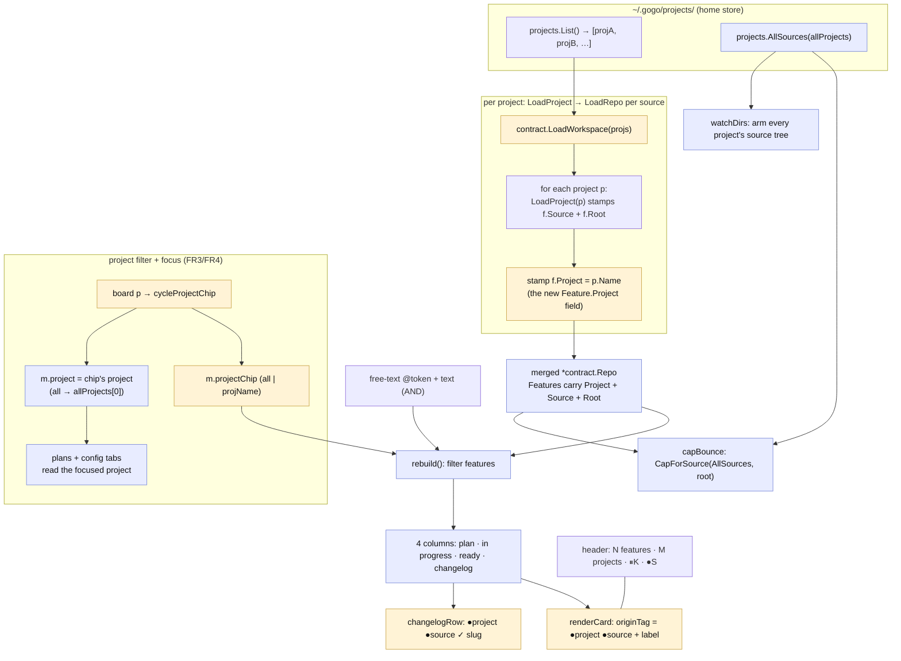

# Plan — unified all-projects board (0.23.0)

Status: awaiting acceptance

**Make `gogo global` open ONE board across EVERY registered project at once** —
each card and changelog row tagged with **both** its project color and its source
color — instead of today's single-project view with a `p` source switcher. This is
the design's TURN-3a "unified board", and it closes the user's gap: *"dots on change
logs should be project + source … when we display only source color it says nothing,
we need both project + source."*

## Goal
When the user runs `gogo global` (or `gogo` outside a repo), the cockpit aggregates
**all** projects' sources into one board. Every surface (board cards, changelog rows,
the plans/config tabs) carries a **two-dot `●project ●source`** origin cue, the board
is **filterable by project** (a chip row + `p` cycles project), and the header counts
span everything. **Acceptance signal:** with ≥2 registered projects, `gogo global`
shows features from all of them, each card/row reads its project apart from the next
by color, `p` narrows to one project, and the plans/config tabs act on the focused
project. Single-repo and single-project modes still work unchanged.

## Context — what exists today
The cockpit shipped across 0.21.0-0.22.1. A **project** is a home-folder entity
(`~/.gogo/projects/<name>/`) that links many **sources** (repos with their own
`.gogo/`). The TUI is tabbed **board · plans · config**. Colors (0.22.0/0.22.1) are
per-project + per-source with a name-stable never-blank fallback.

**The gap is the aggregation model.** `gogo global` today opens ONE project's board:

- `cli/main.go` `chooseBoard` and `cli/global.go` `globalBoard` both call
  **`tui.NewProjectBoard(projs[0])`** — the FIRST project only.
- `NewProjectBoard(proj)` (`model.go`) sets `m.project = &proj`,
  `m.allProjects = projects.List()`, and `m.repo = contract.LoadProject(proj)`.
  **`LoadProject` aggregates only that ONE project's sources** (`contract.go:225`).
- `reload()` re-runs `contract.LoadProject(*m.project)` — still one project.
- The board `p` key cycles the **source** chip *within* the focused project
  (`cycleChip` → `sourceChip`); the config tab's `p` switches the focused project
  (`switchProject`, which re-aggregates to that one project).
- The header already says **`N features · M projects`** — but `M` counts
  `allProjects` while `N` and the cards are only the **one** focused project. That
  mismatch is exactly what the user sees.

**What's already in place and reusable (the good news):**

| Asset | Where | Reuse for |
|---|---|---|
| `originDots(projColor, srcColor, plain)` | `tui/palette.go:56` | the FR2 two-dot cue (already renders `●P ●S`, and a single dot when projColor is nil) |
| `m.projectColor(name)` / `projectColors` map | `tui/palette.go:46` + `model.go` | the project dot color (already built + name-stable) |
| `m.sourceColor(label)` / `sourceColors` map | `tui/palette.go:40` | the source dot color |
| `projectColorMap` / `sourceColorMap` | `tui/palette.go` | rebuild color maps on reload |
| `sourceChip` + `cycleChip` + `viewSourceChips` | `model.go` / `view.go` | the *pattern* for the new project-chip filter |
| `Feature.Root` (per-feature) | `contract.go:60` | `rootFor` already makes actions project-aware across sources |
| `projects.AllSources(projs)` | `projects/projects.go:311` | the FR5 cross-project cap/watch source set |
| `selectionSpansProjects` (by `f.Root`) | `tui/move.go:85` | ship-merge cross-project guard already works on the merged repo |

**The one missing datum:** `contract.Feature` has `Source`, `Root`, `Correlations`
— but **no `Project` field** (`contract.go:53`). Cards can't tag/filter by project
until a feature knows its project.

## Functional requirements

**FR1 — Aggregate across ALL projects.** `gogo global` (and bare `gogo` outside a
repo) opens a UNIFIED board that loads **every** registered project's sources and
merges all features into one board. Each `Feature` carries its **`Project`** (stamped
at load, alongside `Source`). Header reads `gogo cockpit · N features · M projects`
where **N now counts every project's features** (M unchanged), plus the existing
`⏸ K need you · ● S session` attention summary — all spanning everything.

**FR2 — Project + source origin on every surface.** Board cards, changelog rows, and
the config/plans surfaces that render features carry the **two-dot `●project ●source`**
cue, reusing `originDots` + the color model. **Project is the primary distinguisher.**
Legible at narrow widths (reuse the existing tag truncation `fitSourceTag`). Single-
repo / single-project cards where `Feature.Project == ""` fall through `originDots`'
nil-project branch to a single source dot — **byte-for-byte parity**.

**FR3 — Filter by project.** A **project chip row** (`all` + one chip per project,
each with its project-color dot) and a **`p` key that cycles project**
(`all → proj1 → proj2 → … → all`), narrowing the board to that project's features.
Composes with the free-text filter (AND). See Decision **D3** for how source
filtering is preserved.

**FR4 — Reconcile the tabs with a unified board.** The **board** aggregates all
projects; **plans** and **config** stay project-scoped. They operate on the
**focused project** = the project the project-chip/`p` currently selects; when the
chip is `all`, the focus defaults to the first project. The board's project chip and
the config tab's project switcher share ONE `m.project` focus. See Decision **D4**.

**FR5 — Preserve the two modes + fallbacks + cross-project aggregation.**
- `gogo` INSIDE a repo → THAT repo's single board, unchanged (`m.root != ""`).
- A single registered project → the unified board with one project (degrades cleanly;
  the project chip row collapses to `all` + one, no regression).
- No projects / not initialized → the existing hints (`chooseBoard` kinds unchanged).
- **Sessions** and the **per-source concurrency cap** aggregate across projects:
  `capBounce` and `watchDirs` must resolve sources from **all** projects
  (`projects.AllSources(m.allProjects)`), not just `m.sources()` (today's bug in a
  cross-project context — a card whose source lives in a non-focused project is
  currently uncapped/unwatched).

**FR6 — Version 0.23.0.** Behavioural change → bump `.claude-plugin/plugin.json` and
`cli/main.go` `Version`. **No new command verb** (reuses `gogo global`), so the
enum-sync test (`cli_enum_test.go`, verbs parsed from `main.go`'s switch) does not
trigger. Confirmed: `global` has been a verb since 0.21.0.

## Approach (recommended)

The change is **presentation + aggregation only** — no pipeline-state mutation, no
contract-file format change, the LLM stays out of the read path. Four moving parts:

### 1. `Feature.Project` + a workspace loader (the data spine — FR1)
Add one field to `contract.Feature`:
```go
Project string // the home project this feature's source belongs to; "" in single-repo mode
```
Add a **`LoadWorkspace(projs []projects.Project) *Repo`** to `contract.go` that loops
projects, calls the existing `LoadProject(p)` per project (no fork of the reader),
stamps `f.Project = p.Name` on each returned feature, merges all features + changelog,
and sorts newest-first. `LoadProject` already stamps `Source` + `Root`, so a merged
feature ends up knowing **project + source + root** — everything the tags, the filter,
and `rootFor` need. Defensive as ever: an empty/malformed project contributes nothing.

### 2. Constructor + reload point the board at the workspace (FR1/FR4/FR5)
Introduce **`NewCockpit(projs []projects.Project) Model`** as the real global
entrypoint (replaces `NewProjectBoard(projs[0])` at the two call sites in `main.go`
`chooseBoard` and `global.go` `globalBoard`). It sets `m.allProjects = projs`,
`m.project = &projs[0]` (the default focus for plans/config), and
`m.repo = LoadWorkspace(projs)`. `reload()` calls `LoadWorkspace(m.allProjects)` when
global (instead of `LoadProject(*m.project)`). Keep a thin `NewProjectBoard`/
`NewWorkspace` test seam (single-project) and add a `NewWorkspaceAll` seam that injects
a merged `*Repo` + a project set — so the model stays unit-testable without disk.
`chooseBoard`'s `kind: "project"` string is unchanged (board_test.go asserts it).

### 3. The project-chip filter (FR3)
Mirror the proven `sourceChip` machinery, one level up:
- `m.projectChip string` — `""` = all, else a project name (the primary filter).
- `projectChips()` = `["", <proj1>, <proj2>, …]`; `cycleProjectChip(dir)` advances it
  and, per D4, **moves the focus** (`m.project`) to the chip's project (or to
  `allProjects[0]` when returning to `all`).
- `rebuild()` gains a `projectChip` guard next to the `sourceChip` one:
  `if m.projectChip != "" && f.Project != m.projectChip { continue }`.
- Board `p` → `cycleProjectChip(1)` (was `cycleChip`). Design 3a: "p cycle project".
- `viewProjectChips()` renders `all` + one dotted chip per project (the project-color
  legend); it replaces `viewSourceChips` as the board's chip row (D3).

### 4. Two-dot origin on every surface (FR2)
- **Cards** (`renderCard` in `view.go`): the name-row right-aligned tag becomes the
  two-dot form. Refactor `sourceTag(f)` → an **`originTag(f)`** that returns
  `originDots(m.projectColor(f.Project), m.sourceColor(f.Source), plain) + " " + f.Source`
  when `f.Project != ""`, and falls back to today's single `● source` tag when it's
  `""` (single-repo parity). `fitSourceTag` widens to reserve the extra dot; the
  focused-card plain path renders dots untinted (the focus fill owns fg/bg), exactly
  as `sourceTag` does today.
- **Changelog rows** (`changelogRow`): the leading `● ✓ slug` gains the project dot —
  `●project ●source ✓ slug` — via `originDots`. `changelogRowSingle` (no source) is
  untouched (single-repo parity).
- **Config/plans:** `config_tab.go` already renders `projectOriginDots` (project +
  first source) in the switcher — unchanged. The plans-tab per-source rows keep their
  single source dot: a plan is project-scoped, so the project is constant context (no
  redundant project dot there — noted, not a regression).

### 5. Cross-project cap + watch (FR5)
- `capBounce`: `orchestrator.CapForSource(projects.AllSources(m.allProjects), root)`
  instead of `m.sources()` — resolves the cap for a card whose source is in any
  project.
- `watchDirs`: iterate `projects.AllSources(m.allProjects)` (deduped) so fsnotify
  arms every project's source tree and live-refresh spans projects.

### Alternatives considered
- **Keep the single-project board and add a separate "all" mode toggle.** Rejected:
  two board modes double the surface; the design is ONE unified board with a project
  filter (the chip's `all` reproduces the whole set, a project chip reproduces the old
  single-project view on demand). See D2.
- **Overlay the project on `Feature.Source` (e.g. `"proj/source"`).** Rejected: an
  overloaded label breaks the source-cap `Path==root` match and the color maps; a
  first-class `Feature.Project` is cleaner and is what the tags/filter want.
- **Plans tab shows ALL projects' plans grouped by project.** A reasonable future, but
  more surface than needed now; FR4 focuses plans on the selected project (D4-alt).

## Changes checklist (in build order)

1. **`cli/internal/contract/contract.go`** — add `Feature.Project string`; add
   `LoadWorkspace(projs []projects.Project) *Repo` (loops `LoadProject`, stamps
   `f.Project`, merges + sorts). *(+ `contract_test.go` / `projects_test.go`.)*
2. **`cli/internal/tui/model.go`** — add `projectChip`; `NewCockpit(projs)` +
   `NewWorkspaceAll` seam; `reload()` → `LoadWorkspace` when global; `projectChips` /
   `cycleProjectChip` (moves focus per D4); `rebuild()` project-chip guard; board `p`
   rebind. Keep `NewProjectBoard`/`NewWorkspace` for single-project tests.
3. **`cli/internal/tui/view.go`** — `originTag` (two-dot card tag) replacing/ wrapping
   `sourceTag`; `fitSourceTag` reserve the extra dot; `changelogRow` two-dot lead;
   `viewProjectChips`; header wording stays `N features · M projects` (now truly N).
4. **`cli/internal/tui/update.go`** — board `p` → `cycleProjectChip`; reconcile the
   config-tab `p`/`switchProject` with the shared focus (D4).
5. **`cli/internal/tui/move.go`** — `capBounce` reads `projects.AllSources(m.allProjects)`.
6. **`cli/internal/tui/watch.go`** — `watchDirs` iterates all projects' sources.
7. **`cli/main.go` + `cli/global.go`** — call `NewCockpit(projs)`; **bump `Version`
   to `0.23.0`**; refresh `printHelp` / `globalHelp` board-key + mode wording
   (`p` now cycles project).
8. **`.claude-plugin/plugin.json`** — `version` → `0.23.0`.
9. **`docs/cli-contract.md`** — additive "Changed in 0.23.0" note (unified board,
   `Feature.Project` presentation field); **`README.md`** board-key refresh.
10. **`skills/gogo-cli/SKILL.md`** — note the unified `gogo global` + `p cycle project`
    (if it narrates board keys).

## Tests (Go suite — `gofmt · go vet · go test -race`)

| Level | What it proves | FR |
|---|---|---|
| contract | `LoadWorkspace` over ≥2 temp projects merges all features, stamps each `f.Project`, keeps per-feature `Source`/`Root`, sorts newest-first, and skips a broken project gracefully | FR1/FR5 |
| tui (model) | `NewCockpit(projs)` builds a board holding every project's features; header count N = sum across projects | FR1 |
| tui (filter) | `cycleProjectChip` / `projectChip` narrows `rebuild()` to one project and ANDs with the free-text filter; `all` hides nothing | FR3 |
| tui (view, substring) | a card's `originTag` emits both dots + the source label; a changelog row leads `●P ●S ✓ slug`; a `Project==""` feature emits a single dot (parity) | FR2 |
| tui (focus) | project chip/`p` sets `m.project`; plans/config read the focused project; `all` defaults focus to the first project | FR4 |
| tui (cap/watch) | `capBounce` bounces a card whose source lives in a **non-focused** project (regression: today it doesn't); `watchDirs` includes every project's source dirs | FR5 |
| main (pure) | `chooseBoard` outside/initialized/≥2 projects builds the unified model (kind `"project"`); single-repo (`m.root!=""`) unchanged; 0-project + uninitialized hints unchanged | FR5 |
| enum | `cli_enum_test` still green — no new verb (`global` already canonical) | FR6 |

## Out of scope
- No new command verb; no `.gogo/` contract-file format change; no pipeline-state
  mutation (the CLI stays a deterministic reader).
- Cross-project **merged** ship (`d` on a selection spanning projects) stays refused
  by the existing `selectionSpansProjects` bounce — a per-root fan-out is later work.
- Plans-tab "all projects' plans grouped" view (D4 alternative) — deferred.
- P5 opt-in worktrees (roadmap remainder) — unrelated.
- The `.pen`/DesignSync mockup itself is the reference, not an artifact this plan edits.

## Decisions (forks for the user)

**D1 — `Feature.Project`: new field vs derive.** *Recommend A.* Add a first-class
`Feature.Project string` stamped by `LoadWorkspace`. (B: derive project from root by
walking `AllSources` at render time — rejected, an O(features×sources) render-path
lookup vs a one-time stamp.)

**D2 — `gogo global` default: unified, no flag.** *Recommend A — unified is THE
behavior.* The single-project board is retired; a project chip (`all → one`) reproduces
the old single-project view on demand, so no `--all` flag is needed. (B: keep single-
project default + a `--unified`/`--all` flag — rejected as two modes for one design.)

**D3 — Source filtering in the unified view.** *Recommend A — project chips are the
primary `p`-cycled row; source stays as the per-card dot + the free-text `@` token
(secondary), ANDing with the project chip.* The interactive source-chip row is retired
in the unified view (source labels collide across projects; two chip rows is noise).
I'd also **extend the `@name` token to match project OR source** (today it matches only
`f.Source`, though the code comments call it a "project" token — a drift this fixes).
(B: keep BOTH chip rows — project primary, the focused project's source chips as a
secondary row — more surface, deferred. C: drop source filtering entirely — loses a
useful narrow.)

**D4 — Plans/config focus when the board is "all".** *Recommend A — plans/config
operate on the focused project = the project-chip selection; `all` defaults the focus
to `allProjects[0]`; the board chip and the config switcher share ONE `m.project`.*
Coherent (the project you pick is the one you configure) and closest to today's
`switchProject`. (B: plans tab shows every project's plans grouped by project, config
still focused — more surface, deferred.)

**D5 — Card two-dot tag layout.** *Recommend A — the name-row right tag is
`●project ●source <source-label>`* (both dots carry color; the label names the source;
the project is named by the chip-row legend + the `@`/filter). (B: two separate tags
`●P project` + `●S source` — wider, eats the slug budget. C: dots only `●P ●S`, drop
the source label — most compact but loses the source name.)

## Intended design (diagram)

The aggregation + filter + render model. `LoadWorkspace` is the new merge loader;
`Feature.Project` is the new field; the project chip + focus is the new nav; the
two-dot origin + `AllSources` cap/watch reuse what already exists.



## Summary (TL;DR)
- **What:** turn `gogo global` into ONE **unified board across every project**, with a
  **`●project ●source`** two-dot origin on every card + changelog row and a **project
  filter** (`p` cycles project) — the design's TURN-3a, closing the user's "we need
  both project + source" gap.
- **Why:** today `gogo global` opens only the FIRST project's board (`NewProjectBoard(projs[0])`);
  the header even claims `M projects` while showing one — so per-project items can't be
  told apart.
- **How:** add `Feature.Project` + a `LoadWorkspace(projs)` merge loader; point the
  global constructor/`reload` at it; add a `projectChip` filter mirroring the existing
  `sourceChip`; render `originDots` (already built) on cards + changelog; widen the cap
  + watch to `projects.AllSources`. **Presentation + aggregation only — no contract or
  pipeline-state change; the CLI stays a millisecond, LLM-free reader.**
- **Scope:** ~7 Go files + `plugin.json` + docs; version **0.23.0**; **no new verb**
  (enum-sync untouched); single-repo + single-project + no-project fallbacks preserved.
- **Next:** the orchestrator gates this plan (esp. **D3** source filtering and **D4**
  plans/config focus); on acceptance, `/gogo:go` builds it.

> Status: **accepted** (user, 2026-07-20) -> /gogo:go
