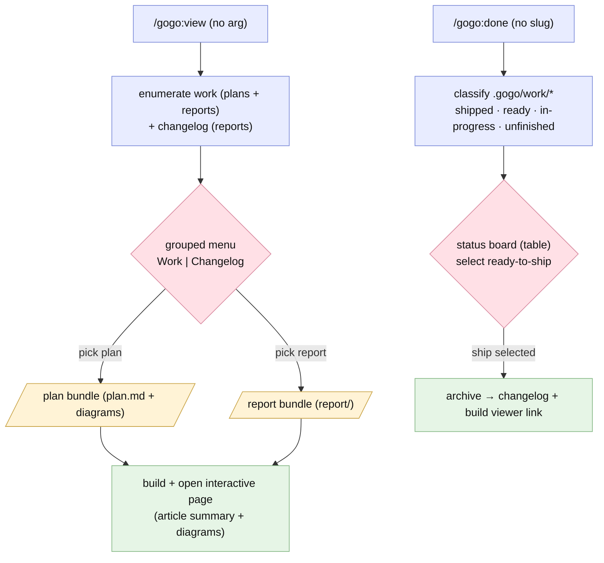

# Plan — Viewer selection menu · plan/report view-bundles · friendlier output · /gogo:done work board

Status: **BUILT / report-complete** (2026-07-01) — shipped as planned, all green. Accepted 2026-07-01 with D1=A, D2=B, D3=A, D4=A, D5=A. Delivered in two stages: **A** (items 1-3: view grouped menu · plan bundle · friendlier output) · **B** (item 4: interactive terminal-TUI kanban — vendored `python3` curses `board.py` in tmux, with the status-table + `AskUserQuestion` multi-select fallback). Released as **`plugin.json` 0.7.0** (command count unchanged at 12). See the as-built report at [`report/report.md`](report/report.md).

> **As-built note (planned vs shipped).** Roadmap items 1-4 shipped essentially as planned. The one material scope change was set at planning time, not during the build: **D2 was upgraded from a simple status table (A) to a fully interactive kanban (B)**, which grew item 4 into its own **Stage B** and raised **D5** (the kanban mechanism → terminal TUI, `python3`/`tmux` as **soft deps** with graceful fallback). Stages A and B both landed green (review: 6 verified + 1 wontfix; test: 1 verified + 1 wontfix). The `.gitignore` picked up two intentional entries that rode this branch — `roadmap.md` (internal backlog, REV-004 wontfix) and `__pycache__/`+`*.pyc` (TEST-002, so the vendored `board.py` never drags in compiled bytecode). Roadmap items 5-10 remain out of scope (see Follow-ups in the report).

## Goal
Roadmap items **1–4** — make gogo's plans/reports easy to browse and ship:

1. **`/gogo:view` selection menu** — pick what to view: **Work** (in-progress
   features' **plans** + **reports**) or **Changelog** (shipped reports).
2. **Plan & report as viewable bundles** — `/gogo:plan` produces a plan bundle that
   `/gogo:view` renders like a report (reports already live in `report/`).
3. **Friendlier plans & reports** — article-like prose, **bold** the important
   parts, clean structure (authoring + rendering).
4. **`/gogo:done` work board** — show all `.gogo/work` items by status (shipped /
   ready-to-ship / in-progress / unfinished) and let the user pick which to ship.

## Context — what exists today
- **`/gogo:view`** (`skills/gogo-view`) enumerates reports from `.gogo/changelog/*/`
  and `.gogo/work/feature-*/report/` (+ legacy root `report.md`), **defaults to the
  newest** (asks only when ambiguous), builds `.gogo/resources/view/<name>.html`
  (0.6.0 interactive renderer) and opens it. It does **not** surface **plans**, and
  the "menu" is only a tie-breaker.
- **`/gogo:plan`** writes `plan.md` at the **feature root** + intended-design and
  `charts/before/` diagrams under `charts/`. There is no plan *bundle* the viewer
  treats as a first-class thing (only reports render today).
- **Reports** already live in a `report/` bundle (`report/report.md` + UML +
  `diagrams.html` + `manifest.json`) — the symmetric target for plans.
- **`/gogo:done`** (`skills/gogo-done`) ships **one** feature: `--slug` or, without
  it, auto-picks the newest report-complete one. No overview/board of all work.
- **`/gogo:status`** already enumerates every `.gogo/work/feature-*` with phase /
  status / iterations — the natural data source for the board (#4).
- **Report/plan authoring** (`gogo-knowledge`, `gogo-plan`) + the viewer's md→HTML
  (`gogo-view` Step 3 + `viewer.css`) produce correct but fairly dry output.
- **Constraints** (`.gogo/knowledge/`): offline / zero-dep / no-build; only write
  under `.gogo/`; `AskUserQuestion` is the in-terminal menu mechanism; keep
  enumerations in sync; bump `plugin.json`.

## Functional requirements
- **FR1 — `/gogo:view` grouped selection menu.** With no resolvable arg, present a
  grouped picker (via `AskUserQuestion`): **Work → <feature> (plan | report)** and
  **Changelog → <date>-<slug> (report)**, newest first. The chosen item builds +
  opens as the interactive page. An explicit arg (slug / changelog entry / path,
  optionally `:plan`/`:report`) still resolves directly, no menu. Enumeration now
  includes **plans**, not just reports.
- **FR2 — Plan is a viewable bundle.** `/gogo:view` can render a feature's **plan**
  (its `plan.md` + its diagrams) with the same interactive renderer as reports.
  `/gogo:plan` ensures the plan's diagrams are a coherent set the viewer can read
  (see D1 for whether the plan bundle stays in place — `plan.md` + `charts/` — or
  moves to a `plan/` folder symmetric with `report/`).
- **FR3 — Friendlier plans & reports.** `gogo-plan` and `gogo-knowledge` author
  **article-style** output: a strong lead summary, short scannable sections, and
  **bold** on the decisions / outcomes / key terms (not walls of text). `gogo-view`
  renders it with article typography (readable measure, styled headings, a lead
  paragraph, visible emphasis / callouts). No change to *what* they contain — only
  legibility.
- **FR4 — `/gogo:done` interactive work board (D2=B — now in scope).** A shared
  **work-index** step classifies every `.gogo/work/feature-*` (reusing `/gogo:status`
  data): **shipped** (changelog entry / `status: shipped`), **ready-to-ship**
  (`report/report.md` exists, not shipped), **in-progress** (mid-pipeline),
  **unfinished** (no final report). `/gogo:done` (no slug) opens an **interactive
  kanban** of these columns where the user moves a card to **ship** it; a slug still
  ships one directly. **The board mechanism is D5** (terminal TUI vs offline HTML
  vs hybrid) — the load-bearing open fork, because a `file://` page can't execute
  `/gogo:done`. A plain **status table + `AskUserQuestion` multi-select** is the
  guaranteed fallback whenever the interactive surface is unavailable (no tmux /
  python / browser).
- **FR5 — Docs + version + sync.** Update `docs/*` (view/commands/flow) + README
  for the menu, plan-viewing, and the done board; bump `plugin.json`; keep
  enumerations in sync.

## Approach (recommended) — two stages
D2=B grew item 4 into its own stage, so deliver in two stages (lower-risk first):

**Stage A — items 1-3 (view menu · plan bundle · friendlier output).** Build on the
0.6.0 viewer + `gogo-status` enumeration; offline / in-terminal.
1. **View menu + plan rendering (FR1/FR2)** — extend `gogo-view`: enumerate plans +
   reports grouped Work/Changelog; add a plan-bundle build path (render `plan.md` +
   its diagrams in place — D1=A). `gogo-plan` guarantees the plan diagram set is
   viewer-ready.
2. **Friendlier output (FR3)** — article/bold authoring guidance in `gogo-plan` +
   `gogo-knowledge`; polish `viewer.css` summary typography.
3. Also build the shared **work-index** classifier (used by Stage B + `gogo-status`).

**Stage B — item 4 (interactive kanban, FR4).** Per **D5** (mechanism):
- the interactive board (drag a card → ship), driven by the **shared work-index
  classifier** — built in Stage A and documented in `skills/gogo-status/SKILL.md`
  (Step A: classify each `.gogo/work/feature-*` as shipped / ready-to-ship /
  in-progress / unfinished, with the record output shape the board consumes);
- always with the **status table + `AskUserQuestion` multi-select fallback** when the
  interactive surface isn't available (same classifier, rendered as a table).

**Then:** sync + version (FR5).

### Alternatives considered
- **Move the plan to a `plan/` folder** (D1=B) — rejected for now: `plan.md` is the
  contract path across every phase; view it in place instead.
- **A generated HTML index page for the view menu** — rejected: an in-terminal
  `AskUserQuestion` menu is simpler; the chosen item still opens the rich HTML page.
- **Board mechanism** — see D5: a `file://` HTML kanban can't run `/gogo:done`, so a
  true drag→ship board needs a local terminal process; the trade-offs are the fork.

## Open decisions (see `decisions.md`)
- **D1 — Plan bundle location.** RESOLVED **A** — keep `plan.md` at the feature root;
  view in place (plan.md + charts/).
- **D2 — Done board interactivity.** RESOLVED **B** — build the interactive kanban now
  (item 4 → Stage B); mechanism = D5.
- **D3 — View menu mechanism.** RESOLVED **A** — `AskUserQuestion` grouped picker.
- **D4 — Friendlier-output scope.** RESOLVED **A** — authoring guidance + viewer CSS;
  no redesign.
- **D5 — Interactive kanban mechanism.** RESOLVED **A** — terminal TUI in a tmux
  pane (vendored `python3` curses) that truly ships on drop; `python3`/`tmux` are
  **soft deps** with graceful fallback to the status table + `AskUserQuestion`
  multi-select. Shared base for roadmap #7's plan/decision commenter.

## Changes checklist (build order)
1. `skills/gogo-view/SKILL.md` — grouped Work/Changelog enumeration incl. **plans**;
   the plan-bundle build path; the arg grammar (`<slug>[:plan|:report]`).
2. `skills/gogo-plan/SKILL.md` — ensure the plan's diagrams are a viewer-ready set;
   article/bold authoring guidance (FR3).
3. `skills/gogo-knowledge/SKILL.md` — article/bold report authoring guidance (FR3).
4. `assets/viewer/viewer.css` — summary/article typography (lead paragraph, headings,
   emphasis/callouts). (Re-copied to `.gogo/resources/viewer/` by the skills.)
5. `skills/gogo-done/SKILL.md` — no-slug **board mode**: classify every work item,
   render the status table, multi-select ready items, ship each. Reuse a shared
   work-index step.
6. `skills/gogo-status/SKILL.md` (if present) / `commands/status.md` — share the
   status classifier (optional; keep `status` read-only).
7. `docs/{commands,flow,architecture}.md` + `README.md` — the menu, plan-viewing,
   the board; `.claude-plugin/plugin.json` version bump; enumeration sync.

## Tests (how we'll verify — see `test-strategy.md`)
- **FR1/FR2:** `/gogo:view` with no arg lists Work (plans + reports) + Changelog
  and, on a pick, builds+opens the right bundle; `/gogo:view <slug>:plan` renders the
  plan; a plan page renders its diagrams (Playwright: the plan bundle opens, diagrams
  interactive). Explicit-arg path still bypasses the menu.
- **FR3:** a generated plan/report page shows article typography — a lead summary,
  styled headings, visible bold; verify structurally + a browser screenshot.
- **FR4:** on a fixture `.gogo/work` with mixed states, `/gogo:done` (no slug) renders
  the correct status table (shipped / ready / in-progress / unfinished) and
  multi-selecting ready items ships exactly those (archive + link each); a slug still
  ships one; nothing shipped that isn't report-complete.
- **FR5:** docs/enumerations in sync; version bumped; offline throughout.

## Out of scope
- The **line-by-line plan/decision commenter** (roadmap **#7**) — only its board
  machinery is pulled forward here (the interactive kanban, per D2=B/D5). The
  commenter (read a plan line by line, comment each, comment decisions) stays #7.
- DevOps knowledge file (#5), YOLO mode (#6), custom-agent injection (#8),
  multi/mono-repo (#9), Claude Design (#10) — later roadmap items.
- Changing plan/report *content/structure* — FR3 is legibility only.

## Diagrams (intended design)
The new view/done UX flow. Also `charts/view-done-flow.mmd`; the as-is baseline is in
`charts/before/`; open `charts/diagrams.html`.

